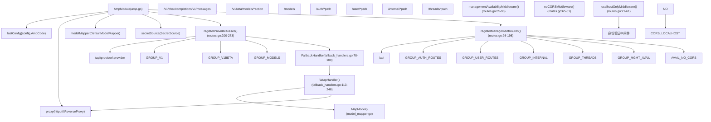
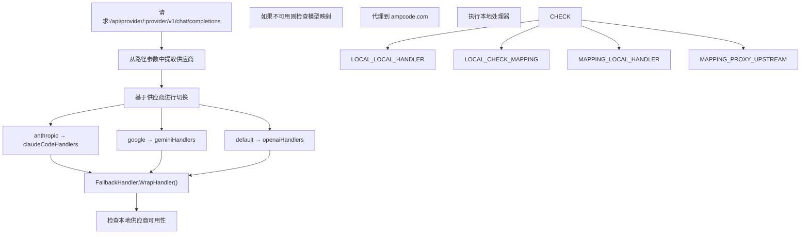
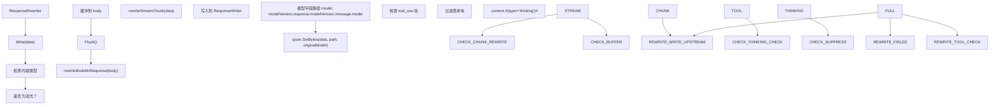
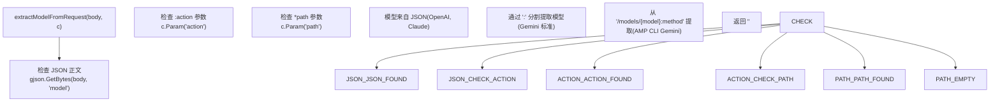
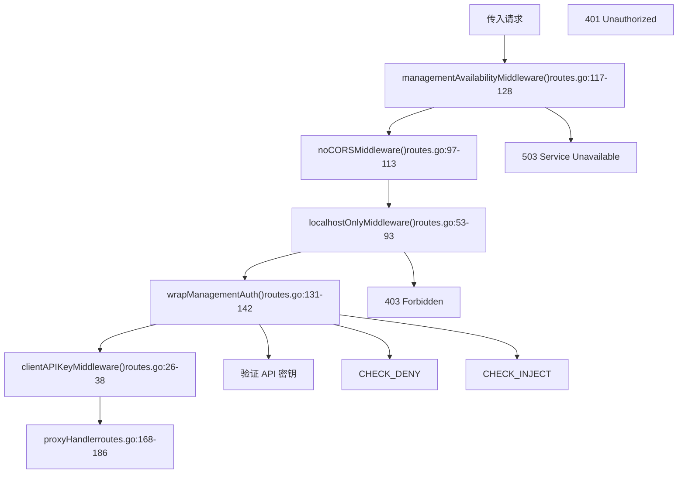
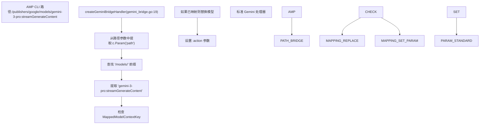

# Amp CLI 集成

相关源文件

-   [internal/api/modules/amp/amp.go](https://github.com/router-for-me/CLIProxyAPI/blob/c66cb0af/internal/api/modules/amp/amp.go)
-   [internal/api/modules/amp/amp\_test.go](https://github.com/router-for-me/CLIProxyAPI/blob/c66cb0af/internal/api/modules/amp/amp_test.go)
-   [internal/api/modules/amp/fallback\_handlers.go](https://github.com/router-for-me/CLIProxyAPI/blob/c66cb0af/internal/api/modules/amp/fallback_handlers.go)
-   [internal/api/modules/amp/fallback\_handlers\_test.go](https://github.com/router-for-me/CLIProxyAPI/blob/c66cb0af/internal/api/modules/amp/fallback_handlers_test.go)
-   [internal/api/modules/amp/gemini\_bridge.go](https://github.com/router-for-me/CLIProxyAPI/blob/c66cb0af/internal/api/modules/amp/gemini_bridge.go)
-   [internal/api/modules/amp/gemini\_bridge\_test.go](https://github.com/router-for-me/CLIProxyAPI/blob/c66cb0af/internal/api/modules/amp/gemini_bridge_test.go)
-   [internal/api/modules/amp/model\_mapping.go](https://github.com/router-for-me/CLIProxyAPI/blob/c66cb0af/internal/api/modules/amp/model_mapping.go)
-   [internal/api/modules/amp/model\_mapping\_test.go](https://github.com/router-for-me/CLIProxyAPI/blob/c66cb0af/internal/api/modules/amp/model_mapping_test.go)
-   [internal/api/modules/amp/proxy.go](https://github.com/router-for-me/CLIProxyAPI/blob/c66cb0af/internal/api/modules/amp/proxy.go)
-   [internal/api/modules/amp/proxy\_test.go](https://github.com/router-for-me/CLIProxyAPI/blob/c66cb0af/internal/api/modules/amp/proxy_test.go)
-   [internal/api/modules/amp/response\_rewriter.go](https://github.com/router-for-me/CLIProxyAPI/blob/c66cb0af/internal/api/modules/amp/response_rewriter.go)
-   [internal/api/modules/amp/response\_rewriter\_test.go](https://github.com/router-for-me/CLIProxyAPI/blob/c66cb0af/internal/api/modules/amp/response_rewriter_test.go)
-   [internal/api/modules/amp/routes.go](https://github.com/router-for-me/CLIProxyAPI/blob/c66cb0af/internal/api/modules/amp/routes.go)
-   [internal/api/modules/amp/routes\_test.go](https://github.com/router-for-me/CLIProxyAPI/blob/c66cb0af/internal/api/modules/amp/routes_test.go)
-   [internal/api/modules/amp/secret.go](https://github.com/router-for-me/CLIProxyAPI/blob/c66cb0af/internal/api/modules/amp/secret.go)
-   [internal/api/modules/amp/secret\_test.go](https://github.com/router-for-me/CLIProxyAPI/blob/c66cb0af/internal/api/modules/amp/secret_test.go)

`AmpModule` 通过三个子系统提供 Amp CLI 集成的 HTTP 路由：供应商特定别名路由 (`/api/provider/{provider}/*`)、管理代理路由 (`/api/auth/*`, `/api/user/*` 等)，以及当本地供应商不可用时将请求路由到 ampcode.com 的回退逻辑（fallback logic）。该模块还包含模型映射能力，用于将不可用的模型请求重定向到备选的本地模型。

有关通用 API 端点文档，请参阅[API 参考](/router-for-me/CLIProxyAPI/4-api-reference)。有关配置选项，请参阅[配置文件结构](/router-for-me/CLIProxyAPI/5.1-configuration-file-structure)。

---

## 概览

`AmpModule` 实现了 `RouteModuleV2` 接口，并注册了三个路由子系统：

1.  **供应商别名路由** - 匹配 `/api/provider/{provider}/v1/*` 的路由根据供应商名称转发到本地处理器。
2.  **管理路由** - 匹配 `/api/auth/*`, `/api/user/*`, `/api/internal/*` 等的路由代理到 ampcode.com 用于 OAuth 流程。
3.  **回退系统** - `FallbackHandler` 检查本地供应商的可用性，应用模型映射（如果已配置），或代理到 ampcode.com。

支持对 `upstream-url`, `upstream-api-key`, `upstream-api-keys`, `model-mappings`, `force-model-mappings` 和 `restrict-management-to-localhost` 配置更改的热重载。

**来源：** [internal/api/modules/amp/amp.go1-429](https://github.com/router-for-me/CLIProxyAPI/blob/c66cb0af/internal/api/modules/amp/amp.go#L1-L429) [internal/api/modules/amp/routes.go1-335](https://github.com/router-for-me/CLIProxyAPI/blob/c66cb0af/internal/api/modules/amp/routes.go#L1-L335)

---

## 模块架构


**来源：** [internal/api/modules/amp/amp.go27-44](https://github.com/router-for-me/CLIProxyAPI/blob/c66cb0af/internal/api/modules/amp/amp.go#L27-L44) [internal/api/modules/amp/routes.go98-273](https://github.com/router-for-me/CLIProxyAPI/blob/c66cb0af/internal/api/modules/amp/routes.go#L98-L273)

---

## 供应商别名路由

供应商别名路由允许 Amp CLI 在 URL 路径中显式指定目标供应商。这实现了供应商特定的路由，而无需检查模型名称。

### 路由结构

所有路由都在 `registerProviderAliases()` 中注册，并使用 `FallbackHandler.WrapHandler()` 进行包装。

| 路由模式 | 支持的供应商 | 处理器 |
| --- | --- | --- |
| `/api/provider/:provider/models` | `openai`, `anthropic`, `google`, `groq`, `cerebras` | `ampModelsHandler` |
| `/api/provider/:provider/chat/completions` | 兼容 OpenAI | `openaiHandlers.ChatCompletions` |
| `/api/provider/:provider/v1/chat/completions` | 兼容 OpenAI | `openaiHandlers.ChatCompletions` |
| `/api/provider/:provider/v1/messages` | `anthropic` | `claudeCodeHandlers.ClaudeMessages` |
| `/api/provider/:provider/v1/messages/count_tokens` | `anthropic` | `claudeCodeHandlers.ClaudeCountTokens` |
| `/api/provider/:provider/v1beta/models/*action` | `google` | `geminiHandlers.GeminiHandler` |
| `/api/provider/:provider/completions` | 兼容 OpenAI | `openaiHandlers.Completions` |
| `/api/provider/:provider/responses` | 兼容 OpenAI | `openaiResponsesHandlers.Responses` |

### 处理器选择


**来源：** [internal/api/modules/amp/routes.go265-334](https://github.com/router-for-me/CLIProxyAPI/blob/c66cb0af/internal/api/modules/amp/routes.go#L265-L334) [internal/api/modules/amp/fallback\_handlers.go113-272](https://github.com/router-for-me/CLIProxyAPI/blob/c66cb0af/internal/api/modules/amp/fallback_handlers.go#L113-L272)

---

## 回退处理器系统 (Fallback Handler System)

`FallbackHandler` 包装请求处理器，以实现基于供应商可用性和模型映射配置的路由决策。当模型供应商在本地不可用时，处理器要么对可用的备选模型应用配置好的模型映射，要么将请求转发到 ampcode.com。应用映射时，响应重写会还原原始模型名称。

### 路由决策流程

> **[Mermaid sequence]**
> *(图表结构无法解析)*

### 路由类型日志记录

系统使用结构化字段记录路由决策以供观察：

| 路由类型 | 含义 | 成本 | 日志级别 |
| --- | --- | --- | --- |
| `RouteTypeLocalProvider` | 请求由本地 OAuth 供应商处理 | 免费 | Debug |
| `RouteTypeModelMapping` | 请求映射到备选本地模型 | 免费 | Debug |
| `RouteTypeAmpCredits` | 请求转发到 ampcode.com | 使用 Amp 额度 | Warn |
| `RouteTypeNoProvider` | 无供应商或回退可用 | 无 | Warn |

**来源：** [internal/api/modules/amp/fallback\_handlers.go18-76](https://github.com/router-for-me/CLIProxyAPI/blob/c66cb0af/internal/api/modules/amp/fallback_handlers.go#L18-L76) [internal/api/modules/amp/fallback\_handlers.go113-272](https://github.com/router-for-me/CLIProxyAPI/blob/c66cb0af/internal/api/modules/amp/fallback_handlers.go#L113-L272)

### 响应重写 (Response Rewriting)

当应用模型映射时，`ResponseRewriter` 透明地还原响应中的原始模型名称，以确保客户端兼容性。它同时处理流式和非流式响应。


**Amp 兼容性过滤器：** `rewriteModelInResponse()` 检查是否存在 `content.#(type=="tool_use")` 块。如果发现，它会将 `content` 数组过滤为 `content.#(type!="thinking")#` 以移除思考块，因为当同时存在这两种块类型时，Amp 客户端无法正确渲染工具调用。

**来源：** [internal/api/modules/amp/response\_rewriter.go14-128](https://github.com/router-for-me/CLIProxyAPI/blob/c66cb0af/internal/api/modules/amp/response_rewriter.go#L14-L128)

### Anthropic-Beta 标头过滤

`filterAntropicBetaHeader()` 调用 `filterBetaFeatures()` 从 `Anthropic-Beta` 请求标头中移除仅限订阅的功能。目前过滤 `context-1m-2025-08-07`。仅应用于本地供应商路由，在代理到 ampcode.com 时不应用。

**来源：** [internal/api/modules/amp/fallback\_handlers.go276-284](https://github.com/router-for-me/CLIProxyAPI/blob/c66cb0af/internal/api/modules/amp/fallback_handlers.go#L276-L284) [internal/api/modules/amp/filter\_anthropic\_beta.go10-37](https://github.com/router-for-me/CLIProxyAPI/blob/c66cb0af/internal/api/modules/amp/filter_anthropic_beta.go#L10-L37)

---

## 模型映射 (Model Mapping)

模型映射可以将不可用的模型路由到本地可用的备选模型。这对于希望使用本地 OAuth 供应商而不是 Amp 额度的 Amp CLI 用户特别有用。

### 配置模式

该模块支持由 `ampcode.force-model-mappings` 控制的两种模型映射模式：

| 模式 | 行为 | 使用场景 |
| --- | --- | --- |
| `false` (默认) | 首先检查本地供应商，然后将映射作为回退应用 | 优先使用本地精确匹配 |
| `true` | 首先检查映射，然后回退到本地供应商 | 优先使用映射模型而非原始模型 |

### 模型提取

`extractModelFromRequest()` 函数处理多种请求格式：


**来源：** [internal/api/modules/amp/fallback\_handlers.go300-332](https://github.com/router-for-me/CLIProxyAPI/blob/c66cb0af/internal/api/modules/amp/fallback_handlers.go#L300-L332)

---

## 管理路由

管理路由将请求代理到 Amp 控制平面，用于 OAuth 流程、用户管理和遥测。这些路由受多层中间件保护。

### 安全中间件栈

管理路由的中间件栈顺序：


### 本地主机限制 (Localhost Restriction)

`localhostOnlyMiddleware()` 检查 `m.IsRestrictedToLocalhost()`（可热重载），并在启用时强制执行以下规则：

-   使用 `net.SplitHostPort()` 从 `c.Request.RemoteAddr` 中提取 IP
-   使用 `net.ParseIP()` 解析 IP，并使用 `IP.IsLoopback()` 进行验证
-   对非回环 IP（IPv4 和 IPv6）返回 `403 Forbidden`
-   无法通过 `X-Forwarded-For` 或其他客户端标头绕过

### 管理路由模式

| 模式 | 用途 | 是否需要认证 | 示例用法 |
| --- | --- | --- | --- |
| `/api/auth/*path` | OAuth 流程 | 绕过 | `/api/auth/cli-login` |
| `/api/user/*path` | 用户账号操作 | 是 | `/api/user/profile` |
| `/api/internal/*path` | 内部操作 | 是 | `/api/internal/health` |
| `/api/threads/*path` | 线程管理 | 绕过 | `/api/threads/123` |
| `/api/meta` | 元数据端点 | 是 | `/api/meta` |
| `/api/telemetry/*path` | 遥测数据 | 是 | `/api/telemetry/events` |
| `/api/otel/*path` | OpenTelemetry | 是 | `/api/otel/trace` |
| `/api/tab/*path` | 标签页管理 | 是 | `/api/tab/active` |
| `/threads` | 根级线程 | 绕过 | `/threads` |
| `/auth/*path` | 根级认证 | 绕过 | `/auth/callback` |
| `/docs/*path` | 文档 | 绕过 | `/docs` |
| `/settings/*path` | 设置 | 绕过 | `/settings` |

**认证绕过：** [internal/api/modules/amp/routes.go131-142](https://github.com/router-for-me/CLIProxyAPI/blob/c66cb0af/internal/api/modules/amp/routes.go#L131-L142) 中的 `wrapManagementAuth()` 为匹配 `/threads`, `/auth`, `/docs` 或 `/settings` 前缀的路径绕过身份验证。所有其他管理路由均需要有效的 API 密钥认证。

**来源：** [internal/api/modules/amp/routes.go53-93](https://github.com/router-for-me/CLIProxyAPI/blob/c66cb0af/internal/api/modules/amp/routes.go#L53-L93) [internal/api/modules/amp/routes.go117-128](https://github.com/router-for-me/CLIProxyAPI/blob/c66cb0af/internal/api/modules/amp/routes.go#L117-L128) [internal/api/modules/amp/routes.go144-257](https://github.com/router-for-me/CLIProxyAPI/blob/c66cb0af/internal/api/modules/amp/routes.go#L144-L257)

---

## Gemini 桥接 (Gemini Bridge)

Gemini 桥接通过重写请求以匹配标准 Gemini 处理器的预期格式，来处理 Amp CLI 的非标准 Gemini API 路径格式。

### 路径转换


桥接器支持模型映射集成：

1.  检查 Gin 上下文中的 `MappedModelContextKey`（由 `FallbackHandler` 设置）
2.  如果发现，替换模型名称，同时保留方法（`:streamGenerateContent`, `:generateContent` 等）
3.  将修改后的值设置为标准处理器的 `:action` 参数

**来源：** [internal/api/modules/amp/gemini\_bridge.go9-60](https://github.com/router-for-me/CLIProxyAPI/blob/c66cb0af/internal/api/modules/amp/gemini_bridge.go#L9-L60)

---

## 上游代理配置 (Upstream Proxy Configuration)

当本地供应商不可用时，上游代理将请求转发到 ampcode.com。它包含自动 gzip 解压和 API 密钥注入功能。

### 代理创建

```mermaid
flowchart TD
    CREATE["createReverseProxy(upstreamURL, secretSource)"]
    PARSE["url.Parse(upstreamURL)"]
    NEW_PROXY["httputil.NewSingleHostReverseProxy(parsed)"]
    DIRECTOR["配置 Director(修改传出请求)"]
    MODIFY_RESP["配置 ModifyResponse(处理 gzip)"]
    ERROR_HANDLER["配置 ErrorHandler"]
    DEL_AUTH["删除客户端 Authorization 标头"]
    INJECT_KEY["secretSource.Get(ctx)"]
    SET_AUTH["设置 X-Api-Key, Authorization 标头"]
    SET_HOST["设置 req.Host = parsed.Host"]
    CHECK_STATUS["如果状态码 < 200 或 >= 300 则跳过"]
    CHECK_CE["如果设置了 Content-Encoding 则跳过"]
    CHECK_STREAM["如果为 SSE (text/event-stream) 则跳过"]
    PEEK["预读前 2 个字节"]
    CHECK_GZIP["检查 0x1f 0x8b magic bytes"]
    DECOMPRESS["使用 gzip.Reader 解压"]
    UPDATE_BODY["替换 resp.Body"]
    UPDATE_HEADERS["更新 Content-Length, 移除 Content-Encoding"]

    CREATE --> PARSE
    PARSE --> NEW_PROXY
    NEW --> PROXY_DIRECTOR
    DIRECTOR --> DEL_AUTH
    DEL --> AUTH_INJECT_KEY
    INJECT --> KEY_SET_AUTH
    SET --> AUTH_SET_HOST
    NEW --> PROXY_MODIFY_RESP
    MODIFY --> RESP_CHECK_STATUS
    CHECK --> STATUS_CHECK_CE
    CHECK --> CE_CHECK_STREAM
    CHECK --> STREAM_PEEK
    PEEK --> CHECK_GZIP
    CHECK --> GZIP_DECOMPRESS
    DECOMPRESS --> UPDATE_BODY
    UPDATE --> BODY_UPDATE_HEADERS
```


### Gzip 处理

[internal/api/modules/amp/proxy.go84-148](https://github.com/router-for-me/CLIProxyAPI/blob/c66cb0af/internal/api/modules/amp/proxy.go#L84-L148) 中的 `ModifyResponse` 函数处理配置错误的上游：

1.  如果 `resp.Header.Get("Content-Encoding")` 非空则跳过
2.  如果 `Content-Type` 包含 `text/event-stream` 则跳过
3.  如果状态码 < 200 或 >= 300 则跳过
4.  使用 `peekableReadCloser` 检查前 2 个字节是否为 gzip magic (`0x1f`, `0x8b`)
5.  如果检测到 gzip，则使用 `gzip.NewReader()` 封装正文进行解压，更新 `Content-Length` 并移除 `Content-Encoding`

### 错误恢复

[internal/api/modules/amp/routes.go168-186](https://github.com/router-for-me/CLIProxyAPI/blob/c66cb0af/internal/api/modules/amp/routes.go#L168-L186) 中的 `proxyHandler` 包含延迟的 panic 恢复逻辑：

```
defer func() {    if rec := recover(); rec != nil {        if err, ok := rec.(error); ok && errors.Is(err, http.ErrAbortHandler) {            return // 静默恢复 - 在客户端断开连接时属预期行为        }        panic(rec) // 对于其他错误重新触发 panic    }}()
```
这会静默处理在 `httputil.ReverseProxy.copyResponse()` 于客户端/流结束前写入状态时发生的 `http.ErrAbortHandler` panic。

**来源：** [internal/api/modules/amp/proxy.go28-163](https://github.com/router-for-me/CLIProxyAPI/blob/c66cb0af/internal/api/modules/amp/proxy.go#L28-L163) [internal/api/modules/amp/routes.go168-186](https://github.com/router-for-me/CLIProxyAPI/blob/c66cb0af/internal/api/modules/amp/routes.go#L168-L186)

---

## 密钥管理 (Secret Management)

Amp 模块支持多个 API 密钥源，并具备基于优先级的查找、缓存以及针对多租户场景的逐客户端上游路由功能。

### 架构

密钥管理系统由两层组成：

1.  **`MultiSourceSecret`** - 处理来自配置、环境或文件的默认 API 密钥解析
2.  **`MappedSecretSource`** - 封装 `MultiSourceSecret` 以提供逐客户端的上游路由

```mermaid
flowchart TD
    REQUEST["带有客户端 API 密钥的请求"]
    MIDDLEWARE["clientAPIKeyMiddleware(routes.go:24-38)"]
    INJECT["将客户端密钥注入请求上下文"]
    PROXY_DIRECTOR["代理 Director 函数"]
    GET_SECRET["MappedSecretSource.Get(ctx)"]
    EXTRACT_CLIENT["getClientAPIKeyFromContext(ctx)"]
    CHECK_MAPPING["检查 upstream-api-keys 是否匹配客户端密钥"]
    FALLBACK["MultiSourceSecret.Get(ctx)"]
    CHECK_EXPLICIT["检查 explicitKey(config upstream-api-key)"]
    CHECK_ENV["检查 AMP_API_KEY 环境变量"]
    CHECK_CACHE["检查文件缓存"]
    READ_FILE["读取 ~/.local/share/amp/secrets.json"]
    RETURN["返回上游 API 密钥"]

    REQUEST --> MIDDLEWARE
    MIDDLEWARE --> INJECT
    INJECT --> PROXY_DIRECTOR
    PROXY --> DIRECTOR_GET_SECRET
    GET --> SECRET_EXTRACT_CLIENT
    EXTRACT --> CLIENT_CHECK_MAPPING
    CHECK --> MAPPING_RETURN
    CHECK --> MAPPING_FALLBACK
    FALLBACK --> CHECK_EXPLICIT
    CHECK --> EXPLICIT_RETURN
    CHECK --> EXPLICIT_CHECK_ENV
    CHECK --> ENV_RETURN
    CHECK --> ENV_CHECK_CACHE
    CHECK --> CACHE_RETURN
    CHECK --> CACHE_READ_FILE
    READ --> FILE_RETURN
```


### 逐客户端上游路由

`MappedSecretSource` 实现了多租户部署，不同的客户端可以使用不同的 Amp 上游账号：

| 组件 | 文件 | 用途 |
| --- | --- | --- |
| `clientAPIKeyMiddleware` | [internal/api/modules/amp/routes.go24-38](https://github.com/router-for-me/CLIProxyAPI/blob/c66cb0af/internal/api/modules/amp/routes.go#L24-L38) | 从 `gin.Context["apiKey"]` 提取客户端 API 密钥并注入请求上下文 |
| `getClientAPIKeyFromContext` | [internal/api/modules/amp/routes.go42-49](https://github.com/router-for-me/CLIProxyAPI/blob/c66cb0af/internal/api/modules/amp/routes.go#L42-L49) | 从请求上下文中检索客户端密钥用于查询 |
| `MappedSecretSource` | [internal/api/modules/amp/secret.go169-265](https://github.com/router-for-me/CLIProxyAPI/blob/c66cb0af/internal/api/modules/amp/secret.go#L169-L265) | 使用 `upstream-api-keys` 配置将客户端密钥映射到上游密钥 |

### 默认密钥源优先级

当不存在客户端特定的映射时，`MultiSourceSecret` 解析默认密钥：

| 级别 | 来源 | 是否缓存 | 是否可热重载 |
| --- | --- | --- | --- |
| 1 (最高) | `config.yaml`: `ampcode.upstream-api-key` | 否 | 是 |
| 2 | 环境变量: `AMP_API_KEY` | 否 | 否 |
| 3 (最低) | 文件: `~/.local/share/amp/secrets.json` | 是 (5 分钟 TTL) | 否 |

### 文件格式

位于 `~/.local/share/amp/secrets.json` 的密钥文件应包含：

```
{  "apiKey@https://ampcode.com/": "sk-amp-..."}
```
**来源：** [internal/api/modules/amp/secret.go14-265](https://github.com/router-for-me/CLIProxyAPI/blob/c66cb0af/internal/api/modules/amp/secret.go#L14-L265) [internal/api/modules/amp/routes.go22-49](https://github.com/router-for-me/CLIProxyAPI/blob/c66cb0af/internal/api/modules/amp/routes.go#L22-L49)

---

## 热重载支持

Amp 模块支持对多种配置设置的热重载，而无需重启服务。

### 可重载配置

```mermaid
flowchart TD
    ON_CONFIG["OnConfigUpdated(cfg)"]
    COMPARE["与 lastConfig 比较"]
    LOCALHOST["RestrictManagementToLocalhost"]
    UPSTREAM_URL["UpstreamURL"]
    UPSTREAM_KEY["UpstreamAPIKey"]
    UPSTREAM_KEYS["UpstreamAPIKeys"]
    MODEL_MAP["ModelMappings"]
    FORCE_MAP["ForceModelMappings"]
    SET_RESTRICT["setRestrictToLocalhost()"]
    ENABLE_PROXY["enableUpstreamProxy()"]
    CREATE_PROXY["createReverseProxy()"]
    UPDATE_SECRET["secretSource.UpdateExplicitKey()"]
    UPDATE_MAPPINGS["secretSource.UpdateMappings()"]
    UPDATE_MAPPER["modelMapper.UpdateMappings()"]
    DISABLE["setProxy(nil)"]

    ON --> CONFIG_COMPARE
    COMPARE --> LOCALHOST
    COMPARE --> UPSTREAM_URL
    COMPARE --> UPSTREAM_KEY
    COMPARE --> UPSTREAM_KEYS
    COMPARE --> MODEL_MAP
    LOCALHOST --> SET_RESTRICT
    UPSTREAM --> URL_ENABLE_PROXY
    UPSTREAM --> URL_CREATE_PROXY
    UPSTREAM --> URL_DISABLE
    UPSTREAM --> KEY_UPDATE_SECRET
    UPSTREAM --> KEYS_UPDATE_MAPPINGS
    MODEL --> MAP_UPDATE_MAPPER
```


### 实现细节

| 设置 | 变更检测 | 更新操作 | 是否线程安全 |
| --- | --- | --- | --- |
| `upstream-url` | 字符串比较 | 使用 `proxyMu` 锁重新创建代理 | 是 |
| `upstream-api-key` | 字符串比较 | `UpdateDefaultExplicitKey()`，使缓存失效 | 是 |
| `upstream-api-keys` | 深度比较 | 在 `MappedSecretSource` 上调用 `UpdateMappings()` | 是 |
| `model-mappings` | 深度比较 | `modelMapper.UpdateMappings()` | 是 |
| `restrict-management-to-localhost` | 布尔比较 | 使用 `restrictMu` 调用 `setRestrictToLocalhost()` | 是 |
| `force-model-mappings` | 通过 `forceModelMappings()` 读取 | 不适用（只读标志） | 是 |

**来源：** [internal/api/modules/amp/amp.go181-259](https://github.com/router-for-me/CLIProxyAPI/blob/c66cb0af/internal/api/modules/amp/amp.go#L181-L259) [internal/api/modules/amp/amp.go294-395](https://github.com/router-for-me/CLIProxyAPI/blob/c66cb0af/internal/api/modules/amp/amp.go#L294-L395)

---

## 请求流示例

### 示例 1：本地供应商可用

```
1. 请求: POST /api/provider/openai/v1/chat/completions
   正文: {"model": "gpt-4", "messages": [...]}

2. FallbackHandler.WrapHandler()
   - 提取模型: "gpt-4"
   - 规范化: "gpt-4" (无思考后缀)
   - 检查 forceModelMappings(): false
   - GetProviderName("gpt-4"): ["openai"]
   - providers.length > 0 → LOCAL_PROVIDER

3. 执行 openaiHandlers.ChatCompletions(c)
   - 使用本地 OAuth 凭据
   - 返回响应 (免费)

4. 日志: "amp using local provider for model: gpt-4"
```
### 示例 2：应用模型映射

```
1. 请求: POST /api/provider/anthropic/v1/messages
   正文: {"model": "claude-sonnet-4-20250514", "messages": [...]}

2. FallbackHandler.WrapHandler()
   - 提取模型: "claude-sonnet-4-20250514"
   - 规范化: "claude-sonnet-4-20250514"
   - 检查 forceModelMappings(): false
   - GetProviderName("claude-sonnet-4-20250514"): []
   - 本地供应商不可用
   - modelMapper.MapModel("claude-sonnet-4-20250514"): "claude-3-5-sonnet-20241022"
   - GetProviderName("claude-3-5-sonnet-20241022"): ["anthropic"]
   - 重写请求正文: {"model": "claude-3-5-sonnet-20241022", ...}
   - providers.length > 0 → MODEL_MAPPING

3. 执行 claudeCodeHandlers.ClaudeMessages(c)
   - 使用本地 Claude OAuth 凭据
   - 返回响应 (免费)

4. 日志: "amp model mapping: request claude-sonnet-4-20250514 -> claude-3-5-sonnet-20241022"
```
### 示例 3：回退到 ampcode.com

```
1. 请求: POST /api/provider/google/v1beta/models/gemini-exp-1206:generateContent

2. FallbackHandler.WrapHandler()
   - 提取模型: "gemini-exp-1206"
   - 规范化: "gemini-exp-1206"
   - 检查 forceModelMappings(): false
   - GetProviderName("gemini-exp-1206"): []
   - modelMapper.MapModel("gemini-exp-1206"): ""
   - 未配置映射
   - proxy != nil → AMP_CREDITS

3. proxy.ServeHTTP(c.Writer, c.Request)
   - 转发到 ampcode.com
   - 注入 upstream-api-key
   - 返回响应 (使用 AMP 额度)

4. 日志: "forwarding to ampcode.com (uses amp credits) - model_id: gemini-exp-1206 |
         To use local provider, add to config:
         ampcode.model-mappings: [{from: "gemini-exp-1206", to: "<your-local-model>"}]"
```
**来源：** [internal/api/modules/amp/fallback\_handlers.go113-272](https://github.com/router-for-me/CLIProxyAPI/blob/c66cb0af/internal/api/modules/amp/fallback_handlers.go#L113-L272)

---

## 配置参考

### YAML 配置

```
ampcode:  # 上游代理 URL (可选)  upstream-url: "https://ampcode.com"    # 默认上游 API 密钥 (可选, 见优先级表)  upstream-api-key: "sk-amp-..."    # 逐客户端的上游 API 密钥映射 (可选)  # 将客户端 API 密钥 (来自顶层 api-keys) 映射到不同的上游密钥  # 实现多租户部署，每个客户端使用独立的 Amp 账号  upstream-api-keys:    - upstream-api-key: "sk-amp-team-a-..."      api-keys:        - "client-key-1"        - "client-key-2"    - upstream-api-key: "sk-amp-team-b-..."      api-keys:        - "client-key-3"    # 限制管理路由仅限本地主机访问 (默认: false)  restrict-management-to-localhost: false    # 路由不可用模型时的模型映射 (可选)  model-mappings:    - from: "gemini-exp-1206"      to: "gemini-2.0-flash-exp"    - from: "claude-sonnet-4-20250514"      to: "claude-3-5-sonnet-20241022"    # 强制模型映射优先于本地 API 密钥 (默认: false)  force-model-mappings: false
```
### 热重载行为

所有配置更改均立即生效，无需重启：

-   更改 `upstream-url` 会重新创建反向代理
-   更改 `upstream-api-key` 会使密钥缓存失效
-   更改 `upstream-api-keys` 会更新逐客户端的路由映射
-   更改 `model-mappings` 会更新映射器的路由规则
-   更改 `restrict-management-to-localhost` 会更新中间件行为

**来源：** [internal/api/modules/amp/amp.go181-259](https://github.com/router-for-me/CLIProxyAPI/blob/c66cb0af/internal/api/modules/amp/amp.go#L181-L259)

---

## 错误处理

Amp 模块提供了优雅的错误处理，针对不同的失败场景具有特定的行为。

### 代理错误

当上游代理遇到错误时，`ErrorHandler` 返回：

```
{  "error": "amp_upstream_proxy_error",  "message": "Failed to reach Amp upstream"}
```
状态码：`502 Bad Gateway`

### 管理路由不可用

当访问管理路由但上游代理被禁用时：

```
{  "error": "amp upstream proxy not available"}
```
状态码：`503 Service Unavailable`

### 违反本地主机限制

当非本地主机客户端尝试访问管理路由时：

```
{  "error": "Access denied: management routes restricted to localhost"}
```
状态码：`403 Forbidden`

**来源：** [internal/api/modules/amp/proxy.go155-160](https://github.com/router-for-me/CLIProxyAPI/blob/c66cb0af/internal/api/modules/amp/proxy.go#L155-L160) [internal/api/modules/amp/routes.go85-96](https://github.com/router-for-me/CLIProxyAPI/blob/c66cb0af/internal/api/modules/amp/routes.go#L85-L96) [internal/api/modules/amp/routes.go44-58](https://github.com/router-for-me/CLIProxyAPI/blob/c66cb0af/internal/api/modules/amp/routes.go#L44-L58)
