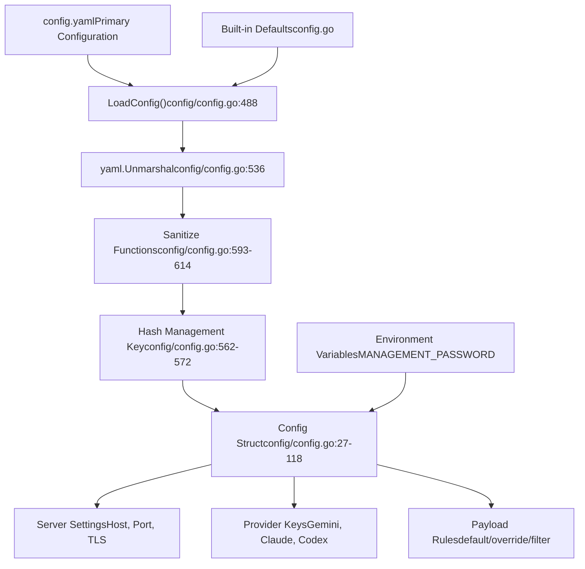
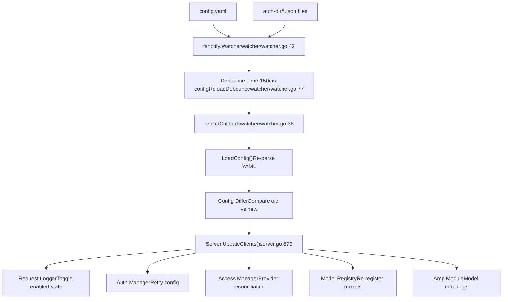
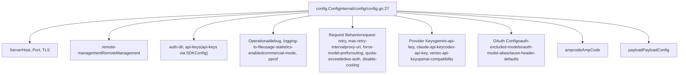

# 配置指南

相关源文件

-   [config.example.yaml](https://github.com/router-for-me/CLIProxyAPI/blob/c66cb0af/config.example.yaml)
-   [internal/api/handlers/management/config\_basic.go](https://github.com/router-for-me/CLIProxyAPI/blob/c66cb0af/internal/api/handlers/management/config_basic.go)
-   [internal/api/handlers/management/config\_lists.go](https://github.com/router-for-me/CLIProxyAPI/blob/c66cb0af/internal/api/handlers/management/config_lists.go)
-   [internal/api/server.go](https://github.com/router-for-me/CLIProxyAPI/blob/c66cb0af/internal/api/server.go)
-   [internal/config/config.go](https://github.com/router-for-me/CLIProxyAPI/blob/c66cb0af/internal/config/config.go)
-   [internal/watcher/watcher.go](https://github.com/router-for-me/CLIProxyAPI/blob/c66cb0af/internal/watcher/watcher.go)
-   [sdk/cliproxy/service.go](https://github.com/router-for-me/CLIProxyAPI/blob/c66cb0af/sdk/cliproxy/service.go)
-   [test/amp\_management\_test.go](https://github.com/router-for-me/CLIProxyAPI/blob/c66cb0af/test/amp_management_test.go)

本指南涵盖了 CLIProxyAPI 中所有可用的配置选项，并解释了配置如何加载、验证、更新和持久化。它描述了配置文件结构、热重载机制、存储后端和环境变量覆盖。

有关特定主题的详细信息：

-   **配置文件结构和所有可用字段**：参阅[配置文件结构](/router-for-me/CLIProxyAPI/5.1-configuration-file-structure)
-   **存储后端选项 (PostgreSQL, Git, Object Store, File)**：参阅[存储后端选项](/router-for-me/CLIProxyAPI/5.2-storage-backend-options)
-   **环境变量与命令行标志**：参阅[环境变量与覆盖](/router-for-me/CLIProxyAPI/5.3-environment-variables-and-overrides)
-   **各模型的有效负载（Payload）操作规则**：参阅[有效负载配置规则](/router-for-me/CLIProxyAPI/5.4-payload-configuration-rules)

---

## 配置概览

CLIProxyAPI 使用基于 YAML 的配置文件 (`config.yaml`) 作为主要的配置源。配置系统支持热重载、多种存储后端，并通过管理 API 进行运行时更新。

### 配置源与优先级

配置值从多个源加载，优先级顺序如下（从高到低）：

1.  **管理 API 运行时更新** — 通过 `/v0/management` 端点进行的更改
2.  **环境变量** — `MANAGEMENT_PASSWORD` 覆盖 `remote-management.secret-key`
3.  **配置文件** — 在启动时或通过热重载加载的 `config.yaml`
4.  **默认值** — 代码中定义的内置默认值


**来源：** [internal/config/config.go488-633](https://github.com/router-for-me/CLIProxyAPI/blob/c66cb0af/internal/config/config.go#L488-L633)

### 配置文件位置

配置文件路径在启动服务时指定：

```
// 使用配置路径初始化服务cfg, err := config.LoadConfig("./config.yaml")
```
路径可以是：

-   **绝对路径**：`/etc/cliproxy/config.yaml`
-   **相对路径**：`./config.yaml`（从工作目录解析）
-   **用户目录**：`~/config.yaml`（`auth-dir` 中支持波浪号扩展）

**来源：** [sdk/cliproxy/service.go432-617](https://github.com/router-for-me/CLIProxyAPI/blob/c66cb0af/sdk/cliproxy/service.go#L432-L617) [internal/config/config.go488-633](https://github.com/router-for-me/CLIProxyAPI/blob/c66cb0af/internal/config/config.go#L488-L633)

---

## 配置加载与验证

### 加载流程

配置加载遵循以下步骤：

> **[Mermaid sequence]**
> *(图表结构无法解析)*

**来源：** [internal/config/config.go508-653](https://github.com/router-for-me/CLIProxyAPI/blob/c66cb0af/internal/config/config.go#L508-L653) [sdk/cliproxy/service.go457-641](https://github.com/router-for-me/CLIProxyAPI/blob/c66cb0af/sdk/cliproxy/service.go#L457-L641)

### 验证与清理 (Sanitization)

配置加载器应用多个清理函数以确保有效性：

| 函数 | 调用位置 | 用途 |
| --- | --- | --- |
| `SanitizeGeminiKeys()` | [config/config.go613](https://github.com/router-for-me/CLIProxyAPI/blob/c66cb0af/config/config.go#L613-L613) | 验证 API 密钥，丢弃无密钥的条目 |
| `SanitizeVertexCompatKeys()` | [config/config.go616](https://github.com/router-for-me/CLIProxyAPI/blob/c66cb0af/config/config.go#L616-L616) | 验证 Vertex-compat 所需的基准 URL |
| `SanitizeCodexKeys()` | [config/config.go619](https://github.com/router-for-me/CLIProxyAPI/blob/c66cb0af/config/config.go#L619-L619) | 验证基准 URL，丢弃无效条目 |
| `SanitizeClaudeKeys()` | [config/config.go622](https://github.com/router-for-me/CLIProxyAPI/blob/c66cb0af/config/config.go#L622-L622) | 验证标头，规范化条目 |
| `SanitizeOpenAICompatibility()` | [config/config.go625](https://github.com/router-for-me/CLIProxyAPI/blob/c66cb0af/config/config.go#L625-L625) | 丢弃没有 `base-url` 的供应商 |
| `NormalizeOAuthExcludedModels()` | [config/config.go628](https://github.com/router-for-me/CLIProxyAPI/blob/c66cb0af/config/config.go#L628-L628) | 规范化供应商模型排除映射 |
| `SanitizeOAuthModelAlias()` | [config/config.go631](https://github.com/router-for-me/CLIProxyAPI/blob/c66cb0af/config/config.go#L631-L631) | 规范化并去重别名 |
| `SanitizePayloadRules()` | [config/config.go634](https://github.com/router-for-me/CLIProxyAPI/blob/c66cb0af/config/config.go#L634-L634) | 验证原始有效负载规则中的 JSON |

**来源：** [internal/config/config.go613-634](https://github.com/router-for-me/CLIProxyAPI/blob/c66cb0af/internal/config/config.go#L613-L634) [internal/config/config.go656-677](https://github.com/router-for-me/CLIProxyAPI/blob/c66cb0af/internal/config/config.go#L656-L677)

### 密钥哈希

明文形式的管理密钥（Management Secrets）在首次加载时自动使用 bcrypt 进行哈希。如果值以 `$2a$`、`$2b$` 或 `$2y$` 开头，则认为已哈希。如果检测到明文值，则会对其进行哈希处理并立即持久化回配置文件，以便在后续重启时不会重新哈希。

**来源：** [internal/config/config.go582-592](https://github.com/router-for-me/CLIProxyAPI/blob/c66cb0af/internal/config/config.go#L582-L592)

---

## 热重载机制

CLIProxyAPI 支持通过文件观察器和更新传播系统，在不重启服务器的情况下进行实时配置更新。

### 文件观察 (File Watching)

文件观察器监视配置文件和身份验证目录的更改：


**来源：** [internal/watcher/watcher.go1-149](https://github.com/router-for-me/CLIProxyAPI/blob/c66cb0af/internal/watcher/watcher.go#L1-L149) [internal/api/server.go865-1002](https://github.com/router-for-me/CLIProxyAPI/blob/c66cb0af/internal/api/server.go#L865-L1002)

### 防抖策略 (Debouncing Strategy)

文件系统事件经过防抖处理，以处理原子写入和快速连续更改：

```
// 对配置文件重新加载进行防抖处理，以处理原子写入（编辑器临时文件）const configReloadDebounce = 150 * time.Millisecondconst replaceCheckDelay = 50 * time.Millisecond  // 用于重命名操作
```
这可以防止单次保存操作触发多次重载，并防止在原子写入（临时文件 + 重命名模式，大多数编辑器使用此模式）期间读取部分文件。

**来源：** [internal/watcher/watcher.go73-79](https://github.com/router-for-me/CLIProxyAPI/blob/c66cb0af/internal/watcher/watcher.go#L73-L79)

### 更新传播

当检测到配置更改时，更新会通过系统传播：

| 子系统 | 更新触发条件 | 配置更改 |
| --- | --- | --- |
| **请求日志记录器** | `RequestLog` 字段更改 | 切换启用/禁用日志记录 |
| **使用情况统计** | `UsageStatisticsEnabled` 更改 | 启用/禁用使用情况跟踪 |
| **身份验证管理器** | `RequestRetry`, `MaxRetryInterval` | 更新重试配置 |
| **日志输出** | `LoggingToFile`, `LogsMaxTotalSizeMB` | 重新配置日志目的地 |
| **调试级别** | `Debug` 字段更改 | 更新 logrus 日志级别 |
| **管理路由** | `RemoteManagement.SecretKey` | 启用/禁用管理端点 |
| **访问供应商** | `APIKeys`, 访问配置 | 协调身份验证供应商 |
| **模型注册表** | 供应商密钥, OAuth 别名 | 重新注册可用模型 |
| **Amp 模块** | `AmpCode` 配置 | 更新模型映射、上游配置 |

**来源：** [internal/api/server.go879-1016](https://github.com/router-for-me/CLIProxyAPI/blob/c66cb0af/internal/api/server.go#L879-L1016)

### 配置差分 (Configuration Diffing)

服务器维护活动配置的 YAML 快照 (`oldConfigYaml []byte`)。在每次调用 `UpdateClients` 时，快照都会反序列化为一个临时的 `oldCfg` 结构体，用于字段级比较。这避免了管理 API 原地修改实时 `Config` 结构体而导致的引用共享问题。

**来源：** [internal/api/server.go129-140](https://github.com/router-for-me/CLIProxyAPI/blob/c66cb0af/internal/api/server.go#L129-L140) [internal/api/server.go879-884](https://github.com/router-for-me/CLIProxyAPI/blob/c66cb0af/internal/api/server.go#L879-L884)

---

## 配置持久化

配置更改可以持久化回 YAML 文件，同时保留注释和格式。

### 管理 API 持久化

当端点修改配置时，管理 API 会自动持久化更改。每个修改处理器（handler）都会调用 `h.persist(c)`，该函数将更新后的 `Config` 结构体写回配置文件，同时保留 YAML 注释。

**来源：** [internal/api/handlers/management/config\_lists.go34](https://github.com/router-for-me/CLIProxyAPI/blob/c66cb0af/internal/api/handlers/management/config_lists.go#L34-L34) [internal/api/handlers/management/config\_basic.go220](https://github.com/router-for-me/CLIProxyAPI/blob/c66cb0af/internal/api/handlers/management/config_basic.go#L220-L220)

### 注释保留

`SaveConfigPreserveComments`（在 `internal/config/config.go` 中）使用 `yaml.v3` 节点 API 将更改后的值合并到原始 AST 中，将更新后的配置写回磁盘，从而保留注释和格式。对于针对性地更新单个字段（例如，写入 `remote-management.secret-key` 的 bcrypt 哈希值），则使用 `SaveConfigPreserveCommentsUpdateNestedScalar` — 它仅更新指定的嵌套标量（scalar），而保持其他所有内容不变。

**来源：** [internal/config/config.go582-592](https://github.com/router-for-me/CLIProxyAPI/blob/c66cb0af/internal/config/config.go#L582-L592)

---

## 关键配置部分

### 服务器配置 (Server Configuration)

基础 HTTP 服务器设置：

| 字段 | 类型 | 默认值 | 描述 |
| --- | --- | --- | --- |
| `host` | `string` | `""` | 绑定接口（为空 = 所有接口, IPv4 + IPv6） |
| `port` | `int` | 必填 | HTTP 服务器端口 |
| `tls.enable` | `bool` | `false` | 启用 HTTPS |
| `tls.cert` | `string` | `""` | TLS 证书路径 |
| `tls.key` | `string` | `""` | TLS 私钥路径 |

**来源：** [internal/config/config.go29-36](https://github.com/router-for-me/CLIProxyAPI/blob/c66cb0af/internal/config/config.go#L29-L36) [internal/config/config.go133-141](https://github.com/router-for-me/CLIProxyAPI/blob/c66cb0af/internal/config/config.go#L133-L141)

### 身份验证配置 (Authentication Configuration)

| 字段 | 描述 | 文件引用 |
| --- | --- | --- |
| `auth-dir` | OAuth 令牌 JSON 文件的目录 | [internal/config/config.go41-43](https://github.com/router-for-me/CLIProxyAPI/blob/c66cb0af/internal/config/config.go#L41-L43) |
| `api-keys` | 请求认证的 API 密钥列表 (在 `SDKConfig` 中) | [internal/config/config.go28](https://github.com/router-for-me/CLIProxyAPI/blob/c66cb0af/internal/config/config.go#L28-L28) |
| `gemini-api-key` | Gemini API 密钥配置 (`[]GeminiKey`) | [internal/config/config.go85](https://github.com/router-for-me/CLIProxyAPI/blob/c66cb0af/internal/config/config.go#L85-L85) |
| `claude-api-key` | Claude API 密钥配置 (`[]ClaudeKey`) | [internal/config/config.go91](https://github.com/router-for-me/CLIProxyAPI/blob/c66cb0af/internal/config/config.go#L91-L91) |
| `codex-api-key` | Codex API 密钥配置 (`[]CodexKey`) | [internal/config/config.go88](https://github.com/router-for-me/CLIProxyAPI/blob/c66cb0af/internal/config/config.go#L88-L88) |
| `vertex-api-key` | 兼容 Vertex 的 API 密钥 (`[]VertexCompatKey`) | [internal/config/config.go100-103](https://github.com/router-for-me/CLIProxyAPI/blob/c66cb0af/internal/config/config.go#L100-L103) |
| `openai-compatibility` | 通用兼容 OpenAI 的供应商 (`[]OpenAICompatibility`) | [internal/config/config.go97-99](https://github.com/router-for-me/CLIProxyAPI/blob/c66cb0af/internal/config/config.go#L97-L99) |

**来源：** [internal/config/config.go27-122](https://github.com/router-for-me/CLIProxyAPI/blob/c66cb0af/internal/config/config.go#L27-L122)

### 管理配置 (Management Configuration)

远程管理设置 (`RemoteManagement` 结构体)：

```
remote-management:  allow-remote: false              # 允许非本地主机访问  secret-key: "your-secret"        # 管理密码 (自动哈希为 bcrypt)  disable-control-panel: false     # 禁用绑定的 UI 服务  panel-github-repository: "..."   # 自定义面板资产仓库
```
启用管理端点需要 `secret-key`。如果为空（且未设置 `MANAGEMENT_PASSWORD` 环境变量），则所有 `/v0/management` 路由返回 404。如果设置了 `MANAGEMENT_PASSWORD` 环境变量，它也会启用管理路由，并优先于配置中缺失的密钥。

**来源：** [internal/config/config.go151-162](https://github.com/router-for-me/CLIProxyAPI/blob/c66cb0af/internal/config/config.go#L151-L162) [internal/api/server.go240-244](https://github.com/router-for-me/CLIProxyAPI/blob/c66cb0af/internal/api/server.go#L240-L244) [internal/api/server.go298-305](https://github.com/router-for-me/CLIProxyAPI/blob/c66cb0af/internal/api/server.go#L298-L305)

### 运行配置 (Operational Configuration)

| 字段 | 类型 | 默认值 | 用途 |
| --- | --- | --- | --- |
| `debug` | `bool` | `false` | 启用调试日志记录 |
| `logging-to-file` | `bool` | `false` | 将应用程序日志写入轮转文件而不是 stdout |
| `logs-max-total-size-mb` | `int` | `0` | 日志目录的最大总大小 (MB) (0 = 禁用) |
| `error-logs-max-files` | `int` | `10` | 保留的最大错误日志文件数 (0 = 不清理) |
| `usage-statistics-enabled` | `bool` | `false` | 启用内存中使用情况聚合 |
| `request-log` | `bool` | `false` | 启用逐请求的 HTTP 日志记录 |
| `commercial-mode` | `bool` | `false` | 禁用高开销中间件以减少单次请求的内存占用 |
| `pprof.enable` | `bool` | `false` | 启用 pprof HTTP 调试服务器 |
| `pprof.addr` | `string` | `"127.0.0.1:8316"` | pprof 服务器绑定地址 |

**来源：** [internal/config/config.go44-66](https://github.com/router-for-me/CLIProxyAPI/blob/c66cb0af/internal/config/config.go#L44-L66) [internal/config/config.go143-149](https://github.com/router-for-me/CLIProxyAPI/blob/c66cb0af/internal/config/config.go#L143-L149)

### 请求行为 (Request Behavior)

| 字段 | 类型 | 默认值 | 描述 |
| --- | --- | --- | --- |
| `request-retry` | `int` | `3` | HTTP 403/408/500/502/503/504 响应时的重试次数 |
| `max-retry-interval` | `int` | `30` | 重试前等待凭证冷却的最长秒数 |
| `proxy-url` | `string` | `""` | 所有上游请求的 HTTP/SOCKS5 代理 URL (在 `SDKConfig` 中) |
| `force-model-prefix` | `bool` | `false` | 为 true 时，无前缀请求仅使用无前缀的凭证 (在 `SDKConfig` 中) |
| `passthrough-headers` | `bool` | `false` | 将过滤后的上游响应头转发给下游客户端 (在 `SDKConfig` 中) |
| `ws-auth` | `bool` | `false` | 在 WebSocket 端点 `/v1/ws` 上要求身份验证 |
| `disable-cooling` | `bool` | `false` | 禁用凭证的配额冷却调度 |

**来源：** [internal/config/config.go70-82](https://github.com/router-for-me/CLIProxyAPI/blob/c66cb0af/internal/config/config.go#L70-L82) [config.example.yaml67-92](https://github.com/router-for-me/CLIProxyAPI/blob/c66cb0af/config.example.yaml#L67-L92)

### 凭证路由 (Credential Routing)

```
routing:  strategy: "round-robin"  # 或 "fill-first"
```
-   **`round-robin`**：在凭证之间平均分配请求
-   **`fill-first`**：使用第一个凭证直到耗尽，然后使用下一个

**来源：** [internal/config/config.go161-166](https://github.com/router-for-me/CLIProxyAPI/blob/c66cb0af/internal/config/config.go#L161-L166)

### 配额超限行为 (Quota Exceeded Behavior)

```
quota-exceeded:  switch-project: true           # 自动切换到不同的项目  switch-preview-model: true     # 回退到预览模型
```
**来源：** [internal/config/config.go151-159](https://github.com/router-for-me/CLIProxyAPI/blob/c66cb0af/internal/config/config.go#L151-L159)

---

## 通过管理 API 进行配置更新

管理 API 提供了在运行时更新配置的端点：

### 通用更新模式

```
GET  /v0/management/config                        # 获取当前完整配置 (JSON)
GET  /v0/management/config.yaml                   # 获取原始 config.yaml (保留注释)
PUT  /v0/management/config.yaml                   # 替换完整 config.yaml

PUT  /v0/management/debug          {"value": true}
PUT  /v0/management/proxy-url      {"value": "socks5://127.0.0.1:1080"}
DELETE /v0/management/proxy-url

PUT  /v0/management/api-keys       ["key1", "key2"]       # 完整替换
PATCH /v0/management/api-keys      {"index": 0, "value": "new-key"}
DELETE /v0/management/api-keys?index=0
DELETE /v0/management/api-keys?value=key-to-remove
```
**来源：** [internal/api/handlers/management/config\_basic.go26-329](https://github.com/router-for-me/CLIProxyAPI/blob/c66cb0af/internal/api/handlers/management/config_basic.go#L26-L329) [internal/api/handlers/management/config\_lists.go107-119](https://github.com/router-for-me/CLIProxyAPI/blob/c66cb0af/internal/api/handlers/management/config_lists.go#L107-L119)

### 供应商配置更新

特定于供应商的列表端点支持 `GET`、`PUT`（完全替换）、`PATCH`（通过 `index` 或匹配字段更新单个条目）和 `DELETE`（按索引或键值）：

| 端点前缀 | 结构类型 |
| --- | --- |
| `/v0/management/gemini-api-key` | `[]GeminiKey` |
| `/v0/management/claude-api-key` | `[]ClaudeKey` |
| `/v0/management/codex-api-key` | `[]CodexKey` |
| `/v0/management/vertex-api-key` | `[]VertexCompatKey` |
| `/v0/management/openai-compatibility` | `[]OpenAICompatibility` |
| `/v0/management/oauth-excluded-models` | `map[string][]string` |
| `/v0/management/oauth-model-alias` | `map[string][]OAuthModelAlias` |

对于 `PATCH`，请提供 `{"index": N, "value": {...}}` 或 `{"match": "api-key-value", "value": {...}}`。

**来源：** [internal/api/handlers/management/config\_lists.go122-934](https://github.com/router-for-me/CLIProxyAPI/blob/c66cb0af/internal/api/handlers/management/config_lists.go#L122-L934)

### 更新传播流程

**图表：管理 API 配置更新流程**

> **[Mermaid sequence]**
> *(图表结构无法解析)*

**来源：** [internal/api/handlers/management/config\_basic.go185-186](https://github.com/router-for-me/CLIProxyAPI/blob/c66cb0af/internal/api/handlers/management/config_basic.go#L185-L186) [internal/api/server.go879-1016](https://github.com/router-for-me/CLIProxyAPI/blob/c66cb0af/internal/api/server.go#L879-L1016) [internal/watcher/watcher.go73-79](https://github.com/router-for-me/CLIProxyAPI/blob/c66cb0af/internal/watcher/watcher.go#L73-L79)

---

## 配置结构参考

完整的配置结构定义在 `Config` 结构体中。它内联嵌入了 `SDKConfig` — 诸如 `api-keys`、`proxy-url`、`force-model-prefix`、`passthrough-headers`、`request-log` 和流式设置等字段都位于该处。

**图表：Config 结构体顶层字段分组**


**来源：** [internal/config/config.go27-122](https://github.com/router-for-me/CLIProxyAPI/blob/c66cb0af/internal/config/config.go#L27-L122)

---

## 存储后端集成

虽然主配置位于 `config.yaml` 中，但身份验证系统支持多种存储后端以进行 OAuth 令牌持久化：

-   **文件存储 (File Store)**：默认值 — 将令牌作为 JSON 文件存储在 `auth-dir/` 中
-   **PostgreSQL**：数据库驱动的令牌存储，用于共享/云端部署
-   **Git 存储 (Git Store)**：版本控制的令牌存储
-   **对象存储 (Object Store)**：兼容 S3 的存储

有关存储后端的详细信息，请参阅页面 [5.2](https://github.com/router-for-me/CLIProxyAPI/blob/c66cb0af/5.2)

**来源：** [sdk/cliproxy/service.go79-82](https://github.com/router-for-me/CLIProxyAPI/blob/c66cb0af/sdk/cliproxy/service.go#L79-L82)

---

## 环境变量支持

环境变量可以覆盖特定的配置值：

| 变量 | 覆盖项 | 行为 |
| --- | --- | --- |
| `MANAGEMENT_PASSWORD` | `remote-management.secret-key` | 如果已设置且不为空，则无论配置文件中的密钥如何，都启用管理路由 |

设置 `MANAGEMENT_PASSWORD` 后，服务器将无条件调用 `registerManagementRoutes()`，即使配置文件中没有 `secret-key`，也会保持启用状态。这是无头（headless）/容器部署的主要机制。

有关完整的环境变量和标志参考，请参阅页面 [5.3](https://github.com/router-for-me/CLIProxyAPI/blob/c66cb0af/5.3)

**来源：** [internal/api/server.go240-244](https://github.com/router-for-me/CLIProxyAPI/blob/c66cb0af/internal/api/server.go#L240-L244) [internal/api/server.go928-940](https://github.com/router-for-me/CLIProxyAPI/blob/c66cb0af/internal/api/server.go#L928-L940)

---

## 配置示例

参阅带有内联文档的完整示例配置文件：

**来源：** [config.example.yaml1-314](https://github.com/router-for-me/CLIProxyAPI/blob/c66cb0af/config.example.yaml#L1-L314)

示例文件包含：

-   服务器和 TLS 设置
-   管理 API 配置
-   所有供应商类型 (Gemini, Claude, Codex, 兼容 OpenAI, 兼容 Vertex)
-   Amp 集成设置
-   OAuth 模型别名和排除
-   有效负载操作规则

有关详细的字段说明，请参阅[配置文件结构](/router-for-me/CLIProxyAPI/5.1-configuration-file-structure)。
