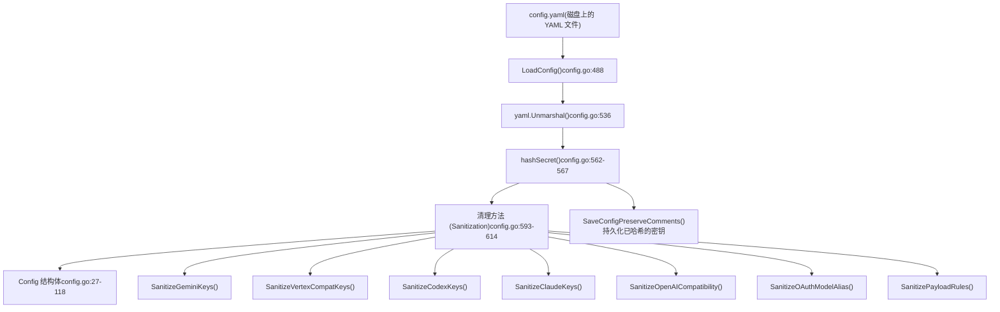
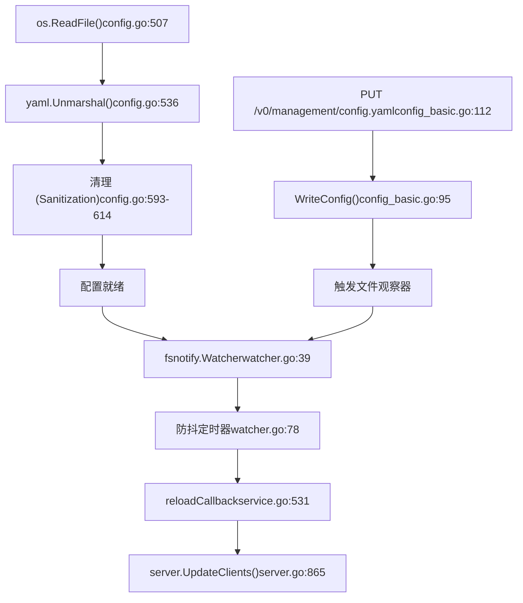

# 配置文件结构

相关源文件

-   [config.example.yaml](https://github.com/router-for-me/CLIProxyAPI/blob/c66cb0af/config.example.yaml)
-   [internal/api/handlers/management/config\_basic.go](https://github.com/router-for-me/CLIProxyAPI/blob/c66cb0af/internal/api/handlers/management/config_basic.go)
-   [internal/api/handlers/management/config\_lists.go](https://github.com/router-for-me/CLIProxyAPI/blob/c66cb0af/internal/api/handlers/management/config_lists.go)
-   [internal/api/handlers/management/model\_definitions.go](https://github.com/router-for-me/CLIProxyAPI/blob/c66cb0af/internal/api/handlers/management/model_definitions.go)
-   [internal/api/server.go](https://github.com/router-for-me/CLIProxyAPI/blob/c66cb0af/internal/api/server.go)
-   [internal/config/config.go](https://github.com/router-for-me/CLIProxyAPI/blob/c66cb0af/internal/config/config.go)
-   [internal/config/oauth\_model\_alias\_migration.go](https://github.com/router-for-me/CLIProxyAPI/blob/c66cb0af/internal/config/oauth_model_alias_migration.go)
-   [internal/config/oauth\_model\_alias\_migration\_test.go](https://github.com/router-for-me/CLIProxyAPI/blob/c66cb0af/internal/config/oauth_model_alias_migration_test.go)
-   [internal/config/oauth\_model\_alias\_test.go](https://github.com/router-for-me/CLIProxyAPI/blob/c66cb0af/internal/config/oauth_model_alias_test.go)
-   [internal/registry/model\_definitions\_static\_data.go](https://github.com/router-for-me/CLIProxyAPI/blob/c66cb0af/internal/registry/model_definitions_static_data.go)
-   [internal/thinking/provider/iflow/apply.go](https://github.com/router-for-me/CLIProxyAPI/blob/c66cb0af/internal/thinking/provider/iflow/apply.go)
-   [internal/util/claude\_model.go](https://github.com/router-for-me/CLIProxyAPI/blob/c66cb0af/internal/util/claude_model.go)
-   [internal/util/claude\_model\_test.go](https://github.com/router-for-me/CLIProxyAPI/blob/c66cb0af/internal/util/claude_model_test.go)
-   [internal/watcher/diff/oauth\_model\_alias.go](https://github.com/router-for-me/CLIProxyAPI/blob/c66cb0af/internal/watcher/diff/oauth_model_alias.go)
-   [internal/watcher/watcher.go](https://github.com/router-for-me/CLIProxyAPI/blob/c66cb0af/internal/watcher/watcher.go)
-   [sdk/cliproxy/service.go](https://github.com/router-for-me/CLIProxyAPI/blob/c66cb0af/sdk/cliproxy/service.go)
-   [test/amp\_management\_test.go](https://github.com/router-for-me/CLIProxyAPI/blob/c66cb0af/test/amp_management_test.go)

本文档详细介绍了 CLIProxyAPI 的主要配置文件 `config.yaml` 的结构。它涵盖了所有可用字段、它们的类型、嵌套对象、默认值和验证规则。有关存储后端（PostgreSQL、Git、对象存储）的信息，请参阅[存储后端选项](/router-for-me/CLIProxyAPI/5.2-storage-backend-options)。有关环境变量覆盖的信息，请参阅[环境变量与覆盖](/router-for-me/CLIProxyAPI/5.3-environment-variables-and-overrides)。有关有效负载操作规则的信息，请参阅[有效负载配置规则](/router-for-me/CLIProxyAPI/5.4-payload-configuration-rules)。

## 配置加载机制

配置系统使用多阶段过程从 `config.yaml` 加载设置：


**来源：** [internal/config/config.go488-633](https://github.com/router-for-me/CLIProxyAPI/blob/c66cb0af/internal/config/config.go#L488-L633)

`LoadConfig` 函数 [internal/config/config.go488-490](https://github.com/router-for-me/CLIProxyAPI/blob/c66cb0af/internal/config/config.go#L488-L490) 包装了 `LoadConfigOptional` [internal/config/config.go495-633](https://github.com/router-for-me/CLIProxyAPI/blob/c66cb0af/internal/config/config.go#L495-L633)，后者读取 YAML 文件，将其反序列化为 `Config` 结构体 [internal/config/config.go27-118](https://github.com/router-for-me/CLIProxyAPI/blob/c66cb0af/internal/config/config.go#L27-L118)，并通过清理方法应用验证和规范化。

## 顶层配置结构

`Config` 结构体 [internal/config/config.go27-118](https://github.com/router-for-me/CLIProxyAPI/blob/c66cb0af/internal/config/config.go#L27-L118) 嵌入了 `SDKConfig` 并定义了所有配置字段：

| 字段 | 类型 | 默认值 | 描述 |
| --- | --- | --- | --- |
| `host` | `string` | `""` | 要绑定的网络主机/接口（为空表示所有接口） |
| `port` | `int` | 必填 | HTTP 服务器的网络端口 |
| `tls` | `TLSConfig` | \- | HTTPS 服务器设置 |
| `remote-management` | `RemoteManagement` | \- | 管理 API 配置 |
| `auth-dir` | `string` | 必填 | 身份验证令牌文件的目录 |
| `debug` | `bool` | `false` | 启用调试日志记录 |
| `pprof` | `PprofConfig` | \- | pprof HTTP 调试服务器设置 |
| `commercial-mode` | `bool` | `false` | 禁用高开销的中间件 |
| `logging-to-file` | `bool` | `false` | 将日志写入轮转文件而非 stdout |
| `logs-max-total-size-mb` | `int` | `0` | 总日志文件大小限制（0 表示无限制） |
| `error-logs-max-files` | `int` | `10` | 保留的最大错误日志文件数 |
| `usage-statistics-enabled` | `bool` | `false` | 启用内存中的使用情况聚合 |
| `disable-cooling` | `bool` | `false` | 禁用配额冷却（cooldown）调度 |
| `request-retry` | `int` | `0` | 失败请求的重试尝试次数 |
| `max-retry-interval` | `int` | `0` | 重试前的最大等待时间（秒） |
| `quota-exceeded` | `QuotaExceeded` | \- | 超出配额限制时的行为 |
| `routing` | `RoutingConfig` | \- | 凭证选择策略 |
| `ws-auth` | `bool` | `false` | 为 WebSocket API 启用身份验证 |

**来源：** [internal/config/config.go27-118](https://github.com/router-for-me/CLIProxyAPI/blob/c66cb0af/internal/config/config.go#L27-L118) [config.example.yaml1-96](https://github.com/router-for-me/CLIProxyAPI/blob/c66cb0af/config.example.yaml#L1-L96)

## 服务器与网络配置

### 基础服务器设置

```
host: ""                # 空字符串绑定所有接口 (IPv4 + IPv6)port: 8317             # 必填: HTTP 服务器端口
```
`host` 字段 [internal/config/config.go31](https://github.com/router-for-me/CLIProxyAPI/blob/c66cb0af/internal/config/config.go#L31-L31) 控制服务器绑定哪个网络接口。空字符串（默认）绑定到所有接口。使用 `"127.0.0.1"` 或 `"localhost"` 可将访问限制在本地机器。

### TLS 配置

```
tls:  enable: false        # 切换 HTTPS 模式  cert: ""            # TLS 证书文件路径  key: ""             # TLS 私钥文件路径
```
`TLSConfig` 结构体 [internal/config/config.go121-128](https://github.com/router-for-me/CLIProxyAPI/blob/c66cb0af/internal/config/config.go#L121-L128) 定义了 HTTPS 设置。当 `enable` 为 `true` 时，必须提供 `cert` 和 `key` 路径 [internal/api/server.go782-791](https://github.com/router-for-me/CLIProxyAPI/blob/c66cb0af/internal/api/server.go#L782-L791)。

**来源：** [internal/config/config.go36](https://github.com/router-for-me/CLIProxyAPI/blob/c66cb0af/internal/config/config.go#L36-L36) [internal/config/config.go121-128](https://github.com/router-for-me/CLIProxyAPI/blob/c66cb0af/internal/config/config.go#L121-L128) [config.example.yaml8-12](https://github.com/router-for-me/CLIProxyAPI/blob/c66cb0af/config.example.yaml#L8-L12)

## 身份验证与授权

### 身份验证目录

```
auth-dir: "~/.cli-proxy-api"  # 支持 ~ 进行主目录扩展
```
`auth-dir` 字段 [internal/config/config.go42](https://github.com/router-for-me/CLIProxyAPI/blob/c66cb0af/internal/config/config.go#L42-L42) 指定了存储 OAuth 令牌文件和服务账号凭证的位置。如果目录不存在，系统会自动创建 [sdk/cliproxy/service.go690-706](https://github.com/router-for-me/CLIProxyAPI/blob/c66cb0af/sdk/cliproxy/service.go#L690-L706)。

### API 密钥

```
api-keys:  - "your-api-key-1"  - "your-api-key-2"  - "your-api-key-3"
```
API 密钥存储在嵌入的 `SDKConfig.APIKeys` 字段中，并通过 `AuthMiddleware` 提供请求身份验证 [internal/api/server.go1016-1042](https://github.com/router-for-me/CLIProxyAPI/blob/c66cb0af/internal/api/server.go#L1016-L1042)。

**来源：** [internal/config/config.go42](https://github.com/router-for-me/CLIProxyAPI/blob/c66cb0af/internal/config/config.go#L42-L42) [config.example.yaml32-38](https://github.com/router-for-me/CLIProxyAPI/blob/c66cb0af/config.example.yaml#L32-L38) [sdk/cliproxy/service.go690-706](https://github.com/router-for-me/CLIProxyAPI/blob/c66cb0af/sdk/cliproxy/service.go#L690-L706)

## 管理 API 配置

```
remote-management:  allow-remote: false                    # 允许非本地主机访问  secret-key: ""                         # 管理密码 (自动哈希)  disable-control-panel: false           # 跳过内置的管理 UI  panel-github-repository: "https://github.com/router-for-me/Cli-Proxy-API-Management-Center"
```
`RemoteManagement` 结构体 [internal/config/config.go138-149](https://github.com/router-for-me/CLIProxyAPI/blob/c66cb0af/internal/config/config.go#L138-L149) 配置了管理 API：

-   **`allow-remote`**：当为 `false` 时，仅限本地主机访问 `/v0/management` 端点 [internal/api/handlers/management/handler.go92-114](https://github.com/router-for-me/CLIProxyAPI/blob/c66cb0af/internal/api/handlers/management/handler.go#L92-L114)。
-   **`secret-key`**：明文密钥在启动时会自动进行 bcrypt 哈希处理 [internal/config/config.go562-567](https://github.com/router-for-me/CLIProxyAPI/blob/c66cb0af/internal/config/config.go#L562-L567)，并持久化回配置文件 [internal/config/config.go571](https://github.com/router-for-me/CLIProxyAPI/blob/c66cb0af/internal/config/config.go#L571-L571)。
-   **`disable-control-panel`**：当为 `true` 时，跳过下载并提供 `management.html` [internal/api/server.go644-672](https://github.com/router-for-me/CLIProxyAPI/blob/c66cb0af/internal/api/server.go#L644-L672)。
-   **`panel-github-repository`**：管理面板资产的 GitHub 仓库 URL 或 API 端点 [internal/config/config.go147-149](https://github.com/router-for-me/CLIProxyAPI/blob/c66cb0af/internal/config/config.go#L147-L149)。

管理路由仅在配置了 `secret-key` 或设置了 `MANAGEMENT_PASSWORD` 环境变量时才会注册 [internal/api/server.go288-292](https://github.com/router-for-me/CLIProxyAPI/blob/c66cb0af/internal/api/server.go#L288-L292)。

**来源：** [internal/config/config.go39](https://github.com/router-for-me/CLIProxyAPI/blob/c66cb0af/internal/config/config.go#L39-L39) [internal/config/config.go138-149](https://github.com/router-for-me/CLIProxyAPI/blob/c66cb0af/internal/config/config.go#L138-L149) [config.example.yaml14-29](https://github.com/router-for-me/CLIProxyAPI/blob/c66cb0af/config.example.yaml#L14-L29)

## 供应商特定配置

### Gemini API 密钥

```
gemini-api-key:  - api-key: "AIzaSy...01"    priority: 0                         # 优先选用的值越高 (默认: 0)    prefix: "team-a"                    # 可选的命名空间    base-url: "https://generativelanguage.googleapis.com"    proxy-url: "socks5://proxy.example.com:1080"    headers:      X-Custom-Header: "custom-value"    models:      - name: "gemini-2.5-flash"        # 上游模型名称        alias: "gemini-flash"           # 客户端可见的别名    excluded-models:      - "gemini-2.5-pro"                # 精确匹配      - "gemini-2.5-*"                  # 通配符前缀      - "*-preview"                     # 通配符后缀      - "*flash*"                       # 通配符子串
```
`GeminiKey` 结构体 [internal/config/config.go388-413](https://github.com/router-for-me/CLIProxyAPI/blob/c66cb0af/internal/config/config.go#L388-L413) 支持逐密钥配置：

| 字段 | 类型 | 用途 |
| --- | --- | --- |
| `api-key` | `string` | 身份验证密钥（必填） |
| `priority` | `int` | 选择偏好（越高越优先） |
| `prefix` | `string` | 模型命名空间（例如 `"teamA/gemini-3-pro-preview"`） |
| `base-url` | `string` | 自定义 API 端点覆盖 |
| `proxy-url` | `string` | 逐密钥的代理覆盖 |
| `headers` | `map[string]string` | 额外的 HTTP 标头 |
| `models` | `[]GeminiModel` | 上游模型到别名的映射 |
| `excluded-models` | `[]string` | 模型排除模式（精确、通配符） |

**来源：** [internal/config/config.go84-85](https://github.com/router-for-me/CLIProxyAPI/blob/c66cb0af/internal/config/config.go#L84-L85) [internal/config/config.go388-413](https://github.com/router-for-me/CLIProxyAPI/blob/c66cb0af/internal/config/config.go#L388-L413) [config.example.yaml98-113](https://github.com/router-for-me/CLIProxyAPI/blob/c66cb0af/config.example.yaml#L98-L113)

### Claude API 密钥

```
claude-api-key:  - api-key: "sk-atSM..."    priority: 0    prefix: "team-a"    base-url: "https://api.anthropic.com"    proxy-url: ""    headers: {}    models:      - name: "claude-3-5-sonnet-20241022"        alias: "claude-sonnet-latest"    excluded-models:      - "claude-opus-4-5-20251101"    cloak:                               # 请求掩蔽配置      mode: "auto"                       # "auto", "always", "never"      strict-mode: false                 # 剥离用户的系统消息      sensitive-words:                   # 需要模糊处理的单词        - "API"        - "proxy"
```
`ClaudeKey` 结构体 [internal/config/config.go295-324](https://github.com/router-for-me/CLIProxyAPI/blob/c66cb0af/internal/config/config.go#L295-L324) 包含了通过 `CloakConfig` [internal/config/config.go275-291](https://github.com/router-for-me/CLIProxyAPI/blob/c66cb0af/internal/config/config.go#L275-L291) 实现的掩蔽（cloaking）配置，用于伪装非 Claude-Code 客户端。

**来源：** [internal/config/config.go91](https://github.com/router-for-me/CLIProxyAPI/blob/c66cb0af/internal/config/config.go#L91-L91) [internal/config/config.go295-324](https://github.com/router-for-me/CLIProxyAPI/blob/c66cb0af/internal/config/config.go#L295-L324) [config.example.yaml133-157](https://github.com/router-for-me/CLIProxyAPI/blob/c66cb0af/config.example.yaml#L133-L157)

### Codex API 密钥

```
codex-api-key:  - api-key: "sk-atSM..."    priority: 0    prefix: "team-a"    base-url: "https://www.example.com"    proxy-url: ""    headers: {}    models:      - name: "gpt-5-codex"        alias: "codex-latest"    excluded-models:      - "gpt-5.1"
```
`CodexKey` 结构体 [internal/config/config.go343-369](https://github.com/router-for-me/CLIProxyAPI/blob/c66cb0af/internal/config/config.go#L343-L369) 遵循与其他供应商密钥相同的模式。

**来源：** [internal/config/config.go88](https://github.com/router-for-me/CLIProxyAPI/blob/c66cb0af/internal/config/config.go#L88-L88) [internal/config/config.go343-369](https://github.com/router-for-me/CLIProxyAPI/blob/c66cb0af/internal/config/config.go#L343-L369) [config.example.yaml116-130](https://github.com/router-for-me/CLIProxyAPI/blob/c66cb0af/config.example.yaml#L116-L130)

### 兼容 OpenAI 的供应商

```
openai-compatibility:  - name: "openrouter"                   # 供应商标识符    priority: 0    prefix: "team-a"    base-url: "https://openrouter.ai/api/v1"    headers:      X-Custom-Header: "custom-value"    api-key-entries:      - api-key: "sk-or-v1-...b780"        proxy-url: "socks5://proxy.example.com:1080"      - api-key: "sk-or-v1-...b781"    models:      - name: "moonshotai/kimi-k2:free"  # 实际模型名称        alias: "kimi-k2"                  # 客户端可见的别名
```
`OpenAICompatibility` 结构体 [internal/config/config.go432-454](https://github.com/router-for-me/CLIProxyAPI/blob/c66cb0af/internal/config/config.go#L432-L454) 支持具有多个 API 密钥的第三方 OpenAI 兼容 API。

**来源：** [internal/config/config.go94](https://github.com/router-for-me/CLIProxyAPI/blob/c66cb0af/internal/config/config.go#L94-L94) [internal/config/config.go432-454](https://github.com/router-for-me/CLIProxyAPI/blob/c66cb0af/internal/config/config.go#L432-L454) [config.example.yaml160-172](https://github.com/router-for-me/CLIProxyAPI/blob/c66cb0af/config.example.yaml#L160-L172)

### Vertex 兼容的 API 密钥

```
vertex-api-key:  - api-key: "vk-123..."                 # 作为 x-goog-api-key 标头发送    priority: 0    prefix: "team-a"    base-url: "https://example.com/api"  # 例如, zenmux.ai/api    proxy-url: ""    headers: {}    models:      - name: "gemini-2.5-flash"        alias: "vertex-flash"
```
`VertexCompatKey` 结构体支持使用 API 密钥身份验证而非 OAuth 的 Vertex AI 风格端点。

**来源：** [internal/config/config.go98](https://github.com/router-for-me/CLIProxyAPI/blob/c66cb0af/internal/config/config.go#L98-L98) [config.example.yaml175-186](https://github.com/router-for-me/CLIProxyAPI/blob/c66cb0af/config.example.yaml#L175-L186)

## 全局 OAuth 配置

### OAuth 模型别名

```
oauth-model-alias:  gemini-cli:    - name: "gemini-2.5-pro"             # 原始模型名称      alias: "g2.5p"                     # 客户端可见的别名      fork: true                         # 保留原始名称 + 添加别名  vertex:    - name: "gemini-2.5-pro"      alias: "g2.5p"  claude:    - name: "claude-sonnet-4-5-20250929"      alias: "cs4.5"
```
`OAuthModelAlias` 映射 [internal/config/config.go112](https://github.com/router-for-me/CLIProxyAPI/blob/c66cb0af/internal/config/config.go#L112-L112) 定义了按通道的模型名称映射。支持的通道：`gemini-cli`, `vertex`, `aistudio`, `antigravity`, `claude`, `codex`, `qwen`, `iflow`, `kimi`。

`OAuthModelAlias` 结构体 [internal/config/config.go172-176](https://github.com/router-for-me/CLIProxyAPI/blob/c66cb0af/internal/config/config.go#L172-L176) 定义了每个映射：

-   **`name`**：上游模型标识符
-   **`alias`**：客户端可见的模型名称
-   **`fork`**：为 `true` 时，原始名称和别名均可用；为 `false` 时，仅暴露别名

**注意：** 这些别名不适用于 `gemini-api-key`, `codex-api-key`, `claude-api-key`, `openai-compatibility`, `vertex-api-key` 或 `ampcode` 条目。这些条目使用各自的逐凭据 `models` 配置。

**来源：** [internal/config/config.go107-112](https://github.com/router-for-me/CLIProxyAPI/blob/c66cb0af/internal/config/config.go#L107-L112) [internal/config/config.go172-176](https://github.com/router-for-me/CLIProxyAPI/blob/c66cb0af/internal/config/config.go#L172-L176) [config.example.yaml223-255](https://github.com/router-for-me/CLIProxyAPI/blob/c66cb0af/config.example.yaml#L223-L255)

### OAuth 排除模型

```
oauth-excluded-models:  gemini-cli:    - "gemini-2.5-pro"                   # 精确匹配    - "gemini-2.5-*"                     # 通配符前缀    - "*-preview"                        # 通配符后缀    - "*flash*"                          # 通配符子串  vertex:    - "gemini-3-pro-preview"
```
`OAuthExcludedModels` 映射 [internal/config/config.go104](https://github.com/router-for-me/CLIProxyAPI/blob/c66cb0af/internal/config/config.go#L104-L104) 定义了按供应商的全局模型排除模式，应用于 OAuth / 基于文件的认证条目。

**来源：** [internal/config/config.go104](https://github.com/router-for-me/CLIProxyAPI/blob/c66cb0af/internal/config/config.go#L104-L104) [config.example.yaml258-279](https://github.com/router-for-me/CLIProxyAPI/blob/c66cb0af/config.example.yaml#L258-L279)

## 路由与重试配置

### 凭证选择策略

```
routing:  strategy: "round-robin"                # "round-robin" (默认) 或 "fill-first"
```
`RoutingConfig` 结构体 [internal/config/config.go162-166](https://github.com/router-for-me/CLIProxyAPI/blob/c66cb0af/internal/config/config.go#L162-L166) 控制了当多个凭证匹配请求时如何进行选择：

-   **`round-robin`**：在所有可用凭证之间平均分配请求。
-   **`fill-first`**：使用第一个可用凭证直到配额耗尽，然后移至下一个。

该策略通过 `Selector` 接口 [sdk/cliproxy/auth/selector.go](https://github.com/router-for-me/CLIProxyAPI/blob/c66cb0af/sdk/cliproxy/auth/selector.go) 及其实现 `RoundRobinSelector` 和 `FillFirstSelector` [sdk/cliproxy/service.go549-567](https://github.com/router-for-me/CLIProxyAPI/blob/c66cb0af/sdk/cliproxy/service.go#L549-L567) 应用。

### 请求重试配置

```
request-retry: 3                         # 重试尝试次数max-retry-interval: 30                   # 重试前的最大等待时间 (秒)
```
`request-retry` 字段 [internal/config/config.go71](https://github.com/router-for-me/CLIProxyAPI/blob/c66cb0af/internal/config/config.go#L71-L71) 定义了对 HTTP 响应代码 403, 408, 500, 502, 503 或 504 进行重试的次数。`max-retry-interval` 字段 [internal/config/config.go73](https://github.com/router-for-me/CLIProxyAPI/blob/c66cb0af/internal/config/config.go#L73-L73) 限制了在触发处于冷却状态的凭证重试前的等待时间 [internal/api/server.go254-255](https://github.com/router-for-me/CLIProxyAPI/blob/c66cb0af/internal/api/server.go#L254-L255)。

### 配额超限行为

```
quota-exceeded:  switch-project: true                   # 自动切换到另一个项目  switch-preview-model: true             # 自动切换到预览模型
```
`QuotaExceeded` 结构体 [internal/config/config.go153-159](https://github.com/router-for-me/CLIProxyAPI/blob/c66cb0af/internal/config/config.go#L153-L159) 配置了达到配额限制时的自动故障转移。

**来源：** [internal/config/config.go79](https://github.com/router-for-me/CLIProxyAPI/blob/c66cb0af/internal/config/config.go#L79-L79) [internal/config/config.go162-166](https://github.com/router-for-me/CLIProxyAPI/blob/c66cb0af/internal/config/config.go#L162-L166) [config.example.yaml78-84](https://github.com/router-for-me/CLIProxyAPI/blob/c66cb0af/config.example.yaml#L78-L84)

## AMP CLI 集成

```
ampcode:  upstream-url: "https://ampcode.com"  upstream-api-key: ""                   # 默认上游密钥  upstream-api-keys:                     # 逐客户端的上游密钥映射    - upstream-api-key: "amp_key_for_team_a"      api-keys:        - "your-api-key-1"        - "your-api-key-2"  restrict-management-to-localhost: false  force-model-mappings: false  model-mappings:    - from: "claude-opus-4-5-20251101"      to: "gemini-claude-opus-4-5-thinking"      regex: false                       # 精确匹配 vs 正则表达式模式
```
`AmpCode` 结构体 [internal/config/config.go197-222](https://github.com/router-for-me/CLIProxyAPI/blob/c66cb0af/internal/config/config.go#L197-L222) 配置了 AMP CLI 上游路由：

| 字段 | 类型 | 描述 |
| --- | --- | --- |
| `upstream-url` | `string` | 上游 Amp 控制平面 URL |
| `upstream-api-key` | `string` | 上游请求的默认 API 密钥 |
| `upstream-api-keys` | `[]AmpUpstreamAPIKeyEntry` | 逐客户端的上游密钥映射 |
| `restrict-management-to-localhost` | `bool` | 限制管理路由仅限本地主机访问 |
| `force-model-mappings` | `bool` | 映射优先于本地 API 密钥 |
| `model-mappings` | `[]AmpModelMapping` | 模型名称转换规则 |

`AmpModelMapping` 结构体 [internal/config/config.go181-193](https://github.com/router-for-me/CLIProxyAPI/blob/c66cb0af/internal/config/config.go#L181-L193) 支持精确匹配和基于正则的模型名称匹配。

**来源：** [internal/config/config.go101](https://github.com/router-for-me/CLIProxyAPI/blob/c66cb0af/internal/config/config.go#L101-L101) [internal/config/config.go197-222](https://github.com/router-for-me/CLIProxyAPI/blob/c66cb0af/internal/config/config.go#L197-L222) [config.example.yaml189-220](https://github.com/router-for-me/CLIProxyAPI/blob/c66cb0af/config.example.yaml#L189-L220)

## 有效负载配置 (Payload Configuration)

```
payload:  default:                               # 仅在缺失时设置    - models:        - name: "gemini-2.5-pro"          protocol: "gemini"             # openai, gemini, claude, codex, antigravity      params:        "generationConfig.thinkingConfig.thinkingBudget": 32768    default-raw:                           # 仅在缺失时设置原始 JSON    - models:        - name: "gemini-2.5-pro"          protocol: "gemini"      params:        "generationConfig.responseJsonSchema": "{\"type\":\"object\"}"    override:                              # 始终设置 (覆盖)    - models:        - name: "gpt-*"          protocol: "codex"      params:        "reasoning.effort": "high"    override-raw:                          # 始终设置原始 JSON    - models:        - name: "gpt-*"          protocol: "codex"      params:        "response_format": "{\"type\":\"json_schema\"}"    filter:                                # 移除参数    - models:        - name: "gemini-2.5-pro"          protocol: "gemini"      params:        - "generationConfig.thinkingConfig.thinkingBudget"
```
`PayloadConfig` 结构体 [internal/config/config.go236-247](https://github.com/router-for-me/CLIProxyAPI/blob/c66cb0af/internal/config/config.go#L236-L247) 定义了动态操作供应商请求有效负载的规则：

-   **`default`**：仅在 JSON 字段不存在时进行设置 [internal/config/config.go238](https://github.com/router-for-me/CLIProxyAPI/blob/c66cb0af/internal/config/config.go#L238-L238)。
-   **`default-raw`**：仅在缺失时设置原始 JSON 值 [internal/config/config.go240](https://github.com/router-for-me/CLIProxyAPI/blob/c66cb0af/internal/config/config.go#L240-L240)。
-   **`override`**：无条件设置参数，覆盖现有值 [internal/config/config.go242](https://github.com/router-for-me/CLIProxyAPI/blob/c66cb0af/internal/config/config.go#L242-L242)。
-   **`override-raw`**：始终设置原始 JSON 值 [internal/config/config.go244](https://github.com/router-for-me/CLIProxyAPI/blob/c66cb0af/internal/config/config.go#L244-L244)。
-   **`filter`**：从有效负载中删除指定的 JSON 路径 [internal/config/config.go246](https://github.com/router-for-me/CLIProxyAPI/blob/c66cb0af/internal/config/config.go#L246-L246)。

每条规则使用 gjson/sjson 路径语法进行参数定位。原始 JSON 值在加载时会进行验证 [internal/config/config.go636-677](https://github.com/router-for-me/CLIProxyAPI/blob/c66cb0af/internal/config/config.go#L636-L677)。详细用法请参阅[有效负载配置规则](/router-for-me/CLIProxyAPI/5.4-payload-configuration-rules)。

**来源：** [internal/config/config.go115](https://github.com/router-for-me/CLIProxyAPI/blob/c66cb0af/internal/config/config.go#L115-L115) [internal/config/config.go236-272](https://github.com/router-for-me/CLIProxyAPI/blob/c66cb0af/internal/config/config.go#L236-L272) [config.example.yaml282-313](https://github.com/router-for-me/CLIProxyAPI/blob/c66cb0af/config.example.yaml#L282-L313)

## 日志与调试

### 调试与日志配置

```
debug: false                             # 启用调试级日志记录logging-to-file: false                   # 将日志写入轮转文件logs-max-total-size-mb: 0                # 总日志文件大小限制 (0=无限制)error-logs-max-files: 10                 # 保留的最大错误日志文件数
```
`debug` 标志 [internal/config/config.go45](https://github.com/router-for-me/CLIProxyAPI/blob/c66cb0af/internal/config/config.go#L45-L45) 通过 `util.SetLogLevel` [internal/api/server.go909-912](https://github.com/router-for-me/CLIProxyAPI/blob/c66cb0af/internal/api/server.go#L909-L912) 控制日志级别。启用 `logging-to-file` 后 [internal/config/config.go54](https://github.com/router-for-me/CLIProxyAPI/blob/c66cb0af/internal/config/config.go#L54-L54)，日志将被写入轮转文件而非 stdout [internal/logging/config.go](https://github.com/router-for-me/CLIProxyAPI/blob/c66cb0af/internal/logging/config.go)。

### pprof 调试服务器

```
pprof:  enable: false                          # 切换 pprof HTTP 服务器  addr: "127.0.0.1:8316"                # pprof 服务器的主机:端口
```
`PprofConfig` 结构体 [internal/config/config.go131-136](https://github.com/router-for-me/CLIProxyAPI/blob/c66cb0af/internal/config/config.go#L131-L136) 控制可选的 pprof HTTP 调试服务器 [sdk/cliproxy/pprof.go](https://github.com/router-for-me/CLIProxyAPI/blob/c66cb0af/sdk/cliproxy/pprof.go)。

### 使用情况统计

```
usage-statistics-enabled: false          # 启用内存中的使用情况聚合
```
启用后 [internal/config/config.go65](https://github.com/router-for-me/CLIProxyAPI/blob/c66cb0af/internal/config/config.go#L65-L65)，系统会在内存中跟踪令牌消耗 [internal/usage/manager.go](https://github.com/router-for-me/CLIProxyAPI/blob/c66cb0af/internal/usage/manager.go)。统计信息可通过 `/v0/management/usage` 访问 [internal/api/handlers/management/usage.go](https://github.com/router-for-me/CLIProxyAPI/blob/c66cb0af/internal/api/handlers/management/usage.go)。

**来源：** [internal/config/config.go45](https://github.com/router-for-me/CLIProxyAPI/blob/c66cb0af/internal/config/config.go#L45-L45) [internal/config/config.go54](https://github.com/router-for-me/CLIProxyAPI/blob/c66cb0af/internal/config/config.go#L54-L54) [config.example.yaml41-63](https://github.com/router-for-me/CLIProxyAPI/blob/c66cb0af/config.example.yaml#L41-L63)

## 配置生命周期


**来源：** [internal/config/config.go488-633](https://github.com/router-for-me/CLIProxyAPI/blob/c66cb0af/internal/config/config.go#L488-L633) [internal/watcher/watcher.go1-149](https://github.com/router-for-me/CLIProxyAPI/blob/c66cb0af/internal/watcher/watcher.go#L1-L149) [sdk/cliproxy/service.go531-583](https://github.com/router-for-me/CLIProxyAPI/blob/c66cb0af/sdk/cliproxy/service.go#L531-L583)

### 热重载过程

配置热重载系统使用 fsnotify [internal/watcher/watcher.go39](https://github.com/router-for-me/CLIProxyAPI/blob/c66cb0af/internal/watcher/watcher.go#L39-L39) 来检测文件更改：

1.  **文件被修改**：fsnotify 发出 `Write` 或 `Chmod` 事件。
2.  **防抖 (Debounce)**：等待 150ms [internal/watcher/watcher.go78](https://github.com/router-for-me/CLIProxyAPI/blob/c66cb0af/internal/watcher/watcher.go#L78-L78) 以处理原子写入。
3.  **重载**：调用 `reloadCallback` [sdk/cliproxy/service.go531-583](https://github.com/router-for-me/CLIProxyAPI/blob/c66cb0af/sdk/cliproxy/service.go#L531-L583)。
4.  **更新**：通过 `server.UpdateClients` 传播更改 [internal/api/server.go865-1002](https://github.com/router-for-me/CLIProxyAPI/blob/c66cb0af/internal/api/server.go#L865-L1002)。
5.  **重新绑定**：重新注册执行器和模型注册表 [sdk/cliproxy/service.go412-421](https://github.com/router-for-me/CLIProxyAPI/blob/c66cb0af/sdk/cliproxy/service.go#L412-L421)。

配置更改是原子应用的，无需重启服务器。旧的配置 YAML 快照 [internal/api/server.go129-131](https://github.com/router-for-me/CLIProxyAPI/blob/c66cb0af/internal/api/server.go#L129-L131) 实现了变更检测，以进行条件更新。

**来源：** [internal/watcher/watcher.go1-149](https://github.com/router-for-me/CLIProxyAPI/blob/c66cb0af/internal/watcher/watcher.go#L1-L149) [sdk/cliproxy/service.go531-583](https://github.com/router-for-me/CLIProxyAPI/blob/c66cb0af/sdk/cliproxy/service.go#L531-L583) [internal/api/server.go865-1002](https://github.com/router-for-me/CLIProxyAPI/blob/c66cb0af/internal/api/server.go#L865-L1002)

## 配置验证与清理 (Sanitization)

### 清理管道

```mermaid
flowchart TD
    Unmarshal["yaml.Unmarshal()"]
    SanitizeGemini["SanitizeGeminiKeys()config.go:593"]
    SanitizeVertex["SanitizeVertexCompatKeys()config.go:596"]
    SanitizeCodex["SanitizeCodexKeys()config.go:599"]
    SanitizeClaude["SanitizeClaudeKeys()config.go:602"]
    SanitizeOpenAI["SanitizeOpenAICompatibility()config.go:605"]
    NormalizeOAuth["NormalizeOAuthExcludedModels()config.go:608"]
    SanitizeAlias["SanitizeOAuthModelAlias()config.go:611"]
    SanitizePayload["SanitizePayloadRules()config.go:614"]
    Validated["验证通过的配置"]

    Unmarshal --> SanitizeGemini
    Unmarshal --> SanitizeVertex
    Unmarshal --> SanitizeCodex
    Unmarshal --> SanitizeClaude
    Unmarshal --> SanitizeOpenAI
    Unmarshal --> NormalizeOAuth
    Unmarshal --> SanitizeAlias
    Unmarshal --> SanitizePayload
    SanitizeGemini --> Validated
    SanitizeVertex --> Validated
    SanitizeCodex --> Validated
    SanitizeClaude --> Validated
    SanitizeOpenAI --> Validated
    NormalizeOAuth --> Validated
    SanitizeAlias --> Validated
    SanitizePayload --> Validated
```


**来源：** [internal/config/config.go593-629](https://github.com/router-for-me/CLIProxyAPI/blob/c66cb0af/internal/config/config.go#L593-L629)

### 各部分的验证规则

| 配置部分 | 验证方法 | 应用的规则 |
| --- | --- | --- |
| Gemini API 密钥 | `SanitizeGeminiKeys()` [internal/config/config.go593](https://github.com/router-for-me/CLIProxyAPI/blob/c66cb0af/internal/config/config.go#L593-L593) | 丢弃缺失 `api-key` 的条目，规范化标头，验证排除模式 |
| Vertex API 密钥 | `SanitizeVertexCompatKeys()` [internal/config/config.go596](https://github.com/router-for-me/CLIProxyAPI/blob/c66cb0af/internal/config/config.go#L596-L596) | 丢弃不同时具备 `api-key` 和 `base-url` 的条目 |
| Codex API 密钥 | `SanitizeCodexKeys()` [internal/config/config.go599](https://github.com/router-for-me/CLIProxyAPI/blob/c66cb0af/internal/config/config.go#L599-L599) | 丢弃不同时具备 `api-key` 和 `base-url` 的条目 |
| Claude API 密钥 | `SanitizeClaudeKeys()` [internal/config/config.go602](https://github.com/router-for-me/CLIProxyAPI/blob/c66cb0af/internal/config/config.go#L602-L602) | 规范化标头，验证掩蔽（cloaking）配置 |
| OpenAI 兼容性 | `SanitizeOpenAICompatibility()` [internal/config/config.go605](https://github.com/router-for-me/CLIProxyAPI/blob/c66cb0af/internal/config/config.go#L605-L605) | 丢弃缺失 `base-url` 的条目，验证模型模式 |
| OAuth 排除项 | `NormalizeOAuthExcludedModels()` [internal/config/config.go608](https://github.com/router-for-me/CLIProxyAPI/blob/c66cb0af/internal/config/config.go#L608-L608) | 将通道键规范化为小写，去重模式 |
| OAuth 别名 | `SanitizeOAuthModelAlias()` [internal/config/config.go611](https://github.com/router-for-me/CLIProxyAPI/blob/c66cb0af/internal/config/config.go#L611-L611) | 修剪空格，规范化通道，确保每个通道别名唯一 |
| 有效负载规则 | `SanitizePayloadRules()` [internal/config/config.go614](https://github.com/router-for-me/CLIProxyAPI/blob/c66cb0af/internal/config/config.go#L614-L614) | 验证 `*-raw` 部分中的原始 JSON，丢弃无效规则 |

**来源：** [internal/config/config.go593-677](https://github.com/router-for-me/CLIProxyAPI/blob/c66cb0af/internal/config/config.go#L593-L677)

### 优先级与前缀处理

模型前缀 [internal/config/config.go304](https://github.com/router-for-me/CLIProxyAPI/blob/c66cb0af/internal/config/config.go#L304-L304) 对凭证进行命名空间划分以防止冲突：

```
gemini-api-key:  - api-key: "AIzaSy...01"    prefix: "team-a"                     # 需要 "team-a/gemini-3-pro-preview"    priority: 10                         # 优先选择高优先级条目  - api-key: "AIzaSy...02"    prefix: ""                           # 匹配无前缀的请求    priority: 5
```
当多个凭证匹配时，选择遵循以下顺序：

1.  **优先级 (Priority)**：优先选择较高的 `priority` 值 [internal/config/config.go301](https://github.com/router-for-me/CLIProxyAPI/blob/c66cb0af/internal/config/config.go#L301-L301)。
2.  **前缀匹配 (Prefix Match)**：如果设置了前缀，则必须精确匹配。
3.  **可用性 (Availability)**：检查配额和冷却状态。
4.  **策略 (Strategy)**：应用轮询或优先填满策略 [internal/config/config.go162-166](https://github.com/router-for-me/CLIProxyAPI/blob/c66cb0af/internal/config/config.go#L162-L166)。

**来源：** [internal/config/config.go301-305](https://github.com/router-for-me/CLIProxyAPI/blob/c66cb0af/internal/config/config.go#L301-L305) [sdk/cliproxy/auth/conductor.go](https://github.com/router-for-me/CLIProxyAPI/blob/c66cb0af/sdk/cliproxy/auth/conductor.go)

## 环境变量覆盖

虽然主要配置机制是 `config.yaml`，但某些设置可以通过环境变量覆盖：

| 环境变量 | 配置字段 | 备注 |
| --- | --- | --- |
| `MANAGEMENT_PASSWORD` | `remote-management.secret-key` | 即使配置文件中密钥为空，也能启用管理路由 [internal/api/server.go232-234](https://github.com/router-for-me/CLIProxyAPI/blob/c66cb0af/internal/api/server.go#L232-L234) |

完整的环境变量文档请参阅[环境变量与覆盖](/router-for-me/CLIProxyAPI/5.3-environment-variables-and-overrides)。

**来源：** [internal/api/server.go232-234](https://github.com/router-for-me/CLIProxyAPI/blob/c66cb0af/internal/api/server.go#L232-L234) [internal/api/server.go916-944](https://github.com/router-for-me/CLIProxyAPI/blob/c66cb0af/internal/api/server.go#L916-L944)

## 配置持久化

### 保存配置

```
// 保存并保留注释和格式err := config.SaveConfigPreserveComments(configFilePath, cfg) // 仅更新特定的嵌套标量字段err := config.SaveConfigPreserveCommentsUpdateNestedScalar(    configFilePath,    []string{"remote-management", "secret-key"},    hashedValue,)
```
`SaveConfigPreserveComments` 函数 [internal/config/yaml\_save.go](https://github.com/router-for-me/CLIProxyAPI/blob/c66cb0af/internal/config/yaml_save.go) 在更新值的同时保留 YAML 注释和格式。`SaveConfigPreserveCommentsUpdateNestedScalar` 函数 [internal/config/yaml\_save.go](https://github.com/router-for-me/CLIProxyAPI/blob/c66cb0af/internal/config/yaml_save.go) 仅更新单个嵌套字段而不对整个配置进行重新编码，从而保留了所有原始格式和注释。

管理 API 端点使用 `WriteConfig` [internal/api/handlers/management/config\_basic.go95-110](https://github.com/router-for-me/CLIProxyAPI/blob/c66cb0af/internal/api/handlers/management/config_basic.go#L95-L110) 原子地写入配置并执行适当的 fsync。

**来源：** [internal/config/yaml\_save.go](https://github.com/router-for-me/CLIProxyAPI/blob/c66cb0af/internal/config/yaml_save.go) [internal/api/handlers/management/config\_basic.go95-110](https://github.com/router-for-me/CLIProxyAPI/blob/c66cb0af/internal/api/handlers/management/config_basic.go#L95-L110)

## 配置模式参考


**来源：** [internal/config/config.go27-118](https://github.com/router-for-me/CLIProxyAPI/blob/c66cb0af/internal/config/config.go#L27-L118) [internal/config/config.go121-272](https://github.com/router-for-me/CLIProxyAPI/blob/c66cb0af/internal/config/config.go#L121-L272)
