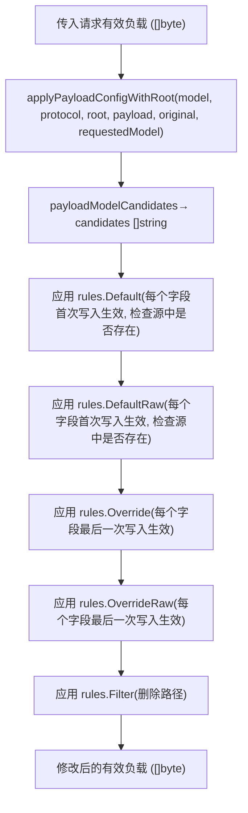
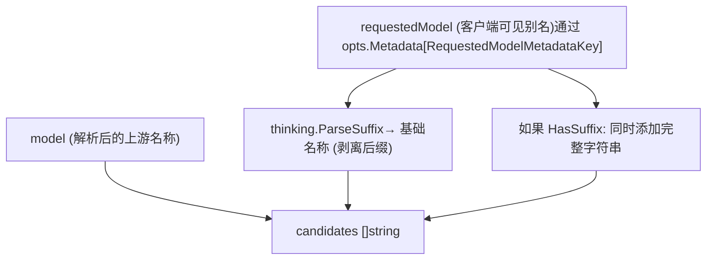
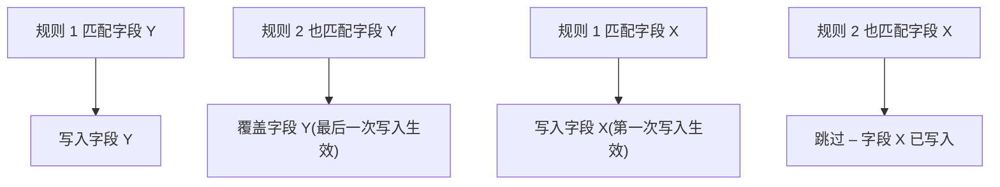
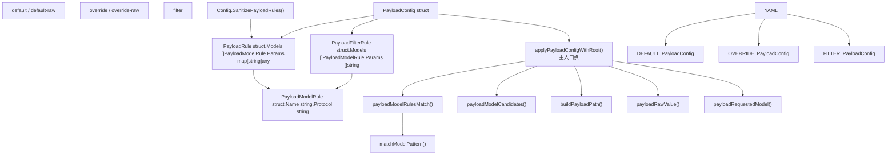

# 有效负载配置规则

相关源文件

-   [config.example.yaml](https://github.com/router-for-me/CLIProxyAPI/blob/c66cb0af/config.example.yaml)
-   [internal/api/handlers/management/config\_basic.go](https://github.com/router-for-me/CLIProxyAPI/blob/c66cb0af/internal/api/handlers/management/config_basic.go)
-   [internal/api/handlers/management/config\_lists.go](https://github.com/router-for-me/CLIProxyAPI/blob/c66cb0af/internal/api/handlers/management/config_lists.go)
-   [internal/api/server.go](https://github.com/router-for-me/CLIProxyAPI/blob/c66cb0af/internal/api/server.go)
-   [internal/config/config.go](https://github.com/router-for-me/CLIProxyAPI/blob/c66cb0af/internal/config/config.go)
-   [internal/runtime/executor/payload\_helpers.go](https://github.com/router-for-me/CLIProxyAPI/blob/c66cb0af/internal/runtime/executor/payload_helpers.go)
-   [internal/watcher/watcher.go](https://github.com/router-for-me/CLIProxyAPI/blob/c66cb0af/internal/watcher/watcher.go)
-   [sdk/cliproxy/service.go](https://github.com/router-for-me/CLIProxyAPI/blob/c66cb0af/sdk/cliproxy/service.go)
-   [test/amp\_management\_test.go](https://github.com/router-for-me/CLIProxyAPI/blob/c66cb0af/test/amp_management_test.go)

本页面解释了 `config.yaml` 中的 `payload` 子系统，该系统允许您在运行时向供应商请求体中注入、覆盖或删除字段。它涵盖了配置数据结构、通配符模型匹配、协议过滤、各类规则的应用顺序以及实现这些逻辑的 Go 函数。

有关 `config.yaml` 的一般结构和所有顶级键，请参阅 [5.1](/router-for-me/CLIProxyAPI/5.1-configuration-file-structure)。有关思考/推理参数配置（有效负载规则的一个具体常见用途），请参阅 [8.3](/router-for-me/CLIProxyAPI/8.3-thinking-and-reasoning-configuration)。

---

## 用途

有效负载配置系统为操作员提供了一种方法，无需修改供应商特定的代码即可修改发往 AI 供应商的任何传出请求的 JSON 正文。使用场景包括：

-   仅当客户端未提供时，才为 Gemini 模型设置默认的 `thinkingBudget`。
-   强制所有 Codex 请求的 `reasoning.effort` 为 `"high"`，无论客户端如何输入。
-   以原始 JSON 片段的形式注入 `response_format` JSON 模式。
-   从特定模型中剥离不支持的参数，以避免上游验证错误。

---

## 配置数据结构

所有有效负载规则都位于 `config.yaml` 的顶级 `payload` 键下。对应的 Go 类型定义在 [internal/config/config.go248-285](https://github.com/router-for-me/CLIProxyAPI/blob/c66cb0af/internal/config/config.go#L248-L285) 中。

### `PayloadConfig`

```
payload:
  default:       [PayloadRule 列表]
  default-raw:   [PayloadRule 列表]
  override:      [PayloadRule 列表]
  override-raw:  [PayloadRule 列表]
  filter:        [PayloadFilterRule 列表]
```
| 字段 | Go 类型 | 行为 |
| --- | --- | --- |
| `default` | `[]PayloadRule` | 仅当参数在传入有效负载中**不存在**时才设置。每个字段匹配到的第一次写入生效。 |
| `default-raw` | `[]PayloadRule` | 与 `default` 相同，但值以**原始 JSON 片段**形式写入。 |
| `override` | `[]PayloadRule` | **无条件**设置参数，覆盖任何现有值。每个字段匹配到的最后一次写入生效。 |
| `override-raw` | `[]PayloadRule` | 与 `override` 相同，但值以**原始 JSON 片段**形式写入。 |
| `filter` | `[]PayloadFilterRule` | 从有效负载中**删除**列出的 JSON 路径。 |

来源：[internal/config/config.go248-285](https://github.com/router-for-me/CLIProxyAPI/blob/c66cb0af/internal/config/config.go#L248-L285)

---

### `PayloadRule`

由 `default`、`default-raw`、`override` 和 `override-raw` 使用。

```
- models:    - name: "gemini-2.5-pro"      protocol: "gemini"  params:    "generationConfig.thinkingConfig.thinkingBudget": 32768
```
| 字段 | 类型 | 描述 |
| --- | --- | --- |
| `models` | `[]PayloadModelRule` | 一个或多个模型/协议匹配器；**任何一个**匹配都会激活规则。 |
| `params` | `map[string]any` | 映射到要写入的值的 JSON 路径（gjson/sjson 点分语法）。 |

对于 `default-raw` 和 `override-raw`，每个 `params` 的值必须是有效的 JSON 字符串（例如 `"{\"type\":\"object\"}"`）或可 JSON 序列化的 Go 值。无效的原始值在加载时会被 `SanitizePayloadRules` 丢弃。

---

### `PayloadFilterRule`

```
- models:    - name: "gemini-2.5-pro"      protocol: "gemini"  params:    - "generationConfig.thinkingConfig.thinkingBudget"    - "generationConfig.responseJsonSchema"
```
| 字段 | 类型 | 描述 |
| --- | --- | --- |
| `models` | `[]PayloadModelRule` | 与 `PayloadRule` 相同的匹配语义。 |
| `params` | `[]string` | 要从有效负载中删除的 JSON 路径列表。 |

来源：[internal/config/config.go261-285](https://github.com/router-for-me/CLIProxyAPI/blob/c66cb0af/internal/config/config.go#L261-L285)

---

### `PayloadModelRule`

```
name: "gemini-*"protocol: "gemini"
```
| 字段 | 描述 |
| --- | --- |
| `name` | 模型名称或通配符模式。支持在字符串任何位置使用 `*` 作为多字符通配符。 |
| `protocol` | 可选。如果设置，规则仅在请求的翻译协议匹配时触发（不区分大小写）。有效值：`openai`、`gemini`、`claude`、`codex`、`antigravity`。留空则匹配所有协议。 |

来源：[internal/config/config.go279-285](https://github.com/router-for-me/CLIProxyAPI/blob/c66cb0af/internal/config/config.go#L279-L285)

---

## 通配符模式

`name` 字段使用简单的 glob 匹配算法，该算法在 [internal/runtime/executor/payload\_helpers.go282-319](https://github.com/router-for-me/CLIProxyAPI/blob/c66cb0af/internal/runtime/executor/payload_helpers.go#L282-L319) 的 `matchModelPattern` 中实现。唯一的元字符是 `*`，它匹配零个或多个字符。

| 模式 | 匹配项 | 不匹配项 |
| --- | --- | --- |
| `gemini-2.5-pro` | `gemini-2.5-pro` | `gemini-2.5-pro-preview` |
| `gemini-*` | `gemini-2.5-pro`, `gemini-3-flash` | `claude-sonnet` |
| `*-pro` | `gemini-2.5-pro`, `vertex-pro` | `gemini-2.5-flash` |
| `gemini-*-pro` | `gemini-2.5-pro`, `gemini-3-pro` | `gemini-2.5-flash` |
| `*flash*` | `gemini-2.5-flash`, `gemini-2.5-flash-lite` | `gemini-2.5-pro` |
| `*` | 所有内容 | — |

---

## 规则应用流程

**规则应用图：`applyPayloadConfigWithRoot`**


来源：[internal/runtime/executor/payload\_helpers.go19-152](https://github.com/router-for-me/CLIProxyAPI/blob/c66cb0af/internal/runtime/executor/payload_helpers.go#L19-L152)

---

### 模型候选解析 (Model Candidate Resolution)

在匹配规则之前，`applyPayloadConfigWithRoot` 通过 `payloadModelCandidates` [internal/runtime/executor/payload\_helpers.go175-209](https://github.com/router-for-me/CLIProxyAPI/blob/c66cb0af/internal/runtime/executor/payload_helpers.go#L175-L209) 将模型名称解析为候选列表。这确保了规则可以针对上游模型名称或客户端可见的别名。

**模型候选图：`payloadModelCandidates`**


规则的 `name` 模式会针对每个候选者进行检查。任何一个候选者匹配都会激活规则。

来源：[internal/runtime/executor/payload\_helpers.go175-209](https://github.com/router-for-me/CLIProxyAPI/blob/c66cb0af/internal/runtime/executor/payload_helpers.go#L175-L209)

---

### 协议匹配

当 `PayloadModelRule` 具有非空的 `Protocol` 字段时，如果当前请求的协议字符串不匹配（不区分大小写），则跳过该规则。当 `Protocol` 为空时，规则适用于所有协议。

协议值映射到请求管道使用的转换器协议名称（参见 [3.5](/router-for-me/CLIProxyAPI/3.5-request-translation-system)）：

| `protocol` 值 | 匹配条件 |
| --- | --- |
| `openai` | OpenAI chat/completions 请求 |
| `gemini` | Gemini generateContent 请求 |
| `claude` | Claude messages 请求 |
| `codex` | OpenAI Responses/Codex 请求 |
| `antigravity` | Antigravity (Gemini CLI 内部) 请求 |
| *(空)* | 所有请求 |

---

### 根路径前缀

`applyPayloadConfigWithRoot` 函数接受一个 `root` 参数。设置后（例如 Gemini CLI 执行器的 `"request"`），`params` 中的所有参数路径都会自动添加此前缀，例如 `"generationConfig.foo"` 变为 `"request.generationConfig.foo"`。这对配置编写者是透明的；始终编写相对于顶级请求对象的路径。

`buildPayloadPath` 函数处理此组合逻辑 [internal/runtime/executor/payload\_helpers.go214-227](https://github.com/router-for-me/CLIProxyAPI/blob/c66cb0af/internal/runtime/executor/payload_helpers.go#L214-L227)。

---

### 默认规则 vs. 覆盖规则的优先级

**多个匹配规则的优先级图**


对于 **default** 规则，“字段是否已设置？”的真理来源是**原始**有效负载（在应用任何规则之前），而不是不断累积的 `out` 缓冲区。这防止了较早规则的默认值阻塞同一字段上较晚规则的默认值应用。

---

## 加载时的清理 (Sanitization)

在启动时，会对加载的配置调用 `SanitizePayloadRules` [internal/config/config.go656-662](https://github.com/router-for-me/CLIProxyAPI/blob/c66cb0af/internal/config/config.go#L656-L662)。它为 `DefaultRaw` 和 `OverrideRaw` 条目调用 `sanitizePayloadRawRules` [internal/config/config.go664](https://github.com/router-for-me/CLIProxyAPI/blob/c66cb0af/internal/config/config.go#L664-LNaN)，并丢弃任何 `params` 包含无法转换为有效原始 JSON 的值的规则。这可以防止格式错误的配置条目导致运行时错误。

---

## 完整配置参考

以下 YAML 块（改编自 `config.example.yaml` [config.example.yaml294-326](https://github.com/router-for-me/CLIProxyAPI/blob/c66cb0af/config.example.yaml#L294-L326)）展示了所有五个规则类别：

```
payload:  default:    - models:        - name: "gemini-2.5-pro"          protocol: "gemini"      params:        "generationConfig.thinkingConfig.thinkingBudget": 32768   default-raw:    - models:        - name: "gemini-2.5-pro"          protocol: "gemini"      params:        "generationConfig.responseJsonSchema": >-          {"type":"object","properties":{"answer":{"type":"string"}}}   override:    - models:        - name: "gpt-*"          protocol: "codex"      params:        "reasoning.effort": "high"   override-raw:    - models:        - name: "gpt-*"          protocol: "codex"      params:        "response_format": >-          {"type":"json_schema","json_schema":{"name":"answer","schema":{"type":"object"}}}   filter:    - models:        - name: "gemini-2.5-pro"          protocol: "gemini"      params:        - "generationConfig.thinkingConfig.thinkingBudget"        - "generationConfig.responseJsonSchema"
```
---

## 代码实体映射

下图将配置概念映射到它们的 Go 对应项：


来源：[internal/config/config.go248-285](https://github.com/router-for-me/CLIProxyAPI/blob/c66cb0af/internal/config/config.go#L248-L285) [internal/runtime/executor/payload\_helpers.go19-319](https://github.com/router-for-me/CLIProxyAPI/blob/c66cb0af/internal/runtime/executor/payload_helpers.go#L19-L319)
