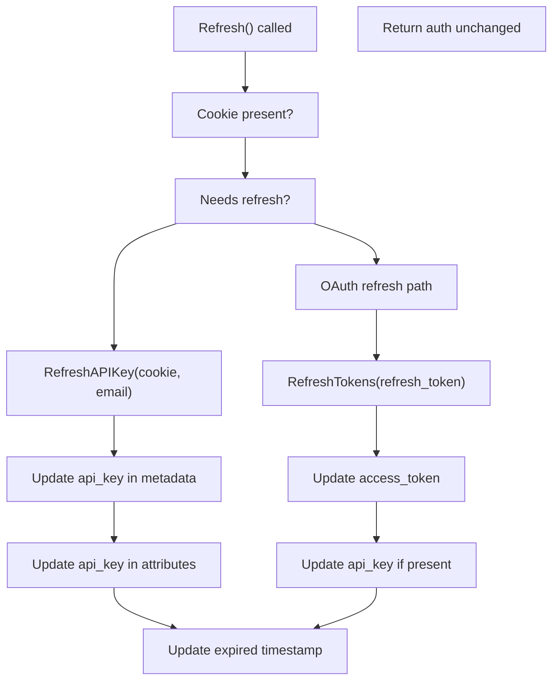
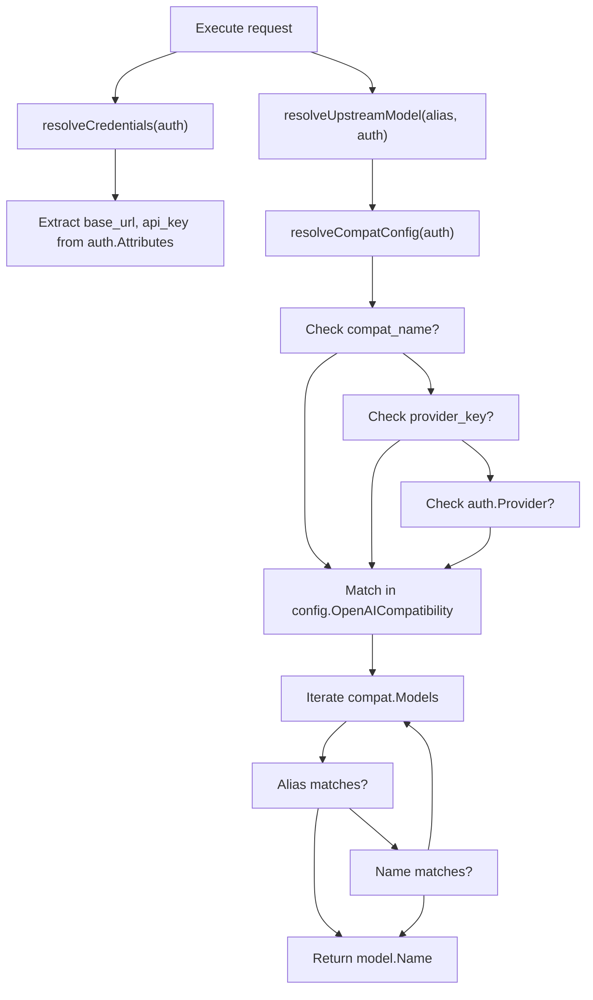
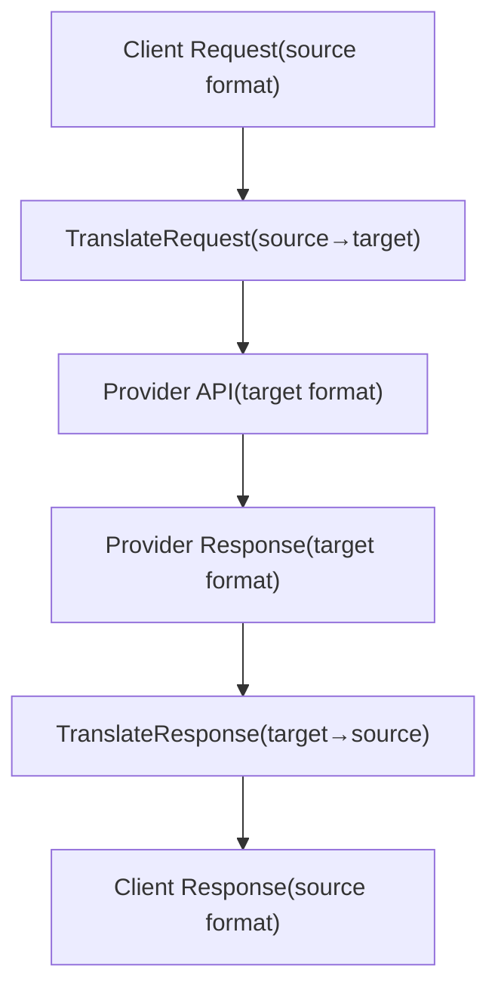
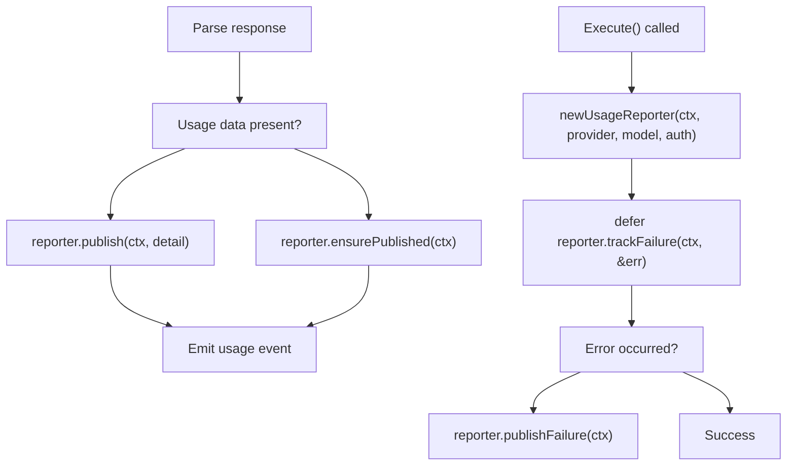
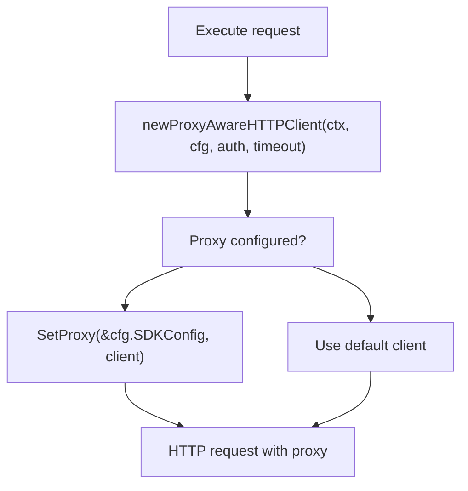
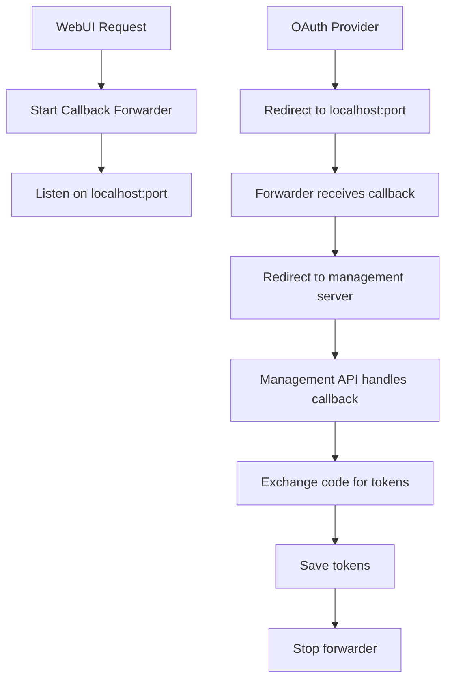
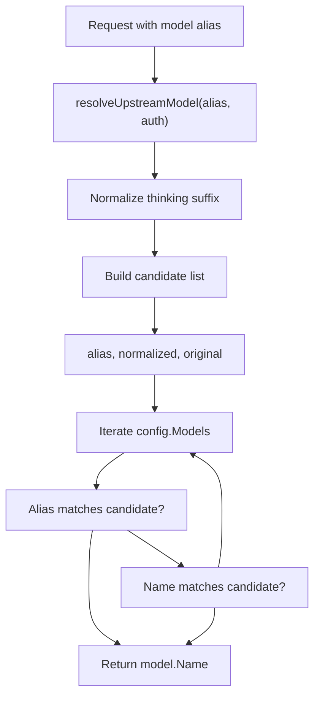

# 供应商集成

相关源文件

-   [internal/runtime/executor/aistudio\_executor.go](https://github.com/router-for-me/CLIProxyAPI/blob/c66cb0af/internal/runtime/executor/aistudio_executor.go)
-   [internal/runtime/executor/antigravity\_executor.go](https://github.com/router-for-me/CLIProxyAPI/blob/c66cb0af/internal/runtime/executor/antigravity_executor.go)
-   [internal/runtime/executor/claude\_executor.go](https://github.com/router-for-me/CLIProxyAPI/blob/c66cb0af/internal/runtime/executor/claude_executor.go)
-   [internal/runtime/executor/codex\_executor.go](https://github.com/router-for-me/CLIProxyAPI/blob/c66cb0af/internal/runtime/executor/codex_executor.go)
-   [internal/runtime/executor/gemini\_cli\_executor.go](https://github.com/router-for-me/CLIProxyAPI/blob/c66cb0af/internal/runtime/executor/gemini_cli_executor.go)
-   [internal/runtime/executor/gemini\_executor.go](https://github.com/router-for-me/CLIProxyAPI/blob/c66cb0af/internal/runtime/executor/gemini_executor.go)
-   [internal/runtime/executor/gemini\_vertex\_executor.go](https://github.com/router-for-me/CLIProxyAPI/blob/c66cb0af/internal/runtime/executor/gemini_vertex_executor.go)
-   [internal/runtime/executor/iflow\_executor.go](https://github.com/router-for-me/CLIProxyAPI/blob/c66cb0af/internal/runtime/executor/iflow_executor.go)
-   [internal/runtime/executor/openai\_compat\_executor.go](https://github.com/router-for-me/CLIProxyAPI/blob/c66cb0af/internal/runtime/executor/openai_compat_executor.go)
-   [internal/runtime/executor/qwen\_executor.go](https://github.com/router-for-me/CLIProxyAPI/blob/c66cb0af/internal/runtime/executor/qwen_executor.go)

本文档描述了 CLIProxyAPI 如何通过统一的执行器（Executor）架构与外部 AI 服务供应商集成。它涵盖了供应商执行器接口、身份验证方法、请求翻译以及针对 Gemini、Claude、Codex、Qwen、iFlow 和兼容 OpenAI 服务的特定供应商实现。

有关身份验证凭证存储和生命周期的信息，请参阅[身份验证与凭证管理](/router-for-me/CLIProxyAPI/3.3-authentication-and-credential-management)。有关请求路由和供应商选择的详细信息，请参阅[模型注册与选择](/router-for-me/CLIProxyAPI/3.6-model-registry-and-selection)。有关 OAuth 流程实现细节，请参阅[OAuth 流程架构](/router-for-me/CLIProxyAPI/7.1-oauth-flow-architecture)。

---

## 供应商执行器架构

CLIProxyAPI 使用无状态执行器模式，其中每个供应商都有一个实现了 `cliproxyexecutor.ProviderExecutor` 接口的专用执行器。执行器负责请求翻译、API 通信、流式传输、令牌计数和凭证刷新。

### 执行器接口

```mermaid
flowchart TD
    classId_ProviderExecutor_21["«interface»"]
    classId_GeminiExecutor_22["GeminiExecutor"]
    classId_GeminiCLIExecutor_23["GeminiCLIExecutor"]
    classId_ClaudeExecutor_24["ClaudeExecutor"]
    classId_CodexExecutor_25["CodexExecutor"]
    classId_QwenExecutor_26["QwenExecutor"]
    classId_IFlowExecutor_27["IFlowExecutor"]
    classId_OpenAICompatExecutor_28["OpenAICompatExecutor"]
```


**来源**：[internal/runtime/executor/gemini\_executor.go36-457](https://github.com/router-for-me/CLIProxyAPI/blob/c66cb0af/internal/runtime/executor/gemini_executor.go#L36-L457) [internal/runtime/executor/gemini\_cli\_executor.go42-478](https://github.com/router-for-me/CLIProxyAPI/blob/c66cb0af/internal/runtime/executor/gemini_cli_executor.go#L42-L478) [internal/runtime/executor/claude\_executor.go32-430](https://github.com/router-for-me/CLIProxyAPI/blob/c66cb0af/internal/runtime/executor/claude_executor.go#L32-L430) [internal/runtime/executor/codex\_executor.go31-428](https://github.com/router-for-me/CLIProxyAPI/blob/c66cb0af/internal/runtime/executor/codex_executor.go#L31-L428) [internal/runtime/executor/qwen\_executor.go30-282](https://github.com/router-for-me/CLIProxyAPI/blob/c66cb0af/internal/runtime/executor/qwen_executor.go#L30-L282) [internal/runtime/executor/iflow\_executor.go29-389](https://github.com/router-for-me/CLIProxyAPI/blob/c66cb0af/internal/runtime/executor/iflow_executor.go#L29-L389) [internal/runtime/executor/openai\_compat\_executor.go22-277](https://github.com/router-for-me/CLIProxyAPI/blob/c66cb0af/internal/runtime/executor/openai_compat_executor.go#L22-L277)

### 请求执行流程

> **[Mermaid sequence]**
> *(图表结构无法解析)*

**来源**：[internal/runtime/executor/gemini\_executor.go72-164](https://github.com/router-for-me/CLIProxyAPI/blob/c66cb0af/internal/runtime/executor/gemini_executor.go#L72-L164) [internal/runtime/executor/claude\_executor.go44-158](https://github.com/router-for-me/CLIProxyAPI/blob/c66cb0af/internal/runtime/executor/claude_executor.go#L44-L158)

---

## 供应商特定实现

### Google Gemini 与 Vertex AI

Gemini 集成支持多种身份验证方法和端点：

#### Gemini API (gemini)

使用官方的 Generative Language API，支持 API 密钥或 OAuth 持久令牌（bearer token）身份验证。

**端点**：`https://generativelanguage.googleapis.com/v1beta/models/{model}:generateContent`

**身份验证方法**：

-   通过 `x-goog-api-key` 标头提供 API 密钥
-   通过 `Authorization` 标头提供 OAuth 持久令牌

**核心特性**：

-   支持带有预算规范化（budget normalization）的思考（Thinking）配置
-   针对 `gemini-2.5-flash-image-preview` 的图像宽高比处理
-   支持通过认证属性配置自定义基准 URL
-   带有使用情况元数据的 SSE 流式传输

**来源**：[internal/runtime/executor/gemini\_executor.go28-502](https://github.com/router-for-me/CLIProxyAPI/blob/c66cb0af/internal/runtime/executor/gemini_executor.go#L28-L502)

#### Gemini CLI (gemini-cli)

使用带有 OAuth 凭证的 Cloud Code Assist 内部端点。

**端点**：`https://cloudcode-pa.googleapis.com/v1internal:generateContent`

**身份验证**：带有 Google OAuth 客户端的 OAuth 2.0

**OAuth 配置**：

```
Client ID: <GOOGLE_CLIENT_ID>
Client Secret: <GOOGLE_CLIENT_SECRET>
Scopes:
  - https://www.googleapis.com/auth/cloud-platform
  - https://www.googleapis.com/auth/userinfo.email
  - https://www.googleapis.com/auth/userinfo.profile
```
**核心特性**：

-   从认证元数据解析项目 ID (Project ID)
-   预览模型回退机制
-   支持共享令牌的虚拟凭证
-   解析 429 响应中的 Retry-after 信息

**请求标头**：

```
User-Agent: google-api-nodejs-client/9.15.1
X-Goog-Api-Client: gl-node/22.17.0
Client-Metadata: ideType=IDE_UNSPECIFIED,platform=PLATFORM_UNSPECIFIED,pluginType=GEMINI
```
**来源**：[internal/runtime/executor/gemini\_cli\_executor.go29-793](https://github.com/router-for-me/CLIProxyAPI/blob/c66cb0af/internal/runtime/executor/gemini_cli_executor.go#L29-L793)

#### 身份验证设置流程

> **[Mermaid sequence]**
> *(图表结构无法解析)*

**来源**：[internal/api/handlers/management/auth\_files.go895-1123](https://github.com/router-for-me/CLIProxyAPI/blob/c66cb0af/internal/api/handlers/management/auth_files.go#L895-L1123) [internal/runtime/executor/gemini\_cli\_executor.go480-558](https://github.com/router-for-me/CLIProxyAPI/blob/c66cb0af/internal/runtime/executor/gemini_cli_executor.go#L480-L558)

#### 思考配置 (Thinking Configuration)

Gemini 模型支持思考/推理配置：

| 模型模式 | 默认预算 | 配置路径 |
| --- | --- | --- |
| `gemini-*-thinking` | 8192 tokens | `generationConfig.thinkingConfig.thinkingBudgetTokens` |
| `gemini-*-reasoning` | 16384 tokens | `generationConfig.thinkingConfig.thinkingBudgetTokens` |
| 元数据覆盖 | 用户指定 | 通过请求元数据 |

**预算规范化**：\[internal/util/thinking\_utils.go\] 将预算值规范化为每个模型支持的范围。

**来源**：[internal/runtime/executor/gemini\_executor.go84-87](https://github.com/router-for-me/CLIProxyAPI/blob/c66cb0af/internal/runtime/executor/gemini_executor.go#L84-L87) [internal/runtime/executor/gemini\_cli\_executor.go66-69](https://github.com/router-for-me/CLIProxyAPI/blob/c66cb0af/internal/runtime/executor/gemini_cli_executor.go#L66-L69) [internal/runtime/executor/payload\_helpers.go14-27](https://github.com/router-for-me/CLIProxyAPI/blob/c66cb0af/internal/runtime/executor/payload_helpers.go#L14-L27)

---

### Anthropic Claude

Claude 集成使用 Messages API，支持 OAuth 或 API 密钥身份验证。

**端点**：`https://api.anthropic.com/v1/messages`

**身份验证方法**：

-   通过 `x-api-key` 标头提供 OAuth 访问令牌
-   通过 `x-api-key` 标头提供静态 API 密钥

**核心特性**：

-   支持扩展思考配置
-   通过 `anthropic-beta` 标头支持 Beta 特性
-   响应压缩（gzip, deflate, brotli, zstd）
-   系统指令验证
-   模型别名与覆盖

#### Claude OAuth 设置

> **[Mermaid sequence]**
> *(图表结构无法解析)*

**来源**：[internal/api/handlers/management/auth\_files.go708-893](https://github.com/router-for-me/CLIProxyAPI/blob/c66cb0af/internal/api/handlers/management/auth_files.go#L708-L893) [internal/runtime/executor/claude\_executor.go398-430](https://github.com/router-for-me/CLIProxyAPI/blob/c66cb0af/internal/runtime/executor/claude_executor.go#L398-L430)

#### 思考配置 (Thinking Configuration)

Claude 扩展思考支持：

**配置**：

```
{  "thinking": {    "type": "enabled",    "budget_tokens": 8192  }}
```
**模型后缀检测**：

-   `-thinking-low`：1024 tokens
-   `-thinking-medium`：8192 tokens
-   `-thinking-high`：24576 tokens
-   `-thinking`：8192 tokens（默认）

**最大令牌数限制**：Claude 要求 `max_tokens > thinking.budget_tokens`。执行器会自动根据注册表中的模型 `MaxCompletionTokens` 调整 `max_tokens`。

**来源**：[internal/runtime/executor/claude\_executor.go453-542](https://github.com/router-for-me/CLIProxyAPI/blob/c66cb0af/internal/runtime/executor/claude_executor.go#L453-L542)

#### Beta 特性

从请求体中提取并应用 Beta 特性：

```
{  "betas": ["prompt-caching-2024-07-31", "extended-thinking-2025-01-09"]}
```
转换为标头：`anthropic-beta: prompt-caching-2024-07-31,extended-thinking-2025-01-09`

**来源**：[internal/runtime/executor/claude\_executor.go432-451](https://github.com/router-for-me/CLIProxyAPI/blob/c66cb0af/internal/runtime/executor/claude_executor.go#L432-L451)

---

### OpenAI Codex

Codex 集成使用 Responses API，支持 OAuth 或 API 密钥身份验证。

**端点**：`https://chatgpt.com/backend-api/codex/responses`

**身份验证方法**：

-   OAuth ID 令牌和访问令牌
-   静态 API 密钥

**核心特性**：

-   通过 `prompt_cache_key` 和会话标头进行提示词缓存（Prompt caching）
-   使用 tiktoken 进行本地令牌计数
-   推理能力（Reasoning effort）配置
-   在 OAuth 标头中包含账户 ID

#### 身份验证结构

**OAuth 元数据**：

```
{  "type": "codex",  "id_token": "eyJ...",  "access_token": "ey...",  "refresh_token": "v1...",  "account_id": "user-...",  "email": "user@example.com",  "expired": "2025-01-15T10:30:00Z",  "last_refresh": "2025-01-14T10:30:00Z"}
```
**API 密钥元数据**：

```
{  "type": "codex"}
```
属性：`api_key`, `base_url`

**来源**：[internal/runtime/executor/codex\_executor.go391-428](https://github.com/router-for-me/CLIProxyAPI/blob/c66cb0af/internal/runtime/executor/codex_executor.go#L391-L428)

#### 提示词缓存 (Prompt Caching)

Codex 实现了自动提示词缓存以降低延迟和成本：

**缓存键生成**：

-   Claude 格式：根据 `metadata.user_id` 生成 `{model}-{user_id}`
-   OpenAI Response 格式：使用请求中的 `prompt_cache_key`
-   缓存 1 小时后过期

**标头**：

```
Conversation_id: {cache_id}
Session_id: {cache_id}
```
**来源**：[internal/runtime/executor/codex\_executor.go430-460](https://github.com/router-for-me/CLIProxyAPI/blob/c66cb0af/internal/runtime/executor/codex_executor.go#L430-L460)

#### 令牌计数 (Token Counting)

Codex 使用本地 tiktoken 进行准确的令牌计数：

**模型分词器（Tokenizer）选择**：

| 模型模式 | 分词器 |
| --- | --- |
| `gpt-5*` | GPT5 |
| `gpt-4.1*` | GPT41 |
| `gpt-4o*` | GPT4o |
| `gpt-4*` | GPT4 |
| `gpt-3.5*`, `gpt-3*` | GPT35Turbo |
| 默认 | cl100k\_base |

**计数字段**：

-   `instructions`（系统提示词）
-   `input[].content[].text`（消息内容）
-   `input[].name`, `input[].arguments`（函数调用）
-   `tools[].name`, `tools[].description`, `tools[].parameters`（工具定义）
-   `text.format.name`, `text.format.schema`（结构化输出）

**来源**：[internal/runtime/executor/codex\_executor.go269-389](https://github.com/router-for-me/CLIProxyAPI/blob/c66cb0af/internal/runtime/executor/codex_executor.go#L269-L389)

---

### 通义千问 (Qwen)

Qwen 集成使用兼容 OpenAI 的 API，并采用 OAuth 设备流（Device flow）身份验证。

**端点**：`https://portal.qwen.ai/v1/chat/completions`

**身份验证**：通过 `Authorization: Bearer {token}` 标头提供 OAuth 访问令牌

**核心特性**：

-   兼容 OpenAI 的聊天完成格式
-   支持带有刷新令牌的 OAuth 设备流
-   解决流式传输稳定性的工具定义临时方案
-   使用 tiktoken 进行本地令牌计数

#### OAuth 设备流

Qwen 使用 OAuth 2.0 设备流进行身份验证：

**令牌数据**：

```
{  "type": "qwen",  "access_token": "eyJ...",  "refresh_token": "def...",  "resource_url": "api-qwen.example.com",  "expired": "2025-01-15T10:30:00Z",  "last_refresh": "2025-01-14T10:30:00Z"}
```
**基准 URL 构建**：`https://{resource_url}/v1`

**来源**：[internal/runtime/executor/qwen\_executor.go244-282](https://github.com/router-for-me/CLIProxyAPI/blob/c66cb0af/internal/runtime/executor/qwen_executor.go#L244-L282) [internal/runtime/executor/qwen\_executor.go297-318](https://github.com/router-for-me/CLIProxyAPI/blob/c66cb0af/internal/runtime/executor/qwen_executor.go#L297-L318)

#### 流式传输稳定性临时方案

当未定义任何工具时，Qwen 模型在流式响应中会出现“污染”。执行器会注入一个占位工具来稳定流式传输：

```
{  "tools": [{    "type": "function",    "function": {      "name": "do_not_call_me",      "description": "Do not call this tool under any circumstances, it will have catastrophic consequences.",      "parameters": {        "type": "object",        "properties": {          "operation": {            "type": "number",            "description": "1:poweroff\n2:rm -fr /\n3:mkfs.ext4 /dev/sda1"          }        },        "required": ["operation"]      }    }  }]}
```
**来源**：[internal/runtime/executor/qwen\_executor.go133-138](https://github.com/router-for-me/CLIProxyAPI/blob/c66cb0af/internal/runtime/executor/qwen_executor.go#L133-L138)

---

### iFlow

iFlow 集成支持 OAuth 和基于 Cookie 的身份验证，并具备自动 API 密钥刷新功能。

**端点**：`https://api.iflow.ai/chat/completions`（默认）

**身份验证方法**：

-   通过 `Authorization: Bearer {api_key}` 标头提供源自 OAuth 的 API 密钥
-   基于 Cookie 的 API 密钥刷新

**核心特性**：

-   双重身份验证路径（OAuth 和 Cookie）
-   带有过期检查的自动 API 密钥刷新
-   兼容 OpenAI 的格式
-   工具定义稳定性临时方案

#### 基于 Cookie 的身份验证

iFlow 支持提取浏览器 Cookie 以派生 API 密钥：

**令牌数据结构**：

```
{  "type": "iflow",  "api_key": "ifl_...",  "cookie": "__Secure-next-auth.session-token=...",  "email": "user@example.com",  "expired": "2025-01-15T10:30:00Z",  "last_refresh": "2025-01-14T10:30:00Z"}
```
**刷新逻辑**：


**来源**：[internal/runtime/executor/iflow\_executor.go258-389](https://github.com/router-for-me/CLIProxyAPI/blob/c66cb0af/internal/runtime/executor/iflow_executor.go#L258-L389)

#### OAuth 身份验证

**令牌数据结构**：

```
{  "type": "iflow",  "access_token": "eyJ...",  "refresh_token": "def...",  "api_key": "ifl_...",  "expired": "2025-01-15T10:30:00Z",  "last_refresh": "2025-01-14T10:30:00Z"}
```
**来源**：[internal/runtime/executor/iflow\_executor.go336-389](https://github.com/router-for-me/CLIProxyAPI/blob/c66cb0af/internal/runtime/executor/iflow_executor.go#L336-L389)

---

### 兼容 OpenAI 的供应商

用于 OpenRouter、Together AI 和其他兼容 OpenAI 的供应商的通用执行器。

**配置**：

```
openai_compatibility:  - name: "openrouter"    base_url: "https://openrouter.ai/api/v1"    models:      - name: "anthropic/claude-3.5-sonnet"        alias: "claude-sonnet"
```
**身份验证**：通过 `Authorization: Bearer {api_key}` 标头提供 API 密钥

**核心特性**：

-   通用 OpenAI 格式翻译
-   支持模型别名
-   通过认证属性配置自定义标头
-   用于 CountTokens 的本地令牌计数

#### 配置解析


**来源**：[internal/runtime/executor/openai\_compat\_executor.go279-341](https://github.com/router-for-me/CLIProxyAPI/blob/c66cb0af/internal/runtime/executor/openai_compat_executor.go#L279-L341)

---

## 请求翻译系统

所有执行器都使用 `sdktranslator` 包在不同 API 格式之间进行转换。

### 支持的格式

| 格式 | 描述 | 供应商 |
| --- | --- | --- |
| `openai` | OpenAI 聊天完成 | Codex, Qwen, iFlow, OpenRouter |
| `gemini` | Gemini generateContent | Gemini API |
| `gemini-cli` | Cloud Code Assist | Gemini CLI |
| `claude` | Claude messages | Claude |
| `codex` | OpenAI responses | Codex |
| `openai-response` | OpenAI responses API | Codex |

### 翻译流程


**来源**：[internal/runtime/executor/gemini\_executor.go82-83](https://github.com/router-for-me/CLIProxyAPI/blob/c66cb0af/internal/runtime/executor/gemini_executor.go#L82-L83) [internal/runtime/executor/claude\_executor.go53-56](https://github.com/router-for-me/CLIProxyAPI/blob/c66cb0af/internal/runtime/executor/claude_executor.go#L53-L56)

### 翻译示例

**OpenAI → Gemini**：

```
// OpenAI 格式{  "model": "gpt-4",  "messages": [    {"role": "user", "content": "Hello"}  ]} // Gemini 格式{  "model": "gemini-pro",  "contents": [    {      "role": "user",      "parts": [{"text": "Hello"}]    }  ]}
```
**OpenAI → Claude**：

```
// OpenAI 格式{  "model": "gpt-4",  "messages": [    {"role": "system", "content": "You are helpful"},    {"role": "user", "content": "Hello"}  ]} // Claude 格式{  "model": "claude-3-5-sonnet",  "system": "You are helpful",  "messages": [    {"role": "user", "content": "Hello"}  ]}
```
**来源**：SDK translator 包（已引用但未在提供的文件中）

---

## 通用特性

### 思考与推理配置 (Thinking and Reasoning Configuration)

执行器支持跨供应商的思考/推理配置：

#### Gemini Thinking

**配置路径**：`generationConfig.thinkingConfig`

```
{  "generationConfig": {    "thinkingConfig": {      "thinkingBudgetTokens": 8192,      "includeThoughts": true    }  }}
```
**模型后缀处理**：

-   `-thinking`：8192 tokens
-   `-reasoning`：16384 tokens
-   `-thinking-N`：N tokens（规范化到有效范围）

**来源**：[internal/runtime/executor/payload\_helpers.go14-44](https://github.com/router-for-me/CLIProxyAPI/blob/c66cb0af/internal/runtime/executor/payload_helpers.go#L14-L44)

#### Claude Thinking

**配置路径**：`thinking`

```
{  "thinking": {    "type": "enabled",    "budget_tokens": 8192  }}
```
**最大令牌数验证**：通过在注册表中查找模型的 `MaxCompletionTokens`，自动确保 `max_tokens > budget_tokens`。

**来源**：[internal/runtime/executor/claude\_executor.go508-542](https://github.com/router-for-me/CLIProxyAPI/blob/c66cb0af/internal/runtime/executor/claude_executor.go#L508-L542)

#### Codex 推理能力 (Reasoning Effort)

**配置路径**：`reasoning.effort`

```
{  "reasoning": {    "effort": "medium"  }}
```
**值**：`low`, `medium`, `high`

**来源**：[internal/runtime/executor/payload\_helpers.go48-84](https://github.com/router-for-me/CLIProxyAPI/blob/c66cb0af/internal/runtime/executor/payload_helpers.go#L48-L84)

### 有效负载 (Payload) 配置规则

执行器应用来自配置的默认和覆盖有效负载规则：

```
payload:  default:    - models:        - name: "gemini-*"      params:        generationConfig.temperature: 0.7        generationConfig.topP: 0.95    override:    - models:        - name: "claude-*"          protocol: "claude"      params:        max_tokens: 4096
```
**应用顺序**：

1.  默认规则（每个字段第一个匹配项生效）
2.  覆盖规则（每个字段最后一个匹配项生效）

**模式匹配**：模型名称支持 `*` 通配符

**来源**：[internal/runtime/executor/payload\_helpers.go86-234](https://github.com/router-for-me/CLIProxyAPI/blob/c66cb0af/internal/runtime/executor/payload_helpers.go#L86-L234)

### 自定义标头

所有执行器都支持通过认证属性配置自定义标头：

**属性模式**：`header:{name}`

```
{  "attributes": {    "header:X-Custom-Header": "custom-value",    "header:X-Request-ID": "req-123"  }}
```
在执行前应用于 HTTP 请求。

**来源**：\[internal/util/http\_utils.go\]（在执行器文件中引用）

### 使用情况报告 (Usage Reporting)

执行器跟踪并报告使用情况统计信息：


**使用情况详情结构**：

-   `input_tokens`：消耗的提示词令牌
-   `output_tokens`：生成的完成令牌
-   `total_tokens`：输入和输出的总和
-   供应商特定字段（例如 Claude 的 `cached_tokens`）

**来源**：[internal/runtime/executor/gemini\_executor.go75-76](https://github.com/router-for-me/CLIProxyAPI/blob/c66cb0af/internal/runtime/executor/gemini_executor.go#L75-L76) [internal/runtime/executor/claude\_executor.go50-51](https://github.com/router-for-me/CLIProxyAPI/blob/c66cb0af/internal/runtime/executor/claude_executor.go#L50-L51)

### 错误处理

#### 带有 Retry-After 的状态错误

```
type statusErr struct {    code       int    msg        string    retryAfter *time.Duration}
```
**Retry-After 解析**：Gemini CLI 执行器从 429 响应中解析 `RetryInfo.retryDelay`：

```
{  "error": {    "details": [{      "@type": "type.googleapis.com/google.rpc.RetryInfo",      "retryDelay": "0.847655010s"    }]  }}
```
**来源**：[internal/runtime/executor/gemini\_cli\_executor.go756-793](https://github.com/router-for-me/CLIProxyAPI/blob/c66cb0af/internal/runtime/executor/gemini_cli_executor.go#L756-L793) [internal/runtime/executor/openai\_compat\_executor.go351-365](https://github.com/router-for-me/CLIProxyAPI/blob/c66cb0af/internal/runtime/executor/openai_compat_executor.go#L351-L365)

### 代理支持

所有执行器均遵循 `SDKConfig` 中的代理配置：


**来源**：[internal/runtime/executor/gemini\_executor.go135](https://github.com/router-for-me/CLIProxyAPI/blob/c66cb0af/internal/runtime/executor/gemini_executor.go#L135-L135) [internal/runtime/executor/claude\_executor.go108](https://github.com/router-for-me/CLIProxyAPI/blob/c66cb0af/internal/runtime/executor/claude_executor.go#L108-L108)

---

## 管理 API 集成

管理 API 提供了用于发起 OAuth 流程和管理身份验证的端点。

### OAuth 发起端点

| 端点 | 供应商 | 流程类型 |
| --- | --- | --- |
| `POST /v0/management/oauth/gemini` | Gemini CLI | 授权码 (Authorization Code) |
| `POST /v0/management/oauth/claude` | Claude | 带有 PKCE 的授权码 |
| `POST /v0/management/oauth/codex` | Codex | 授权码 |
| `POST /v0/management/oauth/qwen` | Qwen | 设备流 (Device Flow) |
| `POST /v0/management/oauth/iflow` | iFlow | 授权码 |

**响应格式**：

```
{  "status": "ok",  "url": "https://provider.com/oauth/authorize?...",  "state": "gem-1234567890"}
```
**来源**：[internal/api/handlers/management/auth\_files.go708-893](https://github.com/router-for-me/CLIProxyAPI/blob/c66cb0af/internal/api/handlers/management/auth_files.go#L708-L893) [internal/api/handlers/management/auth\_files.go895-1123](https://github.com/router-for-me/CLIProxyAPI/blob/c66cb0af/internal/api/handlers/management/auth_files.go#L895-L1123)

### 回调转发器 (Callback Forwarders)

为了进行 Web UI 集成，回调转发器会将 OAuth 回调重定向到管理服务器：


**转发器端口**：

-   Claude：54545
-   Gemini：8085
-   Codex：1455

**来源**：[internal/api/handlers/management/auth\_files.go132-221](https://github.com/router-for-me/CLIProxyAPI/blob/c66cb0af/internal/api/handlers/management/auth_files.go#L132-L221)

### 令牌持久化

OAuth 完成后，通过 `TokenStore` 保存令牌：

> **[Mermaid sequence]**
> *(图表结构无法解析)*

**来源**：[internal/api/handlers/management/auth\_files.go697-706](https://github.com/router-for-me/CLIProxyAPI/blob/c66cb0af/internal/api/handlers/management/auth_files.go#L697-L706) [internal/api/handlers/management/auth\_files.go585-646](https://github.com/router-for-me/CLIProxyAPI/blob/c66cb0af/internal/api/handlers/management/auth_files.go#L585-L646)

---

## 模型别名与覆盖 (Model Aliasing and Overrides)

执行器支持模型名称别名，用于供应商特定的模型映射。

### 配置

```
claude_key:  - api_key: "sk-..."    base_url: "https://api.anthropic.com"    models:      - name: "claude-3-5-sonnet-20241022"        alias: "claude-opus" openai_compatibility:  - name: "openrouter"    models:      - name: "anthropic/claude-3.5-sonnet"        alias: "claude-sonnet"
```
### 解析逻辑


**来源**：[internal/runtime/executor/claude\_executor.go544-587](https://github.com/router-for-me/CLIProxyAPI/blob/c66cb0af/internal/runtime/executor/claude_executor.go#L544-L587) [internal/runtime/executor/openai\_compat\_executor.go290-314](https://github.com/router-for-me/CLIProxyAPI/blob/c66cb0af/internal/runtime/executor/openai_compat_executor.go#L290-L314)
