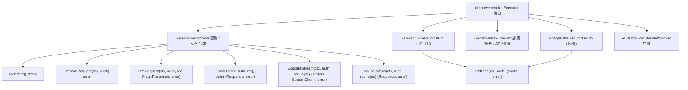
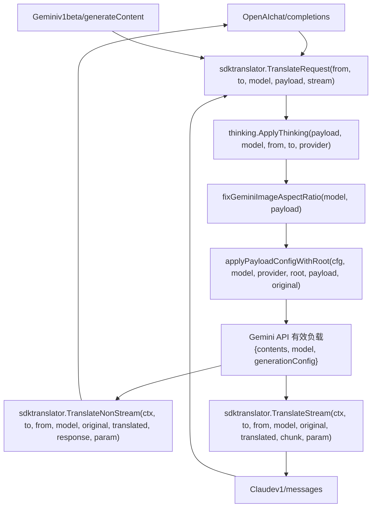

# Google Gemini 与 Vertex AI

相关源文件

-   [internal/auth/claude/token.go](https://github.com/router-for-me/CLIProxyAPI/blob/c66cb0af/internal/auth/claude/token.go)
-   [internal/auth/codex/token.go](https://github.com/router-for-me/CLIProxyAPI/blob/c66cb0af/internal/auth/codex/token.go)
-   [internal/auth/gemini/gemini\_token.go](https://github.com/router-for-me/CLIProxyAPI/blob/c66cb0af/internal/auth/gemini/gemini_token.go)
-   [internal/auth/iflow/iflow\_token.go](https://github.com/router-for-me/CLIProxyAPI/blob/c66cb0af/internal/auth/iflow/iflow_token.go)
-   [internal/auth/kimi/token.go](https://github.com/router-for-me/CLIProxyAPI/blob/c66cb0af/internal/auth/kimi/token.go)
-   [internal/auth/qwen/qwen\_token.go](https://github.com/router-for-me/CLIProxyAPI/blob/c66cb0af/internal/auth/qwen/qwen_token.go)
-   [internal/misc/credentials.go](https://github.com/router-for-me/CLIProxyAPI/blob/c66cb0af/internal/misc/credentials.go)
-   [internal/runtime/executor/aistudio\_executor.go](https://github.com/router-for-me/CLIProxyAPI/blob/c66cb0af/internal/runtime/executor/aistudio_executor.go)
-   [internal/runtime/executor/antigravity\_executor.go](https://github.com/router-for-me/CLIProxyAPI/blob/c66cb0af/internal/runtime/executor/antigravity_executor.go)
-   [internal/runtime/executor/claude\_executor.go](https://github.com/router-for-me/CLIProxyAPI/blob/c66cb0af/internal/runtime/executor/claude_executor.go)
-   [internal/runtime/executor/codex\_executor.go](https://github.com/router-for-me/CLIProxyAPI/blob/c66cb0af/internal/runtime/executor/codex_executor.go)
-   [internal/runtime/executor/gemini\_cli\_executor.go](https://github.com/router-for-me/CLIProxyAPI/blob/c66cb0af/internal/runtime/executor/gemini_cli_executor.go)
-   [internal/runtime/executor/gemini\_executor.go](https://github.com/router-for-me/CLIProxyAPI/blob/c66cb0af/internal/runtime/executor/gemini_executor.go)
-   [internal/runtime/executor/gemini\_vertex\_executor.go](https://github.com/router-for-me/CLIProxyAPI/blob/c66cb0af/internal/runtime/executor/gemini_vertex_executor.go)
-   [internal/runtime/executor/iflow\_executor.go](https://github.com/router-for-me/CLIProxyAPI/blob/c66cb0af/internal/runtime/executor/iflow_executor.go)
-   [internal/runtime/executor/openai\_compat\_executor.go](https://github.com/router-for-me/CLIProxyAPI/blob/c66cb0af/internal/runtime/executor/openai_compat_executor.go)
-   [internal/runtime/executor/qwen\_executor.go](https://github.com/router-for-me/CLIProxyAPI/blob/c66cb0af/internal/runtime/executor/qwen_executor.go)
-   [internal/translator/antigravity/openai/chat-completions/antigravity\_openai\_request.go](https://github.com/router-for-me/CLIProxyAPI/blob/c66cb0af/internal/translator/antigravity/openai/chat-completions/antigravity_openai_request.go)
-   [internal/translator/gemini-cli/claude/gemini-cli\_claude\_request.go](https://github.com/router-for-me/CLIProxyAPI/blob/c66cb0af/internal/translator/gemini-cli/claude/gemini-cli_claude_request.go)
-   [internal/translator/gemini-cli/openai/chat-completions/gemini-cli\_openai\_request.go](https://github.com/router-for-me/CLIProxyAPI/blob/c66cb0af/internal/translator/gemini-cli/openai/chat-completions/gemini-cli_openai_request.go)
-   [internal/translator/gemini/claude/gemini\_claude\_request.go](https://github.com/router-for-me/CLIProxyAPI/blob/c66cb0af/internal/translator/gemini/claude/gemini_claude_request.go)
-   [internal/translator/gemini/openai/chat-completions/gemini\_openai\_request.go](https://github.com/router-for-me/CLIProxyAPI/blob/c66cb0af/internal/translator/gemini/openai/chat-completions/gemini_openai_request.go)
-   [internal/translator/gemini/openai/responses/gemini\_openai-responses\_request.go](https://github.com/router-for-me/CLIProxyAPI/blob/c66cb0af/internal/translator/gemini/openai/responses/gemini_openai-responses_request.go)

本页面记录了与 Google Gemini 和 Vertex AI 服务的集成，包括身份验证方法、执行器实现、OAuth 流程以及供应商特定功能。CLIProxyAPI 支持多种 Gemini 访问模式：基于 API 密钥的 Generative Language API、基于 OAuth 的 Gemini CLI (Cloud Code Assist)、带有服务账号或 API 密钥的 Vertex AI、Antigravity（Google 内部服务）以及基于 WebSocket 的 AI Studio。

有关通用供应商集成的概念，请参阅[供应商集成](/router-for-me/CLIProxyAPI/6-provider-integration)。有关身份验证管理的详情，请参阅[身份验证流程](/router-for-me/CLIProxyAPI/7-authentication-flows)。有关跨所有供应商的 OAuth 特定设置，请参阅[供应商特定 OAuth 设置](/router-for-me/CLIProxyAPI/7.2-provider-specific-oauth-setup)。

---

## 身份验证方法

CLIProxyAPI 为访问 Google Gemini 模型支持五种不同的身份验证模式，每种模式具有不同的端点、功能和凭据要求。

### 身份验证模式概览

```mermaid
flowchart TD
    APIKey["API 密钥(Generative Language API)"]
    OAuth["OAuth 持久令牌(Gemini CLI)"]
    ServiceAccount["服务账号(Vertex AI)"]
    VertexAPIKey["Vertex API 密钥(Vertex AI)"]
    WebSocket["WebSocket 通道(AI Studio)"]
    GeminiExec["GeminiExecutorinternal/runtime/executor/gemini_executor.go"]
    GeminiCLIExec["GeminiCLIExecutorinternal/runtime/executor/gemini_cli_executor.go"]
    VertexExec["GeminiVertexExecutorinternal/runtime/executor/gemini_vertex_executor.go"]
    AntigravityExec["AntigravityExecutorinternal/runtime/executor/antigravity_executor.go"]
    AIStudioExec["AIStudioExecutorinternal/runtime/executor/aistudio_executor.go"]
    GenLangAPI["generativelanguage.googleapis.com/v1beta/models"]
    CloudCodeAPI["cloudcode-pa.googleapis.com/v1internal"]
    VertexAPI["{location}-aiplatform.googleapis.com/v1/projects/{project}/locations"]
    AntigravityAPI["cloudcode-pa.googleapis.com/v1internal (Antigravity)"]
    WSRelay["WebSocket Relaywsrelay.Manager"]

    APIKey --> GeminiExec
    OAuth --> GeminiCLIExec
    ServiceAccount --> VertexExec
    VertexAPIKey --> VertexExec
    WebSocket --> AIStudioExec
    OAuth --> AntigravityExec
    GeminiExec --> GenLangAPI
    GeminiCLIExec --> CloudCodeAPI
    VertexExec --> VertexAPI
    AntigravityExec --> AntigravityAPI
    AIStudioExec --> WSRelay
```


**来源：** [internal/runtime/executor/gemini\_executor.go26-43](https://github.com/router-for-me/CLIProxyAPI/blob/c66cb0af/internal/runtime/executor/gemini_executor.go#L26-L43) [internal/runtime/executor/gemini\_cli\_executor.go35-42](https://github.com/router-for-me/CLIProxyAPI/blob/c66cb0af/internal/runtime/executor/gemini_cli_executor.go#L35-L42) [internal/runtime/executor/gemini\_vertex\_executor.go30-33](https://github.com/router-for-me/CLIProxyAPI/blob/c66cb0af/internal/runtime/executor/gemini_vertex_executor.go#L30-L33) [internal/runtime/executor/antigravity\_executor.go38-49](https://github.com/router-for-me/CLIProxyAPI/blob/c66cb0af/internal/runtime/executor/antigravity_executor.go#L38-L49) [internal/runtime/executor/aistudio\_executor.go26-31](https://github.com/router-for-me/CLIProxyAPI/blob/c66cb0af/internal/runtime/executor/aistudio_executor.go#L26-L31)

### API 密钥身份验证 (Generative Language API)

`GeminiExecutor` 将 API 密钥用于官方的 Generative Language API。API 密钥在 `config.yaml` 的 `gemini_keys` 下配置，或从认证元数据中提取。

| 特性 | 取值 |
| --- | --- |
| 端点 | `https://generativelanguage.googleapis.com` |
| API 版本 | `v1beta` |
| 标头 | `x-goog-api-key` |
| 标识符 | `gemini` |

凭据解析逻辑位于 [internal/runtime/executor/gemini\_executor.go373-384](https://github.com/router-for-me/CLIProxyAPI/blob/c66cb0af/internal/runtime/executor/gemini_executor.go#L373-L384)：

-   首先检查 `auth.Attributes["api_key"]`
-   回退到 `auth.Metadata["access_token"]` 以获取 OAuth 持久令牌
-   从 `auth.Attributes["base_url"]` 解析自定义基准 URL

**来源：** [internal/runtime/executor/gemini\_executor.go52-57](https://github.com/router-for-me/CLIProxyAPI/blob/c66cb0af/internal/runtime/executor/gemini_executor.go#L52-L57) [internal/runtime/executor/gemini\_executor.go59-73](https://github.com/router-for-me/CLIProxyAPI/blob/c66cb0af/internal/runtime/executor/gemini_executor.go#L59-L73) [internal/runtime/executor/gemini\_executor.go373-384](https://github.com/router-for-me/CLIProxyAPI/blob/c66cb0af/internal/runtime/executor/gemini_executor.go#L373-L384)

### OAuth 持久令牌 (Gemini CLI)

`GeminiCLIExecutor` 使用通过 Google Cloud Platform 身份验证获得的 OAuth 令牌，用于访问 Cloud Code Assist 端点。此模式需要项目 ID (Project ID) 关联，并支持多项目配置。

| 特性 | 取值 |
| --- | --- |
| 端点 | `https://cloudcode-pa.googleapis.com` |
| API 版本 | `v1internal` |
| OAuth 客户端 ID | `681255809395-oo8ft2oprdrnp9e3aqf6av3hmdib135j.apps.googleusercontent.com` |
| 作用域 | `cloud-platform`, `userinfo.email`, `userinfo.profile` |
| 标识符 | `gemini-cli` |

[internal/runtime/executor/gemini\_cli\_executor.go460-498](https://github.com/router-for-me/CLIProxyAPI/blob/c66cb0af/internal/runtime/executor/gemini_cli_executor.go#L460-L498) 处的令牌源准备过程使用存储在认证元数据中的刷新令牌创建一个 `oauth2.TokenSource`。访问令牌过期后会自动刷新。

**来源：** [internal/runtime/executor/gemini\_cli\_executor.go35-46](https://github.com/router-for-me/CLIProxyAPI/blob/c66cb0af/internal/runtime/executor/gemini_cli_executor.go#L35-L46) [internal/runtime/executor/gemini\_cli\_executor.go60-62](https://github.com/router-for-me/CLIProxyAPI/blob/c66cb0af/internal/runtime/executor/gemini_cli_executor.go#L60-L62) [internal/runtime/executor/gemini\_cli\_executor.go460-498](https://github.com/router-for-me/CLIProxyAPI/blob/c66cb0af/internal/runtime/executor/gemini_cli_executor.go#L460-L498)

### 服务账号 (Vertex AI)

`GeminiVertexExecutor` 支持针对 Vertex AI 的 Google Cloud 服务账号凭证。服务账号 JSON 存储在 `sa` 键下的认证元数据中。

| 特性 | 取值 |
| --- | --- |
| 端点 | `https://{location}-aiplatform.googleapis.com` |
| API 版本 | `v1` |
| 默认位置 | `us-central1` |
| 作用域 | `cloud-platform` |
| 标识符 | `vertex` |

[internal/runtime/executor/gemini\_vertex\_executor.go701-722](https://github.com/router-for-me/CLIProxyAPI/blob/c66cb0af/internal/runtime/executor/gemini_vertex_executor.go#L701-L722) 处的访问令牌生成过程使用 `google.CredentialsFromJSON` 从服务账号 JSON 创建 OAuth2 令牌源。

**来源：** [internal/runtime/executor/gemini\_vertex\_executor.go30-33](https://github.com/router-for-me/CLIProxyAPI/blob/c66cb0af/internal/runtime/executor/gemini_vertex_executor.go#L30-L33) [internal/runtime/executor/gemini\_vertex\_executor.go173-189](https://github.com/router-for-me/CLIProxyAPI/blob/c66cb0af/internal/runtime/executor/gemini_vertex_executor.go#L173-L189) [internal/runtime/executor/gemini\_vertex\_executor.go701-722](https://github.com/router-for-me/CLIProxyAPI/blob/c66cb0af/internal/runtime/executor/gemini_vertex_executor.go#L701-L722)

### Vertex API 密钥

Vertex AI 也支持 API 密钥身份验证，作为服务账号的替代方案。API 密钥通过 `auth.Attributes["api_key"]` 和 `auth.Attributes["base_url"]` 进行配置。

**来源：** [internal/runtime/executor/gemini\_vertex\_executor.go236-249](https://github.com/router-for-me/CLIProxyAPI/blob/c66cb0af/internal/runtime/executor/gemini_vertex_executor.go#L236-L249) [internal/runtime/executor/gemini\_vertex\_executor.go678-699](https://github.com/router-for-me/CLIProxyAPI/blob/c66cb0af/internal/runtime/executor/gemini_vertex_executor.go#L678-L699)

### WebSocket 中继 (AI Studio)

`AIStudioExecutor` 通过 WebSocket 中继 (`wsrelay.Manager`) 为 AI Studio 供应商路由请求。这支持通过 WebSocket 连接进行运行时凭证注册，无需文件存储。

**来源：** [internal/runtime/executor/aistudio\_executor.go26-44](https://github.com/router-for-me/CLIProxyAPI/blob/c66cb0af/internal/runtime/executor/aistudio_executor.go#L26-L44) [internal/runtime/executor/aistudio\_executor.go54-110](https://github.com/router-for-me/CLIProxyAPI/blob/c66cb0af/internal/runtime/executor/aistudio_executor.go#L54-L110)

---

## 执行器架构

### 执行器层级与职责


**来源：** [internal/runtime/executor/gemini\_executor.go40-57](https://github.com/router-for-me/CLIProxyAPI/blob/c66cb0af/internal/runtime/executor/gemini_executor.go#L40-L57) [internal/runtime/executor/gemini\_cli\_executor.go48-65](https://github.com/router-for-me/CLIProxyAPI/blob/c66cb0af/internal/runtime/executor/gemini_cli_executor.go#L48-L65) [internal/runtime/executor/gemini\_vertex\_executor.go173-189](https://github.com/router-for-me/CLIProxyAPI/blob/c66cb0af/internal/runtime/executor/gemini_vertex_executor.go#L173-L189)

### GeminiExecutor 实现

`GeminiExecutor` 处理官方的 Generative Language API，支持 API 密钥和 OAuth 持久令牌。

**核心特性：**

-   支持 `x-goog-api-key` 和 `Authorization: Bearer` 标头
-   通过 `sdktranslator.TranslateRequest` 将请求翻译为 Gemini 格式
-   通过 `thinking.ApplyThinking` 应用思考配置
-   通过 `fixGeminiImageAspectRatio` 修复图像宽高比
-   通过 `applyPayloadConfigWithRoot` 应用有效负载配置默认值/覆盖
-   通过 `FilterSSEUsageMetadata` 过滤 SSE 使用情况元数据
-   通过 `newUsageReporter` 跟踪使用情况

[internal/runtime/executor/gemini\_executor.go105-204](https://github.com/router-for-me/CLIProxyAPI/blob/c66cb0af/internal/runtime/executor/gemini_executor.go#L105-L204) 处的请求处理流程：

1.  解析模型后缀以获取思考配置
2.  提取凭证 (`apiKey` 或 `bearer`)
3.  为令牌跟踪创建使用情况报告器
4.  将请求从源格式翻译为 Gemini 格式
5.  应用思考配置
6.  修复图像宽高比（Gemini 特定）
7.  应用有效负载配置默认值/覆盖
8.  使用凭证构建 HTTP 请求
9.  通过 `newProxyAwareHTTPClient` 执行请求
10. 解析使用情况元数据并将响应翻译回源格式

**来源：** [internal/runtime/executor/gemini\_executor.go40-54](https://github.com/router-for-me/CLIProxyAPI/blob/c66cb0af/internal/runtime/executor/gemini_executor.go#L40-L54) [internal/runtime/executor/gemini\_executor.go59-73](https://github.com/router-for-me/CLIProxyAPI/blob/c66cb0af/internal/runtime/executor/gemini_executor.go#L59-L73) [internal/runtime/executor/gemini\_executor.go92-204](https://github.com/router-for-me/CLIProxyAPI/blob/c66cb0af/internal/runtime/executor/gemini_executor.go#L92-L204)

### GeminiCLIExecutor 实现

`GeminiCLIExecutor` 处理基于 OAuth 的 Cloud Code Assist，具备自动令牌刷新和项目 ID 管理功能。

**核心特性：**

-   使用 `oauth2.TokenSource` 进行自动令牌刷新
-   通过逗号分隔的 `project_id` 支持多项目配置
-   通过 `cliPreviewFallbackOrder` 实现模型回退
-   每次刷新后更新令牌元数据
-   处理频率限制，具备自动模型回退功能

[internal/runtime/executor/gemini\_cli\_executor.go460-498](https://github.com/router-for-me/CLIProxyAPI/blob/c66cb0af/internal/runtime/executor/gemini_cli_executor.go#L460-L498) 处的令牌管理：

-   使用 Gemini OAuth 凭证创建 `oauth2.Config`
-   从元数据中的刷新令牌构建令牌
-   使用 `oauth2.ReuseTokenSource` 封装以实现缓存
-   刷新后使用新令牌更新 `auth.Metadata`

[internal/runtime/executor/gemini\_cli\_executor.go615-643](https://github.com/router-for-me/CLIProxyAPI/blob/c66cb0af/internal/runtime/executor/gemini_cli_executor.go#L615-L643) 处的模型回退逻辑：

-   检测实验性预览模型（例如 `gemini-3-pro-preview`）
-   返回回退顺序：主模型 → 稳定版本 → 备选模型
-   遇到 HTTP 429（频率限制）时使用下一个模型进行重试

**来源：** [internal/runtime/executor/gemini\_cli\_executor.go48-62](https://github.com/router-for-me/CLIProxyAPI/blob/c66cb0af/internal/runtime/executor/gemini_cli_executor.go#L48-L62) [internal/runtime/executor/gemini\_cli\_executor.go68-85](https://github.com/router-for-me/CLIProxyAPI/blob/c66cb0af/internal/runtime/executor/gemini_cli_executor.go#L68-L85) [internal/runtime/executor/gemini\_cli\_executor.go104-250](https://github.com/router-for-me/CLIProxyAPI/blob/c66cb0af/internal/runtime/executor/gemini_cli_executor.go#L104-L250) [internal/runtime/executor/gemini\_cli\_executor.go460-498](https://github.com/router-for-me/CLIProxyAPI/blob/c66cb0af/internal/runtime/executor/gemini_cli_executor.go#L460-L498) [internal/runtime/executor/gemini\_cli\_executor.go615-643](https://github.com/router-for-me/CLIProxyAPI/blob/c66cb0af/internal/runtime/executor/gemini_cli_executor.go#L615-L643)

### GeminiVertexExecutor 实现

`GeminiVertexExecutor` 支持 Vertex AI 的服务账号和 API 密钥身份验证，并对 Imagen 模型进行了特殊处理。

**核心特性：**

-   双重身份验证：服务账号 JSON 或 API 密钥
-   基于位置的路由（默认：`us-central1`）
-   Imagen 模型检测与转换
-   每个服务账号的令牌缓存
-   自定义端点构建

[internal/runtime/executor/gemini\_vertex\_executor.go36-107](https://github.com/router-for-me/CLIProxyAPI/blob/c66cb0af/internal/runtime/executor/gemini_vertex_executor.go#L36-L107) 处的 Imagen 支持：

-   通过 `isImagenModel` 检测 Imagen 模型
-   使用 `:predict` 操作而非 `:generateContent`
-   通过 `convertToImagenRequest` 转换请求格式
-   通过 `convertImagenToGeminiResponse` 转换响应格式
-   将 Imagen 预测结果转换为 Gemini 的 `inlineData` 部分

[internal/runtime/executor/gemini\_vertex\_executor.go701-722](https://github.com/router-for-me/CLIProxyAPI/blob/c66cb0af/internal/runtime/executor/gemini_vertex_executor.go#L701-L722) 处的服务账号令牌生成：

-   从 `auth.Metadata["sa"]` 解析服务账号 JSON
-   通过 `google.CredentialsFromJSON` 创建凭证
-   为每个认证 ID 缓存令牌源
-   生成具有 cloud-platform 作用域的访问令牌

**来源：** [internal/runtime/executor/gemini\_vertex\_executor.go30-33](https://github.com/router-for-me/CLIProxyAPI/blob/c66cb0af/internal/runtime/executor/gemini_vertex_executor.go#L30-L33) [internal/runtime/executor/gemini\_vertex\_executor.go36-107](https://github.com/router-for-me/CLIProxyAPI/blob/c66cb0af/internal/runtime/executor/gemini_vertex_executor.go#L36-L107) [internal/runtime/executor/gemini\_vertex\_executor.go173-189](https://github.com/router-for-me/CLIProxyAPI/blob/c66cb0af/internal/runtime/executor/gemini_vertex_executor.go#L173-L189) [internal/runtime/executor/gemini\_vertex\_executor.go234-250](https://github.com/router-for-me/CLIProxyAPI/blob/c66cb0af/internal/runtime/executor/gemini_vertex_executor.go#L234-L250) [internal/runtime/executor/gemini\_vertex\_executor.go701-722](https://github.com/router-for-me/CLIProxyAPI/blob/c66cb0af/internal/runtime/executor/gemini_vertex_executor.go#L701-L722)

### AntigravityExecutor 实现

`AntigravityExecutor` 处理 Antigravity 服务（Google 内部 Gemini 端点），具有 OAuth 身份验证和特殊的 Claude 模型支持。

**核心特性：**

-   具有回退机制的双重基准 URL 支持（日常、沙盒、生产）
-   具有 3000 秒偏差（skew）的自动令牌刷新
-   通过流式传输对 Claude 模型进行特殊处理
-   针对多轮对话的签名缓存
-   针对 Claude 模型的流转非流（stream-to-non-stream）转换

[internal/runtime/executor/antigravity\_executor.go1492-1521](https://github.com/router-for-me/CLIProxyAPI/blob/c66cb0af/internal/runtime/executor/antigravity_executor.go#L1492-L1521) 处的回退 URL 逻辑：

-   首先检查 `auth.Attributes["base_url"]`
-   回退到日常端点：`https://daily-cloudcode-pa.googleapis.com`
-   回退到沙盒：`https://daily-cloudcode-pa.sandbox.googleapis.com`
-   回退到生产：`https://cloudcode-pa.googleapis.com`

[internal/runtime/executor/antigravity\_executor.go112-117](https://github.com/router-for-me/CLIProxyAPI/blob/c66cb0af/internal/runtime/executor/antigravity_executor.go#L112-L117) 处的 Claude 模型检测：

-   检查模型名称是否包含 "claude"（不区分大小写）
-   非流式请求路由到 `executeClaudeNonStream`
-   对非流式请求也使用流式端点，随后进行转换
-   通过 `convertStreamToNonStream` 将流分块转换为单个响应

**来源：** [internal/runtime/executor/antigravity\_executor.go59-73](https://github.com/router-for-me/CLIProxyAPI/blob/c66cb0af/internal/runtime/executor/antigravity_executor.go#L59-L73) [internal/runtime/executor/antigravity\_executor.go110-232](https://github.com/router-for-me/CLIProxyAPI/blob/c66cb0af/internal/runtime/executor/antigravity_executor.go#L110-L232) [internal/runtime/executor/antigravity\_executor.go234-414](https://github.com/router-for-me/CLIProxyAPI/blob/c66cb0af/internal/runtime/executor/antigravity_executor.go#L234-L414) [internal/runtime/executor/antigravity\_executor.go416-596](https://github.com/router-for-me/CLIProxyAPI/blob/c66cb0af/internal/runtime/executor/antigravity_executor.go#L416-L596) [internal/runtime/executor/antigravity\_executor.go1492-1521](https://github.com/router-for-me/CLIProxyAPI/blob/c66cb0af/internal/runtime/executor/antigravity_executor.go#L1492-L1521)

### AIStudioExecutor 实现

`AIStudioExecutor` 通过 WebSocket 中继路由请求，实现在无需文件存储的情况下进行运行时凭证注册。

**核心特性：**

-   基于 WebSocket 的请求/响应传输
-   通过 `wsrelay.Manager` 进行运行时凭证注册
-   SSE 使用情况元数据过滤
-   支持流式和非流式模式

[internal/runtime/executor/aistudio\_executor.go54-110](https://github.com/router-for-me/CLIProxyAPI/blob/c66cb0af/internal/runtime/executor/aistudio_executor.go#L54-L110) 处的 WebSocket 请求处理：

-   从标准 `http.Request` 构建 `wsrelay.HTTPRequest`
-   通过 `relay.NonStream` 或 `relay.Stream` 进行路由
-   将 `wsrelay.HTTPResponse` 转换回 `http.Response`
-   保持标头和状态码的保真度

**来源：** [internal/runtime/executor/aistudio\_executor.go26-44](https://github.com/router-for-me/CLIProxyAPI/blob/c66cb0af/internal/runtime/executor/aistudio_executor.go#L26-L44) [internal/runtime/executor/aistudio\_executor.go48-110](https://github.com/router-for-me/CLIProxyAPI/blob/c66cb0af/internal/runtime/executor/aistudio_executor.go#L48-L110) [internal/runtime/executor/aistudio\_executor.go112-166](https://github.com/router-for-me/CLIProxyAPI/blob/c66cb0af/internal/runtime/executor/aistudio_executor.go#L112-L166) [internal/runtime/executor/aistudio\_executor.go168-250](https://github.com/router-for-me/CLIProxyAPI/blob/c66cb0af/internal/runtime/executor/aistudio_executor.go#L168-L250)

---

## OAuth 流程与项目入职 (Onboarding)

### Gemini CLI 登录流程

> **[Mermaid sequence]**
> *(图表结构无法解析)*

**来源：** [internal/cmd/login.go51-184](https://github.com/router-for-me/CLIProxyAPI/blob/c66cb0af/internal/cmd/login.go#L51-L184) [internal/cmd/login.go186-279](https://github.com/router-for-me/CLIProxyAPI/blob/c66cb0af/internal/cmd/login.go#L186-L279)

### OAuth 回调转发器

管理 API 为本地开发提供了 OAuth 回调转发功能。当 OAuth 流程完成时，Google 会重定向到 `localhost:{callbackPort}`，该请求必须被转发到管理 API 端点。

[internal/api/handlers/management/auth\_files.go131-189](https://github.com/router-for-me/CLIProxyAPI/blob/c66cb0af/internal/api/handlers/management/auth_files.go#L131-L189) 处的回调转发器实现：

-   在配置好的端口上启动 HTTP 服务器（例如：Claude 为 54545，Gemini 为 8085，Codex 为 1455）
-   将传入的 OAuth 回调重定向到管理 API 端点
-   转发查询参数，保留 state 和 code
-   重启时自动停止之前的转发器

**来源：** [internal/api/handlers/management/auth\_files.go43-52](https://github.com/router-for-me/CLIProxyAPI/blob/c66cb0af/internal/api/handlers/management/auth_files.go#L43-L52) [internal/api/handlers/management/auth\_files.go131-189](https://github.com/router-for-me/CLIProxyAPI/blob/c66cb0af/internal/api/handlers/management/auth_files.go#L131-L189) [internal/api/handlers/management/auth\_files.go191-233](https://github.com/router-for-me/CLIProxyAPI/blob/c66cb0af/internal/api/handlers/management/auth_files.go#L191-L233)

### 项目选择与多项目配置

Gemini CLI 需要项目 ID (Project ID) 关联才能访问 Cloud Code Assist。系统支持多项目配置。

[internal/cmd/login.go295-385](https://github.com/router-for-me/CLIProxyAPI/blob/c66cb0af/internal/cmd/login.go#L295-L385) 处的项目选择逻辑：

-   接受逗号分隔的项目 ID 或使用 `*` 表示所有项目
-   验证每个项目 ID 都在可用项目中存在
-   通过 `onboardUser` API 调用激活每个项目
-   在 `auth.Metadata["project_id"]` 中存储逗号分隔的项目 ID

[internal/runtime/executor/gemini\_cli\_executor.go667-717](https://github.com/router-for-me/CLIProxyAPI/blob/c66cb0af/internal/runtime/executor/gemini_cli_executor.go#L667-L717) 处的项目解析：

-   从 `auth.Metadata` 提取 `project_id`
-   拆分逗号分隔的值
-   对单个请求使用第一个项目
-   在需要时支持针对特定项目的路由

**来源：** [internal/cmd/login.go295-385](https://github.com/router-for-me/CLIProxyAPI/blob/c66cb0af/internal/cmd/login.go#L295-L385) [internal/runtime/executor/gemini\_cli\_executor.go667-717](https://github.com/router-for-me/CLIProxyAPI/blob/c66cb0af/internal/runtime/executor/gemini_cli_executor.go#L667-L717)

### 令牌刷新机制

OAuth 令牌会过期并需要刷新。Gemini CLI 和 Antigravity 执行器实现了自动令牌刷新。

[internal/runtime/executor/gemini\_cli\_executor.go460-498](https://github.com/router-for-me/CLIProxyAPI/blob/c66cb0af/internal/runtime/executor/gemini_cli_executor.go#L460-L498) 处的 Gemini CLI 刷新：

-   从刷新令牌创建 `oauth2.TokenSource`
-   使用 `oauth2.ReuseTokenSource` 封装以实现缓存
-   当 `tok.Valid()` 返回 false 时自动刷新
-   通过 `updateGeminiCLITokenMetadata` 使用新令牌更新 `auth.Metadata`

[internal/runtime/executor/antigravity\_executor.go1035-1106](https://github.com/router-for-me/CLIProxyAPI/blob/c66cb0af/internal/runtime/executor/antigravity_executor.go#L1035-L1106) 处的 Antigravity 刷新：

-   以 3000 秒偏差 (`refreshSkew`) 检查访问令牌是否已过期
-   使用元数据中的刷新令牌调用 `refreshToken`
-   使用新的访问令牌、刷新令牌和过期时间更新 `auth.Metadata`
-   返回更新后的 `Auth` 对象以便进行持久化

**来源：** [internal/runtime/executor/gemini\_cli\_executor.go460-498](https://github.com/router-for-me/CLIProxyAPI/blob/c66cb0af/internal/runtime/executor/gemini_cli_executor.go#L460-L498) [internal/runtime/executor/gemini\_cli\_executor.go500-507](https://github.com/router-for-me/CLIProxyAPI/blob/c66cb0af/internal/runtime/executor/gemini_cli_executor.go#L500-L507) [internal/runtime/executor/antigravity\_executor.go1035-1106](https://github.com/router-for-me/CLIProxyAPI/blob/c66cb0af/internal/runtime/executor/antigravity_executor.go#L1035-L1106) [internal/runtime/executor/antigravity\_executor.go1565-1635](https://github.com/router-for-me/CLIProxyAPI/blob/c66cb0af/internal/runtime/executor/antigravity_executor.go#L1565-L1635)

---

## 请求处理管道

### 翻译与格式转换


**来源：** [internal/runtime/executor/gemini\_executor.go113-129](https://github.com/router-for-me/CLIProxyAPI/blob/c66cb0af/internal/runtime/executor/gemini_executor.go#L113-L129) [internal/runtime/executor/gemini\_cli\_executor.go116-132](https://github.com/router-for-me/CLIProxyAPI/blob/c66cb0af/internal/runtime/executor/gemini_cli_executor.go#L116-L132) [internal/runtime/executor/gemini\_vertex\_executor.go266-298](https://github.com/router-for-me/CLIProxyAPI/blob/c66cb0af/internal/runtime/executor/gemini_vertex_executor.go#L266-L298)

### 思考配置 (Thinking Configuration)

通过模型名称后缀和配置规则，将扩展思考配置应用于 Gemini 请求。`thinking.ApplyThinking` 函数将思考参数注入请求有效负载。

[internal/thinking/thinking.go](https://github.com/router-for-me/CLIProxyAPI/blob/c66cb0af/internal/thinking/thinking.go) 处的思考后缀解析：

-   解析模型名称后缀，如 `model-name(8192)` 或 `model-name[budget=high]`
-   提取思考预算配置
-   根据 `registry.ModelInfo.Thinking` 验证模型能力

Gemini 执行器在 [internal/runtime/executor/gemini\_executor.go123-126](https://github.com/router-for-me/CLIProxyAPI/blob/c66cb0af/internal/runtime/executor/gemini_executor.go#L123-L126) 中的应用：

```
body, err = thinking.ApplyThinking(body, req.Model, from.String(), to.String(), e.Identifier())if err != nil {    return resp, err}
```
**来源：** [internal/runtime/executor/gemini\_executor.go123-126](https://github.com/router-for-me/CLIProxyAPI/blob/c66cb0af/internal/runtime/executor/gemini_executor.go#L123-L126) [internal/runtime/executor/gemini\_cli\_executor.go126-129](https://github.com/router-for-me/CLIProxyAPI/blob/c66cb0af/internal/runtime/executor/gemini_cli_executor.go#L126-L129) [internal/runtime/executor/gemini\_vertex\_executor.go283-286](https://github.com/router-for-me/CLIProxyAPI/blob/c66cb0af/internal/runtime/executor/gemini_vertex_executor.go#L283-L286)

### 图像宽高比修复

Gemini API 对图像宽高比有特定要求。系统应用自动修复以确保兼容性。

[internal/runtime/executor/gemini\_executor.go386-442](https://github.com/router-for-me/CLIProxyAPI/blob/c66cb0af/internal/runtime/executor/gemini_executor.go#L386-L442) 处的修复实现：

-   遍历请求有效负载中的 `contents[].parts[]`
-   查找 `inlineData.mimeType` 以 `image/` 开头的部分
-   检查无效的 `aspectRatio` 值（非 `1:1`, `3:4`, `4:3`, `9:16`, `16:9`）
-   移除无效的 `aspectRatio` 字段以使用 Gemini 默认值

**来源：** [internal/runtime/executor/gemini\_executor.go128-129](https://github.com/router-for-me/CLIProxyAPI/blob/c66cb0af/internal/runtime/executor/gemini_executor.go#L128-L129) [internal/runtime/executor/gemini\_executor.go386-442](https://github.com/router-for-me/CLIProxyAPI/blob/c66cb0af/internal/runtime/executor/gemini_executor.go#L386-L442) [internal/runtime/executor/gemini\_cli\_executor.go131-132](https://github.com/router-for-me/CLIProxyAPI/blob/c66cb0af/internal/runtime/executor/gemini_cli_executor.go#L131-L132)

### 有效负载配置应用

`applyPayloadConfigWithRoot` 函数将 `config.yaml` 中的配置默认值和覆盖应用到请求有效负载。

配置结构：

-   `payload_config.defaults` - 应用于所有请求
-   `payload_config.overrides` - 覆盖客户端请求的强制值
-   供应商名称下的模型特定部分

[internal/runtime/executor/common.go](https://github.com/router-for-me/CLIProxyAPI/blob/c66cb0af/internal/runtime/executor/common.go) 处的应用逻辑：

1.  将默认值合并到有效负载（非覆盖方式）
2.  应用模型特定的默认值
3.  将覆盖值强制合并到有效负载
4.  应用模型特定的覆盖值

**来源：** [internal/runtime/executor/gemini\_executor.go129-130](https://github.com/router-for-me/CLIProxyAPI/blob/c66cb0af/internal/runtime/executor/gemini_executor.go#L129-L130) [internal/runtime/executor/gemini\_cli\_executor.go132-133](https://github.com/router-for-me/CLIProxyAPI/blob/c66cb0af/internal/runtime/executor/gemini_cli_executor.go#L132-L133)

### 使用情况跟踪与报告

使用情况跟踪通过 `usageReporter` 模式捕获令牌消耗，用于计费和配额管理。

[internal/runtime/executor/gemini\_executor.go110-111](https://github.com/router-for-me/CLIProxyAPI/blob/c66cb0af/internal/runtime/executor/gemini_executor.go#L110-L111) 处的报告器生命周期：

```
reporter := newUsageReporter(ctx, e.Identifier(), baseModel, auth)defer reporter.trackFailure(ctx, &err)
```
[internal/runtime/executor/common.go](https://github.com/router-for-me/CLIProxyAPI/blob/c66cb0af/internal/runtime/executor/common.go) 处的 Gemini 使用情况提取：

-   `parseGeminiUsage` - 从响应的 `usageMetadata` 中提取
-   `parseGeminiStreamUsage` - 从 SSE 流分块中提取
-   `parseGeminiCLIUsage` - 从 CLI 响应格式中提取
-   通过 `reporter.publish(ctx, detail)` 进行发布

**来源：** [internal/runtime/executor/gemini\_executor.go110-111](https://github.com/router-for-me/CLIProxyAPI/blob/c66cb0af/internal/runtime/executor/gemini_executor.go#L110-L111) [internal/runtime/executor/gemini\_executor.go200](https://github.com/router-for-me/CLIProxyAPI/blob/c66cb0af/internal/runtime/executor/gemini_executor.go#L200-L200) [internal/runtime/executor/gemini\_executor.go310-312](https://github.com/router-for-me/CLIProxyAPI/blob/c66cb0af/internal/runtime/executor/gemini_executor.go#L310-L312)

---

## 特殊功能

### Vertex AI 中的 Imagen 支持

`GeminiVertexExecutor` 通过检测模型名称并应用格式转换，为 Imagen 图像生成模型提供透明支持。

**Imagen 检测与路由**

[internal/runtime/executor/gemini\_vertex\_executor.go36-52](https://github.com/router-for-me/CLIProxyAPI/blob/c66cb0af/internal/runtime/executor/gemini_vertex_executor.go#L36-L52) 处的模型检测：

```
func isImagenModel(model string) bool {    sanitized := strings.ToLower(model)    return strings.Contains(sanitized, "imagen")} func getVertexAction(model string, isStream bool) string {    if isImagenModel(model) {        return "predict"  // Imagen 使用 predict，而非 generateContent    }    // ... 其余逻辑}
```
**请求格式转换**

Imagen API 预期的请求结构与 Gemini 不同。[internal/runtime/executor/gemini\_vertex\_executor.go109-170](https://github.com/router-for-me/CLIProxyAPI/blob/c66cb0af/internal/runtime/executor/gemini_vertex_executor.go#L109-L170) 处的转换：

-   从 `contents[0].parts[0].text` 或 `messages` 格式中提取提示词 (prompt)
-   构建 Imagen 特定的请求结构：

    ```
    {  "instances": [{"prompt": "..."}],  "parameters": {"sampleCount": 1, "aspectRatio": "1:1"}}
    ```

-   保留可选参数：`aspectRatio`, `sampleCount`, `negativePrompt`

**响应格式转换**

[internal/runtime/executor/gemini\_vertex\_executor.go54-107](https://github.com/router-for-me/CLIProxyAPI/blob/c66cb0af/internal/runtime/executor/gemini_vertex_executor.go#L54-L107) 处的 Imagen 响应转换：

-   从 Imagen 响应中提取 `predictions[].bytesBase64Encoded`
-   封装为 Gemini 兼容的结构：

    ```
    {  "candidates": [{    "content": {      "parts": [{"inlineData": {"mimeType": "image/png", "data": "..."}}],      "role": "model"    },    "finishReason": "STOP"  }]}
    ```

-   将令牌计数设为零（Imagen 不提供使用情况信息）

**来源：** [internal/runtime/executor/gemini\_vertex\_executor.go35-52](https://github.com/router-for-me/CLIProxyAPI/blob/c66cb0af/internal/runtime/executor/gemini_vertex_executor.go#L35-L52) [internal/runtime/executor/gemini\_vertex\_executor.go54-107](https://github.com/router-for-me/CLIProxyAPI/blob/c66cb0af/internal/runtime/executor/gemini_vertex_executor.go#L54-L107) [internal/runtime/executor/gemini\_vertex\_executor.go109-170](https://github.com/router-for-me/CLIProxyAPI/blob/c66cb0af/internal/runtime/executor/gemini_vertex_executor.go#L109-L170)

### 扩展思考配置

扩展思考使模型能够在生成最终响应之前，在推理上花费更多令牌。CLIProxyAPI 支持通过模型后缀和配置文件进行思考配置。

**思考模型能力**

模型能力定义在 `registry.ModelInfo.Thinking` 中：

-   `Enabled: true` - 模型支持思考
-   `BudgetTokens: []int{1024, 2048, 4096, 8192, 16384, 32768}` - 可用的预算级别
-   默认预算因模型而异

**后缀语法**

可以通过思考后缀请求模型：

-   `gemini-2.0-flash-thinking-exp-1219(8192)` - 设置 8192 令牌预算
-   `claude-3-5-sonnet-20241022[budget=high]` - 使用高预算预设
-   `gemini-3-pro-thinking` - 使用默认思考预算

**在 Gemini 执行器中的应用**

所有 Gemini 执行器中均调用了 `thinking.ApplyThinking` 函数：

-   [internal/runtime/executor/gemini\_executor.go123-126](https://github.com/router-for-me/CLIProxyAPI/blob/c66cb0af/internal/runtime/executor/gemini_executor.go#L123-L126)
-   [internal/runtime/executor/gemini\_cli\_executor.go126-129](https://github.com/router-for-me/CLIProxyAPI/blob/c66cb0af/internal/runtime/executor/gemini_cli_executor.go#L126-L129)
-   [internal/runtime/executor/gemini\_vertex\_executor.go283-286](https://github.com/router-for-me/CLIProxyAPI/blob/c66cb0af/internal/runtime/executor/gemini_vertex_executor.go#L283-L286)
-   [internal/runtime/executor/antigravity\_executor.go140-143](https://github.com/router-for-me/CLIProxyAPI/blob/c66cb0af/internal/runtime/executor/antigravity_executor.go#L140-L143)

当模型启用思考时，该函数会向 Gemini 请求有效负载中注入 `thinkingConfig`。

**来源：** [internal/runtime/executor/gemini\_executor.go106-107](https://github.com/router-for-me/CLIProxyAPI/blob/c66cb0af/internal/runtime/executor/gemini_executor.go#L106-L107) [internal/runtime/executor/gemini\_executor.go123-126](https://github.com/router-for-me/CLIProxyAPI/blob/c66cb0af/internal/runtime/executor/gemini_executor.go#L123-L126) [internal/runtime/executor/gemini\_cli\_executor.go106-107](https://github.com/router-for-me/CLIProxyAPI/blob/c66cb0af/internal/runtime/executor/gemini_cli_executor.go#L106-L107) [internal/runtime/executor/gemini\_cli\_executor.go126-129](https://github.com/router-for-me/CLIProxyAPI/blob/c66cb0af/internal/runtime/executor/gemini_cli_executor.go#L126-L129)

### 针对频率限制的模型回退 (Model Fallback)

当在实验性预览模型上遇到频率限制（HTTP 429）时，Gemini CLI 实现了自动模型回退。

**回退顺序逻辑**

[internal/runtime/executor/gemini\_cli\_executor.go615-643](https://github.com/router-for-me/CLIProxyAPI/blob/c66cb0af/internal/runtime/executor/gemini_cli_executor.go#L615-L643) 处的实现：

1.  检测模型是否为预览版本（例如 `gemini-3-pro-preview`）
2.  生成回退序列：
    -   主要：`gemini-3-pro-preview`
    -   回退 1：`gemini-3-pro`（稳定版本）
    -   回退 2：`gemini-2.5-pro`（备选）
3.  返回包含回退顺序的 `[]string`

**在 Execute 方法中的应用**

[internal/runtime/executor/gemini\_cli\_executor.go146-250](https://github.com/router-for-me/CLIProxyAPI/blob/c66cb0af/internal/runtime/executor/gemini_cli_executor.go#L146-L250) 处的非流式处理：

```
models := cliPreviewFallbackOrder(baseModel)for idx, attemptModel := range models {    // ... 使用 attemptModel 准备请求    httpResp, errDo := httpClient.Do(reqHTTP)    if httpResp.StatusCode == 429 && idx+1 < len(models) {        log.Debugf("遇到频率限制，正在使用下一个模型重试: %s", models[idx+1])        continue    }    // ... 处理成功或返回错误}
```
[internal/runtime/executor/gemini\_cli\_executor.go285-434](https://github.com/router-for-me/CLIProxyAPI/blob/c66cb0af/internal/runtime/executor/gemini_cli_executor.go#L285-L434) 处的流式处理使用相同的逻辑。

**来源：** [internal/runtime/executor/gemini\_cli\_executor.go146-250](https://github.com/router-for-me/CLIProxyAPI/blob/c66cb0af/internal/runtime/executor/gemini_cli_executor.go#L146-L250) [internal/runtime/executor/gemini\_cli\_executor.go285-434](https://github.com/router-for-me/CLIProxyAPI/blob/c66cb0af/internal/runtime/executor/gemini_cli_executor.go#L285-L434) [internal/runtime/executor/gemini\_cli\_executor.go615-643](https://github.com/router-for-me/CLIProxyAPI/blob/c66cb0af/internal/runtime/executor/gemini_cli_executor.go#L615-L643)

### Antigravity 基准 URL 回退

`AntigravityExecutor` 在多个 Google 内部端点之间实现了一套复杂的回退机制。

**回退顺序**

[internal/runtime/executor/antigravity\_executor.go1492-1521](https://github.com/router-for-me/CLIProxyAPI/blob/c66cb0af/internal/runtime/executor/antigravity_executor.go#L1492-L1521) 处的实现：

1.  如果指定，使用 `auth.Attributes["base_url"]` 中的自定义 URL
2.  日常端点：`https://daily-cloudcode-pa.googleapis.com`
3.  沙盒端点：`https://daily-cloudcode-pa.sandbox.googleapis.com`
4.  生产端点：`https://cloudcode-pa.googleapis.com`

**重试逻辑**

[internal/runtime/executor/antigravity\_executor.go154-231](https://github.com/router-for-me/CLIProxyAPI/blob/c66cb0af/internal/runtime/executor/antigravity_executor.go#L154-L231) 处的执行方法：

```
baseURLs := antigravityBaseURLFallbackOrder(auth)for idx, baseURL := range baseURLs {    httpReq, errReq := e.buildRequest(ctx, auth, token, baseModel, translated, false, opts.Alt, baseURL)    // ... 执行请求    if errDo != nil && idx+1 < len(baseURLs) {        log.Debugf("基准 URL %s 发生请求错误，正在使用回退地址重试", baseURL)        continue    }    if httpResp.StatusCode == 429 && idx+1 < len(baseURLs) {        log.Debugf("基准 URL %s 遇到频率限制，正在使用回退地址重试", baseURL)        continue    }    // ... 处理成功或返回最终错误}
```
**来源：** [internal/runtime/executor/antigravity\_executor.go154-231](https://github.com/router-for-me/CLIProxyAPI/blob/c66cb0af/internal/runtime/executor/antigravity_executor.go#L154-L231) [internal/runtime/executor/antigravity\_executor.go1492-1521](https://github.com/router-for-me/CLIProxyAPI/blob/c66cb0af/internal/runtime/executor/antigravity_executor.go#L1492-L1521)

### SSE 使用情况元数据过滤

Gemini 流式响应在 SSE 分块中包含使用情况元数据。`FilterSSEUsageMetadata` 函数移除内联的使用情况信息，以防止重复跟踪。

[internal/runtime/executor/common.go](https://github.com/router-for-me/CLIProxyAPI/blob/c66cb0af/internal/runtime/executor/common.go) 处的过滤器实现：

-   检测以 `data:` 开头的 SSE 行
-   解析 JSON 有效负载
-   检查 `usageMetadata` 或 `response.usageMetadata` 字段
-   如果存在 `response.candidates`，则移除使用情况元数据
-   保留终止分块的使用情况元数据（包含完整使用情况的最后一个分块）

[internal/runtime/executor/gemini\_executor.go305](https://github.com/router-for-me/CLIProxyAPI/blob/c66cb0af/internal/runtime/executor/gemini_executor.go#L305-L305) 处在流处理中的应用：

```
filtered := FilterSSEUsageMetadata(line)payload := jsonPayload(filtered)
```
**来源：** [internal/runtime/executor/gemini\_executor.go305-306](https://github.com/router-for-me/CLIProxyAPI/blob/c66cb0af/internal/runtime/executor/gemini_executor.go#L305-L306) [internal/runtime/executor/gemini\_cli\_executor.go389](https://github.com/router-for-me/CLIProxyAPI/blob/c66cb0af/internal/runtime/executor/gemini_cli_executor.go#L389-L389)

---

## 配置

### API 密钥配置

Gemini API 密钥在 `config.yaml` 的 `gemini_keys` 部分配置。

```
gemini_keys:  - api_key: "YOUR_API_KEY_HERE"    models:      - "gemini-1.5-pro"      - "gemini-1.5-flash"    exclude_models:      - "gemini-exp-*"
```
[internal/config/synthesizer.go](https://github.com/router-for-me/CLIProxyAPI/blob/c66cb0af/internal/config/synthesizer.go) 处的合成逻辑：

-   为每个 API 密钥条目创建一个 `Auth` 对象
-   使用密钥值设置 `auth.Attributes["api_key"]`
-   设置 `auth.Provider = "gemini"`
-   向 `GeminiExecutor` 注册

**来源：** [internal/config/config.go](https://github.com/router-for-me/CLIProxyAPI/blob/c66cb0af/internal/config/config.go) [internal/config/synthesizer.go](https://github.com/router-for-me/CLIProxyAPI/blob/c66cb0af/internal/config/synthesizer.go)

### OAuth 凭证文件

OAuth 凭证作为 JSON 文件存储在 `auth-dir` 目录中（默认：`./auth`）。

**Gemini CLI 格式：**

```
{  "type": "gemini-cli",  "email": "user@example.com",  "project_id": "project-123,project-456",  "access_token": "ya29.a0...",  "refresh_token": "1//0g...",  "expired": "2024-01-01T00:00:00Z",  "last_refresh": "2024-01-01T00:00:00Z",  "checked": true,  "auto": false}
```
**Vertex AI 格式：**

```
{  "type": "vertex",  "email": "service-account@project.iam.gserviceaccount.com",  "project_id": "my-project",  "location": "us-central1",  "sa": "{\"type\":\"service_account\",\"project_id\":\"my-project\",...}"}
```
[internal/config/synthesizer.go](https://github.com/router-for-me/CLIProxyAPI/blob/c66cb0af/internal/config/synthesizer.go) 处的文件加载：

-   监视 `auth-dir` 中的 `*.json` 文件
-   解析 JSON 并提取 `type` 字段
-   根据类型路由到适当的执行器
-   向 `AuthManager` 注册

**来源：** [internal/config/synthesizer.go](https://github.com/router-for-me/CLIProxyAPI/blob/c66cb0af/internal/config/synthesizer.go)

### Vertex AI 配置

Vertex AI 凭证可以通过服务账号 JSON 或 API 密钥进行配置。

**服务账号配置：**

```
# config.yaml 中无需条目 - 直接使用 auth-dir 中的 JSON 文件
```
**API 密钥配置：**

```
vertex_keys:  - api_key: "YOUR_VERTEX_API_KEY"    base_url: "https://us-central1-aiplatform.googleapis.com"    project_id: "my-project"    location: "us-central1"
```
[internal/runtime/executor/gemini\_vertex\_executor.go678-699](https://github.com/router-for-me/CLIProxyAPI/blob/c66cb0af/internal/runtime/executor/gemini_vertex_executor.go#L678-L699) 处的凭证提取：

-   API 密钥模式下首先检查 `auth.Attributes["api_key"]`
-   服务账号模式下回退到 `auth.Metadata["sa"]`
-   从多个来源解析项目 ID
-   解析位置信息，默认为 `us-central1`

**来源：** [internal/runtime/executor/gemini\_vertex\_executor.go678-699](https://github.com/router-for-me/CLIProxyAPI/blob/c66cb0af/internal/runtime/executor/gemini_vertex_executor.go#L678-L699) [internal/runtime/executor/gemini\_vertex\_executor.go723-771](https://github.com/router-for-me/CLIProxyAPI/blob/c66cb0af/internal/runtime/executor/gemini_vertex_executor.go#L723-L771)

### 项目 ID (Project ID) 解析

项目 ID 从多个来源解析，优先级如下：

1.  `auth.Attributes["project_id"]` (最高优先级)
2.  `auth.Metadata["project_id"]`
3.  服务账号 JSON 中的 `project_id` 字段
4.  默认值或返回错误

[internal/runtime/executor/gemini\_cli\_executor.go667-717](https://github.com/router-for-me/CLIProxyAPI/blob/c66cb0af/internal/runtime/executor/gemini_cli_executor.go#L667-L717) 处的实现：

```
func resolveGeminiProjectID(auth *cliproxyauth.Auth) string {    if auth == nil {        return ""    }    // 首先检查属性    if attr := auth.Attributes["project_id"]; attr != "" {        return strings.Split(attr, ",")[0]  // 如果是逗号分隔，使用第一个    }    // 检查元数据    if meta, ok := auth.Metadata["project_id"].(string); ok && meta != "" {        return strings.Split(meta, ",")[0]    }    return ""}
```
**来源：** [internal/runtime/executor/gemini\_cli\_executor.go667-717](https://github.com/router-for-me/CLIProxyAPI/blob/c66cb0af/internal/runtime/executor/gemini_cli_executor.go#L667-717) [internal/runtime/executor/gemini\_vertex\_executor.go723-771](https://github.com/router-for-me/CLIProxyAPI/blob/c66cb0af/internal/runtime/executor/gemini_vertex_executor.go#L723-L771)

### 基准 URL 自定义

所有 Gemini 变体都可以配置自定义基准 URL，以支持代理或备选端点。

**通过属性配置：**

-   Gemini：`auth.Attributes["base_url"]` → 替换 `generativelanguage.googleapis.com`
-   Gemini CLI：不可自定义（使用 `cloudcode-pa.googleapis.com`）
-   Vertex AI：`auth.Attributes["base_url"]` → 替换 `{location}-aiplatform.googleapis.com`
-   Antigravity：`auth.Attributes["base_url"]` → 替换回退链

Gemini 执行器在 [internal/runtime/executor/gemini\_executor.go373-384](https://github.com/router-for-me/CLIProxyAPI/blob/c66cb0af/internal/runtime/executor/gemini_executor.go#L373-L384) 中的解析逻辑：

```
func resolveGeminiBaseURL(auth *cliproxyauth.Auth) string {    if auth != nil && auth.Attributes != nil {        if base := strings.TrimSpace(auth.Attributes["base_url"]); base != "" {            return base        }    }    return glEndpoint  // "https://generativelanguage.googleapis.com"}
```
**来源：** [internal/runtime/executor/gemini\_executor.go138](https://github.com/router-for-me/CLIProxyAPI/blob/c66cb0af/internal/runtime/executor/gemini_executor.go#L138-L138) [internal/runtime/executor/gemini\_executor.go373-384](https://github.com/router-for-me/CLIProxyAPI/blob/c66cb0af/internal/runtime/executor/gemini_executor.go#L373-L384) [internal/runtime/executor/gemini\_vertex\_executor.go678-699](https://github.com/router-for-me/CLIProxyAPI/blob/c66cb0af/internal/runtime/executor/gemini_vertex_executor.go#L678-L699)

### 有效负载配置规则

请求有效负载的默认值和覆盖值可以按供应商和模型进行配置。

**配置结构：**

```
payload_config:  defaults:    gemini:      generationConfig:        temperature: 0.7        topP: 0.9    models:      gemini-2.0-flash-thinking-exp:        generationConfig:          temperature: 1.0  overrides:    gemini:      safetySettings:        - category: "HARM_CATEGORY_HARASSMENT"          threshold: "BLOCK_NONE"
```
应用逻辑：

1.  从翻译后的请求有效负载开始
2.  非递归地合并 `defaults.{provider}`（不覆盖现有字段）
3.  非递归地合并 `defaults.models.{model}`
4.  强制合并 `overrides.{provider}`（覆盖现有字段）
5.  强制合并 `overrides.models.{model}`

**来源：** [internal/runtime/executor/gemini\_executor.go129-130](https://github.com/router-for-me/CLIProxyAPI/blob/c66cb0af/internal/runtime/executor/gemini_executor.go#L129-L130) [internal/runtime/executor/common.go](https://github.com/router-for-me/CLIProxyAPI/blob/c66cb0af/internal/runtime/executor/common.go)
