# Anthropic Claude

相关源文件

-   [internal/auth/antigravity/auth.go](https://github.com/router-for-me/CLIProxyAPI/blob/c66cb0af/internal/auth/antigravity/auth.go)
-   [internal/auth/claude/anthropic\_auth.go](https://github.com/router-for-me/CLIProxyAPI/blob/c66cb0af/internal/auth/claude/anthropic_auth.go)
-   [internal/auth/claude/utls\_transport.go](https://github.com/router-for-me/CLIProxyAPI/blob/c66cb0af/internal/auth/claude/utls_transport.go)
-   [internal/auth/codex/openai\_auth.go](https://github.com/router-for-me/CLIProxyAPI/blob/c66cb0af/internal/auth/codex/openai_auth.go)
-   [internal/auth/qwen/qwen\_auth.go](https://github.com/router-for-me/CLIProxyAPI/blob/c66cb0af/internal/auth/qwen/qwen_auth.go)
-   [internal/cmd/anthropic\_login.go](https://github.com/router-for-me/CLIProxyAPI/blob/c66cb0af/internal/cmd/anthropic_login.go)
-   [internal/cmd/iflow\_login.go](https://github.com/router-for-me/CLIProxyAPI/blob/c66cb0af/internal/cmd/iflow_login.go)
-   [internal/cmd/openai\_device_login.go](https://github.com/router-for-me/CLIProxyAPI/blob/c66cb0af/internal/cmd/openai_device_login.go)
-   [internal/cmd/openai\_login.go](https://github.com/router-for-me/CLIProxyAPI/blob/c66cb0af/internal/cmd/openai_login.go)
-   [internal/cmd/qwen\_login.go](https://github.com/router-for-me/CLIProxyAPI/blob/c66cb0af/internal/cmd/qwen_login.go)
-   [internal/runtime/executor/aistudio\_executor.go](https://github.com/router-for-me/CLIProxyAPI/blob/c66cb0af/internal/runtime/executor/aistudio_executor.go)
-   [internal/runtime/executor/antigravity\_executor.go](https://github.com/router-for-me/CLIProxyAPI/blob/c66cb0af/internal/runtime/executor/antigravity_executor.go)
-   [internal/runtime/executor/claude\_executor.go](https://github.com/router-for-me/CLIProxyAPI/blob/c66cb0af/internal/runtime/executor/claude_executor.go)
-   [internal/runtime/executor/codex\_executor.go](https://github.com/router-for-me/CLIProxyAPI/blob/c66cb0af/internal/runtime/executor/codex_executor.go)
-   [internal/runtime/executor/gemini\_cli\_executor.go](https://github.com/router-for-me/CLIProxyAPI/blob/c66cb0af/internal/runtime/executor/gemini_cli_executor.go)
-   [internal/runtime/executor/gemini\_executor.go](https://github.com/router-for-me/CLIProxyAPI/blob/c66cb0af/internal/runtime/executor/gemini_executor.go)
-   [internal/runtime/executor/gemini\_vertex\_executor.go](https://github.com/router-for-me/CLIProxyAPI/blob/c66cb0af/internal/runtime/executor/gemini_vertex_executor.go)
-   [internal/runtime/executor/iflow\_executor.go](https://github.com/router-for-me/CLIProxyAPI/blob/c66cb0af/internal/runtime/executor/iflow_executor.go)
-   [internal/runtime/executor/openai\_compat\_executor.go](https://github.com/router-for-me/CLIProxyAPI/blob/c66cb0af/internal/runtime/executor/openai_compat_executor.go)
-   [internal/runtime/executor/proxy\_helpers.go](https://github.com/router-for-me/CLIProxyAPI/blob/c66cb0af/internal/runtime/executor/proxy_helpers.go)
-   [internal/runtime/executor/qwen\_executor.go](https://github.com/router-for-me/CLIProxyAPI/blob/c66cb0af/internal/runtime/executor/qwen_executor.go)
-   [internal/translator/claude/gemini/claude\_gemini\_request.go](https://github.com/router-for-me/CLIProxyAPI/blob/c66cb0af/internal/translator/claude/gemini/claude_gemini_request.go)
-   [internal/translator/claude/openai/chat-completions/claude\_openai\_request.go](https://github.com/router-for-me/CLIProxyAPI/blob/c66cb0af/internal/translator/claude/openai/chat-completions/claude_openai_request.go)
-   [internal/translator/claude/openai/responses/claude\_openai-responses\_request.go](https://github.com/router-for-me/CLIProxyAPI/blob/c66cb0af/internal/translator/claude/openai/responses/claude_openai-responses_request.go)
-   [internal/translator/codex/claude/codex\_claude\_request.go](https://github.com/router-for-me/CLIProxyAPI/blob/c66cb0af/internal/translator/codex/claude/codex_claude_request.go)
-   [internal/translator/codex/gemini/codex\_gemini\_request.go](https://github.com/router-for-me/CLIProxyAPI/blob/c66cb0af/internal/translator/codex/gemini/codex_gemini_request.go)
-   [internal/translator/codex/openai/chat-completions/codex\_openai\_request.go](https://github.com/router-for-me/CLIProxyAPI/blob/c66cb0af/internal/translator/codex/openai/chat-completions/codex_openai_request.go)
-   [internal/translator/openai/claude/openai\_claude\_request.go](https://github.com/router-for-me/CLIProxyAPI/blob/c66cb0af/internal/translator/openai/claude/openai_claude_request.go)
-   [internal/translator/openai/claude/openai\_claude\_request\_test.go](https://github.com/router-for-me/CLIProxyAPI/blob/c66cb0af/internal/translator/openai/claude/openai_claude_request_test.go)
-   [internal/translator/openai/gemini/openai\_gemini\_request.go](https://github.com/router-for-me/CLIProxyAPI/blob/c66cb0af/internal/translator/openai/gemini/openai_gemini_request.go)
-   [internal/util/proxy.go](https://github.com/router-for-me/CLIProxyAPI/blob/c66cb0af/internal/util/proxy.go)
-   [sdk/auth/antigravity.go](https://github.com/router-for-me/CLIProxyAPI/blob/c66cb0af/sdk/auth/antigravity.go)
-   [sdk/auth/claude.go](https://github.com/router-for-me/CLIProxyAPI/blob/c66cb0af/sdk/auth/claude.go)
-   [sdk/auth/codex.go](https://github.com/router-for-me/CLIProxyAPI/blob/c66cb0af/sdk/auth/codex.go)
-   [sdk/auth/codex\_device.go](https://github.com/router-for-me/CLIProxyAPI/blob/c66cb0af/sdk/auth/codex_device.go)
-   [sdk/auth/iflow.go](https://github.com/router-for-me/CLIProxyAPI/blob/c66cb0af/sdk/auth/iflow.go)
-   [sdk/auth/qwen.go](https://github.com/router-for-me/CLIProxyAPI/blob/c66cb0af/sdk/auth/qwen.go)

本页面记录了 CLIProxyAPI 中的 Claude 集成，涵盖 OAuth 2.0 身份验证、API 密钥配置、带有签名缓存的思考块、掩蔽（cloaking）功能以及 Antigravity 执行器架构。

相关页面：[供应商集成](/router-for-me/CLIProxyAPI/6-provider-integration)、[身份验证流程](/router-for-me/CLIProxyAPI/7-authentication-flows)、[OAuth 流程架构](/router-for-me/CLIProxyAPI/7.1-oauth-flow-architecture)、[扩展思考配置](/router-for-me/CLIProxyAPI/8.3-thinking-and-reasoning-configuration)

## 概览

CLIProxyAPI 通过两个主要执行器支持 Claude：

| 执行器 | 使用场景 | 身份验证 |
| --- | --- | --- |
| **ClaudeExecutor** | 直接访问 Claude API | API 密钥或 OAuth 令牌 |
| **AntigravityExecutor** | 通过 Antigravity API 访问 Claude 模型 | OAuth 令牌 (需 GCP 项目) |

Antigravity 执行器是 Claude Code OAuth 身份验证的主要路径，提供了诸如思考块签名验证以及思考与工具交错等增强功能。

**来源：** [internal/runtime/executor/claude\_executor.go1-40](https://github.com/router-for-me/CLIProxyAPI/blob/c66cb0af/internal/runtime/executor/claude_executor.go#L1-L40) [internal/runtime/executor/antigravity\_executor.go1-76](https://github.com/router-for-me/CLIProxyAPI/blob/c66cb0af/internal/runtime/executor/antigravity_executor.go#L1-L76)

## OAuth 2.0 设置

CLIProxyAPI 支持两种 Claude 身份验证方法：

| 方法 | 配置方式 | 使用场景 |
| --- | --- | --- |
| **API 密钥** | config.yaml 中的 `claude-api-key` 数组 | 使用静态凭证的生产环境 |
| **OAuth 2.0 (PKCE)** | 管理 API `/anthropic-auth-url` | 用户委托访问 |

### 身份验证文件格式

OAuth 令牌存储在 `auths/claude-{email}.json` 中：

| 字段 | 类型 | 描述 |
| --- | --- | --- |
| `type` | 字符串 | 始终为 `"claude"` |
| `access_token` | 字符串 | 用于 API 请求的 Bearer 令牌 |
| `refresh_token` | 字符串 | 用于刷新的令牌 |
| `email` | 字符串 | 账号邮箱 |
| `expired` | 字符串 | RFC3339 格式的过期时间戳 |
| `last_refresh` | 字符串 | RFC3339 格式的上次刷新时间 |

**来源：** [internal/api/handlers/management/auth\_files.go854-875](https://github.com/router-for-me/CLIProxyAPI/blob/c66cb0af/internal/api/handlers/management/auth_files.go#L854-L875)

### 带有 PKCE 的 OAuth 流程

Claude 使用带有 PKCE（Proof Key for Code Exchange）的 OAuth 2.0 进行安全的用户身份验证。该流程通过管理 API 发起，并由端口 54545 上的临时回调转发器处理。

**OAuth 流程实现**

> **[Mermaid sequence]**
> *(图表结构无法解析)*

**来源：** [internal/api/handlers/management/auth\_files.go708-875](https://github.com/router-for-me/CLIProxyAPI/blob/c66cb0af/internal/api/handlers/management/auth_files.go#L708-L875) [internal/api/handlers/management/auth\_files.go714-725](https://github.com/router-for-me/CLIProxyAPI/blob/c66cb0af/internal/api/handlers/management/auth_files.go#L714-L725)

### Web UI 回调转发器 (Callback Forwarder)

`callbackForwarder` 是运行在端口 54545 上的临时 HTTP 服务器，负责将 OAuth 回调转发到主服务器。这支持了基于浏览器的 OAuth 流程，其中 Claude 重定向到 `http://localhost:54545/callback`。

**回调转发器架构**

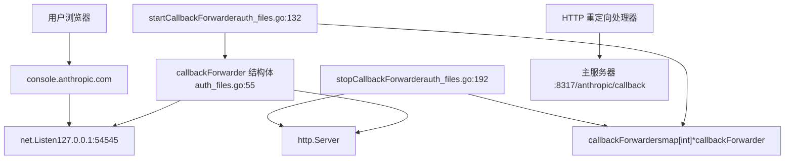
转发器仅在 WebUI OAuth 流程期间运行（`is_webui=true`）。当浏览器在 `:54545/callback` 收到回调时，它会重定向到 `:8317/anthropic/callback`，主处理器在该处处理授权码。

**来源：** [internal/api/handlers/management/auth\_files.go55-59](https://github.com/router-for-me/CLIProxyAPI/blob/c66cb0af/internal/api/handlers/management/auth_files.go#L55-L59) [internal/api/handlers/management/auth\_files.go131-189](https://github.com/router-for-me/CLIProxyAPI/blob/c66cb0af/internal/api/handlers/management/auth_files.go#L131-L189) [internal/api/handlers/management/auth\_files.go192-221](https://github.com/router-for-me/CLIProxyAPI/blob/c66cb0af/internal/api/handlers/management/auth_files.go#L192-L221)

### 令牌刷新

`ClaudeExecutor.Refresh` 方法使用存储的刷新令牌自动刷新已过期的访问令牌。

**令牌刷新流程**

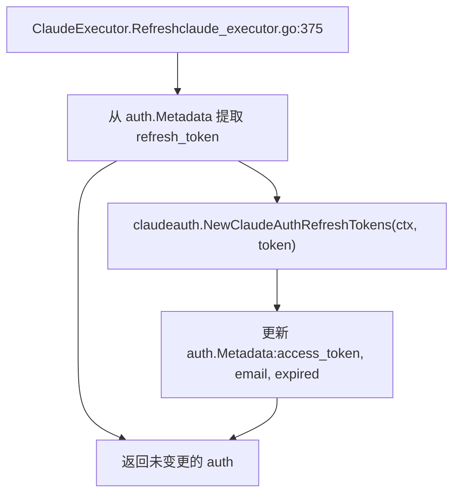
刷新过程：

1.  从 `auth.Metadata` 提取 `refresh_token` [internal/runtime/executor/claude\_executor.go380-388](https://github.com/router-for-me/CLIProxyAPI/blob/c66cb0af/internal/runtime/executor/claude_executor.go#L380-L388)
2.  通过 `claudeauth.RefreshTokens()` 调用 Claude OAuth 令牌端点 [internal/runtime/executor/claude\_executor.go389-393](https://github.com/router-for-me/CLIProxyAPI/blob/c66cb0af/internal/runtime/executor/claude_executor.go#L389-L393)
3.  使用新的 `access_token`, `refresh_token`, `email`, `expired` 和 `last_refresh` 更新元数据 [internal/runtime/executor/claude\_executor.go394-407](https://github.com/router-for-me/CLIProxyAPI/blob/c66cb0af/internal/runtime/executor/claude_executor.go#L394-L407)

**来源：** [internal/runtime/executor/claude\_executor.go375-407](https://github.com/router-for-me/CLIProxyAPI/blob/c66cb0af/internal/runtime/executor/claude_executor.go#L375-L407)

## 思考模式

Claude 通过 `thinking` 配置支持扩展思考。CLIProxyAPI 根据模型名称后缀自动注入思考配置。

### 模型后缀到预算的映射

`injectThinkingConfig` 方法将模型名称后缀映射到 `budget_tokens`：

| 模型后缀 | 预算令牌数 | 描述 |
| --- | --- | --- |
| `-thinking-low` | 1024 | 极简思考预算 |
| `-thinking-medium` | 8192 | 标准思考预算 |
| `-thinking-high` | 24576 | 扩展思考预算 |
| `-thinking` | 8192 | 默认思考 (中等) |

**思考配置注入**

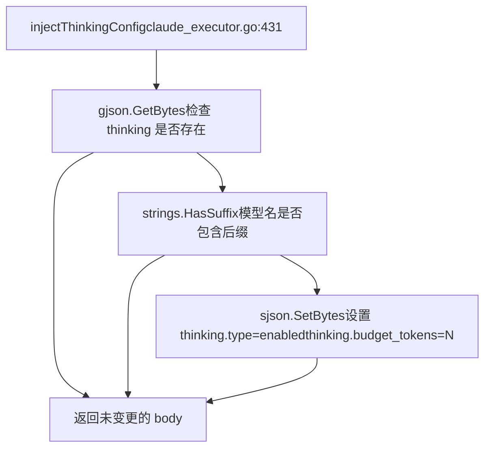
示例：对 `claude-opus-4-5-thinking-high` 的请求将包含：

```
{  "thinking": {    "type": "enabled",    "budget_tokens": 24576  }}
```
**来源：** [internal/runtime/executor/claude\_executor.go431-455](https://github.com/router-for-me/CLIProxyAPI/blob/c66cb0af/internal/runtime/executor/claude_executor.go#L431-L455)

### 带有签名缓存的思考块

CLIProxyAPI 为 Claude 思考块实现了一个精密的签名缓存系统，以支持启用思考的多轮对话。当 Claude 生成思考内容时，它会产生一个签名，在后续消息中引用该思考时必须包含该签名。

**签名缓存架构**

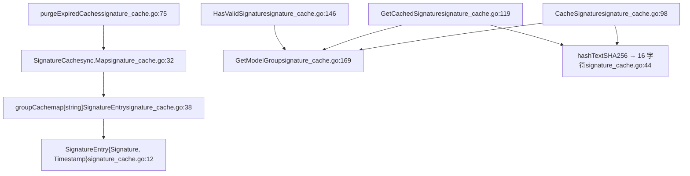
缓存按模型组（例如，所有 Claude Sonnet 模型共享签名）和思考文本哈希存储签名。签名在 3 小时后过期 [internal/cache/signature\_cache.go19](https://github.com/router-for-me/CLIProxyAPI/blob/c66cb0af/internal/cache/signature_cache.go#L19-L19)。

**在请求翻译中的应用**

在将 Claude 请求翻译为 Antigravity 格式时，翻译器会检查已缓存的签名：

> **[Mermaid sequence]**
> *(图表结构无法解析)*

**关键行为：**

1.  **缓存优先级**：已缓存的签名优于客户端提供的签名 [internal/translator/antigravity/claude/antigravity\_claude\_request.go104-109](https://github.com/router-for-me/CLIProxyAPI/blob/c66cb0af/internal/translator/antigravity/claude/antigravity_claude_request.go#L104-L109)。
2.  **签名验证**：仅长度 ≥50 个字符的签名被视为有效 [internal/cache/signature\_cache.go22-25](https://github.com/router-for-me/CLIProxyAPI/blob/c66cb0af/internal/cache/signature_cache.go#L22-L25)。
3.  **工具调用处理**：没有有效思考签名的工具调用使用哨兵值 `"skip_thought_signature_validator"` 来绕过验证 [internal/translator/antigravity/claude/antigravity\_claude\_request.go189-194](https://github.com/router-for-me/CLIProxyAPI/blob/c66cb0af/internal/translator/antigravity/claude/antigravity_claude_request.go#L189-L194)。
4.  **签名存储**：响应翻译器从服务器响应中缓存签名 [internal/translator/antigravity/claude/antigravity\_claude\_response.go193-203](https://github.com/router-for-me/CLIProxyAPI/blob/c66cb0af/internal/translator/antigravity/claude/antigravity_claude_response.go#L193-L203)。

**来源：** [internal/cache/signature\_cache.go1-169](https://github.com/router-for-me/CLIProxyAPI/blob/c66cb0af/internal/cache/signature_cache.go#L1-L169) [internal/translator/antigravity/claude/antigravity\_claude\_request.go93-165](https://github.com/router-for-me/CLIProxyAPI/blob/c66cb0af/internal/translator/antigravity/claude/antigravity_claude_request.go#L93-L165) [internal/translator/antigravity/claude/antigravity\_claude\_response.go186-210](https://github.com/router-for-me/CLIProxyAPI/blob/c66cb0af/internal/translator/antigravity/claude/antigravity_claude_response.go#L186-L210)

### max\_tokens 验证

`ensureMaxTokensForThinking` 函数确保 `max_tokens > thinking.budget_tokens` 以满足 Claude API 的要求。

**验证逻辑**

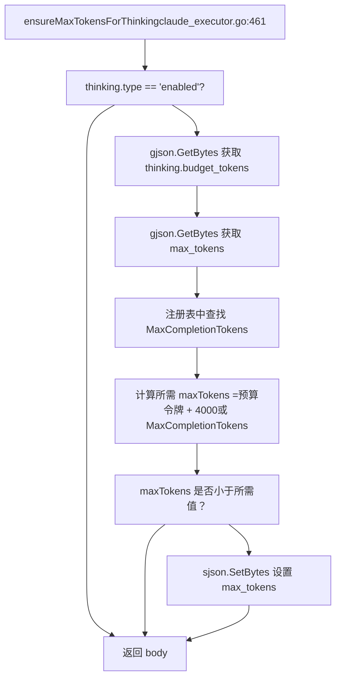
该函数：

1.  检查 `thinking.type == "enabled"` [internal/runtime/executor/claude\_executor.go463-465](https://github.com/router-for-me/CLIProxyAPI/blob/c66cb0af/internal/runtime/executor/claude_executor.go#L463-L465)。
2.  从请求中检索 `thinking.budget_tokens` [internal/runtime/executor/claude\_executor.go467-470](https://github.com/router-for-me/CLIProxyAPI/blob/c66cb0af/internal/runtime/executor/claude_executor.go#L467-L470)。
3.  从注册表中查找模型的 `MaxCompletionTokens` [internal/runtime/executor/claude\_executor.go475-478](https://github.com/router-for-me/CLIProxyAPI/blob/c66cb0af/internal/runtime/executor/claude_executor.go#L475-L478)。
4.  将 `max_tokens` 设为 `MaxCompletionTokens` 或 `budget_tokens + 4000`（如果注册表不可用）[internal/runtime/executor/claude\_executor.go481-485](https://github.com/router-for-me/CLIProxyAPI/blob/c66cb0af/internal/runtime/executor/claude_executor.go#L481-L485)。
5.  如果当前 `max_tokens` 不足，则更新请求 [internal/runtime/executor/claude\_executor.go487-490](https://github.com/router-for-me/CLIProxyAPI/blob/c66cb0af/internal/runtime/executor/claude_executor.go#L487-L490)。

**来源：** [internal/runtime/executor/claude\_executor.go461-491](https://github.com/router-for-me/CLIProxyAPI/blob/c66cb0af/internal/runtime/executor/claude_executor.go#L461-L491)

## Beta 特性

Claude beta 特性通过 `Anthropic-Beta` 标头和请求正文中的 `betas` 字段进行控制。CLIProxyAPI 会自动管理 beta 特性标头。

### Beta 标头管理

`applyClaudeHeaders` 函数设置 Claude CLI 兼容性所需的默认 beta 特性：

| Beta 特性 | 用途 |
| --- | --- |
| `claude-code-20250219` | 支持 Claude Code CLI |
| `oauth-2025-04-20` | 支持 OAuth 身份验证 |
| `interleaved-thinking-2025-05-14` | 支持交错思考模式 |
| `fine-grained-tool-streaming-2025-05-14` | 增强工具流式传输 |

**标头构建过程**

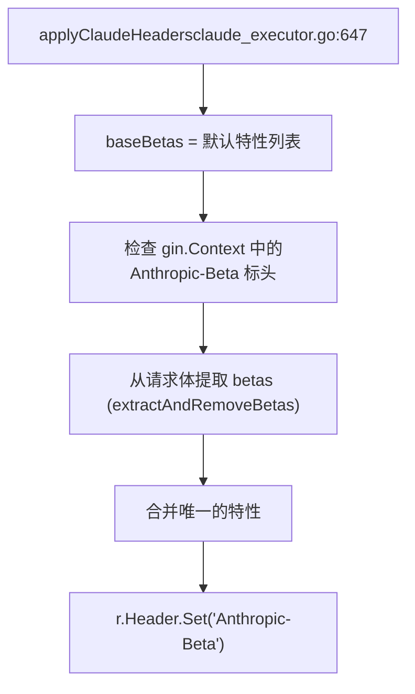
**来源：** [internal/runtime/executor/claude\_executor.go647-678](https://github.com/router-for-me/CLIProxyAPI/blob/c66cb0af/internal/runtime/executor/claude_executor.go#L647-L678)

### 请求体 Beta 特性提取

`extractAndRemoveBetas` 函数从请求体中提取 `betas` 数组并将其移动到标头中：

**Beta 特性提取流程**

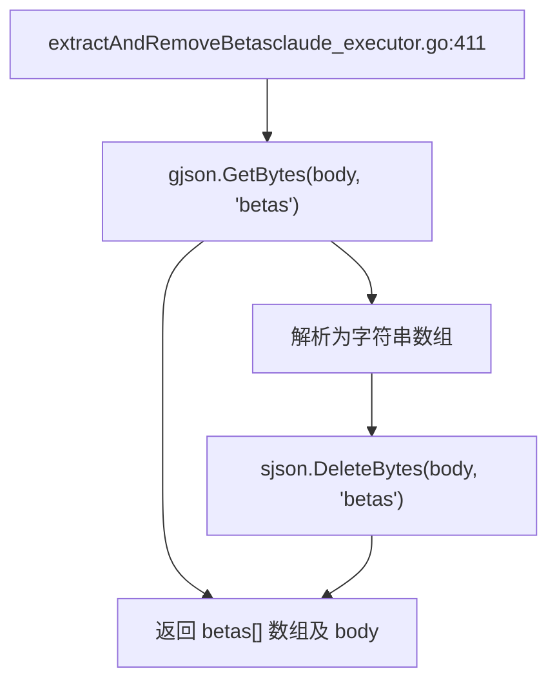
这允许客户端在请求体中指定 beta 特性：

```
{  "model": "claude-opus-4-5",  "betas": ["custom-beta-feature"],  "messages": [...]}
```
`betas` 字段被提取并与 `Anthropic-Beta` 标头中的默认特性合并。

**来源：** [internal/runtime/executor/claude\_executor.go411-428](https://github.com/router-for-me/CLIProxyAPI/blob/c66cb0af/internal/runtime/executor/claude_executor.go#L411-L428)

## 掩蔽 (Cloaking) 功能

`applyCloaking` 函数实现系统提示词注入和敏感词模糊处理，帮助 Claude Code 请求规避内容过滤器检测。该功能在请求发送到上游 API 之前应用。

**掩蔽系统架构**

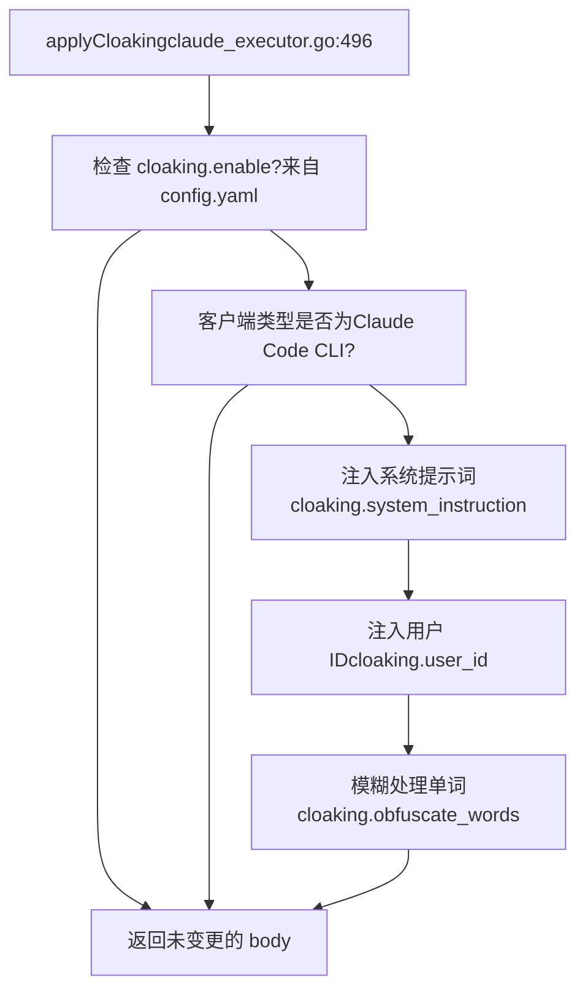
**掩蔽配置示例：**

```
cloaking:  enable: true  system_instruction: "注入的自定义系统指令"  user_id: "fake-user-id-12345"  obfuscate_words:    - original: "sensitive_word"      replacement: "benign_word"
```
**掩蔽机制：**

1.  **系统指令注入**：预置一条自定义系统消息以影响模型行为 [internal/runtime/executor/claude\_executor.go519-540](https://github.com/router-for-me/CLIProxyAPI/blob/c66cb0af/internal/runtime/executor/claude_executor.go#L519-L540)。
2.  **伪造用户 ID**：在元数据字段中注入 `user_id` 以表现为不同用户 [internal/runtime/executor/claude\_executor.go543-558](https://github.com/router-for-me/CLIProxyAPI/blob/c66cb0af/internal/runtime/executor/claude_executor.go#L543-L558)。
3.  **单词模糊化**：将用户消息中指定的单词替换为替代词，以避开内容过滤器 [internal/runtime/executor/claude\_executor.go561-621](https://github.com/router-for-me/CLIProxyAPI/blob/c66cb0af/internal/runtime/executor/claude_executor.go#L561-L621)。

掩蔽系统仅针对通过 User-Agent 标头模式检测到的 Claude Code CLI 客户端激活 [internal/runtime/executor/claude\_executor.go506-517](https://github.com/router-for-me/CLIProxyAPI/blob/c66cb0af/internal/runtime/executor/claude_executor.go#L506-L517)。

**来源：** [internal/runtime/executor/claude\_executor.go496-705](https://github.com/router-for-me/CLIProxyAPI/blob/c66cb0af/internal/runtime/executor/claude_executor.go#L496-L705)

## 针对 Claude 的 Antigravity 执行器

`AntigravityExecutor` 是通过 OAuth 访问 Claude 模型的主要执行器。它通过 Google 的 Antigravity API 代理请求，该 API 提供了诸如思考块验证和交错思考等额外功能。

**Antigravity 架构**

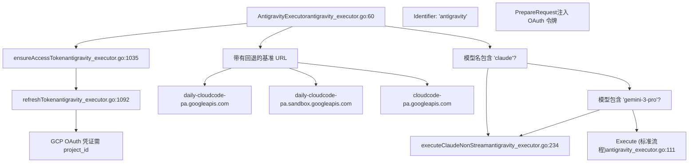
**Claude 特有的请求处理：**

针对 Claude 模型，Antigravity 执行器使用专门的流程：

1.  **翻译为 Antigravity 格式**：使用流式模式以保留函数调用 [internal/runtime/executor/antigravity\_executor.go256-257](https://github.com/router-for-me/CLIProxyAPI/blob/c66cb0af/internal/runtime/executor/antigravity_executor.go#L256-L257)。
2.  **应用思考配置**：来自模型后缀 [internal/runtime/executor/antigravity\_executor.go259-262](https://github.com/router-for-me/CLIProxyAPI/blob/c66cb0af/internal/runtime/executor/antigravity_executor.go#L259-L262)。
3.  **使用流式端点**：即使是非流式请求也使用流式端点，随后进行格式转换 [internal/runtime/executor/antigravity\_executor.go340-397](https://github.com/router-for-me/CLIProxyAPI/blob/c66cb0af/internal/runtime/executor/antigravity_executor.go#L340-L397)。
4.  **流转非流转换**：通过累积各部分来构建完整的响应 [internal/runtime/executor/antigravity\_executor.go416-596](https://github.com/router-for-me/CLIProxyAPI/blob/c66cb0af/internal/runtime/executor/antigravity_executor.go#L416-L596)。

**基准 URL 回退策略：**

执行器按顺序尝试多个基准 URL：

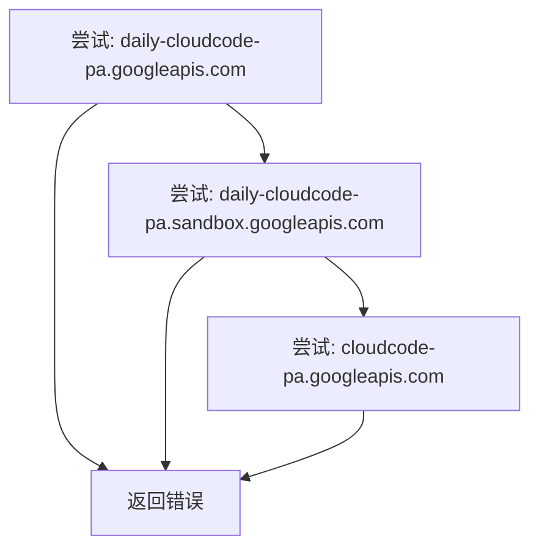
这为应对单个端点的频率限制提供了弹性 [internal/runtime/executor/antigravity\_executor.go154-215](https://github.com/router-for-me/CLIProxyAPI/blob/c66cb0af/internal/runtime/executor/antigravity_executor.go#L154-L215)。

**来源：** [internal/runtime/executor/antigravity\_executor.go59-769](https://github.com/router-for-me/CLIProxyAPI/blob/c66cb0af/internal/runtime/executor/antigravity_executor.go#L59-L769) [internal/runtime/executor/antigravity\_executor.go234-414](https://github.com/router-for-me/CLIProxyAPI/blob/c66cb0af/internal/runtime/executor/antigravity_executor.go#L234-L414)

## 系统指令

`checkSystemInstructions` 函数确保除了 `claude-3-5-haiku` 之外的所有模型都包含 Claude Code 身份标识在 `system` 字段中。

### 系统指令结构

Claude Code 要求特定的系统消息来标识客户端：

```
{  "system": [    {      "type": "text",      "text": "You are Claude Code, Anthropic's official CLI for Claude."    }  ]}
```
**系统指令注入逻辑**

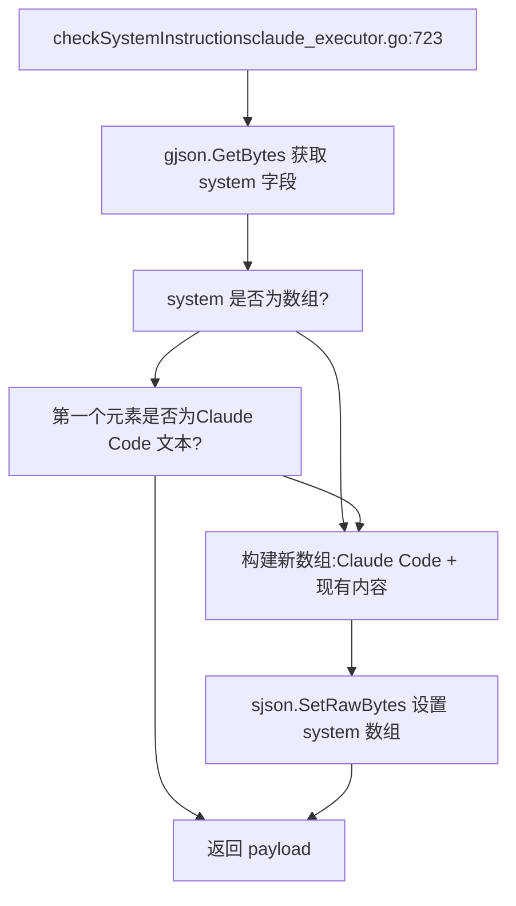
该函数：

1.  检查 `system` 是否为数组 [internal/runtime/executor/claude\_executor.go726](https://github.com/router-for-me/CLIProxyAPI/blob/c66cb0af/internal/runtime/executor/claude_executor.go#L726-L726)。
2.  验证第一个元素是否为 Claude Code 消息 [internal/runtime/executor/claude\_executor.go727](https://github.com/router-for-me/CLIProxyAPI/blob/c66cb0af/internal/runtime/executor/claude_executor.go#L727-L727)。
3.  如果缺失或不正确，则将 Claude Code 指令预置到现有系统消息中 [internal/runtime/executor/claude\_executor.go728-736](https://github.com/router-for-me/CLIProxyAPI/blob/c66cb0af/internal/runtime/executor/claude_executor.go#L728-L736)。
4.  如果 `system` 不是数组，则创建一个包含 Claude Code 指令的新数组 [internal/runtime/executor/claude\_executor.go737-738](https://github.com/router-for-me/CLIProxyAPI/blob/c66cb0af/internal/runtime/executor/claude_executor.go#L737-L738)。

这确保了所有 Claude 请求都包含正确的客户端标识，这可能会影响模型行为和功能可用性。

**来源：** [internal/runtime/executor/claude\_executor.go723-740](https://github.com/router-for-me/CLIProxyAPI/blob/c66cb0af/internal/runtime/executor/claude_executor.go#L723-L740)

## 请求执行

`ClaudeExecutor` 实现了针对非流式、流式和令牌计数操作的标准执行器方法。

### Execute 方法

`Execute` 方法处理非流式请求：

**非流式请求流程**

> **[Mermaid sequence]**
> *(图表结构无法解析)*

**来源：** [internal/runtime/executor/claude\_executor.go44-151](https://github.com/router-for-me/CLIProxyAPI/blob/c66cb0af/internal/runtime/executor/claude_executor.go#L44-L151)

### ExecuteStream 方法

`ExecuteStream` 方法处理 SSE 流式响应：

**流式请求流程**

> **[Mermaid sequence]**
> *(图表结构无法解析)*

当 `from == to`（均为 Claude 格式）时，为了保留精确的 SSE 格式，分块行将不经翻译直接转发，并在每行末尾追加一个换行符 [internal/runtime/executor/claude\_executor.go322-339](https://github.com/router-for-me/CLIProxyAPI/blob/c66cb0af/internal/runtime/executor/claude_executor.go#L322-L339)。

**工具前缀剥离**：对于 OAuth 令牌，执行器使用 `stripClaudeToolPrefixFromStreamLine` 从流式响应中剥离 `claudeToolPrefix` [internal/runtime/executor/claude\_executor.go331-333](https://github.com/router-for-me/CLIProxyAPI/blob/c66cb0af/internal/runtime/executor/claude_executor.go#L331-L333)。

**来源：** [internal/runtime/executor/claude\_executor.go219-382](https://github.com/router-for-me/CLIProxyAPI/blob/c66cb0af/internal/runtime/executor/claude_executor.go#L219-L382)

### CountTokens 方法

`CountTokens` 方法使用 Claude 的 beta 令牌计数端点：

**令牌计数流程**

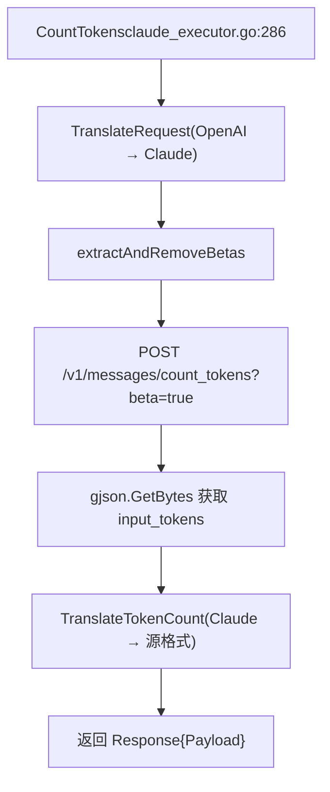
**来源：** [internal/runtime/executor/claude\_executor.go286-373](https://github.com/router-for-me/CLIProxyAPI/blob/c66cb0af/internal/runtime/executor/claude_executor.go#L286-L373)

## 管理 API

Claude 特有的管理 API 端点，用于 OAuth 和配置：

| 端点 | 方法 | 用途 |
| --- | --- | --- |
| `/v0/management/anthropic-auth-url` | GET | 发起 OAuth 流程 |
| `/v0/management/get-auth-status?state={state}` | GET | 轮询 OAuth 状态 |
| `/v0/management/auth/files` | GET/POST/DELETE | 管理令牌文件 |

### OAuth 发起

```
GET /v0/management/anthropic-auth-url?is_webui=trueAuthorization: Bearer <management_key>
```
响应格式：

```
{  "status": "ok",  "url": "https://console.anthropic.com/oauth/authorize?...",  "state": "random-state-string"}
```
### 状态轮询

```
GET /v0/management/get-auth-status?state=random-state-stringAuthorization: Bearer <management_key>
```
响应示例：

```
{"status": "wait"}                          // 仍在等待中{"status": "ok"}                            // 成功{"status": "error", "error": "timeout"}     // 失败
```
**来源：** [internal/api/handlers/management/auth\_files.go708-875](https://github.com/router-for-me/CLIProxyAPI/blob/c66cb0af/internal/api/handlers/management/auth_files.go#L708-L875)

## 特殊功能

### Claude Code CLI 的 HTTP 标头

`applyClaudeHeaders` 函数设置特定的标头以标识为 Claude CLI 客户端：

```
r.Header.Set("Anthropic-Beta", "claude-code-20250219,oauth-2025-04-20,interleaved-thinking-2025-05-14,fine-grained-tool-streaming-2025-05-14")r.Header.Set("Anthropic-Version", "2023-06-01")r.Header.Set("Anthropic-Dangerous-Direct-Browser-Access", "true")r.Header.Set("X-App", "cli")r.Header.Set("User-Agent", "claude-cli/1.0.83 (external, cli)")
```
这些标头启用了包括 Claude Code、OAuth 支持、交错思考以及细粒度工具流式传输在内的 beta 特性。

**来源：** [internal/runtime/executor/claude\_executor.go621-686](https://github.com/router-for-me/CLIProxyAPI/blob/c66cb0af/internal/runtime/executor/claude_executor.go#L621-L686)

### 响应体解压

`decodeResponseBody` 函数处理多种压缩编码，包括 gzip、deflate、brotli 和 zstd：

**解压流程**

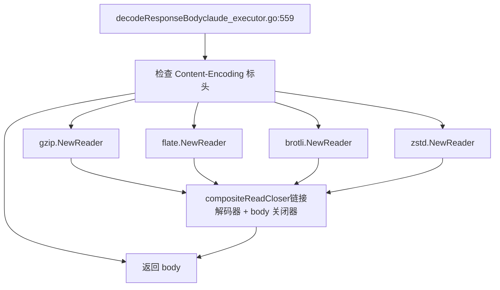
该函数创建一个 `compositeReadCloser`，它将解压读取器与原始响应体正确链接，确保两者都能被正确关闭 [internal/runtime/executor/claude\_executor.go541-619](https://github.com/router-for-me/CLIProxyAPI/blob/c66cb0af/internal/runtime/executor/claude_executor.go#L541-L619)。

**来源：** [internal/runtime/executor/claude\_executor.go541-619](https://github.com/router-for-me/CLIProxyAPI/blob/c66cb0af/internal/runtime/executor/claude_executor.go#L541-L619)

### OAuth 令牌的工具前缀

当使用 OAuth 令牌（而非 API 密钥）时，执行器会对函数声明应用工具前缀以避免冲突：

**工具前缀应用**

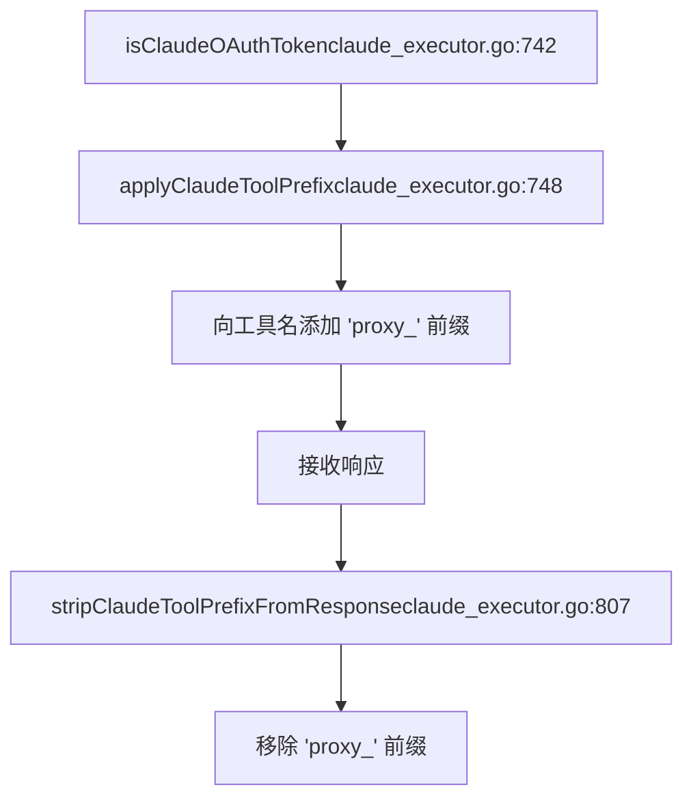
前缀 `"proxy_"`（定义为 `claudeToolPrefix`）在发送请求前被添加，并从响应中移除 [internal/runtime/executor/claude\_executor.go38-39](https://github.com/router-for-me/CLIProxyAPI/blob/c66cb0af/internal/runtime/executor/claude_executor.go#L38-L39) [internal/runtime/executor/claude\_executor.go128-129](https://github.com/router-for-me/CLIProxyAPI/blob/c66cb0af/internal/runtime/executor/claude_executor.go#L128-L129) [internal/runtime/executor/claude\_executor.go202-203](https://github.com/router-for-me/CLIProxyAPI/blob/c66cb0af/internal/runtime/executor/claude_executor.go#L202-L203)。

**来源：** [internal/runtime/executor/claude\_executor.go38-39](https://github.com/router-for-me/CLIProxyAPI/blob/c66cb0af/internal/runtime/executor/claude_executor.go#L38-L39) [internal/runtime/executor/claude\_executor.go742-871](https://github.com/router-for-me/CLIProxyAPI/blob/c66cb0af/internal/runtime/executor/claude_executor.go#L742-L871)

### SSE 流式格式保留

在将 Claude 响应翻译为 Claude 格式（无需翻译）时，执行器通过直接转发行而不进行翻译来保留精确的 SSE 格式：

```
if from == to {    // 直接转发而不翻译    cloned := make([]byte, len(line)+1)    copy(cloned, line)    cloned[len(line)] = '\n'    out <- cliproxyexecutor.StreamChunk{Payload: cloned}}
```
这确保了 Claude CLI 客户端收到的流式行为与直接连接到 Claude 时完全一致，包括正确的 SSE 事件格式 [internal/runtime/executor/claude\_executor.go322-339](https://github.com/router-for-me/CLIProxyAPI/blob/c66cb0af/internal/runtime/executor/claude_executor.go#L322-L339)。

**来源：** [internal/runtime/executor/claude\_executor.go322-339](https://github.com/router-for-me/CLIProxyAPI/blob/c66cb0af/internal/runtime/executor/claude_executor.go#L322-L339)

### 凭证解析

`claudeCreds` 函数从 auth 对象解析凭证，并带有回退逻辑：

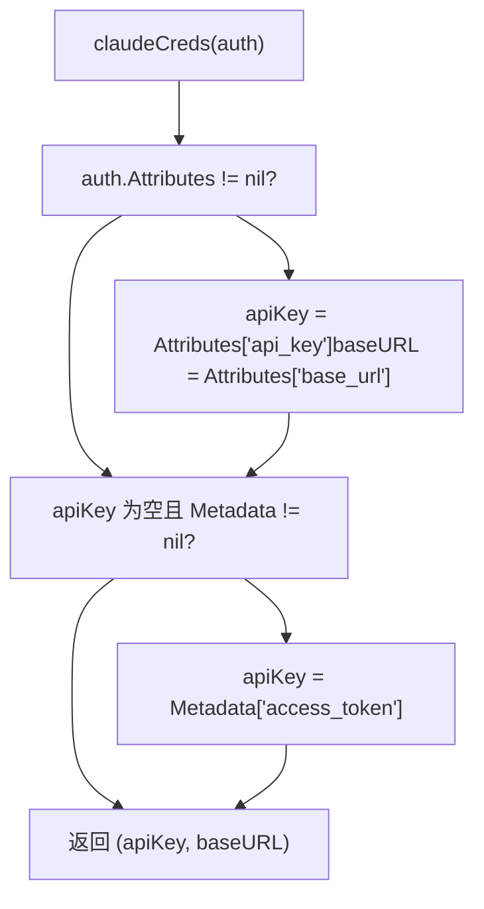
这使得基于 API 密钥的凭证（通过 `Attributes`）和基于 OAuth 的凭证（通过 `Metadata.access_token`）都能无缝工作。

**来源：** [internal/runtime/executor/claude\_executor.go332-346](https://github.com/router-for-me/CLIProxyAPI/blob/c66cb0af/internal/runtime/executor/claude_executor.go#L332-L346)
