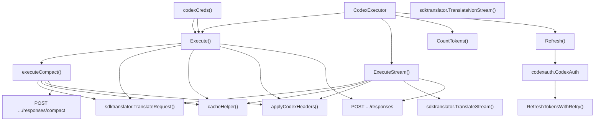
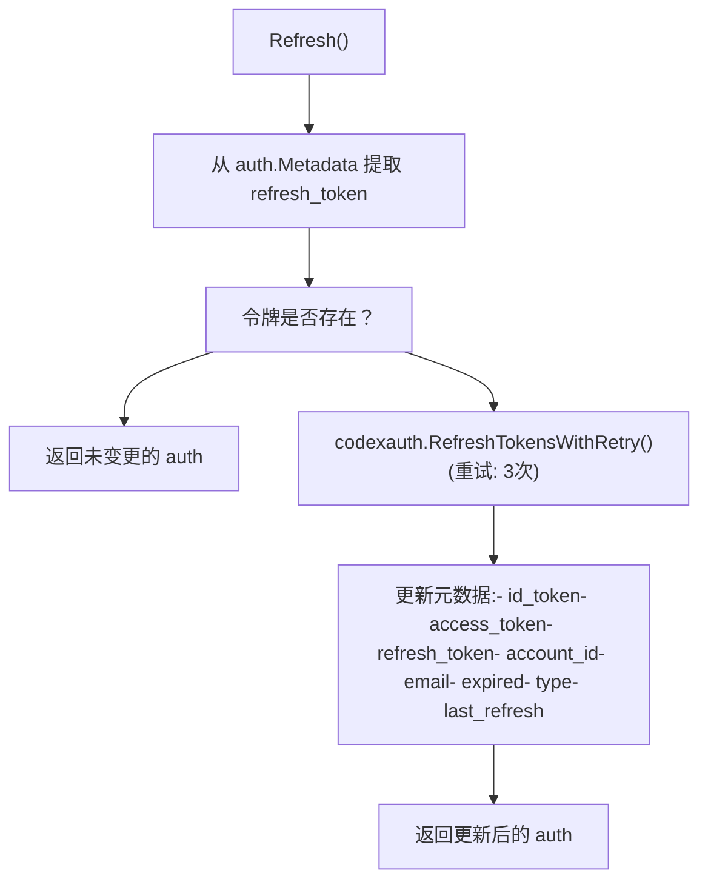
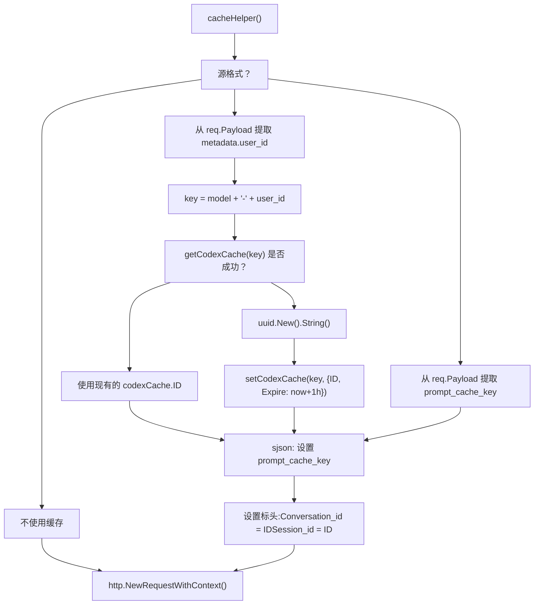
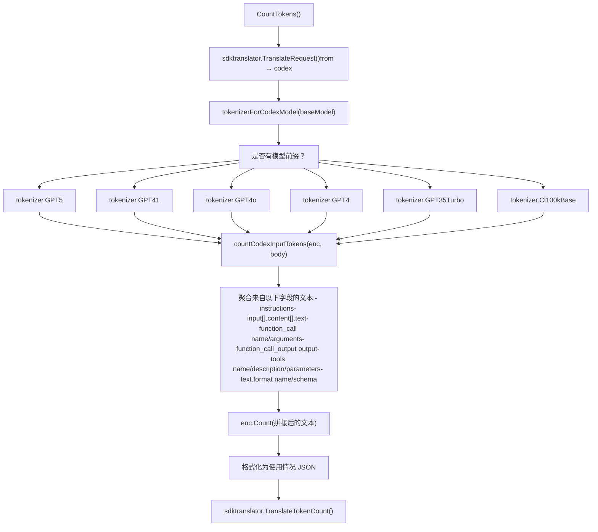

# OpenAI Codex

相关源文件

-   [internal/auth/antigravity/auth.go](https://github.com/router-for-me/CLIProxyAPI/blob/c66cb0af/internal/auth/antigravity/auth.go)
-   [internal/cmd/anthropic\_login.go](https://github.com/router-for-me/CLIProxyAPI/blob/c66cb0af/internal/cmd/anthropic_login.go)
-   [internal/cmd/iflow\_login.go](https://github.com/router-for-me/CLIProxyAPI/blob/c66cb0af/internal/cmd/iflow_login.go)
-   [internal/cmd/openai\_login.go](https://github.com/router-for-me/CLIProxyAPI/blob/c66cb0af/internal/cmd/openai_login.go)
-   [internal/cmd/qwen\_login.go](https://github.com/router-for-me/CLIProxyAPI/blob/c66cb0af/internal/cmd/qwen_login.go)
-   [internal/runtime/executor/aistudio\_executor.go](https://github.com/router-for-me/CLIProxyAPI/blob/c66cb0af/internal/runtime/executor/aistudio_executor.go)
-   [internal/runtime/executor/antigravity\_executor.go](https://github.com/router-for-me/CLIProxyAPI/blob/c66cb0af/internal/runtime/executor/antigravity_executor.go)
-   [internal/runtime/executor/claude\_executor.go](https://github.com/router-for-me/CLIProxyAPI/blob/c66cb0af/internal/runtime/executor/claude_executor.go)
-   [internal/runtime/executor/codex\_executor.go](https://github.com/router-for-me/CLIProxyAPI/blob/c66cb0af/internal/runtime/executor/codex_executor.go)
-   [internal/runtime/executor/gemini\_cli\_executor.go](https://github.com/router-for-me/CLIProxyAPI/blob/c66cb0af/internal/runtime/executor/gemini_cli_executor.go)
-   [internal/runtime/executor/gemini\_executor.go](https://github.com/router-for-me/CLIProxyAPI/blob/c66cb0af/internal/runtime/executor/gemini_executor.go)
-   [internal/runtime/executor/gemini\_vertex\_executor.go](https://github.com/router-for-me/CLIProxyAPI/blob/c66cb0af/internal/runtime/executor/gemini_vertex_executor.go)
-   [internal/runtime/executor/iflow\_executor.go](https://github.com/router-for-me/CLIProxyAPI/blob/c66cb0af/internal/runtime/executor/iflow_executor.go)
-   [internal/runtime/executor/openai\_compat\_executor.go](https://github.com/router-for-me/CLIProxyAPI/blob/c66cb0af/internal/runtime/executor/openai_compat_executor.go)
-   [internal/runtime/executor/qwen\_executor.go](https://github.com/router-for-me/CLIProxyAPI/blob/c66cb0af/internal/runtime/executor/qwen_executor.go)
-   [internal/translator/codex/openai/responses/codex\_openai-responses\_request.go](https://github.com/router-for-me/CLIProxyAPI/blob/c66cb0af/internal/translator/codex/openai/responses/codex_openai-responses_request.go)
-   [internal/translator/codex/openai/responses/codex\_openai-responses\_request\_test.go](https://github.com/router-for-me/CLIProxyAPI/blob/c66cb0af/internal/translator/codex/openai/responses/codex_openai-responses_request_test.go)
-   [internal/translator/codex/openai/responses/codex\_openai-responses\_response.go](https://github.com/router-for-me/CLIProxyAPI/blob/c66cb0af/internal/translator/codex/openai/responses/codex_openai-responses_response.go)
-   [sdk/auth/antigravity.go](https://github.com/router-for-me/CLIProxyAPI/blob/c66cb0af/sdk/auth/antigravity.go)
-   [sdk/auth/claude.go](https://github.com/router-for-me/CLIProxyAPI/blob/c66cb0af/sdk/auth/claude.go)
-   [sdk/auth/codex.go](https://github.com/router-for-me/CLIProxyAPI/blob/c66cb0af/sdk/auth/codex.go)
-   [sdk/auth/iflow.go](https://github.com/router-for-me/CLIProxyAPI/blob/c66cb0af/sdk/auth/iflow.go)
-   [sdk/auth/qwen.go](https://github.com/router-for-me/CLIProxyAPI/blob/c66cb0af/sdk/auth/qwen.go)

本页面记录了 OpenAI Codex 供应商的集成情况，该集成支持通过 ChatGPT 的后台 API 访问 GPT-5 及相关模型。该集成支持通过授权码（带 PKCE）和设备流（device flow）进行的 OAuth 身份验证、通过会话 ID 实现的提示词缓存（prompt caching）以及本地令牌计数。

有关供应商执行器架构，请参阅第 3.4 页。有关请求翻译的详情，请参阅第 3.5 页。有关 OAuth 设置，请参阅第 7.2 页。

## 概览与架构

Codex 集成是通过 `CodexExecutor` 类实现的，该类实现了 `ProviderExecutor` 接口。它使用 OAuth 访问令牌或 API 密钥与位于 `https://chatgpt.com/backend-api/codex` 的 ChatGPT 后台 API 通信。该执行器处理从 OpenAI 格式到 Codex 的 Responses API 格式的请求翻译，管理用于提示词缓存的对话状态，并提供令牌计数功能。

### CodexExecutor 架构

**`CodexExecutor` 方法及其关系**

**来源：** [internal/runtime/executor/codex\_executor.go39-45](https://github.com/router-for-me/CLIProxyAPI/blob/c66cb0af/internal/runtime/executor/codex_executor.go#L39-L45) [internal/runtime/executor/codex\_executor.go80-278](https://github.com/router-for-me/CLIProxyAPI/blob/c66cb0af/internal/runtime/executor/codex_executor.go#L80-L278) [internal/runtime/executor/codex\_executor.go280-400](https://github.com/router-for-me/CLIProxyAPI/blob/c66cb0af/internal/runtime/executor/codex_executor.go#L280-L400) [internal/runtime/executor/codex\_executor.go560-597](https://github.com/router-for-me/CLIProxyAPI/blob/c66cb0af/internal/runtime/executor/codex_executor.go#L560-L597)

## 身份验证与凭证

`CodexExecutor` 通过 `codexCreds()` 辅助函数支持两种身份验证模式：

| 身份验证模式 | 配置方式 | 访问模式 |
| --- | --- | --- |
| OAuth | `auth.Metadata["access_token"]` | ChatGPT 网页版订阅 |
| API 密钥 | `auth.Attributes["api_key"]` | 直接 API 访问 |

这两种模式使用相同的请求格式和端点，区别仅在于 `Authorization` 标头以及 OAuth 特定标头的存在。

**来源：** [internal/runtime/executor/codex\_executor.go676-690](https://github.com/router-for-me/CLIProxyAPI/blob/c66cb0af/internal/runtime/executor/codex_executor.go#L676-L690)

## OAuth 流程与令牌刷新

针对 Codex 的 OAuth 身份验证通过管理 API 发起，并由 `CodexAuth` 服务管理：

### OAuth 身份验证流程

`sdk/auth/codex.go` 中的 `CodexAuthenticator` 支持由 `shouldUseCodexDeviceFlow(opts)` 选择的两种流程：

**授权码流程 (默认，带 PKCE)**

> **[Mermaid sequence]**
> *(图表结构无法解析)*

**设备流 (备选)**

当 `shouldUseCodexDeviceFlow(opts)` 返回 true 时，调用 `loginWithDeviceFlow()`。这不需要本地回调服务器，而是使用设备授权端点。

**来源：** [sdk/auth/codex.go38-200](https://github.com/router-for-me/CLIProxyAPI/blob/c66cb0af/sdk/auth/codex.go#L38-L200) [internal/cmd/openai\_login.go29-80](https://github.com/router-for-me/CLIProxyAPI/blob/c66cb0af/internal/cmd/openai_login.go#L29-L80)

### 令牌刷新机制

`Refresh()` 方法使用存储的刷新令牌自动更新过期的令牌。`CodexAuthenticator.RefreshLead()` 返回 5 天，因此令牌会在过期前 5 天进行刷新。

**`Refresh()` 逻辑流程**

**来源：** [internal/runtime/executor/codex\_executor.go560-597](https://github.com/router-for-me/CLIProxyAPI/blob/c66cb0af/internal/runtime/executor/codex_executor.go#L560-L597) [sdk/auth/codex.go34-36](https://github.com/router-for-me/CLIProxyAPI/blob/c66cb0af/sdk/auth/codex.go#L34-L36)

## 请求翻译

Codex 执行器使用 `sdktranslator` 包将传入请求翻译为 Codex Responses API 格式。针对 `"codex"` 格式目标的翻译路径实现在 `internal/translator/codex/openai/responses/` 中。

### 请求转换 (`ConvertOpenAIResponsesRequestToCodex`)

`ConvertOpenAIResponsesRequestToCodex` 对传出的有效负载应用以下转换：

| 操作 | 字段 | 取值 / 行为 |
| --- | --- | --- |
| 强制流式传输 | `stream` | `true` |
| 禁用存储 | `store` | `false` |
| 启用并行工具调用 | `parallel_tool_calls` | `true` |
| 请求加密推理 | `include` | `["reasoning.encrypted_content"]` |
| 移除令牌限制 | `max_output_tokens`, `max_completion_tokens` | 删除 |
| 移除采样参数 | `temperature`, `top_p` | 删除 |
| 移除层级/用户 | `service_tier`, `user` | 删除 |
| 规范化字符串输入 | `input` (如果是字符串) | 封装到消息数组中 |
| 角色规范化 | `input[].role == "system"` | 转换为 `"developer"` |

`convertSystemRoleToDeveloper` 辅助函数遍历 `input` 数组，并将任何 `"system"` 角色重写为 `"developer"`，这是 Codex API 所要求的。

### 响应翻译

**流式传输**：`ConvertCodexResponseToOpenAIResponses` 透传 SSE 事件，并进行少量修复。对于 `response.created`、`response.in_progress` 和 `response.completed` 事件，`response.instructions` 字段将从原始请求中修补回来（Codex API 会剥离该字段）。

**非流式传输**：`ConvertCodexResponseToOpenAIResponsesNonStream` 从 `response.completed` 事件中提取 `response` 对象，并从原始请求中恢复 `instructions`。

**来源：** [internal/translator/codex/openai/responses/codex\_openai-responses\_request.go10-60](https://github.com/router-for-me/CLIProxyAPI/blob/c66cb0af/internal/translator/codex/openai/responses/codex_openai-responses_request.go#L10-L60) [internal/translator/codex/openai/responses/codex\_openai-responses\_response.go15-48](https://github.com/router-for-me/CLIProxyAPI/blob/c66cb0af/internal/translator/codex/openai/responses/codex_openai-responses_response.go#L15-L48)

## 紧凑模式 (`executeCompact`)

当 `opts.Alt == "responses/compact"` 时，`Execute()` 委派给 `executeCompact()`。该路径同步命中 `/responses/compact` 端点（无流式传输）。

**与标准 `Execute()` 的区别：**

| 维度 | `Execute()` | `executeCompact()` |
| --- | --- | --- |
| 翻译目标格式 | `"codex"` | `"openai-response"` |
| 上游端点 | `.../responses` | `.../responses/compact` |
| `stream` 字段 | 强制为 `true` | 删除 |
| 响应处理 | 读取 SSE 直到 `response.completed` | 读取完整的 JSON 正文 |

**来源：** [internal/runtime/executor/codex\_executor.go80-84](https://github.com/router-for-me/CLIProxyAPI/blob/c66cb0af/internal/runtime/executor/codex_executor.go#L80-L84) [internal/runtime/executor/codex\_executor.go193-278](https://github.com/router-for-me/CLIProxyAPI/blob/c66cb0af/internal/runtime/executor/codex_executor.go#L193-L278)

## 提示词缓存与对话 ID

`cacheHelper()` 方法实现提示词缓存，以减少重复请求的延迟和成本。它生成并管理充当缓存键的对话 ID。

### 缓存策略

**`cacheHelper()` 决策流**

-   **缓存键**：针对 Claude 格式的请求为 `"{model}-{user_id}"`
-   **缓存结构**：`codexCache{ID string, Expire time.Time}`
-   **缓存时长**：1 小时
-   **设置的标头**：`Conversation_id` 和 `Session_id` 均设为同一个缓存 ID

**来源：** [internal/runtime/executor/codex\_executor.go599-633](https://github.com/router-for-me/CLIProxyAPI/blob/c66cb0af/internal/runtime/executor/codex_executor.go#L599-L633)

## 请求标头与协议

`applyCodexHeaders()` 函数根据身份验证模式和客户端上下文配置 HTTP 标头：

### 标头配置

`applyCodexHeaders()` 设置以下标头。`codexClientVersion` 常量为 `"0.101.0"`，`codexUserAgent` 为 `"codex_cli_rs/0.101.0 (Mac OS 26.0.1; arm64) Apple_Terminal/464"`。

| 标头 | 取值 | 条件 |
| --- | --- | --- |
| `Content-Type` | `application/json` | 始终设置 |
| `Authorization` | `Bearer {token}` | 始终设置 |
| `Version` | `0.101.0` (`codexClientVersion`) | 始终设置 |
| `Session_id` | UUID | 始终设置 |
| `User-Agent` | `codex_cli_rs/0.101.0 ...` (`codexUserAgent`) | 始终设置 |
| `Accept` | `text/event-stream` 或 `application/json` | 基于 `stream` 参数 |
| `Connection` | `Keep-Alive` | 始终设置 |
| `Originator` | `codex_cli_rs` | 仅限 OAuth (无 `api_key` 属性) |
| `Chatgpt-Account-Id` | `auth.Metadata["account_id"]` | 仅限 OAuth |

通过检查 `auth.Attributes["api_key"]` 来检测 API 密钥模式。设置该模式时，不会发送 `Originator` 和 `Chatgpt-Account-Id`。

**来源：** [internal/runtime/executor/codex\_executor.go31-33](https://github.com/router-for-me/CLIProxyAPI/blob/c66cb0af/internal/runtime/executor/codex_executor.go#L31-L33) [internal/runtime/executor/codex\_executor.go635-674](https://github.com/router-for-me/CLIProxyAPI/blob/c66cb0af/internal/runtime/executor/codex_executor.go#L635-L674)

## 令牌计数

`CountTokens()` 方法使用 `tiktoken-go` 库，在不发起 API 请求的情况下估算输入令牌的使用情况：

### 令牌计数实现

**`CountTokens()` → `tokenizerForCodexModel()` → `countCodexInputTokens()`**

令牌计数在本地执行，无需调用上游 API。

**来源：** [internal/runtime/executor/codex\_executor.go402-436](https://github.com/router-for-me/CLIProxyAPI/blob/c66cb0af/internal/runtime/executor/codex_executor.go#L402-L436) [internal/runtime/executor/codex\_executor.go438-558](https://github.com/router-for-me/CLIProxyAPI/blob/c66cb0af/internal/runtime/executor/codex_executor.go#L438-L558)

## 流式响应处理

`ExecuteStream()` 方法处理来自 Codex API 的服务器发送事件 (SSE) 响应：

### 流式处理管道

> **[Mermaid sequence]**
> *(图表结构无法解析)*

**核心特性：**

1.  **大容量缓冲区**：52,428,800 字节 (50MB) 的扫描器缓冲区，用于处理超长响应。
2.  **SSE 解析**：从以 `data:` 开头的行中提取 JSON。
3.  **使用情况跟踪**：通过 `parseCodexUsage()` 从 `response.completed` 事件类型中解析令牌指标。
4.  **翻译**：通过 `sdktranslator.TranslateStream()` 将 Codex 格式实时转换为源格式。
5.  **错误传播**：扫描器错误通过通道发送，带有 `StreamChunk{Err: err}`。

**针对 `Execute()` 的完成检测：**

由于 Codex API 始终采用流式传输，`Execute()` 也会连接到流式端点 (`stream: true`)，但会同步读取完整的响应正文，扫描 `response.completed` 事件类型以提取最终结果。

**来源：** [internal/runtime/executor/codex\_executor.go280-400](https://github.com/router-for-me/CLIProxyAPI/blob/c66cb0af/internal/runtime/executor/codex_executor.go#L280-L400) [internal/runtime/executor/codex\_executor.go162-191](https://github.com/router-for-me/CLIProxyAPI/blob/c66cb0af/internal/runtime/executor/codex_executor.go#L162-L191)

## 配置与设置

Codex 客户端配置通过主配置结构支持两种身份验证方法：

### 配置参数

| 参数 | 类型 | 描述 | 用途 |
| --- | --- | --- | --- |
| `CodexKey` | `[]CodexKeyConfig` | API 密钥配置 | API 密钥身份验证 |
| `AuthDir` | `字符串` | 令牌存储目录 | OAuth 令牌持久化 |
| `ForceGPT5Codex` | `布尔值` | 强制使用 Codex 模型 | 模型选择覆盖 |
| `RequestLog` | `布尔值` | 启用请求日志 | 调试与监控 |

客户端根据提供的配置自动选择合适的身份验证方法和端点，支持在 ChatGPT 后台访问和直接 API 集成之间无缝切换。

**来源：** [internal/client/codex\_client.go153-158](https://github.com/router-for-me/CLIProxyAPI/blob/c66cb0af/internal/client/codex_client.go#L153-L158) [internal/client/codex\_client.go444-451](https://github.com/router-for-me/CLIProxyAPI/blob/c66cb0af/internal/client/codex_client.go#L444-L451) [internal/client/codex\_client.go456-465](https://github.com/router-for-me/CLIProxyAPI/blob/c66cb0af/internal/client/codex_client.go#L456-L465)
