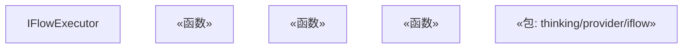
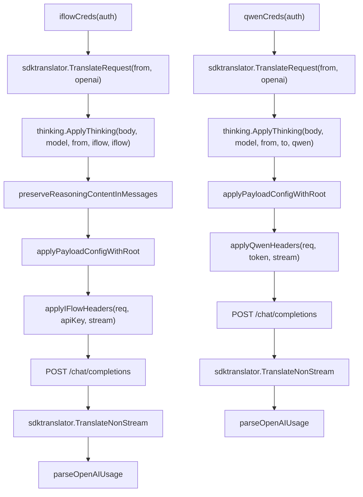

# Qwen 与 iFlow

相关源文件

-   [internal/api/handlers/management/model\_definitions.go](https://github.com/router-for-me/CLIProxyAPI/blob/c66cb0af/internal/api/handlers/management/model_definitions.go)
-   [internal/auth/antigravity/auth.go](https://github.com/router-for-me/CLIProxyAPI/blob/c66cb0af/internal/auth/antigravity/auth.go)
-   [internal/cmd/anthropic\_login.go](https://github.com/router-for-me/CLIProxyAPI/blob/c66cb0af/internal/cmd/anthropic_login.go)
-   [internal/cmd/iflow\_login.go](https://github.com/router-for-me/CLIProxyAPI/blob/c66cb0af/internal/cmd/iflow_login.go)
-   [internal/cmd/openai\_login.go](https://github.com/router-for-me/CLIProxyAPI/blob/c66cb0af/internal/cmd/openai_login.go)
-   [internal/cmd/qwen\_login.go](https://github.com/router-for-me/CLIProxyAPI/blob/c66cb0af/internal/cmd/qwen_login.go)
-   [internal/config/oauth\_model\_alias\_migration.go](https://github.com/router-for-me/CLIProxyAPI/blob/c66cb0af/internal/config/oauth_model_alias_migration.go)
-   [internal/config/oauth\_model\_alias\_migration\_test.go](https://github.com/router-for-me/CLIProxyAPI/blob/c66cb0af/internal/config/oauth_model_alias_migration_test.go)
-   [internal/config/oauth\_model\_alias\_test.go](https://github.com/router-for-me/CLIProxyAPI/blob/c66cb0af/internal/config/oauth_model_alias_test.go)
-   [internal/registry/model\_definitions\_static\_data.go](https://github.com/router-for-me/CLIProxyAPI/blob/c66cb0af/internal/registry/model_definitions_static_data.go)
-   [internal/runtime/executor/aistudio\_executor.go](https://github.com/router-for-me/CLIProxyAPI/blob/c66cb0af/internal/runtime/executor/aistudio_executor.go)
-   [internal/runtime/executor/antigravity\_executor.go](https://github.com/router-for-me/CLIProxyAPI/blob/c66cb0af/internal/runtime/executor/antigravity_executor.go)
-   [internal/runtime/executor/claude\_executor.go](https://github.com/router-for-me/CLIProxyAPI/blob/c66cb0af/internal/runtime/executor/claude_executor.go)
-   [internal/runtime/executor/codex\_executor.go](https://github.com/router-for-me/CLIProxyAPI/blob/c66cb0af/internal/runtime/executor/codex_executor.go)
-   [internal/runtime/executor/gemini\_cli\_executor.go](https://github.com/router-for-me/CLIProxyAPI/blob/c66cb0af/internal/runtime/executor/gemini_cli_executor.go)
-   [internal/runtime/executor/gemini\_executor.go](https://github.com/router-for-me/CLIProxyAPI/blob/c66cb0af/internal/runtime/executor/gemini_executor.go)
-   [internal/runtime/executor/gemini\_vertex\_executor.go](https://github.com/router-for-me/CLIProxyAPI/blob/c66cb0af/internal/runtime/executor/gemini_vertex_executor.go)
-   [internal/runtime/executor/iflow\_executor.go](https://github.com/router-for-me/CLIProxyAPI/blob/c66cb0af/internal/runtime/executor/iflow_executor.go)
-   [internal/runtime/executor/openai\_compat\_executor.go](https://github.com/router-for-me/CLIProxyAPI/blob/c66cb0af/internal/runtime/executor/openai_compat_executor.go)
-   [internal/runtime/executor/qwen\_executor.go](https://github.com/router-for-me/CLIProxyAPI/blob/c66cb0af/internal/runtime/executor/qwen_executor.go)
-   [internal/thinking/provider/iflow/apply.go](https://github.com/router-for-me/CLIProxyAPI/blob/c66cb0af/internal/thinking/provider/iflow/apply.go)
-   [internal/util/claude\_model.go](https://github.com/router-for-me/CLIProxyAPI/blob/c66cb0af/internal/util/claude_model.go)
-   [internal/util/claude\_model\_test.go](https://github.com/router-for-me/CLIProxyAPI/blob/c66cb0af/internal/util/claude_model_test.go)
-   [internal/watcher/diff/oauth\_model\_alias.go](https://github.com/router-for-me/CLIProxyAPI/blob/c66cb0af/internal/watcher/diff/oauth_model_alias.go)
-   [sdk/auth/antigravity.go](https://github.com/router-for-me/CLIProxyAPI/blob/c66cb0af/sdk/auth/antigravity.go)
-   [sdk/auth/claude.go](https://github.com/router-for-me/CLIProxyAPI/blob/c66cb0af/sdk/auth/claude.go)
-   [sdk/auth/codex.go](https://github.com/router-for-me/CLIProxyAPI/blob/c66cb0af/sdk/auth/codex.go)
-   [sdk/auth/iflow.go](https://github.com/router-for-me/CLIProxyAPI/blob/c66cb0af/sdk/auth/iflow.go)
-   [sdk/auth/qwen.go](https://github.com/router-for-me/CLIProxyAPI/blob/c66cb0af/sdk/auth/qwen.go)

本页面记录了 CLIProxyAPI 中通义千问 (Qwen) 和 iFlow 供应商的集成情况，涵盖了它们的执行器实现、身份验证流程、请求签名以及思考配置。这两个供应商均接受任何支持格式的传入请求，并在转发前将其翻译为兼容 OpenAI 的有效负载。

有关通用兼容 OpenAI 的供应商（无自定义认证），请参阅 [6.6](/router-for-me/CLIProxyAPI/6.6-openai-compatible-providers)。有关这两个供应商均实现的整体执行器接口，请参阅 [3.4](/router-for-me/CLIProxyAPI/3.4-provider-executor-system)。有关通用 OAuth 流程架构，请参阅 [7.1](/router-for-me/CLIProxyAPI/7.1-oauth-flow-architecture)。

---

## 供应商摘要

| 特性 | Qwen | iFlow |
| --- | --- | --- |
| 执行器标识符 | `"qwen"` | `"iflow"` |
| 认证方法 | 设备流 OAuth | 授权码流程 (本地回调服务器) |
| 上游格式 | OpenAI `/chat/completions` | OpenAI `/chat/completions` |
| 默认基准 URL | `https://portal.qwen.ai/v1` | `iflowauth.DefaultAPIBaseURL` |
| 请求签名 | 仅 Bearer 令牌 | HMAC-SHA256 + Bearer 令牌 |
| 思考支持 | 是 (`thinking.ApplyThinking`) | 是 (布尔开关语义) |
| User-Agent | `QwenCode/0.10.3 (darwin; arm64)` | `iFlow-Cli` |
| 刷新提前期 | 由 `QwenAuthenticator.RefreshLead()` 定义 | 24 小时 |

---

## Qwen

### 身份验证

Qwen 使用**设备流 (device flow)** OAuth 握手，而不是通过浏览器重定向到本地回调服务器。用户会收到一个 URL 和设备代码，独立在浏览器中进行身份验证，随后执行器轮询以获取签发的令牌。

登录入口点是 [internal/cmd/qwen\_login.go](https://github.com/router-for-me/CLIProxyAPI/blob/c66cb0af/internal/cmd/qwen_login.go) 中的 `DoQwenLogin`。

**身份验证图：**

> Qwen 设备流

> **[Mermaid sequence]**
> *(图表结构无法解析)*

**来源：** [internal/cmd/qwen\_login.go](https://github.com/router-for-me/CLIProxyAPI/blob/c66cb0af/internal/cmd/qwen_login.go) [sdk/auth/qwen.go](https://github.com/router-for-me/CLIProxyAPI/blob/c66cb0af/sdk/auth/qwen.go)

`QwenAuthenticator`（位于 `sdk/auth/qwen.go`）实现了 `Authenticator` 接口，其中 `Provider()` 返回 `"qwen"`，并且 `RefreshLead()` 控制自动刷新令牌的提前时间。

### QwenExecutor

`QwenExecutor` 定义在 [internal/runtime/executor/qwen\_executor.go](https://github.com/router-for-me/CLIProxyAPI/blob/c66cb0af/internal/runtime/executor/qwen_executor.go) 中，并满足 `ProviderExecutor` 接口。

**代码实体映射：**

**来源：** [internal/runtime/executor/qwen\_executor.go](https://github.com/router-for-me/CLIProxyAPI/blob/c66cb0af/internal/runtime/executor/qwen_executor.go) [sdk/auth/qwen.go](https://github.com/router-for-me/CLIProxyAPI/blob/c66cb0af/sdk/auth/qwen.go)

**凭证解析：**

`qwenCreds(auth)` 从 `auth` 中提取访问令牌和基准 URL。令牌存储在 `auth.Metadata["access_token"]` 中。如果没有存储基准 URL，执行器将回退到 `"https://portal.qwen.ai/v1"`。

[internal/runtime/executor/qwen\_executor.go72-76](https://github.com/router-for-me/CLIProxyAPI/blob/c66cb0af/internal/runtime/executor/qwen_executor.go#L72-L76)

**请求流程 (非流式)：**

1.  `qwenCreds(auth)` 解析令牌和基准 URL。
2.  通过 `sdktranslator.TranslateRequest(from, sdktranslator.FromString("openai"), ...)` 将请求有效负载从传入格式翻译为 OpenAI 格式。
3.  `thinking.ApplyThinking` 根据模型名称应用任何思考预算后缀。
4.  `applyPayloadConfigWithRoot` 应用任何有效负载配置覆盖。
5.  `applyQwenHeaders` 设置 `Authorization: Bearer <token>`、`User-Agent: QwenCode/0.10.3 (darwin; arm64)` 和 `Content-Type: application/json`。
6.  将请求发送到 `<baseURL>/chat/completions`。
7.  使用 `sdktranslator.TranslateNonStream` 将响应翻译回原始格式。
8.  使用 `parseOpenAIUsage` 解析使用情况。

[internal/runtime/executor/qwen\_executor.go66-155](https://github.com/router-for-me/CLIProxyAPI/blob/c66cb0af/internal/runtime/executor/qwen_executor.go#L66-L155)

**令牌刷新：**

`Refresh(ctx, auth)` 调用 `qwenauth.NewQwenAuth` 以使用存储的刷新令牌交换新的访问令牌和刷新令牌。成功后，`auth.Metadata["access_token"]` 和 `auth.Metadata["refresh_token"]` 会被原地更新。

---

## iFlow

### 身份验证

iFlow 使用标准的**授权码流程 (authorization code flow)**，并配有本地 HTTP 回调服务器。该流程由 [sdk/auth/iflow.go](https://github.com/router-for-me/CLIProxyAPI/blob/c66cb0af/sdk/auth/iflow.go) 中的 `IFlowAuthenticator` 处理。

关键参数：

-   默认回调端口：`iflow.CallbackPort`
-   刷新提前期：**24 小时** (`RefreshLead()` 返回 `new(24 * time.Hour)`)

**身份验证图：**

> iFlow 授权码流程

> **[Mermaid sequence]**
> *(图表结构无法解析)*

**来源：** [sdk/auth/iflow.go](https://github.com/router-for-me/CLIProxyAPI/blob/c66cb0af/sdk/auth/iflow.go) [internal/cmd/iflow\_login.go](https://github.com/router-for-me/CLIProxyAPI/blob/c66cb0af/internal/cmd/iflow_login.go)

登录后，令牌数据（包括任何会话 cookie）将存储在 `auth` 对象中并持久化到认证目录。`Refresh` 随后即依赖于这些基于 cookie 的会话。

### IFlowExecutor

`IFlowExecutor` 定义在 [internal/runtime/executor/iflow\_executor.go](https://github.com/router-for-me/CLIProxyAPI/blob/c66cb0af/internal/runtime/executor/iflow_executor.go) 中。其标识符为 `"iflow"`。

**代码实体映射：**

**来源：** [internal/runtime/executor/iflow\_executor.go](https://github.com/router-for-me/CLIProxyAPI/blob/c66cb0af/internal/runtime/executor/iflow_executor.go) [internal/thinking/provider/iflow/apply.go](https://github.com/router-for-me/CLIProxyAPI/blob/c66cb0af/internal/thinking/provider/iflow/apply.go)

### 请求签名

除了 Bearer 令牌身份验证外，iFlow 还要求进行 **HMAC-SHA256 请求签名**。`applyIFlowHeaders` 函数（使用 `crypto/hmac`, `crypto/sha256`, `encoding/hex` 实现）在构建并附加签名标头的同时，还设置了 `Authorization: Bearer <apiKey>` 和 `User-Agent: iFlow-Cli` 标头。

每个请求都会生成一个新的 `uuid` 用于追踪。

[internal/runtime/executor/iflow\_executor.go1-27](https://github.com/router-for-me/CLIProxyAPI/blob/c66cb0af/internal/runtime/executor/iflow_executor.go#L1-L27)

### 请求流程

**非流式处理：**

1.  `iflowCreds(auth)` 解析 `apiKey` 和 `baseURL`。如果 `baseURL` 为空，则使用 `iflowauth.DefaultAPIBaseURL`。
2.  通过 `sdktranslator.TranslateRequest(from, sdktranslator.FromString("openai"), ...)` 将有效负载翻译为 OpenAI 格式。
3.  调用 `thinking.ApplyThinking(body, req.Model, from.String(), "iflow", e.Identifier())` —— 注意目标字符串 `"iflow"`，它会路由到 iFlow 特有的思考逻辑中。
4.  调用 `preserveReasoningContentInMessages(body)` 以在转发前保留历史对话中已有的任何推理块。
5.  `applyPayloadConfigWithRoot` 应用任何有效负载配置覆盖。
6.  `applyIFlowHeaders` 设置所有必需的标头，包括 HMAC-SHA256 签名。
7.  将请求发送到 `<baseURL>/chat/completions`。
8.  使用 `sdktranslator.TranslateNonStream` 将响应翻译回原始格式。
9.  使用 `parseOpenAIUsage` 解析使用情况。

[internal/runtime/executor/iflow\_executor.go74-174](https://github.com/router-for-me/CLIProxyAPI/blob/c66cb0af/internal/runtime/executor/iflow_executor.go#L74-L174)

**流式处理**遵循相同的步骤，但在有效负载中设置 `stream: true`，并通过 `sdktranslator.TranslateStream` 处理 SSE 分块。

### 思考配置

iFlow 使用**布尔开关语义**进行思考，这与 Claude 的令牌预算或 Gemini 的整数预算不同。`internal/thinking/provider/iflow` 包实现了这一点：

-   通过布尔字段（例如 `enable_thinking: true`）启用或禁用思考。
-   不发送 `thinking_budget` 整数。
-   模型名称后缀机制（参见 [8.3](/router-for-me/CLIProxyAPI/8.3-thinking-and-reasoning-configuration)）通过以 `"iflow"` 作为供应商提示调用 `thinking.ApplyThinking` 来触发此行为。

[internal/thinking/provider/iflow/apply.go](https://github.com/router-for-me/CLIProxyAPI/blob/c66cb0af/internal/thinking/provider/iflow/apply.go)

`preserveReasoningContentInMessages` 函数确保在转发到 iFlow 之前，先前轮次的推理内容块不会被剥离，从而保持多轮对话思考的连续性。

---

## 请求管道对比

> Qwen 与 iFlow 请求管道

**来源：** [internal/runtime/executor/qwen\_executor.go66-155](https://github.com/router-for-me/CLIProxyAPI/blob/c66cb0af/internal/runtime/executor/qwen_executor.go#L66-L155) [internal/runtime/executor/iflow\_executor.go74-174](https://github.com/router-for-me/CLIProxyAPI/blob/c66cb0af/internal/runtime/executor/iflow_executor.go#L74-L174)

---

## 配置

这两个供应商均在 `config.yaml` 中配置，认证凭据存储在认证目录中。身份验证通过管理 API 或 CLI 登录命令触发。

| 配置元素 | Qwen | iFlow |
| --- | --- | --- |
| 登录命令 | `DoQwenLogin` | `DoIFlowLogin` |
| 认证类型字符串 | `"qwen"` | `"iflow"` |
| 令牌存储字段 | `auth.Metadata["access_token"]` | `auth.Attributes["api_key"]` (派生密钥) |
| 基准 URL 覆盖 | `auth.Attributes["base_url"]` | `auth.Attributes["base_url"]` |
| 刷新源 | `qwenauth.NewQwenAuth` | `iflowauth.NewIFlowAuth` |

关于通过管理 API 发起这些 OAuth 流程的分步指南，请参阅 [7.2](/router-for-me/CLIProxyAPI/7.2-provider-specific-oauth-setup)。关于如何在多个账号之间选择凭据以及如何应用冷却/重试逻辑，请参阅 [8.1](/router-for-me/CLIProxyAPI/8.1-credential-routing-and-failover)。

**来源：** [internal/runtime/executor/qwen\_executor.go](https://github.com/router-for-me/CLIProxyAPI/blob/c66cb0af/internal/runtime/executor/qwen_executor.go) [internal/runtime/executor/iflow\_executor.go](https://github.com/router-for-me/CLIProxyAPI/blob/c66cb0af/internal/runtime/executor/iflow_executor.go) [sdk/auth/qwen.go](https://github.com/router-for-me/CLIProxyAPI/blob/c66cb0af/sdk/auth/qwen.go) [sdk/auth/iflow.go](https://github.com/router-for-me/CLIProxyAPI/blob/c66cb0af/sdk/auth/iflow.go) [internal/cmd/qwen\_login.go](https://github.com/router-for-me/CLIProxyAPI/blob/c66cb0af/internal/cmd/qwen_login.go) [internal/cmd/iflow\_login.go](https://github.com/router-for-me/CLIProxyAPI/blob/c66cb0af/internal/cmd/iflow_login.go) [internal/thinking/provider/iflow/apply.go](https://github.com/router-for-me/CLIProxyAPI/blob/c66cb0af/internal/thinking/provider/iflow/apply.go)
