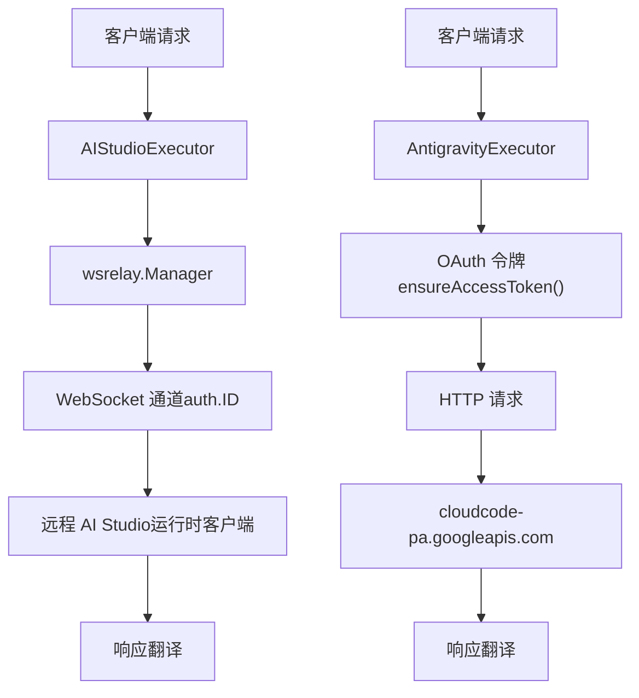
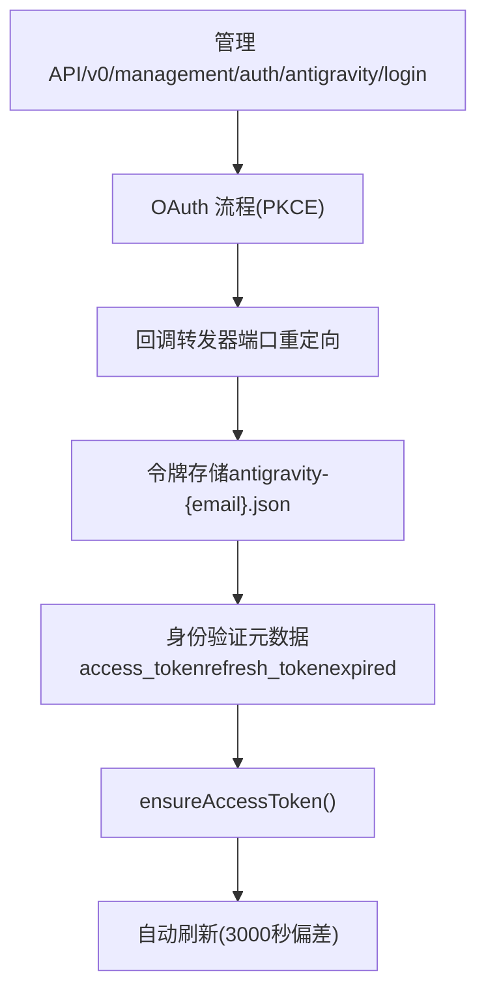
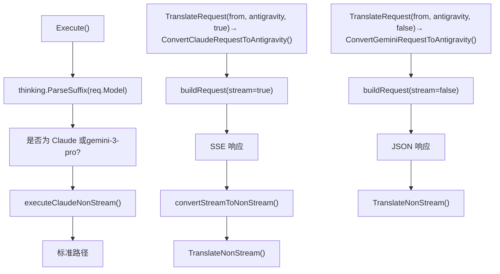
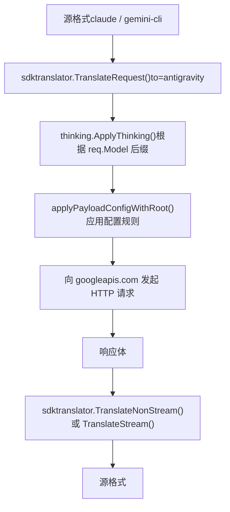
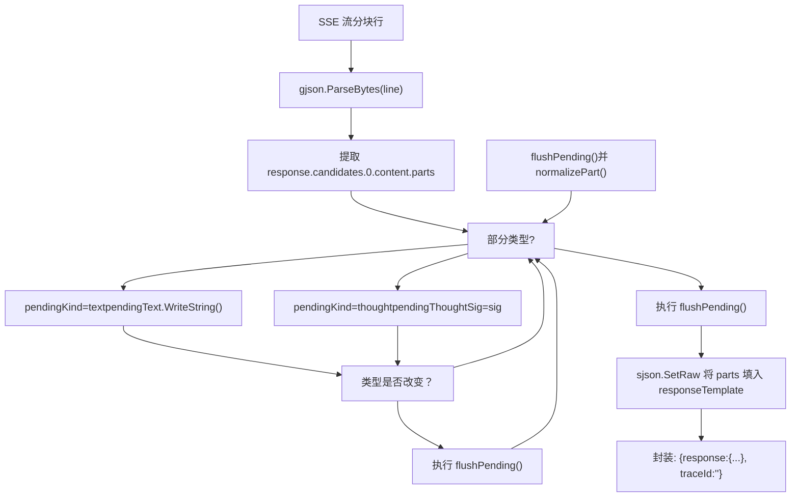
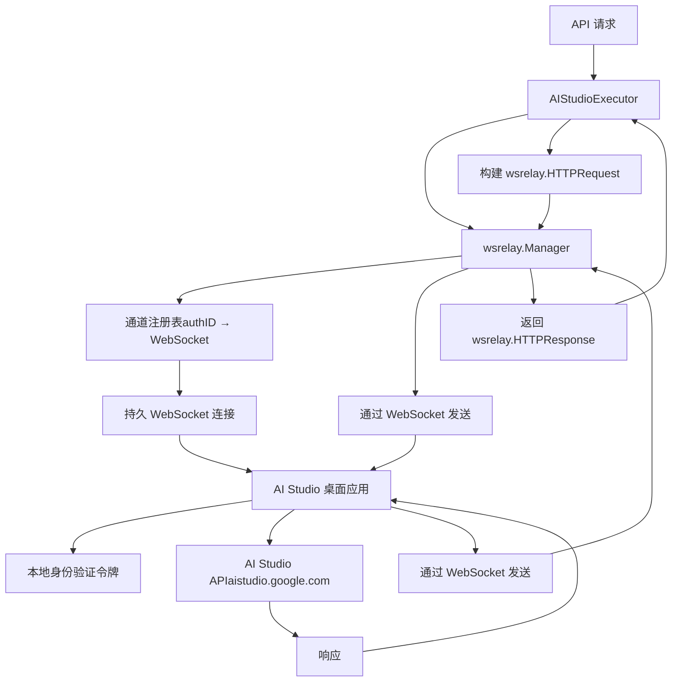
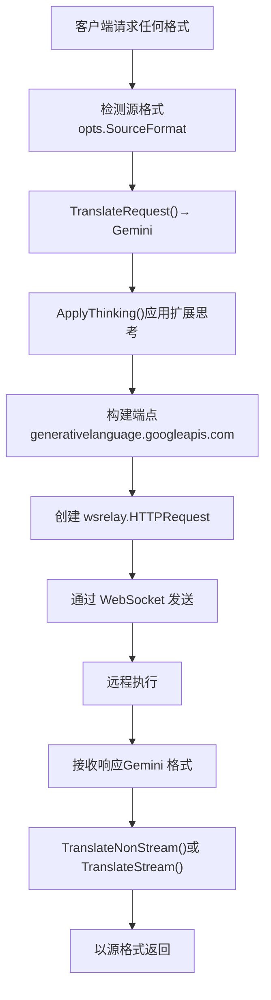
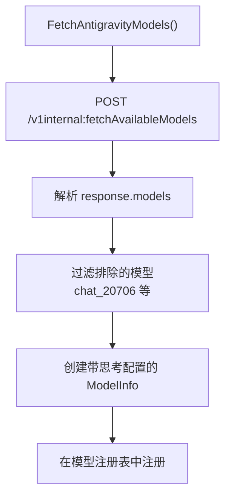

# Antigravity 与 AI Studio

相关源文件

-   [internal/auth/antigravity/auth.go](https://github.com/router-for-me/CLIProxyAPI/blob/c66cb0af/internal/auth/antigravity/auth.go)
-   [internal/cache/signature\_cache.go](https://github.com/router-for-me/CLIProxyAPI/blob/c66cb0af/internal/cache/signature_cache.go)
-   [internal/cache/signature\_cache\_test.go](https://github.com/router-for-me/CLIProxyAPI/blob/c66cb0af/internal/cache/signature_cache_test.go)
-   [internal/cmd/anthropic\_login.go](https://github.com/router-for-me/CLIProxyAPI/blob/c66cb0af/internal/cmd/anthropic_login.go)
-   [internal/cmd/iflow\_login.go](https://github.com/router-for-me/CLIProxyAPI/blob/c66cb0af/internal/cmd/iflow_login.go)
-   [internal/cmd/openai\_login.go](https://github.com/router-for-me/CLIProxyAPI/blob/c66cb0af/internal/cmd/openai_login.go)
-   [internal/cmd/qwen\_login.go](https://github.com/router-for-me/CLIProxyAPI/blob/c66cb0af/internal/cmd/qwen_login.go)
-   [internal/runtime/executor/aistudio\_executor.go](https://github.com/router-for-me/CLIProxyAPI/blob/c66cb0af/internal/runtime/executor/aistudio_executor.go)
-   [internal/runtime/executor/antigravity\_executor.go](https://github.com/router-for-me/CLIProxyAPI/blob/c66cb0af/internal/runtime/executor/antigravity_executor.go)
-   [internal/runtime/executor/claude\_executor.go](https://github.com/router-for-me/CLIProxyAPI/blob/c66cb0af/internal/runtime/executor/claude_executor.go)
-   [internal/runtime/executor/codex\_executor.go](https://github.com/router-for-me/CLIProxyAPI/blob/c66cb0af/internal/runtime/executor/codex_executor.go)
-   [internal/runtime/executor/gemini\_cli\_executor.go](https://github.com/router-for-me/CLIProxyAPI/blob/c66cb0af/internal/runtime/executor/gemini_cli_executor.go)
-   [internal/runtime/executor/gemini\_executor.go](https://github.com/router-for-me/CLIProxyAPI/blob/c66cb0af/internal/runtime/executor/gemini_executor.go)
-   [internal/runtime/executor/gemini\_vertex\_executor.go](https://github.com/router-for-me/CLIProxyAPI/blob/c66cb0af/internal/runtime/executor/gemini_vertex_executor.go)
-   [internal/runtime/executor/iflow\_executor.go](https://github.com/router-for-me/CLIProxyAPI/blob/c66cb0af/internal/runtime/executor/iflow_executor.go)
-   [internal/runtime/executor/openai\_compat\_executor.go](https://github.com/router-for-me/CLIProxyAPI/blob/c66cb0af/internal/runtime/executor/openai_compat_executor.go)
-   [internal/runtime/executor/qwen\_executor.go](https://github.com/router-for-me/CLIProxyAPI/blob/c66cb0af/internal/runtime/executor/qwen_executor.go)
-   [internal/translator/antigravity/claude/antigravity\_claude\_request.go](https://github.com/router-for-me/CLIProxyAPI/blob/c66cb0af/internal/translator/antigravity/claude/antigravity_claude_request.go)
-   [internal/translator/antigravity/claude/antigravity\_claude\_request\_test.go](https://github.com/router-for-me/CLIProxyAPI/blob/c66cb0af/internal/translator/antigravity/claude/antigravity_claude_request_test.go)
-   [internal/translator/antigravity/claude/antigravity\_claude\_response.go](https://github.com/router-for-me/CLIProxyAPI/blob/c66cb0af/internal/translator/antigravity/claude/antigravity_claude_response.go)
-   [internal/translator/antigravity/claude/antigravity\_claude\_response\_test.go](https://github.com/router-for-me/CLIProxyAPI/blob/c66cb0af/internal/translator/antigravity/claude/antigravity_claude_response_test.go)
-   [internal/translator/antigravity/gemini/antigravity\_gemini\_request.go](https://github.com/router-for-me/CLIProxyAPI/blob/c66cb0af/internal/translator/antigravity/gemini/antigravity_gemini_request.go)
-   [internal/translator/antigravity/gemini/antigravity\_gemini\_request\_test.go](https://github.com/router-for-me/CLIProxyAPI/blob/c66cb0af/internal/translator/antigravity/gemini/antigravity_gemini_request_test.go)
-   [sdk/auth/antigravity.go](https://github.com/router-for-me/CLIProxyAPI/blob/c66cb0af/sdk/auth/antigravity.go)
-   [sdk/auth/claude.go](https://github.com/router-for-me/CLIProxyAPI/blob/c66cb0af/sdk/auth/claude.go)
-   [sdk/auth/codex.go](https://github.com/router-for-me/CLIProxyAPI/blob/c66cb0af/sdk/auth/codex.go)
-   [sdk/auth/iflow.go](https://github.com/router-for-me/CLIProxyAPI/blob/c66cb0af/sdk/auth/iflow.go)
-   [sdk/auth/qwen.go](https://github.com/router-for-me/CLIProxyAPI/blob/c66cb0af/sdk/auth/qwen.go)

本页面涵盖了两个专门的基于 Google 的供应商的设置与运行：**Antigravity** (Google Deepmind 的智能编程助手) 和 **AI Studio** (基于 WebSocket 的多账号供应商)。两者均利用 Google Cloud 基础设施，但使用了不同的身份验证和通信机制。

有关通用 Gemini 配置，请参阅 [Google Gemini 与 Vertex AI](/router-for-me/CLIProxyAPI/6.1-google-gemini-and-vertex-ai)。有关 WebSocket 中继架构详情，请参阅 [WebSocket 与 AI Studio 集成](/router-for-me/CLIProxyAPI/8.7-websocket-and-runtime-authentication)。

---

## 概览

**Antigravity** 是 Google Deepmind 高级的智能 AI 编程助手，它使用 OAuth 身份验证，通过 Google Cloud 基础设施访问 Claude 和 Gemini 模型。它为多轮对话提供了扩展思考能力和签名缓存。

**AI Studio** 是一个基于 WebSocket 的供应商集成，支持针对 AI Studio 账号的运行时多账号负载均衡。与传统的基于 HTTP 的执行器不同，AI Studio 通过 WebSocket 中继通道路由所有请求，允许动态注册供应商而无需重启服务器。

### 架构对比


**来源：** [internal/runtime/executor/antigravity\_executor.go59-232](https://github.com/router-for-me/CLIProxyAPI/blob/c66cb0af/internal/runtime/executor/antigravity_executor.go#L59-L232) [internal/runtime/executor/aistudio\_executor.go27-110](https://github.com/router-for-me/CLIProxyAPI/blob/c66cb0af/internal/runtime/executor/aistudio_executor.go#L27-L110)

---

## Antigravity 供应商

### 身份验证流程

Antigravity 使用带有 PKCE 的 OAuth 2.0 进行身份验证。OAuth 流程通过管理 API 发起，并使用 Google 的 OAuth 端点。

#### OAuth 凭证


**来源：** [internal/runtime/executor/antigravity\_executor.go38-52](https://github.com/router-for-me/CLIProxyAPI/blob/c66cb0af/internal/runtime/executor/antigravity_executor.go#L38-L52) [internal/api/handlers/management/auth\_files.go235-241](https://github.com/router-for-me/CLIProxyAPI/blob/c66cb0af/internal/api/handlers/management/auth_files.go#L235-L241)

#### 关键配置常量

| 常量 | 取值 | 用途 |
| --- | --- | --- |
| `antigravityAuthType` | `antigravity` | `Identifier()` 返回值 |
| `antigravityClientID` | `<ANTIGRAVITY_CLIENT_ID>` | OAuth 客户端 ID |
| `antigravityClientSecret` | `<ANTIGRAVITY_CLIENT_SECRET>` | OAuth 客户端密钥 |
| `antigravityBaseURLDaily` | `https://daily-cloudcode-pa.googleapis.com` | 日常端点 (首选) |
| `antigravitySandboxBaseURLDaily` | `https://daily-cloudcode-pa.sandbox.googleapis.com` | 日常沙盒端点 |
| `antigravityBaseURLProd` | `https://cloudcode-pa.googleapis.com` | 生产端点 |
| `defaultAntigravityAgent` | `antigravity/1.104.0 darwin/arm64` | 默认 `User-Agent` 标头 |
| `refreshSkew` | `3000 * time.Second` | 令牌刷新提前时间 |

**来源：** [internal/runtime/executor/antigravity\_executor.go38-52](https://github.com/router-for-me/CLIProxyAPI/blob/c66cb0af/internal/runtime/executor/antigravity_executor.go#L38-L52)

### 模型支持

Antigravity 提供了通过 Google Cloud 基础设施访问 Claude 和 Gemini 模型的能力。执行器根据命名约定检测模型类型并应用相应的请求处理。

#### Execute() 非流式路由

`Execute()` 方法应用了一个模型类型分支：Claude 模型和 `gemini-3-pro` 由 `executeClaudeNonStream()` 处理，该函数内部使用上游的 SSE 连接，并调用 `convertStreamToNonStream()` 来组装最终的 JSON 正文。所有其他模型使用标准的非流式 HTTP 请求。

`ExecuteStream()` **不**应用此分支 —— 无论模型类型如何，所有模型都走相同的流式代码路径。

**Execute() 模型分发 (非流式路径)**


**来源：** [internal/runtime/executor/antigravity\_executor.go111-258](https://github.com/router-for-me/CLIProxyAPI/blob/c66cb0af/internal/runtime/executor/antigravity_executor.go#L111-L258) [internal/runtime/executor/antigravity\_executor.go261-463](https://github.com/router-for-me/CLIProxyAPI/blob/c66cb0af/internal/runtime/executor/antigravity_executor.go#L261-L463) [internal/runtime/executor/antigravity\_executor.go647-843](https://github.com/router-for-me/CLIProxyAPI/blob/c66cb0af/internal/runtime/executor/antigravity_executor.go#L647-L843)

#### 受支持的端点

| 端点 | 方法 | 用途 |
| --- | --- | --- |
| `/v1internal:generateContent` | POST | 非流式生成 |
| `/v1internal:streamGenerateContent` | POST | 流式生成 |
| `/v1internal:countTokens` | POST | 令牌计数 |
| `/v1internal:fetchAvailableModels` | POST | 列出可用模型 |

**来源：** [internal/runtime/executor/antigravity\_executor.go42-45](https://github.com/router-for-me/CLIProxyAPI/blob/c66cb0af/internal/runtime/executor/antigravity_executor.go#L42-L45)

### 请求处理

#### 基准 URL 回退策略

Antigravity 实现了精细的回退机制来处理频率限制和可用性问题：

> **[Mermaid sequence]**
> *(图表结构无法解析)*

**来源：** [internal/runtime/executor/antigravity\_executor.go147-231](https://github.com/router-for-me/CLIProxyAPI/blob/c66cb0af/internal/runtime/executor/antigravity_executor.go#L147-L231) [internal/runtime/executor/antigravity\_executor.go632-768](https://github.com/router-for-me/CLIProxyAPI/blob/c66cb0af/internal/runtime/executor/antigravity_executor.go#L632-L768)

#### 翻译管道

执行器以目标格式 `sdktranslator.FromString("antigravity")` 调用 `sdktranslator.TranslateRequest(from, to, baseModel, payload, stream)`。翻译器注册表根据源/目标格式对分发到具体的函数。

**Antigravity 请求/响应翻译阶段**


`"antigravity"` 格式字符串映射到以下翻译函数：

| 方向 | 源格式 | 目标格式 | 翻译函数 | 文件位置 |
| --- | --- | --- | --- | --- |
| 请求 | `claude` | `antigravity` | `ConvertClaudeRequestToAntigravity()` | `internal/translator/antigravity/claude` |
| 请求 | `gemini-cli` | `antigravity` | `ConvertGeminiRequestToAntigravity()` | `internal/translator/antigravity/gemini` |
| 响应流 | `antigravity` | `claude` | `ConvertAntigravityResponseToClaude()` | `internal/translator/antigravity/claude` |

**来源：** [internal/runtime/executor/antigravity\_executor.go131-150](https://github.com/router-for-me/CLIProxyAPI/blob/c66cb0af/internal/runtime/executor/antigravity_executor.go#L131-L150) [internal/translator/antigravity/claude/antigravity\_claude\_request.go37](https://github.com/router-for-me/CLIProxyAPI/blob/c66cb0af/internal/translator/antigravity/claude/antigravity_claude_request.go#L37-L37) [internal/translator/antigravity/gemini/antigravity\_gemini\_request.go19-30](https://github.com/router-for-me/CLIProxyAPI/blob/c66cb0af/internal/translator/antigravity/gemini/antigravity_gemini_request.go#L19-L30) [internal/translator/antigravity/claude/antigravity\_claude\_response.go66-88](https://github.com/router-for-me/CLIProxyAPI/blob/c66cb0af/internal/translator/antigravity/claude/antigravity_claude_response.go#L66-L88)

### 特殊功能

#### 签名缓存 (Signature Caching)

Antigravity 对处理的每个思考块验证 `thoughtSignature` 值。`internal/cache` 包提供了一个进程内签名缓存，键值为 `(modelGroup, SHA-256(thinkingText))`。

| 函数 | 描述 |
| --- | --- |
| `cache.CacheSignature(model, text, sig)` | 为思考文本存储签名 |
| `cache.GetCachedSignature(model, text)` | 根据思考文本查找已缓存的签名 |
| `cache.HasValidSignature(model, sig)` | 检查长度是否 ≥ `MinValidSignatureLen` (50) 且模型组是否匹配 |
| `cache.GetModelGroup(model)` | 将模型名规范化为组键 |

条目在 `SignatureCacheTTL = 3 小时` 后过期。通过 `cacheCleanupOnce` 启动的后台 goroutine 每 `CacheCleanupInterval = 10 分钟` 清理一次过时条目。

当 `ConvertClaudeRequestToAntigravity()` 遇到没有有效思考签名的 `tool_use` 内容块时（例如首轮对话，或未签名的思考），它会向 `functionCall` 部分的 `thoughtSignature` 字段注入哨兵字符串 `"skip_thought_signature_validator"`。这会绕过该轮对话的服务端签名验证。

**来源：** [internal/cache/signature\_cache.go1-155](https://github.com/router-for-me/CLIProxyAPI/blob/c66cb0af/internal/cache/signature_cache.go#L1-L155) [internal/translator/antigravity/claude/antigravity\_claude\_request.go100-210](https://github.com/router-for-me/CLIProxyAPI/blob/c66cb0af/internal/translator/antigravity/claude/antigravity_claude_request.go#L100-L210)

#### 流转非流转换 (Stream-to-Non-Stream Conversion)

针对 Claude 模型，`executeClaudeNonStream()` 执行内部流式 HTTP 请求，并通过 `convertStreamToNonStream()` 将分块重新组装为单个响应正文。

`AntigravityExecutor` 上的 `convertStreamToNonStream()` 方法扫描 SSE 行，使用 `pendingKind`/`pendingText`/`pendingThoughtSig` 状态机累积 `text` 和 `thought` 内容部分。`flushPending()` 闭包在追加到最终 `parts` 数组之前合并相同类型的相邻部分。

**convertStreamToNonStream() 部分累积**


组装好的响应随后连同 `ConvertAntigravityResponseToClaude()` 翻译器一起传递给 `sdktranslator.TranslateNonStream()`。该翻译器使用一个 `Params` 结构体（定义在 `internal/translator/antigravity/claude` 中）在整个响应到 SSE 的转换过程中维护流状态。

**来源：** [internal/runtime/executor/antigravity\_executor.go465-645](https://github.com/router-for-me/CLIProxyAPI/blob/c66cb0af/internal/runtime/executor/antigravity_executor.go#L465-L645) [internal/translator/antigravity/claude/antigravity\_claude\_response.go27-45](https://github.com/router-for-me/CLIProxyAPI/blob/c66cb0af/internal/translator/antigravity/claude/antigravity_claude_response.go#L27-L45)

### 配置示例

```
# config.yaml 中无需显式配置# 身份验证通过管理 API OAuth 流程处理 # 可选: 针对 Antigravity 模型的有效负载配置payload_config:  - model_pattern: "claude-.*"    provider: "antigravity"    config:      request:        max_tokens: 8192        temperature: 0.7
```
### 令牌管理

执行器自动管理 OAuth 令牌生命周期：

> **[Mermaid stateDiagram]**
> *(图表结构无法解析)*

**来源：** [internal/runtime/executor/antigravity\_executor.go1035-1080](https://github.com/router-for-me/CLIProxyAPI/blob/c66cb0af/internal/runtime/executor/antigravity_executor.go#L1035-L1080)

---

## AI Studio WebSocket 中继

### 架构

AI Studio 使用基于 WebSocket 的中继架构，支持在不重启服务器的情况下进行运行时供应商注册。`wsrelay.Manager` 处理代理服务器与远程 AI Studio 客户端之间的双向通信。


**来源：** [internal/runtime/executor/aistudio\_executor.go1-110](https://github.com/router-for-me/CLIProxyAPI/blob/c66cb0af/internal/runtime/executor/aistudio_executor.go#L1-L110) [internal/wsrelay/manager.go](https://github.com/router-for-me/CLIProxyAPI/blob/c66cb0af/internal/wsrelay/manager.go)

### 身份验证

AI Studio 身份验证是基于通道的。每个认证客户端注册一个唯一的认证 ID，请求将路由到相应的通道。

#### 通道注册

> **[Mermaid sequence]**
> *(图表结构无法解析)*

**来源：** [internal/api/handlers/management/auth\_files.go505-510](https://github.com/router-for-me/CLIProxyAPI/blob/c66cb0af/internal/api/handlers/management/auth_files.go#L505-L510)

### 请求流程

#### 非流式请求

> **[Mermaid sequence]**
> *(图表结构无法解析)*

**来源：** [internal/runtime/executor/aistudio\_executor.go113-166](https://github.com/router-for-me/CLIProxyAPI/blob/c66cb0af/internal/runtime/executor/aistudio_executor.go#L113-L166)

#### 流式请求

> **[Mermaid sequence]**
> *(图表结构无法解析)*

**来源：** [internal/runtime/executor/aistudio\_executor.go169-292](https://github.com/router-for-me/CLIProxyAPI/blob/c66cb0af/internal/runtime/executor/aistudio_executor.go#L169-L292)

### 消息类型

AI Studio WebSocket 协议支持多种消息类型：

| 消息类型 | 方向 | 用途 |
| --- | --- | --- |
| `HTTPRequest` | 服务器 → 客户端 | 发送 HTTP 请求进行执行 |
| `HTTPResponse` | 客户端 → 服务器 | 完整的 HTTP 响应 |
| `StreamStart` | 客户端 → 服务器 | 带有状态/标头的流初始化 |
| `StreamChunk` | 客户端 → 服务器 | SSE 流分块 |
| `StreamEnd` | 客户端 → 服务器 | 流结束 |
| `Error` | 客户端 → 服务器 | 执行过程中的错误 |

**来源：** [internal/runtime/executor/aistudio\_executor.go252-292](https://github.com/router-for-me/CLIProxyAPI/blob/c66cb0af/internal/runtime/executor/aistudio_executor.go#L252-L292)

### 翻译与格式处理

AI Studio 执行器在转发前将所有请求翻译为 Gemini 格式：


**来源：** [internal/runtime/executor/aistudio\_executor.go293-374](https://github.com/router-for-me/CLIProxyAPI/blob/c66cb0af/internal/runtime/executor/aistudio_executor.go#L293-L374)

### 运行时供应商注册

AI Studio 供应商是在运行时动态注册的：

```
// Runtime-only 属性防止文件持久化auth.Attributes["runtime_only"] = "true" // WebSocket 通道标识符auth.ID = channelID // 供应商类型auth.Provider = "aistudio"
```
这些运行时供应商出现在认证列表中，但不会持久化到磁盘。当 WebSocket 连接关闭时，该供应商会被自动移除。

**来源：** [internal/api/handlers/management/auth\_files.go505-510](https://github.com/router-for-me/CLIProxyAPI/blob/c66cb0af/internal/api/handlers/management/auth_files.go#L505-L510)

### 错误处理

执行器为 WebSocket 故障实现了全面的错误处理：

> **[Mermaid stateDiagram]**
> *(图表结构无法解析)*

**来源：** [internal/runtime/executor/aistudio\_executor.go208-249](https://github.com/router-for-me/CLIProxyAPI/blob/c66cb0af/internal/runtime/executor/aistudio_executor.go#L208-L249)

### 配置

AI Studio 不需要 `config.yaml` 中的显式配置。当 WebSocket 客户端连接时，供应商即被动态注册。

```
# AI Studio 无需配置# 供应商通过 WebSocket 在运行时注册 # 可选: WebSocket 服务器配置websocket:  enabled: true  path: /ws/relay  max_connections: 100
```
有关 WebSocket 中继设置和桌面客户端集成的详情，请参阅 [WebSocket 与 AI Studio 集成](/router-for-me/CLIProxyAPI/8.7-websocket-and-runtime-authentication)。

---

## 模型注册表集成

Antigravity 和 AI Studio 均动态注册模型：

### Antigravity 模型获取


**来源：** [internal/runtime/executor/antigravity\_executor.go931-1033](https://github.com/router-for-me/CLIProxyAPI/blob/c66cb0af/internal/runtime/executor/antigravity_executor.go#L931-L1033)

### 模型能力配置

两个执行器均支持来自静态模型注册表的扩展思考配置：

```
if modelCfg.Thinking != nil {    modelInfo.Thinking = modelCfg.Thinking}if modelCfg.MaxCompletionTokens > 0 {    modelInfo.MaxCompletionTokens = modelCfg.MaxCompletionTokens}
```
**来源：** [internal/runtime/executor/antigravity\_executor.go1019-1027](https://github.com/router-for-me/CLIProxyAPI/blob/c66cb0af/internal/runtime/executor/antigravity_executor.go#L1019-L1027)

---

## 对比表

| 特性 | Antigravity | AI Studio |
| --- | --- | --- |
| 身份验证 | OAuth 2.0 (PKCE) | 基于 WebSocket 通道 |
| 传输协议 | HTTP/HTTPS | WebSocket 中继 |
| 模型支持 | Claude, Gemini | Gemini (通过 AI Studio) |
| 持久化 | 基于文件的令牌 | 仅限运行时 |
| 回退 URL | 是 (日常/生产) | 否 (单一端点) |
| 思考支持 | 是 (带缓存) | 是 (通过翻译) |
| 多账号支持 | 是 (OAuth 令牌) | 是 (WebSocket 通道) |
| 注册方式 | 管理 API OAuth | WebSocket 连接 |

**来源：** [internal/runtime/executor/antigravity\_executor.go1-1571](https://github.com/router-for-me/CLIProxyAPI/blob/c66cb0af/internal/runtime/executor/antigravity_executor.go#L1-L1571) [internal/runtime/executor/aistudio\_executor.go1-400](https://github.com/router-for-me/CLIProxyAPI/blob/c66cb0af/internal/runtime/executor/aistudio_executor.go#L1-L400)
