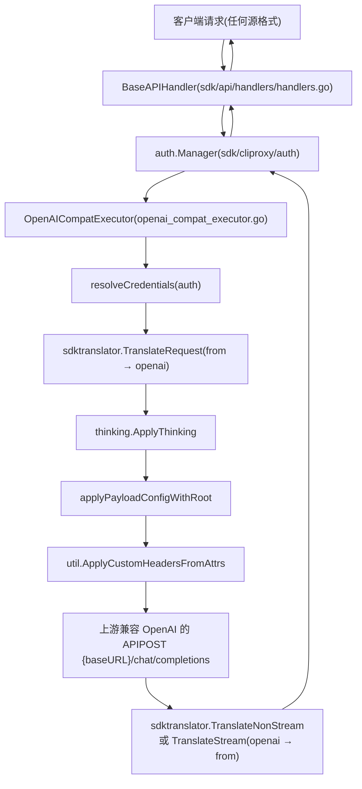
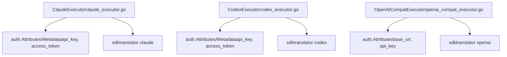

# 兼容 OpenAI 的供应商

相关源文件

-   [internal/api/middleware/request\_logging\_test.go](https://github.com/router-for-me/CLIProxyAPI/blob/c66cb0af/internal/api/middleware/request_logging_test.go)
-   [internal/api/middleware/response\_writer\_test.go](https://github.com/router-for-me/CLIProxyAPI/blob/c66cb0af/internal/api/middleware/response_writer_test.go)
-   [internal/config/sdk\_config.go](https://github.com/router-for-me/CLIProxyAPI/blob/c66cb0af/internal/config/sdk_config.go)
-   [internal/runtime/executor/aistudio\_executor.go](https://github.com/router-for-me/CLIProxyAPI/blob/c66cb0af/internal/runtime/executor/aistudio_executor.go)
-   [internal/runtime/executor/antigravity\_executor.go](https://github.com/router-for-me/CLIProxyAPI/blob/c66cb0af/internal/runtime/executor/antigravity_executor.go)
-   [internal/runtime/executor/claude\_executor.go](https://github.com/router-for-me/CLIProxyAPI/blob/c66cb0af/internal/runtime/executor/claude_executor.go)
-   [internal/runtime/executor/codex\_executor.go](https://github.com/router-for-me/CLIProxyAPI/blob/c66cb0af/internal/runtime/executor/codex_executor.go)
-   [internal/runtime/executor/codex\_websockets\_executor.go](https://github.com/router-for-me/CLIProxyAPI/blob/c66cb0af/internal/runtime/executor/codex_websockets_executor.go)
-   [internal/runtime/executor/gemini\_cli\_executor.go](https://github.com/router-for-me/CLIProxyAPI/blob/c66cb0af/internal/runtime/executor/gemini_cli_executor.go)
-   [internal/runtime/executor/gemini\_executor.go](https://github.com/router-for-me/CLIProxyAPI/blob/c66cb0af/internal/runtime/executor/gemini_executor.go)
-   [internal/runtime/executor/gemini\_vertex\_executor.go](https://github.com/router-for-me/CLIProxyAPI/blob/c66cb0af/internal/runtime/executor/gemini_vertex_executor.go)
-   [internal/runtime/executor/iflow\_executor.go](https://github.com/router-for-me/CLIProxyAPI/blob/c66cb0af/internal/runtime/executor/iflow_executor.go)
-   [internal/runtime/executor/openai\_compat\_executor.go](https://github.com/router-for-me/CLIProxyAPI/blob/c66cb0af/internal/runtime/executor/openai_compat_executor.go)
-   [internal/runtime/executor/qwen\_executor.go](https://github.com/router-for-me/CLIProxyAPI/blob/c66cb0af/internal/runtime/executor/qwen_executor.go)
-   [sdk/api/handlers/handlers.go](https://github.com/router-for-me/CLIProxyAPI/blob/c66cb0af/sdk/api/handlers/handlers.go)
-   [sdk/api/handlers/handlers\_stream\_bootstrap\_test.go](https://github.com/router-for-me/CLIProxyAPI/blob/c66cb0af/sdk/api/handlers/handlers_stream_bootstrap_test.go)
-   [sdk/api/handlers/header\_filter.go](https://github.com/router-for-me/CLIProxyAPI/blob/c66cb0af/sdk/api/handlers/header_filter.go)
-   [sdk/api/handlers/header\_filter\_test.go](https://github.com/router-for-me/CLIProxyAPI/blob/c66cb0af/sdk/api/handlers/header_filter_test.go)
-   [sdk/api/handlers/openai/openai\_responses\_websocket.go](https://github.com/router-for-me/CLIProxyAPI/blob/c66cb0af/sdk/api/handlers/openai/openai_responses_websocket.go)
-   [sdk/cliproxy/auth/conductor\_executor\_replace\_test.go](https://github.com/router-for-me/CLIProxyAPI/blob/c66cb0af/sdk/cliproxy/auth/conductor_executor_replace_test.go)

本页面记录了 `openai-compat` 执行器 —— CLIProxyAPI 用于将请求代理到任何支持 OpenAI `/chat/completions` 线缆格式的第三方 API 的机制。它涵盖了执行器实现、凭证解析、请求翻译管道以及配置模式。

有关更广泛的供应商执行器接口以及如何选择执行器，请参阅 [3.4](https://github.com/router-for-me/CLIProxyAPI/blob/c66cb0af/3.4)。有关请求翻译内部机制，请参阅 [3.5](https://github.com/router-for-me/CLIProxyAPI/blob/c66cb0af/3.5)。有关身份验证凭证如何存储和轮换，请参阅 [3.3](https://github.com/router-for-me/CLIProxyAPI/blob/c66cb0af/3.3)。

---

## 概览

CLIProxyAPI 可以将推理请求路由到任何兼容 OpenAI 的上游（例如 OpenRouter、Together AI 或自托管的 vLLM 实例），而无需专门的 OAuth 流程。`OpenAICompatExecutor` 以通用的方式处理这些供应商：它从身份验证凭证记录中解析 `base_url` 和 `api_key`，将入站请求翻译为 OpenAI 格式，并将其转发到上游。

系统支持同时使用多个不同的供应商。每个供应商通过一个唯一的供应商名称字符串（例如 `"openrouter"`、`"together"`）进行标识，该字符串在启动时注册，并在请求时与身份验证凭证匹配。

---

## 执行器架构

**图表：OpenAICompatExecutor 请求流**


**来源：** [internal/runtime/executor/openai\_compat\_executor.go72-177](https://github.com/router-for-me/CLIProxyAPI/blob/c66cb0af/internal/runtime/executor/openai_compat_executor.go#L72-L177)

---

## `OpenAICompatExecutor`

定义在 [internal/runtime/executor/openai\_compat\_executor.go26-33](https://github.com/router-for-me/CLIProxyAPI/blob/c66cb0af/internal/runtime/executor/openai_compat_executor.go#L26-L33)：

```
type OpenAICompatExecutor struct {
    provider string     // 例如 "openrouter", "together"
    cfg      *config.Config
}
```
通过 `NewOpenAICompatExecutor(provider string, cfg *config.Config)` 创建。`provider` 字符串成为执行器 `Identifier()` 的返回值，身份验证管理器使用该值来匹配凭证。

### 方法

| 方法 | 行为 |
| --- | --- |
| `Identifier()` | 返回 `e.provider` |
| `PrepareRequest(req, auth)` | 设置 `Authorization: Bearer <apiKey>`，应用自定义标头 |
| `HttpRequest(ctx, auth, req)` | 调用 `PrepareRequest`，然后通过支持代理的 HTTP 客户端执行 |
| `Execute(ctx, auth, req, opts)` | 非流式：向 `/chat/completions` 或 `/responses/compact` 发送 POST |
| `ExecuteStream(ctx, auth, req, opts)` | 流式：向具有 SSE 的 `/chat/completions` 发送 POST |
| `Refresh(ctx, auth)` | 空操作 —— API 密钥凭证不会过期 |

**来源：** [internal/runtime/executor/openai\_compat\_executor.go36-70](https://github.com/router-for-me/CLIProxyAPI/blob/c66cb0af/internal/runtime/executor/openai_compat_executor.go#L36-L70)

---

## 凭证解析

私有的 `resolveCredentials(auth *cliproxyauth.Auth)` 方法从身份验证记录的 `Attributes` 映射中提取两个值：

| 属性键 | 用途 |
| --- | --- |
| `base_url` | 上游的基准 URL (例如 `https://openrouter.ai/api/v1`) |
| `api_key` | 作为 `Authorization: Bearer <api_key>` 发送的 API 密钥 |

如果 `baseURL` 为空，`Execute` 返回 HTTP 401 (`missing provider baseURL`)。如果 `apiKey` 为空，则完全省略 `Authorization` 标头（某些端点允许未经身份验证的访问）。

**来源：** [internal/runtime/executor/openai\_compat\_executor.go40-53](https://github.com/router-for-me/CLIProxyAPI/blob/c66cb0af/internal/runtime/executor/openai_compat_executor.go#L40-L53) [internal/runtime/executor/openai\_compat\_executor.go78-83](https://github.com/router-for-me/CLIProxyAPI/blob/c66cb0af/internal/runtime/executor/openai_compat_executor.go#L78-L83)

---

## 请求管道

**图表：Execute/ExecuteStream 内部的翻译与注入步骤**

> **[Mermaid sequence]**
> *(图表结构无法解析)*

**来源：** [internal/runtime/executor/openai\_compat\_executor.go84-176](https://github.com/router-for-me/CLIProxyAPI/blob/c66cb0af/internal/runtime/executor/openai_compat_executor.go#L84-L176) [internal/runtime/executor/openai\_compat\_executor.go179-295](https://github.com/router-for-me/CLIProxyAPI/blob/c66cb0af/internal/runtime/executor/openai_compat_executor.go#L179-L295)

### 翻译格式

无论客户端发送的是什么格式，执行器始终为上游请求翻译为 `"openai"` 格式。对于 `/responses/compact`，它改用 `"openai-response"`。

```
from = opts.SourceFormat           // 例如 "claude", "gemini", "openai"
to   = sdktranslator.FromString("openai")  // 针对 chat/completions 始终为 openai
```
响应从 `openai` 翻译回原始的 `from` 格式。

**来源：** [internal/runtime/executor/openai\_compat\_executor.go85-96](https://github.com/router-for-me/CLIProxyAPI/blob/c66cb0af/internal/runtime/executor/openai_compat_executor.go#L85-L96)

### 自定义标头

设置 `Authorization` 后，使用完整的 `auth.Attributes` 映射调用 `util.ApplyCustomHeadersFromAttrs(httpReq, attrs)`。任何带有 `header_` 前缀的属性键都会被注入为请求标头。这允许按凭证自定义标头（例如，针对 OpenRouter 的 `HTTP-Referer` 或 `X-Title` 字段）。

**来源：** [internal/runtime/executor/openai\_compat\_executor.go120-125](https://github.com/router-for-me/CLIProxyAPI/blob/c66cb0af/internal/runtime/executor/openai_compat_executor.go#L120-L125)

### User-Agent

所有请求均带有 `User-Agent: cli-proxy-openai-compat` 标头。

**来源：** [internal/runtime/executor/openai\_compat\_executor.go121](https://github.com/router-for-me/CLIProxyAPI/blob/c66cb0af/internal/runtime/executor/openai_compat_executor.go#L121-L121)

---

## 受支持的端点

| `opts.Alt` 取值 | 上游 URL | 请求格式 | 响应格式 |
| --- | --- | --- | --- |
| `""` (默认) | `{baseURL}/chat/completions` | `openai` | `openai` |
| `"responses/compact"` | `{baseURL}/responses/compact` | `openai-response` | `openai-response` |
| (流式传输) | `{baseURL}/chat/completions` | `openai` | SSE 流 |

对于流式传输，执行器设置 `Accept: text/event-stream` 和 `Cache-Control: no-cache` 标头，然后逐行读取 SSE 流，按分块调用 `sdktranslator.TranslateStream`。

**来源：** [internal/runtime/executor/openai\_compat\_executor.go86-104](https://github.com/router-for-me/CLIProxyAPI/blob/c66cb0af/internal/runtime/executor/openai_compat_executor.go#L86-L104) [internal/runtime/executor/openai\_compat\_executor.go208-247](https://github.com/router-for-me/CLIProxyAPI/blob/c66cb0af/internal/runtime/executor/openai_compat_executor.go#L208-L247)

---

## 思考支持

与其他执行器一样，`OpenAICompatExecutor` 在翻译后调用 `thinking.ApplyThinking`。这会在请求发送到上游之前，根据模型名称后缀注入推理/思考参数。全量思考配置文档请参阅 [8.3](https://github.com/router-for-me/CLIProxyAPI/blob/c66cb0af/8.3)。

**来源：** [internal/runtime/executor/openai\_compat\_executor.go106-109](https://github.com/router-for-me/CLIProxyAPI/blob/c66cb0af/internal/runtime/executor/openai_compat_executor.go#L106-L109)

---

## 配置

### 身份验证凭证文件

针对兼容 OpenAI 的供应商，身份验证凭证记录必须具备：

-   `type` 与注册的执行器名称匹配（例如 `openrouter`）
-   `attributes.base_url`：上游基准 URL
-   `attributes.api_key`：API 密钥

身份验证凭证结构示例 (YAML)：

```
type: openrouterattributes:  base_url: "https://openrouter.ai/api/v1"  api_key: "sk-or-v1-..."
```
任何以 `header_` 为前缀的额外 `attributes` 条目都将作为 HTTP 标头转发到上游。

### 供应商注册

每个不同的兼容 OpenAI 的供应商名称必须对应一个已注册的 `OpenAICompatExecutor` 实例。执行器通过 `NewOpenAICompatExecutor(providerName, cfg)` 创建。在标准服务启动中，这些执行器连同其他执行器一起注册在执行器注册表中。关于执行器如何注册，请参阅 [3.4](https://github.com/router-for-me/CLIProxyAPI/blob/c66cb0af/3.4)。

### 模型定义

由兼容 OpenAI 的供应商提供的模型在模型注册表中以该供应商名称声明。传出请求中的 `model` 字段被设置为解析后的基础模型名称（剥离任何思考后缀后）。代理不会应用任何额外的模型名称转换。模型注册表详情请参阅 [3.6](https://github.com/router-for-me/CLIProxyAPI/blob/c66cb0af/3.6)。

---

## 有效负载配置 (Payload Configuration)

`applyPayloadConfigWithRoot` 调用允许在请求转发前应用全局或针对模型的有效负载规则（默认值、覆盖值、字段删除）。这些规则在 `config.yaml` 的 `payload_config` 下配置。有关有效负载配置规则的完整文档，请参阅 [5.4](https://github.com/router-for-me/CLIProxyAPI/blob/c66cb0af/5.4)。

**来源：** [internal/runtime/executor/openai\_compat\_executor.go98-99](https://github.com/router-for-me/CLIProxyAPI/blob/c66cb0af/internal/runtime/executor/openai_compat_executor.go#L98-L99)

---

## 与其他执行器的对比

**图表：OpenAICompatExecutor vs. 供应商专用执行器**


| 特性 | `OpenAICompatExecutor` | `CodexExecutor` | `ClaudeExecutor` |
| --- | --- | --- | --- |
| 认证类型 | 仅 API 密钥 | API 密钥 + OAuth | API 密钥 + OAuth |
| 令牌刷新 | 无 | 是 | 是 |
| 上游格式 | OpenAI `/chat/completions` | Codex Responses API | Anthropic Messages API |
| 自定义基准 URL | 必填 (来自 `base_url` 属性) | 可选 | 可选 |
| 多个供应商实例 | 是 (每个名称一个) | 否 | 否 |

**来源：** [internal/runtime/executor/openai\_compat\_executor.go26-295](https://github.com/router-for-me/CLIProxyAPI/blob/c66cb0af/internal/runtime/executor/openai_compat_executor.go#L26-L295) [internal/runtime/executor/codex\_executor.go37-45](https://github.com/router-for-me/CLIProxyAPI/blob/c66cb0af/internal/runtime/executor/codex_executor.go#L37-L45) [internal/runtime/executor/claude\_executor.go34-43](https://github.com/router-for-me/CLIProxyAPI/blob/c66cb0af/internal/runtime/executor/claude_executor.go#L34-L43)

---

## 使用情况统计

执行器通过所有执行器共享的 `usageReporter` 模式报告令牌使用情况。它对响应正文调用 `parseOpenAIUsage(body)`，从 OpenAI 格式的使用情况对象中提取 `prompt_tokens`、`completion_tokens` 和 `total_tokens`。即使上游省略了 `usage` 字段，也会调用 `reporter.ensurePublished(ctx)` 以保证至少产生一条使用记录。

**来源：** [internal/runtime/executor/openai\_compat\_executor.go168-172](https://github.com/router-for-me/CLIProxyAPI/blob/c66cb0af/internal/runtime/executor/openai_compat_executor.go#L168-L172)
