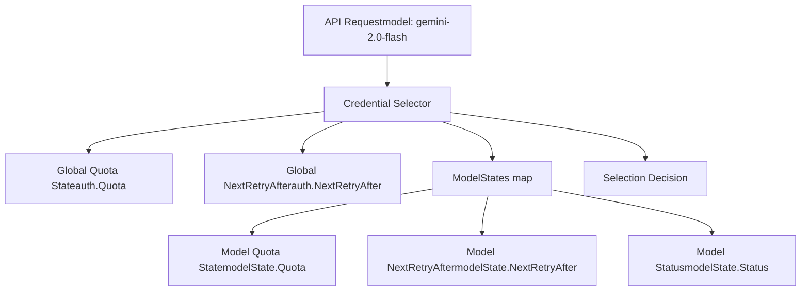
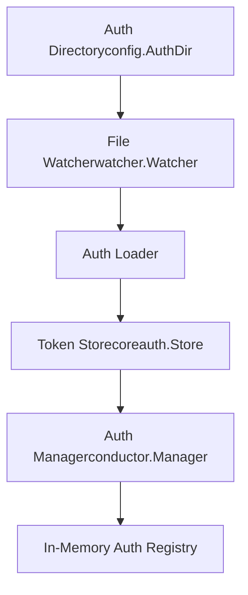
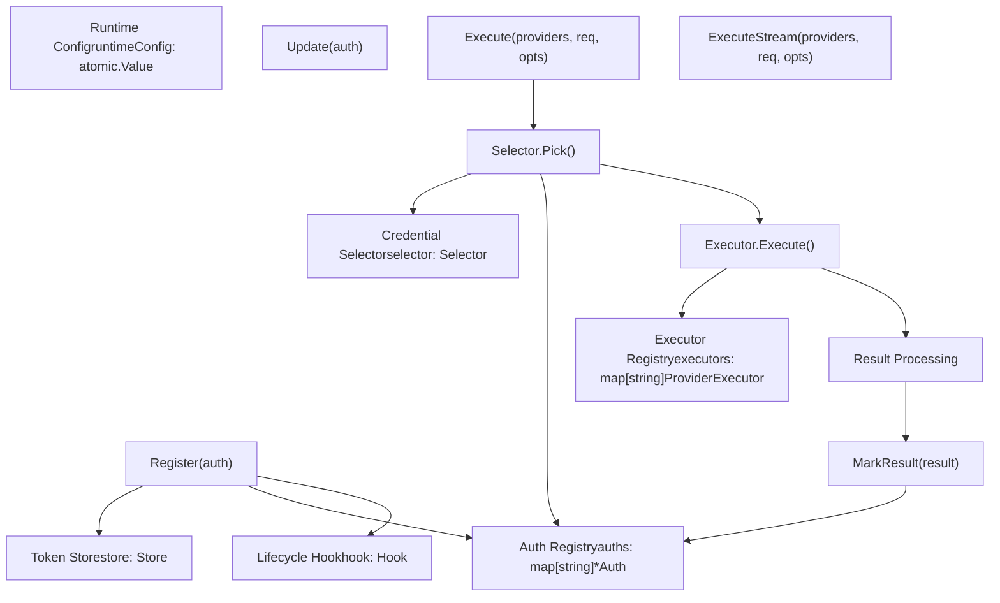
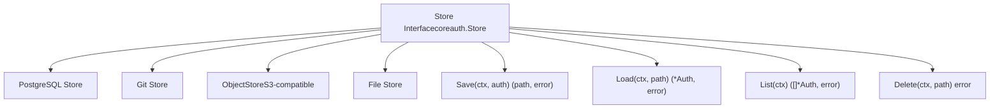
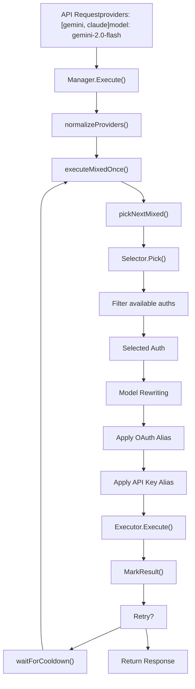
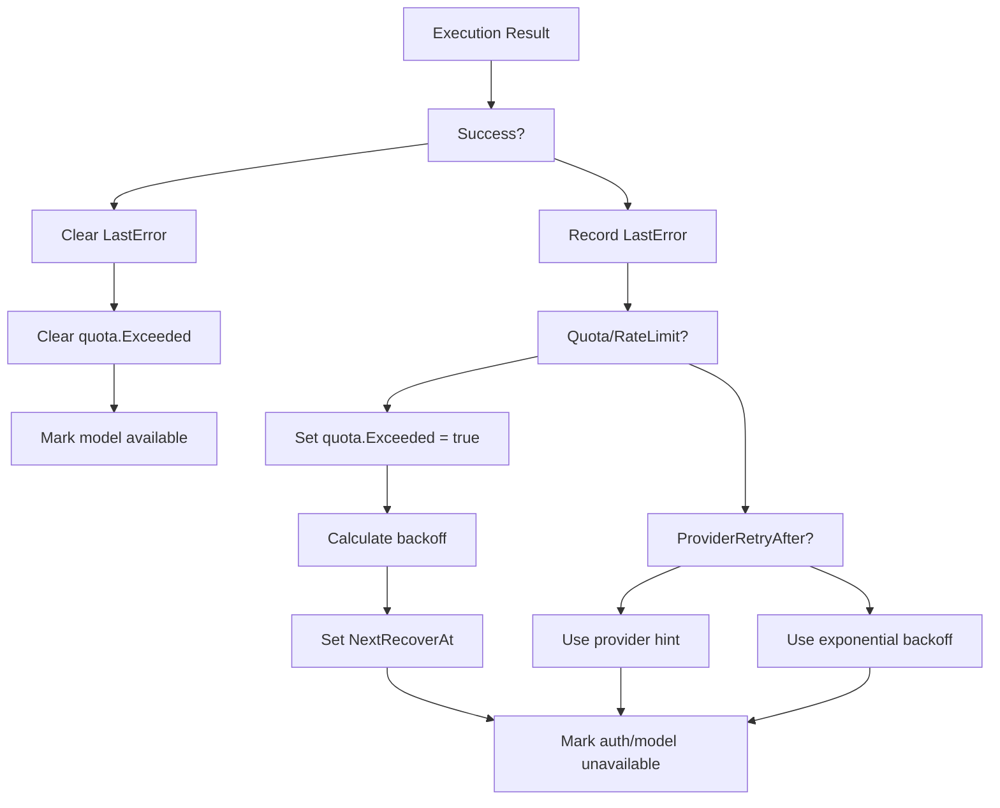

# 身份验证流程

相关源文件

-   [internal/watcher/config\_reload.go](https://github.com/router-for-me/CLIProxyAPI/blob/c66cb0af/internal/watcher/config_reload.go)
-   [sdk/cliproxy/auth/conductor.go](https://github.com/router-for-me/CLIProxyAPI/blob/c66cb0af/sdk/cliproxy/auth/conductor.go)
-   [sdk/cliproxy/auth/selector.go](https://github.com/router-for-me/CLIProxyAPI/blob/c66cb0af/sdk/cliproxy/auth/selector.go)
-   [sdk/cliproxy/auth/selector\_test.go](https://github.com/router-for-me/CLIProxyAPI/blob/c66cb0af/sdk/cliproxy/auth/selector_test.go)
-   [sdk/cliproxy/auth/types.go](https://github.com/router-for-me/CLIProxyAPI/blob/c66cb0af/sdk/cliproxy/auth/types.go)
-   [sdk/cliproxy/auth/types\_test.go](https://github.com/router-for-me/CLIProxyAPI/blob/c66cb0af/sdk/cliproxy/auth/types_test.go)

## 用途与范围

本文档解释了 CLIProxyAPI 如何管理跨多个 AI 供应商的身份验证凭证。它涵盖了核心身份验证机制、凭证生命周期、存储后端以及用于将请求路由到适当凭证的选择策略。

有关特定主题的详细信息，请参阅：

-   OAuth 流程实现和回调处理：[OAuth 流程架构](/router-for-me/CLIProxyAPI/7.1-oauth-flow-architecture)
-   特定供应商的 OAuth 配置：[供应商特定 OAuth 设置](/router-for-me/CLIProxyAPI/7.2-provider-specific-oauth-setup)
-   API 密钥和服务账号凭证管理：[API 密钥和服务账号管理](/router-for-me/CLIProxyAPI/7.3-api-key-and-service-account-management)
-   令牌过期和自动刷新：[令牌刷新与生命周期](/router-for-me/CLIProxyAPI/7.4-token-refresh-and-lifecycle)

---

## 身份验证概览

CLIProxyAPI 支持多种身份验证方法，以适应不同的供应商要求和部署场景。所有身份验证数据都流经统一的**身份验证管理器 (Auth Manager)**（[sdk/cliproxy/auth/conductor.go](https://github.com/router-for-me/CLIProxyAPI/blob/c66cb0af/sdk/cliproxy/auth/conductor.go) 中的 `Manager`），该管理器协调凭证选择、执行和生命周期管理。

### 支持的身份验证方法

| 方法 | 使用场景 | 持久化 | 自动刷新 |
| --- | --- | --- | --- |
| **OAuth** | 用户范围的供应商访问（Gemini, Claude, Codex 等） | 令牌存储 (Token Store) | 是 |
| **API 密钥** | 来自配置或认证文件的供应商 API 密钥 | 令牌存储或配置文件 | 否 |
| **服务账号** | GCP 服务账号 JSON 文件 | 令牌存储 | 是（通过 SDK） |
| **仅限运行时** | WebSocket 注入的凭证（AI Studio） | 仅限内存 | 取决于供应商 |

来源：[sdk/cliproxy/auth/types.go15-66](https://github.com/router-for-me/CLIProxyAPI/blob/c66cb0af/sdk/cliproxy/auth/types.go#L15-L66) [sdk/cliproxy/auth/conductor.go116-147](https://github.com/router-for-me/CLIProxyAPI/blob/c66cb0af/sdk/cliproxy/auth/conductor.go#L116-L147)

---

## 身份验证数据模型

### Auth 结构

每个凭证都由一个 `Auth` 结构体表示，它封装了：

```
Auth {
  ID: string              // 唯一标识符（文件名或生成的 UUID）
  Index: string           // 用于去重的稳定运行时哈希
  Provider: string        // 供应商键（gemini, claude, codex 等）
  Prefix: string          // 可选的路由前缀（例如 "team-a/"）
  FileName: string        // 持久化凭证的底层文件路径
  Storage: TokenStorage   // 供应商特定的令牌持久化接口
  Status: Status          // 生命周期状态（active, error, disabled 等）
  Disabled: bool          // 操作员控制的禁用标志
  Unavailable: bool       // 瞬时不可用（配额超限，冷却中）
  Attributes: map[string]string  // 不变的供应商元数据（api_key, base_url）
  Metadata: map[string]any       // 可变的运行时状态（tokens, cookies）
  Quota: QuotaState       // 近期的配额/速率限制跟踪
  ModelStates: map[string]*ModelState  // 每个模型的可用性跟踪
  CreatedAt: time.Time
  UpdatedAt: time.Time
  LastRefreshedAt: time.Time
  NextRefreshAfter: time.Time
  NextRetryAfter: time.Time
}
```
**关键字段：**

-   **Attributes**：由执行器（Executors）使用的不可变配置数据（例如 `api_key`、`base_url`、`priority`）
-   **Metadata**：可变的供应商状态，例如 OAuth 令牌、刷新令牌、过期时间戳
-   **ModelStates**：每个模型的冷却和配额跟踪，实现细粒度的凭证选择
-   **Index**：根据文件名或 API 密钥计算的哈希值，用于在重启后进行稳定识别

来源：[sdk/cliproxy/auth/types.go15-66](https://github.com/router-for-me/CLIProxyAPI/blob/c66cb0af/sdk/cliproxy/auth/types.go#L15-L66) [sdk/cliproxy/auth/types.go126-164](https://github.com/router-for-me/CLIProxyAPI/blob/c66cb0af/sdk/cliproxy/auth/types.go#L126-L164)

### 配额与冷却跟踪


**配额状态（Quota State）结构：**

-   `Exceeded`：指示是否达到配额/速率限制的布尔标志
-   `Reason`：来自供应商的人类可读描述
-   `NextRecoverAt`：配额可能再次可用的时间戳
-   `BackoffLevel`：用于重试退避的渐进式冷却指数

系统在两个层级跟踪配额状态：

1.  **全局 Auth 级**：适用于此凭证的所有模型
2.  **每个模型级**：独立跟踪单个模型的配额状态

来源：[sdk/cliproxy/auth/types.go68-96](https://github.com/router-for-me/CLIProxyAPI/blob/c66cb0af/sdk/cliproxy/auth/types.go#L68-L96) [sdk/cliproxy/auth/selector.go239-296](https://github.com/router-for-me/CLIProxyAPI/blob/c66cb0af/sdk/cliproxy/auth/selector.go#L239-L296)

---

## 身份验证源与加载

### 基于文件的身份验证

凭证可以从配置的身份验证目录中的 JSON 文件加载：


**加载流程：**

1.  文件观察器检测 `config.AuthDir` 中的 `.json` 文件
2.  解析文件中的 `type` 字段以确定供应商
3.  根据文件元数据创建令牌存储包装器
4.  向管理器注册 Auth 记录
5.  在全局模型注册表中注册模型

来源：[internal/api/handlers/management/auth\_files.go681-743](https://github.com/router-for-me/CLIProxyAPI/blob/c66cb0af/internal/api/handlers/management/auth_files.go#L681-L743) [sdk/cliproxy/auth/conductor.go408-424](https://github.com/router-for-me/CLIProxyAPI/blob/c66cb0af/sdk/cliproxy/auth/conductor.go#L408-L424)

### 基于配置的身份验证

API 密钥可以直接在 `config.yaml` 中定义：

```
gemini_key:  - api_key: "AIza..."    models:      - name: "gemini-2.0-flash-exp"        alias: "gemini-flash"      claude_key:  - api_key: "sk-ant-..."    base_url: "https://api.anthropic.com"    models:      - name: "claude-3-5-sonnet-latest"
```
基于配置的凭证被实例化为具有以下内容的 `Auth` 条目：

-   `Attributes["api_key"]`：API 密钥值
-   `Attributes["base_url"]`：可选的供应商端点覆盖
-   编译到查找表中的供应商特定模型别名映射

来源：[sdk/cliproxy/auth/conductor.go250-324](https://github.com/router-for-me/CLIProxyAPI/blob/c66cb0af/sdk/cliproxy/auth/conductor.go#L250-L324)

### 运行时身份验证

WebSocket 连接可以在运行时注入凭证，无需持久化：

-   标记为 `Attributes["runtime_only"] = "true"`
-   不持久化到磁盘
-   禁用时从基于文件的列表中排除
-   常用于 AI Studio 的动态凭证注入

来源：[sdk/cliproxy/auth/types.go498-503](https://github.com/router-for-me/CLIProxyAPI/blob/c66cb0af/sdk/cliproxy/auth/types.go#L498-L503) [internal/api/handlers/management/auth\_files.go361-364](https://github.com/router-for-me/CLIProxyAPI/blob/c66cb0af/internal/api/handlers/management/auth_files.go#L361-L364)

---

## 身份验证管理器 (编排模式)

[sdk/cliproxy/auth/conductor.go](https://github.com/router-for-me/CLIProxyAPI/blob/c66cb0af/sdk/cliproxy/auth/conductor.go) 中的 `Manager` 使用编排（conductor）模式管理所有凭证操作：


**核心职责：**

1.  **凭证注册**：通过 `Register()` 和 `Update()` 添加/更新凭证
2.  **选择策略**：委派给可插拔的 `Selector`（轮询、优先填满、基于优先级）
3.  **执行编排**：通过带有重试逻辑的选定凭证路由请求
4.  **结果跟踪**：根据执行结果更新配额状态、冷却时间和可用性
5.  **自动刷新**：在凭证接近过期时调度令牌刷新
6.  **持久化**：委派给 `Store` 后端进行持久令牌存储

来源：[sdk/cliproxy/auth/conductor.go116-169](https://github.com/router-for-me/CLIProxyAPI/blob/c66cb0af/sdk/cliproxy/auth/conductor.go#L116-L169) [sdk/cliproxy/auth/conductor.go408-443](https://github.com/router-for-me/CLIProxyAPI/blob/c66cb0af/sdk/cliproxy/auth/conductor.go#L408-L443)

### 凭证选择策略

管理器支持两种内置选择策略：

| 策略 | 行为 | 使用场景 |
| --- | --- | --- |
| **RoundRobinSelector** | 为每个模型循环选择可用凭证 | 在账号之间公平分配 |
| **FillFirstSelector** | 始终选取第一个可用凭证 | 按顺序消耗账号（错开订阅上限） |

两种策略均遵循：

-   通过 `Attributes["priority"]` 设置的优先级
-   通过 `ModelStates` 进行的模型特定冷却
-   全局不可用标志
-   禁用的凭证

来源：[sdk/cliproxy/auth/selector.go19-237](https://github.com/router-for-me/CLIProxyAPI/blob/c66cb0af/sdk/cliproxy/auth/selector.go#L19-L237) [sdk/cliproxy/auth/conductor.go149-169](https://github.com/router-for-me/CLIProxyAPI/blob/c66cb0af/sdk/cliproxy/auth/conductor.go#L149-L169)

**选择错误处理：**

当模型的所有凭证都在冷却中时，选择器返回 `modelCooldownError`，包含：

-   HTTP 429 状态码
-   包含冷却时长的 `Retry-After` 标头
-   包含重置时间和模型信息的 JSON 错误体

来源：[sdk/cliproxy/auth/selector.go40-107](https://github.com/router-for-me/CLIProxyAPI/blob/c66cb0af/sdk/cliproxy/auth/selector.go#L40-L107)

---

## 令牌存储后端

凭证通过 `Store` 接口持久化，该接口支持多种后端：


**Store 接口：**

-   `Save(ctx, auth)`：持久化或更新凭证记录
-   `Load(ctx, path)`：通过标识符检索凭证
-   `List(ctx)`：列举所有凭证
-   `Delete(ctx, path)`：移除凭证记录

管理器在凭证注册或更新后调用 `Save()`。文件存储实现将 JSON 文件写入磁盘，而云端后端序列化到其各自的存储系统。

来源：[sdk/cliproxy/auth/conductor.go183-188](https://github.com/router-for-me/CLIProxyAPI/blob/c66cb0af/sdk/cliproxy/auth/conductor.go#L183-L188) [internal/api/handlers/management/auth\_files.go831-868](https://github.com/router-for-me/CLIProxyAPI/blob/c66cb0af/internal/api/handlers/management/auth_files.go#L831-L868)

---

## OAuth 流程集成

OAuth 流程通过管理 API 发起，并由特定供应商的身份验证器处理：

> **[Mermaid sequence]**
> *(图表结构无法解析)*

**回调转发器（Callback Forwarder）模式：**

为了进行 Web UI 集成，系统启动一个临时的本地 HTTP 服务器，将 OAuth 回调重定向到管理 API：

1.  **本地服务器**：绑定到供应商特定端口（例如 Gemini 为 8085）
2.  **重定向**：将回调转发到 `http://127.0.0.1:{server_port}/oauth/callback`
3.  **状态匹配**：验证 state 参数以防止 CSRF
4.  **基于文件的 IPC**：将回调数据写入 `.oauth-{provider}-{state}.oauth` 文件
5.  **轮询**：后台 goroutine 以 5 分钟超时时间轮询文件创建情况
6.  **清理**：在回调完成后或超时后关闭服务器

来源：[internal/api/handlers/management/auth\_files.go55-234](https://github.com/router-for-me/CLIProxyAPI/blob/c66cb0af/internal/api/handlers/management/auth_files.go#L55-L234) [internal/api/handlers/management/auth\_files.go870-1012](https://github.com/router-for-me/CLIProxyAPI/blob/c66cb0af/internal/api/handlers/management/auth_files.go#L870-L1012)

### OAuth 会话跟踪

管理 API 维护内存中的 OAuth 会话状态，以跟踪并发流程：

```
oauthSessions map[string]*OAuthSession {
  state: {
    Provider: "anthropic"
    Status: "pending" | "completed" | "error"
    Error: string
    CreatedAt: time.Time
  }
}
```
跟踪会话的目的是：

-   防止使用相同状态的重复流程
-   允许通过会话清理进行取消
-   为异步流程提供状态轮询
-   在超时后清理过期的会话

来源：[internal/api/handlers/management/auth\_files.go1014-1089](https://github.com/router-for-me/CLIProxyAPI/blob/c66cb0af/internal/api/handlers/management/auth_files.go#L1014-L1089)

---

## 凭证执行流程

通过凭证的请求执行遵循以下路径：


**执行步骤：**

1.  **供应商规范化**：将供应商列表转换为小写，去重
2.  **凭证选择**：使用选择器为模型挑选可用凭证
3.  **模型重写**：
    -   如果存在路由前缀则剥离（例如 `team-a/gemini-flash` → `gemini-flash`）
    -   从配置中应用 OAuth 模型别名
    -   从每个凭证配置中应用 API 密钥模型别名
4.  **执行器调用**：使用选定的 auth 调用特定供应商的执行器
5.  **结果跟踪**：更新配额状态、冷却和模型可用性
6.  **重试逻辑**：在瞬时故障时使用指数退避进行重试

来源：[sdk/cliproxy/auth/conductor.go472-563](https://github.com/router-for-me/CLIProxyAPI/blob/c66cb0af/sdk/cliproxy/auth/conductor.go#L472-L563) [sdk/cliproxy/auth/conductor.go565-619](https://github.com/router-for-me/CLIProxyAPI/blob/c66cb0af/sdk/cliproxy/auth/conductor.go#L565-L619)

### 模型别名解析

管理器应用两个层级的模型别名：

**1\. OAuth 模型别名（全局）：**

```
oauth_model_alias:  gemini:    gemini-flash: gemini-2.0-flash-exp    gemini-pro: gemini-1.5-pro-002
```
应用于供应商的所有 OAuth 凭证。

**2\. API 密钥模型别名（按凭证）：**

```
gemini_key:  - api_key: "AIza..."    models:      - name: "gemini-2.0-flash-thinking-exp-1219"        alias: "gemini-flash-thinking"
```
仅应用于特定的 API 密钥凭证。通过在配置重载时重建的缓存查找表进行解析。

来源：[sdk/cliproxy/auth/conductor.go210-247](https://github.com/router-for-me/CLIProxyAPI/blob/c66cb0af/sdk/cliproxy/auth/conductor.go#L210-L247) [sdk/cliproxy/auth/conductor.go816-863](https://github.com/router-for-me/CLIProxyAPI/blob/c66cb0af/sdk/cliproxy/auth/conductor.go#L816-L863)

---

## 结果跟踪与配额管理

每次执行后，管理器根据结果更新凭证状态：


**配额退避（Backoff）计算：**

渐进式退避级别增加冷却时长：

```
backoffLevel = min(quota.BackoffLevel + 1, maxLevel)
duration = min(quotaBackoffBase * 2^backoffLevel, quotaBackoffMax)
```
默认值：

-   `quotaBackoffBase`：1 秒
-   `quotaBackoffMax`：30 分钟

通过元数据设置按凭证的覆盖：

```
{  "disable_cooling": true,  "request_retry": 5}
```
来源：[sdk/cliproxy/auth/conductor.go1270-1477](https://github.com/router-for-me/CLIProxyAPI/blob/c66cb0af/sdk/cliproxy/auth/conductor.go#L1270-L1477) [sdk/cliproxy/auth/conductor.go49-72](https://github.com/router-for-me/CLIProxyAPI/blob/c66cb0af/sdk/cliproxy/auth/conductor.go#L49-L72)

---

## 管理 API 端点

管理 API 提供针对认证文件的 CRUD 操作：

| 端点 | 方法 | 用途 |
| --- | --- | --- |
| `/v0/management/auth/list` | GET | 列出所有认证文件及其元数据 |
| `/v0/management/auth/download` | GET | 下载单个认证文件 |
| `/v0/management/auth/upload` | POST | 上传认证文件（multipart 或 JSON） |
| `/v0/management/auth/delete` | DELETE | 删除认证文件 |
| `/v0/management/auth/patch-status` | PATCH | 启用/禁用认证文件 |
| `/v0/management/auth/request-gemini-token` | POST | 发起 Gemini OAuth 流程 |
| `/v0/management/auth/request-anthropic-token` | POST | 发起 Claude OAuth 流程 |
| `/v0/management/auth/request-codex-token` | POST | 发起 Codex OAuth 流程 |

**认证列表响应：**

```
{  "files": [    {      "id": "gemini-user@example.com-project123.json",      "name": "gemini-user@example.com-project123.json",      "type": "gemini",      "provider": "gemini",      "email": "user@example.com",      "account_type": "oauth",      "status": "active",      "disabled": false,      "unavailable": false,      "runtime_only": false,      "size": 2048,      "created_at": "2024-01-01T00:00:00Z",      "updated_at": "2024-01-15T10:30:00Z",      "last_refresh": "2024-01-15T10:30:00Z"    }  ]}
```
来源：[internal/api/handlers/management/auth\_files.go250-272](https://github.com/router-for-me/CLIProxyAPI/blob/c66cb0af/internal/api/handlers/management/auth_files.go#L250-L272) [internal/api/handlers/management/auth\_files.go356-428](https://github.com/router-for-me/CLIProxyAPI/blob/c66cb0af/internal/api/handlers/management/auth_files.go#L356-L428)

### 认证文件上传与注册

上传认证文件会触发立即注册：

1.  **文件验证**：检查 `.json` 扩展名并解析 JSON
2.  **持久化**：写入 `config.AuthDir/{filename}`
3.  **注册**：调用 `registerAuthFromFile()` 以加载到管理器中
4.  **模型注册**：提取供应商特定模型并在全局注册表中注册
5.  **钩子通知**：为外部观察者触发 `OnAuthRegistered()` 钩子

来源：[internal/api/handlers/management/auth\_files.go531-594](https://github.com/router-for-me/CLIProxyAPI/blob/c66cb0af/internal/api/handlers/management/auth_files.go#L531-L594)

---

## 身份验证流程示例

### Gemini CLI 的 OAuth 流程

> **[Mermaid sequence]**
> *(图表结构无法解析)*

**项目发现：**

Gemini CLI 认证需要 GCP 项目 ID。该流程尝试：

1.  **加载现有项目**：调用 `:loadCodeAssist` 检查现有的项目绑定
2.  **入职新用户**：如果未找到，则调用 `:onboardUser` 创建项目关联
3.  **验证 API**：通过服务使用情况 API 检查 Cloud AI API 是否已启用
4.  **持久化**：在令牌元数据中保存项目 ID，以便用于后续请求

来源：[internal/api/handlers/management/auth\_files.go1014-1242](https://github.com/router-for-me/CLIProxyAPI/blob/c66cb0af/internal/api/handlers/management/auth_files.go#L1014-L1242) [internal/auth/antigravity/auth.go154-242](https://github.com/router-for-me/CLIProxyAPI/blob/c66cb0af/internal/auth/antigravity/auth.go#L154-L242)

### API 密钥身份验证

API 密钥不需要 OAuth 流程：

1.  **配置定义**：在 `config.yaml` 中供应商特定键下进行定义
2.  **管理器加载**：认证管理器在启动时读取配置
3.  **实例化**：创建带有 `Attributes["api_key"]` 的 `Auth` 条目
4.  **别名编译**：根据配置构建模型别名查找表
5.  **执行**：执行器将 API 密钥注入到请求标头中

来源：[sdk/cliproxy/auth/conductor.go250-324](https://github.com/router-for-me/CLIProxyAPI/blob/c66cb0af/sdk/cliproxy/auth/conductor.go#L250-L324) [sdk/cliproxy/auth/conductor.go865-908](https://github.com/router-for-me/CLIProxyAPI/blob/c66cb0af/sdk/cliproxy/auth/conductor.go#L865-L908)

---

## 安全考虑

### 凭证隔离

-   认证文件存储权限为 `0600`（仅所有者可读写）
-   管理 API 默认通过中间件限制为仅本地主机访问
-   OAuth state 参数使用加密安全的随机生成
-   回调转发器仅绑定到 `127.0.0.1`

来源：[internal/api/handlers/management/auth\_files.go585](https://github.com/router-for-me/CLIProxyAPI/blob/c66cb0af/internal/api/handlers/management/auth_files.go#L585-L585) [internal/api/handlers/management/auth\_files.go144-148](https://github.com/router-for-me/CLIProxyAPI/blob/c66cb0af/internal/api/handlers/management/auth_files.go#L144-L148)

### 令牌刷新安全

-   刷新令牌绝不会在 API 响应中暴露
-   在每次请求前验证令牌过期情况
-   刷新提前期（默认 5 分钟）可防止最后一秒的故障
-   刷新失败会将 auth 标记为不可用，并使用指数退避

来源：[sdk/cliproxy/auth/types.go350-431](https://github.com/router-for-me/CLIProxyAPI/blob/c66cb0af/sdk/cliproxy/auth/types.go#L350-L431) [sdk/cliproxy/auth/conductor.go1479-1666](https://github.com/router-for-me/CLIProxyAPI/blob/c66cb0af/sdk/cliproxy/auth/conductor.go#L1479-L1666)

---

## 来源

本文档编写参考了以下源文件：

-   [internal/api/handlers/management/auth\_files.go1-1999](https://github.com/router-for-me/CLIProxyAPI/blob/c66cb0af/internal/api/handlers/management/auth_files.go#L1-L1999)
-   [sdk/cliproxy/auth/conductor.go1-2000](https://github.com/router-for-me/CLIProxyAPI/blob/c66cb0af/sdk/cliproxy/auth/conductor.go#L1-L2000)
-   [sdk/cliproxy/auth/types.go1-480](https://github.com/router-for-me/CLIProxyAPI/blob/c66cb0af/sdk/cliproxy/auth/types.go#L1-L480)
-   [sdk/cliproxy/auth/selector.go1-297](https://github.com/router-for-me/CLIProxyAPI/blob/c66cb0af/sdk/cliproxy/auth/selector.go#L1-L297)
-   [sdk/auth/antigravity.go1-267](https://github.com/router-for-me/CLIProxyAPI/blob/c66cb0af/sdk/auth/antigravity.go#L1-L267)
-   [internal/auth/antigravity/auth.go1-345](https://github.com/router-for-me/CLIProxyAPI/blob/c66cb0af/internal/auth/antigravity/auth.go#L1-L345)
-   [internal/watcher/config\_reload.go1-136](https://github.com/router-for-me/CLIProxyAPI/blob/c66cb0af/internal/watcher/config_reload.go#L1-L136)
