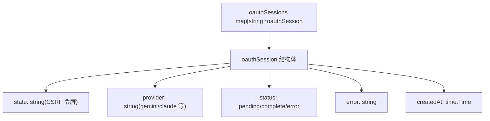
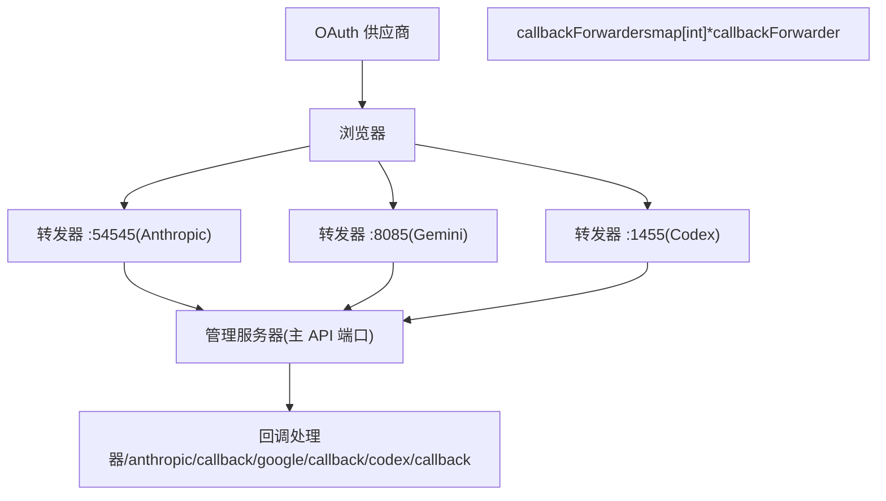
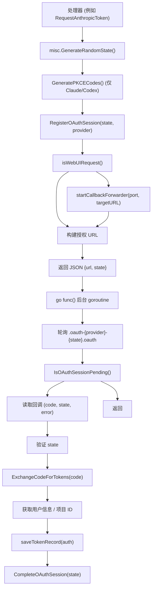
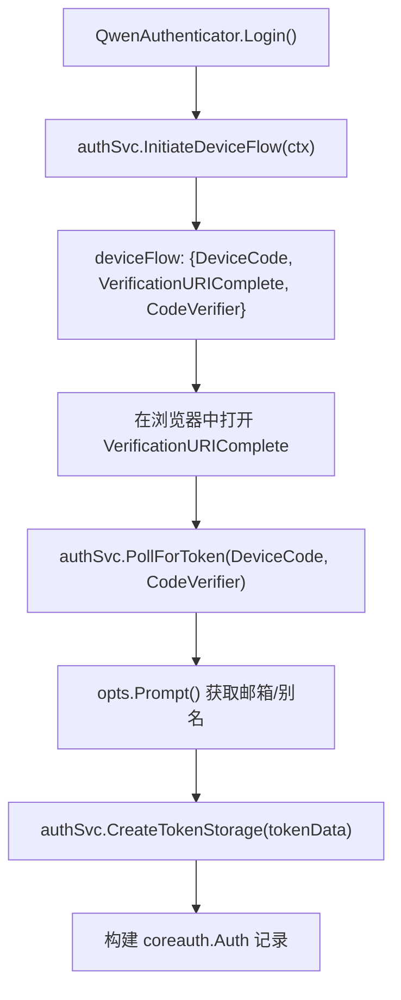
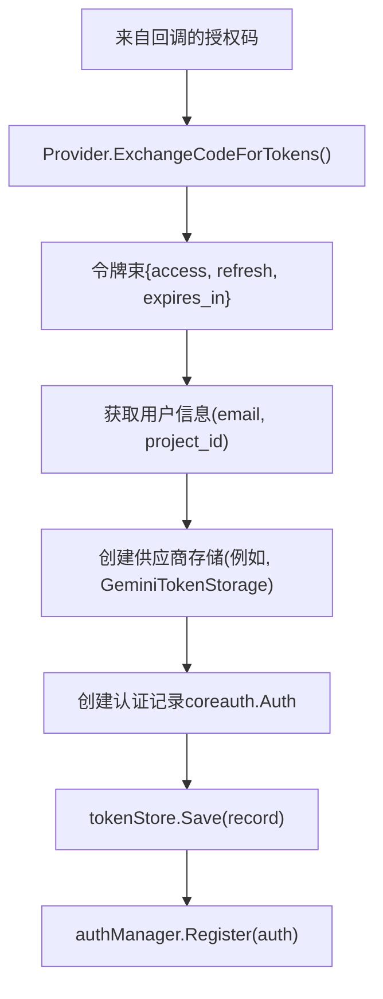
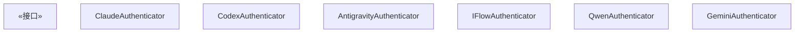
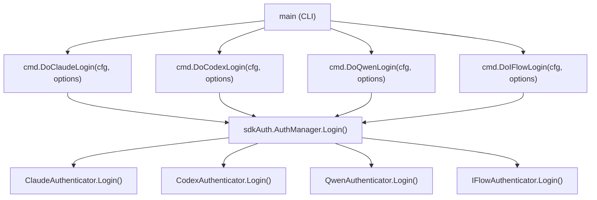
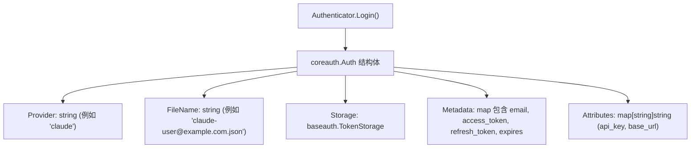
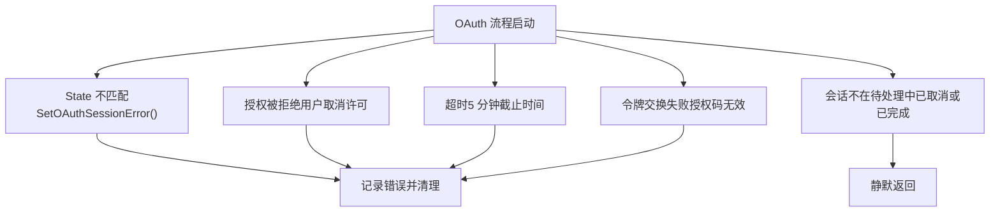

# OAuth 流程架构

相关源文件

-   [internal/auth/antigravity/auth.go](https://github.com/router-for-me/CLIProxyAPI/blob/c66cb0af/internal/auth/antigravity/auth.go)
-   [internal/cmd/anthropic\_login.go](https://github.com/router-for-me/CLIProxyAPI/blob/c66cb0af/internal/cmd/anthropic_login.go)
-   [internal/cmd/iflow\_login.go](https://github.com/router-for-me/CLIProxyAPI/blob/c66cb0af/internal/cmd/iflow_login.go)
-   [internal/cmd/openai\_login.go](https://github.com/router-for-me/CLIProxyAPI/blob/c66cb0af/internal/cmd/openai_login.go)
-   [internal/cmd/qwen\_login.go](https://github.com/router-for-me/CLIProxyAPI/blob/c66cb0af/internal/cmd/qwen_login.go)
-   [internal/watcher/config\_reload.go](https://github.com/router-for-me/CLIProxyAPI/blob/c66cb0af/internal/watcher/config_reload.go)
-   [sdk/auth/antigravity.go](https://github.com/router-for-me/CLIProxyAPI/blob/c66cb0af/sdk/auth/antigravity.go)
-   [sdk/auth/claude.go](https://github.com/router-for-me/CLIProxyAPI/blob/c66cb0af/sdk/auth/claude.go)
-   [sdk/auth/codex.go](https://github.com/router-for-me/CLIProxyAPI/blob/c66cb0af/sdk/auth/codex.go)
-   [sdk/auth/iflow.go](https://github.com/router-for-me/CLIProxyAPI/blob/c66cb0af/sdk/auth/iflow.go)
-   [sdk/auth/qwen.go](https://github.com/router-for-me/CLIProxyAPI/blob/c66cb0af/sdk/auth/qwen.go)
-   [sdk/cliproxy/auth/conductor.go](https://github.com/router-for-me/CLIProxyAPI/blob/c66cb0af/sdk/cliproxy/auth/conductor.go)
-   [sdk/cliproxy/auth/selector.go](https://github.com/router-for-me/CLIProxyAPI/blob/c66cb0af/sdk/cliproxy/auth/selector.go)
-   [sdk/cliproxy/auth/selector\_test.go](https://github.com/router-for-me/CLIProxyAPI/blob/c66cb0af/sdk/cliproxy/auth/selector_test.go)
-   [sdk/cliproxy/auth/types.go](https://github.com/router-for-me/CLIProxyAPI/blob/c66cb0af/sdk/cliproxy/auth/types.go)
-   [sdk/cliproxy/auth/types\_test.go](https://github.com/router-for-me/CLIProxyAPI/blob/c66cb0af/sdk/cliproxy/auth/types_test.go)

## 用途与范围

本文档描述了 CLIProxyAPI 用于向多个 AI 供应商验证用户身份的 OAuth 2.0 流程架构。它涵盖了状态管理系统、回调处理机制以及支持 CLI 和 Web UI 身份验证流程的回调转发器基础设施。

有关供应商特定的 OAuth 设置说明，请参阅[供应商特定 OAuth 设置](/router-for-me/CLIProxyAPI/7.2-provider-specific-oauth-setup)。有关令牌刷新和生命周期管理，请参阅[令牌刷新与生命周期](/router-for-me/CLIProxyAPI/7.4-token-refresh-and-lifecycle)。有关通用身份验证概念，请参阅[身份验证与凭证管理](/router-for-me/CLIProxyAPI/3.3-authentication-and-credential-management)。

---

## OAuth 流程概览

CLIProxyAPI 为大多数供应商实现了 OAuth 2.0 授权码流程（可选带 PKCE）。Qwen 使用 OAuth 2.0 设备流。系统具有两条不同的执行路径：

1.  **SDK/CLI 模式** (`Authenticator.Login()`): 启动一个本地 HTTP 服务器以直接接收 OAuth 回调。在执行 CLI `login` 命令或使用 Go SDK 时使用。
2.  **管理 API 模式** (例如 `RequestAnthropicToken`): 通过 Web UI 使用；使用轻量级回调转发器将供应商回调端口桥接到管理服务器，然后通过写入认证目录的文件进行协调。

### SDK/CLI OAuth 序列 (授权码流程)

此流程适用于使用 SDK 认证器时的 Claude、Codex、Antigravity 和 iFlow。

**SDK 授权码流程**

> **[Mermaid sequence]**
> *(图表结构无法解析)*

**来源：** [sdk/auth/claude.go38-214](https://github.com/router-for-me/CLIProxyAPI/blob/c66cb0af/sdk/auth/claude.go#L38-L214) [sdk/auth/codex.go38-192](https://github.com/router-for-me/CLIProxyAPI/blob/c66cb0af/sdk/auth/codex.go#L38-L192) [sdk/auth/antigravity.go35-215](https://github.com/router-for-me/CLIProxyAPI/blob/c66cb0af/sdk/auth/antigravity.go#L35-L215) [sdk/auth/iflow.go33-190](https://github.com/router-for-me/CLIProxyAPI/blob/c66cb0af/sdk/auth/iflow.go#L33-L190)

### 管理 API OAuth 序列 (Web UI)

此流程适用于通过管理 REST API 发起 OAuth 的情况（例如，用于 Web UI 集成）。

**管理 API OAuth 流程**

> **[Mermaid sequence]**
> *(图表结构无法解析)*

**来源：** [internal/api/handlers/management/auth\_files.go870-1012](https://github.com/router-for-me/CLIProxyAPI/blob/c66cb0af/internal/api/handlers/management/auth_files.go#L870-L1012) [internal/api/handlers/management/auth\_files.go1014-1242](https://github.com/router-for-me/CLIProxyAPI/blob/c66cb0af/internal/api/handlers/management/auth_files.go#L1014-L1242)

---

## 状态管理与会话跟踪

OAuth 流程需要跟踪待处理的身份验证会话，以防止 CSRF 攻击并在授权请求与回调处理器之间进行协调。

### OAuth 会话数据结构

系统使用同步映射（map）结构维护内存中的会话状态：


### 会话管理函数

OAuth 会话生命周期由 [internal/api/handlers/management/auth\_files.go2241-2332](https://github.com/router-for-me/CLIProxyAPI/blob/c66cb0af/internal/api/handlers/management/auth_files.go#L2241-L2332) 中的这些关键函数管理：

| 函数 | 用途 |
| --- | --- |
| `RegisterOAuthSession(state, provider)` | 创建带有唯一 state 令牌的新待处理会话 |
| `IsOAuthSessionPending(state, provider)` | 检查会话是否仍在等待回调 |
| `CompleteOAuthSession(state)` | 将会话标记为成功完成 |
| `CompleteOAuthSessionsByProvider(provider)` | 完成一个供应商的所有待处理会话 |
| `SetOAuthSessionError(state, error)` | 记录错误并将会话标记为失败 |
| `CleanupExpiredOAuthSessions()` | 移除超过 10 分钟的会话 |

State 令牌使用加密安全的随机字节生成。PKCE 代码（code verifier 和 challenge）单独生成，且仅用于 Claude 和 Codex：

| 供应商 | State 生成方式 | PKCE |
| --- | --- | --- |
| Claude | `misc.GenerateRandomState()` | `claude.GeneratePKCECodes()` |
| Codex | `misc.GenerateRandomState()` | `codex.GeneratePKCECodes()` |
| Antigravity | `misc.GenerateRandomState()` | 无 |
| iFlow | `misc.GenerateRandomState()` | 无 |
| Gemini (管理 API) | `gem-{timestamp}` 格式 | 无 |
| Qwen | 不适用 (设备流) | 不适用 |

**来源：** [sdk/auth/claude.go54-60](https://github.com/router-for-me/CLIProxyAPI/blob/c66cb0af/sdk/auth/claude.go#L54-L60) [sdk/auth/codex.go58-64](https://github.com/router-for-me/CLIProxyAPI/blob/c66cb0af/sdk/auth/codex.go#L58-L64) [sdk/auth/antigravity.go54-57](https://github.com/router-for-me/CLIProxyAPI/blob/c66cb0af/sdk/auth/antigravity.go#L54-L57) [sdk/auth/iflow.go66-70](https://github.com/router-for-me/CLIProxyAPI/blob/c66cb0af/sdk/auth/iflow.go#L66-L70) [internal/api/handlers/management/auth\_files.go884](https://github.com/router-for-me/CLIProxyAPI/blob/c66cb0af/internal/api/handlers/management/auth_files.go#L884-L884) [internal/api/handlers/management/auth\_files.go1034](https://github.com/router-for-me/CLIProxyAPI/blob/c66cb0af/internal/api/handlers/management/auth_files.go#L1034-L1034)

---

## 回调转发器 (Callback Forwarder) 系统

当管理 API 服务器运行在与供应商注册的回调端口不同的端口上时，回调转发器可以启用 OAuth 流程。这对于浏览器无法直接写入文件的 Web UI 集成至关重要。

### 回调转发器架构


### 回调转发器实现

每个 `callbackForwarder` 都是一个轻量级 HTTP 服务器，执行单一功能：将传入请求重定向到管理 API 服务器。

**关键组件：**

| 组件 | 位置 | 用途 |
| --- | --- | --- |
| `callbackForwarder` 结构体 | [internal/api/handlers/management/auth\_files.go55-59](https://github.com/router-for-me/CLIProxyAPI/blob/c66cb0af/internal/api/handlers/management/auth_files.go#L55-L59) | 封装 HTTP 服务器及其生命周期 |
| `startCallbackForwarder()` | [internal/api/handlers/management/auth\_files.go132-189](https://github.com/router-for-me/CLIProxyAPI/blob/c66cb0af/internal/api/handlers/management/auth_files.go#L132-L189) | 在指定端口产生转发器 |
| `stopCallbackForwarder()` | [internal/api/handlers/management/auth\_files.go192-201](https://github.com/router-for-me/CLIProxyAPI/blob/c66cb0af/internal/api/handlers/management/auth_files.go#L192-L201) | 优雅关闭转发器 |
| `callbackForwarders` 映射 | [internal/api/handlers/management/auth\_files.go61-64](https://github.com/router-for-me/CLIProxyAPI/blob/c66cb0af/internal/api/handlers/management/auth_files.go#L61-L64) | 按端口跟踪活动的转发器 |

**端口分配：**

```
const (    anthropicCallbackPort = 54545  // Claude/Anthropic OAuth    geminiCallbackPort    = 8085   // Gemini OAuth      codexCallbackPort     = 1455   // Codex OAuth)
```
**来源：** [internal/api/handlers/management/auth\_files.go44-52](https://github.com/router-for-me/CLIProxyAPI/blob/c66cb0af/internal/api/handlers/management/auth_files.go#L44-L52) [internal/api/handlers/management/auth\_files.go55-64](https://github.com/router-for-me/CLIProxyAPI/blob/c66cb0af/internal/api/handlers/management/auth_files.go#L55-L64)

### 转发器请求流程

> **[Mermaid sequence]**
> *(图表结构无法解析)*

转发器处理器是一个简单的 HTTP 重定向 [internal/api/handlers/management/auth\_files.go150-161](https://github.com/router-for-me/CLIProxyAPI/blob/c66cb0af/internal/api/handlers/management/auth_files.go#L150-L161)：

```
handler := http.HandlerFunc(func(w http.ResponseWriter, r *http.Request) {
    target := targetBase
    if raw := r.URL.RawQuery; raw != "" {
        if strings.Contains(target, "?") {
            target = target + "&" + raw
        } else {
            target = target + "?" + raw
        }
    }
    w.Header().Set("Cache-Control", "no-store")
    http.Redirect(w, r, target, http.StatusFound)
})
```
**来源：** [internal/api/handlers/management/auth\_files.go132-189](https://github.com/router-for-me/CLIProxyAPI/blob/c66cb0af/internal/api/handlers/management/auth_files.go#L132-L189) [internal/api/handlers/management/auth\_files.go150-161](https://github.com/router-for-me/CLIProxyAPI/blob/c66cb0af/internal/api/handlers/management/auth_files.go#L150-L161)

---

## 供应商 OAuth 流程实现

每个供应商在实现 OAuth 时都有细微差别。系统通过供应商特定的处理器函数来处理这些差异。

### 供应商端点与流程发起

下表涵盖了管理 API 端点和 SDK 认证器实现。回调端口是本地 OAuth 回调服务器监听的位置。

| 供应商 | 管理端点 | 回调端口 | 流程类型 | PKCE | SDK 认证器 |
| --- | --- | --- | --- | --- | --- |
| Claude | `/v0/management/auth/request/anthropic` | 54545 | 授权码 | 是 | `ClaudeAuthenticator` |
| Gemini CLI | `/v0/management/auth/request/gemini` | 8085 | 授权码 | 否 | `GeminiAuthenticator` |
| Codex | `/v0/management/auth/request/codex` | 1455 | 授权码或设备流 | 是 | `CodexAuthenticator` |
| Qwen | `/v0/management/auth/request/qwen` | 无 | 设备流 | 否 | `QwenAuthenticator` |
| iFlow | `/v0/management/auth/request/iflow` | `iflow.CallbackPort` | 授权码 | 否 | `IFlowAuthenticator` |
| Antigravity | 仅限 SDK | `antigravity.CallbackPort` | 授权码 | 否 | `AntigravityAuthenticator` |

**来源：** [sdk/auth/claude.go22-28](https://github.com/router-for-me/CLIProxyAPI/blob/c66cb0af/sdk/auth/claude.go#L22-L28) [sdk/auth/codex.go22-28](https://github.com/router-for-me/CLIProxyAPI/blob/c66cb0af/sdk/auth/codex.go#L22-L28) [sdk/auth/iflow.go19-22](https://github.com/router-for-me/CLIProxyAPI/blob/c66cb0af/sdk/auth/iflow.go#L19-L22) [sdk/auth/qwen.go19-23](https://github.com/router-for-me/CLIProxyAPI/blob/c66cb0af/sdk/auth/qwen.go#L19-L23) [sdk/auth/antigravity.go21-27](https://github.com/router-for-me/CLIProxyAPI/blob/c66cb0af/sdk/auth/antigravity.go#L21-L27) [internal/api/handlers/management/auth\_files.go870-1012](https://github.com/router-for-me/CLIProxyAPI/blob/c66cb0af/internal/api/handlers/management/auth_files.go#L870-L1012)

### 授权码流程模式 (管理 API)

管理 API 处理器遵循此通用模式：

**管理 API 授权码流程**


**来源：** [internal/api/handlers/management/auth\_files.go870-1012](https://github.com/router-for-me/CLIProxyAPI/blob/c66cb0af/internal/api/handlers/management/auth_files.go#L870-L1012) [internal/api/handlers/management/auth\_files.go1014-1242](https://github.com/router-for-me/CLIProxyAPI/blob/c66cb0af/internal/api/handlers/management/auth_files.go#L1014-L1242)

### 设备流模式 (Qwen)

Qwen 使用 OAuth 2.0 设备授权许可（device authorization grant）而非回调服务器。

**QwenAuthenticator 设备流**


**来源：** [sdk/auth/qwen.go44-113](https://github.com/router-for-me/CLIProxyAPI/blob/c66cb0af/sdk/auth/qwen.go#L44-L113)

---

## 回调处理

### 管理 API：基于文件的协调

在管理 API 流程中，回调处理器会将 JSON 文件写入认证目录，命名模式如下：

```
.oauth-{provider}-{state}.oauth
```
文件内容：

```
{    "code": "authorization_code_from_provider",    "state": "csrf_state_token",    "error": "error_description_if_failed"}
```
**管理 API 回调处理器：**

| 供应商 | 端点 | 实现 |
| --- | --- | --- |
| Anthropic | `/anthropic/callback` | [internal/api/handlers/management/auth\_files.go1747-1778](https://github.com/router-for-me/CLIProxyAPI/blob/c66cb0af/internal/api/handlers/management/auth_files.go#L1747-L1778) |
| Google | `/google/callback` | [internal/api/handlers/management/auth\_files.go1780-1813](https://github.com/router-for-me/CLIProxyAPI/blob/c66cb0af/internal/api/handlers/management/auth_files.go#L1780-L1813) |
| Codex | `/codex/callback` | [internal/api/handlers/management/auth\_files.go1815-1846](https://github.com/router-for-me/CLIProxyAPI/blob/c66cb0af/internal/api/handlers/management/auth_files.go#L1815-L1846) |

### SDK：本地 HTTP 服务器回调

在 SDK/CLI 流程中，每个认证器都会创建一个供应商特定的回调 HTTP 服务器，直接接收重定向：

| 认证器 | 服务器类型 | 结果类型 |
| --- | --- | --- |
| `ClaudeAuthenticator` | `claude.NewOAuthServer(callbackPort)` | `*claude.OAuthResult` |
| `CodexAuthenticator` | `codex.NewOAuthServer(callbackPort)` | `*codex.OAuthResult` |
| `IFlowAuthenticator` | `iflow.NewOAuthServer(callbackPort)` | `*iflow.OAuthResult` |
| `AntigravityAuthenticator` | `startAntigravityCallbackServer(callbackPort)` | `callbackResult` |

每个服务器都会在 goroutine 中调用 `WaitForCallback(5 * time.Minute)`，并将结果发送到通道。认证器的 `Login()` 函数在通道上进行选择（select）。

**来源：** [sdk/auth/claude.go64-78](https://github.com/router-for-me/CLIProxyAPI/blob/c66cb0af/sdk/auth/claude.go#L64-L78) [sdk/auth/codex.go68-82](https://github.com/router-for-me/CLIProxyAPI/blob/c66cb0af/sdk/auth/codex.go#L68-L82) [sdk/auth/iflow.go50-65](https://github.com/router-for-me/CLIProxyAPI/blob/c66cb0af/sdk/auth/iflow.go#L50-L65) [sdk/auth/antigravity.go58-64](https://github.com/router-for-me/CLIProxyAPI/blob/c66cb0af/sdk/auth/antigravity.go#L58-L64)

### 手动粘贴 URL 的回退方案

所有支持授权码流程的 SDK 认证器也接受手动粘贴的回调 URL。如果设置了 `opts.Prompt`，认证器会启动一个 15 秒的计时器，超时后提示用户手动粘贴完整的回调 URL。这支持了 headless 环境（例如，SSH 远程服务器），在这种环境下浏览器重定向无法到达本地主机（localhost）。

粘贴的 URL 使用 `misc.ParseOAuthCallback(input)` 进行解析，提取 `code`, `state` 和 `error` 字段。

**来源：** [sdk/auth/claude.go120-170](https://github.com/router-for-me/CLIProxyAPI/blob/c66cb0af/sdk/auth/claude.go#L120-L170) [sdk/auth/codex.go123-174](https://github.com/router-for-me/CLIProxyAPI/blob/c66cb0af/sdk/auth/codex.go#L123-L174) [sdk/auth/iflow.go103-150](https://github.com/router-for-me/CLIProxyAPI/blob/c66cb0af/sdk/auth/iflow.go#L103-L150) [sdk/auth/antigravity.go93-138](https://github.com/router-for-me/CLIProxyAPI/blob/c66cb0af/sdk/auth/antigravity.go#L93-L138)

### 回调处理器模式

> **[Mermaid sequence]**
> *(图表结构无法解析)*

**来源：** [internal/api/handlers/management/auth\_files.go1747-1813](https://github.com/router-for-me/CLIProxyAPI/blob/c66cb0af/internal/api/handlers/management/auth_files.go#L1747-L1813)

### 轮询循环实现

后台 goroutine 使用轮询模式等待回调文件 [internal/api/handlers/management/auth\_files.go928-946](https://github.com/router-for-me/CLIProxyAPI/blob/c66cb0af/internal/api/handlers/management/auth_files.go#L928-L946)：

```
waitForFile := func(path string, timeout time.Duration) (map[string]string, error) {
    deadline := time.Now().Add(timeout)
    for {
        if !IsOAuthSessionPending(state, "anthropic") {
            return nil, errOAuthSessionNotPending
        }
        if time.Now().After(deadline) {
            SetOAuthSessionError(state, "等待 OAuth 回调超时")
            return nil, fmt.Errorf("等待 OAuth 回调超时")
        }
        data, errRead := os.ReadFile(path)
        if errRead == nil {
            var m map[string]string
            _ = json.Unmarshal(data, &m)
            _ = os.Remove(path)
            return m, nil
        }
        time.Sleep(500 * time.Millisecond)
    }
}
```
**来源：** [internal/api/handlers/management/auth\_files.go928-947](https://github.com/router-for-me/CLIProxyAPI/blob/c66cb0af/internal/api/handlers/management/auth_files.go#L928-L947)

---

## 令牌交换与存储

收到授权码后，系统将其交换为访问和刷新令牌，并持久化到存储中。

### 令牌交换流程


### 供应商特定的令牌存储

每个供应商根据其身份验证要求使用自定义存储格式：

| 供应商 | 存储类型 | 关键元数据字段 |
| --- | --- | --- |
| Claude | `ClaudeTokenStorage` | `email`, `access_token`, `refresh_token`, `api_key` |
| Gemini | `GeminiTokenStorage` | OAuth2 令牌, `project_id`, `email`, `auto`, `checked` |
| Codex | 通用元数据 | `access_token`, `refresh_token`, `id_token`, 会话 cookie |
| Antigravity | 通用元数据 | `access_token`, `refresh_token`, `project_id`, `email`, `expired` |
| iFlow | `iflow.TokenStorage` | `email`, `api_key`, `access_token`, `refresh_token`, `expired` |
| Qwen | `qwen.TokenStorage` | `email`, 令牌 |

**来源：** [internal/auth/claude/storage.go](https://github.com/router-for-me/CLIProxyAPI/blob/c66cb0af/internal/auth/claude/storage.go) [internal/auth/gemini/storage.go](https://github.com/router-for-me/CLIProxyAPI/blob/c66cb0af/internal/auth/gemini/storage.go) [sdk/auth/antigravity.go182-197](https://github.com/router-for-me/CLIProxyAPI/blob/c66cb0af/sdk/auth/antigravity.go#L182-L197) [sdk/auth/iflow.go162-177](https://github.com/router-for-me/CLIProxyAPI/blob/c66cb0af/sdk/auth/iflow.go#L162-L177) [sdk/auth/qwen.go99-107](https://github.com/router-for-me/CLIProxyAPI/blob/c66cb0af/sdk/auth/qwen.go#L99-L107)

### 认证记录结构

系统将供应商特定的存储封装在 `coreauth.Auth` 记录中，然后注册到 `auth.Manager`：

```
record := &coreauth.Auth{
    ID:       fileName,          // 例如, "claude-user@example.com.json"
    Provider: "claude",          // 供应商标识符
    FileName: fileName,          // 持久化文件名
    Storage:  tokenStorage,      // 供应商特定的 TokenStorage
    Metadata: map[string]any{    // 运行时索引，用于过期检查和刷新
        "email": email,
        "project_id": projectID,
        "expired": "2025-...",
    },
}
```
`Auth.ExpirationTime()` 方法从元数据键（如 `expired`, `expire`, `expires_at`, `expiresAt`, `expiry` 和 `expires`）中读取过期时间 —— 包括嵌套在 `"token"` 键下的键 —— 以支持遗留的文件格式。

**来源：** [sdk/cliproxy/auth/types.go400-457](https://github.com/router-for-me/CLIProxyAPI/blob/c66cb0af/sdk/cliproxy/auth/types.go#L400-L457) [internal/api/handlers/management/auth\_files.go988-1000](https://github.com/router-for-me/CLIProxyAPI/blob/c66cb0af/internal/api/handlers/management/auth_files.go#L988-L1000) [internal/api/handlers/management/auth\_files.go1226-1232](https://github.com/router-for-me/CLIProxyAPI/blob/c66cb0af/internal/api/handlers/management/auth_files.go#L1226-L1232)

---

## 代码组件与入口点

### 管理 API 端点

管理 API 暴露了 OAuth 发起和回调端点：

**发起端点：**

| 方法 | 路径 | 处理器 | 用途 |
| --- | --- | --- | --- |
| GET | `/v0/management/auth/request/anthropic` | `RequestAnthropicToken` | 发起 Claude OAuth |
| GET | `/v0/management/auth/request/gemini` | `RequestGeminiCLIToken` | 发起 Gemini OAuth |
| GET | `/v0/management/auth/request/codex` | `RequestCodexToken` | 发起 Codex OAuth |
| GET | `/v0/management/auth/request/qwen` | `RequestQwenToken` | 发起 Qwen OAuth |
| GET | `/v0/management/auth/request/iflow` | `RequestIFlowToken` | 发起 iFlow OAuth |

**回调端点：**

| 方法 | 路径 | 处理器 | 用途 |
| --- | --- | --- | --- |
| GET | `/anthropic/callback` | `AnthropicCallback` | 处理 Claude OAuth 回调 |
| GET | `/google/callback` | `GoogleCallback` | 处理 Gemini OAuth 回调 |
| GET | `/codex/callback` | `CodexCallback` | 处理 Codex OAuth 回调 |

**来源：** [internal/api/handlers/management/routes.go](https://github.com/router-for-me/CLIProxyAPI/blob/c66cb0af/internal/api/handlers/management/routes.go)

### SDK 认证器接口与实现

SDK 认证器均位于 `sdk/auth` 包中。每个认证器都实现了 `Authenticator` 接口，并注册在 `AuthManager` 下。

**SDK 认证器类图**


**来源：** [sdk/auth/claude.go21-28](https://github.com/router-for-me/CLIProxyAPI/blob/c66cb0af/sdk/auth/claude.go#L21-L28) [sdk/auth/codex.go21-28](https://github.com/router-for-me/CLIProxyAPI/blob/c66cb0af/sdk/auth/codex.go#L21-L28) [sdk/auth/antigravity.go21-27](https://github.com/router-for-me/CLIProxyAPI/blob/c66cb0af/sdk/auth/antigravity.go#L21-L27) [sdk/auth/iflow.go19-22](https://github.com/router-for-me/CLIProxyAPI/blob/c66cb0af/sdk/auth/iflow.go#L19-L22) [sdk/auth/qwen.go19-23](https://github.com/router-for-me/CLIProxyAPI/blob/c66cb0af/sdk/auth/qwen.go#L19-L23)

**关键 `LoginOptions` 字段** (在 `sdk/auth` 包中)：

| 字段 | 类型 | 用途 |
| --- | --- | --- |
| `NoBrowser` | `bool` | 跳过自动打开浏览器；仅打印 URL |
| `CallbackPort` | `int` | 覆盖默认的回调端口 |
| `Prompt` | `func(string) (string, error)` | 启用手动粘贴 URL 的回退方案 |
| `Metadata` | `map[string]string` | 传递额外数据 (例如 Qwen 的邮箱) |

**来源：** [internal/cmd/openai\_login.go15-27](https://github.com/router-for-me/CLIProxyAPI/blob/c66cb0af/internal/cmd/openai_login.go#L15-L27) [internal/cmd/anthropic\_login.go34-39](https://github.com/router-for-me/CLIProxyAPI/blob/c66cb0af/internal/cmd/anthropic_login.go#L34-L39)

### CLI 登录入口点

CLI 将每个供应商的 OAuth 流程委派给专门的 `Do*Login` 函数：

**CLI 登录分发**


**来源：** [internal/cmd/anthropic\_login.go22-59](https://github.com/router-for-me/CLIProxyAPI/blob/c66cb0af/internal/cmd/anthropic_login.go#L22-L59) [internal/cmd/openai\_login.go36-72](https://github.com/router-for-me/CLIProxyAPI/blob/c66cb0af/internal/cmd/openai_login.go#L36-L72) [internal/cmd/qwen\_login.go20-60](https://github.com/router-for-me/CLIProxyAPI/blob/c66cb0af/internal/cmd/qwen_login.go#L20-L60) [internal/cmd/iflow\_login.go14-48](https://github.com/router-for-me/CLIProxyAPI/blob/c66cb0af/internal/cmd/iflow_login.go#L14-L48)

### 认证记录与令牌持久化

成功完成 OAuth 交换后，认证器会构建一条 `coreauth.Auth` 记录。登录期间填充的关键字段：

**OAuth 期间填充的 `coreauth.Auth` 字段**


**来源：** [sdk/cliproxy/auth/types.go46-96](https://github.com/router-for-me/CLIProxyAPI/blob/c66cb0af/sdk/cliproxy/auth/types.go#L46-L96) [sdk/auth/claude.go197-213](https://github.com/router-for-me/CLIProxyAPI/blob/c66cb0af/sdk/auth/claude.go#L197-L213) [sdk/auth/antigravity.go182-213](https://github.com/router-for-me/CLIProxyAPI/blob/c66cb0af/sdk/auth/antigravity.go#L182-L213) [sdk/auth/iflow.go168-189](https://github.com/router-for-me/CLIProxyAPI/blob/c66cb0af/sdk/auth/iflow.go#L168-L189) [sdk/auth/qwen.go98-113](https://github.com/router-for-me/CLIProxyAPI/blob/c66cb0af/sdk/auth/qwen.go#L98-L113)

---

## 错误处理与超时

OAuth 流程包含全面的错误处理和超时机制：

### 超时配置

| 流程组件 | 超时时长 | 是否可配置 |
| --- | --- | --- |
| 授权等待 | 5 分钟 | 否 |
| 回调转发器关闭 | 2 秒 | 否 |
| 令牌交换请求 | 30 秒 | 通过 context |
| 会话过期 | 10 分钟 | 否 |

### 错误场景


**错误处理函数：**

-   `SetOAuthSessionError(state, error)`: 在会话中记录错误 [internal/api/handlers/management/auth\_files.go2287-2304](https://github.com/router-for-me/CLIProxyAPI/blob/c66cb0af/internal/api/handlers/management/auth_files.go#L2287-L2304)
-   `CleanupExpiredOAuthSessions()`: 移除过期的会话 [internal/api/handlers/management/auth\_files.go2306-2332](https://github.com/router-for-me/CLIProxyAPI/blob/c66cb0af/internal/api/handlers/management/auth_files.go#L2306-L2332)
-   供应商特定的错误类型：[internal/auth/claude/errors.go](https://github.com/router-for-me/CLIProxyAPI/blob/c66cb0af/internal/auth/claude/errors.go) [internal/auth/gemini/errors.go](https://github.com/router-for-me/CLIProxyAPI/blob/c66cb0af/internal/auth/gemini/errors.go)

**来源：** [internal/api/handlers/management/auth\_files.go2287-2332](https://github.com/router-for-me/CLIProxyAPI/blob/c66cb0af/internal/api/handlers/management/auth_files.go#L2287-L2332) [internal/api/handlers/management/auth\_files.go928-971](https://github.com/router-for-me/CLIProxyAPI/blob/c66cb0af/internal/api/handlers/management/auth_files.go#L928-L971)
