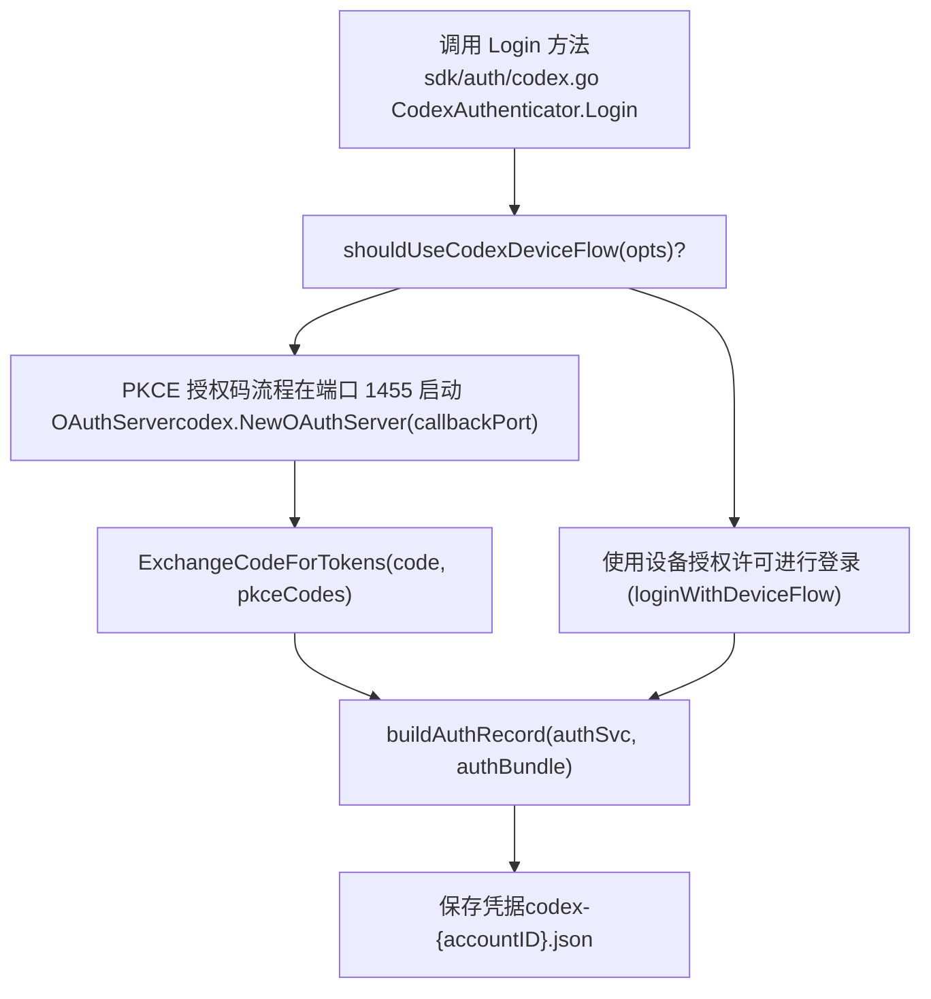
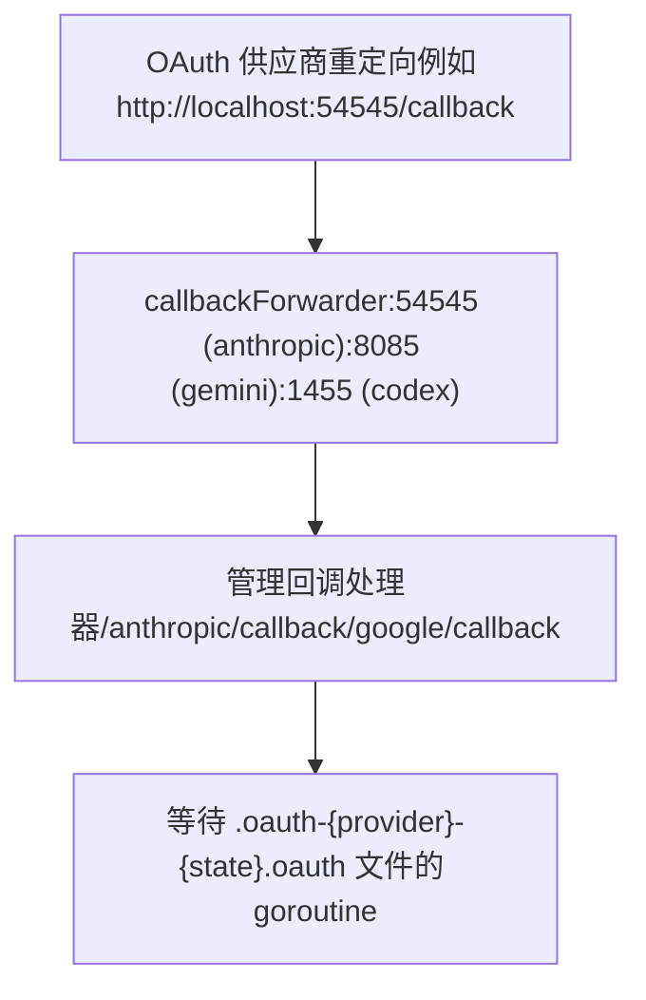

# 供应商特定 OAuth 设置

相关源文件

-   [README.md](https://github.com/router-for-me/CLIProxyAPI/blob/c66cb0af/README.md)
-   [README\_CN.md](https://github.com/router-for-me/CLIProxyAPI/blob/c66cb0af/README_CN.md)
-   [internal/api/handlers/management/auth\_files.go](https://github.com/router-for-me/CLIProxyAPI/blob/c66cb0af/internal/api/handlers/management/auth_files.go)
-   [internal/auth/antigravity/auth.go](https://github.com/router-for-me/CLIProxyAPI/blob/c66cb0af/internal/auth/antigravity/auth.go)
-   [internal/auth/claude/token.go](https://github.com/router-for-me/CLIProxyAPI/blob/c66cb0af/internal/auth/claude/token.go)
-   [internal/auth/codex/token.go](https://github.com/router-for-me/CLIProxyAPI/blob/c66cb0af/internal/auth/codex/token.go)
-   [internal/auth/gemini/gemini\_token.go](https://github.com/router-for-me/CLIProxyAPI/blob/c66cb0af/internal/auth/gemini/gemini_token.go)
-   [internal/auth/iflow/iflow\_token.go](https://github.com/router-for-me/CLIProxyAPI/blob/c66cb0af/internal/auth/iflow/iflow_token.go)
-   [internal/auth/kimi/token.go](https://github.com/router-for-me/CLIProxyAPI/blob/c66cb0af/internal/auth/kimi/token.go)
-   [internal/auth/qwen/qwen\_token.go](https://github.com/router-for-me/CLIProxyAPI/blob/c66cb0af/internal/auth/qwen/qwen_token.go)
-   [internal/cmd/anthropic\_login.go](https://github.com/router-for-me/CLIProxyAPI/blob/c66cb0af/internal/cmd/anthropic_login.go)
-   [internal/cmd/iflow\_login.go](https://github.com/router-for-me/CLIProxyAPI/blob/c66cb0af/internal/cmd/iflow_login.go)
-   [internal/cmd/login.go](https://github.com/router-for-me/CLIProxyAPI/blob/c66cb0af/internal/cmd/login.go)
-   [internal/cmd/openai\_login.go](https://github.com/router-for-me/CLIProxyAPI/blob/c66cb0af/internal/cmd/openai_login.go)
-   [internal/cmd/qwen\_login.go](https://github.com/router-for-me/CLIProxyAPI/blob/c66cb0af/internal/cmd/qwen_login.go)
-   [internal/cmd/run.go](https://github.com/router-for-me/CLIProxyAPI/blob/c66cb0af/internal/cmd/run.go)
-   [internal/misc/credentials.go](https://github.com/router-for-me/CLIProxyAPI/blob/c66cb0af/internal/misc/credentials.go)
-   [sdk/auth/antigravity.go](https://github.com/router-for-me/CLIProxyAPI/blob/c66cb0af/sdk/auth/antigravity.go)
-   [sdk/auth/claude.go](https://github.com/router-for-me/CLIProxyAPI/blob/c66cb0af/sdk/auth/claude.go)
-   [sdk/auth/codex.go](https://github.com/router-for-me/CLIProxyAPI/blob/c66cb0af/sdk/auth/codex.go)
-   [sdk/auth/iflow.go](https://github.com/router-for-me/CLIProxyAPI/blob/c66cb0af/sdk/auth/iflow.go)
-   [sdk/auth/qwen.go](https://github.com/router-for-me/CLIProxyAPI/blob/c66cb0af/sdk/auth/qwen.go)

本页面为每个受支持的供应商提供了完成 OAuth 身份验证的分步说明。它涵盖了 CLI 标志方法和管理 API 方法，描述了所使用的本地回调端口，解释了各供应商特定的步骤，并展示了生成的凭据文件名模式。

有关 OAuth 2.0 流程内部工作原理（PKCE、本地回调服务器、state 验证、令牌交换）的原理说明，请参阅 [OAuth 流程架构](/router-for-me/CLIProxyAPI/7.1-oauth-flow-architecture)页面。有关初始设置后 OAuth 令牌如何刷新的详情，请参阅[令牌刷新与生命周期](/router-for-me/CLIProxyAPI/7.4-token-refresh-and-lifecycle)。有关管理 API 的完整参考，请参阅[管理 API](/router-for-me/CLIProxyAPI/4.4-management-api)。

---

## 各供应商的流程类型

并非所有供应商都使用相同的 OAuth 机制。下表总结了每个供应商的流程类型、本地回调端口和凭据文件模式。

| 供应商 | 流程类型 | 本地回调端口 | 凭据文件模式 |
| --- | --- | --- | --- |
| Gemini / Vertex | 授权码 (Google OAuth2) | `8085` | `gemini-{email}-{projectID}.json` |
| Claude (Anthropic) | 授权码 + PKCE | `54545` | `claude-{email}.json` |
| Codex (OpenAI) | 授权码 + PKCE，或设备流 | `1455` | `codex-{accountID}.json` |
| Antigravity | 授权码 | `antigravity.CallbackPort` | `antigravity-{email}.json` |
| iFlow | 授权码 | `iflow.CallbackPort` | `iflow-{email}-{timestamp}.json` |
| Qwen | 设备流 | 不适用 (轮询) | `qwen-{email}.json` |
| Kimi | 设备流 | 不适用 (轮询) | `kimi-{...}.json` |

Claude、Gemini 和 Codex 的回调端口定义在 `internal/api/handlers/management/auth_files.go` 中的命名常量：

[internal/api/handlers/management/auth\_files.go44-53](https://github.com/router-for-me/CLIProxyAPI/blob/c66cb0af/internal/api/handlers/management/auth_files.go#L44-L53)

---

## 发起 OAuth：两条路径

每个供应商均可通过 **CLI 标志**（启动时直接在终端运行流程）或通过**管理 API**（从运行中的服务器实例触发流程）进行身份验证。管理 API 路径用于 Web UI 和远程管理客户端。

**供应商认证器类图** —— 展示了每条路径涉及的代码实体：

```mermaid
flowchart TD
    DL["DoLogininternal/cmd/login.go"]
    DCL["DoClaudeLogininternal/cmd/anthropic_login.go"]
    DCODEX["DoCodexLogininternal/cmd/openai_login.go"]
    DQL["DoQwenLogininternal/cmd/qwen_login.go"]
    DIL["DoIFlowLogininternal/cmd/iflow_login.go"]
    RAT["RequestAnthropicToken"]
    RGT["RequestGeminiCLIToken"]
    RCODEX["RequestCodexToken"]
    RANT["RequestAntigravityToken"]
    RQWEN["RequestQwenToken"]
    RIFLOW["RequestIFlowToken"]
    RKIMI["RequestKimiToken"]
    GA["GeminiAuthenticatorsdk/auth/gemini.go"]
    CA["ClaudeAuthenticatorsdk/auth/claude.go"]
    COXA["CodexAuthenticatorsdk/auth/codex.go"]
    AGA["AntigravityAuthenticatorsdk/auth/antigravity.go"]
    QA["QwenAuthenticatorsdk/auth/qwen.go"]
    IA["IFlowAuthenticatorsdk/auth/iflow.go"]

    DL --> GA
    DCL --> CA
    DCODEX --> COXA
    DQL --> QA
    DIL --> IA
    RAT --> CA
    RGT --> GA
    RCODEX --> COXA
    RANT --> AGA
    RQWEN --> QA
    RIFLOW --> IA
```


**来源：** [internal/cmd/login.go51-209](https://github.com/router-for-me/CLIProxyAPI/blob/c66cb0af/internal/cmd/login.go#L51-L209) [internal/cmd/anthropic\_login.go22-59](https://github.com/router-for-me/CLIProxyAPI/blob/c66cb0af/internal/cmd/anthropic_login.go#L22-L59) [internal/cmd/openai\_login.go36-72](https://github.com/router-for-me/CLIProxyAPI/blob/c66cb0af/internal/cmd/openai_login.go#L36-L72) [internal/cmd/qwen\_login.go20-60](https://github.com/router-for-me/CLIProxyAPI/blob/c66cb0af/internal/cmd/qwen_login.go#L20-L60) [internal/cmd/iflow\_login.go14-48](https://github.com/router-for-me/CLIProxyAPI/blob/c66cb0af/internal/cmd/iflow_login.go#L14-L48) [internal/api/handlers/management/auth\_files.go956-1099](https://github.com/router-for-me/CLIProxyAPI/blob/c66cb0af/internal/api/handlers/management/auth_files.go#L956-L1099)

---

## Gemini / Vertex AI

**流程：** 使用 Google OAuth2 端点的标准授权码流程。获取令牌后，必须选择或自动发现一个 GCP 项目，并为该项目入职 (onboard) Gemini Code Assist API。

**CLI：**

```
./cliproxyapi --login [--project_id <YOUR_PROJECT_ID>]
```
**管理 API：**

```
POST /v0/management/auth/gemini
```
可选传递 `?project_id=<id>` 和 `?is_webui=true`（后者在端口 `8085` 启动一个本地 HTTP 转发器，将 OAuth 回调重定向到正在运行的服务器）。

### Gemini 登录流程

**项目选择：**

-   如果省略 `--project_id`，CLI 会通过 `fetchGCPProjects` 获取您的 GCP 项目并进行交互式提示。
-   输入 `ALL` 以入职列表中显示的所有项目。
-   登录模式提示允许您在 **Code Assist** (手动选择 GCP 项目) 和 **Google One** (自动发现) 之间选择。

`internal/cmd/login.go` 中的 `performGeminiCLISetup` 调用 Gemini CLI 端点 (`https://cloudcode-pa.googleapis.com/v1internal`) 上的 `loadCodeAssist` 和 `onboardUser`。对于免费层级账号，如果后端返回的项目 ID 与请求的不同，系统会提示确认。

[internal/cmd/login.go211-390](https://github.com/router-for-me/CLIProxyAPI/blob/c66cb0af/internal/cmd/login.go#L211-L390)

**凭据文件：** `gemini-{email}-{projectID}.json` (多项目：`gemini-{email}-all.json`)

`internal/auth/gemini/gemini_token.go` 中的 `CredentialFileName` 控制此命名方式。

[internal/auth/gemini/gemini\_token.go93-104](https://github.com/router-for-me/CLIProxyAPI/blob/c66cb0af/internal/auth/gemini/gemini_token.go#L93-L104)

**来源：** [internal/cmd/login.go51-209](https://github.com/router-for-me/CLIProxyAPI/blob/c66cb0af/internal/cmd/login.go#L51-L209) [internal/api/handlers/management/auth\_files.go1101-1200](https://github.com/router-for-me/CLIProxyAPI/blob/c66cb0af/internal/api/handlers/management/auth_files.go#L1101-L1200)

---

## Claude (Anthropic)

**流程：** 授权码 + PKCE。本地 OAuth 服务器在端口 `54545` 启动。PKCE 代码由 `claude.GeneratePKCECodes()` 生成。

**CLI：**

```
./cliproxyapi --login_anthropic
```
**管理 API：**

```
POST /v0/management/auth/anthropic
```
传递 `?is_webui=true` 以在端口 `54545` 启动一个转发器，该转发器重定向到正在运行的服务器的 `/anthropic/callback`。

### Claude 登录流程

**注意：**

-   如果没有可用的浏览器，URL 将打印到 stdout，并通过 `util.PrintSSHTunnelInstructions` 显示 SSH 隧道说明。
-   如果设置了 `opts.Prompt`，在 15 秒后会提示用户手动粘贴回调 URL。
-   验证回调 URL 的 `state` 参数以防止 CSRF。
-   如果交换过程在 `authBundle.APIKey` 中返回了 API 密钥，该密钥将存储在凭据文件中。

[sdk/auth/claude.go38-214](https://github.com/router-for-me/CLIProxyAPI/blob/c66cb0af/sdk/auth/claude.go#L38-L214)

**凭据文件：** `claude-{email}.json`

**来源：** [internal/cmd/anthropic\_login.go22-59](https://github.com/router-for-me/CLIProxyAPI/blob/c66cb0af/internal/cmd/anthropic_login.go#L22-L59) [sdk/auth/claude.go38-214](https://github.com/router-for-me/CLIProxyAPI/blob/c66cb0af/sdk/auth/claude.go#L38-L214) [internal/api/handlers/management/auth\_files.go956-1099](https://github.com/router-for-me/CLIProxyAPI/blob/c66cb0af/internal/api/handlers/management/auth_files.go#L956-L1099)

---

## Codex (OpenAI)

**流程：** 默认使用授权码 + PKCE。当 `shouldUseCodexDeviceFlow(opts)` 返回 true 时，也支持设备流。本地回调服务器在端口 `1455` 启动。

**CLI：**

```
./cliproxyapi --login_codex [--device_flow]
```
**管理 API：**

```
POST /v0/management/auth/codex
```
### Codex 流程选择


**注意：**

-   与 Claude 类似，Codex PKCE 流程使用 `codex.GeneratePKCECodes()` 和本地的 `codex.NewOAuthServer(callbackPort)`。
-   凭据中的 `id_token` 包含 JWT 声明，包括 `chatgpt_account_id` 和订阅信息，这些信息由 `auth_files.go` 中的 `extractCodexIDTokenClaims` 提取。
-   Codex 令牌的 `RefreshLead` 为 5 天，比其他供应商更长。

[sdk/auth/codex.go38-192](https://github.com/router-for-me/CLIProxyAPI/blob/c66cb0af/sdk/auth/codex.go#L38-L192)

**凭据文件：** 根据从令牌束中提取的账号信息命名。

**来源：** [internal/cmd/openai\_login.go36-72](https://github.com/router-for-me/CLIProxyAPI/blob/c66cb0af/internal/cmd/openai_login.go#L36-L72) [sdk/auth/codex.go38-192](https://github.com/router-for-me/CLIProxyAPI/blob/c66cb0af/sdk/auth/codex.go#L38-L192) [internal/auth/codex/token.go1-82](https://github.com/router-for-me/CLIProxyAPI/blob/c66cb0af/internal/auth/codex/token.go#L1-L82)

---

## Antigravity

**流程：** 标准授权码流程。本地回调服务器在 `/oauth-callback` 进行监听。令牌交换后，自动获取用户信息 (`FetchUserInfo`) 和 GCP 项目 ID (`FetchProjectID`)。

**CLI：**

```
./cliproxyapi --login_antigravity
```
**管理 API：**

```
POST /v0/management/auth/antigravity
```
### Antigravity 身份验证后步骤

授权码交换后，`sdk/auth/antigravity.go` 中的 `AntigravityAuthenticator.Login` 会执行两个额外调用：

1.  `authSvc.FetchUserInfo(ctx, accessToken)` —— 从 Google 的 userinfo 端点检索用户邮箱。
2.  `authSvc.FetchProjectID(ctx, accessToken)` —— 调用 Antigravity API 端点上的 `loadCodeAssist`。如果未返回项目，则回退到 `OnboardUser` 轮询。

[sdk/auth/antigravity.go160-213](https://github.com/router-for-me/CLIProxyAPI/blob/c66cb0af/sdk/auth/antigravity.go#L160-L213)

**凭据文件：** `antigravity-{email}.json` (通过 `antigravity.CredentialFileName(email)`)

**来源：** [sdk/auth/antigravity.go1-265](https://github.com/router-for-me/CLIProxyAPI/blob/c66cb0af/sdk/auth/antigravity.go#L1-L265) [internal/auth/antigravity/auth.go1-344](https://github.com/router-for-me/CLIProxyAPI/blob/c66cb0af/internal/auth/antigravity/auth.go#L1-L344)

---

## iFlow

**流程：** 使用本地 OAuth 服务器的授权码流程。回调服务器由 `iflow.NewOAuthServer(callbackPort)` 管理。

**CLI：**

```
./cliproxyapi --login_iflow
```
**管理 API：**

```
POST /v0/management/auth/iflow
```
在通过 `authSvc.ExchangeCodeForTokens` 完成令牌交换后，`authSvc.CreateTokenStorage` 会构建一个 `IFlowTokenStorage`，其中包含 `access_token` 和派生的 `api_key` 字段。

[sdk/auth/iflow.go33-190](https://github.com/router-for-me/CLIProxyAPI/blob/c66cb0af/sdk/auth/iflow.go#L33-L190)

**凭据文件：** `iflow-{email}-{unix_timestamp}.json`

文件名中的时间戳允许同时存在多个 iFlow 账号而不会发生冲突。

**来源：** [internal/cmd/iflow\_login.go14-48](https://github.com/router-for-me/CLIProxyAPI/blob/c66cb0af/internal/cmd/iflow_login.go#L14-L48) [sdk/auth/iflow.go33-190](https://github.com/router-for-me/CLIProxyAPI/blob/c66cb0af/sdk/auth/iflow.go#L33-L190) [internal/auth/iflow/iflow\_token.go1-59](https://github.com/router-for-me/CLIProxyAPI/blob/c66cb0af/internal/auth/iflow/iflow_token.go#L1-L59)

---

## Qwen

**流程：** OAuth 2.0 设备授权许可 (Device Authorization Grant)。没有本地回调服务器。相反，用户访问终端显示的 URL，应用程序通过轮询确认令牌完成。

**CLI：**

```
./cliproxyapi --login_qwen
```
**管理 API：**

```
POST /v0/management/auth/qwen
```
### Qwen 设备流

**重要：** Qwen 认证器需要邮箱地址或别名来命名凭据文件。如果未设置 `opts.Metadata["email"]`，`opts.Prompt` 将被调用以询问用户。如果两者均不可用，则返回 `EmailRequiredError`。

[sdk/auth/qwen.go33-113](https://github.com/router-for-me/CLIProxyAPI/blob/c66cb0af/sdk/auth/qwen.go#L33-L113)

**凭据文件：** `qwen-{email}.json`

**来源：** [internal/cmd/qwen\_login.go20-60](https://github.com/router-for-me/CLIProxyAPI/blob/c66cb0af/internal/cmd/qwen_login.go#L20-L60) [sdk/auth/qwen.go33-113](https://github.com/router-for-me/CLIProxyAPI/blob/c66cb0af/sdk/auth/qwen.go#L33-L113) [internal/auth/qwen/qwen\_token.go1-79](https://github.com/router-for-me/CLIProxyAPI/blob/c66cb0af/internal/auth/qwen/qwen_token.go#L1-L79)

---

## Kimi

**流程：** 类似于 Qwen，采用 OAuth 2.0 设备授权许可。没有本地回调服务器。

**管理 API：**

```
POST /v0/management/auth/kimi
```
`internal/auth/kimi/token.go` 中的 `KimiTokenStorage` 结构体除了标准 OAuth 字段外，还存储了设备 ID。`DeviceID` 字段包含在凭据 JSON 中，并用于后续的 API 请求。

**凭据文件：** `kimi-{...}.json`

[internal/auth/kimi/token.go1-132](https://github.com/router-for-me/CLIProxyAPI/blob/c66cb0af/internal/auth/kimi/token.go#L1-L132)

**来源：** [internal/auth/kimi/token.go1-132](https://github.com/router-for-me/CLIProxyAPI/blob/c66cb0af/internal/auth/kimi/token.go#L1-L132) [internal/api/handlers/management/auth\_files.go26-40](https://github.com/router-for-me/CLIProxyAPI/blob/c66cb0af/internal/api/handlers/management/auth_files.go#L26-L40)

---

## 凭据文件格式

所有凭据文件均为存储在 `config.yaml` 配置的 `auth_dir` 中的 JSON 文件。每个文件都有一个 `"type"` 字段来标识供应商。认证管理器在启动时加载这些文件，并使用 `type` 字段将其路由到正确的执行器。

| 字段 | 描述 |
| --- | --- |
| `type` | 供应商标识符 (`gemini`, `claude`, `codex`, `antigravity`, `qwen`, `iflow`, `kimi`) |
| `access_token` | 当前的 OAuth 访问令牌 |
| `refresh_token` | 用于静默续期的令牌 |
| `expired` | 访问令牌过期的 RFC3339 或 Unix 时间戳 |
| `email` | 账号标识符（大多数供应商适用） |
| `project_id` | GCP 项目 (仅限 Gemini, Antigravity) |
| `id_token` | JWT 身份令牌 (仅限 Codex, Claude) |

每个 `*TokenStorage` 结构体（`GeminiTokenStorage`, `ClaudeTokenStorage`, `CodexTokenStorage` 等）上的 `SaveTokenToFile` 方法都会序列化这些字段以及通过 `misc.MergeMetadata` 注入的任何元数据。

[internal/misc/credentials.go30-61](https://github.com/router-for-me/CLIProxyAPI/blob/c66cb0af/internal/misc/credentials.go#L30-L61)

---

## Web UI / 远程 OAuth (`is_webui` 模式)

当从无法直接拦截 OAuth 重定向的 Web UI 调用管理 API 时，请传递 `?is_webui=true`。服务器会启动一个 `callbackForwarder` —— 这是一个在供应商预期的回调端口上的临时 HTTP 服务器 —— 它将传入的 OAuth 回调重定向到运行中的代理服务器自身的 `/anthropic/callback` 或 `/google/callback` 路由。

`auth_files.go` 中的 `startCallbackForwarder` 和 `stopCallbackForwarder` 函数管理该生命周期。

[internal/api/handlers/management/auth\_files.go132-234](https://github.com/router-for-me/CLIProxyAPI/blob/c66cb0af/internal/api/handlers/management/auth_files.go#L132-L234)


**来源：** [internal/api/handlers/management/auth\_files.go132-234](https://github.com/router-for-me/CLIProxyAPI/blob/c66cb0af/internal/api/handlers/management/auth_files.go#L132-L234) [internal/api/handlers/management/auth\_files.go990-1100](https://github.com/router-for-me/CLIProxyAPI/blob/c66cb0af/internal/api/handlers/management/auth_files.go#L990-L1100)
