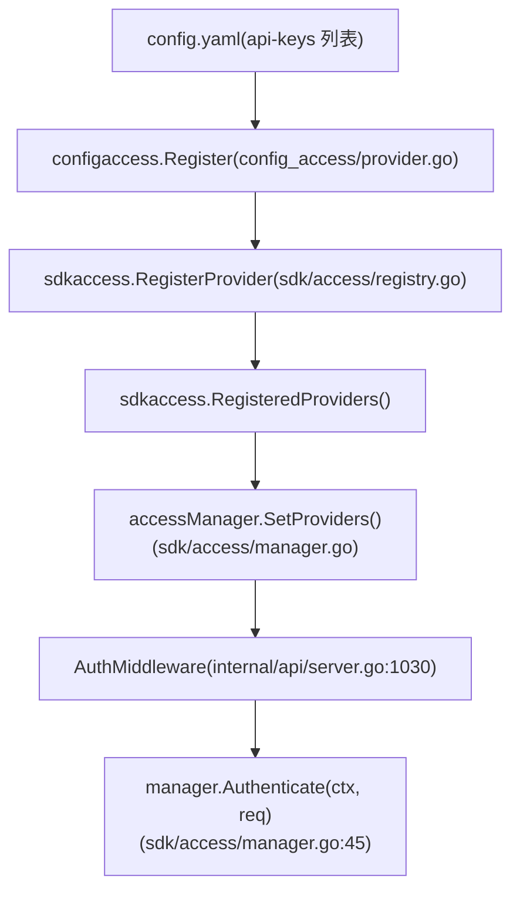
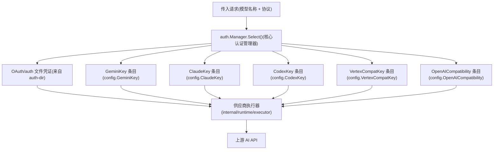
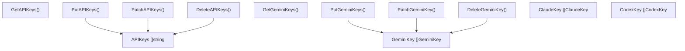

# API 密钥与服务账号管理

相关源文件

-   [config.example.yaml](https://github.com/router-for-me/CLIProxyAPI/blob/c66cb0af/config.example.yaml)
-   [docs/sdk-access.md](https://github.com/router-for-me/CLIProxyAPI/blob/c66cb0af/docs/sdk-access.md)
-   [docs/sdk-access\_CN.md](https://github.com/router-for-me/CLIProxyAPI/blob/c66cb0af/docs/sdk-access_CN.md)
-   [internal/access/config\_access/provider.go](https://github.com/router-for-me/CLIProxyAPI/blob/c66cb0af/internal/access/config_access/provider.go)
-   [internal/access/reconcile.go](https://github.com/router-for-me/CLIProxyAPI/blob/c66cb0af/internal/access/reconcile.go)
-   [internal/api/handlers/management/config\_basic.go](https://github.com/router-for-me/CLIProxyAPI/blob/c66cb0af/internal/api/handlers/management/config_basic.go)
-   [internal/api/handlers/management/config\_lists.go](https://github.com/router-for-me/CLIProxyAPI/blob/c66cb0af/internal/api/handlers/management/config_lists.go)
-   [internal/api/server.go](https://github.com/router-for-me/CLIProxyAPI/blob/c66cb0af/internal/api/server.go)
-   [internal/config/config.go](https://github.com/router-for-me/CLIProxyAPI/blob/c66cb0af/internal/config/config.go)
-   [internal/watcher/watcher.go](https://github.com/router-for-me/CLIProxyAPI/blob/c66cb0af/internal/watcher/watcher.go)
-   [sdk/access/errors.go](https://github.com/router-for-me/CLIProxyAPI/blob/c66cb0af/sdk/access/errors.go)
-   [sdk/access/manager.go](https://github.com/router-for-me/CLIProxyAPI/blob/c66cb0af/sdk/access/manager.go)
-   [sdk/access/registry.go](https://github.com/router-for-me/CLIProxyAPI/blob/c66cb0af/sdk/access/registry.go)
-   [sdk/cliproxy/builder.go](https://github.com/router-for-me/CLIProxyAPI/blob/c66cb0af/sdk/cliproxy/builder.go)
-   [sdk/cliproxy/service.go](https://github.com/router-for-me/CLIProxyAPI/blob/c66cb0af/sdk/cliproxy/service.go)
-   [sdk/config/config.go](https://github.com/router-for-me/CLIProxyAPI/blob/c66cb0af/sdk/config/config.go)
-   [test/amp\_management\_test.go](https://github.com/router-for-me/CLIProxyAPI/blob/c66cb0af/test/amp_management_test.go)

本页面涵盖了两个均使用“密钥 (key)”一词但关注点不同的领域：

1.  **入站访问控制** —— `config.yaml` 中的 `api-keys` 列表，用于验证从客户端（例如 AI CLI 工具）到达 CLIProxyAPI 的请求。
2.  **供应商凭证** —— CLIProxyAPI 在向上游 AI 供应商转发请求时使用的 `gemini-api-key`、`claude-api-key`、`codex-api-key`、`openai-compatibility` 和 `vertex-api-key` 条目。

有关基于 OAuth 的供应商凭证和令牌刷新，请参阅页面 [7.2](/router-for-me/CLIProxyAPI/7.2-provider-specific-oauth-setup) 和 [7.4](/router-for-me/CLIProxyAPI/7.4-token-refresh-and-lifecycle)。有关更广泛的身份验证管理器和凭据路由/故障转移，请参阅页面 [3.3](/router-for-me/CLIProxyAPI/3.3-authentication-and-credential-management) 和 [8.1](/router-for-me/CLIProxyAPI/8.1-credential-routing-and-failover)。

---

## 入站请求身份验证

CLIProxyAPI 可以要求其接收到的每个 API 调用都包含 `config.yaml` 中 `api-keys` 列表下的其中一个密钥。如果未配置任何密钥，服务器允许所有请求通过（开放访问）。

### 配置

```
api-keys:  - "your-api-key-1"  - "your-api-key-2"
```
这些值定义在 [internal/config/config.go](https://github.com/router-for-me/CLIProxyAPI/blob/c66cb0af/internal/config/config.go) 内部的 `SDKConfig`（`APIKeys []string` 字段）中，并在启动时通过 `LoadConfig` 加载。

### `config-api-key` 访问供应商

入站请求身份验证系统围绕 `sdk/access` 包构建。配置文件密钥的具体实现位于 [internal/access/config\_access/provider.go](https://github.com/router-for-me/CLIProxyAPI/blob/c66cb0af/internal/access/config_access/provider.go)

**检查的凭据位置 (按顺序)：**

| 来源 | 标头 / 参数 |
| --- | --- |
| `authorization` | `Authorization: Bearer <key>` |
| `x-goog-api-key` | `X-Goog-Api-Key: <key>` |
| `x-api-key` | `X-Api-Key: <key>` |
| `query-key` | `?key=<key>` |
| `query-auth-token` | `?auth_token=<key>` |

`provider` 结构体 [internal/access/config\_access/provider.go31-35](https://github.com/router-for-me/CLIProxyAPI/blob/c66cb0af/internal/access/config_access/provider.go#L31-L35) 将允许的密钥存储在 `map[string]struct{}` 中以实现 O(1) 查找。`Authenticate` 方法 [internal/access/config\_access/provider.go55-104](https://github.com/router-for-me/CLIProxyAPI/blob/c66cb0af/internal/access/config_access/provider.go#L55-L104) 检查每个凭据位置并返回：

-   成功时，返回带有 `Principal`（即匹配的密钥字符串）的 `Result`。
-   如果提供了凭据但未在集合中找到，返回 `NewInvalidCredentialError()`。
-   如果根本没有提供凭据，返回 `NewNoCredentialsError()`。

`Register` 函数 [internal/access/config\_access/provider.go13-29](https://github.com/router-for-me/CLIProxyAPI/blob/c66cb0af/internal/access/config_access/provider.go#L13-L29) 在启动时和每次配置重载时被调用。如果 `APIKeys` 为空，供应商将取消注册，使服务器处于未授权状态。

### 访问管理器与中间件

**访问管理器初始化：**

> 访问管理器流程


**来源：** [internal/access/config\_access/provider.go](https://github.com/router-for-me/CLIProxyAPI/blob/c66cb0af/internal/access/config_access/provider.go) [sdk/access/registry.go](https://github.com/router-for-me/CLIProxyAPI/blob/c66cb0af/sdk/access/registry.go) [sdk/access/manager.go](https://github.com/router-for-me/CLIProxyAPI/blob/c66cb0af/sdk/access/manager.go) [internal/api/server.go1030-1050](https://github.com/router-for-me/CLIProxyAPI/blob/c66cb0af/internal/api/server.go#L1030-L1050)

`AuthMiddleware` 函数 [internal/api/server.go1030-1050](https://github.com/router-for-me/CLIProxyAPI/blob/c66cb0af/internal/api/server.go#L1030-L1050) 作为 Gin 中间件应用于 `/v1` 和 `/v1beta` 路由组。如果 `manager` 为 `nil` 或没有供应商，则每个请求都会通过。如果 `manager.Authenticate` 返回错误，中间件将中止并返回 HTTP 401。

成功时，中间件会设置两个 Gin 上下文值：

-   `"apiKey"` → `result.Principal` (匹配的密钥字符串)
-   `"accessProvider"` → `result.Provider`

下游处理器可以使用这些值进行日志记录和使用归因。

### 热重载行为

当 `config.yaml` 更改时，`applyAccessConfig` [internal/api/server.go864-871](https://github.com/router-for-me/CLIProxyAPI/blob/c66cb0af/internal/api/server.go#L864-L871) 会调用 `access.ApplyAccessProviders` [internal/access/reconcile.go82-105](https://github.com/router-for-me/CLIProxyAPI/blob/c66cb0af/internal/access/reconcile.go#L82-L105)，后者会使用新配置调用 `configaccess.Register` 并更新 `accessManager.SetProviders`。这一切都在不重启服务器的情况下发生 —— 完整的热重载机制请参阅 [3.7](/router-for-me/CLIProxyAPI/3.7-hot-reload-and-configuration-updates)。

---

## 供应商 API 密钥

这些是 CLIProxyAPI 用于向其上游 AI API 验证自身请求的凭据。每种供应商类型都有其自身的配置结构。

### 密钥类型摘要

| 配置键 | Go 类型 | 供应商 |
| --- | --- | --- |
| `gemini-api-key` | `config.GeminiKey` | Google Gemini REST API |
| `claude-api-key` | `config.ClaudeKey` | Anthropic Claude API |
| `codex-api-key` | `config.CodexKey` | OpenAI Codex/Responses API |
| `openai-compatibility[].api-key-entries` | `config.OpenAICompatibilityAPIKey` | 任何兼容 OpenAI 的端点 |
| `vertex-api-key` | `config.VertexCompatKey` | 带有 `x-goog-api-key` 的 Vertex AI 风格 API |

**来源：** [internal/config/config.go85-103](https://github.com/router-for-me/CLIProxyAPI/blob/c66cb0af/internal/config/config.go#L85-L103)

### 通用字段

所有密钥类型共用一组可选的路由字段：

| 字段 | 用途 |
| --- | --- |
| `api-key` | 发送到上游供应商的凭证字符串 |
| `base-url` | 覆盖默认的 API 端点 |
| `proxy-url` | 逐个密钥的 HTTP/SOCKS5 代理覆盖 |
| `prefix` | 命名空间前缀；客户端必须发送 `prefix/model-name` 才能使用此密钥 |
| `priority` | 值越高 = 当多个凭据匹配时越优先 |
| `models` | 此凭据的可选模型到别名映射 |
| `headers` | 注入到使用此密钥的每个请求中的额外 HTTP 标头 |
| `excluded-models` | 此凭据排除的模型（精确匹配、通配符前缀/后缀/子串） |

### Gemini API 密钥

由 `config.GeminiKey` 定义 [internal/config/config.go408-433](https://github.com/router-for-me/CLIProxyAPI/blob/c66cb0af/internal/config/config.go#L408-L433)

```
gemini-api-key:  - api-key: "AIzaSy..."    base-url: "https://generativelanguage.googleapis.com"    models:      - name: "gemini-2.5-flash"        alias: "gemini-flash"    excluded-models:      - "gemini-2.5-pro"      - "*-preview"
```
`SanitizeGeminiKeys` [internal/config/config.go](https://github.com/router-for-me/CLIProxyAPI/blob/c66cb0af/internal/config/config.go) 在加载时和管理 API 更新后被调用，以规范化密钥条目。

### Claude API 密钥

由 `config.ClaudeKey` 定义 [internal/config/config.go312-341](https://github.com/router-for-me/CLIProxyAPI/blob/c66cb0af/internal/config/config.go#L312-L341)

除了通用字段外，`ClaudeKey` 还支持：

-   `cloak` —— 一个 `CloakConfig` 块，用于将请求伪装成来自 Claude Code CLI。这有助于规避某些供应商的限制。

```
claude-api-key:  - api-key: "sk-ant-..."    cloak:      mode: "auto"          # auto | always | never      strict-mode: false
```
### Codex API 密钥

由 `config.CodexKey` 定义 [internal/config/config.go360-389](https://github.com/router-for-me/CLIProxyAPI/blob/c66cb0af/internal/config/config.go#L360-L389)

额外字段：

-   `websockets: true` —— 为此凭据启用 Responses API 的 WebSocket 传输。

### 兼容 OpenAI 的供应商密钥

由 `config.OpenAICompatibility` [internal/config/config.go452-474](https://github.com/router-for-me/CLIProxyAPI/blob/c66cb0af/internal/config/config.go#L452-L474) 和 `config.OpenAICompatibilityAPIKey` [internal/config/config.go477-483](https://github.com/router-for-me/CLIProxyAPI/blob/c66cb0af/internal/config/config.go#L477-L483) 定义。

在单个供应商块（具有 `name`、`base-url` 和 `models`）内，可以在 `api-key-entries` 下列出多个 API 密钥。每个条目可以独立覆盖 `proxy-url`。

```
openai-compatibility:  - name: "openrouter"    base-url: "https://openrouter.ai/api/v1"    api-key-entries:      - api-key: "sk-or-v1-...a"      - api-key: "sk-or-v1-...b"        proxy-url: "socks5://proxy.example.com:1080"    models:      - name: "moonshotai/kimi-k2:free"        alias: "kimi-k2"
```
### Vertex 兼容的 API 密钥

由 `config.VertexCompatKey` [internal/config/config.go](https://github.com/router-for-me/CLIProxyAPI/blob/c66cb0af/internal/config/config.go) 在 `vertex-api-key` 下定义。这些密钥用于使用 Vertex AI 风格请求路径但使用简单 API 密钥身份验证（`x-goog-api-key` 标头）的第三方服务。`base-url` 是必填项。

---

## Google Vertex AI 服务账号密钥

对于真正的 Google Vertex AI，CLIProxyAPI 支持通过管理 API 端点 `POST /v0/management/vertex/import` 导入服务账号密钥文件 (JSON)。这与 `vertex-api-key` 配置条目不同，后者针对的是第三方 Vertex 兼容 API。

导入的服务账号凭据存储在 `auth-dir` 目录中的 auth 文件内，并与 OAuth 令牌文件以相同方式管理。有关 Vertex AI 供应商的详细信息，请参阅页面 [6.1](/router-for-me/CLIProxyAPI/6.1-google-gemini-and-vertex-ai)。

---

## 密钥生命周期与凭据路由

**CLIProxyAPI 如何将请求映射到供应商密钥：**

> 请求到密钥的解析


**来源：** [sdk/cliproxy/service.go362-428](https://github.com/router-for-me/CLIProxyAPI/blob/c66cb0af/sdk/cliproxy/service.go#L362-L428) [internal/config/config.go85-103](https://github.com/router-for-me/CLIProxyAPI/blob/c66cb0af/internal/config/config.go#L85-L103)

同一供应商类型的多个密钥参与轮询（round-robin）或优先填满（fill-first）选择。具有较高 `priority` 的密钥会被优先使用。处于冷却状态（在上游发生错误后）的密钥会被跳过，直到其冷却期结束。完整的凭据路由和故障转移文档请参阅页面 [8.1](/router-for-me/CLIProxyAPI/8.1-credential-routing-and-failover)。

每次配置更新时，`UpdateClients` [internal/api/server.go879-1016](https://github.com/router-for-me/CLIProxyAPI/blob/c66cb0af/internal/api/server.go#L879-L1016) 都会记录活动凭据的总数：

```
server clients and configuration updated: N clients (M auth entries + P Gemini API keys + Q Claude API keys + ...)
```
---

## 通过管理 API 管理密钥

所有供应商密钥列表都可以在运行时通过管理 API 进行读写（需要配置 `remote-management.secret-key` 或 `MANAGEMENT_PASSWORD` 环境变量）。

**按供应商划分的管理端点：**

| 供应商 | 端点 |
| --- | --- |
| 入站 `api-keys` | `GET/PUT/PATCH/DELETE /v0/management/api-keys` |
| Gemini | `GET/PUT/PATCH/DELETE /v0/management/gemini-api-key` |
| Claude | `GET/PUT/PATCH/DELETE /v0/management/claude-api-key` |
| Codex | `GET/PUT/PATCH/DELETE /v0/management/codex-api-key` |
| OpenAI-兼容 | `GET/PUT/PATCH/DELETE /v0/management/openai-compatibility` |
| Vertex-兼容 | `GET/PUT/PATCH/DELETE /v0/management/vertex-api-key` |

**来源：** [internal/api/server.go534-613](https://github.com/router-for-me/CLIProxyAPI/blob/c66cb0af/internal/api/server.go#L534-L613) [internal/api/handlers/management/config\_lists.go](https://github.com/router-for-me/CLIProxyAPI/blob/c66cb0af/internal/api/handlers/management/config_lists.go)

每个端点族均支持：

-   `GET` —— 以 JSON 格式返回当前列表。
-   `PUT` —— 替换整个列表。正文必须是 JSON 数组或 `{"items": [...]}`。
-   `PATCH` —— 更新由 `index` 或 `match`（密钥值或名称）标识的单个条目。
-   `DELETE` —— 通过 `index` 查询参数或匹配的值（`api-key`、`name` 等）移除一个条目。

**PATCH 正文格式（以 Gemini 为例）：**

```
{  "index": 0,  "value": {    "api-key": "AIzaSy...",    "base-url": "https://generativelanguage.googleapis.com",    "excluded-models": ["gemini-2.5-pro"]  }}
```
在每次写入后，处理器都会调用 `h.persist(c)`，该函数将更新后的配置写回磁盘上的 `config.yaml`，并保留注释。正在运行的服务器通过内存中的配置对象立即获取更改；文件观察器 ([3.7](/router-for-me/CLIProxyAPI/3.7-hot-reload-and-configuration-updates)) 为观察同一文件的任何其他进程获取更改。

**处理器实现：**

> 管理 API 密钥 CRUD


**来源：** [internal/api/handlers/management/config\_lists.go107-242](https://github.com/router-for-me/CLIProxyAPI/blob/c66cb0af/internal/api/handlers/management/config_lists.go#L107-L242)

---

## 密钥前缀与模型命名空间

每种供应商密钥类型（Gemini, Claude, Codex, OpenAI-兼容, Vertex-兼容）都支持可选的 `prefix` 字段。设置该字段后，对该凭据下模型的请求必须包含 `prefix/model-name`。全局配置选项 `force-model-prefix: true` 扩展了这一强制约束：启用后，无前缀的模型请求仅匹配没有前缀的凭据。

使用 `prefix: "team-a"` 的示例：

```
gemini-api-key:  - api-key: "AIzaSy..."    prefix: "team-a"    models:      - name: "gemini-2.5-pro"        alias: "pro"
```
发送 `model: "team-a/pro"` 的客户端将被路由到此密钥。发送 `model: "pro"` 的客户端将不会（在 `force-model-prefix` 为 true 时）。

**来源：** [internal/config/config.go416-418](https://github.com/router-for-me/CLIProxyAPI/blob/c66cb0af/internal/config/config.go#L416-L418) [config.example.yaml68-69](https://github.com/router-for-me/CLIProxyAPI/blob/c66cb0af/config.example.yaml#L68-L69)
