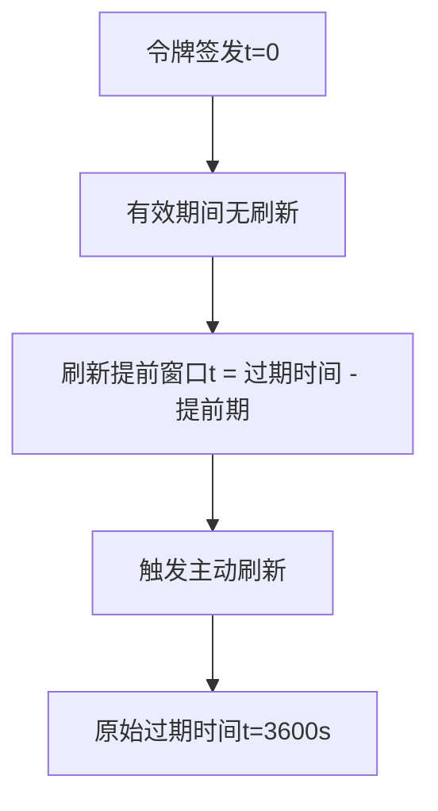
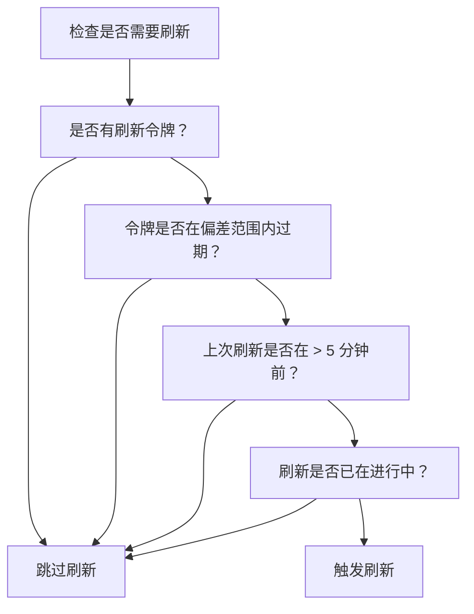
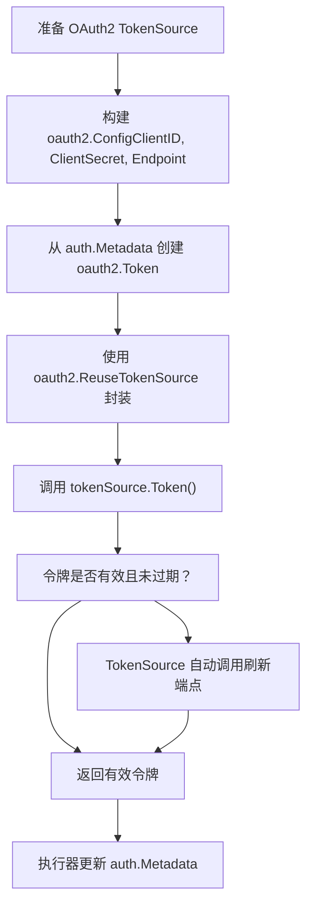
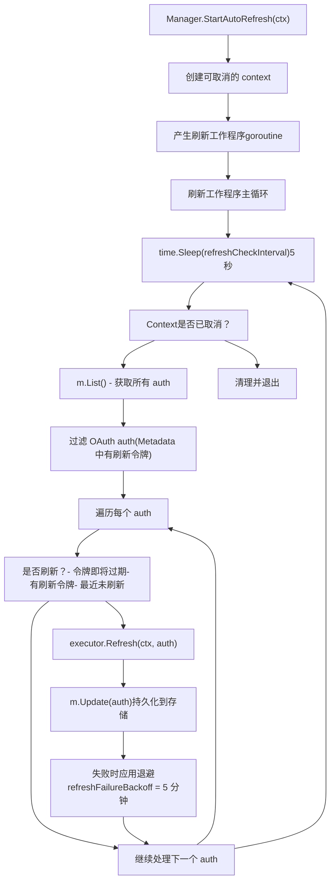
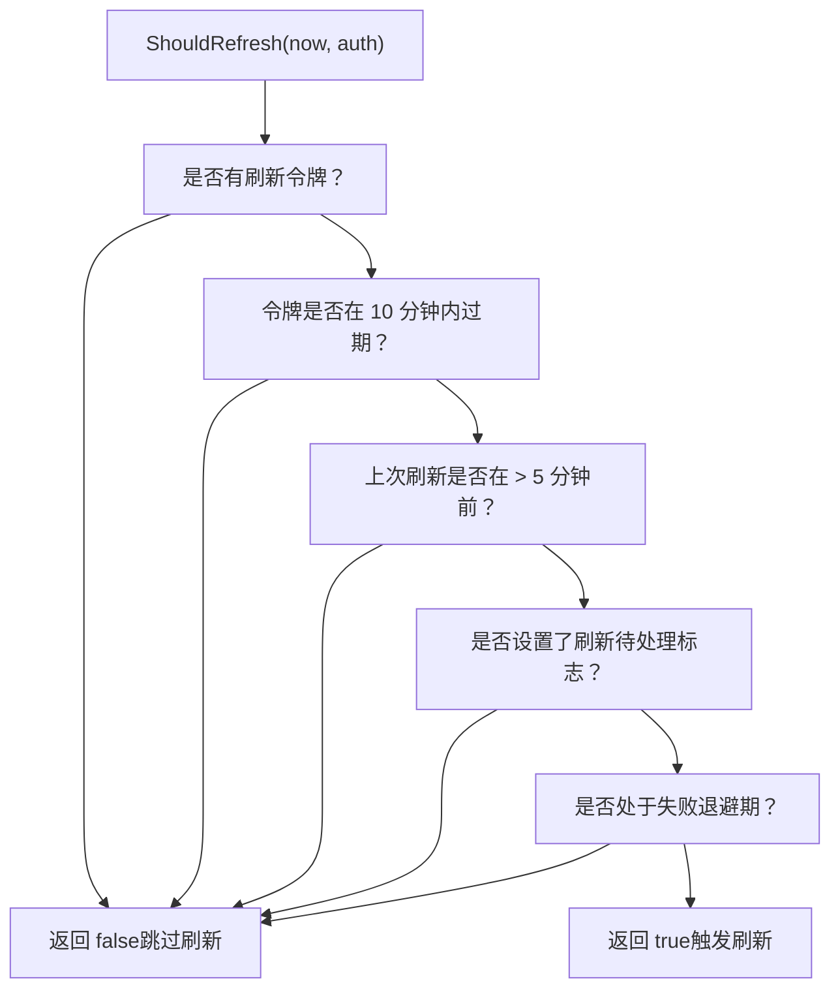
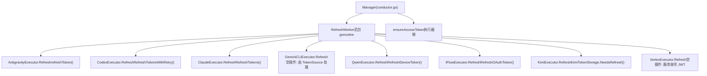
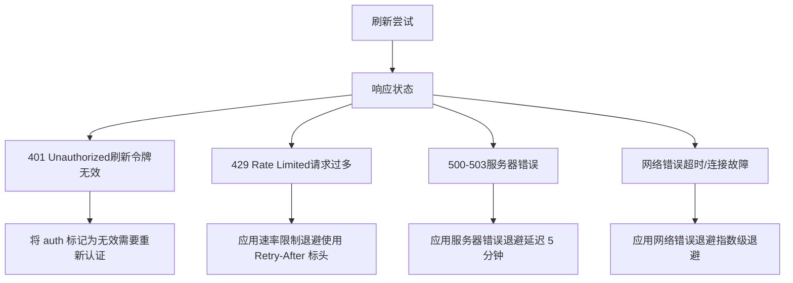
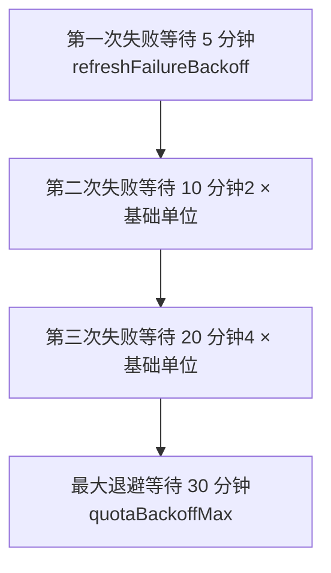
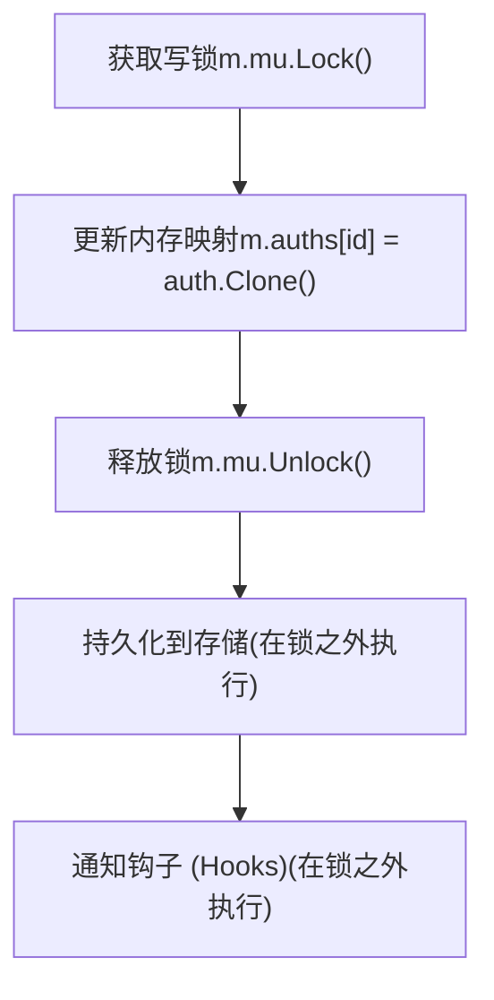

# 令牌刷新与生命周期

相关源文件

-   [internal/auth/claude/token.go](https://github.com/router-for-me/CLIProxyAPI/blob/c66cb0af/internal/auth/claude/token.go)
-   [internal/auth/codex/token.go](https://github.com/router-for-me/CLIProxyAPI/blob/c66cb0af/internal/auth/codex/token.go)
-   [internal/auth/gemini/gemini\_token.go](https://github.com/router-for-me/CLIProxyAPI/blob/c66cb0af/internal/auth/gemini/gemini_token.go)
-   [internal/auth/iflow/iflow\_token.go](https://github.com/router-for-me/CLIProxyAPI/blob/c66cb0af/internal/auth/iflow/iflow_token.go)
-   [internal/auth/kimi/token.go](https://github.com/router-for-me/CLIProxyAPI/blob/c66cb0af/internal/auth/kimi/token.go)
-   [internal/auth/qwen/qwen\_token.go](https://github.com/router-for-me/CLIProxyAPI/blob/c66cb0af/internal/auth/qwen/qwen_token.go)
-   [internal/misc/credentials.go](https://github.com/router-for-me/CLIProxyAPI/blob/c66cb0af/internal/misc/credentials.go)
-   [internal/watcher/config\_reload.go](https://github.com/router-for-me/CLIProxyAPI/blob/c66cb0af/internal/watcher/config_reload.go)
-   [sdk/cliproxy/auth/conductor.go](https://github.com/router-for-me/CLIProxyAPI/blob/c66cb0af/sdk/cliproxy/auth/conductor.go)
-   [sdk/cliproxy/auth/selector.go](https://github.com/router-for-me/CLIProxyAPI/blob/c66cb0af/sdk/cliproxy/auth/selector.go)
-   [sdk/cliproxy/auth/selector\_test.go](https://github.com/router-for-me/CLIProxyAPI/blob/c66cb0af/sdk/cliproxy/auth/selector_test.go)
-   [sdk/cliproxy/auth/types.go](https://github.com/router-for-me/CLIProxyAPI/blob/c66cb0af/sdk/cliproxy/auth/types.go)
-   [sdk/cliproxy/auth/types\_test.go](https://github.com/router-for-me/CLIProxyAPI/blob/c66cb0af/sdk/cliproxy/auth/types_test.go)

本文档解释了 CLIProxyAPI 如何管理 OAuth 访问令牌的生命周期，包括自动刷新、过期检测和各供应商特定的刷新机制。有关初始 OAuth 身份验证流程的信息，请参阅 [OAuth 流程架构](/router-for-me/CLIProxyAPI/7.1-oauth-flow-architecture)。有关凭据存储后端的详情，请参阅[API 密钥与服务账号管理](/router-for-me/CLIProxyAPI/7.3-api-key-and-service-account-management)。

## 概览

CLIProxyAPI 在不同的 AI 服务供应商之间支持多种身份验证凭证类型：

-   **OAuth 访问令牌 (OAuth Access Tokens)**：短期令牌（通常为 1 小时），需要使用刷新令牌（refresh tokens）定期刷新。
-   **API 密钥 (API Keys)**：永不过期的静态凭证（例如 Gemini API 密钥、Claude API 密钥）。
-   **服务账号密钥 (Service Account Keys)**：用于 Google Cloud 服务的长期凭证，使用基于 JWT 的身份验证。

本页面重点介绍 OAuth 访问令牌的生命周期，涵盖以下内容：

-   令牌过期检测与主动刷新的时间点
-   自动后台刷新工作程序的架构
-   供应商特定的刷新实现（Antigravity, Codex, Claude, Gemini CLI, Qwen, iFlow）
-   故障处理、退避策略和认证状态管理
-   令牌持久化与并发访问保护

系统实现了双重刷新策略：在请求执行期间进行按需刷新，以及定期后台刷新以最小化请求延迟。

**来源：** [sdk/cliproxy/auth/conductor.go](https://github.com/router-for-me/CLIProxyAPI/blob/c66cb0af/sdk/cliproxy/auth/conductor.go) [internal/runtime/executor/antigravity\_executor.go](https://github.com/router-for-me/CLIProxyAPI/blob/c66cb0af/internal/runtime/executor/antigravity_executor.go)

## 令牌存储结构

由认证管理器（Auth Manager）管理的每个 OAuth 凭证都将令牌元数据存储在 `Auth.Metadata` 字段中 [sdk/cliproxy/auth/types.go46-96](https://github.com/router-for-me/CLIProxyAPI/blob/c66cb0af/sdk/cliproxy/auth/types.go#L46-L96)。`Auth` 结构体本身带有几个与刷新相关的时间戳字段，这些字段会持久化到备份存储中：

| `Auth` 字段 | 类型 | 描述 |
| --- | --- | --- |
| `Metadata` | `map[string]any` | 运行时令牌数据（访问令牌、刷新令牌、过期时间） |
| `LastRefreshedAt` | `time.Time` | 上次成功刷新的 UTC 时间戳 |
| `NextRefreshAfter` | `time.Time` | 下次应触发后台刷新的最早时间 |
| `NextRetryAfter` | `time.Time` | 允许重试请求的最早时间 |

供应商特定的令牌存储结构体定义了哪些字段以 JSON 文件形式写入磁盘。每个结构体的 `SaveTokenToFile` 方法使用 `misc.MergeMetadata` 将供应商字段和任何钩子注入的元数据合并为单个 JSON 对象。

**供应商令牌存储类型：**

| 供应商 | 结构体 | 关键 JSON 字段 | 备注 |
| --- | --- | --- | --- |
| Claude | `ClaudeTokenStorage` | `access_token`, `refresh_token`, `expired`, `id_token`, `email` | `expired` 是 RFC3339 字符串 |
| Codex | `CodexTokenStorage` | `access_token`, `refresh_token`, `expired`, `id_token`, `account_id`, `email` | `expired` 是 RFC3339 字符串 |
| Qwen | `QwenTokenStorage` | `access_token`, `refresh_token`, `expired`, `resource_url`, `email` | 设备流 OAuth |
| iFlow | `IFlowTokenStorage` | `access_token`, `refresh_token`, `expired`, `api_key`, `cookie`, `email` | 双重 OAuth/cookie 认证 |
| Kimi | `KimiTokenStorage` | `access_token`, `refresh_token`, `expired`, `device_id`, `token_type` | 带有 `IsExpired()` / `NeedsRefresh()` 辅助函数 |
| Gemini CLI | `GeminiTokenStorage` | `token` (嵌套对象), `project_id`, `email` | 嵌套的 OAuth2 令牌结构 |

**Gemini CLI 的嵌套：** `GeminiTokenStorage.Token` 字段 (`any`) 保存了原始的 `oauth2.Token` 对象，该对象作为嵌套映射（map）存储。这就是为什么 `ExpirationTime()` 在寻找过期数据时也会检查嵌套的 `"token"` 和 `"Token"` 键。

**来源：** [sdk/cliproxy/auth/types.go46-96](https://github.com/router-for-me/CLIProxyAPI/blob/c66cb0af/sdk/cliproxy/auth/types.go#L46-L96) [internal/auth/claude/token.go](https://github.com/router-for-me/CLIProxyAPI/blob/c66cb0af/internal/auth/claude/token.go) [internal/auth/codex/token.go](https://github.com/router-for-me/CLIProxyAPI/blob/c66cb0af/internal/auth/codex/token.go) [internal/auth/qwen/qwen\_token.go](https://github.com/router-for-me/CLIProxyAPI/blob/c66cb0af/internal/auth/qwen/qwen_token.go) [internal/auth/iflow/iflow\_token.go](https://github.com/router-for-me/CLIProxyAPI/blob/c66cb0af/internal/auth/iflow/iflow_token.go) [internal/auth/kimi/token.go](https://github.com/router-for-me/CLIProxyAPI/blob/c66cb0af/internal/auth/kimi/token.go) [internal/auth/gemini/gemini\_token.go](https://github.com/router-for-me/CLIProxyAPI/blob/c66cb0af/internal/auth/gemini/gemini_token.go) [internal/misc/credentials.go](https://github.com/router-for-me/CLIProxyAPI/blob/c66cb0af/internal/misc/credentials.go)

### 过期检测

`Auth.ExpirationTime()` [sdk/cliproxy/auth/types.go400-408](https://github.com/router-for-me/CLIProxyAPI/blob/c66cb0af/sdk/cliproxy/auth/types.go#L400-L408) 通过扫描固定的有序候选键列表，从 `Auth.Metadata` 中提取过期时间戳：

[sdk/cliproxy/auth/types.go425](https://github.com/router-for-me/CLIProxyAPI/blob/c66cb0af/sdk/cliproxy/auth/types.go#L425-L425)

```
expireKeys = ["expired", "expire", "expires_at", "expiresAt", "expiry", "expires"]
```
`expirationFromMap` 函数 [sdk/cliproxy/auth/types.go427-457](https://github.com/router-for-me/CLIProxyAPI/blob/c66cb0af/sdk/cliproxy/auth/types.go#L427-L457) 还会递归到嵌套的 `"token"` 或 `"Token"` 子映射中，使其同时兼容扁平令牌文件（Claude, Codex, Qwen）和嵌套格式（Gemini CLI）。

时间戳接受 RFC3339 字符串、ISO-8601 变体、Unix 秒数 (≤10¹²) 和 Unix 毫秒数 (>10¹²)，并由 `normaliseUnix` [sdk/cliproxy/auth/types.go517-526](https://github.com/router-for-me/CLIProxyAPI/blob/c66cb0af/sdk/cliproxy/auth/types.go#L517-L526) 规范化。

**来源：** [sdk/cliproxy/auth/types.go400-457](https://github.com/router-for-me/CLIProxyAPI/blob/c66cb0af/sdk/cliproxy/auth/types.go#L400-L457) [sdk/cliproxy/auth/types.go480-526](https://github.com/router-for-me/CLIProxyAPI/blob/c66cb0af/sdk/cliproxy/auth/types.go#L480-L526)

## 刷新策略

### 刷新提前期 (Refresh Lead Time)

每个供应商都指定了一个“刷新提前期” —— 在实际过期前的一段时间，此时应触发主动刷新。这可以防止请求到达上游时令牌刚刚过期。

**图表：刷新提前期时间线**


**`RegisterRefreshLeadProvider` 扩展点：**

执行器和宿主应用程序使用 `types.go` 中的全局注册表注册其供应商特定的提前时间：

[sdk/cliproxy/auth/types.go411-423](https://github.com/router-for-me/CLIProxyAPI/blob/c66cb0af/sdk/cliproxy/auth/types.go#L411-L423)

```
func RegisterRefreshLeadProvider(provider string, factory func() *time.Duration) {    // 按供应商名称的小写形式注册工厂}
```
在刷新评估时，`ProviderRefreshLead` [sdk/cliproxy/auth/types.go459-478](https://github.com/router-for-me/CLIProxyAPI/blob/c66cb0af/sdk/cliproxy/auth/types.go#L459-L478) 会解析给定供应商的提前时长。它首先检查 `auth.Runtime` 值是否实现了 `RefreshLead() *time.Duration` 接口，然后回退到已注册的工厂。这允许在全局供应商默认值之外，对每个 auth 进行运行时覆盖。

| 供应商 | 典型偏差 (Skew) | 机制 |
| --- | --- | --- |
| Antigravity | 约 50 分钟 (3000 秒) | 自定义 `ensureAccessToken` 常量 |
| Codex | 约 10 分钟 | `oauth2` 库默认值 |
| Claude | 约 10 分钟 | `oauth2` 库默认值 |
| Gemini CLI | 约 10 分钟 | `oauth2.TokenSource` 默认值 |
| Qwen | 约 10 分钟 | `qwenauth.RefreshDeviceToken` |
| iFlow | 约 10 分钟 | `iflowauth.RefreshOAuthToken` |

**来源：** [sdk/cliproxy/auth/types.go410-478](https://github.com/router-for-me/CLIProxyAPI/blob/c66cb0af/sdk/cliproxy/auth/types.go#L410-L478)

### 刷新决策流程

系统使用多因素评估来确定何时进行刷新：


这防止了在高请求量期间产生不必要的刷新操作和刷新风暴（refresh storms）。

**来源：** [sdk/cliproxy/auth/conductor.go746-936](https://github.com/router-for-me/CLIProxyAPI/blob/c66cb0af/sdk/cliproxy/auth/conductor.go#L746-L936)

## 按需刷新 (请求时)

### 请求时令牌验证

主要刷新机制发生在请求执行期间。在向上游供应商发送每个请求之前，执行器会验证令牌的新鲜度，并在必要时进行刷新。

> **[Mermaid sequence]**
> *(图表结构无法解析)*

**Antigravity 示例：**

`AntigravityExecutor.ensureAccessToken` 方法实现了全面的令牌验证和刷新：

[internal/runtime/executor/antigravity\_executor.go1092-1226](https://github.com/router-for-me/CLIProxyAPI/blob/c66cb0af/internal/runtime/executor/antigravity_executor.go#L1092-L1226)

关键实现步骤：

1.  **提取当前令牌状态**：

    ```
    expired := auth.Metadata["expired"].(string)expireTime, _ := time.Parse(time.RFC3339, expired)accessToken := auth.Metadata["access_token"].(string)
    ```

2.  **检查带有偏差的过期情况**：

    ```
    if time.Now().After(expireTime.Add(-refreshSkew)) {    // 令牌需要刷新}
    ```

3.  **调用刷新逻辑**：

    ```
    updated, err := e.refreshToken(ctx, auth.Clone())
    ```

4.  **更新并返回**：

    ```
    auth.Metadata["access_token"] = newTokenauth.Metadata["expired"] = newExpiry.Format(time.RFC3339)auth.Metadata["last_refresh"] = time.Now().Format(time.RFC3339)return token, auth, nil
    ```


**来源：** [internal/runtime/executor/antigravity\_executor.go1092-1226](https://github.com/router-for-me/CLIProxyAPI/blob/c66cb0af/internal/runtime/executor/antigravity_executor.go#L1092-L1226) [internal/runtime/executor/antigravity\_executor.go1228-1348](https://github.com/router-for-me/CLIProxyAPI/blob/c66cb0af/internal/runtime/executor/antigravity_executor.go#L1228-L1348)

### 令牌源模式 (Google APIs)

使用 Google OAuth 的供应商（Gemini CLI, Vertex AI, Antigravity）利用 `golang.org/x/oauth2` 包，通过 `TokenSource` 接口提供自动令牌刷新。


**Gemini CLI 实现：**

[internal/runtime/executor/gemini\_cli\_executor.go569-628](https://github.com/router-for-me/CLIProxyAPI/blob/c66cb0af/internal/runtime/executor/gemini_cli_executor.go#L569-L628)

```
func prepareGeminiCLITokenSource(ctx, cfg, auth) (oauth2.TokenSource, ...) {    // 1. 从 auth.Metadata 提取令牌数据    metadata := geminiOAuthMetadata(auth)        // 2. 构建 oauth2.Config    oauthConfig := &oauth2.Config{        ClientID:     geminiOAuthClientID,        ClientSecret: geminiOAuthClientSecret,        Endpoint:     google.Endpoint,        Scopes:       geminiOAuthScopes,    }        // 3. 从存储的元数据创建令牌    token := oauth2.Token{        AccessToken:  metadata["access_token"],        RefreshToken: metadata["refresh_token"],        Expiry:       parseExpiry(metadata["expiry"]),    }        // 4. 创建可重用令牌源（自动处理刷新）    tokenSource := oauthConfig.TokenSource(ctx, &token)        return oauth2.ReuseTokenSource(&token, tokenSource), baseData, nil}
```
**核心优势：**

-   调用 `.Token()` 时自动刷新
-   通过 `ReuseTokenSource` 实现线程安全的令牌缓存
-   标准的 OAuth2 错误处理
-   无需实现自定义的刷新端点

通过令牌源获取令牌后，执行器会更新 auth 元数据：

[internal/runtime/executor/gemini\_cli\_executor.go631-646](https://github.com/router-for-me/CLIProxyAPI/blob/c66cb0af/internal/runtime/executor/gemini_cli_executor.go#L631-L646)

```
func updateGeminiCLITokenMetadata(auth, baseTokenData, tok) {    auth.Metadata["token"] = tokenToMap(tok)    auth.Metadata["access_token"] = tok.AccessToken    auth.Metadata["expired"] = tok.Expiry.Format(time.RFC3339)    auth.Metadata["last_refresh"] = time.Now().Format(time.RFC3339)}
```
**来源：** [internal/runtime/executor/gemini\_cli\_executor.go569-628](https://github.com/router-for-me/CLIProxyAPI/blob/c66cb0af/internal/runtime/executor/gemini_cli_executor.go#L569-L628) [internal/runtime/executor/gemini\_cli\_executor.go631-646](https://github.com/router-for-me/CLIProxyAPI/blob/c66cb0af/internal/runtime/executor/gemini_cli_executor.go#L631-L646)

## 自动刷新工作程序

### 后台刷新架构

认证管理器运行一个后台 goroutine，定期扫描所有 OAuth 凭证，并在令牌过期前主动进行刷新。这通过确保令牌始终新鲜，从而减少了请求执行期间的延迟。


**时间常量：**

[sdk/cliproxy/auth/conductor.go49-55](https://github.com/router-for-me/CLIProxyAPI/blob/c66cb0af/sdk/cliproxy/auth/conductor.go#L49-L55)

```
const (    refreshCheckInterval  = 5 * time.Second    // 扫描待刷新令牌的频率    refreshPendingBackoff = time.Minute        // 刷新已在进行中时的延迟    refreshFailureBackoff = 5 * time.Minute    // 刷新失败后的延迟    quotaBackoffBase      = time.Second        // 配额退避的基础单位    quotaBackoffMax       = 30 * time.Minute   // 配额退避的最大延迟)
```
**配置字段：**

[sdk/cliproxy/auth/conductor.go146-147](https://github.com/router-for-me/CLIProxyAPI/blob/c66cb0af/sdk/cliproxy/auth/conductor.go#L146-L147)

```
type Manager struct {    // ...    refreshCancel context.CancelFunc  // 用于取消自动刷新工作程序}
```
**来源：** [sdk/cliproxy/auth/conductor.go49-55](https://github.com/router-for-me/CLIProxyAPI/blob/c66cb0af/sdk/cliproxy/auth/conductor.go#L49-L55) [sdk/cliproxy/auth/conductor.go746-936](https://github.com/router-for-me/CLIProxyAPI/blob/c66cb0af/sdk/cliproxy/auth/conductor.go#L746-L936)

### 刷新工作程序实现

自动刷新工作程序实现在 `Manager.RefreshWorker` 方法中：

[sdk/cliproxy/auth/conductor.go938-1005](https://github.com/router-for-me/CLIProxyAPI/blob/c66cb0af/sdk/cliproxy/auth/conductor.go#L938-L1005)

**工作程序生命周期：**

1.  **初始化**：

    ```
    func (m *Manager) StartAutoRefresh(ctx context.Context) {    refreshCtx, cancel := context.WithCancel(ctx)    m.refreshCancel = cancel    go m.RefreshWorker(refreshCtx)}
    ```

2.  **主循环**：

    ```
    func (m *Manager) RefreshWorker(ctx context.Context) {    ticker := time.NewTicker(refreshCheckInterval)    defer ticker.Stop()        for {        select {        case <-ctx.Done():            return  // 关闭        case <-ticker.C:            m.refreshAllAuthsIfNeeded(ctx)        }    }}
    ```

3.  **停止**：

    ```
    func (m *Manager) StopAutoRefresh() {    if m.refreshCancel != nil {        m.refreshCancel()    }}
    ```


**Auth 扫描逻辑：**

工作程序评估每个认证凭据：

```
auths := m.List()  // 获取所有 auth for _, auth := range auths {    // 如果不是 OAuth 则跳过    if auth.Metadata == nil || auth.Metadata["refresh_token"] == nil {        continue    }        // 评估刷新时间点    if !shouldRefresh(time.Now(), auth) {        continue    }        // 获取该供应商的执行器    executor := m.executors[auth.Provider]    if executor == nil {        continue    }        // 执行刷新    updated, err := executor.Refresh(ctx, auth)    if err != nil {        log.Errorf("auth %s 自动刷新失败: %v", auth.ID, err)        continue    }        // 持久化更新后的 auth    m.Update(ctx, updated)}
```
**来源：** [sdk/cliproxy/auth/conductor.go938-1005](https://github.com/router-for-me/CLIProxyAPI/blob/c66cb0af/sdk/cliproxy/auth/conductor.go#L938-L1005)

### 刷新决策逻辑

工作程序使用 `RefreshEvaluator` 接口来确定何时进行刷新：

[sdk/cliproxy/auth/conductor.go56-59](https://github.com/router-for-me/CLIProxyAPI/blob/c66cb0af/sdk/cliproxy/auth/conductor.go#L56-L59)

```
type RefreshEvaluator interface {    ShouldRefresh(now time.Time, auth *Auth) bool}
```
**默认实现标准：**


**实现伪代码：**

```
func shouldRefresh(now time.Time, auth *Auth) bool {    // 必须有刷新令牌    refreshToken := auth.Metadata["refresh_token"]    if refreshToken == "" {        return false    }        // 解析过期时间轴    expired := auth.Metadata["expired"].(string)    expireTime, _ := time.Parse(time.RFC3339, expired)        // 如果在 10 分钟内过期则刷新    if !now.Add(10 * time.Minute).After(expireTime) {        return false    }        // 如果最近（5 分钟内）刚刷新过，则不再刷新    lastRefresh := auth.Metadata["last_refresh"].(string)    if lastRefresh != "" {        lastRefreshTime, _ := time.Parse(time.RFC3339, lastRefresh)        if now.Sub(lastRefreshTime) < 5 * time.Minute {            return false        }    }        return true}
```
此逻辑防止了：

-   刷新有效期仍大于 10 分钟的令牌
-   当多个请求同时发生时产生刷新风暴
-   在最近成功刷新后进行不必要的重复刷新

**来源：** [sdk/cliproxy/auth/conductor.go746-936](https://github.com/router-for-me/CLIProxyAPI/blob/c66cb0af/sdk/cliproxy/auth/conductor.go#L746-L936)

## 供应商特定的刷新实现

每个供应商执行器都实现了 `ProviderExecutor.Refresh` [sdk/cliproxy/auth/conductor.go37](https://github.com/router-for-me/CLIProxyAPI/blob/c66cb0af/sdk/cliproxy/auth/conductor.go#L37-L37)，包含了供应商特定的 OAuth 逻辑。`ProviderExecutor` 接口如下：

[sdk/cliproxy/auth/conductor.go28-43](https://github.com/router-for-me/CLIProxyAPI/blob/c66cb0af/sdk/cliproxy/auth/conductor.go#L28-L43)

**图表：各供应商刷新调用路径**


**来源：** [sdk/cliproxy/auth/conductor.go28-43](https://github.com/router-for-me/CLIProxyAPI/blob/c66cb0af/sdk/cliproxy/auth/conductor.go#L28-L43)

以下是每个实现的详细说明。

### Antigravity OAuth 刷新

Antigravity 使用具有特定客户端凭证的 Google OAuth2 端点。

**刷新实现：**

[internal/runtime/executor/antigravity\_executor.go843-853](https://github.com/router-for-me/CLIProxyAPI/blob/c66cb0af/internal/runtime/executor/antigravity_executor.go#L843-L853)

```
func (e *AntigravityExecutor) Refresh(ctx context.Context, auth *Auth) (*Auth, error) {    if auth == nil {        return auth, nil    }    updated, err := e.refreshToken(ctx, auth.Clone())    if err != nil {        return nil, err    }    return updated, nil}
```
**详细刷新逻辑：**

[internal/runtime/executor/antigravity\_executor.go1228-1348](https://github.com/router-for-me/CLIProxyAPI/blob/c66cb0af/internal/runtime/executor/antigravity_executor.go#L1228-L1348)

```
func (e *AntigravityExecutor) refreshToken(ctx, auth) (*Auth, error) {    // 1. 提取刷新令牌    refreshToken := auth.Metadata["refresh_token"].(string)    if refreshToken == "" {        return nil, errors.New("缺少刷新令牌")    }        // 2. 构建令牌刷新请求    formData := url.Values{        "client_id":     {antigravityClientID},        "client_secret": {antigravityClientSecret},        "refresh_token": {refreshToken},        "grant_type":    {"refresh_token"},    }        // 3. 向 Google OAuth 令牌端点发送 POST    req, _ := http.NewRequestWithContext(ctx, "POST",         "https://oauth2.googleapis.com/token",        strings.NewReader(formData.Encode()))    req.Header.Set("Content-Type", "application/x-www-form-urlencoded")        resp, err := httpClient.Do(req)    if err != nil {        return nil, err    }    defer resp.Body.Close()        // 4. 解析响应    var tokenResp struct {        AccessToken string `json:"access_token"`        ExpiresIn   int    `json:"expires_in"`        TokenType   string `json:"token_type"`    }    json.NewDecoder(resp.Body).Decode(&tokenResp)        // 5. 更新 auth 元数据    expiry := time.Now().Add(time.Duration(tokenResp.ExpiresIn) * time.Second)    auth.Metadata["access_token"] = tokenResp.AccessToken    auth.Metadata["expired"] = expiry.Format(time.RFC3339)    auth.Metadata["token_type"] = tokenResp.TokenType    auth.Metadata["last_refresh"] = time.Now().Format(time.RFC3339)        return auth, nil}
```
**Antigravity 客户端凭证：**

[internal/runtime/executor/antigravity\_executor.go46-47](https://github.com/router-for-me/CLIProxyAPI/blob/c66cb0af/internal/runtime/executor/antigravity_executor.go#L46-L47)

```
const (    antigravityClientID     = "<ANTIGRAVITY_CLIENT_ID>"    antigravityClientSecret = "<ANTIGRAVITY_CLIENT_SECRET>")
```
**错误处理：**

-   如果刷新令牌无效，则返回 401 错误
-   网络错误会传播给调用者
-   支持在管理器层级进行重试

**来源：** [internal/runtime/executor/antigravity\_executor.go843-853](https://github.com/router-for-me/CLIProxyAPI/blob/c66cb0af/internal/runtime/executor/antigravity_executor.go#L843-L853) [internal/runtime/executor/antigravity\_executor.go1228-1348](https://github.com/router-for-me/CLIProxyAPI/blob/c66cb0af/internal/runtime/executor/antigravity_executor.go#L1228-L1348) [internal/runtime/executor/antigravity\_executor.go46-47](https://github.com/router-for-me/CLIProxyAPI/blob/c66cb0af/internal/runtime/executor/antigravity_executor.go#L46-L47)

### Codex OAuth 刷新

Codex 执行器委派给具有内置重试逻辑的专用认证服务。

**刷新实现：**

[internal/runtime/executor/codex\_executor.go553-590](https://github.com/router-for-me/CLIProxyAPI/blob/c66cb0af/internal/runtime/executor/codex_executor.go#L553-L590)

```
func (e *CodexExecutor) Refresh(ctx context.Context, auth *Auth) (*Auth, error) {    log.Debugf("codex 执行器: 调用了刷新")        if auth == nil {        return nil, statusErr{code: 500, msg: "codex 执行器: auth 为 nil"}    }        // 提取刷新令牌    var refreshToken string    if auth.Metadata != nil {        if v, ok := auth.Metadata["refresh_token"].(string); ok && v != "" {            refreshToken = v        }    }    if refreshToken == "" {        return auth, nil  // 无刷新令牌，跳过    }        // 调用带有重试机制的认证服务    svc := codexauth.NewCodexAuth(e.cfg)    td, err := svc.RefreshTokensWithRetry(ctx, refreshToken, 3)    if err != nil {        return nil, err    }        // 更新元数据    if auth.Metadata == nil {        auth.Metadata = make(map[string]any)    }    auth.Metadata["id_token"] = td.IDToken           // OpenID Connect    auth.Metadata["access_token"] = td.AccessToken    if td.RefreshToken != "" {        auth.Metadata["refresh_token"] = td.RefreshToken  // 可能会轮转    }    if td.AccountID != "" {        auth.Metadata["account_id"] = td.AccountID    }    auth.Metadata["email"] = td.Email    auth.Metadata["expired"] = td.Expire    auth.Metadata["type"] = "codex"    auth.Metadata["last_refresh"] = time.Now().Format(time.RFC3339)        return auth, nil}
```
**关键特性：**

-   **自动重试**：`RefreshTokensWithRetry` 在发生瞬时故障时最多重试 3 次
-   **令牌轮转 (Token Rotation)**：处理供应商签发新刷新令牌的情况
-   **OpenID Connect**：包含用于身份验证的 `id_token`
-   **账号元数据**：捕获 ChatGPT 账号 ID 和电子邮箱

**来源：** [internal/runtime/executor/codex\_executor.go553-590](https://github.com/router-for-me/CLIProxyAPI/blob/c66cb0af/internal/runtime/executor/codex_executor.go#L553-L590)

### Claude OAuth 刷新

Claude 使用 Anthropic 的 OAuth 令牌端点来刷新令牌。

**刷新实现：**

[internal/runtime/executor/claude\_executor.go491-523](https://github.com/router-for-me/CLIProxyAPI/blob/c66cb0af/internal/runtime/executor/claude_executor.go#L491-L523)

```
func (e *ClaudeExecutor) Refresh(ctx context.Context, auth *Auth) (*Auth, error) {    log.Debugf("claude 执行器: 调用了刷新")        if auth == nil {        return nil, fmt.Errorf("claude 执行器: auth 为 nil")    }        // 提取刷新令牌    var refreshToken string    if auth.Metadata != nil {        if v, ok := auth.Metadata["refresh_token"].(string); ok && v != "" {            refreshToken = v        }    }    if refreshToken == "" {        return auth, nil  // 无需刷新    }        // 调用 Claude 认证服务    svc := claudeauth.NewClaudeAuth(e.cfg)    td, err := svc.RefreshTokens(ctx, refreshToken)    if err != nil {        return nil, err    }        // 更新元数据    if auth.Metadata == nil {        auth.Metadata = make(map[string]any)    }    auth.Metadata["access_token"] = td.AccessToken    if td.RefreshToken != "" {        auth.Metadata["refresh_token"] = td.RefreshToken    }    auth.Metadata["email"] = td.Email    auth.Metadata["expired"] = td.Expire    auth.Metadata["type"] = "claude"    auth.Metadata["last_refresh"] = time.Now().Format(time.RFC3339)        return auth, nil}
```
**令牌格式检测：**

[internal/runtime/executor/claude\_executor.go745-747](https://github.com/router-for-me/CLIProxyAPI/blob/c66cb0af/internal/runtime/executor/claude_executor.go#L745-L747)

```
func isClaudeOAuthToken(apiKey string) bool {    return strings.Contains(apiKey, "sk-ant-oat")  // OAuth 令牌具有 "oat" 前缀}
```
-   **OAuth 令牌**：前缀为 `sk-ant-oat`（可刷新）
-   **API 密钥**：前缀为 `sk-ant-api`（静态，无刷新）

**来源：** [internal/runtime/executor/claude\_executor.go491-523](https://github.com/router-for-me/CLIProxyAPI/blob/c66cb0af/internal/runtime/executor/claude_executor.go#L491-L523) [internal/runtime/executor/claude\_executor.go745-747](https://github.com/router-for-me/CLIProxyAPI/blob/c66cb0af/internal/runtime/executor/claude_executor.go#L745-L747)

### Gemini CLI OAuth 刷新

Gemini CLI 依赖于 `oauth2.TokenSource` 接口，该接口会自动处理刷新。`GeminiTokenStorage` 结构体将嵌套的 OAuth2 令牌存储在 `token` JSON 键下 [internal/auth/gemini/gemini\_token.go](https://github.com/router-for-me/CLIProxyAPI/blob/c66cb0af/internal/auth/gemini/gemini_token.go)。执行器的职责是在令牌源执行刷新后更新元数据。

**刷新实现：**

[internal/runtime/executor/gemini\_cli\_executor.go564-567](https://github.com/router-for-me/CLIProxyAPI/blob/c66cb0af/internal/runtime/executor/gemini_cli_executor.go#L564-L567)

```
func (e *GeminiCLIExecutor) Refresh(_ context.Context, auth *Auth) (*Auth, error) {    return auth, nil  // 空操作: TokenSource 会透明地处理刷新}
```
**令牌源准备：**

[internal/runtime/executor/gemini\_cli\_executor.go569-628](https://github.com/router-for-me/CLIProxyAPI/blob/c66cb0af/internal/runtime/executor/gemini_cli_executor.go#L569-L628)

实际刷新发生在调用 `tokenSource.Token()` 时：

```
func prepareGeminiCLITokenSource(ctx, cfg, auth) (oauth2.TokenSource, map[string]any, error) {    metadata := geminiOAuthMetadata(auth)        // 构建 oauth2.Config    oauthConfig := &oauth2.Config{        ClientID:     geminiOAuthClientID,        ClientSecret: geminiOAuthClientSecret,        Endpoint:     google.Endpoint,        Scopes: []string{            "https://www.googleapis.com/auth/cloud-platform",            "https://www.googleapis.com/auth/userinfo.email",            "https://www.googleapis.com/auth/userinfo.profile",        },    }        // 从元数据提取令牌    var token oauth2.Token    if tokenMap, ok := metadata["token"].(map[string]any); ok {        if raw, err := json.Marshal(tokenMap); err == nil {            json.Unmarshal(raw, &token)        }    }        // 回退到顶级字段    if token.AccessToken == "" {        token.AccessToken = metadata["access_token"].(string)    }    if token.RefreshToken == "" {        token.RefreshToken = metadata["refresh_token"].(string)    }    if token.Expiry.IsZero() {        if expiry := metadata["expiry"].(string); expiry != "" {            token.Expiry, _ = time.Parse(time.RFC3339, expiry)        }    }        // 创建令牌源（自动处理刷新）    tokenSource := oauthConfig.TokenSource(ctx, &token)    return oauth2.ReuseTokenSource(&token, tokenSource), metadata, nil}
```
**刷新后的元数据更新：**

[internal/runtime/executor/gemini\_cli\_executor.go631-646](https://github.com/router-for-me/CLIProxyAPI/blob/c66cb0af/internal/runtime/executor/gemini_cli_executor.go#L631-L646)

```
func updateGeminiCLITokenMetadata(auth, baseTokenData, tok) {    if auth.Metadata == nil {        auth.Metadata = make(map[string]any)    }        // 存储完整的令牌对象    auth.Metadata["token"] = map[string]any{        "access_token":  tok.AccessToken,        "token_type":    tok.TokenType,        "refresh_token": tok.RefreshToken,        "expiry":        tok.Expiry.Format(time.RFC3339),    }        // 存储顶级字段以保持兼容性    auth.Metadata["access_token"] = tok.AccessToken    auth.Metadata["expired"] = tok.Expiry.Format(time.RFC3339)    auth.Metadata["last_refresh"] = time.Now().Format(time.RFC3339)}
```
当调用 `.Token()` 且令牌已过期时，令牌源会自动调用 Google 的 OAuth 令牌端点，因此不需要显式的刷新操作。

**来源：** [internal/runtime/executor/gemini\_cli\_executor.go564-567](https://github.com/router-for-me/CLIProxyAPI/blob/c66cb0af/internal/runtime/executor/gemini_cli_executor.go#L564-L567) [internal/runtime/executor/gemini\_cli\_executor.go569-628](https://github.com/router-for-me/CLIProxyAPI/blob/c66cb0af/internal/runtime/executor/gemini_cli_executor.go#L569-L628) [internal/runtime/executor/gemini\_cli\_executor.go631-646](https://github.com/router-for-me/CLIProxyAPI/blob/c66cb0af/internal/runtime/executor/gemini_cli_executor.go#L631-L646)

### Qwen 设备流刷新

Qwen 使用设备流 OAuth，需要定期进行令牌刷新。

**刷新实现：**

[internal/runtime/executor/qwen\_executor.go238-266](https://github.com/router-for-me/CLIProxyAPI/blob/c66cb0af/internal/runtime/executor/qwen_executor.go#L238-L266)

```
func (e *QwenExecutor) Refresh(ctx context.Context, auth *Auth) (*Auth, error) {    log.Debugf("qwen 执行器: 调用了刷新")        if auth == nil {        return nil, fmt.Errorf("qwen 执行器: auth 为 nil")    }        // 提取刷新令牌    var refreshToken string    if auth.Metadata != nil {        if v, ok := auth.Metadata["refresh_token"].(string); ok && v != "" {            refreshToken = v        }    }    if refreshToken == "" {        return auth, nil    }        // 调用 Qwen 认证服务    svc := qwenauth.NewQwenAuth(e.cfg)    td, err := svc.RefreshDeviceToken(ctx, refreshToken)    if err != nil {        return nil, err    }        // 更新元数据    if auth.Metadata == nil {        auth.Metadata = make(map[string]any)    }    auth.Metadata["access_token"] = td.AccessToken    auth.Metadata["expired"] = td.Expire    auth.Metadata["type"] = "qwen"    auth.Metadata["last_refresh"] = time.Now().Format(time.RFC3339)        return auth, nil}
```
**设备流特征：**

-   使用设备授权流程 (RFC 8628)
-   刷新令牌通常具有较长的有效期
-   访问令牌是短期的（1 小时）

**来源：** [internal/runtime/executor/qwen\_executor.go238-266](https://github.com/router-for-me/CLIProxyAPI/blob/c66cb0af/internal/runtime/executor/qwen_executor.go#L238-L266)

### iFlow OAuth 刷新

iFlow 同时支持 OAuth 和基于 cookie 的身份验证。其刷新方法处理的是 OAuth 令牌。

**刷新实现：**

[internal/runtime/executor/iflow\_executor.go273-306](https://github.com/router-for-me/CLIProxyAPI/blob/c66cb0af/internal/runtime/executor/iflow_executor.go#L273-L306)

```
func (e *IFlowExecutor) Refresh(ctx context.Context, auth *Auth) (*Auth, error) {    log.Debugf("iflow 执行器: 调用了刷新")        if auth == nil {        return nil, fmt.Errorf("iflow 执行器: auth 为 nil")    }        // 检查 OAuth 刷新令牌    var refreshToken string    if auth.Metadata != nil {        if v, ok := auth.Metadata["refresh_token"].(string); ok && v != "" {            refreshToken = v        }    }        // 如果使用 cookie 认证而非 OAuth，则跳过    if refreshToken == "" {        return auth, nil    }        // 调用 iFlow 认证服务    svc := iflowauth.NewIFlowAuth(e.cfg)    td, err := svc.RefreshOAuthToken(ctx, refreshToken)    if err != nil {        return nil, err    }        // 更新元数据    if auth.Metadata == nil {        auth.Metadata = make(map[string]any)    }    auth.Metadata["access_token"] = td.AccessToken    auth.Metadata["refresh_token"] = td.RefreshToken    auth.Metadata["expired"] = td.Expire    auth.Metadata["type"] = "iflow"    auth.Metadata["last_refresh"] = time.Now().Format(time.RFC3339)        return auth, nil}
```
**身份验证模式：**

-   **OAuth 模式**：使用刷新令牌（通过 `iflowauth.RefreshOAuthToken` 进行刷新）
-   **Cookie 模式**：`IFlowTokenStorage` [internal/auth/iflow/iflow\_token.go](https://github.com/router-for-me/CLIProxyAPI/blob/c66cb0af/internal/auth/iflow/iflow_token.go) 中的 `cookie` 字段保存会话；当缺少 `refresh_token` 时不执行刷新。

**来源：** [internal/runtime/executor/iflow\_executor.go273-306](https://github.com/router-for-me/CLIProxyAPI/blob/c66cb0af/internal/runtime/executor/iflow_executor.go#L273-L306) [internal/auth/iflow/iflow\_token.go](https://github.com/router-for-me/CLIProxyAPI/blob/c66cb0af/internal/auth/iflow/iflow_token.go)

### Kimi 设备流刷新

Kimi 使用 OAuth2 设备流 (RFC 8628)。`KimiTokenStorage` 提供了内置的辅助函数，用于在发起 API 调用前检查是否需要刷新。

[internal/auth/kimi/token.go113-131](https://github.com/router-for-me/CLIProxyAPI/blob/c66cb0af/internal/auth/kimi/token.go#L113-L131)

```
func (ts *KimiTokenStorage) IsExpired() bool {    // 解析 ts.Expired (RFC3339) 并与 (当前时间 + refreshThresholdSeconds) 进行比较} func (ts *KimiTokenStorage) NeedsRefresh() bool {    if ts.RefreshToken == "" {        return false // 没有刷新令牌无法刷新    }    return ts.IsExpired()}
```
持久化 JSON 中的关键字段：

| JSON 键 | 描述 |
| --- | --- |
| `access_token` | 用于 API 调用的 Bearer 令牌 |
| `refresh_token` | 用于续期的长期令牌 |
| `expired` | RFC3339 格式的过期时间戳 |
| `device_id` | 设备流中的设备标识符 |
| `token_type` | 通常为 `"Bearer"` |

**来源：** [internal/auth/kimi/token.go](https://github.com/router-for-me/CLIProxyAPI/blob/c66cb0af/internal/auth/kimi/token.go)

### 不支持刷新的凭据

某些凭据类型不支持或不需要刷新：

**Vertex 服务账号：**

[internal/runtime/executor/gemini\_vertex\_executor.go492-495](https://github.com/router-for-me/CLIProxyAPI/blob/c66cb0af/internal/runtime/executor/gemini_vertex_executor.go#L492-L495)

```
func (e *VertexExecutor) Refresh(_ context.Context, auth *Auth) (*Auth, error) {    return auth, nil  // 服务账号使用 JWT 签名，无需刷新}
```
服务账号使用基于 JWT 的身份验证，其中的签名由 Google 的认证库按需生成。

**Gemini API 密钥：**

[internal/runtime/executor/gemini\_executor.go420-423](https://github.com/router-for-me/CLIProxyAPI/blob/c66cb0af/internal/runtime/executor/gemini_executor.go#L420-L423)

```
func (e *GeminiExecutor) Refresh(_ context.Context, auth *Auth) (*Auth, error) {    return auth, nil  // API 密钥不会过期}
```
**兼容 OpenAI 的 API 密钥：**

[internal/runtime/executor/openai\_compat\_executor.go285-288](https://github.com/router-for-me/CLIProxyAPI/blob/c66cb0af/internal/runtime/executor/openai_compat_executor.go#L285-L288)

```
func (e *OpenAICompatExecutor) Refresh(_ context.Context, auth *Auth) (*Auth, error) {    return auth, nil  // 静态 API 密钥}
```
**AI Studio 运行时认证：**

[internal/runtime/executor/aistudio\_executor.go335-338](https://github.com/router-for-me/CLIProxyAPI/blob/c66cb0af/internal/runtime/executor/aistudio_executor.go#L335-L338)

```
func (e *AIStudioExecutor) Refresh(_ context.Context, auth *Auth) (*Auth, error) {    return auth, nil  // 通过 WebSocket 管理的运行时凭证}
```
**来源：** [internal/runtime/executor/gemini\_vertex\_executor.go492-495](https://github.com/router-for-me/CLIProxyAPI/blob/c66cb0af/internal/runtime/executor/gemini_vertex_executor.go#L492-L495) [internal/runtime/executor/gemini\_executor.go420-423](https://github.com/router-for-me/CLIProxyAPI/blob/c66cb0af/internal/runtime/executor/gemini_executor.go#L420-L423) [internal/runtime/executor/openai\_compat\_executor.go285-288](https://github.com/router-for-me/CLIProxyAPI/blob/c66cb0af/internal/runtime/executor/openai_compat_executor.go#L285-L288) [internal/runtime/executor/aistudio\_executor.go335-338](https://github.com/router-for-me/CLIProxyAPI/blob/c66cb0af/internal/runtime/executor/aistudio_executor.go#L335-L338)

## 故障处理与退避 (Backoff)

### 刷新故障分类

系统对刷新故障进行分类并应用适当的恢复策略：


| 错误类型 | 状态码 | 恢复操作 | 退避时长 |
| --- | --- | --- | --- |
| 刷新令牌无效 | 401 | 标记 auth 为无效，要求重新认证 | 不适用 (永久故障) |
| 超出速率限制 | 429 | 在供应商指定的延迟后重试 | 根据 Retry-After 标头 |
| 服务器错误 | 500-503 | 使用指数级退避进行重试 | 5 分钟 → 10 分钟 → 20 分钟 |
| 网络错误 | 不适用 | 使用指数级退避进行重试 | 5 分钟 → 10 分钟 → 20 分钟 |
| 暂时不可用 | 503 | 在延迟后重试 | 5 分钟 |

**来源：** [sdk/cliproxy/auth/conductor.go49-55](https://github.com/router-for-me/CLIProxyAPI/blob/c66cb0af/sdk/cliproxy/auth/conductor.go#L49-L55)

### 指数级退避策略

当自动刷新遇到故障时，管理器应用指数级退避：


**退避常量：**

[sdk/cliproxy/auth/conductor.go62-67](https://github.com/router-for-me/CLIProxyAPI/blob/c66cb0af/sdk/cliproxy/auth/conductor.go#L62-L67)

```
const (    refreshFailureBackoff = 5 * time.Minute   // 失败后的初始退避时间    quotaBackoffBase      = time.Second       // 配额退避的基础单位    quotaBackoffMax       = 30 * time.Minute  // 最大退避时长)
```
**退避计算：**

```
func calculateBackoff(failureCount int) time.Duration {    base := refreshFailureBackoff    multiplier := 1 << uint(failureCount)  // 2^failureCount    backoff := base * time.Duration(multiplier)        if backoff > quotaBackoffMax {        backoff = quotaBackoffMax    }        return backoff}
```
这可以防止在遇到问题时过度消耗供应商的刷新请求，同时仍尝试恢复。

**来源：** [sdk/cliproxy/auth/conductor.go52-55](https://github.com/router-for-me/CLIProxyAPI/blob/c66cb0af/sdk/cliproxy/auth/conductor.go#L52-L55)

### 认证状态管理

管理器追踪认证状态，以协调刷新尝试和请求路由：

> **[Mermaid stateDiagram]**
> *(图表结构无法解析)*

**Auth 元数据中的状态指标：**

| 字段 | 含义 | 影响 |
| --- | --- | --- |
| `last_refresh` | 最近一次刷新的时间戳 | 如果在 5 分钟内则跳过 |
| `refresh_pending` | 当前正在进行的刷新 | 自动刷新工作程序中会跳过该条目 |
| `last_failure` | 上次刷新失败的时间戳 | 用于退避计算 |
| `failure_count` | 连续失败的次数 | 增加退避时长 |

**挂起状态 (超出配额)：**

当凭据达到配额限制时，管理器会将其临时挂起：

```
func (m *Manager) SuspendAuth(authID string, duration time.Duration) {    m.mu.Lock()    defer m.mu.Unlock()        auth := m.auths[authID]    if auth == nil {        return    }        // 标记为挂起并设置过期时间    if auth.Metadata == nil {        auth.Metadata = make(map[string]any)    }    auth.Metadata["suspended_until"] = time.Now().Add(duration).Format(time.RFC3339)}
```
挂起的认证在挂起期满前会被排除在认证选择池之外。

**来源：** [sdk/cliproxy/auth/conductor.go746-936](https://github.com/router-for-me/CLIProxyAPI/blob/c66cb0af/sdk/cliproxy/auth/conductor.go#L746-L936)

### 错误传播上下文

根据发生的上下文，刷新故障的处理方式有所不同：

**自动刷新工作程序上下文：**

```
func (m *Manager) refreshAllAuthsIfNeeded(ctx) {    for _, auth := range m.List() {        updated, err := executor.Refresh(ctx, auth)        if err != nil {            // 记录错误但继续处理其他 auth            log.Errorf("auth %s 自动刷新失败: %v", auth.ID, err)                        // 为该特定 auth 应用退避            m.applyRefreshBackoff(auth.ID)                        // 不传播错误 - 继续尝试其他认证            continue        }                // 成功 - 持久化更新后的 auth        m.Update(ctx, updated)    }}
```
**按需刷新上下文 (请求期间)：**

```
func (executor *AntigravityExecutor) Execute(ctx, auth, req) (Response, error) {    token, updatedAuth, err := executor.ensureAccessToken(ctx, auth)    if err != nil {        // 传播错误给调用者 - 请求失败        return Response{}, err    }        // 使用刷新的令牌发起请求    // ...}
```
**关键区别：**

-   **自动刷新**：记录日志并继续，应用退避，不阻塞其他操作。
-   **按需刷新**：快速失败，向客户端返回错误，将认证标记为可能无效。

**来源：** [sdk/cliproxy/auth/conductor.go746-936](https://github.com/router-for-me/CLIProxyAPI/blob/c66cb0af/sdk/cliproxy/auth/conductor.go#L746-L936)

## 令牌持久化

### 刷新后的立即持久化

当令牌刷新时（无论是通过自动刷新还是按需刷新），管理器会立即将更新后的认证记录持久化到配置的存储后端。

> **[Mermaid sequence]**
> *(图表结构无法解析)*

**管理器的更新方法：**

[sdk/cliproxy/auth/conductor.go453-469](https://github.com/router-for-me/CLIProxyAPI/blob/c66cb0af/sdk/cliproxy/auth/conductor.go#L453-L469)

```
func (m *Manager) Update(ctx context.Context, auth *Auth) (*Auth, error) {    if auth == nil || auth.ID == "" {        return nil, nil    }        // 为了内存更新而加锁    m.mu.Lock()        // 如果索引存在则予以保留    if existing, ok := m.auths[auth.ID]; ok && existing != nil {        if !auth.indexAssigned && auth.Index == "" {            auth.Index = existing.Index            auth.indexAssigned = existing.indexAssigned        }    }    auth.EnsureIndex()        // 更新内存中的映射    m.auths[auth.ID] = auth.Clone()    m.mu.Unlock()        // 重建模型别名缓存    m.rebuildAPIKeyModelAliasFromRuntimeConfig()        // 持久化到存储后端 (在锁之外执行)    _ = m.persist(ctx, auth)        // 通知钩子 (hooks)    m.hook.OnAuthUpdated(ctx, auth.Clone())        return auth.Clone(), nil}
```
**持久化辅助函数：**

[sdk/cliproxy/auth/conductor.go1007-1023](https://github.com/router-for-me/CLIProxyAPI/blob/c66cb0af/sdk/cliproxy/auth/conductor.go#L1007-L1023)

```
func (m *Manager) persist(ctx context.Context, auth *Auth) error {    if m.store == nil {        return nil    }        // 调用存储的 Save 方法    return m.store.Save(ctx, auth)}
```
**来源：** [sdk/cliproxy/auth/conductor.go453-469](https://github.com/router-for-me/CLIProxyAPI/blob/c66cb0af/sdk/cliproxy/auth/conductor.go#L453-L469)

### 存储后端实现

每个存储后端都实现了 `Store` 接口：

**Store 接口：**

```
type Store interface {    // Load 从存储读取所有认证记录    Load(ctx context.Context) ([]*Auth, error)        // Save 持久化单条认证记录    Save(ctx context.Context, auth *Auth) error        // Delete 移除认证记录    Delete(ctx context.Context, authID string) error}
```
**存储选项：**

| 后端 | 持久化机制 | 原子性 | 并发安全 | 使用场景 |
| --- | --- | --- | --- | --- |
| FileTokenStore | 单独的 JSON 文件 | 否 | 文件锁定 | 单实例、开发环境 |
| PostgresStore | 数据库行 + 缓存 | 是 | 是 | 多实例、共享状态 |
| GitTokenStore | Git 提交 + 推送 | 是 | Git 锁定 | 审计追踪、版本控制 |
| ObjectTokenStore | S3 对象 + 缓存 | 是 | 最终一致性 | 云部署 |

**FileTokenStore 示例：**

```
func (s *FileTokenStore) Save(ctx, auth) error {    // 构建文件路径: authDir/{auth.Provider}/{auth.ID}.json    filePath := filepath.Join(s.authDir, auth.Provider, auth.ID + ".json")        // 确保目录存在    os.MkdirAll(filepath.Dir(filePath), 0755)        // 将 auth 序列化为 JSON    data, err := json.MarshalIndent(auth, "", "  ")    if err != nil {        return err    }        // 原子地写入文件 (先写临时文件再重命名)    return atomicWriteFile(filePath, data, 0600)}
```
**PostgresStore 示例：**

```
func (s *PostgresStore) Save(ctx, auth) error {    // 序列化 auth    data, _ := json.Marshal(auth)        // 插入或更新数据库    _, err := s.db.ExecContext(ctx, `        INSERT INTO auth_credentials (id, provider, data, updated_at)        VALUES ($1, $2, $3, NOW())        ON CONFLICT (id) DO UPDATE        SET data = EXCLUDED.data,            updated_at = EXCLUDED.updated_at    `, auth.ID, auth.Provider, data)        if err == nil {        // 更新本地缓存        s.cache.Store(auth.ID, auth)    }        return err}
```
**来源：** [sdk/cliproxy/auth/conductor.go1007-1023](https://github.com/router-for-me/CLIProxyAPI/blob/c66cb0af/sdk/cliproxy/auth/conductor.go#L1007-L1023)

### 并发访问保护

管理器使用读写锁来确保在刷新操作期间对认证状态的线程安全访问：

**锁定策略：**


**关键原则：**

1.  **锁定时间短**：锁仅在内存映射更新期间持有。
2.  **访问时克隆**：认证记录被克隆以防止并发修改。
3.  **在锁之外持久化**：存储 I/O 在锁释放后发生。
4.  **在锁之外通知钩子**：防止钩子实现中的死锁。

**读取操作：**

```
func (m *Manager) Get(authID string) *Auth {    m.mu.RLock()    defer m.mu.RUnlock()        auth := m.auths[authID]    if auth == nil {        return nil    }    return auth.Clone()  // 克隆以防止被修改}
```
**列表操作：**

```
func (m *Manager) List() []*Auth {    m.mu.RLock()    defer m.mu.RUnlock()        result := make([]*Auth, 0, len(m.auths))    for _, auth := range m.auths {        result = append(result, auth.Clone())    }    return result}
```
该设计确保了：

-   读写认证状态时无竞态条件 (race conditions)
-   最小的锁竞争（在 I/O 之前释放锁）
-   来自多个 goroutine 的安全并发访问
-   钩子回调不会导致管理器死锁

**来源：** [sdk/cliproxy/auth/conductor.go427-443](https://github.com/router-for-me/CLIProxyAPI/blob/c66cb0af/sdk/cliproxy/auth/conductor.go#L427-L443) [sdk/cliproxy/auth/conductor.go646-667](https://github.com/router-for-me/CLIProxyAPI/blob/c66cb0af/sdk/cliproxy/auth/conductor.go#L646-L667)

## 配置与控制

### 禁用自动刷新

自动刷新可以通过配置进行全局禁用，或者通过元数据针对单个凭证进行禁用：

**全局配置：**

```
# config.yamldisable_auto_refresh: true  # 禁用后台刷新工作程序
```
**针对单个凭证的控制：**

认证记录可以使用元数据覆盖全局设置：

```
{  "id": "auth-123",  "provider": "antigravity",  "metadata": {    "access_token": "...",    "refresh_token": "...",    "disable_auto_refresh": "true"  }}
```
或者通过属性 (attributes)：

```
{  "id": "auth-456",  "provider": "claude",  "attributes": {    "disable_auto_refresh": "true"  }}
```
**实现：**

自动刷新工作程序在尝试刷新前会检查此标志：

```
func shouldAutoRefresh(auth *Auth) bool {    // 检查全局设置    if globalDisableAutoRefresh {        return false    }        // 检查认证特定的覆盖    if auth.Attributes != nil {        if v, ok := auth.Attributes["disable_auto_refresh"]; ok {            if strings.EqualFold(strings.TrimSpace(v), "true") {                return false            }        }    }        if auth.Metadata != nil {        if v, ok := auth.Metadata["disable_auto_refresh"]; ok {            if vBool, isBool := v.(bool); isBool && vBool {                return false            }            if vStr, isStr := v.(string); isStr {                if strings.EqualFold(strings.TrimSpace(vStr), "true") {                    return false                }            }        }    }        return true}
```
**来源：** [sdk/cliproxy/auth/conductor.go746-936](https://github.com/router-for-me/CLIProxyAPI/blob/c66cb0af/sdk/cliproxy/auth/conductor.go#L746-L936)

### 刷新间隔调整

刷新检查间隔控制了自动刷新工作程序扫描待刷新令牌的频率：

[sdk/cliproxy/auth/conductor.go62](https://github.com/router-for-me/CLIProxyAPI/blob/c66cb0af/sdk/cliproxy/auth/conductor.go#L62-L62)

```
const refreshCheckInterval = 5 * time.Second
```
**权衡：**

| 间隔 | 优点 | 缺点 |
| --- | --- | --- |
| 5 秒 (默认) | 过期检测快，请求延迟最小 | CPU 占用较高，扫描更频繁 |
| 30 秒 | 降低了开销 | 令牌可能在请求期间过期 |
| 60 秒 | 开销极小 | 请求时刷新的概率较高 |

**自定义：**

要调整此间隔：

1.  Fork 仓库
2.  修改 `refreshCheckInterval` 常量
3.  重新构建二进制文件

对于动态配置，可以实现自定义的 `RefreshEvaluator`：

```
type CustomRefreshEvaluator struct {    interval time.Duration} func (e *CustomRefreshEvaluator) ShouldRefresh(now time.Time, auth *Auth) bool {    // 基于间隔的自定义逻辑    lastRefresh := parseLastRefresh(auth)    return now.Sub(lastRefresh) >= e.interval} // 向管理器注册manager.SetRefreshEvaluator(&CustomRefreshEvaluator{interval: 30 * time.Second})
```
**来源：** [sdk/cliproxy/auth/conductor.go50](https://github.com/router-for-me/CLIProxyAPI/blob/c66cb0af/sdk/cliproxy/auth/conductor.go#L50-L50)

### 监控与可观察性

管理器发出生命周期钩子（lifecycle hooks），用于监控刷新活动：

**钩子接口：**

[sdk/cliproxy/auth/conductor.go106-114](https://github.com/router-for-me/CLIProxyAPI/blob/c66cb0af/sdk/cliproxy/auth/conductor.go#L106-L114)

```
type Hook interface {    // OnAuthRegistered 在新认证被注册时触发    OnAuthRegistered(ctx context.Context, auth *Auth)        // OnAuthUpdated 在现有认证更改状态时触发    OnAuthUpdated(ctx context.Context, auth *Auth)        // OnResult 在执行结果被记录时触发    OnResult(ctx context.Context, result Result)}
```
**实现示例：**

```
type MetricsHook struct {    refreshCounter    prometheus.Counter    refreshFailures   prometheus.Counter    refreshDuration   prometheus.Histogram} func (h *MetricsHook) OnAuthUpdated(ctx context.Context, auth *Auth) {    // 检查这是否是一次刷新    if lastRefresh, ok := auth.Metadata["last_refresh"].(string); ok {        t, _ := time.Parse(time.RFC3339, lastRefresh)        if time.Since(t) < time.Minute {            // 最近刚刚刷新            h.refreshCounter.Inc()                        // 追踪是哪个供应商            labels := prometheus.Labels{                "provider": auth.Provider,                "auth_id":  auth.ID,            }            h.refreshCounter.With(labels).Inc()        }    }} func (h *MetricsHook) OnResult(ctx context.Context, result Result) {    if !result.Success && result.Error != nil {        // 检查是否为刷新错误        if strings.Contains(result.Error.Message, "refresh") {            h.refreshFailures.Inc()        }    }}
```
**需追踪的指标：**

-   `refresh_total`：总刷新尝试次数
-   `refresh_success`：成功的刷新次数
-   `refresh_failures`：失败的刷新次数
-   `refresh_duration`：刷新操作所花费的时间
-   `token_age`：按认证 ID 划分的自上次刷新以来的时间
-   `refresh_backoff_duration`：按认证 ID 划分的当前退避时长

**来源：** [sdk/cliproxy/auth/conductor.go106-114](https://github.com/router-for-me/CLIProxyAPI/blob/c66cb0af/sdk/cliproxy/auth/conductor.go#L106-L114)

## 总结

CLIProxyAPI 的令牌刷新与生命周期管理系统通过以下方式提供全面的 OAuth 凭据处理：

**双重刷新策略：**

-   **按需刷新**：在请求期间通过 `ensureAccessToken` 检查执行。
-   **后台刷新**：定期工作程序每 5 秒扫描一次令牌。

**供应商特定的实现：**

-   Antigravity：自定义 Google OAuth，带有 50 分钟刷新偏差。
-   Codex：专用认证服务，具有 3 次重试尝试。
-   Claude：Anthropic OAuth，支持令牌轮转。
-   Gemini CLI：通过 `oauth2.TokenSource` 实现透明刷新。
-   Qwen：设备流 OAuth 刷新。
-   iFlow：双模式 OAuth 和 cookie 身份验证。
-   Vertex：服务账号 JWT 签名（无需刷新）。

**健壮的故障处理：**

-   指数级退避：5 分钟 → 10 分钟 → 20 分钟 → 最大 30 分钟。
-   永久性故障检测：401 错误将认证标记为无效。
-   遵循速率限制：使用供应商返回的 Retry-After 标头。
-   并发安全：带有克隆机制的读写锁可防止竞态条件。

**立即持久化：**

-   刷新后立即将令牌写入存储。
-   支持多种后端：文件、Postgres、Git、S3。
-   在支持的情况下使用原子操作。
-   提供可观察性的生命周期钩子。

该架构确保了在请求期间令牌过期的情况最少，同时在单实例和分布式部署中都能维护凭据安全。

**来源：** [sdk/cliproxy/auth/conductor.go](https://github.com/router-for-me/CLIProxyAPI/blob/c66cb0af/sdk/cliproxy/auth/conductor.go) [internal/runtime/executor/antigravity\_executor.go](https://github.com/router-for-me/CLIProxyAPI/blob/c66cb0af/internal/runtime/executor/antigravity_executor.go) [internal/runtime/executor/codex\_executor.go](https://github.com/router-for-me/CLIProxyAPI/blob/c66cb0af/internal/runtime/executor/codex_executor.go) [internal/runtime/executor/claude\_executor.go](https://github.com/router-for-me/CLIProxyAPI/blob/c66cb0af/internal/runtime/executor/claude_executor.go) [internal/runtime/executor/gemini\_cli\_executor.go](https://github.com/router-for-me/CLIProxyAPI/blob/c66cb0af/internal/runtime/executor/gemini_cli_executor.go)
