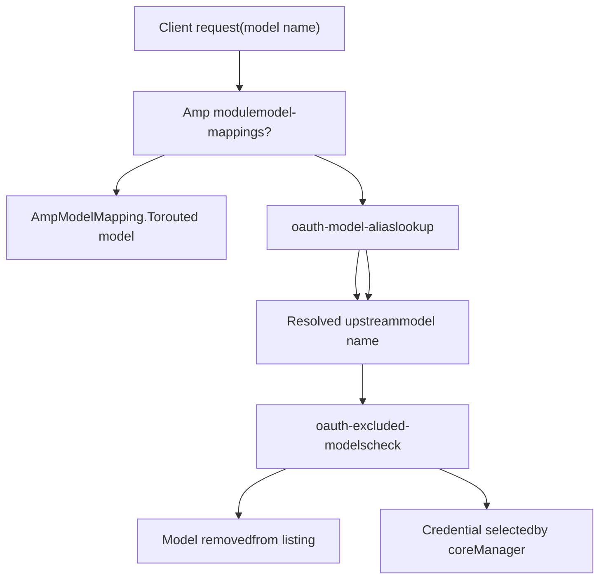
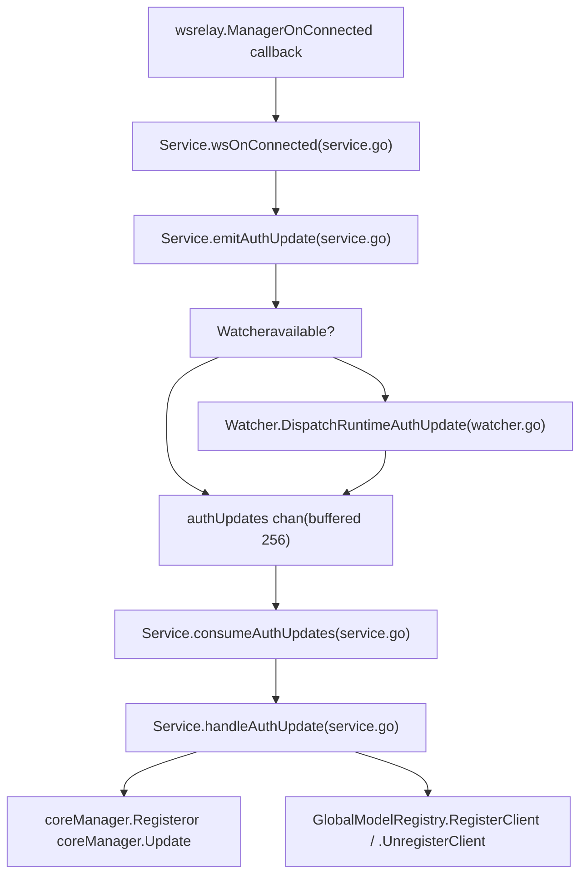

# 高级功能

相关源文件

-   [config.example.yaml](https://github.com/router-for-me/CLIProxyAPI/blob/c66cb0af/config.example.yaml)
-   [internal/api/handlers/management/config\_basic.go](https://github.com/router-for-me/CLIProxyAPI/blob/c66cb0af/internal/api/handlers/management/config_basic.go)
-   [internal/api/handlers/management/config\_lists.go](https://github.com/router-for-me/CLIProxyAPI/blob/c66cb0af/internal/api/handlers/management/config_lists.go)
-   [internal/api/server.go](https://github.com/router-for-me/CLIProxyAPI/blob/c66cb0af/internal/api/server.go)
-   [internal/config/config.go](https://github.com/router-for-me/CLIProxyAPI/blob/c66cb0af/internal/config/config.go)
-   [internal/watcher/watcher.go](https://github.com/router-for-me/CLIProxyAPI/blob/c66cb0af/internal/watcher/watcher.go)
-   [sdk/cliproxy/service.go](https://github.com/router-for-me/CLIProxyAPI/blob/c66cb0af/sdk/cliproxy/service.go)
-   [test/amp\_management\_test.go](https://github.com/router-for-me/CLIProxyAPI/blob/c66cb0af/test/amp_management_test.go)

本页面涵盖了 CLIProxyAPI 在基础请求代理之外的能力。它提供了每个高级功能领域的结构化概览，并指向详细记录每个功能的子页面。有关初始设置和基础配置，请参阅[入门指南](/router-for-me/CLIProxyAPI/2-getting-started)和[配置指南](/router-for-me/CLIProxyAPI/5-configuration-guide)。有关核心架构细节，请参阅[核心架构](/router-for-me/CLIProxyAPI/3-core-architecture)。

---

## 概览

CLIProxyAPI 的高级功能分为八个领域：

| 功能领域 | 摘要 | 详情页面 |
| --- | --- | --- |
| 凭证路由与故障转移 | 多凭证之间的负载均衡、冷却和重试逻辑 | [8.1](/router-for-me/CLIProxyAPI/8.1-credential-routing-and-failover) |
| 模型映射与排除 | 模型别名、模型排除、Amp 回退路由 | [8.2](/router-for-me/CLIProxyAPI/8.2-model-mapping-and-exclusion) |
| 思考与推理配置 | 预算后缀、限制（clamping）、按供应商应用 | [8.3](/router-for-me/CLIProxyAPI/8.3-thinking-and-reasoning-configuration) |
| 请求与响应日志 | 逐请求日志文件、轮转、仅限错误模式 | [8.4](/router-for-me/CLIProxyAPI/8.4-request-and-response-logging) |
| 使用情况统计与监控 | 按模型和按密钥的指标、导出/导入 | [8.5](/router-for-me/CLIProxyAPI/8.5-usage-statistics-and-monitoring) |
| 流式处理与保持活动 | SSE 保持活动、引导重试、非流式保持活动 | [8.6](/router-for-me/CLIProxyAPI/8.6-streaming-and-keep-alive) |
| WebSocket 与运行时认证 | WebSocket Responses API、Codex 会话、实时认证注入 | [8.7](/router-for-me/CLIProxyAPI/8.7-websocket-and-runtime-authentication) |
| 签名缓存与思考验证 | 多轮 Claude 思考签名验证 | [8.8](/router-for-me/CLIProxyAPI/8.8-signature-cache-and-thinking-validation) |

下图将每个功能领域映射到实现它的主要代码实体。

**图表：高级功能领域与主要代码实体**

```mermaid
flowchart TD
    U["WebsocketAuth(config.go)"]
    V["Server.AttachWebsocketRoute(server.go)"]
    W["keepAliveEnabled(server.go)"]
    X["Server.watchKeepAlive(server.go)"]
    Y["Watcher.DispatchRuntimeAuthUpdate(watcher.go)"]
    Z["Service.handleAuthUpdate(service.go)"]
    Q["RequestLog(config.go)"]
    R["FileRequestLogger(logging)"]
    S["UsageStatisticsEnabled(config.go)"]
    T["usage.SetStatisticsEnabled(server.go)"]
    N["PayloadConfig(config.go)"]
    O["PayloadRule / PayloadFilterRule"]
    P["applyPayloadConfigWithRoot"]
    H["OAuthModelAlias(config.go)"]
    I["coreManager.SetOAuthModelAlias(service.go)"]
    J["OAuthExcludedModels(config.go)"]
    K["applyExcludedModels(service.go)"]
    L["AmpModelMapping(config.go)"]
    M["AmpModule(ampmodule)"]
    A["RoutingConfig(config.go)"]
    B["RoundRobinSelector(coreauth)"]
    C["FillFirstSelector(coreauth)"]
    D["QuotaExceeded(config.go)"]
    E["auth.SetQuotaCooldownDisabled(server.go)"]
    F["RequestRetry / MaxRetryInterval(config.go)"]
    G["coreManager.SetRetryConfig(service.go)"]

    U --> V
    W --> X
    Y --> Z
    Q --> R
    S --> T
    N --> O
    O --> P
    H --> I
    J --> K
    L --> M
    A --> B
    A --> C
    D --> E
    F --> G
```


来源：[internal/config/config.go164-179](https://github.com/router-for-me/CLIProxyAPI/blob/c66cb0af/internal/config/config.go#L164-L179) [internal/api/server.go688-764](https://github.com/router-for-me/CLIProxyAPI/blob/c66cb0af/internal/api/server.go#L688-L764) [sdk/cliproxy/service.go334-340](https://github.com/router-for-me/CLIProxyAPI/blob/c66cb0af/sdk/cliproxy/service.go#L334-L340) [sdk/cliproxy/service.go556-608](https://github.com/router-for-me/CLIProxyAPI/blob/c66cb0af/sdk/cliproxy/service.go#L556-L608)

---

## 凭证路由与故障转移

当为同一供应商配置了多个凭证时，CLIProxyAPI 使用可配置的策略在它们之间进行选择。`Config` 中的 `RoutingConfig.Strategy` 字段接受 `"round-robin"`（默认）或 `"fill-first"`。这在运行时直接映射到 `coreauth.RoundRobinSelector` 或 `coreauth.FillFirstSelector`。

在配额耗尽时，`QuotaExceeded` 结构体控制是否自动切换项目或回退到预览模型。可以通过 `DisableCooling` 全局禁用凭证冷却。重试行为由 `RequestRetry` 和 `MaxRetryInterval` 控制。

详情请参阅[凭证路由与故障转移](/router-for-me/CLIProxyAPI/8.1-credential-routing-and-failover)。

**相关配置字段：**

```
routing:  strategy: "round-robin"  # 或 "fill-first"quota-exceeded:  switch-project: true  switch-preview-model: truedisable-cooling: falserequest-retry: 3max-retry-interval: 30
```
来源：[internal/config/config.go164-179](https://github.com/router-for-me/CLIProxyAPI/blob/c66cb0af/internal/config/config.go#L164-L179) [sdk/cliproxy/service.go556-608](https://github.com/router-for-me/CLIProxyAPI/blob/c66cb0af/sdk/cliproxy/service.go#L556-L608) [internal/api/server.go919-921](https://github.com/router-for-me/CLIProxyAPI/blob/c66cb0af/internal/api/server.go#L919-L921)

---

## 模型映射与排除

三种不同的机制控制哪些模型可见以及模型名称如何解析：

| 机制 | 配置字段 | 范围 |
| --- | --- | --- |
| OAuth 模型别名 | `oauth-model-alias` | 重命名 OAuth/文件后端通道的上游模型 ID |
| OAuth 模型排除 | `oauth-excluded-models` | 从 OAuth/文件后端通道移除特定模型 |
| Amp 模型映射 | `ampcode.model-mappings` | 将 Amp CLI 模型请求重新路由到本地可用模型 |

`OAuthModelAlias` 结构体支持可选的 `fork: true` 标志，该标志会将别名添加为额外的模型条目，同时保留原始条目。支持的通道包括 `gemini-cli`、`vertex`、`aistudio`、`antigravity`、`claude`、`codex`、`qwen`、`iflow` 和 `kimi`。

每个供应商的排除项（例如，在 `gemini-api-key` 下）与全局 `oauth-excluded-models` 映射是分开的。

详情请参阅[模型映射与排除](/router-for-me/CLIProxyAPI/8.2-model-mapping-and-exclusion)。

**图表：模型别名与排除流程**


来源：[internal/config/config.go108-116](https://github.com/router-for-me/CLIProxyAPI/blob/c66cb0af/internal/config/config.go#L108-L116) [internal/config/config.go181-206](https://github.com/router-for-me/CLIProxyAPI/blob/c66cb0af/internal/config/config.go#L181-206) [sdk/cliproxy/service.go762-808](https://github.com/router-for-me/CLIProxyAPI/blob/c66cb0af/sdk/cliproxy/service.go#L762-L808)

---

## 思考与推理配置 (Thinking and Reasoning Configuration)

多个供应商（Claude, Gemini, Codex/Qwen）支持扩展推理或“思考”模式。CLIProxyAPI 允许通过模型名称后缀指定预算，并根据每个模型的容量限制验证参数。

详情请参阅[思考与推理配置](/router-for-me/CLIProxyAPI/8.3-thinking-and-reasoning-configuration)，了解完整的后缀格式、验证逻辑和供应商特定的应用规则。

---

## 请求与响应日志

当配置中设置了 `request-log: true` 时，CLIProxyAPI 会将完整的请求和响应体捕获到轮转的日志文件中。`FileRequestLogger` 写入 `logs/` 子目录。仅限错误模式仅保留失败请求的日志。

日志文件可通过管理 API（`GET /v0/management/logs`）访问。`error-logs-max-files` 配置字段限制保留的错误日志文件数量（默认：10）。

详情请参阅[请求与响应日志](/router-for-me/CLIProxyAPI/8.4-request-and-response-logging)，了解日志格式、轮转策略和检索 API 细节。

**相关配置字段：**

```
request-log: falselogging-to-file: falselogs-max-total-size-mb: 0error-logs-max-files: 10
```
来源：[internal/api/server.go60-66](https://github.com/router-for-me/CLIProxyAPI/blob/c66cb0af/internal/api/server.go#L60-L66) [internal/api/server.go220-232](https://github.com/router-for-me/CLIProxyAPI/blob/c66cb0af/internal/api/server.go#L220-L232) [internal/config/config.go53-62](https://github.com/router-for-me/CLIProxyAPI/blob/c66cb0af/internal/config/config.go#L53-L62)

---

## 使用情况统计与监控

当 `usage-statistics-enabled: true` 时，CLIProxyAPI 会在内存中累积按模型和按 API 密钥的令牌及请求计数。统计数据可通过 `GET /v0/management/usage` 访问，并可以导出/导入以在重启后实现持久化。

`usage.SetStatisticsEnabled` 函数在配置加载时以及设置更改时的热重载期间被调用。详情请参阅[使用情况统计与监控](/router-for-me/CLIProxyAPI/8.5-usage-statistics-and-monitoring)，了解完整的指标模式和导出格式。

来源：[internal/api/server.go905-907](https://github.com/router-for-me/CLIProxyAPI/blob/c66cb0af/internal/api/server.go#L905-L907) [internal/config/config.go65](https://github.com/router-for-me/CLIProxyAPI/blob/c66cb0af/internal/config/config.go#L65-L65)

---

## 流式处理与保持活动 (Streaming and Keep-Alive)

**SSE 流式传输**响应支持两种可配置行为：

-   `streaming.keepalive-seconds`：以此间隔发出空白 SSE 行，以防止空闲连接断开。
-   `streaming.bootstrap-retries`：在发生瞬时上游错误时重试请求（在响应第一个字节之前）。

**非流式保持活动**：`nonstream-keepalive-interval` 定期为非流式响应发出空白行。

**进程保持活动端点**：当使用 `WithKeepAliveEndpoint` 时（例如，在 TUI/嵌入模式下），服务器会注册 `GET /keep-alive`。如果在配置的超时时间内没有心跳到达，则调用 `onTimeout` 回调。该实现使用在 goroutine 中运行的 `Server.watchKeepAlive`。

详情请参阅[流式处理与保持活动](/router-for-me/CLIProxyAPI/8.6-streaming-and-keep-alive)。

**图表：保持活动 Goroutine 状态**

来源：[internal/api/server.go688-764](https://github.com/router-for-me/CLIProxyAPI/blob/c66cb0af/internal/api/server.go#L688-L764) [config.example.yaml96-99](https://github.com/router-for-me/CLIProxyAPI/blob/c66cb0af/config.example.yaml#L96-L99)

---

## WebSocket 与运行时身份验证

**WebSocket 端点 (`/v1/ws`)**：由 `wsrelay.Manager` 管理。当 WebSocket 客户端连接时，`Service.wsOnConnected` 为该会话创建一个临时 `coreauth.Auth` 条目，并通过 `Service.emitAuthUpdate` 发出。断开连接时，`Service.wsOnDisconnected` 将其移除。该端点的身份验证通过 `ws-auth` 配置字段和 `Server.wsAuthEnabled` 进行切换。

**Codex WebSocket 执行器**：`CodexAutoExecutor` 为 OpenAI Responses API 支持持久的 WebSocket 会话。`Server.AttachWebsocketRoute` 在 Gin 引擎上注册处理器。

**运行时认证注入**：`Watcher.DispatchRuntimeAuthUpdate` 允许外部代码将 `AuthUpdate` 事件（添加/修改/删除）推送到与基于文件的观察器相同的管道中。这就是 WebSocket 供应商连接将其自身注册为实时凭证的机制。

详情请参阅[WebSocket 与运行时身份验证](/router-for-me/CLIProxyAPI/8.7-websocket-and-runtime-authentication)，了解完整的会话和执行器细节。

**图表：运行时认证更新管道**


来源：[sdk/cliproxy/service.go204-273](https://github.com/router-for-me/CLIProxyAPI/blob/c66cb0af/sdk/cliproxy/service.go#L204-L273) [internal/watcher/watcher.go135-141](https://github.com/router-for-me/CLIProxyAPI/blob/c66cb0af/internal/watcher/watcher.go#L135-L141) [internal/api/server.go441-476](https://github.com/router-for-me/CLIProxyAPI/blob/c66cb0af/internal/api/server.go#L441-L476)

---

## 签名缓存与思考验证 (Signature Cache and Thinking Validation)

当 Claude 在多轮对话中返回思考块（thinking blocks）时，后续请求必须包含原始签名以验证思考内容。CLIProxyAPI 维护一个 `SignatureCache`，在对话轮次之间持久化这些签名。

对于暴露 Claude 兼容思考但不使用 Anthropic 签名方案的 Gemini 模型，使用特殊的哨兵值 `skip_thought_signature_validator`。

详情请参阅[签名缓存与思考验证](/router-for-me/CLIProxyAPI/8.8-signature-cache-and-thinking-validation)，了解缓存结构和验证流程。

---

## 有效负载 (Payload) 配置

`PayloadConfig` 系统（在 `payload:` 键下配置）允许在供应商请求体转发到上游之前，对其应用默认、覆盖和过滤规则。规则通过模型名称模式和可选的协议说明符进行匹配。

| 规则类型 | 行为 |
| --- | --- |
| `default` | 仅在不存在时设置 JSON 字段 |
| `default-raw` | 仅在不存在时设置原始 JSON 片段 |
| `override` | 始终覆盖 JSON 字段 |
| `override-raw` | 始终使用原始 JSON 片段覆盖 |
| `filter` | 移除指定的 JSON 路径 |

`PayloadModelRule.Name` 中的模式支持通配符 (`*`)。`Protocol` 字段将规则限制为特定的转换器格式（`openai`, `gemini`, `claude`, `codex`, `antigravity`）。

详情请参阅[有效负载配置规则](/router-for-me/CLIProxyAPI/5.4-payload-configuration-rules)，了解 `applyPayloadConfigWithRoot` 的实现细节。

```
payload:  default:    - models:        - name: "gemini-2.5-pro"          protocol: "gemini"      params:        "generationConfig.thinkingConfig.thinkingBudget": 32768  filter:    - models:        - name: "gemini-*"          protocol: "gemini"      params:        - "generationConfig.responseJsonSchema"
```
来源：[internal/config/config.go248-285](https://github.com/router-for-me/CLIProxyAPI/blob/c66cb0af/internal/config/config.go#L248-L285) [config.example.yaml294-326](https://github.com/router-for-me/CLIProxyAPI/blob/c66cb0af/config.example.yaml#L294-L326)

---

## 热重载交互

所有高级功能都会响应由文件观察器触发的配置热重载（参见[热重载与配置更新](/router-for-me/CLIProxyAPI/3.7-hot-reload-and-configuration-updates)）。`Server.UpdateClients` 方法将配置差分传播到每个子系统：

| 配置更改 | 效果 |
| --- | --- |
| `routing.strategy` | 切换 `coreManager` 选择器 |
| `disable-cooling` | 调用 `auth.SetQuotaCooldownDisabled` |
| `request-retry` / `max-retry-interval` | 更新 `coreManager.SetRetryConfig` |
| `usage-statistics-enabled` | 切换 `usage.SetStatisticsEnabled` |
| `request-log` | 切换 `FileRequestLogger.SetEnabled` |
| `ws-auth` | 更新 `Server.wsAuthEnabled`，如果新启用则重置活动的 WebSocket 会话 |
| `ampcode.*` | 通知 `AmpModule.OnConfigUpdated` |
| `oauth-model-alias` | 更新 `coreManager.SetOAuthModelAlias` |

来源：[internal/api/server.go879-1016](https://github.com/router-for-me/CLIProxyAPI/blob/c66cb0af/internal/api/server.go#L879-L1016) [sdk/cliproxy/service.go556-608](https://github.com/router-for-me/CLIProxyAPI/blob/c66cb0af/sdk/cliproxy/service.go#L556-L608)
