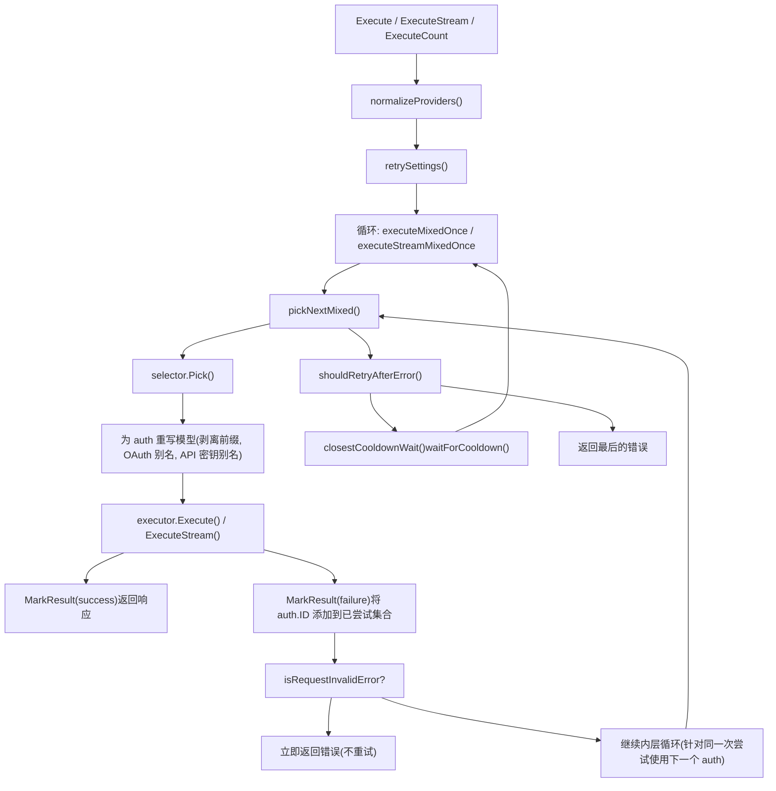
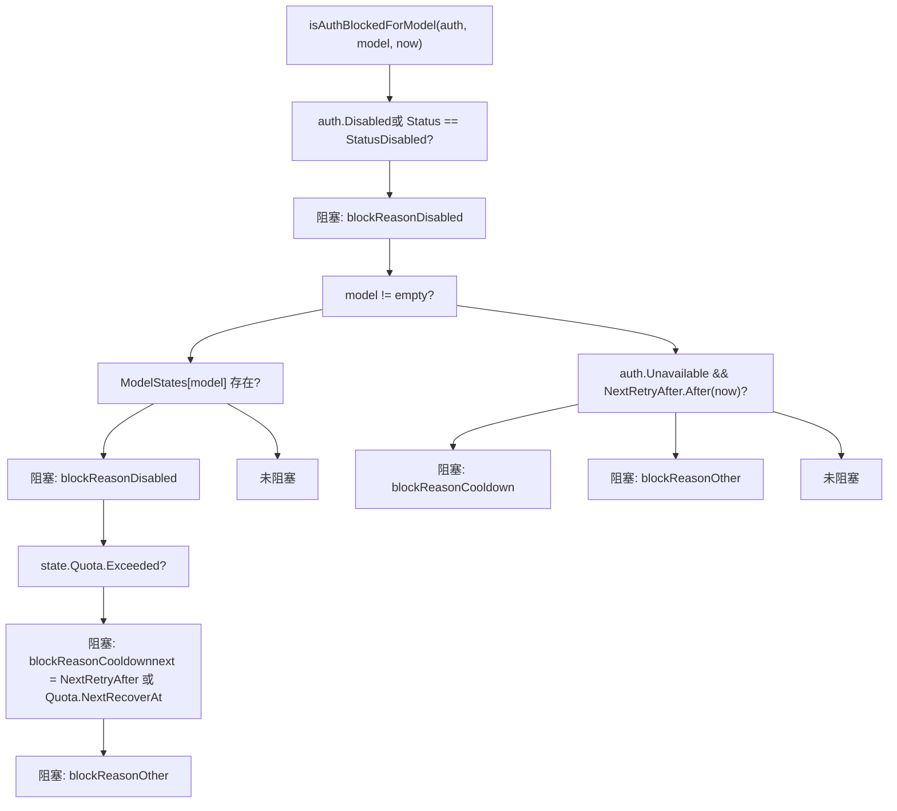
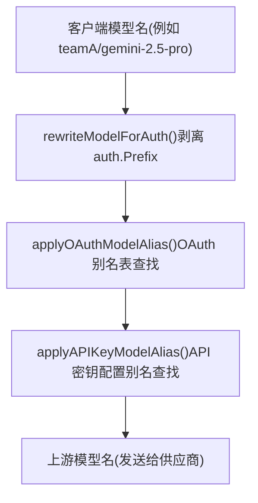

# 凭证路由与故障转移

相关源文件

-   [internal/watcher/config\_reload.go](https://github.com/router-for-me/CLIProxyAPI/blob/c66cb0af/internal/watcher/config_reload.go)
-   [sdk/cliproxy/auth/conductor.go](https://github.com/router-for-me/CLIProxyAPI/blob/c66cb0af/sdk/cliproxy/auth/conductor.go)
-   [sdk/cliproxy/auth/selector.go](https://github.com/router-for-me/CLIProxyAPI/blob/c66cb0af/sdk/cliproxy/auth/selector.go)
-   [sdk/cliproxy/auth/selector\_test.go](https://github.com/router-for-me/CLIProxyAPI/blob/c66cb0af/sdk/cliproxy/auth/selector_test.go)
-   [sdk/cliproxy/auth/types.go](https://github.com/router-for-me/CLIProxyAPI/blob/c66cb0af/sdk/cliproxy/auth/types.go)
-   [sdk/cliproxy/auth/types\_test.go](https://github.com/router-for-me/CLIProxyAPI/blob/c66cb0af/sdk/cliproxy/auth/types_test.go)

## 用途与范围

本页面记录了 CLIProxyAPI 如何为发往 AI 供应商的请求选择凭证、如何在同一供应商的多个账号之间分配负载、请求失败时会发生什么，以及系统如何追踪配额状态以避免将流量重新路由到正在冷却中的凭证。

该机制几乎完全在 `auth` 包 (`sdk/cliproxy/auth/`) 中实现。关于 `Manager` 在启动时如何初始化并关联，请参阅 [3.3](/router-for-me/CLIProxyAPI/3.3-authentication-and-credential-management)。关于 OAuth 令牌如何在过期前刷新，请参阅 [7.4](/router-for-me/CLIProxyAPI/7.4-token-refresh-and-lifecycle)。关于模型别名如何配置，请参阅 [8.2](/router-for-me/CLIProxyAPI/8.2-model-mapping-and-exclusion)。

---

## 核心参与者

实现凭证路由的三个关键类型是 `Manager`、`Selector` 和 `Auth`。

**关键类型图：**


**来源：** [sdk/cliproxy/auth/conductor.go128-160](https://github.com/router-for-me/CLIProxyAPI/blob/c66cb0af/sdk/cliproxy/auth/conductor.go#L128-L160) [sdk/cliproxy/auth/selector.go20-31](https://github.com/router-for-me/CLIProxyAPI/blob/c66cb0af/sdk/cliproxy/auth/selector.go#L20-L31) [sdk/cliproxy/auth/types.go46-126](https://github.com/router-for-me/CLIProxyAPI/blob/c66cb0af/sdk/cliproxy/auth/types.go#L46-L126)

---

## 选择器 (Selectors)

`Selector` 接口包含一个方法：`Pick(ctx, provider, model, opts, auths) (*Auth, error)`。它接收经过完整过滤的可用、未被阻止的认证列表，并返回要使用的那个。

提供了两个内置实现：

| 选择器 | 策略 | 最佳适用场景 |
| --- | --- | --- |
| `RoundRobinSelector` | 按 ID 排序后，循环选择可用凭证 | 在具有滚动窗口限制的账号之间均匀分摊负载 |
| `FillFirstSelector` | 始终选取第一个可用的（确定性的按 ID 字典序排序） | 在移动到下一个账号之前先耗尽一个账号 |

当调用 `NewManager` 且 `selector` 为 `nil` 时，默认使用 `RoundRobinSelector`。

**来源：** [sdk/cliproxy/auth/conductor.go161-181](https://github.com/router-for-me/CLIProxyAPI/blob/c66cb0af/sdk/cliproxy/auth/conductor.go#L161-L181) [sdk/cliproxy/auth/selector.go20-31](https://github.com/router-for-me/CLIProxyAPI/blob/c66cb0af/sdk/cliproxy/auth/selector.go#L20-L31) [sdk/cliproxy/auth/selector.go353-363](https://github.com/router-for-me/CLIProxyAPI/blob/c66cb0af/sdk/cliproxy/auth/selector.go#L353-L363)

### 优先级桶 (Priority Buckets)

在选择器运行前，`getAvailableAuths` 会根据从 `Auth.Attributes["priority"]` 读取的整数 `priority` 属性对候选者进行划分。只有包含至少一个非阻塞凭证的最高优先级桶会被提供给选择器。

这意味着：

-   如果所有优先级为 10 的凭证都在冷却中，系统会自动回退到优先级为 0 的凭证。
-   在胜出的桶内部，正常应用选择器的算法（轮询或优先填满）。

**来源：** [sdk/cliproxy/auth/selector.go194-249](https://github.com/router-for-me/CLIProxyAPI/blob/c66cb0af/sdk/cliproxy/auth/selector.go#L194-L249) [sdk/cliproxy/auth/selector.go110-123](https://github.com/router-for-me/CLIProxyAPI/blob/c66cb0af/sdk/cliproxy/auth/selector.go#L110-L123)

### Gemini CLI 双层轮询

当所有候选者都带有 `gemini_virtual_parent` 属性时，`RoundRobinSelector.Pick` 会应用双层轮询：

1.  **外层游标 (Outer cursor)** 在不同的父凭证组之间循环。
2.  **内层游标 (Inner cursor)** 在选定父凭证的项目认证 (project auths) 内部循环。

如果候选列表中的任何认证缺少 `gemini_virtual_parent`，选择器将回退到平铺轮询。

**来源：** [sdk/cliproxy/auth/selector.go255-313](https://github.com/router-for-me/CLIProxyAPI/blob/c66cb0af/sdk/cliproxy/auth/selector.go#L255-L313) [sdk/cliproxy/auth/selector.go326-351](https://github.com/router-for-me/CLIProxyAPI/blob/c66cb0af/sdk/cliproxy/auth/selector.go#L326-L351)

---

## 请求执行与故障转移

**执行流程图：**


**来源：** [sdk/cliproxy/auth/conductor.go498-588](https://github.com/router-for-me/CLIProxyAPI/blob/c66cb0af/sdk/cliproxy/auth/conductor.go#L498-L588) [sdk/cliproxy/auth/conductor.go591-645](https://github.com/router-for-me/CLIProxyAPI/blob/c66cb0af/sdk/cliproxy/auth/conductor.go#L591-L645) [sdk/cliproxy/auth/conductor.go703-788](https://github.com/router-for-me/CLIProxyAPI/blob/c66cb0af/sdk/cliproxy/auth/conductor.go#L703-L788)

### 内层循环：尝试每个 Auth

每次对 `executeMixedOnce`（及其流式/计数对应函数）的调用都会建立一个以 `Auth.ID` 为键的 `tried` 映射。在每次迭代中，`pickNextMixed` 会挑选下一个不在 `tried` 映射中的候选者。当选择器返回错误（没有更多候选者）时，内层循环结束。

这意味着在单次尝试中，**在放弃或等待之前，会尝试每一个可用的凭证**。

**来源：** [sdk/cliproxy/auth/conductor.go591-645](https://github.com/router-for-me/CLIProxyAPI/blob/c66cb0af/sdk/cliproxy/auth/conductor.go#L591-L645)

### 外层循环：带有冷却等待的重试

在耗尽了一次尝试的所有候选者后，`shouldRetryAfterError` 决定是否重试：

1.  `maxRetryInterval` 必须非零（通过 `SetRetryConfig` 设置）。
2.  错误必须不是 200 OK，且必须不是“请求无效”类错误。
3.  `closestCooldownWait` 扫描所有匹配供应商的认证，并返回任何认证退出冷却的最短等待时间。
4.  如果 `wait ≤ maxRetryInterval`，系统休眠该时长，然后重试完整的内层循环。

遵循逐凭证的重试覆盖：每个 `Auth` 可以在 `Auth.Metadata` 中存储一个 `request_retry` 整数，以覆盖全局重试计数。

**来源：** [sdk/cliproxy/auth/conductor.go1172-1190](https://github.com/router-for-me/CLIProxyAPI/blob/c66cb0af/sdk/cliproxy/auth/conductor.go#L1172-L1190) [sdk/cliproxy/auth/conductor.go1115-1170](https://github.com/router-for-me/CLIProxyAPI/blob/c66cb0af/sdk/cliproxy/auth/conductor.go#L1115-L1170) [sdk/cliproxy/auth/types.go263-286](https://github.com/router-for-me/CLIProxyAPI/blob/c66cb0af/sdk/cliproxy/auth/types.go#L263-L286)

---

## Auth 阻塞与冷却

函数 `isAuthBlockedForModel` 决定给定的认证是否具备被选取的资格。它在 `getAvailableAuths` 内部针对每个候选者被调用。

**阻塞逻辑决策树：**


**来源：** [sdk/cliproxy/auth/selector.go365-422](https://github.com/router-for-me/CLIProxyAPI/blob/c66cb0af/sdk/cliproxy/auth/selector.go#L365-L422)

### 冷却错误响应

当某个模型的所有候选者都处于 `blockReasonCooldown` 状态时，`getAvailableAuths` 返回一个 `modelCooldownError` 而非通用错误。该错误：

-   具有 HTTP 状态码 `429 Too Many Requests`。
-   带有 `Retry-After` 标头，指示最早的凭证恢复所需的秒数。
-   嵌入一个包含 `code: "model_cooldown"`、`reset_time` 和 `reset_seconds` 的 JSON 正文。

**来源：** [sdk/cliproxy/auth/selector.go41-108](https://github.com/router-for-me/CLIProxyAPI/blob/c66cb0af/sdk/cliproxy/auth/selector.go#L41-L108) [sdk/cliproxy/auth/selector.go214-233](https://github.com/router-for-me/CLIProxyAPI/blob/c66cb0af/sdk/cliproxy/auth/selector.go#L214-L233)

### 逐凭证禁用冷却

凭证可以通过在其认证文件元数据中设置 `disable_cooling: true` 来完全退出配额冷却。全局标志 `SetQuotaCooldownDisabled(true)` 会为所有没有凭证级覆盖的凭证禁用冷却。

**来源：** [sdk/cliproxy/auth/conductor.go69-83](https://github.com/router-for-me/CLIProxyAPI/blob/c66cb0af/sdk/cliproxy/auth/conductor.go#L69-L83) [sdk/cliproxy/auth/types.go227-244](https://github.com/router-for-me/CLIProxyAPI/blob/c66cb0af/sdk/cliproxy/auth/types.go#L227-L244)

---

## 配额状态与退避 (Backoff)

`QuotaState` 追踪凭证或逐模型 `ModelState` 的渐进式退避。

| 字段 | 类型 | 含义 |
| --- | --- | --- |
| `Exceeded` | `bool` | 最近是否见过配额错误 |
| `NextRecoverAt` | `time.Time` | 何时可以再次尝试该凭证 |
| `BackoffLevel` | `int` | 下一次冷却时长的指数 |
| `Reason` | `string` | 人类可读的供应商描述 |

`conductor.go` 中定义的冷却常量：

| 常量 | 取值 |
| --- | --- |
| `quotaBackoffBase` | 1 秒 |
| `quotaBackoffMax` | 30 分钟 |
| `refreshPendingBackoff` | 1 分钟 |
| `refreshFailureBackoff` | 5 分钟 |
| `refreshCheckInterval` | 5 秒 |

**来源：** [sdk/cliproxy/auth/conductor.go61-67](https://github.com/router-for-me/CLIProxyAPI/blob/c66cb0af/sdk/cliproxy/auth/conductor.go#L61-L67) [sdk/cliproxy/auth/types.go98-126](https://github.com/router-for-me/CLIProxyAPI/blob/c66cb0af/sdk/cliproxy/auth/types.go#L98-L126)

### MarkResult

在每次执行尝试后，都会调用 `MarkResult` 并传入一个 `Result` 结构体，其中包含：

-   `AuthID` —— 使用了哪个凭证。
-   `Success` —— 调用是否成功。
-   `RetryAfter` —— 供应商提供的延迟提示（来自 429 响应）。
-   `Error` —— 包含 HTTP 状态的故障详情。

`MarkResult` 相应地更新认证的 `QuotaState` 和 `ModelState` 并持久化更新后的认证信息。它还会触发 `Hook.OnResult` 回调。

`Result` 类型为：

```
Result {
    AuthID    string
    Provider  string
    Model     string
    Success   bool
    RetryAfter *time.Duration
    Error     *Error
}
```
**来源：** [sdk/cliproxy/auth/conductor.go85-99](https://github.com/router-for-me/CLIProxyAPI/blob/c66cb0af/sdk/cliproxy/auth/conductor.go#L85-L99) [sdk/cliproxy/auth/conductor.go623-643](https://github.com/router-for-me/CLIProxyAPI/blob/c66cb0af/sdk/cliproxy/auth/conductor.go#L623-L643)

---

## 模型名称重写

在请求到达执行器之前，模型名称可能会经过三个顺序应用的重写步骤：


1.  **`rewriteModelForAuth`**：如果设置了 `Auth.Prefix`（例如 `"teamA"`），则从模型名称开头剥离 `"teamA/"`。这实现了基于命名空间的凭证路由。
2.  **`applyOAuthModelAlias`**：在存储于 `Manager.oauthModelAlias` 的逐通道 OAuth 别名表中查找模型。别名配置请参阅 [8.2](/router-for-me/CLIProxyAPI/8.2-model-mapping-and-exclusion)。
3.  **`applyAPIKeyModelAlias`**：在从 `config.yaml` 模型条目构建的逐认证 ID 别名表 (`Manager.apiKeyModelAlias`) 中查找模型。别名查找在基础模型名称上是不区分大小写的（在查找前剥离思考后缀，并在结果上重新应用）。

**来源：** [sdk/cliproxy/auth/conductor.go861-923](https://github.com/router-for-me/CLIProxyAPI/blob/c66cb0af/sdk/cliproxy/auth/conductor.go#L861-L923) [sdk/cliproxy/auth/conductor.go619-621](https://github.com/router-for-me/CLIProxyAPI/blob/c66cb0af/sdk/cliproxy/auth/conductor.go#L619-L621)

---

## 多供应商路由

单个入站请求可以由来自多个供应商的凭证满足（例如，同一模型的 `gemini` 和 `claude` 凭证）。`Execute`/`ExecuteStream`/`ExecuteCount` 方法接受一个 `[]string` 类型的供应商键列表。

`normalizeProviders` 对此列表进行去重并转换为小写。随后 `pickNextMixed` 遍历供应商（按模型旋转起始索引，通过 `providerOffsets` 实现），并调用每个供应商凭证池的选择器，跳过认证已耗尽的供应商。

`tried` 集合跨越了单次尝试中的所有供应商，因此一旦尝试过某个凭证，在同一次尝试中就不会再次尝试，无论该凭证属于哪个供应商。

**来源：** [sdk/cliproxy/auth/conductor.go1088-1106](https://github.com/router-for-me/CLIProxyAPI/blob/c66cb0af/sdk/cliproxy/auth/conductor.go#L1088-L1106) [sdk/cliproxy/auth/conductor.go499-527](https://github.com/router-for-me/CLIProxyAPI/blob/c66cb0af/sdk/cliproxy/auth/conductor.go#L499-L527)

---

## 固定与元数据 (Pinning and Metadata)

调用者可以通过在 `Options.Metadata` 中填充 `cliproxyexecutor.PinnedAuthMetadataKey` 来为请求固定特定的凭证。管理器通过 `pinnedAuthIDFromMetadata` 读取该键，并绕过选择器，仅使用该凭证。

选择后，管理器将选定的凭证 ID 写回 `Options.Metadata` 的 `cliproxyexecutor.SelectedAuthMetadataKey` 下，并可选地调用注册在 `cliproxyexecutor.SelectedAuthCallbackMetadataKey` 下的回调函数。

**来源：** [sdk/cliproxy/auth/conductor.go829-858](https://github.com/router-for-me/CLIProxyAPI/blob/c66cb0af/sdk/cliproxy/auth/conductor.go#L829-L858) [sdk/cliproxy/auth/conductor.go847-858](https://github.com/router-for-me/CLIProxyAPI/blob/c66cb0af/sdk/cliproxy/auth/conductor.go#L847-L858)

---

## 钩子接口 (Hook Interface)

`Manager` 接受一个 `Hook` 用于观察认证生命周期事件。如果未提供钩子，则使用 `NoopHook`。

| 钩子方法 | 调用时机 |
| --- | --- |
| `OnAuthRegistered(ctx, auth)` | 通过 `Manager.Register` 注册新凭证时 |
| `OnAuthUpdated(ctx, auth)` | 通过 `Manager.Update` 更改现有凭证状态时 |
| `OnResult(ctx, result)` | 每次尝试执行后，无论成功或失败 |

**来源：** [sdk/cliproxy/auth/conductor.go106-126](https://github.com/router-for-me/CLIProxyAPI/blob/c66cb0af/sdk/cliproxy/auth/conductor.go#L106-L126)

---

## 配置参考

| 设置 | 位置 | 效果 |
| --- | --- | --- |
| 全局重试计数 | `Manager.SetRetryConfig(retry, maxRetryInterval)` | 允许的外层循环重试次数 |
| 最大重试等待时间 | `Manager.SetRetryConfig(retry, maxRetryInterval)` | 放弃前的冷却等待上限 |
| 逐凭证重试 | `Auth.Metadata["request_retry"]` | 覆盖单个凭证的全局重试计数 |
| 禁用冷却 (全局) | `SetQuotaCooldownDisabled(true)` | 为所有无覆盖设置的凭证跳过配额冷却 |
| 禁用冷却 (逐凭证) | `Auth.Metadata["disable_cooling"]` | 覆盖单个凭证的全局冷却标志 |
| 优先级 | `Auth.Attributes["priority"]` | 整数；优先级较高的凭据会被优先使用 |
| 前缀路由 | `Auth.Prefix` | 路由前从模型名称中剥离的命名空间前缀 |

**来源：** [sdk/cliproxy/auth/conductor.go384-397](https://github.com/router-for-me/CLIProxyAPI/blob/c66cb0af/sdk/cliproxy/auth/conductor.go#L384-L397) [sdk/cliproxy/auth/types.go227-244](https://github.com/router-for-me/CLIProxyAPI/blob/c66cb0af/sdk/cliproxy/auth/types.go#L227-L244) [sdk/cliproxy/auth/types.go263-286](https://github.com/router-for-me/CLIProxyAPI/blob/c66cb0af/sdk/cliproxy/auth/types.go#L263-L286) [sdk/cliproxy/auth/selector.go110-123](https://github.com/router-for-me/CLIProxyAPI/blob/c66cb0af/sdk/cliproxy/auth/selector.go#L110-L123) [sdk/cliproxy/auth/types.go50-54](https://github.com/router-for-me/CLIProxyAPI/blob/c66cb0af/sdk/cliproxy/auth/types.go#L50-L54)
