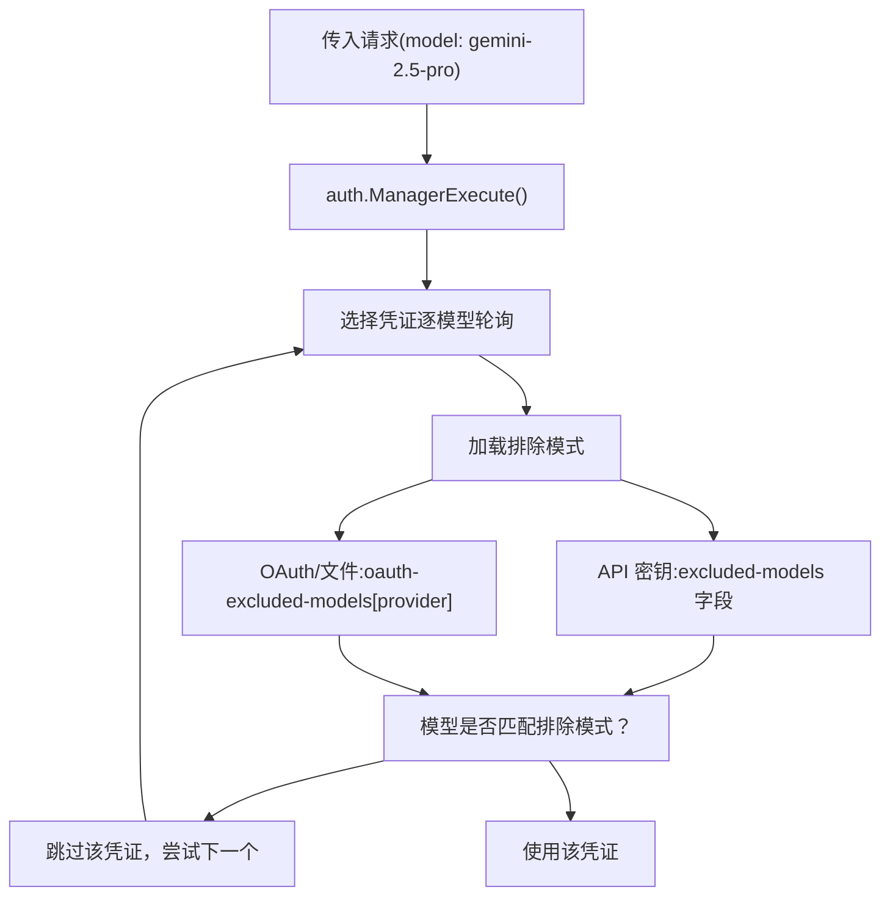
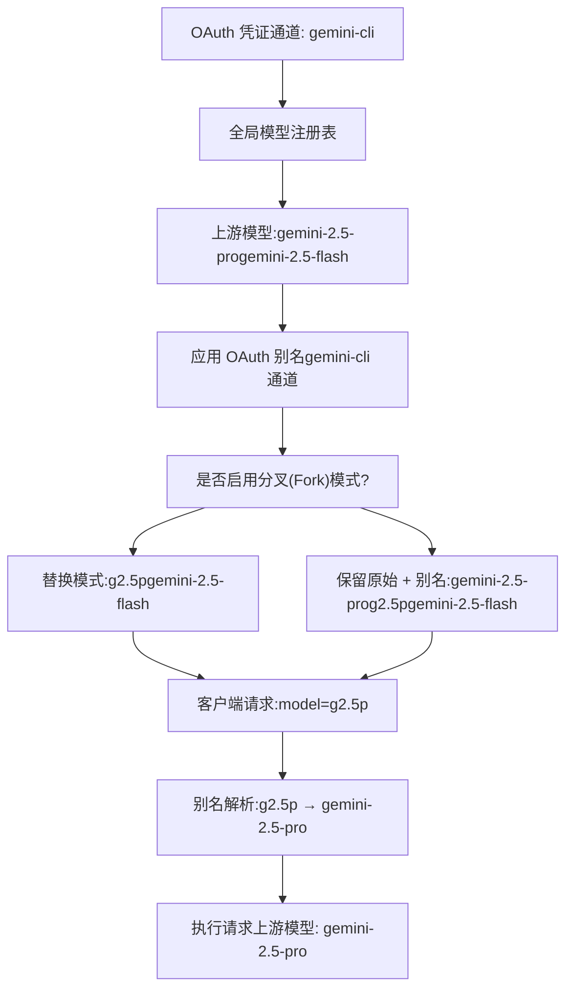
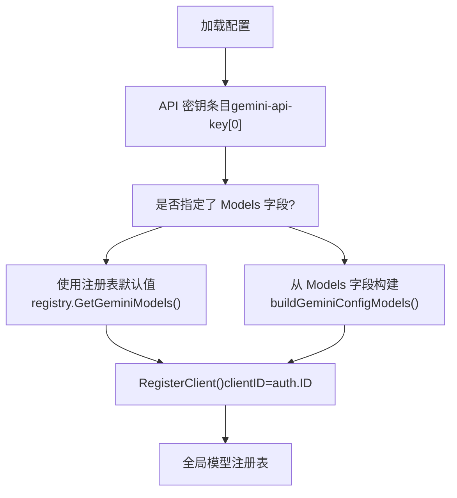
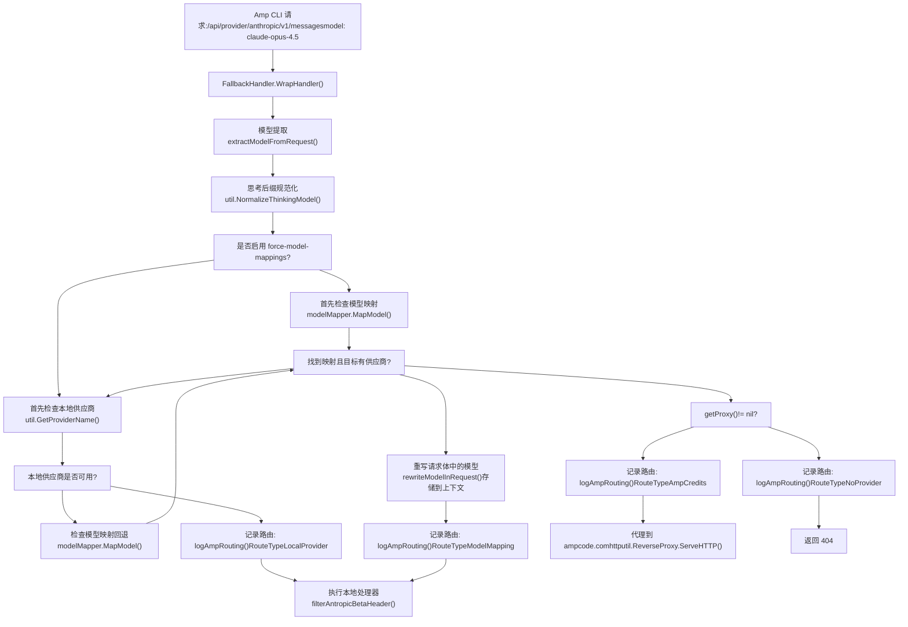
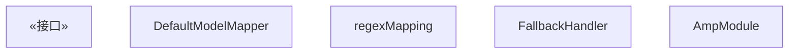

# 模型映射与排除

相关源文件

-   [internal/api/handlers/management/model\_definitions.go](https://github.com/router-for-me/CLIProxyAPI/blob/c66cb0af/internal/api/handlers/management/model_definitions.go)
-   [internal/api/modules/amp/amp.go](https://github.com/router-for-me/CLIProxyAPI/blob/c66cb0af/internal/api/modules/amp/amp.go)
-   [internal/api/modules/amp/fallback\_handlers.go](https://github.com/router-for-me/CLIProxyAPI/blob/c66cb0af/internal/api/modules/amp/fallback_handlers.go)
-   [internal/api/modules/amp/fallback\_handlers\_test.go](https://github.com/router-for-me/CLIProxyAPI/blob/c66cb0af/internal/api/modules/amp/fallback_handlers_test.go)
-   [internal/api/modules/amp/gemini\_bridge.go](https://github.com/router-for-me/CLIProxyAPI/blob/c66cb0af/internal/api/modules/amp/gemini_bridge.go)
-   [internal/api/modules/amp/gemini\_bridge\_test.go](https://github.com/router-for-me/CLIProxyAPI/blob/c66cb0af/internal/api/modules/amp/gemini_bridge_test.go)
-   [internal/api/modules/amp/model\_mapping.go](https://github.com/router-for-me/CLIProxyAPI/blob/c66cb0af/internal/api/modules/amp/model_mapping.go)
-   [internal/api/modules/amp/model\_mapping\_test.go](https://github.com/router-for-me/CLIProxyAPI/blob/c66cb0af/internal/api/modules/amp/model_mapping_test.go)
-   [internal/api/modules/amp/response\_rewriter.go](https://github.com/router-for-me/CLIProxyAPI/blob/c66cb0af/internal/api/modules/amp/response_rewriter.go)
-   [internal/api/modules/amp/response\_rewriter\_test.go](https://github.com/router-for-me/CLIProxyAPI/blob/c66cb0af/internal/api/modules/amp/response_rewriter_test.go)
-   [internal/api/modules/amp/routes.go](https://github.com/router-for-me/CLIProxyAPI/blob/c66cb0af/internal/api/modules/amp/routes.go)
-   [internal/api/modules/amp/routes\_test.go](https://github.com/router-for-me/CLIProxyAPI/blob/c66cb0af/internal/api/modules/amp/routes_test.go)
-   [internal/config/oauth\_model\_alias\_migration.go](https://github.com/router-for-me/CLIProxyAPI/blob/c66cb0af/internal/config/oauth_model_alias_migration.go)
-   [internal/config/oauth\_model\_alias\_migration\_test.go](https://github.com/router-for-me/CLIProxyAPI/blob/c66cb0af/internal/config/oauth_model_alias_migration_test.go)
-   [internal/config/oauth\_model\_alias\_test.go](https://github.com/router-for-me/CLIProxyAPI/blob/c66cb0af/internal/config/oauth_model_alias_test.go)
-   [internal/registry/model\_definitions\_static\_data.go](https://github.com/router-for-me/CLIProxyAPI/blob/c66cb0af/internal/registry/model_definitions_static_data.go)
-   [internal/thinking/provider/iflow/apply.go](https://github.com/router-for-me/CLIProxyAPI/blob/c66cb0af/internal/thinking/provider/iflow/apply.go)
-   [internal/util/claude\_model.go](https://github.com/router-for-me/CLIProxyAPI/blob/c66cb0af/internal/util/claude_model.go)
-   [internal/util/claude\_model\_test.go](https://github.com/router-for-me/CLIProxyAPI/blob/c66cb0af/internal/util/claude_model_test.go)
-   [internal/watcher/diff/oauth\_model\_alias.go](https://github.com/router-for-me/CLIProxyAPI/blob/c66cb0af/internal/watcher/diff/oauth_model_alias.go)

本文档描述了 CLIProxyAPI 中用于控制模型可用性和命名的四个独立系统：**模型排除 (Model Exclusion)**（按凭证限制模型访问）、**OAuth 模型映射 (OAuth Model Mappings)**（按通道进行的全局模型名称别名）、**逐凭证模型别名 (Per-Credential Model Aliases)**（在 API 密钥配置中定义模型名称）以及 **Amp 模型映射 (Amp Model Mapping)**（将不可用的 Amp CLI 模型路由到备选模型）。此外，**模型前缀处理 (Model Prefix Handling)** 实现了多租户模型命名空间。有关模型注册和发现的信息，请参阅[模型注册与选择](/router-for-me/CLIProxyAPI/3.6-model-registry-and-selection)。有关供应商特定的配置，请参阅[供应商集成](/router-for-me/CLIProxyAPI/6-provider-integration)。

---

## 概览

CLIProxyAPI 提供了五种控制模型路由、命名和可用性的机制：

1.  **模型排除**：防止特定的凭证（API 密钥或 OAuth 账号）使用某些模型，有助于执行配额限制、成本控制或供应商特定的约束。
2.  **OAuth 模型映射**：针对 OAuth/基于文件的认证通道（gemini-cli, vertex, aistudio, antigravity, claude, codex, qwen, iflow）的全局模型名称别名。将上游模型名称映射到客户端可见的别名，并支持可选的分叉（forking）。
3.  **逐凭证模型别名**：直接在 API 密钥配置（gemini-api-key, claude-api-key, codex-api-key, openai-compatibility, vertex-api-key）中定义上游模型名称及其别名。
4.  **Amp 模型映射**：将 Amp CLI 对不可用模型的请求路由到本地配置的备选模型，从而避免消耗 Amp 额度。
5.  **模型前缀处理**：通过要求凭证指定前缀，客户端在请求模型时必须使用该前缀，从而实现多租户模型命名空间。

这些系统独立运行，但在生产部署中互为补充。

---

## 模型排除系统

### 用途与范围

模型排除允许管理员限制特定的身份验证凭证可以访问哪些模型。这在凭证级别运行 —— 每个 API 密钥或 OAuth 账号都可以拥有自己的排除列表，当请求目标为排除的模型时，该列表会阻止 `auth.Manager` 选择该凭证。

**来源：** [internal/watcher/watcher.go620-658](https://github.com/router-for-me/CLIProxyAPI/blob/c66cb0af/internal/watcher/watcher.go#L620-L658) [sdk/cliproxy/service.go668-718](https://github.com/router-for-me/CLIProxyAPI/blob/c66cb0af/sdk/cliproxy/service.go#L668-L718) [internal/config/config.go58-78](https://github.com/router-for-me/CLIProxyAPI/blob/c66cb0af/internal/config/config.go#L58-L78)

### 排除模式

模型排除模式支持四种匹配模式：

| 模式类型 | 语法 | 示例 | 匹配项 |
| --- | --- | --- | --- |
| 精确匹配 | `model-name` | `gemini-2.5-pro` | 仅 `gemini-2.5-pro` |
| 前缀匹配 | `prefix-*` | `gemini-2.5-*` | `gemini-2.5-pro`, `gemini-2.5-flash` |
| 后缀匹配 | `*-suffix` | `*-preview` | `gemini-3-pro-preview`, `claude-opus-4-preview` |
| 子串匹配 | `*substring*` | `*flash*` | `gemini-2.5-flash`, `gemini-flash-lite` |

模式匹配不区分大小写，并会修剪空格。匹配逻辑在 `matchesPattern` 函数中实现。

**来源：** [sdk/cliproxy/service.go847-896](https://github.com/router-for-me/CLIProxyAPI/blob/c66cb0af/sdk/cliproxy/service.go#L847-L896) [config.example.yaml65-100](https://github.com/router-for-me/CLIProxyAPI/blob/c66cb0af/config.example.yaml#L65-L100)

### 配置方法

#### 逐 API 密钥排除

每个 API 密钥条目支持一个 `excluded-models` 字段，用于限制该特定密钥的模型访问：

```
gemini-api-key:  - api-key: "AIzaSy...01"    excluded-models:      - "gemini-2.5-pro"      # 精确匹配      - "gemini-2.5-*"         # 前缀通配符      - "*-preview"            # 后缀通配符      - "*flash*"              # 子串通配符 claude-api-key:  - api-key: "sk-ant-..."    excluded-models:      - "claude-opus-4-5-20251101"      - "claude-3-*" codex-api-key:  - api-key: "sk-atSM..."    base-url: "https://example.com"    excluded-models:      - "gpt-5.1"      - "*-mini"
```
支持范围：`gemini-api-key`, `claude-api-key`, `codex-api-key`

**来源：** [internal/config/config.go225-241](https://github.com/router-for-me/CLIProxyAPI/blob/c66cb0af/internal/config/config.go#L225-L241) [internal/config/config.go174-222](https://github.com/router-for-me/CLIProxyAPI/blob/c66cb0af/internal/config/config.go#L174-L222) [config.example.yaml58-100](https://github.com/router-for-me/CLIProxyAPI/blob/c66cb0af/config.example.yaml#L58-L100)

#### OAuth 供应商排除

应用于供应商所有 OAuth/基于文件的凭证的全局排除：

```
oauth-excluded-models:  gemini-cli:    - "gemini-2.5-pro"    - "*-preview"  vertex:    - "gemini-3-pro-preview"  claude:    - "claude-3-5-haiku-20241022"  codex:    - "gpt-5-codex-mini"  qwen:    - "vision-model"  iflow:    - "tstars2.0"  antigravity:    - "gemini-3-pro-preview"  aistudio:    - "gemini-3-pro-preview"
```
供应商键会被规范化为小写。这会影响该供应商的所有凭证，无论它们是如何创建的（OAuth 流程、文件上传或运行时连接）。

**来源：** [internal/config/config.go78](https://github.com/router-for-me/CLIProxyAPI/blob/c66cb0af/internal/config/config.go#L78-L78) [internal/config/config.go540-560](https://github.com/router-for-me/CLIProxyAPI/blob/c66cb0af/internal/config/config.go#L540-L560) [config.example.yaml149-169](https://github.com/router-for-me/CLIProxyAPI/blob/c66cb0af/config.example.yaml#L149-L169)

### 排除应用流程


**图表：模型排除选择逻辑**

在选择过程中，`auth.Manager` 通过检查请求的模型是否匹配该凭证的任何排除模式来过滤凭证。`excluded_models_hash` 属性存储了排除模式的规范化哈希值，以便在热重载期间实现高效的变更检测。

**来源：** [sdk/cliproxy/service.go721-789](https://github.com/router-for-me/CLIProxyAPI/blob/c66cb0af/sdk/cliproxy/service.go#L721-L789) [internal/watcher/watcher.go620-658](https://github.com/router-for-me/CLIProxyAPI/blob/c66cb0af/internal/watcher/watcher.go#L620-L658)

### 热重载行为

模型排除的更改无需重启服务即可检测并应用：

1.  **API 密钥更改**：通过 `computeExcludedModelsHash` 比较规范化的模式列表来检测。
2.  **OAuth 更改**：通过 `diffOAuthExcludedModelChanges` 识别受影响的供应商来检测。
3.  **哈希存储**：每个 `Auth` 条目都在属性中存储 `excluded_models_hash` 用于变更检测。
4.  **增量更新**：配置重载期间仅更新受影响的凭证。

当 `oauth-excluded-models` 配置更改时，受影响的 OAuth 供应商将触发带有更新后的排除元数据的凭证重新注册。

**来源：** [internal/watcher/watcher.go524-618](https://github.com/router-for-me/CLIProxyAPI/blob/c66cb0af/internal/watcher/watcher.go#L524-L618) [internal/watcher/watcher.go845-875](https://github.com/router-for-me/CLIProxyAPI/blob/c66cb0af/internal/watcher/watcher.go#L845-L875) [internal/api/server.go863-877](https://github.com/router-for-me/CLIProxyAPI/blob/c66cb0af/internal/api/server.go#L863-L877)

### 管理 API 端点

排除模式可以通过程序化管理：

| 端点 | 方法 | 用途 |
| --- | --- | --- |
| `/v0/management/oauth-excluded-models` | GET | 检索当前 OAuth 排除项 |
| `/v0/management/oauth-excluded-models` | PUT | 替换整个 OAuth 排除映射 |
| `/v0/management/oauth-excluded-models` | PATCH | 更新特定供应商的排除项 |
| `/v0/management/oauth-excluded-models` | DELETE | 移除供应商排除项 |
| `/v0/management/gemini-api-key` | PATCH | 更新单个密钥的排除项 |
| `/v0/management/claude-api-key` | PATCH | 更新单个密钥的排除项 |
| `/v0/management/codex-api-key` | PATCH | 更新单个密钥的排除项 |

所有变更操作都会触发配置持久化和热重载。

**来源：** [internal/api/handlers/management/config\_lists.go505-603](https://github.com/router-for-me/CLIProxyAPI/blob/c66cb0af/internal/api/handlers/management/config_lists.go#L505-L603) [internal/api/server.go549-552](https://github.com/router-for-me/CLIProxyAPI/blob/c66cb0af/internal/api/server.go#L549-L552)

---

## OAuth 模型别名 (OAuth Model Alias)

### 用途与范围

OAuth 模型别名为 OAuth/基于文件的身份验证通道提供全局模型名称别名。与逐凭证别名或 Amp 模型映射不同，这些别名会影响通道内所有凭证的模型列表和请求路由，无论凭证是如何创建的（OAuth 流程、文件上传或运行时连接）。

受支持的通道：`gemini-cli`, `vertex`, `aistudio`, `antigravity`, `claude`, `codex`, `qwen`, `iflow`

**不适用于**：`gemini-api-key`, `claude-api-key`, `codex-api-key`, `openai-compatibility`, `vertex-api-key`, `ampcode`（这些使用各自的逐凭证模型别名）。

**注意**：该系统以前称为 `oauth-model-mappings`，为了清晰起见，现已迁移为 `oauth-model-alias`。现有配置会在启动时自动迁移。

**来源：** [internal/config/config.go92-100](https://github.com/router-for-me/CLIProxyAPI/blob/c66cb0af/internal/config/config.go#L92-L100) [internal/config/oauth\_model\_alias\_migration.go38-86](https://github.com/router-for-me/CLIProxyAPI/blob/c66cb0af/internal/config/oauth_model_alias_migration.go#L38-L86)

### 配置结构

OAuth 模型别名在 `oauth-model-alias` 键下配置，并带有通道特定的条目：

```
oauth-model-alias:  gemini-cli:    - name: "gemini-2.5-pro"          # 原始上游模型名称      alias: "g2.5p"                  # 客户端可见的别名      fork: true                      # 为 true 时，保留原始名称并添加别名 (默认: false)  vertex:    - name: "gemini-2.5-pro"      alias: "g2.5p"  claude:    - name: "claude-sonnet-4-5-20250929"      alias: "cs4.5"  codex:    - name: "gpt-5"      alias: "g5"  antigravity:    - name: "rev19-uic3-1p"      alias: "gemini-2.5-computer-use-preview-10-2025"    - name: "gemini-3-pro-high"      alias: "gemini-3-pro-preview"
```
`fork` 字段控制是将别名添加为额外的模型（保留原始名称），还是在列表中替换原始名称。

**来源：** [internal/config/config.go148-156](https://github.com/router-for-me/CLIProxyAPI/blob/c66cb0af/internal/config/config.go#L148-L156) [internal/config/oauth\_model\_alias\_migration.go23-36](https://github.com/router-for-me/CLIProxyAPI/blob/c66cb0af/internal/config/oauth_model_alias_migration.go#L23-L36)

### 别名行为


**图表：OAuth 模型别名应用流程**

当禁用分叉模式（默认）时，别名会在模型列表中替换原始模型名称。启用时，原始名称和别名都会暴露给客户端。在请求路由期间，别名会在执行前解析回上游模型名称。

**来源：** [internal/config/config.go148-156](https://github.com/router-for-me/CLIProxyAPI/blob/c66cb0af/internal/config/config.go#L148-L156) [sdk/cliproxy/service.go677-810](https://github.com/router-for-me/CLIProxyAPI/blob/c66cb0af/sdk/cliproxy/service.go#L677-L810)

### 规范化与验证

OAuth 模型别名在配置加载期间通过 `SanitizeOAuthModelAlias` 进行规范化：

1.  通道键转换为小写
2.  修剪名称和别名的空格
3.  丢弃空条目
4.  允许同一上游模型的多个别名（例如，为了向后兼容）
5.  丢弃自引用别名 (name == alias)

规范化确保了查找的一致性并防止了配置错误。请注意，与之前的系统不同，现在支持多个别名映射到同一个上游模型名称，以支持兼容性场景。

**来源：** [internal/config/config.go522-558](https://github.com/router-for-me/CLIProxyAPI/blob/c66cb0af/internal/config/config.go#L522-L558) [internal/config/oauth\_model\_alias\_test.go29-56](https://github.com/router-for-me/CLIProxyAPI/blob/c66cb0af/internal/config/oauth_model_alias_test.go#L29-L56)

### 热重载支持

OAuth 模型别名通过配置观察器支持热重载：

> **[Mermaid sequence]**
> *(图表结构无法解析)*

**图表：OAuth 模型别名热重载序列**

对 `oauth-model-alias` 的更改会触发带有更新后模型别名的凭证重新注册。核心管理器存储新的别名，并在随后的模型注册调用中应用它们。

**来源：** [sdk/cliproxy/service.go556-558](https://github.com/router-for-me/CLIProxyAPI/blob/c66cb0af/sdk/cliproxy/service.go#L556-L558) [sdk/cliproxy/service.go391-400](https://github.com/router-for-me/CLIProxyAPI/blob/c66cb0af/sdk/cliproxy/service.go#L391-L400) [internal/watcher/diff/oauth\_model\_alias.go38-68](https://github.com/router-for-me/CLIProxyAPI/blob/c66cb0af/internal/watcher/diff/oauth_model_alias.go#L38-L68)

### 管理 API 端点

OAuth 模型别名可以通过程序化管理：

| 端点 | 方法 | 用途 |
| --- | --- | --- |
| `/v0/management/oauth-model-alias` | GET | 检索当前 OAuth 别名 |
| `/v0/management/oauth-model-alias` | PUT | 替换整个别名配置 |
| `/v0/management/oauth-model-alias` | PATCH | 更新特定通道的别名 |
| `/v0/management/oauth-model-alias` | DELETE | 移除通道别名 |

所有变更操作都会触发配置持久化和热重载。

**来源：** [internal/api/server.go604-607](https://github.com/router-for-me/CLIProxyAPI/blob/c66cb0af/internal/api/server.go#L604-L607)

### 配置迁移

系统会在启动时自动将旧的 `oauth-model-mappings` 配置迁移到 `oauth-model-alias`。迁移过程：

1.  检查是否存在 `oauth-model-alias` 配置（如果存在则跳过迁移）
2.  将 `oauth-model-mappings` 转换为新结构，并针对 antigravity 通道进行模型名称转换
3.  如果两个字段都不存在，则添加默认的 antigravity 别名
4.  保留所有其他配置设置

迁移期间的 Antigravity 模型名称转换：

| 旧名称 | 新名称 |
| --- | --- |
| `gemini-2.5-computer-use-preview-10-2025` | `rev19-uic3-1p` |
| `gemini-3-pro-preview` | `gemini-3-pro-high` |
| `gemini-3-flash-preview` | `gemini-3-flash` |
| `gemini-3-pro-image-preview` | `gemini-3-pro-image` |
| `gemini-claude-sonnet-4-5` | `claude-sonnet-4-5` |
| `gemini-claude-sonnet-4-5-thinking` | `claude-sonnet-4-5-thinking` |
| `gemini-claude-opus-4-5-thinking` | `claude-opus-4-5-thinking` |
| `gemini-claude-opus-4-6-thinking` | `claude-opus-4-6-thinking` |

**来源：** [internal/config/oauth\_model\_alias\_migration.go10-86](https://github.com/router-for-me/CLIProxyAPI/blob/c66cb0af/internal/config/oauth_model_alias_migration.go#L10-L86) [internal/config/oauth\_model\_alias\_migration\_test.go82-137](https://github.com/router-for-me/CLIProxyAPI/blob/c66cb0af/internal/config/oauth_model_alias_migration_test.go#L82-L137)

---

## 逐凭证模型别名 (Per-Credential Model Aliases)

### 用途与范围

逐凭证模型别名允许 API 密钥配置定义自定义模型名称，并将其映射到上游模型标识符。这在凭证级别运行，且独立于 OAuth 模型映射和 Amp 模型映射。

支持的配置：`gemini-api-key`, `claude-api-key`, `codex-api-key`, `openai-compatibility`, `vertex-api-key`

**来源：** [internal/config/config.go315-350](https://github.com/router-for-me/CLIProxyAPI/blob/c66cb0af/internal/config/config.go#L315-L350) [config.example.yaml86-168](https://github.com/router-for-me/CLIProxyAPI/blob/c66cb0af/config.example.yaml#L86-L168)

### 配置示例

#### Gemini API 密钥模型

```
gemini-api-key:  - api-key: "AIzaSy...01"    models:      - name: "gemini-2.5-flash"      # 上游模型名称        alias: "gemini-flash"         # 客户端别名      - name: "gemini-2.5-pro"        alias: "flash-pro"
```
客户端请求 `gemini-flash`，请求将路由到上游的 `gemini-2.5-flash`。

**来源：** [internal/config/config.go315-350](https://github.com/router-for-me/CLIProxyAPI/blob/c66cb0af/internal/config/config.go#L315-L350) [config.example.yaml96-98](https://github.com/router-for-me/CLIProxyAPI/blob/c66cb0af/config.example.yaml#L96-L98)

#### Claude API 密钥模型

```
claude-api-key:  - api-key: "sk-ant-..."    base-url: "https://custom-claude.example.com"    models:      - name: "claude-3-5-sonnet-20241022"        alias: "claude-sonnet-latest"      - name: "claude-opus-4-5-20251101"        alias: "opus-4.5"
```
**来源：** [internal/config/config.go241-272](https://github.com/router-for-me/CLIProxyAPI/blob/c66cb0af/internal/config/config.go#L241-L272) [config.example.yaml132-134](https://github.com/router-for-me/CLIProxyAPI/blob/c66cb0af/config.example.yaml#L132-L134)

#### OpenAI 兼容性模型

```
openai-compatibility:  - name: "openrouter"    base-url: "https://openrouter.ai/api/v1"    api-key-entries:      - api-key: "sk-or-v1-..."    models:      - name: "moonshotai/kimi-k2:free"        alias: "kimi-k2"
```
**来源：** [internal/config/config.go352-391](https://github.com/router-for-me/CLIProxyAPI/blob/c66cb0af/internal/config/config.go#L352-L391) [config.example.yaml142-154](https://github.com/router-for-me/CLIProxyAPI/blob/c66cb0af/config.example.yaml#L142-L154)

### 模型注册流程


**图表：逐凭证模型别名注册**

当 API 密钥配置中存在 `models` 字段时，它会替换注册表中的默认模型列表。否则，使用供应商默认值。

**来源：** [sdk/cliproxy/service.go709-721](https://github.com/router-for-me/CLIProxyAPI/blob/c66cb0af/sdk/cliproxy/service.go#L709-L721) [sdk/cliproxy/service.go742-751](https://github.com/router-for-me/CLIProxyAPI/blob/c66cb0af/sdk/cliproxy/service.go#L742-L751)

### 模型构建函数

按供应商的模型构建函数从配置中构造 `ModelInfo` 条目：

| 供应商 | 函数 | 输入类型 |
| --- | --- | --- |
| Gemini | `buildGeminiConfigModels` | `config.GeminiKey` |
| Claude | `buildClaudeConfigModels` | `config.ClaudeKey` |
| Codex | `buildCodexConfigModels` | `config.CodexKey` |
| OpenAI-兼容 | `buildOpenAICompatConfigModels` | `config.OpenAICompatibility` |
| Vertex-兼容 | `buildVertexCompatConfigModels` | `config.VertexCompatKey` |

这些函数遍历 `Models` 切片，并创建 `ModelInfo` 条目，其中别名作为 ID，名称作为元数据用于上游路由。

**来源：** [sdk/cliproxy/service.go898-1010](https://github.com/router-for-me/CLIProxyAPI/blob/c66cb0af/sdk/cliproxy/service.go#L898-L1010) (根据使用模式推断)

---

## Amp 模型映射系统

### 用途与架构

Amp 模型映射使 Amp CLI 集成能够将对不可用模型的请求路由到本地配置的备选模型。这可以防止在能够由本地 OAuth 供应商处理模型时消耗 Amp 额度。

该系统仅在 Amp 模块内运行，且独立于 OAuth 模型映射和逐凭证别名。它在请求有效负载到达标准处理器管道之前重写其中的模型名称。

**来源：** [internal/api/modules/amp/amp.go18-43](https://github.com/router-for-me/CLIProxyAPI/blob/c66cb0af/internal/api/modules/amp/amp.go#L18-L43) [internal/api/modules/amp/fallback\_handlers.go77-104](https://github.com/router-for-me/CLIProxyAPI/blob/c66cb0af/internal/api/modules/amp/fallback_handlers.go#L77-L104) [internal/config/config.go158-202](https://github.com/router-for-me/CLIProxyAPI/blob/c66cb0af/internal/config/config.go#L158-L202)

### 配置

模型映射在 `ampcode` 部分下配置，支持精确匹配和正则模式：

```
ampcode:  upstream-url: "https://ampcode.com"  force-model-mappings: false        # 为 true 时，在检查本地 API 密钥之前检查映射  model-mappings:    - from: "claude-opus-4.5"        # Amp CLI 请求的模型      to: "claude-sonnet-4"          # 路由到可用的本地模型      regex: false                   # 精确匹配 (默认)    - from: "^gpt-5.*$"              # 正则模式      to: "gemini-2.5-pro"      regex: true
```
映射在以下情况下应用：

1.  请求的模型没有配置本地供应商（除非 `force-model-mappings: true`）
2.  映射的目标模型有可用的供应商
3.  请求通过 Amp 供应商路由 (`/api/provider/:provider/...`) 到达

`force-model-mappings` 标志控制评估顺序：为 true 时，在寻找本地 API 密钥之前检查映射，允许管理员将 Amp 请求路由到特定的 OAuth 供应商。

**来源：** [config.example.yaml190-202](https://github.com/router-for-me/CLIProxyAPI/blob/c66cb0af/config.example.yaml#L190-L202) [internal/config/config.go158-202](https://github.com/router-for-me/CLIProxyAPI/blob/c66cb0af/internal/config/config.go#L158-L202) [internal/api/modules/amp/amp.go104-111](https://github.com/router-for-me/CLIProxyAPI/blob/c66cb0af/internal/api/modules/amp/amp.go#L104-L111)

### 路由决策流程


**图表：Amp 模型映射与回退决策树**

`FallbackHandler` 封装了标准的 API 处理器并在执行前拦截请求。它规范化思考后缀，根据 `force-model-mappings` 配置检查本地供应商或映射，在应用映射时重写请求体，并决定是在本地处理还是代理到 ampcode.com。

**来源：** [internal/api/modules/amp/fallback\_handlers.go113-269](https://github.com/router-for-me/CLIProxyAPI/blob/c66cb0af/internal/api/modules/amp/fallback_handlers.go#L113-L269) [internal/api/modules/amp/amp.go104-111](https://github.com/router-for-me/CLIProxyAPI/blob/c66cb0af/internal/api/modules/amp/amp.go#L104-L111)

### 实现组件

#### DefaultModelMapper

`DefaultModelMapper` 结构体管理精确和正则模型映射规则，并支持热重载：


**图表：Amp 模型映射类结构**

映射器在规范化映射中存储精确匹配，在有序切片中存储正则模式。精确匹配优先检查，然后按配置顺序评估正则模式。`forceModelMappings` 函数闭包允许动态评估配置标志。

**来源：** [internal/api/modules/amp/model\_mapping.go14-148](https://github.com/router-for-me/CLIProxyAPI/blob/c66cb0af/internal/api/modules/amp/model_mapping.go#L14-L148) [internal/api/modules/amp/fallback\_handlers.go77-104](https://github.com/router-for-me/CLIProxyAPI/blob/c66cb0af/internal/api/modules/amp/fallback_handlers.go#L77-L104) [internal/api/modules/amp/amp.go18-43](https://github.com/router-for-me/CLIProxyAPI/blob/c66cb0af/internal/api/modules/amp/amp.go#L18-L43)

#### 请求体重写 (Request Body Rewriting)

当应用映射时，`rewriteModelInRequest` 函数使用 `gjson`/`sjson` 替换 `model` 字段的值：

```
// 原始请求{  "model": "claude-opus-4.5",  "messages": [...]} // 重写后{  "model": "claude-sonnet-4",  "messages": [...]}
```
重写后的请求体作为 `io.NopCloser` 恢复到 `c.Request.Body` 中，并且映射后的模型名称存储在 Gin 上下文的 `MappedModelContextKey` 下，供需要的处理器（如 Gemini 桥接器）使用。

**来源：** [internal/api/modules/amp/fallback\_handlers.go284-295](https://github.com/router-for-me/CLIProxyAPI/blob/c66cb0af/internal/api/modules/amp/fallback_handlers.go#L284-L295) [internal/api/modules/amp/fallback\_handlers.go31](https://github.com/router-for-me/CLIProxyAPI/blob/c66cb0af/internal/api/modules/amp/fallback_handlers.go#L31-L31)

#### 响应模型重写 (Response Model Rewriting)

`ResponseRewriter` 拦截响应写入，并将映射后的模型名称替换回原始请求的模型名称，以保持 API 契约的透明度：

```
type ResponseRewriter struct {    gin.ResponseWriter    body          *bytes.Buffer    originalModel string    isStreaming   bool}
```
对于流式响应 (SSE)，它解析 `data:` 行并重写 JSON 分块。对于非流式响应，它缓冲整个正文并在刷新前进行重写。

**来源：** [internal/api/modules/amp/response\_rewriter.go14-128](https://github.com/router-for-me/CLIProxyAPI/blob/c66cb0af/internal/api/modules/amp/response_rewriter.go#L14-L128)

### 路由注册

模型映射通过 `registerProviderAliases` 集成到 Amp 供应商路由中：

| 路由模式 | 处理器 | 映射支持 |
| --- | --- | --- |
| `/api/provider/:provider/chat/completions` | `openaiHandlers.ChatCompletions` | ✓ |
| `/api/provider/:provider/v1/chat/completions` | `openaiHandlers.ChatCompletions` | ✓ |
| `/api/provider/:provider/v1/messages` | `claudeCodeHandlers.ClaudeMessages` | ✓ |
| `/api/provider/:provider/v1beta/models/*action` | `geminiHandlers.GeminiHandler` | ✓ |
| `/api/provider/:provider/v1/responses` | `openaiResponsesHandlers.Responses` | ✓ |
| `/api/provider/google/v1beta1/*path` | `createGeminiBridgeHandler` | ✓ |

所有路由都使用 `FallbackHandler.WrapHandler()` 进行包装，以便在标准处理之前启用映射。Gemini 桥接处理器从 Amp CLI 的非标准路径格式 (`/publishers/google/models/...`) 中提取模型名称。

**来源：** [internal/api/modules/amp/routes.go259-334](https://github.com/router-for-me/CLIProxyAPI/blob/c66cb0af/internal/api/modules/amp/routes.go#L259-L334) [internal/api/modules/amp/gemini\_bridge.go9-60](https://github.com/router-for-me/CLIProxyAPI/blob/c66cb0af/internal/api/modules/amp/gemini_bridge.go#L9-L60)

### 日志记录与可观察性

路由决策使用结构化字段记录以供成本归因：

```
// 使用了本地供应商 (无映射)log.WithFields(log.Fields{    "component": "amp-routing",    "route_type": "LOCAL_PROVIDER",    "requested_model": "claude-sonnet-4",    "provider": "claude",    "cost": "free",    "source": "local_oauth",}) // 模型映射到备选模型log.WithFields(log.Fields{    "component": "amp-routing",    "route_type": "MODEL_MAPPING",    "requested_model": "claude-opus-4.5",    "resolved_model": "claude-sonnet-4",    "mapping": "claude-opus-4.5 -> claude-sonnet-4",    "cost": "free",    "source": "local_oauth",}) // 转发到 ampcode.comlog.WithFields(log.Fields{    "component": "amp-routing",    "route_type": "AMP_CREDITS",    "requested_model": "claude-opus-4.5",    "model_id": "claude-opus-4.5",    "cost": "amp_credits",    "source": "ampcode.com",})
```
消耗额度的日志中的 `model_id` 字段为添加到配置提供了方便的参考。

**来源：** [internal/api/modules/amp/fallback\_handlers.go31-71](https://github.com/router-for-me/CLIProxyAPI/blob/c66cb0af/internal/api/modules/amp/fallback_handlers.go#L31-L71)

### 热重载支持

模型映射通过部分配置比较支持无需重启服务的热重载：

1.  观察器检测到配置更改
2.  调用 `AmpModule.OnConfigUpdated()` 传入新配置
3.  `hasModelMappingsChanged()` 比较旧映射和新映射
4.  如果发生更改，`modelMapper.UpdateMappings()` 原子地替换映射规则
5.  新映射立即应用于后续请求

`lastConfig` 字段存储先前的 `AmpCode` 配置用于比较，`hasModelMappingsChanged` 使用基于映射的比较来检测精确映射和正则映射的更改。

**来源：** [internal/api/modules/amp/amp.go181-259](https://github.com/router-for-me/CLIProxyAPI/blob/c66cb0af/internal/api/modules/amp/amp.go#L181-L259) [internal/api/modules/amp/amp.go293-325](https://github.com/router-for-me/CLIProxyAPI/blob/c66cb0af/internal/api/modules/amp/amp.go#L293-L325)

#### 正则模式支持

正则映射在 `UpdateMappings` 期间以不区分大小写模式 (`(?i)` 前缀) 进行编译：

```
// 配置{From: "^gpt-5.*$", To: "gemini-2.5-pro", Regex: true} // 在 MapModel() 期间1. 首先检查精确匹配: mappings[normalizedRequest]2. 若未找到，按顺序遍历正则规则3. 对请求的模型和基础模型 (剥离思考后缀) 进行匹配4. 返回第一个匹配项
```
正则模式在精确匹配之后、且按配置顺序进行评估，从而实现了对映射优先级的精细控制。

**来源：** [internal/api/modules/amp/model\_mapping.go89-131](https://github.com/router-for-me/CLIProxyAPI/blob/c66cb0af/internal/api/modules/amp/model_mapping.go#L89-L131) [internal/api/modules/amp/model\_mapping\_test.go207-244](https://github.com/router-for-me/CLIProxyAPI/blob/c66cb0af/internal/api/modules/amp/model_mapping_test.go#L207-L244)

---

## 实现参考

### 排除模式匹配

`matchesPattern` 中的模式匹配实现处理了所有四种通配符模式：

```
模式: "gemini-2.5-*"
1. 规范化: 小写, 修剪空格
2. 检查通配符
3. 若为前缀通配符: strings.HasPrefix(model, prefix)
4. 若为后缀通配符: strings.HasSuffix(model, suffix)
5. 若为子串通配符: strings.Contains(model, substring)
6. 否则: 精确匹配比较
```
在凭证选择期间由 `applyExcludedModels` 应用，该函数通过检查每个模式来过滤模型列表。

**来源：** [sdk/cliproxy/service.go847-896](https://github.com/router-for-me/CLIProxyAPI/blob/c66cb0af/sdk/cliproxy/service.go#L847-L896) [sdk/cliproxy/service.go721-789](https://github.com/router-for-me/CLIProxyAPI/blob/c66cb0af/sdk/cliproxy/service.go#L721-L789)

### 认证属性存储

排除元数据存储在 `Auth.Attributes` 中用于变更检测：

| 属性键 | 取值 | 用途 |
| --- | --- | --- |
| `excluded_models_hash` | 规范化模式的 SHA256 哈希 | 在热重载期间检测排除项更改 |
| `auth_kind` | `"apikey"` 或供应商名称 | 确定使用哪个排除源 |

哈希由 `computeExcludedModelsHash` 计算，该函数在哈希前规范化模式（小写、修剪、排序）以确保比较的一致性。

**来源：** [internal/watcher/watcher.go524-544](https://github.com/router-for-me/CLIProxyAPI/blob/c66cb0af/internal/watcher/watcher.go#L524-L544) [internal/watcher/watcher.go620-658](https://github.com/router-for-me/CLIProxyAPI/blob/c66cb0af/internal/watcher/watcher.go#L620-L658)

### Amp 代理回退

当没有可用的本地供应商或映射时，`FallbackHandler` 检查是否存在 Amp 代理配置：

```
if proxy := fh.getProxy(); proxy != nil {
    // 恢复 proxy 所需的正文
    c.Request.Body = io.NopCloser(bytes.NewReader(bodyBytes))
    // 转发到 ampcode.com
    proxy.ServeHTTP(c.Writer, c.Request)
    return
}
```
由于路由注册早于模块初始化期间代理的创建，代理通过 `getProxy()` 函数闭包进行延迟评估。

**来源：** [internal/api/modules/amp/fallback\_handlers.go154-166](https://github.com/router-for-me/CLIProxyAPI/blob/c66cb0af/internal/api/modules/amp/fallback_handlers.go#L154-L166) [internal/api/modules/amp/amp.go123-135](https://github.com/router-for-me/CLIProxyAPI/blob/c66cb0af/internal/api/modules/amp/amp.go#L123-L135)

---

## 集成示例

### 排除昂贵模型

防止特定 API 密钥使用高成本模型：

```
gemini-api-key:  - api-key: "AIzaSy...free-tier"    excluded-models:      - "gemini-2.5-pro"      # 屏蔽高级模型      - "*-pro"                # 屏蔽所有 Pro 变体    - api-key: "AIzaSy...premium"    # 无排除项 - 可以使用所有模型
```
### OAuth 账号限制

对所有 Gemini CLI OAuth 账号应用全局限制：

```
oauth-excluded-models:  gemini-cli:    - "gemini-3-pro-high"     # 禁用预览模型 (请使用新名称)    - "*-thinking-*"           # 禁用思考模式
```
### Amp 成本优化

将不可用的 Amp 模型路由到本地备选模型：

```
ampcode:  upstream-url: "https://ampcode.com"  model-mappings:    # 将高成本模型路由到本地等效模型    - from: "claude-opus-4.5"      to: "claude-sonnet-4"        # 将不支持的模型路由到具有类似能力的模型    - from: "gpt-5"      to: "gemini-2.5-pro"        # 处理遗留模型名称    - from: "claude-3-opus-20240229"      to: "claude-3-5-sonnet-20241022"
```
通过这些映射，Amp CLI 对 `claude-opus-4.5` 的请求将使用本地 Claude OAuth 凭证，而不会消耗 Amp 额度，同时对客户端保持透明。

**来源：** [config.example.yaml140-147](https://github.com/router-for-me/CLIProxyAPI/blob/c66cb0af/config.example.yaml#L140-L147) [config.example.yaml65-100](https://github.com/router-for-me/CLIProxyAPI/blob/c66cb0af/config.example.yaml#L65-L100) [config.example.yaml149-169](https://github.com/router-for-me/CLIProxyAPI/blob/c66cb0af/config.example.yaml#L149-L169)
