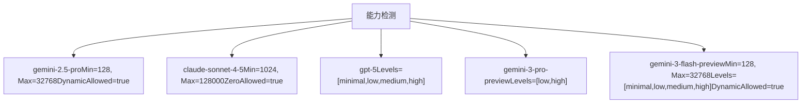
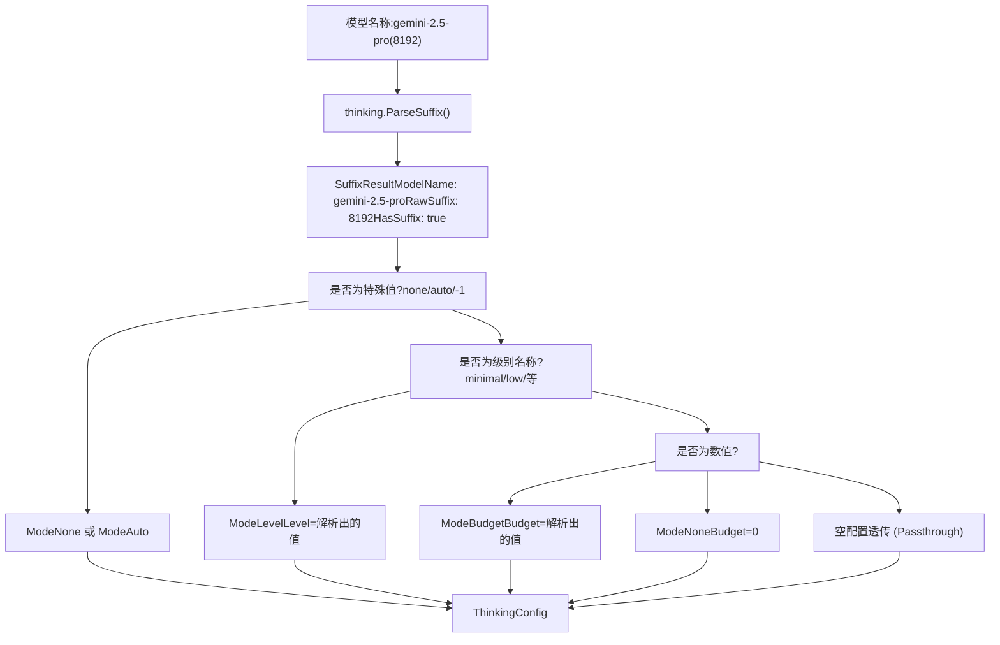
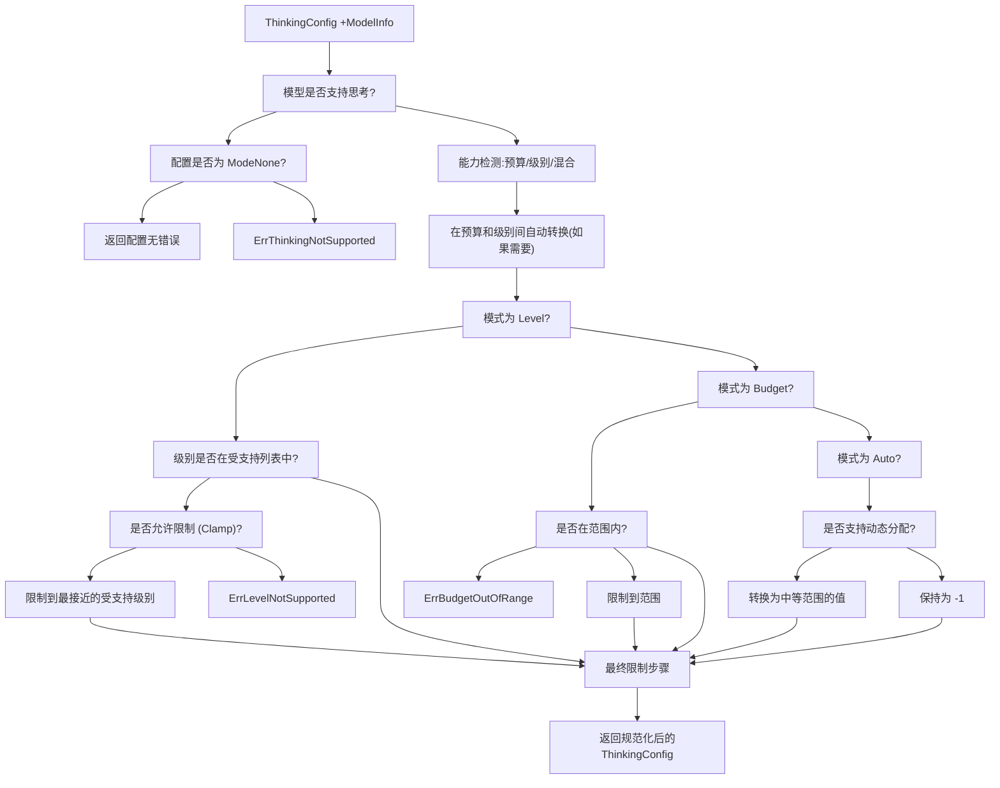
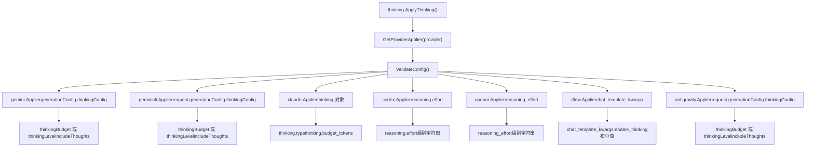

# 思考与推理配置

相关源文件

-   [internal/api/handlers/management/model\_definitions.go](https://github.com/router-for-me/CLIProxyAPI/blob/c66cb0af/internal/api/handlers/management/model_definitions.go)
-   [internal/config/oauth\_model\_alias\_migration.go](https://github.com/router-for-me/CLIProxyAPI/blob/c66cb0af/internal/config/oauth_model_alias_migration.go)
-   [internal/config/oauth\_model\_alias\_migration\_test.go](https://github.com/router-for-me/CLIProxyAPI/blob/c66cb0af/internal/config/oauth_model_alias_migration_test.go)
-   [internal/config/oauth\_model\_alias\_test.go](https://github.com/router-for-me/CLIProxyAPI/blob/c66cb0af/internal/config/oauth_model_alias_test.go)
-   [internal/logging/global\_logger.go](https://github.com/router-for-me/CLIProxyAPI/blob/c66cb0af/internal/logging/global_logger.go)
-   [internal/registry/model\_definitions\_static\_data.go](https://github.com/router-for-me/CLIProxyAPI/blob/c66cb0af/internal/registry/model_definitions_static_data.go)
-   [internal/runtime/executor/payload\_helpers.go](https://github.com/router-for-me/CLIProxyAPI/blob/c66cb0af/internal/runtime/executor/payload_helpers.go)
-   [internal/thinking/apply.go](https://github.com/router-for-me/CLIProxyAPI/blob/c66cb0af/internal/thinking/apply.go)
-   [internal/thinking/provider/iflow/apply.go](https://github.com/router-for-me/CLIProxyAPI/blob/c66cb0af/internal/thinking/provider/iflow/apply.go)
-   [internal/thinking/types.go](https://github.com/router-for-me/CLIProxyAPI/blob/c66cb0af/internal/thinking/types.go)
-   [internal/thinking/validate.go](https://github.com/router-for-me/CLIProxyAPI/blob/c66cb0af/internal/thinking/validate.go)
-   [internal/util/claude\_model.go](https://github.com/router-for-me/CLIProxyAPI/blob/c66cb0af/internal/util/claude_model.go)
-   [internal/util/claude\_model\_test.go](https://github.com/router-for-me/CLIProxyAPI/blob/c66cb0af/internal/util/claude_model_test.go)
-   [internal/watcher/diff/oauth\_model\_alias.go](https://github.com/router-for-me/CLIProxyAPI/blob/c66cb0af/internal/watcher/diff/oauth_model_alias.go)
-   [sdk/translator/registry.go](https://github.com/router-for-me/CLIProxyAPI/blob/c66cb0af/sdk/translator/registry.go)
-   [test/thinking\_conversion\_test.go](https://github.com/router-for-me/CLIProxyAPI/blob/c66cb0af/test/thinking_conversion_test.go)

本文档记录了系统扩展的思考与推理配置能力，该能力支持对 AI 模型推理深度和预算分配的控制。思考系统提供了一个统一的接口，用于配置跨多个供应商（Gemini, Claude, OpenAI/Codex, iFlow, Antigravity）的推理参数，并具备自动验证、格式转换和模型能力强制执行功能。

有关通用模型配置和选择，请参阅[模型注册与选择](/router-for-me/CLIProxyAPI/3.6-model-registry-and-selection)。有关请求有效负载的默认值和覆盖，请参阅[有效负载配置规则](/router-for-me/CLIProxyAPI/5.4-payload-configuration-rules)。有关跨对话轮次的签名缓存和 Claude 思考块验证，请参阅[签名缓存与思考验证](/router-for-me/CLIProxyAPI/8.8-signature-cache-and-thinking-validation)。

## 概览

思考配置系统允许用户控制 AI 模型在生成响应之前为推理分配多少计算预算。不同的供应商支持不同的思考机制：

-   **基于预算 (Budget-based)**：Gemini, Claude, Antigravity 使用令牌预算（例如 8192 tokens）。
-   **基于级别 (Level-based)**：OpenAI, Codex 使用离散的尝试级别（minimal, low, medium, high, xhigh）。
-   **混合模式 (Hybrid)**：某些 Gemini 3 模型同时支持预算和级别。

系统自动在格式之间进行转换，并根据模型能力验证配置，当数值超出范围时进行智能限制（clamping）。

**配置方法**：

1.  模型名称后缀：`gemini-2.5-pro(8192)` 或 `gpt-5.2(medium)`。
2.  请求体 JSON：供应商特定的思考参数。
3.  默认有效负载规则：配置文件中的默认值。

**来源：** [internal/thinking/apply.go1-307](https://github.com/router-for-me/CLIProxyAPI/blob/c66cb0af/internal/thinking/apply.go#L1-L307) [internal/registry/model\_definitions\_static\_data.go1-122](https://github.com/router-for-me/CLIProxyAPI/blob/c66cb0af/internal/registry/model_definitions_static_data.go#L1-L122)

## 模型思考能力

### ThinkingSupport 结构

注册表中的每个模型都通过 `ThinkingSupport` 结构声明其思考能力：

```
type ThinkingSupport struct {    Min             int      // 最小令牌预算 (针对基于预算的模型)    Max             int      // 最大令牌预算 (针对基于预算的模型)    ZeroAllowed     bool     // 是否允许预算为 0 (禁用)    DynamicAllowed  bool     // 是否支持 auto/-1 (动态)    Levels          []string // 受支持的尝试级别 (针对基于级别的模型)}
```
### 模型能力分类


**能力检测逻辑**：

-   **仅限预算**：`Min > 0 || Max > 0`，未定义 `Levels`。
-   **仅限级别**：定义了 `Levels`，且 `Min == 0 && Max == 0`。
-   **混合模式**：同时定义了 `Levels` 和预算范围。

**来源：** [internal/registry/model\_definitions\_static\_data.go1-232](https://github.com/router-for-me/CLIProxyAPI/blob/c66cb0af/internal/registry/model_definitions_static_data.go#L1-L232) [internal/thinking/validate.go60-89](https://github.com/router-for-me/CLIProxyAPI/blob/c66cb0af/internal/thinking/validate.go#L60-L89)

### 示例模型配置

| 模型 | 类型 | 配置 |
| --- | --- | --- |
| `gemini-2.5-pro` | 预算 | Min=128, Max=32768, DynamicAllowed=true |
| `gemini-2.5-flash` | 预算 | Min=0, Max=24576, ZeroAllowed=true, DynamicAllowed=true |
| `gemini-2.5-flash-lite` | 预算 | Min=0, Max=24576, ZeroAllowed=true, DynamicAllowed=true |
| `gemini-3-pro-preview` | 混合 | Min=128, Max=32768, Levels=\[low,high\], DynamicAllowed=true |
| `gemini-3-flash-preview` | 混合 | Min=128, Max=32768, Levels=\[minimal,low,medium,high\], DynamicAllowed=true |
| `claude-sonnet-4-5-20250929` | 预算 | Min=1024, Max=128000, ZeroAllowed=true, DynamicAllowed=false |
| `claude-haiku-4-5-20251001` | 预算 | Min=1024, Max=128000, ZeroAllowed=true, DynamicAllowed=false |
| `claude-3-5-haiku-20241022` | 无 | 不支持思考 |
| `gpt-5` | 级别 | Levels=\[minimal,low,medium,high\] |
| `gpt-5.2` | 级别 | Levels=\[none,low,medium,high,xhigh\] |

**来源：** [internal/registry/model\_definitions\_static\_data.go6-122](https://github.com/router-for-me/CLIProxyAPI/blob/c66cb0af/internal/registry/model_definitions_static_data.go#L6-L122) [internal/registry/model\_definitions\_static\_data.go126-232](https://github.com/router-for-me/CLIProxyAPI/blob/c66cb0af/internal/registry/model_definitions_static_data.go#L126-L232) [internal/registry/model\_definitions\_static\_data.go674-788](https://github.com/router-for-me/CLIProxyAPI/blob/c66cb0af/internal/registry/model_definitions_static_data.go#L674-L788)

## 配置模式与语法

### ThinkingConfig 结构

```
type ThinkingConfig struct {    Mode   ThinkingMode   // none, budget, level, auto    Budget int            // 令牌预算 (0, -1, 或正整数)    Level  ThinkingLevel  // 尝试级别 (minimal, low, medium, high, xhigh)}
```
### 模式类型

| 模式 | 描述 | 预算值 | 级别值 |
| --- | --- | --- | --- |
| `ModeNone` | 禁用思考 | 0 | 空 |
| `ModeBudget` | 指定令牌预算 | \> 0 | 空 |
| `ModeLevel` | 指定尝试级别 | 0 | 有效的级别 |
| `ModeAuto` | 动态/自动分配 | \-1 | 空 |

**来源：** [internal/thinking/types.go1-50](https://github.com/router-for-me/CLIProxyAPI/blob/c66cb0af/internal/thinking/types.go#L1-L50)

### 模型名称后缀语法

系统支持通过括号记法的模型名称后缀进行思考配置：

```
model-name(thinking-value)
```
**后缀值类型**：

| 语法 | 模式 | 示例 | 描述 |
| --- | --- | --- | --- |
| `(none)` | None | `gemini-2.5-pro(none)` | 禁用思考 |
| `(auto)` 或 `(-1)` | Auto | `gemini-2.5-pro(auto)` | 动态分配 |
| `(minimal)`, `(low)`, `(medium)`, `(high)`, `(xhigh)` | Level | `gpt-5.2(high)` | 尝试级别 |
| `(1234)` | Budget | `gemini-2.5-pro(8192)` | 令牌预算 |
| `(0)` | None | `claude-sonnet-4-5(0)` | 显式禁用 |

**解析优先级** (在 `parseSuffixToConfig` 中)：

1.  特殊值：`none`, `auto`, `-1`
2.  级别名称：`minimal`, `low`, `medium`, `high`, `xhigh`
3.  数值：正整数或 0

**来源：** [internal/thinking/parse.go1-150](https://github.com/router-for-me/CLIProxyAPI/blob/c66cb0af/internal/thinking/parse.go#L1-L150) [internal/thinking/apply.go202-241](https://github.com/router-for-me/CLIProxyAPI/blob/c66cb0af/internal/thinking/apply.go#L202-L241)

### 后缀解析流程


**来源：** [internal/thinking/parse.go1-150](https://github.com/router-for-me/CLIProxyAPI/blob/c66cb0af/internal/thinking/parse.go#L1-L150) [internal/thinking/apply.go202-241](https://github.com/router-for-me/CLIProxyAPI/blob/c66cb0af/internal/thinking/apply.go#L202-L241)

## 验证与规范化

### 验证管道


**来源：** [internal/thinking/validate.go38-155](https://github.com/router-for-me/CLIProxyAPI/blob/c66cb0af/internal/thinking/validate.go#L38-L155)

### 限制 (Clamping) 逻辑

**预算限制** (`clampBudget` 函数)：

-   低于 `Min` 的值 → 限制为 `Min`。
-   高于 `Max` 的值 → 限制为 `Max`。
-   当 `ZeroAllowed=false` 时的 `0` → 限制为 `Min`。
-   `-1` (auto) → 不限制，直接透传。

**级别限制** (`clampLevel` 函数)：

-   使用标准级别排序：`minimal` < `low` < `medium` < `high` < `xhigh`。
-   按距离找到最接近的受支持级别。
-   若距离相等，优先选择较低级别。
-   示例：模型支持 `[low, high]`，请求 `medium` → 限制为 `low`。

**中位值转换** (针对 `DynamicAllowed=false` 时的 `auto`)：

-   仅限级别的模型：转换为 `LevelMedium`。
-   基于预算的模型：转换为 `(Min + Max) / 2`。

**来源：** [internal/thinking/validate.go167-378](https://github.com/router-for-me/CLIProxyAPI/blob/c66cb0af/internal/thinking/validate.go#L167-L378)

## 供应商特定的应用

### 供应商应用器架构


**来源：** [internal/thinking/apply.go1-307](https://github.com/router-for-me/CLIProxyAPI/blob/c66cb0af/internal/thinking/apply.go#L1-L307) [internal/thinking/provider/](https://github.com/router-for-me/CLIProxyAPI/blob/c66cb0af/internal/thinking/provider/)

### 供应商应用详情

| 供应商 | 路径 | 预算格式 | 级别格式 | includeThoughts |
| --- | --- | --- | --- | --- |
| `gemini` | `generationConfig.thinkingConfig` | `thinkingBudget: int` | `thinkingLevel: string` | `includeThoughts: bool` |
| `gemini-cli` | `request.generationConfig.thinkingConfig` | `thinkingBudget: int` | `thinkingLevel: string` | `includeThoughts: bool` |
| `antigravity` | `request.generationConfig.thinkingConfig` | `thinkingBudget: int` | `thinkingLevel: string` | `includeThoughts: bool` |
| `claude` | `thinking` | `budget_tokens: int` | 不适用 | 不适用 |
| `codex` | `reasoning` | 不适用 | `effort: string` | 不适用 |
| `openai` | 根节点 | 不适用 | `reasoning_effort: string` | 不适用 |
| `iflow` | `chat_template_kwargs` | 不适用 | 不适用 | 不适用 |

**特殊处理**：

-   **Gemini 系列** (`gemini`, `gemini-cli`, `antigravity`)：
    -   预算：设置 `thinkingBudget` 为该值，`includeThoughts=true`。
    -   级别：设置 `thinkingLevel` 为级别字符串，`includeThoughts=true`。
    -   自动 (-1)：设置 `thinkingBudget=-1`，`includeThoughts=true`。
    -   None 且预算 > 0：设置预算，`includeThoughts=false`。
-   **Claude**：
    -   预算：设置 `thinking.type="enabled"`, `thinking.budget_tokens=value`。
    -   None：设置 `thinking.type="disabled"`, 省略 `budget_tokens`。
    -   自动：设置 `thinking.type="enabled"`, `thinking.budget_tokens=-1`。
-   **OpenAI/Codex**：
    -   级别：设置 `reasoning_effort` 或 `reasoning.effort` 为级别字符串。
    -   None：完全省略推理配置。
-   **iFlow**：
    -   将级别/预算转换为布尔值：`chat_template_kwargs.enable_thinking=true/false`。
    -   仅支持启用/禁用，无精细控制。

**来源：** [internal/thinking/provider/gemini/applier.go](https://github.com/router-for-me/CLIProxyAPI/blob/c66cb0af/internal/thinking/provider/gemini/applier.go) [internal/thinking/provider/claude/applier.go](https://github.com/router-for-me/CLIProxyAPI/blob/c66cb0af/internal/thinking/provider/claude/applier.go) [internal/thinking/provider/codex/applier.go](https://github.com/router-for-me/CLIProxyAPI/blob/c66cb0af/internal/thinking/provider/codex/applier.go) [internal/thinking/provider/openai/applier.go](https://github.com/router-for-me/CLIProxyAPI/blob/c66cb0af/internal/thinking/provider/openai/applier.go) [internal/thinking/provider/iflow/applier.go](https://github.com/router-for-me/CLIProxyAPI/blob/c66cb0af/internal/thinking/provider/iflow/applier.go)

> **注意**：针对 Claude 多轮对话思考的签名缓存 —— 包括 `SignatureCache`、`CacheSignature`、`GetCachedSignature` 和 `skip_thought_signature_validator` 哨兵值 —— 请参阅[签名缓存与思考验证](/router-for-me/CLIProxyAPI/8.8-signature-cache-and-thinking-validation)。

## 配置优先级与后缀行为

### 优先级顺序

当存在多个配置源时，系统遵循以下优先级（从高到低）：

1.  **模型名称后缀**：`gemini-2.5-pro(8192)`。
2.  **请求体 JSON**：供应商特定的思考参数。
3.  **有效负载默认规则**：配置文件中的默认值（参见[有效负载配置规则](/router-for-me/CLIProxyAPI/8.8-signature-cache-and-thinking-validation)）。

**后缀优先级实现** (在 `ApplyThinking` 中)：

```
if suffixResult.HasSuffix {    config = parseSuffixToConfig(suffixResult.RawSuffix, providerFormat, model)    // 后缀配置覆盖请求体} else {    config = extractThinkingConfig(body, providerFormat)}
```
**来源：** [internal/thinking/apply.go136-165](https://github.com/router-for-me/CLIProxyAPI/blob/c66cb0af/internal/thinking/apply.go#L136-L165)

### 严格 vs 宽松验证

验证的严格程度取决于配置源：

**严格模式** (满足以下条件时启用)：

-   配置来自请求体 (`fromSuffix=false`)。
-   属于同一个供应商家族 (`fromFormat == toFormat` 或两者均为 Gemini 系列)。

**宽松模式** (满足以下条件时启用)：

-   配置来自模型后缀 (`fromSuffix=true`)。
-   跨供应商翻译（例如 OpenAI → Gemini）。

**区别**：

-   **严格**：超出范围的预算会返回 `ErrBudgetOutOfRange`。
-   **宽松**：超出范围的预算会被静默地限制（clamped）到有效范围内。

**来源：** [internal/thinking/validate.go56-129](https://github.com/router-for-me/CLIProxyAPI/blob/c66cb0af/internal/thinking/validate.go#L56-L129)

## 示例配置

### 示例 1: Gemini 基于预算的思考

**通过模型后缀**：

```
gemini-2.5-pro(8192)
```
**通过请求体**：

```
{  "model": "gemini-2.5-pro",  "contents": [...],  "generationConfig": {    "thinkingConfig": {      "thinkingBudget": 8192,      "includeThoughts": true    }  }}
```
**验证**：

-   模型支持范围：Min=128, Max=32768, DynamicAllowed=true。
-   预算 8192 在范围内 → 原样接受。

### 示例 2: 禁用模式下的 Claude 思考

**通过模型后缀**：

```
claude-sonnet-4-5(none)
```
**通过请求体**：

```
{  "model": "claude-sonnet-4-5",  "messages": [...],  "thinking": {    "type": "disabled"  }}
```
**验证**：

-   模式变为 `ModeNone`。
-   输出：`thinking.type="disabled"`, 无 `budget_tokens` 字段。

### 示例 3: OpenAI 基于级别的思考

**通过模型后缀**：

```
gpt-5.2(high)
```
**通过请求体**：

```
{  "model": "gpt-5.2",  "messages": [...],  "reasoning_effort": "high"}
```
**验证**：

-   模型支持级别：Levels=\[none,low,medium,high,xhigh\]。
-   级别 "high" 在受支持列表中 → 接受。

### 示例 4: 跨供应商的预算到级别转换

**请求**：OpenAI 格式到 Codex 供应商

```
gpt-5(8192)
```
**处理过程**：

1.  解析后缀：`ModeBudget`, `Budget=8192`。
2.  检测目标模型能力：仅限级别，Levels=\[minimal,low,medium,high\]。
3.  将预算转换为级别：`8192` → `LevelMedium`（标准转换）。
4.  限制级别：`medium` 在受支持列表中 → 无需限制。
5.  应用配置：`reasoning.effort="medium"`。

### 示例 5: 禁用动态分配时的自动模式 (Auto Mode)

**请求**：Gemini 3 Pro Preview (两者均支持)

```
gemini-3-pro-preview(auto)
```
**处理过程**：

1.  解析后缀：`ModeAuto`。
2.  模型支持：Levels=\[low,high\], Min=128, Max=32768, DynamicAllowed=true。
3.  允许自动：保持 `Budget=-1`。
4.  应用配置：`thinkingBudget=-1`, `includeThoughts=true`。

**反例**：禁用动态分配且仅限级别的模型

```
gpt-5(auto)
```
**处理过程**：

1.  解析后缀：`ModeAuto`。
2.  模型支持：Levels=\[minimal,low,medium,high\], 无预算范围，DynamicAllowed=false。
3.  转换为中位值：`ModeLevel`, `Level=LevelMedium`。
4.  应用配置：`reasoning_effort="medium"`。

**来源：** [test/thinking\_conversion\_test.go42-717](https://github.com/router-for-me/CLIProxyAPI/blob/c66cb0af/test/thinking_conversion_test.go#L42-L717)

## 用户定义的模型

对于通过 `config.yaml` 配置的模型（兼容 OpenAI 的端点、自定义供应商），思考配置会**跳过验证**并直接应用，以便让上游服务执行验证。

**检测**：`ModelInfo` 中 `UserDefined=true` 的模型或未知模型（`ModelInfo` 为 nil）。

**行为**：

-   不检查能力。
-   不执行限制或转换。
-   直接将配置应用到请求体。
-   为了格式兼容性，仍然会执行级别到预算的转换。

**来源：** [internal/thinking/apply.go43-48](https://github.com/router-for-me/CLIProxyAPI/blob/c66cb0af/internal/thinking/apply.go#L43-L48) [internal/thinking/apply.go243-306](https://github.com/router-for-me/CLIProxyAPI/blob/c66cb0af/internal/thinking/apply.go#L243-L306)

## 错误处理

### 错误类型

| 错误代码 | 触发条件 | 示例 |
| --- | --- | --- |
| `ErrThinkingNotSupported` | 模型不支持思考 | 为 `claude-haiku-4-5` 请求思考模式 |
| `ErrLevelNotSupported` | 级别不在模型的受支持列表中 | 为具有 `[low,high]` 的模型请求 `xhigh` |
| `ErrBudgetOutOfRange` | 预算超出最小值/最大值 (仅限严格模式) | 为最大值为 32768 的模型请求 200000 |
| `ErrUnknownLevel` | 无效的级别字符串 | 级别字符串不匹配标准级别 |

**错误响应**：原始请求体保持不变并返回，允许上游服务处理或拒绝该请求。

**来源：** [internal/thinking/errors.go1-50](https://github.com/router-for-me/CLIProxyAPI/blob/c66cb0af/internal/thinking/errors.go#L1-L50) [internal/thinking/apply.go168-179](https://github.com/router-for-me/CLIProxyAPI/blob/c66cb0af/internal/thinking/apply.go#L168-L179)

## 诊断日志记录

思考系统在关键决策点发出结构化调试日志：

**日志字段**：

-   `provider`：目标供应商格式
-   `model`：模型名称
-   `mode`：当前思考模式 (budget/level/auto/none)
-   `budget`：预算值
-   `level`：级别值
-   `original_mode`：转换前的模式
-   `original_value`：限制前的值
-   `clamped_to`：限制后的值
-   `min`, `max`：模型能力边界

**示例日志条目**：

```
[DEBUG] thinking: config from model suffix | provider=gemini model=gemini-2.5-pro(8192) mode=budget budget=8192
[DEBUG] thinking: budget clamped | provider=gemini model=gemini-2.5-pro original_value=64000 clamped_to=32768 min=128 max=32768
[DEBUG] thinking: mode converted, dynamic not allowed | provider=codex model=gpt-5 original_mode=auto clamped_to=medium
[WARN] thinking: validation failed | provider=openai model=gpt-5 error="level \"xhigh\" not supported, valid levels: minimal, low, medium, high"
```
**来源：** [internal/thinking/validate.go173-378](https://github.com/router-for-me/CLIProxyAPI/blob/c66cb0af/internal/thinking/validate.go#L173-L378) [internal/thinking/apply.go122-196](https://github.com/router-for-me/CLIProxyAPI/blob/c66cb0af/internal/thinking/apply.go#L122-L196)

---

**引用的关键文件**：

-   [internal/thinking/apply.go1-307](https://github.com/router-for-me/CLIProxyAPI/blob/c66cb0af/internal/thinking/apply.go#L1-L307) —— 主应用逻辑和供应商路由
-   [internal/thinking/validate.go1-379](https://github.com/router-for-me/CLIProxyAPI/blob/c66cb0af/internal/thinking/validate.go#L1-L379) —— 验证、限制和转换逻辑
-   [internal/thinking/parse.go1-150](https://github.com/router-for-me/CLIProxyAPI/blob/c66cb0af/internal/thinking/parse.go#L1-L150) —— 后缀解析和提取
-   [internal/thinking/types.go1-100](https://github.com/router-for-me/CLIProxyAPI/blob/c66cb0af/internal/thinking/types.go#L1-L100) —— 核心类型定义
-   [internal/registry/model\_definitions.go1-1200](https://github.com/router-for-me/CLIProxyAPI/blob/c66cb0af/internal/registry/model_definitions.go#L1-L1200) —— 模型能力声明
-   [internal/cache/signature\_cache.go1-196](https://github.com/router-for-me/CLIProxyAPI/blob/c66cb0af/internal/cache/signature_cache.go#L1-L196) —— Claude 的签名缓存
-   [internal/translator/antigravity/claude/antigravity\_claude\_request.go1-397](https://github.com/router-for-me/CLIProxyAPI/blob/c66cb0af/internal/translator/antigravity/claude/antigravity_claude_request.go#L1-L397) —— 带有签名的 Claude 请求翻译
-   [internal/translator/antigravity/claude/antigravity\_claude\_response.go1-524](https://github.com/router-for-me/CLIProxyAPI/blob/c66cb0af/internal/translator/antigravity/claude/antigravity_claude_response.go#L1-L524) —— 带有签名累积的 Claude 响应翻译
-   [test/thinking\_conversion\_test.go1-1500](https://github.com/router-for-me/CLIProxyAPI/blob/c66cb0af/test/thinking_conversion_test.go#L1-L1500) —— 演示所有转换场景的全面测试用例
