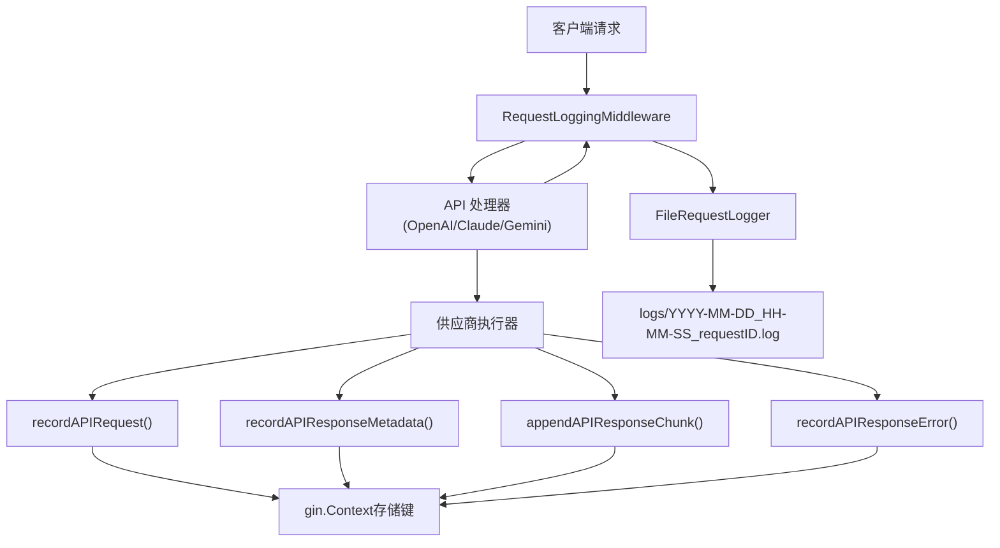
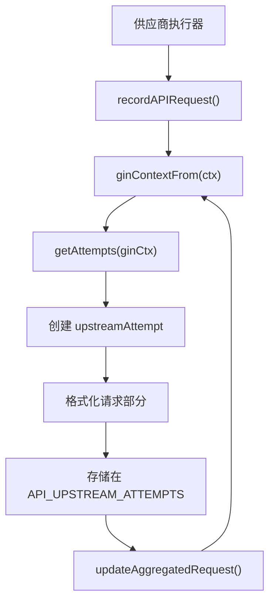
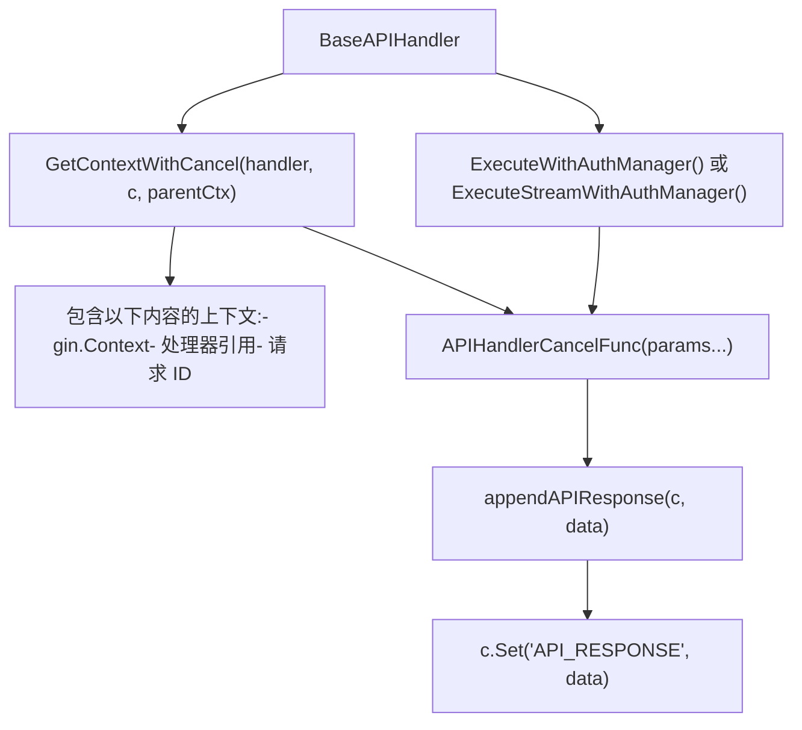

# 请求与响应日志

相关源文件

-   [internal/api/middleware/request\_logging.go](https://github.com/router-for-me/CLIProxyAPI/blob/c66cb0af/internal/api/middleware/request_logging.go)
-   [internal/api/middleware/response\_writer.go](https://github.com/router-for-me/CLIProxyAPI/blob/c66cb0af/internal/api/middleware/response_writer.go)
-   [internal/logging/gin\_logger.go](https://github.com/router-for-me/CLIProxyAPI/blob/c66cb0af/internal/logging/gin_logger.go)
-   [internal/logging/gin\_logger\_test.go](https://github.com/router-for-me/CLIProxyAPI/blob/c66cb0af/internal/logging/gin_logger_test.go)
-   [internal/logging/request\_logger.go](https://github.com/router-for-me/CLIProxyAPI/blob/c66cb0af/internal/logging/request_logger.go)
-   [internal/runtime/executor/logging\_helpers.go](https://github.com/router-for-me/CLIProxyAPI/blob/c66cb0af/internal/runtime/executor/logging_helpers.go)
-   [sdk/api/handlers/gemini/gemini-cli\_handlers.go](https://github.com/router-for-me/CLIProxyAPI/blob/c66cb0af/sdk/api/handlers/gemini/gemini-cli_handlers.go)

CLIProxyAPI 实现了一个详细的请求和响应日志系统，用于捕获面向客户端的 HTTP 事务以及向上游供应商发起的 API 交互。请求日志记录由 `request-log` 配置字段控制，默认禁用以最小化性能开销。

## 概览

日志系统捕获以下三类数据：

1.  **客户端请求** —— 来自客户端的入站 HTTP 请求（标头、正文、方法、路径）。
2.  **上游尝试** —— 每次供应商 API 调用，包括身份验证详情、重试尝试和响应。
3.  **最终响应** —— 发送回客户端的响应。

所有日志数据都会写入 `logs/` 目录中带有时间戳的文件。每个请求都会获得一个唯一的请求 ID，以便跨日志条目进行关联。

使用情况统计和令牌消耗跟踪由使用情况子系统单独处理（参见页面 8.5）。

**来源：** [internal/api/server.go59-65](https://github.com/router-for-me/CLIProxyAPI/blob/c66cb0af/internal/api/server.go#L59-L65) [internal/api/server.go210-224](https://github.com/router-for-me/CLIProxyAPI/blob/c66cb0af/internal/api/server.go#L210-L224)

---

## 配置

### 启用请求日志记录

请求日志记录由 `config.yaml` 中的 `request-log` 字段控制：

```
# 启用详细的请求/响应日志记录到文件request-log: true # 限制保留的错误日志文件数量（当 request-log 为 false 时）error-logs-max-files: 10
```
当 `request-log` 为 `true` 时，所有请求都会记录到 `logs/` 目录中带时间戳的文件中。当为 `false` 时，仅将错误响应（4xx/5xx 状态码）记录到单独的错误日志文件中。

`error-logs-max-files` 设置控制在禁用完整请求日志记录时保留多少个错误日志文件。超过限制时，最旧的文件将被自动删除。

**来源：** [internal/config/config.go62](https://github.com/router-for-me/CLIProxyAPI/blob/c66cb0af/internal/config/config.go#L62-L62) [config.example.yaml246-250](https://github.com/router-for-me/CLIProxyAPI/blob/c66cb0af/config.example.yaml#L246-L250)

### 调试模式

`debug` 配置选项影响日志的详细程度，但不影响请求日志记录：

```
# 为应用程序日志启用调试级日志记录（与 request-log 独立）debug: true
```
调试模式增加了应用程序日志（通过 `logging-to-file` 写入 stdout 或日志文件）的详细程度，但不影响仅由 `request-log` 控制的请求/响应捕获。

**来源：** [internal/config/config.go45](https://github.com/router-for-me/CLIProxyAPI/blob/c66cb0af/internal/config/config.go#L45-L45) [config.example.yaml40-41](https://github.com/router-for-me/CLIProxyAPI/blob/c66cb0af/config.example.yaml#L40-L41)

### 日志文件位置

日志文件写入相对于配置文件位置的 `logs/` 目录。该目录解析逻辑如下：

1.  如果通过 `util.WritablePath()` 获得了可写基准路径，日志将写入 `<base>/logs/`。
2.  否则，日志将写入相对于配置文件所在目录的 `logs/` 目录。

**来源：** [internal/api/server.go59-65](https://github.com/router-for-me/CLIProxyAPI/blob/c66cb0af/internal/api/server.go#L59-L65)

---

## 请求日志架构

日志系统通过 Gin 上下文存储和中间件集成到 HTTP 请求管道中：

**标题：请求日志数据流**


**来源：** [internal/api/server.go210-224](https://github.com/router-for-me/CLIProxyAPI/blob/c66cb0af/internal/api/server.go#L210-L224) [internal/runtime/executor/logging\_helpers.go49-180](https://github.com/router-for-me/CLIProxyAPI/blob/c66cb0af/internal/runtime/executor/logging_helpers.go#L49-L180)

## 上下文存储键

请求和响应数据使用标准键存储在 Gin 上下文中：

| 上下文键 | 类型 | 用途 |
| --- | --- | --- |
| `API_UPSTREAM_ATTEMPTS` | `[]*upstreamAttempt` | 所有上游供应商尝试的数组 |
| `API_REQUEST` | `[]byte` | 聚合后的上游请求部分 |
| `API_RESPONSE` | `[]byte` | 聚合后的上游响应部分 |
| `API_RESPONSE_ERROR` | `[]*interfaces.ErrorMessage` | 处理器执行过程中的错误消息 |

这些键在执行器日志辅助函数中被定义为常量：

```
const (    apiAttemptsKey = "API_UPSTREAM_ATTEMPTS"    apiRequestKey  = "API_REQUEST"    apiResponseKey = "API_RESPONSE")
```
**来源：** [internal/runtime/executor/logging\_helpers.go18-22](https://github.com/router-for-me/CLIProxyAPI/blob/c66cb0af/internal/runtime/executor/logging_helpers.go#L18-L22)

---

## 处理器上下文中的响应捕获

### GetContextWithCancel 模式

`BaseAPIHandler.GetContextWithCancel()` 函数创建了一个集成了响应日志记录且具有取消功能的上下文：

> **[Mermaid sequence]**
> *(图表结构无法解析)*

该取消函数的签名是 `APIHandlerCancelFunc func(params ...interface{})`，它接受可选的响应数据用于日志记录。

**来源：** [sdk/api/handlers/handlers.go239-308](https://github.com/router-for-me/CLIProxyAPI/blob/c66cb0af/sdk/api/handlers/handlers.go#L239-L308)

### appendAPIResponse 函数

`appendAPIResponse()` 函数将响应数据存储或追加到 Gin 上下文中：

```
func appendAPIResponse(c *gin.Context, data []byte) {    if c == nil || len(data) == 0 {        return    }        if existing, exists := c.Get("API_RESPONSE"); exists {        if existingBytes, ok := existing.([]byte); ok && len(existingBytes) > 0 {            // 使用换行符分隔并追加            combined := make([]byte, 0, len(existingBytes)+len(data)+1)            combined = append(combined, existingBytes...)            if existingBytes[len(existingBytes)-1] != '\n' {                combined = append(combined, '\n')            }            combined = append(combined, data...)            c.Set("API_RESPONSE", combined)            return        }    }        c.Set("API_RESPONSE", bytes.Clone(data))}
```
该函数处理流式传输场景下的增量响应累积，此时会捕获多个数据块。

**来源：** [sdk/api/handlers/handlers.go358-377](https://github.com/router-for-me/CLIProxyAPI/blob/c66cb0af/sdk/api/handlers/handlers.go#L358-L377)

---

## 上游尝试跟踪

### 记录上游请求

`recordAPIRequest()` 函数捕获外向的供应商 API 调用：


每次尝试都被分配一个顺序索引，并格式化包含：

-   时间戳
-   上游 URL
-   HTTP 方法
-   认证详情（供应商、认证 ID、标签、类型）
-   请求标头
-   请求正文

**来源：** [internal/runtime/executor/logging\_helpers.go50-94](https://github.com/router-for-me/CLIProxyAPI/blob/c66cb0af/internal/runtime/executor/logging_helpers.go#L50-L94)

### 记录响应元数据

`recordAPIResponseMetadata()` 函数捕获 HTTP 状态和标头：

```
func recordAPIResponseMetadata(ctx context.Context, cfg *config.Config, status int, headers http.Header) {    if cfg == nil || !cfg.RequestLog {        return    }    ginCtx := ginContextFrom(ctx)    if ginCtx == nil {        return    }    attempts, attempt := ensureAttempt(ginCtx)    ensureResponseIntro(attempt)        if status > 0 && !attempt.statusWritten {        attempt.response.WriteString(fmt.Sprintf("Status: %d\n", status))        attempt.statusWritten = true    }    if !attempt.headersWritten {        attempt.response.WriteString("Headers:\n")        writeHeaders(attempt.response, headers)        attempt.headersWritten = true        attempt.response.WriteString("\n")    }        updateAggregatedResponse(ginCtx, attempts)}
```
**来源：** [internal/runtime/executor/logging\_helpers.go97-120](https://github.com/router-for-me/CLIProxyAPI/blob/c66cb0af/internal/runtime/executor/logging_helpers.go#L97-L120)

### 追加响应分块

`appendAPIResponseChunk()` 函数累积流式响应数据：

```
func appendAPIResponseChunk(ctx context.Context, cfg *config.Config, chunk []byte) {    if cfg == nil || !cfg.RequestLog {        return    }    data := bytes.TrimSpace(bytes.Clone(chunk))    if len(data) == 0 {        return    }    ginCtx := ginContextFrom(ctx)    if ginCtx == nil {        return    }    attempts, attempt := ensureAttempt(ginCtx)    ensureResponseIntro(attempt)        // 如果是第一个分块，写入正文头        if !attempt.bodyStarted {        attempt.response.WriteString("Body:\n")        attempt.bodyStarted = true    }    // 使用双换行符分隔分块    if attempt.bodyHasContent {        attempt.response.WriteString("\n\n")    }    attempt.response.WriteString(string(data))    attempt.bodyHasContent = true        updateAggregatedResponse(ginCtx, attempts)}
```
**来源：** [internal/runtime/executor/logging\_helpers.go148-180](https://github.com/router-for-me/CLIProxyAPI/blob/c66cb0af/internal/runtime/executor/logging_helpers.go#L148-L180)

### upstreamAttempt 数据结构

每次上游尝试都维护一份用于增量构建响应的状态：

```
type upstreamAttempt struct {    index                int              // 顺序尝试编号    request              string           // 格式化后的请求部分    response             *strings.Builder // 累积的响应内容    responseIntroWritten bool             // 已写入一次头部    statusWritten        bool             // 已写入状态行    headersWritten       bool             // 已写入标头    bodyStarted          bool             // 正文部分已启动    bodyHasContent       bool             // 正文具有实际内容    errorWritten         bool             // 已写入错误消息}
```
**来源：** [internal/runtime/executor/logging\_helpers.go37-47](https://github.com/router-for-me/CLIProxyAPI/blob/c66cb0af/internal/runtime/executor/logging_helpers.go#L37-L47)

### 多尝试跟踪

系统为每次重试尝试维护独立的日志部分：

> **[Mermaid sequence]**
> *(图表结构无法解析)*

**来源：** [internal/runtime/executor/logging\_helpers.go49-145](https://github.com/router-for-me/CLIProxyAPI/blob/c66cb0af/internal/runtime/executor/logging_helpers.go#L49-L145) [internal/runtime/executor/logging\_helpers.go224-257](https://github.com/router-for-me/CLIProxyAPI/blob/c66cb0af/internal/runtime/executor/logging_helpers.go#L224-L257)

### 身份验证信息格式化

`formatAuthInfo()` 函数格式化上游请求日志中的身份验证详情，并对敏感数据进行脱敏处理：

| 字段 | 来源 | 脱敏处理 |
| --- | --- | --- |
| `provider` | `upstreamRequestLog.Provider` | 无 |
| `auth_id` | `upstreamRequestLog.AuthID` | 无 |
| `label` | `upstreamRequestLog.AuthLabel` | 无 |
| `type` | `upstreamRequestLog.AuthType` | 无 |
| `value` | `upstreamRequestLog.AuthValue` | 使用 `util.HideAPIKey()` 脱敏 API 密钥 |

输出示例：

```
Auth: provider=gemini, auth_id=abc123, label=prod-key, type=api_key, value=AIza...xyz
Auth: provider=claude, auth_id=def456, label=oauth-account, type=oauth
```
API 密钥会被脱敏，仅显示前 4 位和后 4 位字符，以防止在日志文件中泄露凭据。

**来源：** [internal/runtime/executor/logging\_helpers.go285-319](https://github.com/router-for-me/CLIProxyAPI/blob/c66cb0af/internal/runtime/executor/logging_helpers.go#L285-L319)

---

## FileRequestLogger 实现

### 日志记录器初始化

`FileRequestLogger` 由默认请求日志记录器工厂创建：

```
func defaultRequestLoggerFactory(cfg *config.Config, configPath string) logging.RequestLogger {    configDir := filepath.Dir(configPath)    if base := util.WritablePath(); base != "" {        return logging.NewFileRequestLogger(cfg.RequestLog, filepath.Join(base, "logs"), configDir, cfg.ErrorLogsMaxFiles)    }    return logging.NewFileRequestLogger(cfg.RequestLog, "logs", configDir, cfg.ErrorLogsMaxFiles)}
```
该记录器通过 `RequestLoggingMiddleware` 注册到 Gin 引擎：

```
engine.Use(middleware.RequestLoggingMiddleware(requestLogger))
```
**来源：** [internal/api/server.go59-65](https://github.com/router-for-me/CLIProxyAPI/blob/c66cb0af/internal/api/server.go#L59-L65) [internal/api/server.go210-224](https://github.com/router-for-me/CLIProxyAPI/blob/c66cb0af/internal/api/server.go#L210-L224)

### 动态启用/禁用

`FileRequestLogger` 支持通过 `SetEnabled(bool)` 方法进行动态启用/禁用。这使得热重载配置更改无需重启服务器即可生效：

```
if setter, ok := requestLogger.(interface{ SetEnabled(bool) }); ok {    toggle = setter.SetEnabled}
```
当 `request-log` 通过配置热重载更新时，中间件会调用此 setter 来立即启用或禁用日志记录。

**来源：** [internal/api/server.go220-223](https://github.com/router-for-me/CLIProxyAPI/blob/c66cb0af/internal/api/server.go#L220-L223) [internal/api/server.go877-882](https://github.com/router-for-me/CLIProxyAPI/blob/c66cb0af/internal/api/server.go#L877-L882)

---

## 日志文件格式

### 文件命名约定

日志文件遵循以下命名模式：

```
YYYY-MM-DD_HH-MM-SS_<requestID>.log
```
示例：

-   `2025-06-15_14-30-22_abc123.log`
-   `2025-06-15_14-30-23_def456.log`

每个文件都包含单次请求的完整事务日志，包括所有上游重试尝试。

### 日志文件结构

典型的日志文件包含以下部分：

```
============================================================
Request ID: abc123def456
Time: 2025-06-15 14:30:22
Method: POST
Path: /v1/chat/completions
Headers:
  Content-Type: application/json
  Authorization: Bearer sk-...
Body:
{"model":"claude-sonnet-4","messages":[...]}

============================================================
Upstream Request (Attempt 1)
Timestamp: 2025-06-15 14:30:22.123
URL: https://api.anthropic.com/v1/messages
Method: POST
Auth: provider=claude, auth_id=abc123, label=prod-key, type=api_key, value=sk-ant-...xyz
Headers:
  anthropic-version: 2023-06-01
  x-api-key: sk-ant-...xyz
Body:
{"model":"claude-sonnet-4-20241022","messages":[...]}

Response:
Status: 200
Headers:
  content-type: text/event-stream
Body:
data: {"type":"message_start",...}

data: {"type":"content_block_delta",...}

============================================================
Final Response
Status: 200
Headers:
  content-type: text/event-stream
Body:
data: {"id":"msg_...","type":"message_start",...}
```
**来源：** [internal/logging/request\_logger.go1-594](https://github.com/router-for-me/CLIProxyAPI/blob/c66cb0af/internal/logging/request_logger.go#L1-L594)

---

## 处理器集成

### 处理器上下文模式

处理器使用 `GetContextWithCancel()` 来创建与日志系统集成的上下文：


该取消函数的签名 `func(params ...interface{})` 接受可选的响应数据（字节切片、错误或字符串），这些数据将被存储在 `API_RESPONSE` 上下文键中。

**来源：** [sdk/api/handlers/handlers.go239-308](https://github.com/router-for-me/CLIProxyAPI/blob/c66cb0af/sdk/api/handlers/handlers.go#L239-L308) [sdk/api/handlers/handlers.go358-377](https://github.com/router-for-me/CLIProxyAPI/blob/c66cb0af/sdk/api/handlers/handlers.go#L358-L377)

### 错误响应跟踪

`LoggingAPIResponseError()` 方法累积错误响应：

```
func (h *BaseAPIHandler) LoggingAPIResponseError(ctx context.Context, err *interfaces.ErrorMessage) {    if h.Cfg.RequestLog {        if ginContext, ok := ctx.Value("gin").(*gin.Context); ok {            if apiResponseErrors, isExist := ginContext.Get("API_RESPONSE_ERROR"); isExist {                // 追加到现有的错误列表                slicesAPIResponseError := apiResponseErrors.([]*interfaces.ErrorMessage)                slicesAPIResponseError = append(slicesAPIResponseError, err)                ginContext.Set("API_RESPONSE_ERROR", slicesAPIResponseError)            } else {                // 创建新的错误列表                ginContext.Set("API_RESPONSE_ERROR", []*interfaces.ErrorMessage{err})            }        }    }}
```
错误以 `[]*interfaces.ErrorMessage` 形式存储在 `API_RESPONSE_ERROR` 上下文键中。

**来源：** [sdk/api/handlers/handlers.go706-720](https://github.com/router-for-me/CLIProxyAPI/blob/c66cb0af/sdk/api/handlers/handlers.go#L706-L720)

---

## 实现细节

### 线程安全

所有日志组件均使用适当的同步机制：

| 组件 | 机制 | 用途 |
| --- | --- | --- |
| `FileStreamingLogWriter` | 通道 + goroutine | 非阻塞异步写入 |
| `RequestStatistics` | `sync.RWMutex` | 并发读/写访问 |
| `usage.Manager` | `sync.Mutex` + 条件变量 | 队列协调 |
| `usageReporter` | `sync.Once` | 恰好一次发布 |

**来源：** [internal/logging/request\_logger.go558-573](https://github.com/router-for-me/CLIProxyAPI/blob/c66cb0af/internal/logging/request_logger.go#L558-L573) [internal/usage/logger\_plugin.go59-73](https://github.com/router-for-me/CLIProxyAPI/blob/c66cb0af/internal/usage/logger_plugin.go#L59-L73) [sdk/cliproxy/usage/manager.go43-56](https://github.com/router-for-me/CLIProxyAPI/blob/c66cb0af/sdk/cliproxy/usage/manager.go#L43-L56) [internal/runtime/executor/usage\_helpers.go18-27](https://github.com/router-for-me/CLIProxyAPI/blob/c66cb0af/internal/runtime/executor/usage_helpers.go#L18-L27)

### 错误处理

日志系统优雅地处理错误，不干扰请求处理：

-   **解压失败** —— 追加错误消息但保留原始响应。
-   **文件写入失败** —— 返回错误但不引起崩溃。
-   **通道溢出** —— 在非阻塞模式下静默丢弃数据块。
-   **插件 Panic** —— 在 `safeInvoke()` 中恢复并记录错误日志。

**来源：** [internal/logging/request\_logger.go173-177](https://github.com/router-for-me/CLIProxyAPI/blob/c66cb0af/internal/logging/request_logger.go#L173-L177) [internal/logging/request\_logger.go589-593](https://github.com/router-for-me/CLIProxyAPI/blob/c66cb0af/internal/logging/request_logger.go#L589-L593) [sdk/cliproxy/usage/manager.go157-164](https://github.com/router-for-me/CLIProxyAPI/blob/c66cb0af/sdk/cliproxy/usage/manager.go#L157-L164)

### 性能考虑

日志系统的设计旨在最小化对请求延迟的影响：

1.  **异步写入** —— 流分块由后台 goroutine 写入。
2.  **非阻塞通道** —— 缓冲区满时丢弃分块而非阻塞。
3.  **惰性初始化** —— 仅在需要时创建日志文件。
4.  **条件执行** —— 禁用日志记录时提前返回。
5.  **写时克隆 (Clone on write)** —— 在异步处理前复制数据以防止竞争。

**来源：** [internal/logging/request\_logger.go575-594](https://github.com/router-for-me/CLIProxyAPI/blob/c66cb0af/internal/logging/request_logger.go#L575-L594) [internal/runtime/executor/logging\_helpers.go152-155](https://github.com/router-for-me/CLIProxyAPI/blob/c66cb0af/internal/runtime/executor/logging_helpers.go#L152-L155)
