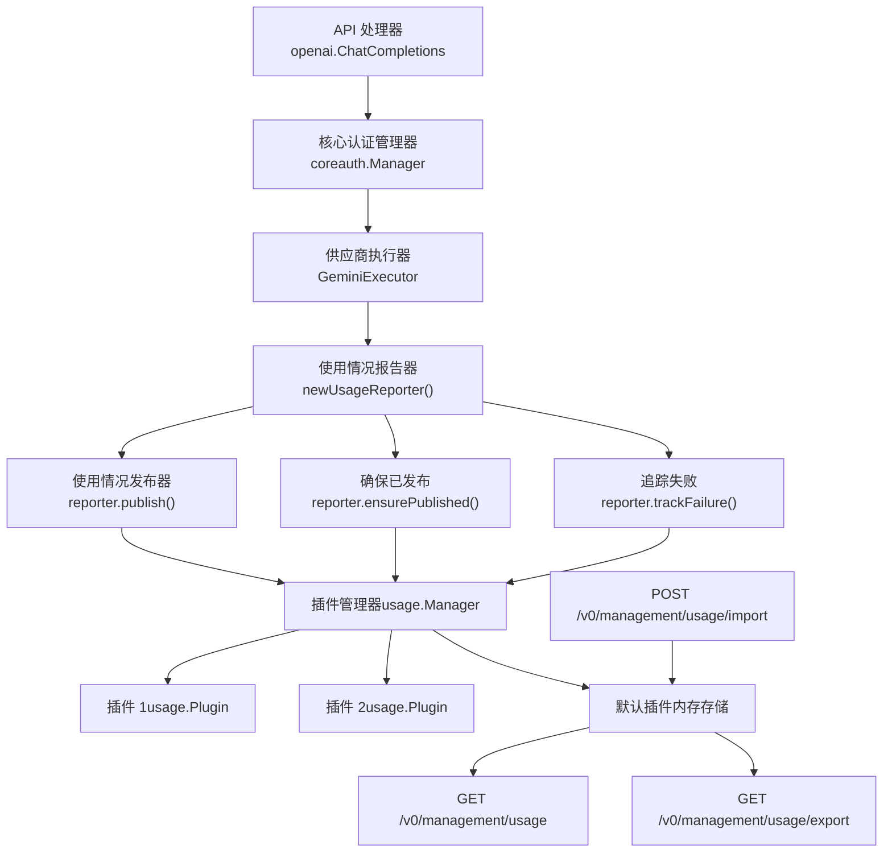
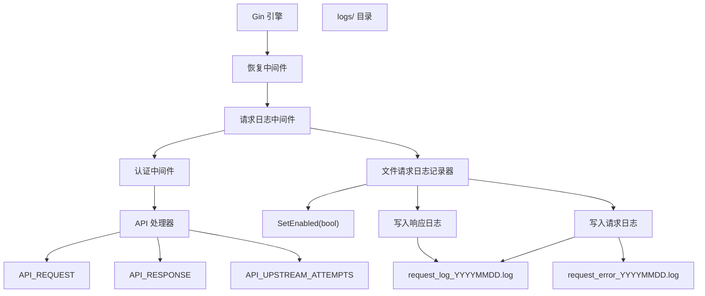
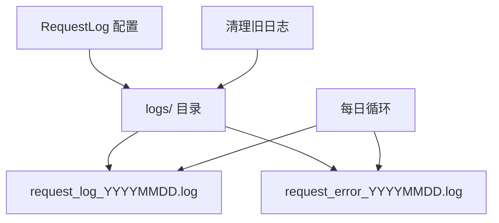
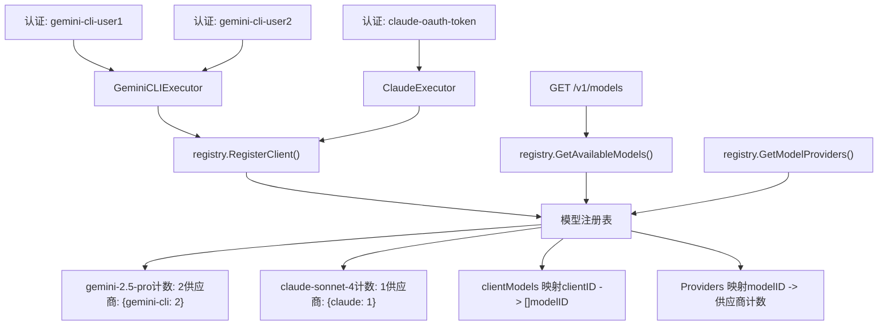

# 使用情况统计与监控

相关源文件

-   [internal/api/handlers/management/usage.go](https://github.com/router-for-me/CLIProxyAPI/blob/c66cb0af/internal/api/handlers/management/usage.go)
-   [internal/runtime/executor/usage\_helpers.go](https://github.com/router-for-me/CLIProxyAPI/blob/c66cb0af/internal/runtime/executor/usage_helpers.go)
-   [internal/usage/logger\_plugin.go](https://github.com/router-for-me/CLIProxyAPI/blob/c66cb0af/internal/usage/logger_plugin.go)
-   [sdk/cliproxy/usage/manager.go](https://github.com/router-for-me/CLIProxyAPI/blob/c66cb0af/sdk/cliproxy/usage/manager.go)

本页面描述了 CLI Proxy API 系统中的使用情况统计和监控功能，包括使用情况跟踪、请求/响应日志记录以及可观察性端点。

**范围**：本页面涵盖了内部使用情况统计聚合系统、用于调试的请求/响应日志记录，以及用于访问运行时指标的管理 API 端点。有关配置文件结构和热重载行为，请参阅[配置文件结构](/router-for-me/CLIProxyAPI/5.1-configuration-file-structure)。有关管理 API 身份验证和访问控制，请参阅[管理 API](/router-for-me/CLIProxyAPI/4.4-management-api)。

---

## 概览

CLI Proxy API 提供了两种主要的可观察性机制：

1.  **使用情况统计**：通过管理 API 暴露的 API 请求计数、令牌 (token) 消耗以及供应商级指标的内存聚合。
2.  **请求/响应日志记录**：为了调试和审计目的，对 HTTP 请求和响应进行的详细捕获。

这两个系统均可独立配置，并旨在在禁用时将开销降至最低。

**来源：** [internal/api/server.go29](https://github.com/router-for-me/CLIProxyAPI/blob/c66cb0af/internal/api/server.go#L29-L29) [internal/config/config.go52-53](https://github.com/router-for-me/CLIProxyAPI/blob/c66cb0af/internal/config/config.go#L52-L53) [sdk/cliproxy/service.go18](https://github.com/router-for-me/CLIProxyAPI/blob/c66cb0af/sdk/cliproxy/service.go#L18-L18)

---

## 使用情况统计系统

### 架构

使用情况统计系统采用基于插件的架构，使用数据从执行器 (executors) 流向报告器 (reporters)，再流向已注册的插件：


**来源：** [internal/runtime/executor/antigravity\_executor.go91-92](https://github.com/router-for-me/CLIProxyAPI/blob/c66cb0af/internal/runtime/executor/antigravity_executor.go#L91-L92) [sdk/cliproxy/service.go96-98](https://github.com/router-for-me/CLIProxyAPI/blob/c66cb0af/sdk/cliproxy/service.go#L96-L98) [internal/api/server.go478-480](https://github.com/router-for-me/CLIProxyAPI/blob/c66cb0af/internal/api/server.go#L478-L480)

---

### 配置

使用情况统计由 `usage-statistics-enabled` 配置标志控制：

```
# 设置为 false 时，禁用内存中的使用情况统计聚合usage-statistics-enabled: false
```
禁用后，使用数据将在发布层被丢弃，从而防止内存累积。

**配置更新**：`UpdateClients` 方法会检测 `UsageStatisticsEnabled` 的更改，并将其同步到全局使用管理器：

[internal/api/server.go875-882](https://github.com/router-for-me/CLIProxyAPI/blob/c66cb0af/internal/api/server.go#L875-L882)

**来源：** [internal/config/config.go52-53](https://github.com/router-for-me/CLIProxyAPI/blob/c66cb0af/internal/config/config.go#L52-L53) [internal/api/server.go875-882](https://github.com/router-for-me/CLIProxyAPI/blob/c66cb0af/internal/api/server.go#L875-L882)

---

### 使用情况报告器模式

每个执行器在请求处理开始时都会创建一个使用情况报告器：

> **[Mermaid sequence]**
> *(图表结构无法解析)*

报告器模式确保了即使在执行失败时也能捕获使用数据：

| 方法 | 用途 | 调用时机 |
| --- | --- | --- |
| `newUsageReporter()` | 创建带有上下文的报告器 | 执行开始时 |
| `reporter.publish()` | 发布解析出的使用详情 | 响应成功后 |
| `reporter.ensurePublished()` | 保证数据已发送 | 返回成功前 |
| `reporter.trackFailure()` | 发布失败事件 | 延迟触发，在发生错误时 |
| `reporter.publishFailure()` | 显式发布失败信息 | 手动错误处理 |

**来源：** [internal/runtime/executor/antigravity\_executor.go91-92](https://github.com/router-for-me/CLIProxyAPI/blob/c66cb0af/internal/runtime/executor/antigravity_executor.go#L91-L92) [internal/runtime/executor/antigravity\_executor.go157-161](https://github.com/router-for-me/CLIProxyAPI/blob/c66cb0af/internal/runtime/executor/antigravity_executor.go#L157-L161)

---

### 使用详情结构 (Usage Detail Structure)

`UsageDetail` 结构捕获了从供应商响应中解析出的逐请求指标：


供应商特定的解析器从响应中提取使用数据：

-   **Gemini/Antigravity**：提取 `usageMetadata.promptTokenCount`、`candidatesTokenCount`、`totalTokenCount`。
-   **Claude**：解析 `usage.input_tokens`、`output_tokens`、`thinking_tokens`。
-   **Codex**：提取 `usage.prompt_tokens`、`completion_tokens`、`total_tokens`。

**来源：** [internal/runtime/executor/antigravity\_executor.go157](https://github.com/router-for-me/CLIProxyAPI/blob/c66cb0af/internal/runtime/executor/antigravity_executor.go#L157-L157)

---

### 插件系统

外部代码可以注册使用情况插件来消费实时的使用数据：

```
// 来自 sdk/cliproxy/usage 的插件接口type Plugin interface {    OnUsage(detail UsageDetail)} // 通过 Service 注册service.RegisterUsagePlugin(myPlugin)
```
默认插件在内存中为管理 API 聚合统计信息。自定义插件可实现：

-   实时计费系统
-   外部指标导出 (Prometheus, StatsD)
-   配额强制执行
-   使用情况告警

**插件注册流程**：

[sdk/cliproxy/service.go96-98](https://github.com/router-for-me/CLIProxyAPI/blob/c66cb0af/sdk/cliproxy/service.go#L96-L98)

全局使用管理器并发地将事件分发给所有已注册的插件。

**来源：** [sdk/cliproxy/service.go96-98](https://github.com/router-for-me/CLIProxyAPI/blob/c66cb0af/sdk/cliproxy/service.go#L96-L98)

---

## 请求与响应日志记录

### 请求日志中间件

`RequestLoggingMiddleware` 捕获完整的 HTTP 事务用于调试：


**中间件注册**：

[internal/api/server.go208-222](https://github.com/router-for-me/CLIProxyAPI/blob/c66cb0af/internal/api/server.go#L208-L222)

请求日志记录器根据 `request-log` 配置标志有条件地创建，并位于恢复中间件之后、认证中间件之前。

**来源：** [internal/api/server.go208-222](https://github.com/router-for-me/CLIProxyAPI/blob/c66cb0af/internal/api/server.go#L208-L222)

---

### API 请求捕获

执行器使用将数据存储在 Gin 上下文中的辅助函数来记录上游 API 请求：

| 函数 | 用途 | 上下文键 | 存储的数据 |
| --- | --- | --- | --- |
| `recordAPIRequest()` | 存储外向请求详情 | `API_REQUEST` | URL, 方法, 标头, 正文, 认证元数据 |
| `recordAPIResponseMetadata()` | 捕获响应状态/标头 | `API_RESPONSE` | 状态码, 响应标头 |
| `recordAPIResponseError()` | 记录无 HTTP 响应时的错误 | `API_RESPONSE` | 错误消息, 时间戳 |
| `appendAPIResponseChunk()` | 流式传输响应体分块 | `API_RESPONSE` | 累积的响应正文 |

**多尝试跟踪**：当执行器重试请求（例如，回退 URL）时，每次尝试都会使用 `API_UPSTREAM_ATTEMPTS` 单独跟踪：

> **[Mermaid sequence]**
> *(图表结构无法解析)*

**来源：** [internal/runtime/executor/logging\_helpers.go49-94](https://github.com/router-for-me/CLIProxyAPI/blob/c66cb0af/internal/runtime/executor/logging_helpers.go#L49-L94) [internal/runtime/executor/logging\_helpers.go96-120](https://github.com/router-for-me/CLIProxyAPI/blob/c66cb0af/internal/runtime/executor/logging_helpers.go#L96-L120) [internal/runtime/executor/logging\_helpers.go122-145](https://github.com/router-for-me/CLIProxyAPI/blob/c66cb0af/internal/runtime/executor/logging_helpers.go#L122-L145)

---

### 上游请求日志结构

`upstreamRequestLog` 结构体捕获了调试所需的所有详情：

```
type upstreamRequestLog struct {    URL       string        // 完整的上游 URL    Method    string        // HTTP 方法    Headers   http.Header   // 请求标头 (敏感值已脱敏)    Body      []byte        // 请求正文    Provider  string        // 供应商标识符 (gemini, claude 等)    AuthID    string        // 认证凭证 ID    AuthLabel string        // 人类可读的认证标签    AuthType  string        // 认证类型 (oauth, api-key 等)    AuthValue string        // 已脱敏的认证值}
```
**标头脱敏**：敏感标头（如 `Authorization` 和 `x-goog-api-key`）会自动使用 `MaskSensitiveHeaderValue()` 进行脱敏：

[internal/util/provider.go203-216](https://github.com/router-for-me/CLIProxyAPI/blob/c66cb0af/internal/util/provider.go#L203-L216)

**来源：** [internal/runtime/executor/logging\_helpers.go24-35](https://github.com/router-for-me/CLIProxyAPI/blob/c66cb0af/internal/runtime/executor/logging_helpers.go#L24-L35)

---

### 日志文件管理

请求日志写入 `logs/` 目录下的循环文件中：


**日志轮转**：文件根据日期命名每日轮转一次。当配置了 `logs-max-total-size-mb` 时，若总大小超过限制，将删除最旧的文件：

[internal/config/config.go48-50](https://github.com/router-for-me/CLIProxyAPI/blob/c66cb0af/internal/config/config.go#L48-L50)

[internal/api/server.go858-873](https://github.com/router-for-me/CLIProxyAPI/blob/c66cb0af/internal/api/server.go#L858-L873)

**来源：** [internal/config/config.go48-50](https://github.com/router-for-me/CLIProxyAPI/blob/c66cb0af/internal/config/config.go#L48-L50) [internal/api/server.go858-873](https://github.com/router-for-me/CLIProxyAPI/blob/c66cb0af/internal/api/server.go#L858-L873)

---

## 管理 API 端点

### 使用情况统计端点

管理 API 为使用情况统计暴露了三个端点：

| 端点 | 方法 | 用途 | 响应格式 |
| --- | --- | --- | --- |
| `/v0/management/usage` | GET | 检索聚合统计信息 | 带有逐模型/供应商指标的 JSON |
| `/v0/management/usage/export` | GET | 导出完整的使用数据 | 使用情况事件的 JSON 数组 |
| `/v0/management/usage/import` | POST | 导入使用数据 | 带有导入计数的 JSON |

**路由注册**：

[internal/api/server.go478-480](https://github.com/router-for-me/CLIProxyAPI/blob/c66cb0af/internal/api/server.go#L478-L480)

**来源：** [internal/api/server.go478-480](https://github.com/router-for-me/CLIProxyAPI/blob/c66cb0af/internal/api/server.go#L478-L480)

---

### 使用情况端点响应结构

`GET /v0/management/usage` 端点返回按模型和供应商分组的聚合统计信息：

```
{  "statistics": {    "gemini-2.5-pro": {      "total_requests": 150,      "successful_requests": 148,      "failed_requests": 2,      "total_prompt_tokens": 45000,      "total_completion_tokens": 67000,      "total_tokens": 112000,      "providers": {        "gemini-cli": {          "requests": 100,          "tokens": 75000        },        "aistudio": {          "requests": 50,          "tokens": 37000        }      }    }  }}
```
---

### 导出/导入格式

导出端点返回用于外部处理的单个使用情况事件：

```
[  {    "timestamp": "2025-01-15T10:30:45Z",    "provider": "gemini-cli",    "model": "gemini-2.5-pro",    "auth_id": "gemini-cli-user@example.com",    "auth_label": "user@example.com",    "prompt_tokens": 150,    "completion_tokens": 300,    "total_tokens": 450,    "thinking_tokens": 0,    "success": true  }]
```
导入端点接受相同的格式，以便在重启后恢复使用历史或从另一个实例迁移数据。

**来源：** [internal/api/server.go478-480](https://github.com/router-for-me/CLIProxyAPI/blob/c66cb0af/internal/api/server.go#L478-L480)

---

### 请求日志端点

管理 API 提供了访问请求日志的端点：

| 端点 | 方法 | 用途 |
| --- | --- | --- |
| `/v0/management/logs` | GET | 列出可用的日志文件 |
| `/v0/management/logs` | DELETE | 删除所有日志文件 |
| `/v0/management/request-error-logs` | GET | 列出错误日志文件 |
| `/v0/management/request-error-logs/:name` | GET | 下载特定的错误日志 |
| `/v0/management/request-log-by-id/:id` | GET | 通过 ID 检索请求日志 |
| `/v0/management/request-log` | GET | 获取请求日志状态 |
| `/v0/management/request-log` | PUT/PATCH | 启用/禁用请求日志记录 |

**路由注册**：

[internal/api/server.go523-530](https://github.com/router-for-me/CLIProxyAPI/blob/c66cb0af/internal/api/server.go#L523-L530)

**来源：** [internal/api/server.go523-530](https://github.com/router-for-me/CLIProxyAPI/blob/c66cb0af/internal/api/server.go#L523-L530)

---

## 监控模型可用性

### 模型注册表

全局模型注册表实时追踪哪些供应商提供哪些模型：


**注册流程**：当通过 OAuth 或配置重载添加凭证时，服务会向全局注册表注册模型：

[sdk/cliproxy/service.go271-293](https://github.com/router-for-me/CLIProxyAPI/blob/c66cb0af/sdk/cliproxy/service.go#L271-L293)

**来源：** [internal/registry/model\_registry.go120-193](https://github.com/router-for-me/CLIProxyAPI/blob/c66cb0af/internal/registry/model_registry.go#L120-L193) [sdk/cliproxy/service.go271-293](https://github.com/router-for-me/CLIProxyAPI/blob/c66cb0af/sdk/cliproxy/service.go#L271-L293)

---

### 配额与冷却追踪

注册表按客户端和模型追踪“配额已超出”状态：

> **[Mermaid stateDiagram]**
> *(图表结构无法解析)*

**配额追踪方法**：

| 方法 | 用途 | 效果 |
| --- | --- | --- |
| `SetModelQuotaExceeded()` | 标记客户端针对某模型的配额已耗尽 | 若所有客户端均耗尽，则隐藏该模型 |
| `ClearModelQuotaExceeded()` | 冷却后清除配额标志 | 模型重新变为可用 |
| `GetAvailableModels()` | 检索未耗尽的模型 | 过滤掉完全超出配额的模型 |

**来源：** [internal/registry/model\_registry.go1-100](https://github.com/router-for-me/CLIProxyAPI/blob/c66cb0af/internal/registry/model_registry.go#L1-L100)

---

## 配置参考

### 使用情况统计设置

```
# 启用内存中的使用情况聚合usage-statistics-enabled: true # 启用详细的请求/响应日志记录到文件request-log: true # 将应用程序日志写入轮转文件logging-to-file: true # 日志文件的最大总大小 (MB)logs-max-total-size-mb: 1000
```
### 动态配置更新

所有日志记录和统计设置均支持通过配置文件更改或管理 API 进行热重载：

> **[Mermaid sequence]**
> *(图表结构无法解析)*

**配置更新处理器**：

[internal/api/server.go833-991](https://github.com/router-for-me/CLIProxyAPI/blob/c66cb0af/internal/api/server.go#L833-L991)

**来源：** [internal/config/config.go52-54](https://github.com/router-for-me/CLIProxyAPI/blob/c66cb0af/internal/config/config.go#L52-L54) [internal/api/server.go875-882](https://github.com/router-for-me/CLIProxyAPI/blob/c66cb0af/internal/api/server.go#L875-L882)

---

## 性能考虑

### 内存使用

| 组件 | 内存影响 | 缓解措施 |
| --- | --- | --- |
| 使用情况统计 | O(模型数 × 供应商数) | 通过 `usage-statistics-enabled: false` 禁用 |
| 请求日志记录 | 每个活动请求 O(请求大小) | 通过 `request-log: false` 禁用 |
| 请求日志记录器缓冲区 | 每个请求固定的开销 | 响应发送后即清除 |
| 日志文件 | 仅占用磁盘空间 | 通过 `logs-max-total-size-mb` 自动清理 |

### 商业模式 (Commercial Mode)

当 `commercial-mode: true` 时，不会注册请求日志中间件，从而消除了每个请求的内存开销：

[internal/api/server.go212-222](https://github.com/router-for-me/CLIProxyAPI/blob/c66cb0af/internal/api/server.go#L212-L222)

**来源：** [internal/api/server.go212-222](https://github.com/router-for-me/CLIProxyAPI/blob/c66cb0af/internal/api/server.go#L212-L222) [internal/config/config.go42-44](https://github.com/router-for-me/CLIProxyAPI/blob/c66cb0af/internal/config/config.go#L42-L44)

---

## 总结

CLI Proxy API 通过以下方式提供全面的可观察性：

1.  **使用情况统计**：基于插件的系统，提供实时使用情况聚合，并可通过管理 API 访问。
2.  **请求日志记录**：用于调试的详细 HTTP 事务捕获，包括多尝试回退追踪。
3.  **模型注册表**：实时监控模型的可用性和供应商的健康状态。
4.  **动态配置**：支持对所有日志和统计标志的热重载。

所有功能均旨在禁用时产生最小开销，并支持通过管理 API 进行生产部署。
