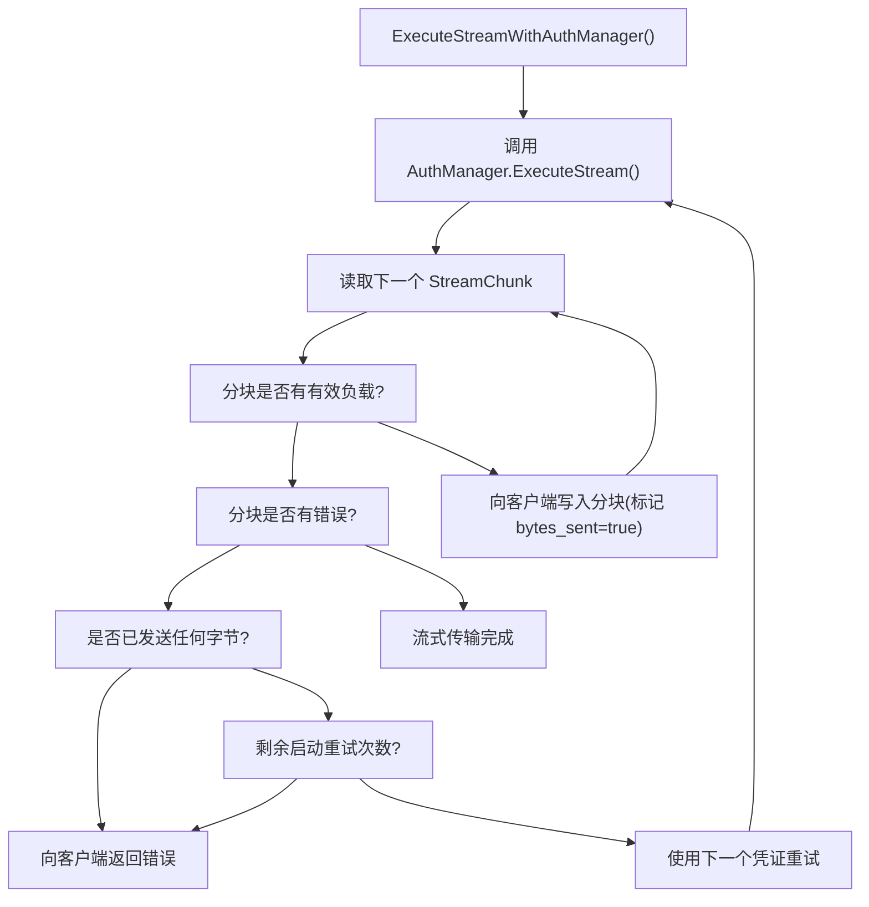

# 流式传输与保活 (Keep-Alive)

相关源文件

-   [config.example.yaml](https://github.com/router-for-me/CLIProxyAPI/blob/c66cb0af/config.example.yaml)
-   [internal/api/handlers/management/config\_basic.go](https://github.com/router-for-me/CLIProxyAPI/blob/c66cb0af/internal/api/handlers/management/config_basic.go)
-   [internal/api/handlers/management/config\_lists.go](https://github.com/router-for-me/CLIProxyAPI/blob/c66cb0af/internal/api/handlers/management/config_lists.go)
-   [internal/api/middleware/request\_logging\_test.go](https://github.com/router-for-me/CLIProxyAPI/blob/c66cb0af/internal/api/middleware/request_logging_test.go)
-   [internal/api/middleware/response\_writer\_test.go](https://github.com/router-for-me/CLIProxyAPI/blob/c66cb0af/internal/api/middleware/response_writer_test.go)
-   [internal/api/server.go](https://github.com/router-for-me/CLIProxyAPI/blob/c66cb0af/internal/api/server.go)
-   [internal/config/config.go](https://github.com/router-for-me/CLIProxyAPI/blob/c66cb0af/internal/config/config.go)
-   [internal/config/sdk\_config.go](https://github.com/router-for-me/CLIProxyAPI/blob/c66cb0af/internal/config/sdk_config.go)
-   [internal/runtime/executor/codex\_websockets\_executor.go](https://github.com/router-for-me/CLIProxyAPI/blob/c66cb0af/internal/runtime/executor/codex_websockets_executor.go)
-   [internal/watcher/watcher.go](https://github.com/router-for-me/CLIProxyAPI/blob/c66cb0af/internal/watcher/watcher.go)
-   [sdk/api/handlers/handlers.go](https://github.com/router-for-me/CLIProxyAPI/blob/c66cb0af/sdk/api/handlers/handlers.go)
-   [sdk/api/handlers/handlers\_stream\_bootstrap\_test.go](https://github.com/router-for-me/CLIProxyAPI/blob/c66cb0af/sdk/api/handlers/handlers_stream_bootstrap_test.go)
-   [sdk/api/handlers/header\_filter.go](https://github.com/router-for-me/CLIProxyAPI/blob/c66cb0af/sdk/api/handlers/header_filter.go)
-   [sdk/api/handlers/header\_filter\_test.go](https://github.com/router-for-me/CLIProxyAPI/blob/c66cb0af/sdk/api/handlers/header_filter_test.go)
-   [sdk/api/handlers/openai/openai\_responses\_websocket.go](https://github.com/router-for-me/CLIProxyAPI/blob/c66cb0af/sdk/api/handlers/openai/openai_responses_websocket.go)
-   [sdk/cliproxy/auth/conductor\_executor\_replace\_test.go](https://github.com/router-for-me/CLIProxyAPI/blob/c66cb0af/sdk/cliproxy/auth/conductor_executor_replace_test.go)
-   [sdk/cliproxy/service.go](https://github.com/router-for-me/CLIProxyAPI/blob/c66cb0af/sdk/cliproxy/service.go)
-   [test/amp\_management\_test.go](https://github.com/router-for-me/CLIProxyAPI/blob/c66cb0af/test/amp_management_test.go)

本页面涵盖了 CLIProxyAPI 用于在流式 (SSE) 和非流式 AI API 请求期间维持活动连接并防止过早超时的机制。它还记录了在嵌入式部署中使用的服务器级进程保活 (process keep-alive) 端点。

有关通用 HTTP 请求管道行为，请参阅 [3.2](/router-for-me/CLIProxyAPI/3.2-http-server-and-request-pipeline)。有关 WebSocket 特定的传输（Codex Responses API），请参阅 [8.7](/router-for-me/CLIProxyAPI/8.7-websocket-and-runtime-authentication)。

---

## 概览

CLIProxyAPI 管理三类不同的保活关注点：

| 关注点 | 触发条件 | 配置键 |
| --- | --- | --- |
| SSE 流式心跳 | 运行时间较长的流式响应 | `streaming.keepalive-seconds` |
| 流式启动重试 | 首字节发送前的瞬时上游错误 | `streaming.bootstrap-retries` |
| 非流式空行保活 | 运行时间较长的非流式响应 | `nonstream-keepalive-interval` |
| 进程保活端点 | 嵌入式/TUI 部署 | `WithKeepAliveEndpoint` 服务器选项 |

**配置位置：**

-   `streaming.keepalive-seconds` 和 `streaming.bootstrap-retries` 映射到 [internal/config/sdk\_config.go36-45](https://github.com/router-for-me/CLIProxyAPI/blob/c66cb0af/internal/config/sdk_config.go#L36-L45) 中的 `StreamingConfig`。
-   `nonstream-keepalive-interval` 映射到 [internal/config/sdk\_config.go32-33](https://github.com/router-for-me/CLIProxyAPI/blob/c66cb0af/internal/config/sdk_config.go#L32-L33) 中的 `NonStreamAliveInterval`。
-   进程保活端点通过 [internal/api/server.go97-106](https://github.com/router-for-me/CLIProxyAPI/blob/c66cb0af/internal/api/server.go#L97-L106) 中的 `WithKeepAliveEndpoint` 以编程方式注册。

**相关的 `config.yaml` 字段**（来自 [config.example.yaml93-99](https://github.com/router-for-me/CLIProxyAPI/blob/c66cb0af/config.example.yaml#L93-L99)）：

```
# 当 > 0 时，针对非流式响应每隔 N 秒发出空行，以防止空闲超时。nonstream-keepalive-interval: 0 # 流式行为 (SSE 保活 + 安全启动重试)。# streaming:#   keepalive-seconds: 15   # 默认: 0 (禁用)。<= 0 禁用保活。#   bootstrap-retries: 1    # 默认: 0 (禁用)。在发送首字节前的重试次数。
```
**来源：** [internal/config/sdk\_config.go1-45](https://github.com/router-for-me/CLIProxyAPI/blob/c66cb0af/internal/config/sdk_config.go#L1-L45) [config.example.yaml93-99](https://github.com/router-for-me/CLIProxyAPI/blob/c66cb0af/config.example.yaml#L93-L99)

---

## SSE 流式保活

当客户端请求流式响应时，上游 AI 供应商可能需要数秒才能发出第一个令牌。反向代理和负载均衡器可能会在此窗口期内关闭空闲连接。CLIProxyAPI 可以发出定期的 SSE 注释行来保持连接。

### 工作原理

[sdk/api/handlers/handlers.go144-155](https://github.com/router-for-me/CLIProxyAPI/blob/c66cb0af/sdk/api/handlers/handlers.go#L144-L155) 中的 `StreamingKeepAliveInterval` 读取 `cfg.Streaming.KeepAliveSeconds` 并将其作为 `time.Duration` 返回。返回值为 `0` 则禁用保活。

```
// sdk/api/handlers/handlers.go
func StreamingKeepAliveInterval(cfg *config.SDKConfig) time.Duration {
    seconds := defaultStreamingKeepAliveSeconds  // 0
    if cfg != nil {
        seconds = cfg.Streaming.KeepAliveSeconds
    }
    if seconds <= 0 {
        return 0
    }
    return time.Duration(seconds) * time.Second
}
```
`KeepAliveSeconds` 字段定义在 `StreamingConfig` 中 ([internal/config/sdk\_config.go36-45](https://github.com/router-for-me/CLIProxyAPI/blob/c66cb0af/internal/config/sdk_config.go#L36-L45))：

```
type StreamingConfig struct {    KeepAliveSeconds int `yaml:"keepalive-seconds,omitempty"`    BootstrapRetries int `yaml:"bootstrap-retries,omitempty"`}
```
流式处理器获取此间隔并启动一个定时器，在等待上游分块时每隔一个周期发出 SSE 注释行 (`: keep-alive\n\n`)。当上游发送实际数据时，保活定时器将停止。

**标题：SSE 流式保活数据流**

> **[Mermaid sequence]**
> *(图表结构无法解析)*

**来源：** [sdk/api/handlers/handlers.go50-55](https://github.com/router-for-me/CLIProxyAPI/blob/c66cb0af/sdk/api/handlers/handlers.go#L50-L55) [sdk/api/handlers/handlers.go144-155](https://github.com/router-for-me/CLIProxyAPI/blob/c66cb0af/sdk/api/handlers/handlers.go#L144-L155) [internal/config/sdk\_config.go36-45](https://github.com/router-for-me/CLIProxyAPI/blob/c66cb0af/internal/config/sdk_config.go#L36-L45)

---

## 流式启动重试逻辑 (Streaming Bootstrap Retry Logic)

某些上游身份验证失败仅在开启流式连接后才会显现 —— 上游发送的是错误分块而非数据。当 `streaming.bootstrap-retries` 大于 0 时，**只要尚未向客户端转发任何有效负载字节**，CLIProxyAPI 就被允许使用不同的凭证重试整个流式请求。

一旦向客户端写入了哪怕一个非错误分块，重试就不再安全（这会产生重复或损坏的输出）。

### 配置

[sdk/api/handlers/handlers.go170-180](https://github.com/router-for-me/CLIProxyAPI/blob/c66cb0af/sdk/api/handlers/handlers.go#L170-L180) 中的 `StreamingBootstrapRetries` 读取 `cfg.Streaming.BootstrapRetries`：

```
func StreamingBootstrapRetries(cfg *config.SDKConfig) int {    retries := defaultStreamingBootstrapRetries  // 0    if cfg != nil {        retries = cfg.Streaming.BootstrapRetries    }    if retries < 0 {        retries = 0    }    return retries}
```
### 启动重试边界规则

| 场景 | 是否允许重试？ |
| --- | --- |
| 第一个分块是错误（设置了 `StreamChunk.Err`，未写入有效负载） | 是，最多重试 `BootstrapRetries` 次 |
| 第一个分块有有效负载数据，后续分块是错误 | **否** —— 客户端已接收到字节 |
| 错误发生在最初的请求阶段（`ExecuteStream` 返回前） | 是 |

这已由 [sdk/api/handlers/handlers\_stream\_bootstrap\_test.go](https://github.com/router-for-me/CLIProxyAPI/blob/c66cb0af/sdk/api/handlers/handlers_stream_bootstrap_test.go) 中的测试执行器验证：

-   `failOnceStreamExecutor`：第一次调用返回错误分块，第二次成功。若 `BootstrapRetries: 1`，处理器将重试并交付有效负载。
-   `payloadThenErrorStreamExecutor`：发送一个 `partial` 有效负载分块，然后发送一个错误分块。由于已经发送了有效负载字节，**不会发生重试** —— 错误将原样传播。

**标题：`ExecuteStreamWithAuthManager` 中的启动重试决策逻辑**


**来源：** [sdk/api/handlers/handlers.go170-180](https://github.com/router-for-me/CLIProxyAPI/blob/c66cb0af/sdk/api/handlers/handlers.go#L170-L180) [sdk/api/handlers/handlers\_stream\_bootstrap\_test.go15-237](https://github.com/router-for-me/CLIProxyAPI/blob/c66cb0af/sdk/api/handlers/handlers_stream_bootstrap_test.go#L15-L237) [internal/config/sdk\_config.go41-44](https://github.com/router-for-me/CLIProxyAPI/blob/c66cb0af/internal/config/sdk_config.go#L41-L44)

---

## 非流式保活

非流式请求在向客户端写入之前会等待完整的上游响应。对于超大上下文或复杂的推理请求，这可能需要数十秒，从而导致代理超时。当设置了 `nonstream-keepalive-interval` 时，CLIProxyAPI 会在等待期间定期发出空白换行符。

### 实现：`StartNonStreamingKeepAlive`

[sdk/api/handlers/handlers.go394-438](https://github.com/router-for-me/CLIProxyAPI/blob/c66cb0af/sdk/api/handlers/handlers.go#L394-L438) 定义了 `StartNonStreamingKeepAlive`：

-   读取 `NonStreamingKeepAliveInterval(h.Cfg)` ([sdk/api/handlers/handlers.go157-168](https://github.com/router-for-me/CLIProxyAPI/blob/c66cb0af/sdk/api/handlers/handlers.go#L157-L168))。
-   如果间隔 `<= 0` 或响应写入器未实现 `http.Flusher`，则返回空操作。
-   启动一个带有 `time.Ticker` 的后台 goroutine，每个周期写入 `"\n"` 并调用 `flusher.Flush()`。
-   返回一个调用者**必须在写入最终响应体前调用**的 **stop 函数**。

请求处理器中的使用模式：

```
stopKeepAlive := h.StartNonStreamingKeepAlive(c, ctx)
// ... 等待上游响应 ...
stopKeepAlive()   // 必须在写入 JSON 正文前调用
c.JSON(200, response)
```
Stop 函数关闭一个通道并等待 (`sync.WaitGroup`) goroutine 退出后再返回，确保不会并发写入响应写入器。

**标题：`StartNonStreamingKeepAlive` Goroutine 生命周期**

> **[Mermaid sequence]**
> *(图表结构无法解析)*

**来源：** [sdk/api/handlers/handlers.go394-438](https://github.com/router-for-me/CLIProxyAPI/blob/c66cb0af/sdk/api/handlers/handlers.go#L394-L438) [sdk/api/handlers/handlers.go157-168](https://github.com/router-for-me/CLIProxyAPI/blob/c66cb0af/sdk/api/handlers/handlers.go#L157-L168) [internal/config/sdk\_config.go29-33](https://github.com/router-for-me/CLIProxyAPI/blob/c66cb0af/internal/config/sdk_config.go#L29-L33)

---

## 进程保活端点 (`/keep-alive`)

该机制与 SSE 保活无关。当 CLIProxyAPI 被嵌入到父进程（例如 TUI 应用程序）中时，它是服务器级的心跳端点。父进程定期 ping `/keep-alive`；如果 ping 停止到达，服务器会调用注册的超时回调（通常用于触发优雅关闭）。

### 注册

该功能是可选的。通过向 `NewServer` 传递 `WithKeepAliveEndpoint` 来启用：

[internal/api/server.go97-106](https://github.com/router-for-me/CLIProxyAPI/blob/c66cb0af/internal/api/server.go#L97-L106)：

```
func WithKeepAliveEndpoint(timeout time.Duration, onTimeout func()) ServerOption {    return func(cfg *serverOptionConfig) {        if timeout <= 0 || onTimeout == nil {            return        }        cfg.keepAliveEnabled = true        cfg.keepAliveTimeout = timeout        cfg.keepAliveOnTimeout = onTimeout    }}
```
`NewServer` 调用 `enableKeepAlive` ([internal/api/server.go688-702](https://github.com/router-for-me/CLIProxyAPI/blob/c66cb0af/internal/api/server.go#L688-L702))，它会：

1.  在 `Server` 结构体上存储超时时间和回调。
2.  创建 `keepAliveHeartbeat chan struct{}` 和 `keepAliveStop chan struct{}`。
3.  注册 `GET /keep-alive` → `handleKeepAlive`。
4.  启动 `watchKeepAlive` 作为 goroutine。

### 身份验证

如果服务器设置了 `localPassword`，`handleKeepAlive` ([internal/api/server.go704-724](https://github.com/router-for-me/CLIProxyAPI/blob/c66cb0af/internal/api/server.go#L704-L724)) 会使用 `Authorization: Bearer <token>` 标头（并回退到 `X-Local-Password` 标头）对请求进行恒定时间比较验证。密码无效或缺失的请求将收到 `401 Unauthorized`。

### 定时器逻辑

`watchKeepAlive` ([internal/api/server.go736-764](https://github.com/router-for-me/CLIProxyAPI/blob/c66cb0af/internal/api/server.go#L736-L764)) 运行一个初始化为 `keepAliveTimeout` 的 `time.Timer`。在每次循环迭代中：

| 事件 | 操作 |
| --- | --- |
| `timer.C` 触发 (超时) | 记录警告，调用 `keepAliveOnTimeout()`，返回 |
| 收到 `keepAliveHeartbeat` | 停止并重置定时器 |
| 收到 `keepAliveStop` | 干净地返回 (由 `Server.Stop` 调用) |

`signalKeepAlive` ([internal/api/server.go726-734](https://github.com/router-for-me/CLIProxyAPI/blob/c66cb0af/internal/api/server.go#L726-L734)) 对 `keepAliveHeartbeat` 执行非阻塞发送，因此快速的 ping 请求不会排队。

**标题：`watchKeepAlive` Goroutine 与 `/keep-alive` 端点**

> **[Mermaid sequence]**
> *(图表结构无法解析)*

### 关闭

`Server.Stop` ([internal/api/server.go825-842](https://github.com/router-for-me/CLIProxyAPI/blob/c66cb0af/internal/api/server.go#L825-L842)) 在调用 `server.Shutdown` 之前发送 `keepAliveStop` 信号，使得 `watchKeepAlive` 干净退出而不会触发超时回调。

**来源：** [internal/api/server.go97-106](https://github.com/router-for-me/CLIProxyAPI/blob/c66cb0af/internal/api/server.go#L97-L106) [internal/api/server.go688-764](https://github.com/router-for-me/CLIProxyAPI/blob/c66cb0af/internal/api/server.go#L688-L764) [internal/api/server.go825-842](https://github.com/router-for-me/CLIProxyAPI/blob/c66cb0af/internal/api/server.go#L825-L842)

---

## 配置参考

| `config.yaml` 键 | Go 字段 | 默认值 | 效果 |
| --- | --- | --- | --- |
| `streaming.keepalive-seconds` | `SDKConfig.Streaming.KeepAliveSeconds` | `0` (禁用) | 流式传输期间每隔 N 秒发出 SSE 注释行 |
| `streaming.bootstrap-retries` | `SDKConfig.Streaming.BootstrapRetries` | `0` (禁用) | 针对瞬时上游错误，在首字节发送前的最大重试次数 |
| `nonstream-keepalive-interval` | `SDKConfig.NonStreamAliveInterval` | `0` (禁用) | 在非流式等待期间每隔 N 秒发出空白换行符 |
| *(服务器选项)* | `serverOptionConfig.keepAliveTimeout` | 不适用 | `GET /keep-alive` 心跳端点的超时时间 |

`StreamingConfig` 定义在 [internal/config/sdk\_config.go36-45](https://github.com/router-for-me/CLIProxyAPI/blob/c66cb0af/internal/config/sdk_config.go#L36-L45) 中并嵌入在 `SDKConfig` 里。访问器函数 —— `StreamingKeepAliveInterval`、`StreamingBootstrapRetries`、`NonStreamingKeepAliveInterval` —— 均位于 [sdk/api/handlers/handlers.go144-180](https://github.com/router-for-me/CLIProxyAPI/blob/c66cb0af/sdk/api/handlers/handlers.go#L144-L180) 中，并由各协议处理器（`openai`、`claude`、`gemini`）在设置流式或非流式响应时调用。

**来源：** [internal/config/sdk\_config.go1-45](https://github.com/router-for-me/CLIProxyAPI/blob/c66cb0af/internal/config/sdk_config.go#L1-L45) [sdk/api/handlers/handlers.go50-55](https://github.com/router-for-me/CLIProxyAPI/blob/c66cb0af/sdk/api/handlers/handlers.go#L50-L55) [sdk/api/handlers/handlers.go144-180](https://github.com/router-for-me/CLIProxyAPI/blob/c66cb0af/sdk/api/handlers/handlers.go#L144-L180) [config.example.yaml93-99](https://github.com/router-for-me/CLIProxyAPI/blob/c66cb0af/config.example.yaml#L93-L99)
