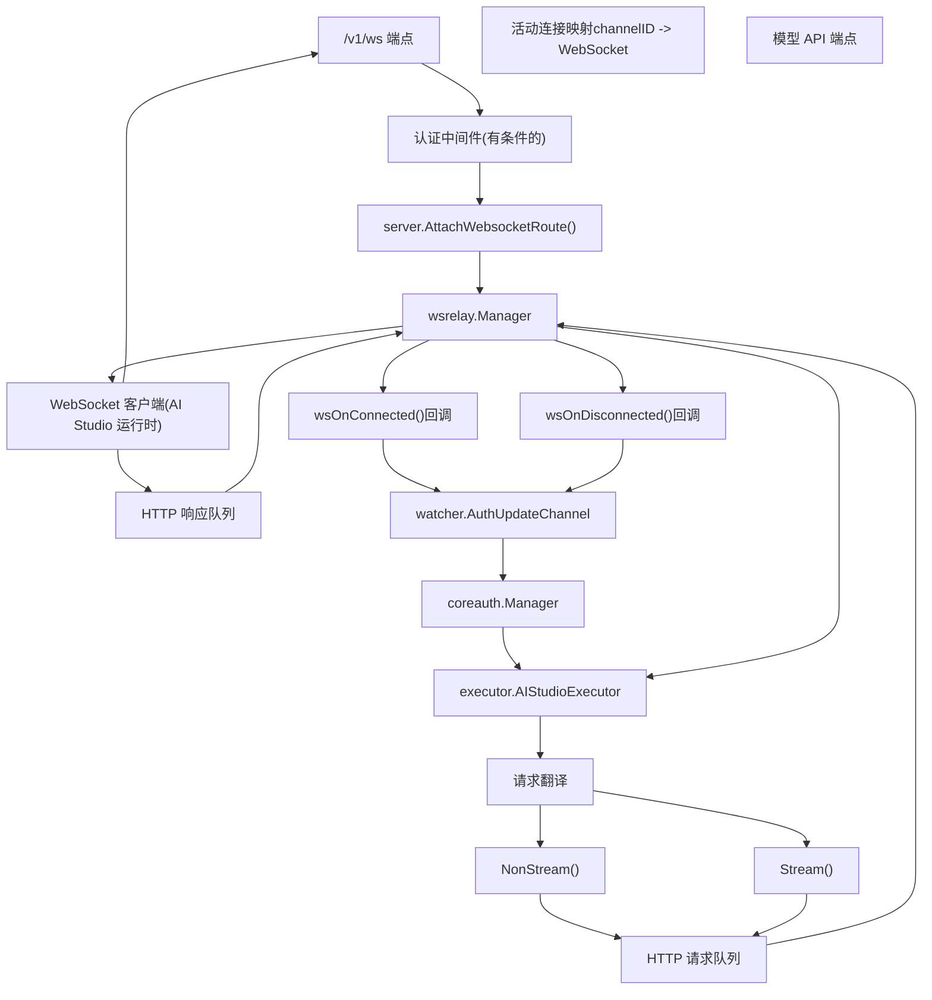
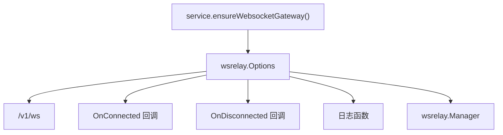
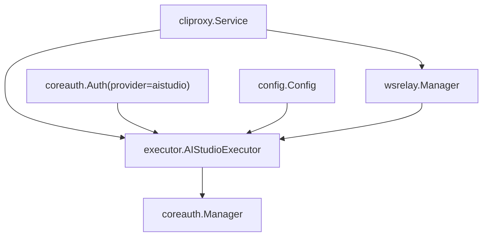
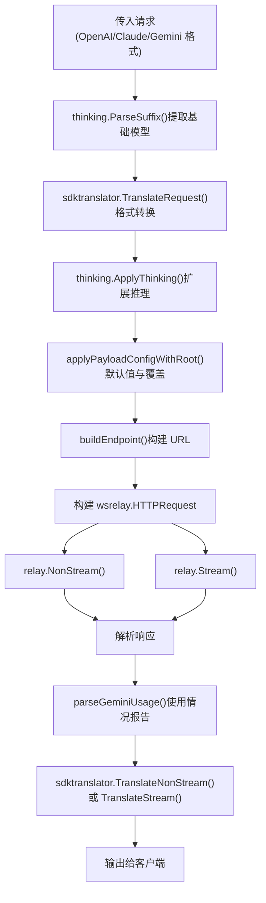
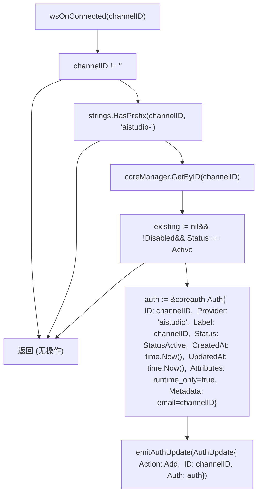
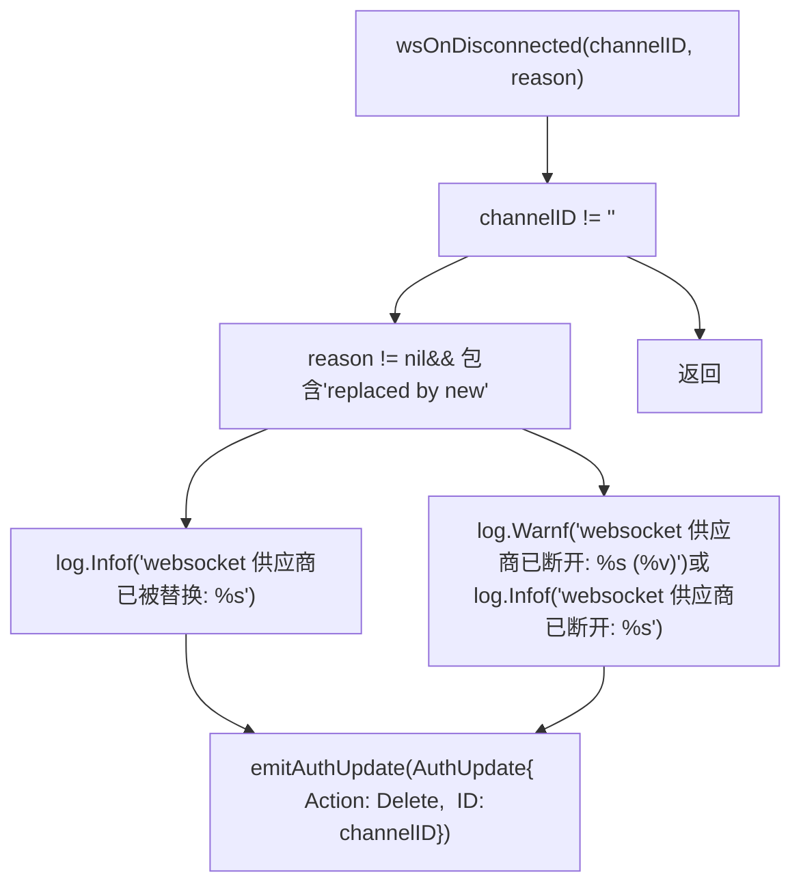
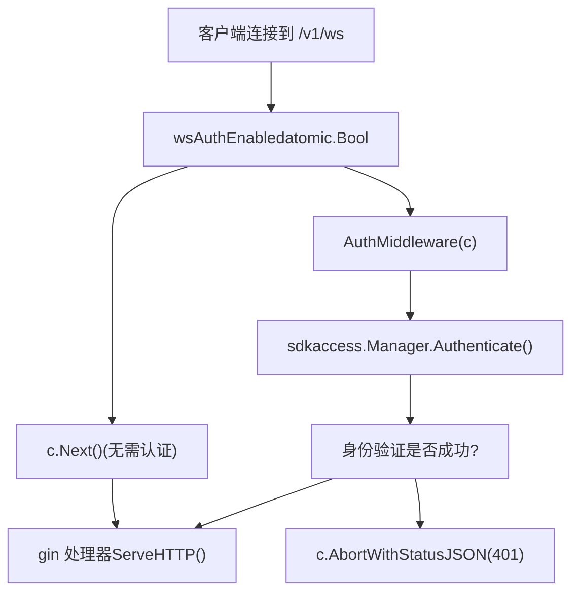
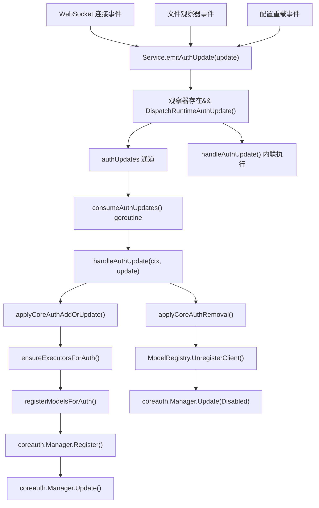
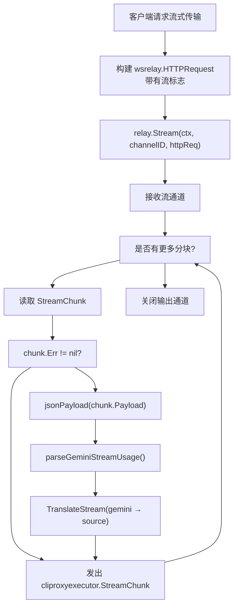
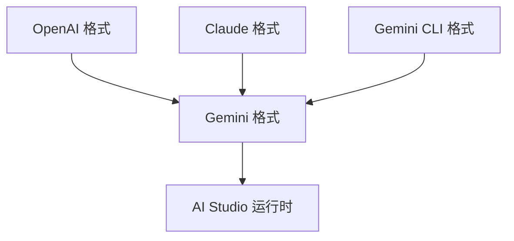

# WebSocket 与运行时身份验证

相关源文件

-   [config.example.yaml](https://github.com/router-for-me/CLIProxyAPI/blob/c66cb0af/config.example.yaml)
-   [internal/api/handlers/management/config\_basic.go](https://github.com/router-for-me/CLIProxyAPI/blob/c66cb0af/internal/api/handlers/management/config_basic.go)
-   [internal/api/handlers/management/config\_lists.go](https://github.com/router-for-me/CLIProxyAPI/blob/c66cb0af/internal/api/handlers/management/config_lists.go)
-   [internal/api/middleware/request\_logging\_test.go](https://github.com/router-for-me/CLIProxyAPI/blob/c66cb0af/internal/api/middleware/request_logging_test.go)
-   [internal/api/middleware/response\_writer\_test.go](https://github.com/router-for-me/CLIProxyAPI/blob/c66cb0af/internal/api/middleware/response_writer_test.go)
-   [internal/api/server.go](https://github.com/router-for-me/CLIProxyAPI/blob/c66cb0af/internal/api/server.go)
-   [internal/config/config.go](https://github.com/router-for-me/CLIProxyAPI/blob/c66cb0af/internal/config/config.go)
-   [internal/config/sdk\_config.go](https://github.com/router-for-me/CLIProxyAPI/blob/c66cb0af/internal/config/sdk_config.go)
-   [internal/runtime/executor/codex\_websockets\_executor.go](https://github.com/router-for-me/CLIProxyAPI/blob/c66cb0af/internal/runtime/executor/codex_websockets_executor.go)
-   [internal/watcher/watcher.go](https://github.com/router-for-me/CLIProxyAPI/blob/c66cb0af/internal/watcher/watcher.go)
-   [sdk/api/handlers/handlers.go](https://github.com/router-for-me/CLIProxyAPI/blob/c66cb0af/sdk/api/handlers/handlers.go)
-   [sdk/api/handlers/handlers\_stream\_bootstrap\_test.go](https://github.com/router-for-me/CLIProxyAPI/blob/c66cb0af/sdk/api/handlers/handlers_stream_bootstrap_test.go)
-   [sdk/api/handlers/header\_filter.go](https://github.com/router-for-me/CLIProxyAPI/blob/c66cb0af/sdk/api/handlers/header_filter.go)
-   [sdk/api/handlers/header\_filter\_test.go](https://github.com/router-for-me/CLIProxyAPI/blob/c66cb0af/sdk/api/handlers/header_filter_test.go)
-   [sdk/api/handlers/openai/openai\_responses\_websocket.go](https://github.com/router-for-me/CLIProxyAPI/blob/c66cb0af/sdk/api/handlers/openai/openai_responses_websocket.go)
-   [sdk/cliproxy/auth/conductor\_executor\_replace\_test.go](https://github.com/router-for-me/CLIProxyAPI/blob/c66cb0af/sdk/cliproxy/auth/conductor_executor_replace_test.go)
-   [sdk/cliproxy/service.go](https://github.com/router-for-me/CLIProxyAPI/blob/c66cb0af/sdk/cliproxy/service.go)
-   [test/amp\_management\_test.go](https://github.com/router-for-me/CLIProxyAPI/blob/c66cb0af/test/amp_management_test.go)

## 概览

WebSocket 网关允许外部客户端在运行时动态提供 AI 模型，而无需将凭证持久化到磁盘。当客户端建立 WebSocket 连接时，系统会自动创建一个仅限运行时的身份验证条目，其在路由和执行方面的行为与基于文件或 OAuth 的凭证完全一致。该机制为 AI Studio 集成提供了动力，外部进程可以通过双向隧道暴露模型端点。

**核心概念：**

-   **仅限运行时的凭证**：在连接时创建、在断开时移除的身份验证条目，永不持久化。
-   **基于通道的身份验证**：每个 WebSocket 连接都有一个唯一的用于路由的通道 ID。
-   **双向隧道**：HTTP 请求通过 WebSocket 序列化发送，响应以同样方式返回。
-   **动态供应商生命周期**：供应商根据连接状态出现或消失。

**相关文档：**

-   有关静态 OAuth 供应商，请参阅[身份验证设置](/router-for-me/CLIProxyAPI/2.3-authentication-setup)。
-   有关 OAuth 流程实现，请参阅[OAuth 流程架构](/router-for-me/CLIProxyAPI/7.1-oauth-flow-architecture)。
-   有关通用供应商集成，请参阅[供应商集成](/router-for-me/CLIProxyAPI/6-provider-integration)。
-   有关凭证路由和选择，请参阅[凭证路由与故障转移](/router-for-me/CLIProxyAPI/8.1-credential-routing-and-failover)。

---

## 系统架构

WebSocket 集成由三个主要组件组成：处理双向通信的 WebSocket 中继管理器、通过中继路由 API 请求的 AI Studio 执行器，以及在连接建立时动态创建身份验证条目的运行时供应商注册系统。

### 组件概览


**来源：**

-   [sdk/cliproxy/service.go200-269](https://github.com/router-for-me/CLIProxyAPI/blob/c66cb0af/sdk/cliproxy/service.go#L200-L269)
-   [internal/api/server.go428-463](https://github.com/router-for-me/CLIProxyAPI/blob/c66cb0af/internal/api/server.go#L428-L463)
-   [internal/runtime/executor/aistudio\_executor.go27-44](https://github.com/router-for-me/CLIProxyAPI/blob/c66cb0af/internal/runtime/executor/aistudio_executor.go#L27-L44)

---

## WebSocket 中继管理器 (Relay Manager)

`wsrelay.Manager` 组件维护活动的 WebSocket 连接，并通过它们隧道传输 HTTP 请求/响应。每个连接由一个通道 ID 标识，从而允许共存多个运行时供应商。

### 管理器配置

管理器使用回调和日志函数进行初始化：


| 字段 | 类型 | 描述 |
| --- | --- | --- |
| `Path` | `字符串` | WebSocket 端点路径 (默认: `/v1/ws`) |
| `OnConnected` | `func(string)` | 通道连接时调用的回调 |
| `OnDisconnected` | `func(string, error)` | 通道断开时调用的回调 |
| `LogDebugf` | `func(string, ...any)` | 调试日志函数 |
| `LogInfof` | `func(string, ...any)` | 信息日志函数 |
| `LogWarnf` | `func(string, ...any)` | 警告日志函数 |

**来源：**

-   [sdk/cliproxy/service.go200-216](https://github.com/router-for-me/CLIProxyAPI/blob/c66cb0af/sdk/cliproxy/service.go#L200-L216)

### HTTP 请求隧道传输

中继支持非流式和流式 HTTP 请求。每个请求都经过序列化并通过 WebSocket 发送，响应则反序列化回标准的 HTTP 响应对象。

> **[Mermaid sequence]**
> *(图表结构无法解析)*

**来源：**

-   [internal/runtime/executor/aistudio\_executor.go55-110](https://github.com/router-for-me/CLIProxyAPI/blob/c66cb0af/internal/runtime/executor/aistudio_executor.go#L55-L110)
-   [internal/runtime/executor/aistudio\_executor.go113-166](https://github.com/router-for-me/CLIProxyAPI/blob/c66cb0af/internal/runtime/executor/aistudio_executor.go#L113-L166)
-   [internal/runtime/executor/aistudio\_executor.go169-247](https://github.com/router-for-me/CLIProxyAPI/blob/c66cb0af/internal/runtime/executor/aistudio_executor.go#L169-L247)

### HTTPRequest 结构

WebSocket 中继使用自定义的 HTTP 请求结构进行序列化：

| 字段 | 类型 | 描述 |
| --- | --- | --- |
| `Method` | `字符串` | HTTP 方法 (GET, POST 等) |
| `URL` | `字符串` | 包含查询参数的完整 URL |
| `Headers` | `http.Header` | HTTP 标头映射 |
| `Body` | `[]byte` | 请求正文有效负载 |

**来源：**

-   [internal/runtime/executor/aistudio\_executor.go83-88](https://github.com/router-for-me/CLIProxyAPI/blob/c66cb0af/internal/runtime/executor/aistudio_executor.go#L83-L88)

---

## AI Studio 执行器

`AIStudioExecutor` 实现了标准的执行器接口，但将所有请求通过 WebSocket 中继路由，而不是直接进行 HTTP 调用。它在传输前将请求翻译为 Gemini 格式，使得 AI Studio 客户端能够使用与其他 Gemini 供应商相同的翻译基础设施。

### 执行器初始化


**关键属性：**

| 属性 | 描述 |
| --- | --- |
| `provider` | 通道 ID (例如 `"aistudio-xxx"`)，以小写形式存储 |
| `relay` | 对用于隧道传输的 `wsrelay.Manager` 的引用 |
| `cfg` | 用于请求日志记录的应用程序配置 |

**来源：**

-   [internal/runtime/executor/aistudio\_executor.go27-44](https://github.com/router-for-me/CLIProxyAPI/blob/c66cb0af/internal/runtime/executor/aistudio_executor.go#L27-L44)
-   [sdk/cliproxy/service.go368-370](https://github.com/router-for-me/CLIProxyAPI/blob/c66cb0af/sdk/cliproxy/service.go#L368-L370)

### 请求翻译与执行

执行器在隧道传输前将传入请求翻译为 Gemini 格式。这确保了 AI Studio 客户端能受益于与标准 Gemini 执行器相同的思考配置、有效负载规则和格式转换。


**来源：**

-   [internal/runtime/executor/aistudio\_executor.go113-166](https://github.com/router-for-me/CLIProxyAPI/blob/c66cb0af/internal/runtime/executor/aistudio_executor.go#L113-L166)
-   [internal/runtime/executor/aistudio\_executor.go169-247](https://github.com/router-for-me/CLIProxyAPI/blob/c66cb0af/internal/runtime/executor/aistudio_executor.go#L169-L247)
-   [internal/runtime/executor/aistudio\_executor.go249-279](https://github.com/router-for-me/CLIProxyAPI/blob/c66cb0af/internal/runtime/executor/aistudio_executor.go#L249-L279)

### 端点构建

执行器构建与 Gemini API 兼容的端点，用于通过 WebSocket 转发：

| 操作 | URL 模板 | 查询参数 |
| --- | --- | --- |
| `generateContent` | `/v1beta/models/{model}:generateContent` | `$alt={format}` (如果指定) |
| `streamGenerateContent` | `/v1beta/models/{model}:streamGenerateContent` | `$alt={format}` (如果指定) |
| `countTokens` | `/v1beta/models/{model}:countTokens` | 无 |

**来源：**

-   [internal/runtime/executor/aistudio\_executor.go281-295](https://github.com/router-for-me/CLIProxyAPI/blob/c66cb0af/internal/runtime/executor/aistudio_executor.go#L281-L295)

---

## 运行时供应商注册

当 WebSocket 客户端连接时，系统会自动创建一个运行时身份验证条目。该条目通过与基于文件和基于配置的凭证相同的 `coreauth.Manager` 进行管理，从而实现了与凭证选择和路由系统的无缝集成。

### 运行时凭证生命周期

**标题：运行时身份验证状态机**

> **[Mermaid stateDiagram]**
> *(图表结构无法解析)*

**来源：**

-   [sdk/cliproxy/service.go218-269](https://github.com/router-for-me/CLIProxyAPI/blob/c66cb0af/sdk/cliproxy/service.go#L218-L269)
-   [sdk/cliproxy/service.go272-310](https://github.com/router-for-me/CLIProxyAPI/blob/c66cb0af/sdk/cliproxy/service.go#L272-L310)
-   [internal/watcher/watcher.go126-139](https://github.com/router-for-me/CLIProxyAPI/blob/c66cb0af/internal/watcher/watcher.go#L126-L139)

### 运行时认证条目结构

当 WebSocket 客户端以 `"aistudio-"` 开头的通道 ID 连接时，系统会合成一个 `coreauth.Auth` 条目：

**标题：运行时认证字段映射**

| 字段 | 取值 | 用途 |
| --- | --- | --- |
| `ID` | 通道 ID | 用于路由的唯一标识符 (例如 `"aistudio-abc123"`) |
| `Provider` | `"aistudio"` | 用于执行器查找的供应商键 |
| `Label` | 通道 ID | 日志和使用情况报告中的显示名称 |
| `Status` | `StatusActive` | 标记凭证为可选状态 |
| `CreatedAt` | `time.Now().UTC()` | 连接时间戳 |
| `UpdatedAt` | `time.Now().UTC()` | 上次状态更改时间 |
| `Attributes["runtime_only"]` | `"true"` | 防止持久化到磁盘 |
| `Metadata["email"]` | 通道 ID | 使用情况跟踪标识符 |
| `Disabled` | `false` | 凭证是可选取的 |

**生命周期不变性：**

-   **不持久化**：`runtime_only` 属性防止了 `Store.Save()` 调用。
-   **临时性**：条目仅在 WebSocket 连接处于活动状态时存在。
-   **逐通道唯一**：具有不同通道 ID 的多个连接会创建独立的认证条目。
-   **重连时替换**：如果相同的通道 ID 在活动状态下连接，旧条目将被更新。

**来源：**

-   [sdk/cliproxy/service.go233-242](https://github.com/router-for-me/CLIProxyAPI/blob/c66cb0af/sdk/cliproxy/service.go#L233-L242)
-   [sdk/cliproxy/service.go272-293](https://github.com/router-for-me/CLIProxyAPI/blob/c66cb0af/sdk/cliproxy/service.go#L272-L293)

### 连接事件处理器

`Service` 在初始化期间向 `wsrelay.Manager` 注册连接回调：

#### Service.wsOnConnected

在 WebSocket 客户端成功建立连接时调用。如果通道 ID 匹配 AI Studio 模式 (`aistudio-*`)，则创建一个运行时认证条目：

**标题：连接处理器逻辑**


**通道 ID 过滤：**

仅带有 `aistudio-` 前缀的通道 ID 会触发运行时认证的创建。该前缀预留给 AI Studio 运行时供应商，并将其与其他潜在的 WebSocket 用例区分开来。

**重复连接处理：**

如果认证条目已经存在且处于活动状态，则不会发出更新。这可以防止客户端使用相同的通道 ID 重新连接时进行冗余的模型注册。

**来源：**

-   [sdk/cliproxy/service.go219-249](https://github.com/router-for-me/CLIProxyAPI/blob/c66cb0af/sdk/cliproxy/service.go#L219-L249)

#### Service.wsOnDisconnected

在 WebSocket 连接关闭或遇到错误时调用。发出删除认证的更新，以移除运行时供应商：

**标题：断开连接处理器逻辑**


**替换检测：**

当使用现有通道 ID 建立新连接时，旧连接将以“被新连接替换”错误关闭。这会在 info 级别而非 warn 级别记录日志，以避免引起恐慌。

**清理行为：**

删除认证更新会触发：

1.  `ModelRegistry.UnregisterClient(channelID)` —— 移除模型可用性。
2.  `coreauth.Manager.Update(auth{Disabled: true})` —— 将凭证标记为已禁用。
3.  该凭证不再可被新请求选取。

**来源：**

-   [sdk/cliproxy/service.go252-269](https://github.com/router-for-me/CLIProxyAPI/blob/c66cb0af/sdk/cliproxy/service.go#L252-L269)

---

## WebSocket 身份验证

### 配置

WebSocket 端点 (`/v1/ws`) 通过 `ws-auth` 配置设置支持可选的身份验证：

| 设置 | 类型 | 默认值 | 描述 |
| --- | --- | --- | --- |
| `ws-auth` | `布尔值` | `false` | 要求对 WebSocket 连接进行 API 密钥验证 |

**配置示例：**

```
# 为 WebSocket API (/v1/ws) 启用身份验证# 设置为 false (默认) 时：任何客户端都可以建立 WebSocket 连接# 设置为 true 时：客户端必须通过 Authorization 标头提供有效的 API 密钥ws-auth: false
```
**安全考量：**

| 模式 | 安全性 | 使用场景 |
| --- | --- | --- |
| `ws-auth: false` | 无 | 受信任网络, 仅限本地主机部署 |
| `ws-auth: true` | API 密钥验证 | 多租户, 面向互联网的部署 |

**来源：**

-   [internal/config/config.go75-76](https://github.com/router-for-me/CLIProxyAPI/blob/c66cb0af/internal/config/config.go#L75-L76)
-   [config.example.yaml82](https://github.com/router-for-me/CLIProxyAPI/blob/c66cb0af/config.example.yaml#L82-L82)

### 有条件的身份验证中间件

**标题：WebSocket 身份验证流程**

服务器根据存储在 `api.Server` 中的 `wsAuthEnabled` 标志有条件地应用身份验证：


**实现细节：**

有条件的身份验证处理器在 `Server.AttachWebsocketRoute()` 中注册：

```
// 有条件的身份验证封装
conditionalAuth := func(c *gin.Context) {
    if !s.wsAuthEnabled.Load() {
        c.Next()
        return
    }
    authMiddleware(c)
}
```
**来源：**

-   [internal/api/server.go449-462](https://github.com/router-for-me/CLIProxyAPI/blob/c66cb0af/internal/api/server.go#L449-L462)
-   [internal/api/server.go1016-1043](https://github.com/router-for-me/CLIProxyAPI/blob/c66cb0af/internal/api/server.go#L1016-L1043)

### 动态身份验证切换

系统支持对 `ws-auth` 设置进行热重载。当身份验证从禁用过渡到启用时，所有活动的 WebSocket 连接都会被强制关闭，以执行新策略：

**标题：热重载身份验证切换**

> **[Mermaid sequence]**
> *(图表结构无法解析)*

**行为矩阵：**

| 旧状态 | 新状态 | 操作 |
| --- | --- | --- |
| `false` | `false` | 无操作 |
| `false` | `true` | 停止网关, 关闭所有连接, 记录 "ws-auth enabled; sessions terminated" |
| `true` | `false` | 无操作, 记录 "ws-auth disabled; sessions remain connected" |
| `true` | `true` | 无操作 |

**来源：**

-   [internal/api/server.go944-947](https://github.com/router-for-me/CLIProxyAPI/blob/c66cb0af/internal/api/server.go#L944-L947)
-   [sdk/cliproxy/service.go470-485](https://github.com/router-for-me/CLIProxyAPI/blob/c66cb0af/sdk/cliproxy/service.go#L470-L485)

---

## 认证更新队列

运行时认证更改通过专用队列异步处理，以避免阻塞 WebSocket 事件处理器：

**标题：认证更新处理**


**队列特性：**

| 属性 | 取值 | 用途 |
| --- | --- | --- |
| 缓冲区大小 | 256 | 防止连接激增时发生阻塞 |
| 上下文 | `WithSkipPersist()` | 防止运行时认证被保存到磁盘 |
| 排空行为 | 在等待前处理所有待处理的更新 | 批量处理以提高效率 |

**处理逻辑：**

`consumeAuthUpdates()` goroutine 按顺序处理认证更新：

1.  从通道读取更新。
2.  将更新应用到 `coreauth.Manager`。
3.  排空任何额外的待处理更新（批量处理）。
4.  重复上述过程直到上下文取消。

**分发回退：**

如果观察器不可用或队列已满，`emitAuthUpdate()` 会回退到内联处理：

```
if watcher.DispatchRuntimeAuthUpdate(update) {
    return // 入队成功
}
// 队列已满或观察器不可用
handleAuthUpdate(ctx, update) // 立即应用
```
**来源：**

-   [sdk/cliproxy/service.go111-148](https://github.com/router-for-me/CLIProxyAPI/blob/c66cb0af/sdk/cliproxy/service.go#L111-L148)
-   [sdk/cliproxy/service.go150-198](https://github.com/router-for-me/CLIProxyAPI/blob/c66cb0af/sdk/cliproxy/service.go#L150-L198)
-   [internal/watcher/watcher.go130-139](https://github.com/router-for-me/CLIProxyAPI/blob/c66cb0af/internal/watcher/watcher.go#L130-L139)

## 请求处理流程

针对 AI Studio 模型的 API 请求遵循标准的 cliproxy 管道，但通过 WebSocket 中继路由，而不是直接进行 HTTP 调用。

### 完整请求流程

> **[Mermaid sequence]**
> *(图表结构无法解析)*

**来源：**

-   [internal/runtime/executor/aistudio\_executor.go113-166](https://github.com/router-for-me/CLIProxyAPI/blob/c66cb0af/internal/runtime/executor/aistudio_executor.go#L113-L166)
-   [sdk/cliproxy/service.go340-389](https://github.com/router-for-me/CLIProxyAPI/blob/c66cb0af/sdk/cliproxy/service.go#L340-L389)

### 流式响应处理

对于流式请求，执行器消费来自中继的分块并进行增量翻译：


**来源：**

-   [internal/runtime/executor/aistudio\_executor.go169-247](https://github.com/router-for-me/CLIProxyAPI/blob/c66cb0af/internal/runtime/executor/aistudio_executor.go#L169-L247)

---

## 使用情况跟踪与日志记录

AI Studio 执行器与标准使用情况跟踪系统集成。令牌计数从 Gemini 格式的响应中提取，并报告给使用管理器。

### 使用情况提取

| 字段路径 | 描述 |
| --- | --- |
| `usageMetadata.promptTokenCount` | 消耗的输入令牌 |
| `usageMetadata.candidatesTokenCount` | 生成的输出令牌 |
| `usageMetadata.totalTokenCount` | 总令牌 (输入 + 输出) |

**流式使用情况：**

对于流式响应，使用情况元数据可能会出现在多个分块中。执行器使用 `parseGeminiStreamUsage()` 从每个分块中提取使用情况，最后一个分块通常包含完整的统计信息。

**来源：**

-   [internal/runtime/executor/aistudio\_executor.go161](https://github.com/router-for-me/CLIProxyAPI/blob/c66cb0af/internal/runtime/executor/aistudio_executor.go#L161-L161)
-   [internal/runtime/executor/aistudio\_executor.go223-228](https://github.com/router-for-me/CLIProxyAPI/blob/c66cb0af/internal/runtime/executor/aistudio_executor.go#L223-L228)

### 请求日志记录

所有通过 WebSocket 隧道传输的请求都会使用标准的 `recordAPIRequest()` 基础设施进行记录：

| 日志字段 | 取值 |
| --- | --- |
| `URL` | 完整的 Gemini API 端点 URL |
| `Method` | `POST` |
| `Headers` | HTTP 标头, 包括 `Content-Type` |
| `Body` | 翻译后的 Gemini 格式请求有效负载 |
| `Provider` | `"aistudio"` |
| `AuthID` | 通道 ID |
| `AuthLabel` | 通道 ID |
| `AuthType` | `"runtime"` |
| `AuthValue` | 通道 ID |

**来源：**

-   [internal/runtime/executor/aistudio\_executor.go137-148](https://github.com/router-for-me/CLIProxyAPI/blob/c66cb0af/internal/runtime/executor/aistudio_executor.go#L137-L148)

---

## AI Studio 执行器集成

### 执行器接口

`AIStudioExecutor` 实现了 `cliproxyexecutor.Executor`，但将所有请求通过 WebSocket 中继路由，而不是直接进行 HTTP 调用：

**标题：执行器方法概览**

| 方法 | 实现 | 描述 |
| --- | --- | --- |
| `Identifier()` | 返回 `strings.ToLower(channelID)` | 用于注册的供应商键 |
| `PrepareRequest()` | 空操作 (未使用) | 通过通道 ID 路由进行身份验证 |
| `HttpRequest()` | `relay.NonStream()` | 任意 HTTP 请求隧道传输 |
| `Execute()` | Gemini 翻译 + `relay.NonStream()` | 非流式请求执行 |
| `ExecuteStream()` | Gemini 翻译 + `relay.Stream()` | 流式请求执行 |
| `CountTokens()` | Gemini 翻译 + `relay.NonStream()` | 通过 `:countTokens` 端点进行令牌计数 |

**与标准执行器的关键区别：**

-   **无直接 HTTP 客户端**：所有请求都经过 `wsrelay.Manager`。
-   **基于通道的路由**：认证 ID 决定了目标 WebSocket 连接。
-   **无凭证注入**：通道 ID 本身就是身份验证机制。
-   **请求序列化**：HTTP 请求被转换为中继特定的格式。

**来源：**

-   [internal/runtime/executor/aistudio\_executor.go27-44](https://github.com/router-for-me/CLIProxyAPI/blob/c66cb0af/internal/runtime/executor/aistudio_executor.go#L27-L44)
-   [internal/runtime/executor/aistudio\_executor.go46-110](https://github.com/router-for-me/CLIProxyAPI/blob/c66cb0af/internal/runtime/executor/aistudio_executor.go#L46-L110)

### 模型翻译

执行器对所有请求使用 Gemini 翻译路径：


这确保了与标准 Gemini 执行器行为的一致性，包括：

-   思考配置支持
-   有效负载配置规则
-   使用情况跟踪
-   错误处理

**来源：**

-   [internal/runtime/executor/aistudio\_executor.go249-279](https://github.com/router-for-me/CLIProxyAPI/blob/c66cb0af/internal/runtime/executor/aistudio_executor.go#L249-L279)

### 错误处理

执行器将 WebSocket 中继错误转换为标准的 `statusErr` 响应：

| 错误来源 | 状态码 | 行为 |
| --- | --- | --- |
| 中继通信失败 | 500 | 内部服务器错误 |
| HTTP 状态 < 200 或 ≥ 300 | 上游状态 | 转发上游错误 |
| 中继或认证为 nil | 400 | 错误的请求 |

**来源：**

-   [internal/runtime/executor/aistudio\_executor.go158-160](https://github.com/router-for-me/CLIProxyAPI/blob/c66cb0af/internal/runtime/executor/aistudio_executor.go#L158-L160)
