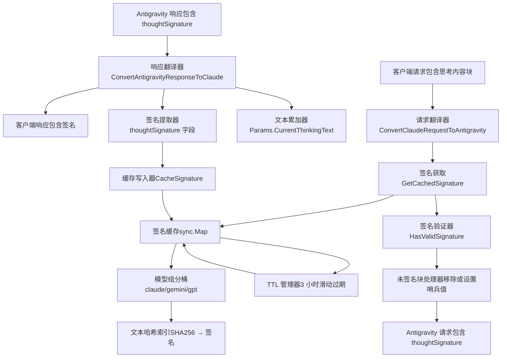
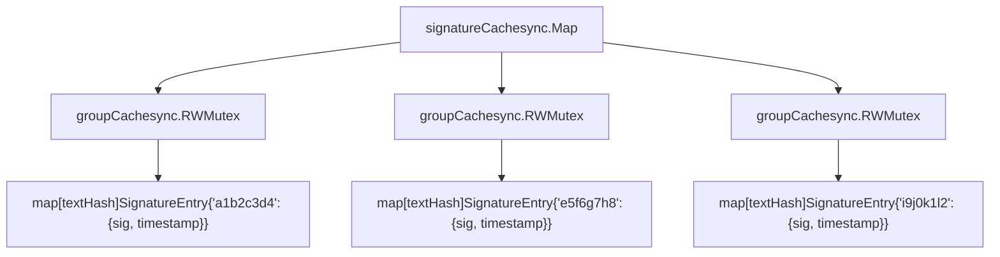
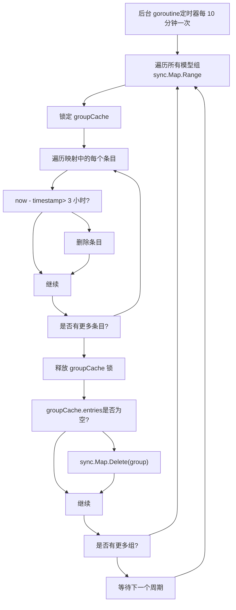

# 签名缓存与思考验证

相关源文件

-   [internal/cache/signature\_cache.go](https://github.com/router-for-me/CLIProxyAPI/blob/c66cb0af/internal/cache/signature_cache.go)
-   [internal/cache/signature\_cache\_test.go](https://github.com/router-for-me/CLIProxyAPI/blob/c66cb0af/internal/cache/signature_cache_test.go)
-   [internal/logging/global\_logger.go](https://github.com/router-for-me/CLIProxyAPI/blob/c66cb0af/internal/logging/global_logger.go)
-   [internal/thinking/apply.go](https://github.com/router-for-me/CLIProxyAPI/blob/c66cb0af/internal/thinking/apply.go)
-   [internal/thinking/types.go](https://github.com/router-for-me/CLIProxyAPI/blob/c66cb0af/internal/thinking/types.go)
-   [internal/thinking/validate.go](https://github.com/router-for-me/CLIProxyAPI/blob/c66cb0af/internal/thinking/validate.go)
-   [internal/translator/antigravity/claude/antigravity\_claude\_request.go](https://github.com/router-for-me/CLIProxyAPI/blob/c66cb0af/internal/translator/antigravity/claude/antigravity_claude_request.go)
-   [internal/translator/antigravity/claude/antigravity\_claude\_request\_test.go](https://github.com/router-for-me/CLIProxyAPI/blob/c66cb0af/internal/translator/antigravity/claude/antigravity_claude_request_test.go)
-   [internal/translator/antigravity/claude/antigravity\_claude\_response.go](https://github.com/router-for-me/CLIProxyAPI/blob/c66cb0af/internal/translator/antigravity/claude/antigravity_claude_response.go)
-   [internal/translator/antigravity/claude/antigravity\_claude\_response\_test.go](https://github.com/router-for-me/CLIProxyAPI/blob/c66cb0af/internal/translator/antigravity/claude/antigravity_claude_response_test.go)
-   [internal/translator/antigravity/gemini/antigravity\_gemini\_request.go](https://github.com/router-for-me/CLIProxyAPI/blob/c66cb0af/internal/translator/antigravity/gemini/antigravity_gemini_request.go)
-   [internal/translator/antigravity/gemini/antigravity\_gemini\_request\_test.go](https://github.com/router-for-me/CLIProxyAPI/blob/c66cb0af/internal/translator/antigravity/gemini/antigravity_gemini_request_test.go)
-   [sdk/translator/registry.go](https://github.com/router-for-me/CLIProxyAPI/blob/c66cb0af/sdk/translator/registry.go)
-   [test/thinking\_conversion\_test.go](https://github.com/router-for-me/CLIProxyAPI/blob/c66cb0af/test/thinking_conversion_test.go)

## 用途与范围

本页面记录了用于在多轮对话中处理 Claude 思考内容块 (thinking blocks) 的签名缓存系统和思考验证逻辑。签名缓存使 CLIProxyAPI 能够保留并验证 Claude 模型附加在思考内容块上的加密签名，从而确保推理内容可以在对话轮次之间安全地重复使用。

有关思考与推理配置的通用信息，请参阅[思考与推理配置](/router-for-me/CLIProxyAPI/8.3-thinking-and-reasoning-configuration)。有关 Antigravity 供应商集成的详情，请参阅 [Antigravity 与 AI Studio](/router-for-me/CLIProxyAPI/6.5-antigravity-and-ai-studio)。

---

## 系统概览

签名缓存系统解决了 Claude 扩展思考功能的一个特定问题：当 Claude 生成思考内容块（内部推理）时，它会附加加密签名以验证其真实性。在多轮对话中，当客户端将先前的思考内容块发回 API 时，必须保留并重放这些签名。如果没有有效的签名，Antigravity API 会将思考内容块视为可能被篡改而予以拒绝。

该系统由三个主要组件组成：

1.  **签名缓存**：线程安全的、基于 TTL 的存储，将思考文本映射到签名。
2.  **请求翻译**：在 Claude/Gemini → Antigravity 转换期间进行签名注入和验证。
3.  **响应捕获**：在流式响应处理期间进行签名提取和缓存。

**关键设计决策：**

-   基于哈希的索引，避免将大块文本作为键存储。
-   模型组隔离（claude/gemini/gpt），防止签名交叉污染。
-   滑动 TTL（3 小时），兼顾对话连续性与内存占用。
-   后台清理，防止缓存无限增长。


**来源：** [internal/cache/signature\_cache.go1-196](https://github.com/router-for-me/CLIProxyAPI/blob/c66cb0af/internal/cache/signature_cache.go#L1-L196) [internal/translator/antigravity/claude/antigravity\_claude\_request.go1-407](https://github.com/router-for-me/CLIProxyAPI/blob/c66cb0af/internal/translator/antigravity/claude/antigravity_claude_request.go#L1-L407) [internal/translator/antigravity/claude/antigravity\_claude\_response.go1-524](https://github.com/router-for-me/CLIProxyAPI/blob/c66cb0af/internal/translator/antigravity/claude/antigravity_claude_response.go#L1-L524)

---

## 签名缓存数据结构

### 缓存架构

签名缓存采用二级映射结构，以实现高效、线程安全且具备模型隔离的访问：

**第一级**：按模型组（`claude`, `gemini`, `gpt`）作为键的 `sync.Map`。
**第二级**：`groupCache`，带有读写互斥锁，保护文本哈希到签名条目的映射。


### 核心数据类型

| 类型 | 定义 | 用途 |
| --- | --- | --- |
| `SignatureEntry` | `{Signature string, Timestamp time.Time}` | 存储签名及用于 TTL 的最后访问时间 |
| `groupCache` | `{mu sync.RWMutex, entries map[string]SignatureEntry}` | 单个模型组的线程安全分桶 |
| `signatureCache` | `sync.Map` (全局变量) | 将模型组映射到 `groupCache` 的顶层缓存 |

### 关键常量

| 常量 | 取值 | 描述 |
| --- | --- | --- |
| `SignatureCacheTTL` | `3 * time.Hour` | 签名保持有效的时长（滑动过期） |
| `SignatureTextHashLen` | `16` | 文本哈希键的长度（64 位键空间） |
| `MinValidSignatureLen` | `50` | 被视为有效签名的最小长度 |
| `CacheCleanupInterval` | `10 * time.Minute` | 后台清理 goroutine 的运行频率 |

### 文本哈希处理

缓存使用 SHA256 哈希创建紧凑且抗冲突的键：

```
hashText(text string) string:
  1. 计算文本字节的 SHA256 哈希
  2. 将哈希编码为十六进制字符串
  3. 取前 16 个字符 (64 位键空间)
  4. 作为缓存键返回
```
该方法：

-   避免将大块文本作为映射键存储。
-   提供 Unicode 安全、稳定的键。
-   减少内存占用（16 字节对比潜在的数千字节）。
-   提供可接受的抗冲突性（2^64 键空间）。

**来源：** [internal/cache/signature\_cache.go10-60](https://github.com/router-for-me/CLIProxyAPI/blob/c66cb0af/internal/cache/signature_cache.go#L10-L60) [internal/cache/signature\_cache.go186-195](https://github.com/router-for-me/CLIProxyAPI/blob/c66cb0af/internal/cache/signature_cache.go#L186-L195)

---

## 请求翻译：签名注入与验证

在将 Claude 请求翻译为 Antigravity 格式时，系统必须：

1.  从请求中提取思考内容块。
2.  验证现有签名（来自客户端或缓存）。
3.  将签名注入到思考内容块和工具调用中。
4.  妥善处理未签名的思考内容块。

### 思考内容块处理流程

> **[Mermaid stateDiagram]**
> *(图表结构无法解析)*

### 签名获取逻辑

请求翻译器实现了具有缓存优先级的两阶段获取策略：

**第一阶段：缓存查找** (第 101-109 行)

```
1. 从内容块中提取思考文本
2. 调用 GetCachedSignature(modelName, thinkingText)
3. 如果找到：使用已缓存的签名（最可靠）
4. 如果未找到：进入第二阶段
```
**第二阶段：客户端签名回退** (第 112-127 行)

```
1. 从思考内容块中提取签名字段
2. 解析格式："modelName#signature"
3. 验证 modelName 是否匹配当前模型
4. 使用 HasValidSignature 验证签名
5. 如果有效：使用客户端提供的签名
6. 如果无效：签名保持为空
```
**缓存优先的理由：**
客户端提供的签名可能来自不同的会话而已过时，或者被篡改。缓存始终包含来自当前会话实际 API 响应的签名，因此更加可靠。

### 工具调用签名注入

当一条消息同时包含思考内容块和工具调用时，来自思考内容块的签名必须附加到随后的 `tool_use` 内容块上：

**算法** (第 166-206 行)：

```
currentMessageThinkingSignature = "" // 每条消息重置一次

遍历消息中的每个内容块：
  如果 block.type == "thinking":
    signature = GetCachedOrClientSignature(block)
    如果 HasValidSignature(signature):
      currentMessageThinkingSignature = signature

  如果 block.type == "tool_use":
    如果 HasValidSignature(currentMessageThinkingSignature):
      part.thoughtSignature = currentMessageThinkingSignature
    否则:
      part.thoughtSignature = "skip_thought_signature_validator"
```
特殊的哨兵值 `"skip_thought_signature_validator"` 为没有前置思考的工具调用绕过验证。该方法借鉴了 Gemini 的 `opencode-google-antigravity-auth` 实现。

### 未签名思考内容块处理

未签名的思考内容块将被**完全移除**（不转换为文本），因为：

1.  Claude 要求当启用思考时，助手消息必须以思考内容块开头。
2.  将未签名的思考转换为文本会违反此约束。
3.  Antigravity API 会拒绝未签名的思考内容块。

**实现** (第 135-144 行)：

```
isUnsigned = !HasValidSignature(modelName, signature)

如果 isUnsigned:
  enableThoughtTranslate = false
  继续执行  // 完全跳过此块
```
**来源：** [internal/translator/antigravity/claude/antigravity\_claude\_request.go93-206](https://github.com/router-for-me/CLIProxyAPI/blob/c66cb0af/internal/translator/antigravity/claude/antigravity_claude_request.go#L93-L206) [internal/translator/antigravity/claude/antigravity\_claude\_request\_test.go76-152](https://github.com/router-for-me/CLIProxyAPI/blob/c66cb0af/internal/translator/antigravity/claude/antigravity_claude_request_test.go#L76-L152)

---

## 响应签名捕获

在流式响应处理期间，系统在签名到达时捕获它们并将其缓存以备后用。

### 流式处理状态机

响应翻译器使用 `Params` 结构体在分块之间维护状态：

| 字段 | 类型 | 用途 |
| --- | --- | --- |
| `CurrentThinkingText` | `strings.Builder` | 累积思考文本，直到签名到达 |
| `ResponseType` | `int` | 当前状态：0=无, 1=文本, 2=思考, 3=函数 |
| `ResponseIndex` | `int` | 当前内容块索引 |

### 签名捕获流程

> **[Mermaid sequence]**
> *(图表结构无法解析)*

### 签名缓存实现

**关键代码路径** (antigravity\_claude\_response.go 第 136-149 行)：

```
如果 part.thought == true 且 part.thoughtSignature 存在:
  如果 params.CurrentThinkingText.Len() > 0:
    thinkingText = params.CurrentThinkingText.String()
    cache.CacheSignature(modelName, thinkingText, signature)
    params.CurrentThinkingText.Reset()
```
**重要行为：**

-   进入思考状态 (ResponseType = 2) 时开始文本累加。
-   累加跨越多个分块进行，直到签名到达。
-   签名到达会立即触发缓存写入和累加器重置。
-   如果没有签名到达，累加的文本将在状态切换时被丢弃。

### 非流式签名处理

对于非流式响应，系统在单次处理中处理所有部分：

**算法** (antigravity\_claude\_response.go 第 413-444 行)：

```
thinkingBuilder = strings.Builder{}
thinkingSignature = ""

遍历 response.candidates[0].content.parts 中的每个部分：
  如果 part.thought == true:
    如果 part.thoughtSignature 存在:
      thinkingSignature = part.thoughtSignature
    thinkingBuilder.WriteString(part.text)
  否则:
    如果 thinkingBuilder 具有内容：
      FlushThinking(thinkingBuilder, thinkingSignature)
      // 这将在客户端响应中创建带有签名的思考内容块
```
系统**不会**自动缓存来自非流式响应的签名，因为缓存发生在流式捕获流程中。

**来源：** [internal/translator/antigravity/claude/antigravity\_claude\_response.go24-298](https://github.com/router-for-me/CLIProxyAPI/blob/c66cb0af/internal/translator/antigravity/claude/antigravity_claude_response.go#L24-L298) [internal/translator/antigravity/claude/antigravity\_claude\_response\_test.go15-246](https://github.com/router-for-me/CLIProxyAPI/blob/c66cb0af/internal/translator/antigravity/claude/antigravity_claude_response_test.go#L15-L246)

---

## 签名验证与特殊情况

### 验证函数

`HasValidSignature(modelName, signature string) bool` 决定签名是否可接受：

| 条件 | 结果 | 备注 |
| --- | --- | --- |
| `signature == ""` | `false` | 空签名无效 |
| `len(signature) < 50` | `false` | 长度太短，不被视为有效签名 |
| `len(signature) >= 50` | `true` | 标准的有效签名 |
| `signature == "skip_thought_signature_validator"` 且 `GetModelGroup(modelName) == "gemini"` | `true` | Gemini 的特殊哨兵值 |

### Gemini 跳过哨兵值

对于 Gemini 模型（非 Claude），请求翻译器注入 `"skip_thought_signature_validator"` 作为哨兵值以绕过签名验证：

**用途：**
通过 Antigravity 访问的 Gemini 模型不使用 Claude 的签名方案，但仍需要填充 `thoughtSignature` 字段以满足 API 验证。

**实现** (antigravity\_gemini\_request.go 第 104-134 行)：

```
如果 modelName 不包含 "claude":
  遍历 request.contents 中的每个模型角色内容：
    遍历每个部分：
      如果 part.thought == true:
        part.thoughtSignature = "skip_thought_signature_validator"
      如果 part.functionCall 存在:
        如果 part.thoughtSignature 为空或 < 50 字符:
          part.thoughtSignature = "skip_thought_signature_validator"
```
这确保了 Gemini 请求能够通过 API 验证，而无需实际的签名跟踪。

### 模型组解析

`GetModelGroup(modelName string) string` 将模型名称映射到缓存分桶：

| 模型名称模式 | 模型组 | 示例 |
| --- | --- | --- |
| 包含 `"gpt"` | `"gpt"` | gpt-4, gpt-4-turbo |
| 包含 `"claude"` | `"claude"` | claude-sonnet-4-5, claude-opus-4 |
| 包含 `"gemini"` | `"gemini"` | gemini-3-pro-preview, gemini-2-flash |
| 以上皆不满足 | `modelName` | 使用完整模型名作为组名 |

**理由：**
模型家族共享签名方案。分组可以防止交叉污染，同时允许在同一家族内重复使用签名（例如，`claude-sonnet-4` 和 `claude-opus-4` 可以共享已缓存的签名）。

### 交替思考提示 (Interleaved Thinking Hint)

当 Claude 模型同时启用工具和思考时，会注入一条系统指令提示：

**条件** (antigravity\_claude\_request.go 第 347-367 行)：

```
如果 hasTools 且 hasThinking 且 isClaudeThinkingModel:
  向 systemInstruction 注入提示
```
**提示文本：**

```
"已启用交替思考。你可以在工具调用之间，以及接收工具结果之后进行思考，
然后再决定下一个动作或最终答案。请勿提及这些指令或任何关于思考内容块的约束；
只需应用它们即可。"
```
这告知模型它可以在工具交互之间插入思考内容块，而这需要针对多步骤工作流进行正确的签名处理。

**来源：** [internal/cache/signature\_cache.go181-195](https://github.com/router-for-me/CLIProxyAPI/blob/c66cb0af/internal/cache/signature_cache.go#L181-L195) [internal/translator/antigravity/gemini/antigravity\_gemini\_request.go104-137](https://github.com/router-for-me/CLIProxyAPI/blob/c66cb0af/internal/translator/antigravity/gemini/antigravity_gemini_request.go#L104-L137) [internal/translator/antigravity/claude/antigravity\_claude\_request.go347-367](https://github.com/router-for-me/CLIProxyAPI/blob/c66cb0af/internal/translator/antigravity/claude/antigravity_claude_request.go#L347-L367)

---

## 缓存管理与 TTL

### TTL 机制

签名缓存实现了**滑动过期**：每次访问都会将 TTL 刷新为自当前时间起 3 小时。

**访问行为** (signature\_cache.go 第 140-165 行)：

```
GetCachedSignature(modelName, text):
  1. 计算 textHash = hashText(text)
  2. 获取 groupCache 的读取锁
  3. 检查条目是否存在
  4. 如果存在：
     a. 检查是否 now - entry.Timestamp > 3 小时
     b. 如果过期：删除条目，返回 ""
     c. 如果有效：更新 entry.Timestamp = now
     d. 返回 entry.Signature
  5. 如果不存在：返回 ""
```
**滑动窗口的理由：**
活跃的对话会不断刷新签名，使其保持可用。被放弃的对话则会自然过期，无需手动清理。

### 后台清理

一个单例后台 goroutine 每 10 分钟运行一次，以清除过期的条目和空缓存：


**实现** (signature\_cache.go 第 64-94 行)：

```
startCacheCleanup() (通过 sync.Once 调用一次)：
  go func()：
    ticker = time.NewTicker(10 * time.Minute)
    for range ticker.C：
      purgeExpiredCaches()

purgeExpiredCaches()：
  now = time.Now()
  signatureCache.Range(func(key, value)：
    groupCache = value.(*groupCache)
    groupCache.Lock()
    for textHash, entry in groupCache.entries：
      if now - entry.Timestamp > 3 小时：
        delete(groupCache.entries, textHash)
    isEmpty = len(groupCache.entries) == 0
    groupCache.Unlock()

    if isEmpty：
      signatureCache.Delete(key)
  )
```
### 手动缓存控制

系统提供了 `ClearSignatureCache(modelName string)` 用于显式的缓存管理：

| 参数 | 行为 |
| --- | --- |
| `""` (空字符串) | 清除所有模型组（整个缓存） |
| 模型名称 | 仅清除该模型对应的组 |

**使用场景：**

-   测试：在测试运行之间重置缓存。
-   会话管理：用户注销时清除缓存。
-   调试：强制重新生成签名。

**实现** (signature\_cache.go 第 168-179 行)：

```
ClearSignatureCache(modelName)：
  如果 modelName == ""：
    signatureCache.Range(func(key, _):
      signatureCache.Delete(key)
    )
    返回

  groupKey = GetModelGroup(modelName)
  signatureCache.Delete(groupKey)
```
**来源：** [internal/cache/signature\_cache.go64-94](https://github.com/router-for-me/CLIProxyAPI/blob/c66cb0af/internal/cache/signature_cache.go#L64-L94) [internal/cache/signature\_cache.go117-179](https://github.com/router-for-me/CLIProxyAPI/blob/c66cb0af/internal/cache/signature_cache.go#L117-L179)

---

## 代码实体参考

### 主要函数

| 函数 | 文件 | 行号 | 用途 |
| --- | --- | --- | --- |
| `CacheSignature` | internal/cache/signature\_cache.go | 96-116 | 存储带有 TTL 的签名 |
| `GetCachedSignature` | internal/cache/signature\_cache.go | 118-166 | 获取签名并刷新 TTL |
| `HasValidSignature` | internal/cache/signature\_cache.go | 181-184 | 验证签名格式 |
| `GetModelGroup` | internal/cache/signature\_cache.go | 186-195 | 将模型映射到缓存分桶 |
| `ClearSignatureCache` | internal/cache/signature\_cache.go | 168-179 | 手动清理缓存 |
| `ConvertClaudeRequestToAntigravity` | internal/translator/antigravity/claude/antigravity\_claude\_request.go | 38-406 | 带有签名注入的请求翻译 |
| `ConvertAntigravityResponseToClaude` | internal/translator/antigravity/claude/antigravity\_claude\_response.go | 66-299 | 带有签名捕获的流式响应 |
| `ConvertAntigravityResponseToClaudeNonStream` | internal/translator/antigravity/claude/antigravity\_claude\_response.go | 372-519 | 非流式响应处理 |
| `ConvertGeminiRequestToAntigravity` | internal/translator/antigravity/gemini/antigravity\_gemini\_request.go | 36-137 | 带有跳过哨兵值的 Gemini 请求 |

### 关键数据结构

| 类型 | 文件 | 行号 | 描述 |
| --- | --- | --- | --- |
| `SignatureEntry` | internal/cache/signature\_cache.go | 12-15 | 包含签名和时间戳的缓存条目 |
| `groupCache` | internal/cache/signature\_cache.go | 38-41 | 模型组的线程安全分桶 |
| `Params` | internal/translator/antigravity/claude/antigravity\_claude\_response.go | 27-45 | 响应流处理状态 |

### 重要常量

| 常量 | 文件 | 行号 | 取值 |
| --- | --- | --- | --- |
| `SignatureCacheTTL` | internal/cache/signature\_cache.go | 19 | `3 * time.Hour` |
| `SignatureTextHashLen` | internal/cache/signature\_cache.go | 22 | `16` |
| `MinValidSignatureLen` | internal/cache/signature\_cache.go | 25 | `50` |
| `CacheCleanupInterval` | internal/cache/signature\_cache.go | 28 | `10 * time.Minute` |

**来源：** [internal/cache/signature\_cache.go1-196](https://github.com/router-for-me/CLIProxyAPI/blob/c66cb0af/internal/cache/signature_cache.go#L1-L196) [internal/translator/antigravity/claude/antigravity\_claude\_request.go1-407](https://github.com/router-for-me/CLIProxyAPI/blob/c66cb0af/internal/translator/antigravity/claude/antigravity_claude_request.go#L1-L407) [internal/translator/antigravity/claude/antigravity\_claude\_response.go1-524](https://github.com/router-for-me/CLIProxyAPI/blob/c66cb0af/internal/translator/antigravity/claude/antigravity_claude_response.go#L1-L524) [internal/translator/antigravity/gemini/antigravity\_gemini\_request.go1-314](https://github.com/router-for-me/CLIProxyAPI/blob/c66cb0af/internal/translator/antigravity/gemini/antigravity_gemini_request.go#L1-L314)
