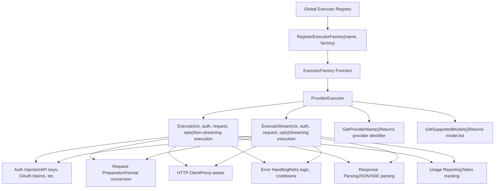
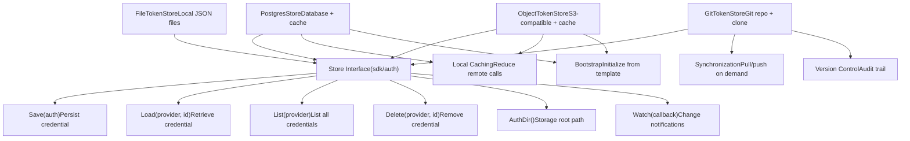
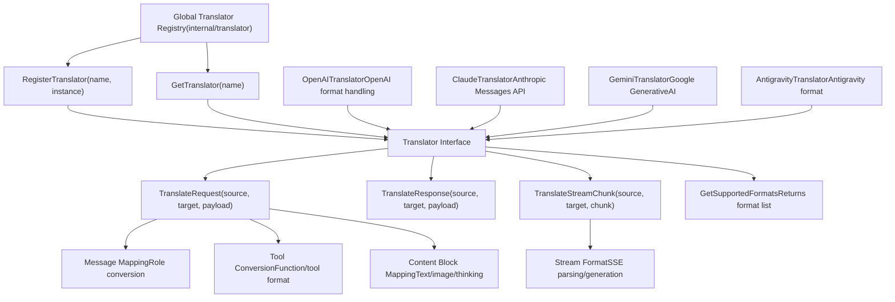
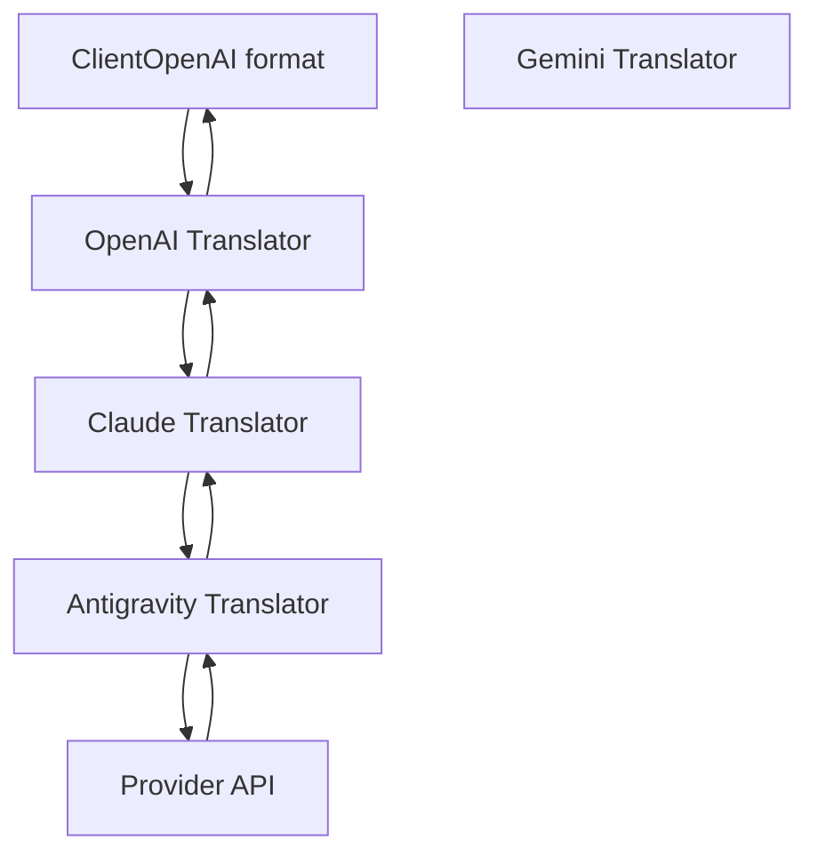
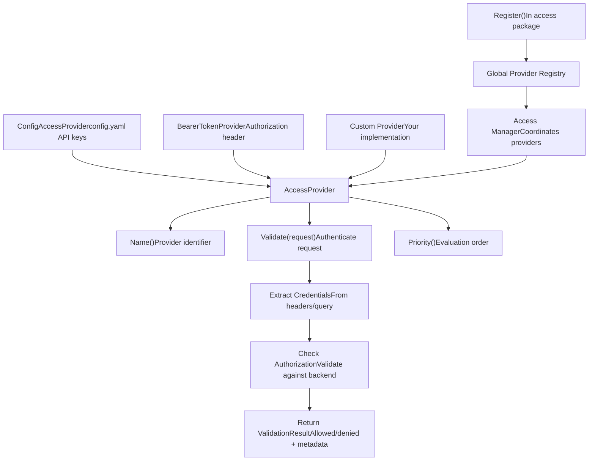
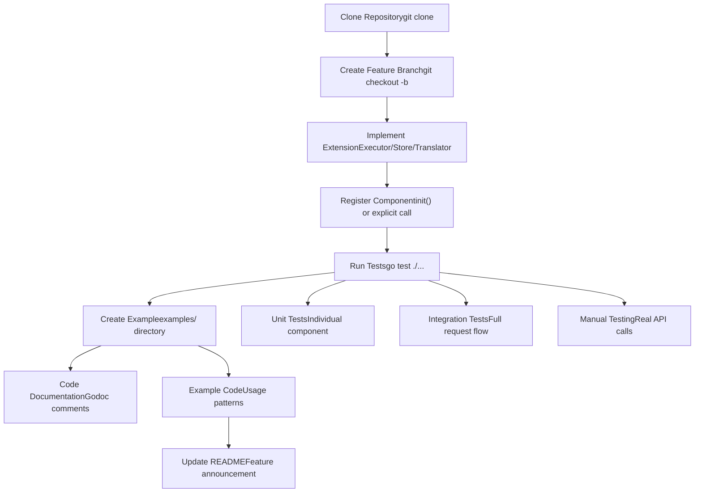
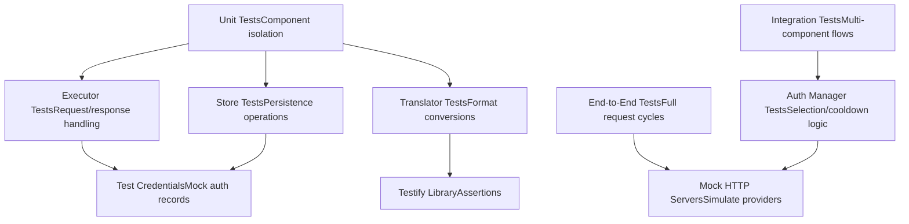

# 开发与扩展

相关源文件

-   [docs/sdk-access.md](https://github.com/router-for-me/CLIProxyAPI/blob/c66cb0af/docs/sdk-access.md)
-   [docs/sdk-access\_CN.md](https://github.com/router-for-me/CLIProxyAPI/blob/c66cb0af/docs/sdk-access_CN.md)
-   [internal/access/config\_access/provider.go](https://github.com/router-for-me/CLIProxyAPI/blob/c66cb0af/internal/access/config_access/provider.go)
-   [internal/access/reconcile.go](https://github.com/router-for-me/CLIProxyAPI/blob/c66cb0af/internal/access/reconcile.go)
-   [sdk/access/errors.go](https://github.com/router-for-me/CLIProxyAPI/blob/c66cb0af/sdk/access/errors.go)
-   [sdk/access/manager.go](https://github.com/router-for-me/CLIProxyAPI/blob/c66cb0af/sdk/access/manager.go)
-   [sdk/access/registry.go](https://github.com/router-for-me/CLIProxyAPI/blob/c66cb0af/sdk/access/registry.go)
-   [sdk/cliproxy/builder.go](https://github.com/router-for-me/CLIProxyAPI/blob/c66cb0af/sdk/cliproxy/builder.go)
-   [sdk/config/config.go](https://github.com/router-for-me/CLIProxyAPI/blob/c66cb0af/sdk/config/config.go)

本文档为开发人员扩展 CLIProxyAPI 功能提供了技术指南。它涵盖了 SDK 架构、扩展点，以及创建自定义执行器（Executors）、存储后端和翻译器的开发模式。

有关操作部署配置，请参阅[部署场景](/router-for-me/CLIProxyAPI/10-deployment-scenarios)。有关配置文件结构和选项，请参阅[配置指南](/router-for-me/CLIProxyAPI/5-configuration-guide)。有关身份验证实现细节，请参阅[身份验证流程](/router-for-me/CLIProxyAPI/7-authentication-flows)。

---

## 扩展架构概览

CLIProxyAPI 设计有多个扩展点，允许开发人员在不修改核心代码的情况下添加新的供应商、存储后端、访问控制机制和协议翻译。

### 扩展点图谱

*SDK 类型及其与 CLIProxyAPI 扩展点的关系。节点标签使用代码库中的包限定名称（package-qualified names）。*

```mermaid
flowchart TD
    Builder["Builder(sdk/cliproxy/builder.go)"]
    Hooks["Hooks struct(OnBeforeStart / OnAfterStart)"]
    ProviderExecutor["ProviderExecutor Interface"]
    CustomExec["Custom Executor"]
    Store["Store Interface(sdk/auth)"]
    FileStore["FileTokenStore"]
    PostgresStore["PostgresStore"]
    GitStore["GitTokenStore"]
    ObjectStore["ObjectTokenStore"]
    CustomStore["Custom Store"]
    Translator["Translator Interface(internal/translator)"]
    CustomTrans["Custom Translator"]
    AccessProvider["Provider Interface(sdk/access/registry.go)"]
    RegisterProviderFn["RegisterProvider(typ, provider)(sdk/access)"]
    ConfigAccess["config-api-key provider(internal/access/config_access)"]
    CustomAccess["Custom Provider"]
    CoreAuthMgr["coreauth.Manager(sdk/cliproxy/auth)"]
    APIServer["API Server(internal/api)"]
    ModelRegistry["Model Registry"]

    Builder --> Hooks
    Builder --> APIServer
    Builder --> CoreAuthMgr
    Builder --> ModelRegistry
    CustomExec --> ProviderExecutor
    APIServer --> ProviderExecutor
    CustomStore --> Store
    FileStore --> Store
    PostgresStore --> Store
    GitStore --> Store
    ObjectStore --> Store
    CoreAuthMgr --> Store
    CustomTrans --> Translator
    APIServer --> Translator
    CustomAccess --> AccessProvider
    ConfigAccess --> AccessProvider
    RegisterProviderFn --> AccessProvider
    APIServer --> AccessProvider
```


来源：[sdk/cliproxy/builder.go1-242](https://github.com/router-for-me/CLIProxyAPI/blob/c66cb0af/sdk/cliproxy/builder.go#L1-L242) [sdk/access/registry.go1-83](https://github.com/router-for-me/CLIProxyAPI/blob/c66cb0af/sdk/access/registry.go#L1-L83)

---

## SDK 包结构

CLIProxyAPI SDK 组织在 `sdk/` 下的可重用包中，这些包支持将代理服务嵌入到应用程序中。

### 核心 SDK 包

| 包 | 用途 | 关键类型 |
| --- | --- | --- |
| `sdk/cliproxy` | 服务生成器与生命周期管理 | `Builder`, `ServiceOptions` |
| `sdk/cliproxy/auth` | 凭证与身份验证管理 | `Manager`, `AuthRecord`, `Selector` |
| `sdk/executor` | 供应商执行器接口与注册表 | `ProviderExecutor`, `ExecutionOptions` |
| `sdk/auth` | 凭证存储抽象 | `Store`, `FileTokenStore` |
| `sdk/model` | 模型注册表与可用性跟踪 | `Registry`, `ModelRegistration` |
| `sdk/access` | 请求身份验证接口 | `AccessProvider` |

### 生成器（Builder）模式用法

`sdk/cliproxy` 中的 `Builder` 模式是嵌入 CLIProxyAPI 的主要入口点：

> **[Mermaid sequence]**
> *(图表结构无法解析)*

**来源：** [cmd/server/main.go446-481](https://github.com/router-for-me/CLIProxyAPI/blob/c66cb0af/cmd/server/main.go#L446-L481) [README.md57](https://github.com/router-for-me/CLIProxyAPI/blob/c66cb0af/README.md#L57-L57) [README.md79-85](https://github.com/router-for-me/CLIProxyAPI/blob/c66cb0af/README.md#L79-L85)

---

## 创建自定义执行器

自定义执行器通过实现 `ProviderExecutor` 接口来添加对新 AI 服务供应商的支持。

### ProviderExecutor 接口

执行器接口定义了请求处理和流式传输的方法：


### 执行器实现模式

自定义执行器通常遵循以下结构：

1.  **定义执行器结构体**，包含供应商特定的配置
2.  **实现接口方法**，用于执行和元数据获取
3.  **创建工厂函数**，返回执行器实例
4.  **在执行器注册表中注册工厂**

执行器必须处理：

-   **身份验证注入**：将 API 密钥、OAuth 令牌或服务账号注入请求
-   **请求准备**：构建供应商特定的 HTTP 请求
-   **错误处理**：解析供应商错误、应用重试逻辑、触发冷却
-   **响应解析**：提取完成内容、使用情况和元数据
-   **模型注册**：向注册表报告支持的模型

**参考实现：**

-   Gemini 执行器：用于 API 密钥和 OAuth 模式
-   Claude 执行器：用于工具处理和思考块（Thinking blocks）
-   OpenAI 兼容执行器：用于通用供应商支持

**来源：** [README.md85](https://github.com/router-for-me/CLIProxyAPI/blob/c66cb0af/README.md#L85-L85) 图表 1（执行器部分）

---

## 自定义存储后端

存储后端实现 `Store` 接口，用于持久化身份验证凭证和配置。

### Store 接口


### 存储后端选择

存储后端通过环境变量配置并全局注册：

| 后端 | 环境变量 | 使用场景 |
| --- | --- | --- |
| **FileTokenStore** | (默认) | 单实例，本地开发 |
| **PostgresStore** | `PGSTORE_DSN`, `PGSTORE_SCHEMA`, `PGSTORE_LOCAL_PATH` | 多实例，共享状态 |
| **GitTokenStore** | `GITSTORE_GIT_URL`, `GITSTORE_GIT_USERNAME`, `GITSTORE_GIT_TOKEN`, `GITSTORE_LOCAL_PATH` | 版本控制，审计追踪 |
| **ObjectTokenStore** | `OBJECTSTORE_ENDPOINT`, `OBJECTSTORE_ACCESS_KEY`, `OBJECTSTORE_SECRET_KEY`, `OBJECTSTORE_BUCKET`, `OBJECTSTORE_LOCAL_PATH` | 容器化，云端部署 |

### 注册流程

存储后端在初始化期间注册一次，并供所有组件使用：

1.  **环境检测**：[cmd/server/main.go166-214](https://github.com/router-for-me/CLIProxyAPI/blob/c66cb0af/cmd/server/main.go#L166-L214) 检查环境变量
2.  **Store 实例化**：[cmd/server/main.go226-322](https://github.com/router-for-me/CLIProxyAPI/blob/c66cb0af/cmd/server/main.go#L226-L322) 根据配置创建存储
3.  **全局注册**：[cmd/server/main.go435-443](https://github.com/router-for-me/CLIProxyAPI/blob/c66cb0af/cmd/server/main.go#L435-L443) 通过 `RegisterTokenStore()` 注册
4.  **组件使用**：认证管理器（Auth Manager）和其他组件通过注册的存储进行访问

**来源：** [cmd/server/main.go166-443](https://github.com/router-for-me/CLIProxyAPI/blob/c66cb0af/cmd/server/main.go#L166-L443) 图表 3（令牌存储后端部分）

---

## 翻译系统架构

翻译系统在不同的 AI 供应商格式（OpenAI, Claude, Gemini 等）之间转换请求和响应。

### 翻译器接口与注册表


### 双向翻译链 (Bidirectional Translation Chains)

系统支持多跳（multi-hop）翻译以实现协议桥接：


### 翻译注意事项

自定义翻译器必须处理：

1.  **消息角色映射**：在 `user`/`assistant`/`system` 与供应商特定角色之间转换
2.  **内容块**：映射文本、图像、工具调用和思考块
3.  **工具定义**：在不同格式间转换函数调用模式（schemas）
4.  **流式分块**：解析和生成 SSE（服务器发送事件）格式
5.  **使用情况统计**：提取并规范化令牌计数
6.  **错误处理**：将供应商错误代码翻译为标准格式

**来源：** [README.md82](https://github.com/router-for-me/CLIProxyAPI/blob/c66cb0af/README.md#L82-L82) 图表 6（翻译阶段部分）

---

## 访问控制扩展

访问供应商通过实现 `AccessProvider` 接口来定制请求身份验证。

### AccessProvider 接口


### 自定义访问供应商模式

添加自定义身份验证：

1.  **实现接口**：创建带有 `Name()`、`Validate()`、`Priority()` 方法的结构体
2.  **提取凭证**：从 HTTP 请求中解析身份验证数据
3.  **验证**：针对您的身份验证后端检查凭证
4.  **返回结果**：提供包含允许/拒绝决策的 `ValidationResult`
5.  **注册**：在 `init()` 中调用包级 `Register()` 函数

优先级较高的供应商会被优先评估。第一个成功的验证即生效。

**来源：** [cmd/server/main.go446](https://github.com/router-for-me/CLIProxyAPI/blob/c66cb0af/cmd/server/main.go#L446-L446) [README.md83](https://github.com/router-for-me/CLIProxyAPI/blob/c66cb0af/README.md#L83-L83) 图表 1（访问管理器部分）

---

## 开发工作流

### 构建扩展


### 调试模式配置

为开发启用详细日志记录：

```
# config.yamldebug: truelog_level: "debug"log_api_requests: truelog_api_responses: truelog_request_body: truelog_response_body: true
```
此配置将记录：

-   所有带有标头和正文的 HTTP 请求
-   所有带有标头和正文的 HTTP 响应
-   身份验证选择决策
-   模型注册表状态更改
-   翻译操作

### 示例：自定义供应商

`examples/custom-provider` 目录演示了如何实现自定义执行器：

**结构：**

-   自定义执行器实现
-   工厂函数与注册
-   示例配置
-   集成测试

**演示的关键模式：**

-   实现 `ProviderExecutor` 接口方法
-   处理身份验证注入
-   解析供应商响应
-   在执行器注册表中注册工厂
-   模型注册与可用性

**来源：** [README.md85](https://github.com/router-for-me/CLIProxyAPI/blob/c66cb0af/README.md#L85-L85) [README.md87-95](https://github.com/router-for-me/CLIProxyAPI/blob/c66cb0af/README.md#L87-L95)

---

## SDK 嵌入示例

### 最小嵌入模式

> **[Mermaid sequence]**
> *(图表结构无法解析)*

### 编程式配置

除了 `config.yaml`，配置也可以通过编程方式提供：

| 配置方面 | SDK 方法 | 示例 |
| --- | --- | --- |
| 服务器端口 | `cfg.Port = 8080` | 在 `Build()` 之前设置 |
| 身份验证目录 | `cfg.AuthDir = "/path/to/auths"` | 在 `Build()` 之前设置 |
| 存储后端 | `RegisterTokenStore(store)` | 在 `Build()` 之前调用 |
| 访问供应商 | `access.Register()` | 在 `init()` 中或 `Build()` 之前调用 |
| 自定义执行器 | `executor.RegisterExecutorFactory()` | 在 `init()` 中或 `Build()` 之前调用 |
| 日志级别 | `cfg.LogLevel = "debug"` | 在 `Build()` 之前设置 |

**来源：** [cmd/server/main.go428-481](https://github.com/router-for-me/CLIProxyAPI/blob/c66cb0af/cmd/server/main.go#L428-L481) [README.md79-85](https://github.com/router-for-me/CLIProxyAPI/blob/c66cb0af/README.md#L79-L85)

---

## 测试与调试

### 测试策略


### 调试技术

| 问题类型 | 调试方法 | 配置 |
| --- | --- | --- |
| 请求路由 | 启用 `log_api_requests: true` | 记录传入请求的详情 |
| 响应格式 | 启用 `log_api_responses: true` | 记录传出响应的详情 |
| 身份验证选择 | 启用 `log_level: "debug"` | 记录选择器的决策 |
| 翻译错误 | 启用 `log_request_body: true` | 记录有效负载（payload）的转换过程 |
| 供应商错误 | 检查执行器的错误处理 | 查看重试逻辑和冷却时间 |
| 模型可用性 | 查询 `/v1/models` 端点 | 检查注册表状态 |
| 配置热重载 | 查看文件观察器日志 | 验证防抖和哈希检查 |

### 常见扩展问题

**执行器未被调用：**

-   验证是否通过 `RegisterExecutorFactory()` 注册了工厂
-   检查供应商名称是否与配置匹配
-   确保模型已在模型注册表中注册

**存储未持久化：**

-   验证 `Save()` 实现是否写入了后端
-   检查 `AuthDir()` 是否返回了正确的路径
-   确保具有写入访问权限的文件权限

**翻译未应用：**

-   验证是否通过 `RegisterTranslator()` 注册了翻译器
-   检查格式名称是否与预期值匹配
-   确保支持请求和响应的双向翻译

**访问被拒绝：**

-   验证访问供应商是否已注册
-   检查 `Priority()` 评估顺序
-   确保 `Validate()` 返回了正确的结果

**来源：** [README.md85](https://github.com/router-for-me/CLIProxyAPI/blob/c66cb0af/README.md#L85-L85) 图表 5（模型注册表部分）

---

## 关键接口摘要

| 接口 | 包 | 用途 | 注册方法 |
| --- | --- | --- | --- |
| `ProviderExecutor` | `sdk/executor` | 执行供应商请求 | `RegisterExecutorFactory(name, factory)` |
| `Store` | `sdk/auth` | 持久化凭证 | `RegisterTokenStore(store)` |
| `Translator` | `internal/translator` | 转换请求/响应格式 | `RegisterTranslator(name, instance)` |
| `AccessProvider` | `internal/access` | 验证请求身份 | 在包的 init 函数中调用 `Register()` |
| `Selector` | `sdk/cliproxy/auth` | 为请求选择凭证 | 在配置中设置：`round_robin` 或 `fill_first` |

**来源：** [README.md79-85](https://github.com/router-for-me/CLIProxyAPI/blob/c66cb0af/README.md#L79-L85) 所有架构图
