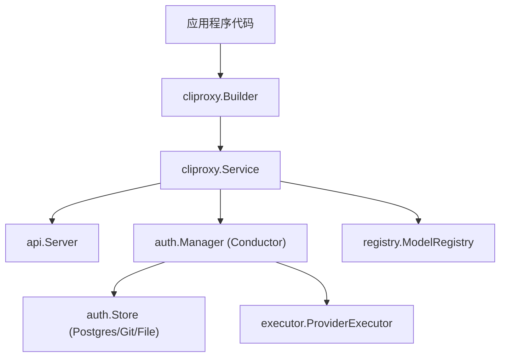
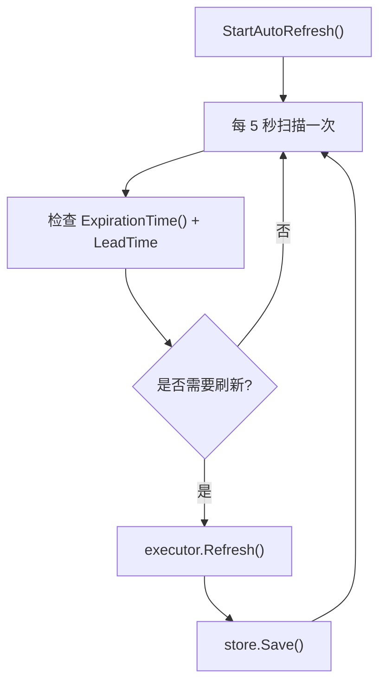

# 使用 Go SDK

相关源文件

-   [cmd/server/main.go](https://github.com/router-for-me/CLIProxyAPI/blob/c66cb0af/cmd/server/main.go)
-   [internal/api/handlers/management/auth\_files.go](https://github.com/router-for-me/CLIProxyAPI/blob/c66cb0af/internal/api/handlers/management/auth_files.go)
-   [internal/api/server.go](https://github.com/router-for-me/CLIProxyAPI/blob/c66cb0af/internal/api/server.go)
-   [internal/config/config.go](https://github.com/router-for-me/CLIProxyAPI/blob/c66cb0af/internal/config/config.go)
-   [sdk/api/handlers/handlers.go](https://github.com/router-for-me/CLIProxyAPI/blob/c66cb0af/sdk/api/handlers/handlers.go)
-   [sdk/auth/antigravity.go](https://github.com/router-for-me/CLIProxyAPI/blob/c66cb0af/sdk/auth/antigravity.go)
-   [sdk/auth/claude.go](https://github.com/router-for-me/CLIProxyAPI/blob/c66cb0af/sdk/auth/claude.go)
-   [sdk/auth/codex.go](https://github.com/router-for-me/CLIProxyAPI/blob/c66cb0af/sdk/auth/codex.go)
-   [sdk/auth/gemini.go](https://github.com/router-for-me/CLIProxyAPI/blob/c66cb0af/sdk/auth/gemini.go)
-   [sdk/auth/iflow.go](https://github.com/router-for-me/CLIProxyAPI/blob/c66cb0af/sdk/auth/iflow.go)
-   [sdk/auth/manager.go](https://github.com/router-for-me/CLIProxyAPI/blob/c66cb0af/sdk/auth/manager.go)
-   [sdk/auth/qwen.go](https://github.com/router-for-me/CLIProxyAPI/blob/c66cb0af/sdk/auth/qwen.go)
-   [sdk/cliproxy/auth/conductor.go](https://github.com/router-for-me/CLIProxyAPI/blob/c66cb0af/sdk/cliproxy/auth/conductor.go)
-   [sdk/cliproxy/auth/selector.go](https://github.com/router-for-me/CLIProxyAPI/blob/c66cb0af/sdk/cliproxy/auth/selector.go)
-   [sdk/cliproxy/builder.go](https://github.com/router-for-me/CLIProxyAPI/blob/c66cb0af/sdk/cliproxy/builder.go)
-   [sdk/cliproxy/service.go](https://github.com/router-for-me/CLIProxyAPI/blob/c66cb0af/sdk/cliproxy/service.go)
-   [sdk/config/config.go](https://github.com/router-for-me/CLIProxyAPI/blob/c66cb0af/sdk/config/config.go)

## 用途与范围

CLIProxyAPI 提供了一个全面的 Go SDK，用于将多供应商 AI 代理能力嵌入到 Go 应用程序中。SDK 允许开发者构建自定义服务器、执行编排好的 OAuth 流程、管理凭据并执行跨供应商翻译的 AI 请求。

本页面涵盖了 SDK 的核心组件，包括 `Builder` 模式、`Service` 接口以及认证管理器集成。有关创建自定义执行器的详情，请参阅第 9.2 页。有关翻译系统内部原理，请参阅第 9.4 页。

---

## SDK 核心组件

SDK 围绕三个主要层次组织：

1.  **Builder (`sdk/cliproxy/builder.go`)**：用于配置和产生服务的流畅接口 (Fluent interface)。
2.  **Service (`sdk/cliproxy/service.go`)**：管理 HTTP 服务器、认证、模型注册和执行器生命周期的核心协调器。
3.  **Auth Conductor (`sdk/cliproxy/auth/conductor.go`)**：处理凭据路由、负载均衡、故障转移和 OAuth 刷新的有状态组件。

### 架构图


**来源：** [sdk/cliproxy/builder.go1-50](https://github.com/router-for-me/CLIProxyAPI/blob/c66cb0af/sdk/cliproxy/builder.go#L1-L50) [sdk/cliproxy/service.go1-100](https://github.com/router-for-me/CLIProxyAPI/blob/c66cb0af/sdk/cliproxy/service.go#L1-L100)

---

## Builder 模式

`Builder` 提供了配置系统组件的高级 API。

### 基础初始化

```go
cfg := config.DefaultConfig()
svc := cliproxy.NewBuilder().
    WithConfig(cfg).
    WithConfigPath("config.yaml").
    WithAuthDir("auths/").
    Build()

ctx := context.Background()
if err := svc.Start(ctx); err != nil {
    log.Fatal(err)
}
```
### 高级配置选项

| 方法 | 描述 |
| --- | --- |
| `WithConfig(cfg)` | 注入现有的配置对象 |
| `WithConfigPath(path)` | 设置用于加载和监控的配置文件路径 |
| `WithAuthDir(path)` | 设置存储凭据文件的目录 |
| `WithTokenStore(store)` | 注入自定义存储后端 (见第 9.3 页) |
| `WithServerOptions(opts)` | 向底层的 Gin 服务器传递自定义选项 |
| `WithSelector(strategy)` | 配置凭据选择算法 (见第 8.1 页) |

**来源：** [sdk/cliproxy/builder.go15-100](https://github.com/router-for-me/CLIProxyAPI/blob/c66cb0af/sdk/cliproxy/builder.go#L15-L100)

---

## 服务接口 (`Service`)

`Service` 接口是 SDK 的主要入口点。它编排了运行一个正常工作的代理所需的所有子系统。

### 关键方法

```go
type Service interface {
    // 生命周期
    Start(ctx context.Context) error
    Stop(ctx context.Context) error
    
    // 认证管理
    RegisterAuth(ctx context.Context, auth *auth.Auth) error
    ListAuths() []*auth.Auth
    DeleteAuth(ctx context.Context, id string) error
    
    // 执行
    Execute(ctx context.Context, req *Request, opts *Options) (*Response, error)
    
    // 监控
    GetModelRegistry() *registry.ModelRegistry
    RegisterUsagePlugin(plugin usage.Plugin)
}
```
### 内部初始化序列

当调用 `Build()` 时，SDK 执行以下步骤：

1.  初始化全局 `ModelRegistry`。
2.  创建 `auth.Manager` (Conductor) 并配置重试/选择策略。
3.  初始化 `wsrelay.Manager` 以支持 WebSocket 中继。
4.  根据已注册的供应商生成 `ProviderExecutor`。
5.  启动 `Watcher` 以监控配置和认证文件的更改。

**来源：** [sdk/cliproxy/service.go29-89](https://github.com/router-for-me/CLIProxyAPI/blob/c66cb0af/sdk/cliproxy/service.go#L29-L89) [sdk/cliproxy/builder.go102-140](https://github.com/router-for-me/CLIProxyAPI/blob/c66cb0af/sdk/cliproxy/builder.go#L102-L140)

---

## 认证管理器集成

`auth.Manager`（内部称为 Conductor）是 SDK 的核心。它负责在多个账号之间进行路由，并处理 OAuth 令牌的生命周期。

### 后台刷新工作程序

SDK 自动启动一个后台刷新工作程序，用于在 OAuth 令牌过期前更新它们。


### 凭据选择

SDK 支持通过 `Selector` 接口自定义凭据选择：

```go
// 实现自定义选择器
type MySelector struct{}
func (s *MySelector) Pick(ctx context.Context, provider, model string, auths []*auth.Auth) (*auth.Auth, error) {
    // 您的逻辑
}

// 注册选择器
svc := cliproxy.NewBuilder().
    WithSelector(&MySelector{}).
    Build()
```
**来源：** [sdk/cliproxy/auth/conductor.go116-147](https://github.com/router-for-me/CLIProxyAPI/blob/c66cb0af/sdk/cliproxy/auth/conductor.go#L116-L147) [sdk/cliproxy/auth/selector.go19-21](https://github.com/router-for-me/CLIProxyAPI/blob/c66cb0af/sdk/cliproxy/auth/selector.go#L19-L21) [sdk/cliproxy/auth/selector.go59-113](https://github.com/router-for-me/CLIProxyAPI/blob/c66cb0af/sdk/cliproxy/auth/selector.go#L59-L113)
