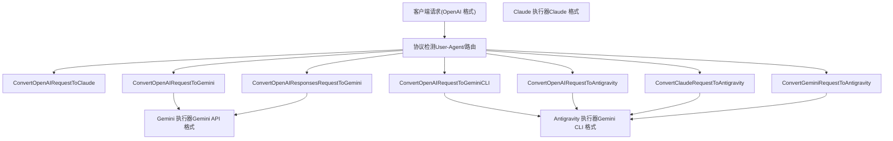
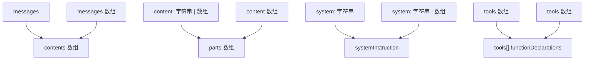
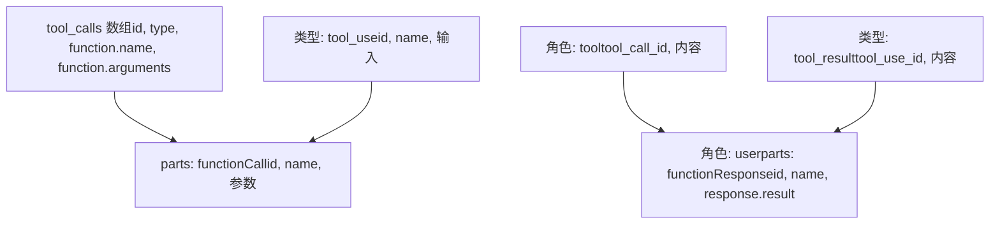
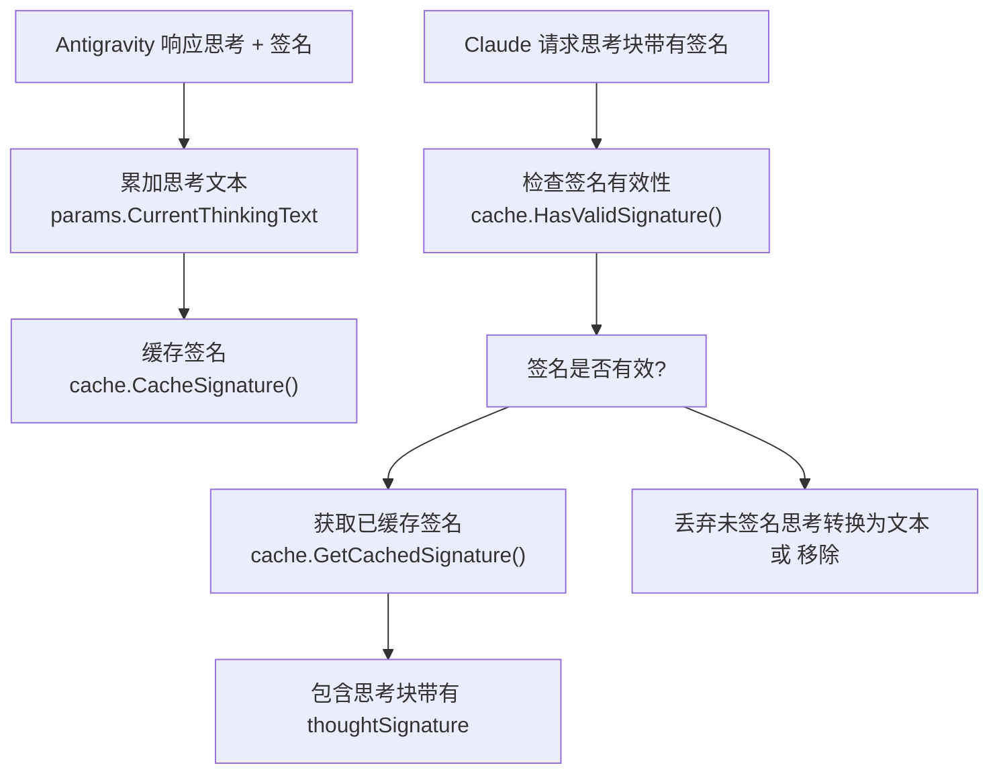
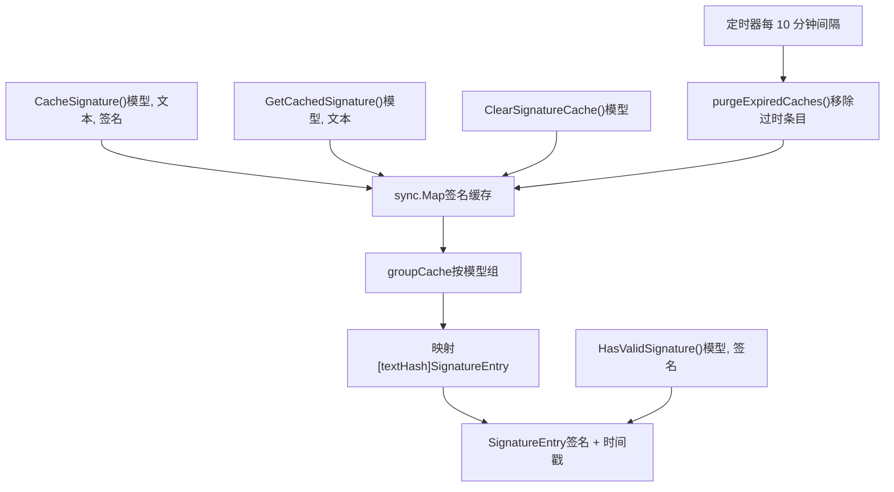
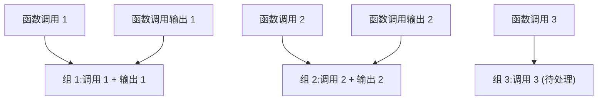

# 翻译系统深度解析

相关源文件

-   [internal/runtime/executor/antigravity\_executor\_buildrequest\_test.go](https://github.com/router-for-me/CLIProxyAPI/blob/c66cb0af/internal/runtime/executor/antigravity_executor_buildrequest_test.go)
-   [internal/translator/antigravity/openai/chat-completions/antigravity\_openai\_request.go](https://github.com/router-for-me/CLIProxyAPI/blob/c66cb0af/internal/translator/antigravity/openai/chat-completions/antigravity_openai_request.go)
-   [internal/translator/antigravity/openai/chat-completions/antigravity\_openai\_response.go](https://github.com/router-for-me/CLIProxyAPI/blob/c66cb0af/internal/translator/antigravity/openai/chat-completions/antigravity_openai_response.go)
-   [internal/translator/antigravity/openai/chat-completions/antigravity\_openai\_response\_test.go](https://github.com/router-for-me/CLIProxyAPI/blob/c66cb0af/internal/translator/antigravity/openai/chat-completions/antigravity_openai_response_test.go)
-   [internal/translator/claude/gemini/claude\_gemini\_request.go](https://github.com/router-for-me/CLIProxyAPI/blob/c66cb0af/internal/translator/claude/gemini/claude_gemini_request.go)
-   [internal/translator/claude/openai/chat-completions/claude\_openai\_request.go](https://github.com/router-for-me/CLIProxyAPI/blob/c66cb0af/internal/translator/claude/openai/chat-completions/claude_openai_request.go)
-   [internal/translator/claude/openai/responses/claude\_openai-responses\_request.go](https://github.com/router-for-me/CLIProxyAPI/blob/c66cb0af/internal/translator/claude/openai/responses/claude_openai-responses_request.go)
-   [internal/translator/claude/openai/responses/claude\_openai-responses\_response.go](https://github.com/router-for-me/CLIProxyAPI/blob/c66cb0af/internal/translator/claude/openai/responses/claude_openai-responses_response.go)
-   [internal/translator/codex/claude/codex\_claude\_request.go](https://github.com/router-for-me/CLIProxyAPI/blob/c66cb0af/internal/translator/codex/claude/codex_claude_request.go)
-   [internal/translator/codex/claude/codex\_claude\_response.go](https://github.com/router-for-me/CLIProxyAPI/blob/c66cb0af/internal/translator/codex/claude/codex_claude_response.go)
-   [internal/translator/codex/gemini/codex\_gemini\_request.go](https://github.com/router-for-me/CLIProxyAPI/blob/c66cb0af/internal/translator/codex/gemini/codex_gemini_request.go)
-   [internal/translator/codex/openai/chat-completions/codex\_openai\_request.go](https://github.com/router-for-me/CLIProxyAPI/blob/c66cb0af/internal/translator/codex/openai/chat-completions/codex_openai_request.go)
-   [internal/translator/codex/openai/responses/codex\_openai-responses\_request.go](https://github.com/router-for-me/CLIProxyAPI/blob/c66cb0af/internal/translator/codex/openai/responses/codex_openai-responses_request.go)
-   [internal/translator/codex/openai/responses/codex\_openai-responses\_request\_test.go](https://github.com/router-for-me/CLIProxyAPI/blob/c66cb0af/internal/translator/codex/openai/responses/codex_openai-responses_request_test.go)
-   [internal/translator/codex/openai/responses/codex\_openai-responses\_response.go](https://github.com/router-for-me/CLIProxyAPI/blob/c66cb0af/internal/translator/codex/openai/responses/codex_openai-responses_response.go)
-   [internal/translator/gemini-cli/claude/gemini-cli\_claude\_request.go](https://github.com/router-for-me/CLIProxyAPI/blob/c66cb0af/internal/translator/gemini-cli/claude/gemini-cli_claude_request.go)
-   [internal/translator/gemini-cli/claude/gemini-cli\_claude\_response.go](https://github.com/router-for-me/CLIProxyAPI/blob/c66cb0af/internal/translator/gemini-cli/claude/gemini-cli_claude_response.go)
-   [internal/translator/gemini-cli/openai/chat-completions/gemini-cli\_openai\_request.go](https://github.com/router-for-me/CLIProxyAPI/blob/c66cb0af/internal/translator/gemini-cli/openai/chat-completions/gemini-cli_openai_request.go)
-   [internal/translator/gemini-cli/openai/chat-completions/gemini-cli\_openai\_response.go](https://github.com/router-for-me/CLIProxyAPI/blob/c66cb0af/internal/translator/gemini-cli/openai/chat-completions/gemini-cli_openai_response.go)
-   [internal/translator/gemini/claude/gemini\_claude\_request.go](https://github.com/router-for-me/CLIProxyAPI/blob/c66cb0af/internal/translator/gemini/claude/gemini_claude_request.go)
-   [internal/translator/gemini/claude/gemini\_claude\_response.go](https://github.com/router-for-me/CLIProxyAPI/blob/c66cb0af/internal/translator/gemini/claude/gemini_claude_response.go)
-   [internal/translator/gemini/openai/chat-completions/gemini\_openai\_request.go](https://github.com/router-for-me/CLIProxyAPI/blob/c66cb0af/internal/translator/gemini/openai/chat-completions/gemini_openai_request.go)
-   [internal/translator/gemini/openai/chat-completions/gemini\_openai\_response.go](https://github.com/router-for-me/CLIProxyAPI/blob/c66cb0af/internal/translator/gemini/openai/chat-completions/gemini_openai_response.go)
-   [internal/translator/gemini/openai/responses/gemini\_openai-responses\_request.go](https://github.com/router-for-me/CLIProxyAPI/blob/c66cb0af/internal/translator/gemini/openai/responses/gemini_openai-responses_request.go)
-   [internal/translator/gemini/openai/responses/gemini\_openai-responses\_response.go](https://github.com/router-for-me/CLIProxyAPI/blob/c66cb0af/internal/translator/gemini/openai/responses/gemini_openai-responses_response.go)
-   [internal/translator/gemini/openai/responses/gemini\_openai-responses\_response\_test.go](https://github.com/router-for-me/CLIProxyAPI/blob/c66cb0af/internal/translator/gemini/openai/responses/gemini_openai-responses_response_test.go)
-   [internal/translator/openai/claude/openai\_claude\_request.go](https://github.com/router-for-me/CLIProxyAPI/blob/c66cb0af/internal/translator/openai/claude/openai_claude_request.go)
-   [internal/translator/openai/claude/openai\_claude\_request\_test.go](https://github.com/router-for-me/CLIProxyAPI/blob/c66cb0af/internal/translator/openai/claude/openai_claude_request_test.go)
-   [internal/translator/openai/claude/openai\_claude\_response.go](https://github.com/router-for-me/CLIProxyAPI/blob/c66cb0af/internal/translator/openai/claude/openai_claude_response.go)
-   [internal/translator/openai/gemini/openai\_gemini\_request.go](https://github.com/router-for-me/CLIProxyAPI/blob/c66cb0af/internal/translator/openai/gemini/openai_gemini_request.go)
-   [internal/translator/openai/gemini/openai\_gemini\_response.go](https://github.com/router-for-me/CLIProxyAPI/blob/c66cb0af/internal/translator/openai/gemini/openai_gemini_response.go)
-   [internal/translator/openai/openai/responses/openai\_openai-responses\_response.go](https://github.com/router-for-me/CLIProxyAPI/blob/c66cb0af/internal/translator/openai/openai/responses/openai_openai-responses_response.go)
-   [internal/util/gemini\_schema.go](https://github.com/router-for-me/CLIProxyAPI/blob/c66cb0af/internal/util/gemini_schema.go)
-   [internal/util/gemini\_schema\_test.go](https://github.com/router-for-me/CLIProxyAPI/blob/c66cb0af/internal/util/gemini_schema_test.go)
-   [internal/util/sanitize\_test.go](https://github.com/router-for-me/CLIProxyAPI/blob/c66cb0af/internal/util/sanitize_test.go)
-   [internal/util/translator.go](https://github.com/router-for-me/CLIProxyAPI/blob/c66cb0af/internal/util/translator.go)
-   [internal/util/util.go](https://github.com/router-for-me/CLIProxyAPI/blob/c66cb0af/internal/util/util.go)

## 用途与范围

本文档解释了翻译系统的架构，该系统使 CLIProxyAPI 能够实现不同 AI 供应商 API 格式之间的转换。翻译系统允许使用一种 API 格式（例如 OpenAI）的客户端与使用不同格式（例如 Claude, Gemini）的供应商通信，并全量支持流式传输、工具调用和思考内容块。

有关在请求执行期间如何应用翻译的信息，请参阅[供应商执行器系统](/router-for-me/CLIProxyAPI/3.4-provider-executor-system)。有关供应商特定设置的配置，请参阅[供应商集成](/router-for-me/CLIProxyAPI/6-provider-integration)。

---

## 翻译架构

CLIProxyAPI 的翻译系统基于纯函数式设计，使用 `gjson` 进行 JSON 解析，使用 `sjson` 进行 JSON 构建。这种方法实现了对大型请求/响应有效负载的零分配转换，而无需为每种 API 格式定义 Go 结构体。

### 设计原则

1.  **纯函数 (Pure Functions)**：翻译函数是无状态且无副作用的（流式响应除外）。
2.  **零拷贝 JSON (Zero-Copy JSON)**：使用 `gjson`/`sjson` 直接操作 JSON，无需反序列化为 Go 结构体。
3.  **双向 (Bidirectional)**：支持请求和响应双向的翻译。
4.  **格式无关 (Format Agnostic)**：供应商执行器与翻译逻辑解耦。

### 翻译函数签名

所有请求翻译器均遵循以下签名模式：

```
func ConvertXRequestToY(modelName string, rawJSON []byte, stream bool) []byte
```
用于流式传输的响应翻译器采用有状态的方法：

```
func ConvertXResponseToY(ctx context.Context, modelName string, originalRequestRawJSON, requestRawJSON, rawJSON []byte, param *any) []string
```
**来源：** [internal/translator/gemini/openai/chat-completions/gemini\_openai\_request.go20-30](https://github.com/router-for-me/CLIProxyAPI/blob/c66cb0af/internal/translator/gemini/openai/chat-completions/gemini_openai_request.go#L20-L30) [internal/translator/antigravity/claude/antigravity\_claude\_response.go50-66](https://github.com/router-for-me/CLIProxyAPI/blob/c66cb0af/internal/translator/antigravity/claude/antigravity_claude_response.go#L50-L66)

---

## 请求翻译流程


**翻译选择矩阵**

| 源格式 | 目标供应商 | 翻译器函数 |
| --- | --- | --- |
| OpenAI Chat Completions | Gemini | `ConvertOpenAIRequestToGemini` |
| OpenAI Chat Completions | Gemini CLI | `ConvertOpenAIRequestToGeminiCLI` |
| OpenAI Chat Completions | Antigravity | `ConvertOpenAIRequestToAntigravity` |
| Claude Messages | Antigravity | `ConvertClaudeRequestToAntigravity` |
| Gemini | Antigravity | `ConvertGeminiRequestToAntigravity` |
| OpenAI Responses | Gemini | `ConvertOpenAIResponsesRequestToGemini` |

**来源：** [internal/translator/gemini/openai/chat-completions/gemini\_openai\_request.go1-10](https://github.com/router-for-me/CLIProxyAPI/blob/c66cb0af/internal/translator/gemini/openai/chat-completions/gemini_openai_request.go#L1-L10) [internal/translator/antigravity/claude/antigravity\_claude\_request.go1-18](https://github.com/router-for-me/CLIProxyAPI/blob/c66cb0af/internal/translator/antigravity/claude/antigravity_claude_request.go#L1-L18)

---

## 消息结构转换

### 角色映射 (Role Mapping)

不同的 API 格式对相同的概念使用不同的角色名称：

| OpenAI | Claude | Gemini/CLI | 描述 |
| --- | --- | --- | --- |
| `system` | `system` (顶级) | `system_instruction` | 系统指令 |
| `user` | `user` | `user` | 用户消息 |
| `assistant` | `assistant` | `model` | AI 响应 |
| `tool` | `tool_result` | `function` (角色) | 工具/函数输出 |

翻译系统在消息转换期间处理角色映射：

**OpenAI → Gemini CLI 示例：**

```
OpenAI:     {"role": "assistant", "content": "Hello"}
Gemini CLI: {"role": "model", "parts": [{"text": "Hello"}]}
```
**来源：** [internal/translator/gemini-cli/openai/chat-completions/gemini-cli\_openai\_request.go209-215](https://github.com/router-for-me/CLIProxyAPI/blob/c66cb0af/internal/translator/gemini-cli/openai/chat-completions/gemini-cli_openai_request.go#L209-L215) [internal/translator/antigravity/claude/antigravity\_claude\_request.go78-86](https://github.com/router-for-me/CLIProxyAPI/blob/c66cb0af/internal/translator/antigravity/claude/antigravity_claude_request.go#L78-L86)

### 内容结构转换


**来源：** [internal/translator/gemini-cli/openai/chat-completions/gemini-cli\_openai\_request.go101-164](https://github.com/router-for-me/CLIProxyAPI/blob/c66cb0af/internal/translator/gemini-cli/openai/chat-completions/gemini-cli_openai_request.go#L101-L164) [internal/translator/antigravity/claude/antigravity\_claude\_request.go42-66](https://github.com/router-for-me/CLIProxyAPI/blob/c66cb0af/internal/translator/antigravity/claude/antigravity_claude_request.go#L42-L66)

---

## 工具/函数调用翻译

### 工具声明转换

工具定义需要不同格式之间的字段名称转换：

**OpenAI → Gemini：**

-   `parameters` → `parametersJsonSchema`
-   移除 `strict` 字段
-   如果缺失，添加默认架构

**Claude → Antigravity：**

-   `input_schema` → `parametersJsonSchema`
-   针对 Antigravity 兼容性的架构脱敏 (Sanitization)
-   受限字段白名单：`name`, `description`, `behavior`, `parameters`, `parametersJsonSchema`, `response`, `responseJsonSchema`

**来源：** [internal/translator/gemini/openai/chat-completions/gemini\_openai\_request.go292-396](https://github.com/router-for-me/CLIProxyAPI/blob/c66cb0af/internal/translator/gemini/openai/chat-completions/gemini_openai_request.go#L292-L396) [internal/translator/antigravity/claude/antigravity\_claude\_request.go313-339](https://github.com/router-for-me/CLIProxyAPI/blob/c66cb0af/internal/translator/antigravity/claude/antigravity_claude_request.go#L313-L339)

### 工具调用与响应映射


**工具响应分组**

Gemini CLI 要求工具响应与其相应的函数调用进行分组。`fixCLIToolResponse` 函数执行复杂的分组逻辑：

1.  追踪等待响应的待处理函数调用组。
2.  从用户消息中收集函数响应。
3.  按计数将响应与调用进行匹配。
4.  创建合并的 `functionResponse` 内容块。

**来源：** [internal/translator/antigravity/gemini/antigravity\_gemini\_request.go168-313](https://github.com/router-for-me/CLIProxyAPI/blob/c66cb0af/internal/translator/antigravity/gemini/antigravity_gemini_request.go#L168-L313) [internal/translator/gemini-cli/openai/chat-completions/gemini-cli\_openai\_request.go241-283](https://github.com/router-for-me/CLIProxyAPI/blob/c66cb0af/internal/translator/gemini-cli/openai/chat-completions/gemini-cli_openai_request.go#L241-L283)

---

## 思考内容块翻译

### 思考格式映射

| 格式 | 思考表示方式 | 签名字段 |
| --- | --- | --- |
| OpenAI | `reasoning_effort` 参数 | 不适用 |
| Claude | `type: "thinking"` 内容块 | `signature` (用于验证) |
| Gemini | `thought: true` 部分 (part) | `thoughtSignature` |

### 推理努力程度 (Reasoning Effort) 翻译

OpenAI 的 `reasoning_effort` 参数映射到供应商特定的思考配置：

**OpenAI → Gemini：**

```
reasoning_effort: "low"    → thinkingLevel: "low", includeThoughts: true
reasoning_effort: "medium" → thinkingLevel: "medium", includeThoughts: true
reasoning_effort: "high"   → thinkingLevel: "high", includeThoughts: true
reasoning_effort: "auto"   → thinkingBudget: -1, includeThoughts: true
```
**Claude → Antigravity：**

```
thinking.type: "enabled", budget_tokens: 8000 → thinkingBudget: 8000, includeThoughts: true
```
**来源：** [internal/translator/gemini/openai/chat-completions/gemini\_openai\_request.go38-53](https://github.com/router-for-me/CLIProxyAPI/blob/c66cb0af/internal/translator/gemini/openai/chat-completions/gemini_openai_request.go#L38-L53) [internal/translator/antigravity/claude/antigravity\_claude\_request.go380-388](https://github.com/router-for-me/CLIProxyAPI/blob/c66cb0af/internal/translator/antigravity/claude/antigravity_claude_request.go#L380-L388)

### 思考内容块签名验证

Claude 思考模型要求对对话历史中的思考内容块进行签名验证。翻译系统使用签名缓存来处理此问题：


**签名哨兵值**

对于 Gemini 模型（非 Claude），特殊的哨兵值 `"skip_thought_signature_validator"` 会绕过签名验证：

```
const geminiFunctionThoughtSignature = "skip_thought_signature_validator"
```
这应用于：

-   无有效签名的函数调用
-   Gemini 请求中的思考内容块
-   图像内容块

**来源：** [internal/translator/antigravity/claude/antigravity\_claude\_request.go94-157](https://github.com/router-for-me/CLIProxyAPI/blob/c66cb0af/internal/translator/antigravity/claude/antigravity_claude_request.go#L94-L157) [internal/translator/antigravity/gemini/antigravity\_gemini\_request.go104-134](https://github.com/router-for-me/CLIProxyAPI/blob/c66cb0af/internal/translator/antigravity/gemini/antigravity_gemini_request.go#L104-L134) [internal/translator/gemini/openai/chat-completions/gemini\_openai\_request.go18](https://github.com/router-for-me/CLIProxyAPI/blob/c66cb0af/internal/translator/gemini/openai/chat-completions/gemini_openai_request.go#L18-L18)

---

## 签名缓存系统 (Signature Cache System)

签名缓存通过缓存和获取思考签名，使 Claude 思考模型能够实现在多轮对话中使用思考内容块。

### 缓存架构


### 缓存键生成

对思考文本进行哈希处理以创建稳定的缓存键：

```
func hashText(text string) string {    h := sha256.Sum256([]byte(text))    return hex.EncodeToString(h[:])[:SignatureTextHashLen]  // 16 位十六进制字符}
```
**模型分组：**

-   `claude` 模型 → `"claude"` 组
-   `gemini` 模型 → `"gemini"` 组
-   `gpt` 模型 → `"gpt"` 组
-   其他 → 模型名称作为组

**来源：** [internal/cache/signature\_cache.go1-196](https://github.com/router-for-me/CLIProxyAPI/blob/c66cb0af/internal/cache/signature_cache.go#L1-L196)

### 缓存使用模式

**请求翻译期间 (Claude → Antigravity)：**

1.  从 Claude 请求中提取思考内容块。
2.  检查签名是否存在且有效 (`HasValidSignature`)。
3.  如果有效，尝试查找缓存 (`GetCachedSignature`)。
4.  如果缓存命中，使用已缓存的签名；否则使用客户端提供的签名。
5.  如果没有有效签名，则完全丢弃该思考内容块。

**响应翻译期间 (Antigravity → Claude)：**

1.  在 `params.CurrentThinkingText` 中累加思考文本。
2.  签名到达时，将其存入缓存 (`CacheSignature`)。
3.  为下一个思考内容块重置累加器。
4.  在 SSE 输出中包含带有模型组前缀的签名。

**来源：** [internal/translator/antigravity/claude/antigravity\_claude\_request.go99-145](https://github.com/router-for-me/CLIProxyAPI/blob/c66cb0af/internal/translator/antigravity/claude/antigravity_claude_request.go#L99-L145) [internal/translator/antigravity/claude/antigravity\_claude\_response.go136-154](https://github.com/router-for-me/CLIProxyAPI/blob/c66cb0af/internal/translator/antigravity/claude/antigravity_claude_response.go#L136-L154)

### 缓存配置

| 参数 | 取值 | 描述 |
| --- | --- | --- |
| `SignatureCacheTTL` | 3 小时 | 签名有效时长 |
| `SignatureTextHashLen` | 16 字符 | 哈希键长度 (64 位键空间) |
| `MinValidSignatureLen` | 50 字符 | 最小签名长度 |
| `CacheCleanupInterval` | 10 分钟 | 后台清理频率 |

**来源：** [internal/cache/signature\_cache.go17-29](https://github.com/router-for-me/CLIProxyAPI/blob/c66cb0af/internal/cache/signature_cache.go#L17-L29)

---

## 响应翻译与流式传输

### 流式处理状态机

响应翻译器在多个分块之间维护状态，以产生有效的 SSE 流。`Params` 结构体跟踪转换状态：

```
type Params struct {    HasFirstResponse     bool   // 已发送 message_start    ResponseType         int    // 0=无, 1=文本, 2=思考, 3=函数    ResponseIndex        int    // 内容块索引    HasFinishReason      bool    FinishReason         string    HasUsageMetadata     bool    PromptTokenCount     int64    CandidatesTokenCount int64    ThoughtsTokenCount   int64    TotalTokenCount      int64    CachedTokenCount     int64    HasSentFinalEvents   bool    HasToolUse           bool    HasContent           bool    CurrentThinkingText  strings.Builder // 用于签名缓存的累加器}
```
**来源：** [internal/translator/antigravity/claude/antigravity\_claude\_response.go24-45](https://github.com/router-for-me/CLIProxyAPI/blob/c66cb0af/internal/translator/antigravity/claude/antigravity_claude_response.go#L24-L45)

### SSE 事件序列

> **[Mermaid stateDiagram]**
> *(图表结构无法解析)*

**事件类型：**

| 事件 | 数据类型 | 描述 |
| --- | --- | --- |
| `message_start` | `message_start` | 会话初始化及元数据 |
| `content_block_start` | `content_block_start` | 开始新内容块 (文本/思考/tool\_use) |
| `content_block_delta` | `content_block_delta` | 增量内容分块 |
| `content_block_stop` | `content_block_stop` | 结束当前内容块 |
| `message_delta` | `message_delta` | 最终元数据 (停止原因, 使用情况) |
| `message_stop` | `message_stop` | 流结束 |

**来源：** [internal/translator/antigravity/claude/antigravity\_claude\_response.go93-119](https://github.com/router-for-me/CLIProxyAPI/blob/c66cb0af/internal/translator/antigravity/claude/antigravity_claude_response.go#L93-L119)

### 状态切换逻辑

**思考内容块状态 (ResponseType=2)：**

1.  进入：关闭前一个块，发送 `type: "thinking"` 的 `content_block_start`。
2.  继续：累加文本，发送 `thinking_delta` 事件。
3.  签名到达：发送 `signature_delta`，缓存签名，重置累加器。
4.  退出：发送 `content_block_stop`。

**文本块状态 (ResponseType=1)：**

1.  进入：关闭前一个块，发送 `type: "text"` 的 `content_block_start`。
2.  继续：发送 `text_delta` 事件。
3.  退出：发送 `content_block_stop`。

**函数调用状态 (ResponseType=3)：**

1.  进入：关闭前一个块，发送 `type: "tool_use"` 的 `content_block_start`。
2.  发送：包含函数参数的 `input_json_delta`。
3.  退出：发送 `content_block_stop`。

**来源：** [internal/translator/antigravity/claude/antigravity\_claude\_response.go134-270](https://github.com/router-for-me/CLIProxyAPI/blob/c66cb0af/internal/translator/antigravity/claude/antigravity_claude_response.go#L134-L270)

### 停止原因 (Finish Reason) 映射

```
Gemini "MAX_TOKENS"                → Claude "max_tokens"
Gemini "STOP"                      → Claude "end_turn"
Gemini "FINISH_REASON_UNSPECIFIED" → Claude "end_turn"
具有工具调用                       → Claude "tool_use"
```
**来源：** [internal/translator/antigravity/claude/antigravity\_claude\_response.go347-360](https://github.com/router-for-me/CLIProxyAPI/blob/c66cb0af/internal/translator/antigravity/claude/antigravity_claude_response.go#L347-L360)

---

## 特殊格式处理

### OpenAI Responses API

Responses API 格式与 Chat Completions 有显著不同：

**关键差异：**

-   使用 `instructions` 而非系统消息 (system messages)。
-   `input` 数组带有类型注解的项。
-   `function_call` 和 `function_call_output` 作为独立的项类型。
-   用于思考的 `reasoning` 内容类型。

**规范化逻辑：**

翻译器执行调用-响应配对：


该规范化确保每个函数调用后紧跟其输出，从而为 Gemini 格式创建正确的请求/响应对。

**来源：** [internal/translator/gemini/openai/responses/gemini\_openai-responses\_request.go34-110](https://github.com/router-for-me/CLIProxyAPI/blob/c66cb0af/internal/translator/gemini/openai/responses/gemini_openai-responses_request.go#L34-L110)

### 多模态内容

**图像数据翻译：**

OpenAI 数据 URL 被转换为 Gemini 内联数据格式：

```
OpenAI:  "image_url": {"url": "data:image/png;base64,iVBORw0KGgo..."}
Gemini:  "inlineData": {"mime_type": "image/png", "data": "iVBORw0KGgo..."}
```
**文件附件：**

具有 MIME 类型检测的文件内容：

```
// 提取扩展名ext := strings.Split(filename, ".")[len(sp)-1] // 映射到 MIME 类型mimeType := misc.MimeTypes[ext]  // 查找表 // 创建内联数据{"inlineData": {"mime_type": mimeType, "data": base64Data}}
```
**来源：** [internal/translator/gemini/openai/chat-completions/gemini\_openai\_request.go181-208](https://github.com/router-for-me/CLIProxyAPI/blob/c66cb0af/internal/translator/gemini/openai/chat-completions/gemini_openai_request.go#L181-L208)

### 生成配置 (Generation Configuration)

参数名称翻译：

| OpenAI | Claude | Gemini |
| --- | --- | --- |
| `temperature` | `temperature` | `temperature` |
| `top_p` | `top_p` | `topP` |
| `top_k` | `top_k` | `topK` |
| `max_tokens` | `max_tokens` | `maxOutputTokens` |
| `n` | 不适用 | `candidateCount` |
| `stop` | `stop_sequences` | `stopSequences` |
| `modalities` | 不适用 | `responseModalities` |

**来源：** [internal/translator/antigravity/claude/antigravity\_claude\_request.go389-400](https://github.com/router-for-me/CLIProxyAPI/blob/c66cb0af/internal/translator/antigravity/claude/antigravity_claude_request.go#L389-L400) [internal/translator/gemini/openai/chat-completions/gemini\_openai\_request.go55-71](https://github.com/router-for-me/CLIProxyAPI/blob/c66cb0af/internal/translator/gemini/openai/chat-completions/gemini_openai_request.go#L55-L71)

---

## 添加新格式支持

要添加对新 API 格式的支持，请按照既定模式实现翻译函数：

### 第一步：创建请求翻译器

在 `internal/translator/{provider}/{source}/request.go` 创建文件：

```
func ConvertSourceRequestToProvider(modelName string, rawJSON []byte, stream bool) []byte {    rawJSON = bytes.Clone(rawJSON)  // 防止修改原数据        // 初始化输出结构    out := []byte(`{"target_format": {}}`)        // 使用 gjson 提取源字段    messages := gjson.GetBytes(rawJSON, "messages")        // 转换并使用 sjson 设置目标字段    out, _ = sjson.SetBytes(out, "target_path", transformedValue)        return out}
```
### 第二步：创建响应翻译器 (流式)

```
type Params struct {    HasFirstResponse bool    ResponseType     int    // 添加状态跟踪字段} func ConvertProviderResponseToSource(    ctx context.Context,     modelName string,     originalRequestRawJSON, requestRawJSON, rawJSON []byte,     param *any,) []string {    // 第一次调用时初始化参数    if *param == nil {        *param = &Params{}    }    params := (*param).(*Params)        // 处理 [DONE] 标记    if bytes.Equal(rawJSON, []byte("[DONE]")) {        // 返回最后的事件    }        // 构建 SSE 输出    output := ""        // 使用状态机处理响应分块    // ...        return []string{output}}
```
### 第三步：在供应商执行器中注册

在供应商执行器中，发起 HTTP 请求前调用翻译器：

```
translated := ConvertSourceRequestToProvider(modelName, requestBody, stream)
```
### 第四步：添加测试

创建测试文件，覆盖以下内容：

-   基础结构转换
-   角色映射
-   工具调用与响应
-   思考内容块（如果适用）
-   边界情况（空消息, 畸形内容）

**来源：** [internal/translator/antigravity/claude/antigravity\_claude\_request\_test.go1-650](https://github.com/router-for-me/CLIProxyAPI/blob/c66cb0af/internal/translator/antigravity/claude/antigravity_claude_request_test.go#L1-L650)

---

## 关键实现细节

### 零分配 JSON 操作

翻译系统使用 `gjson` 和 `sjson` 进行高效的 JSON 操作：

```
// 读取 (gjson)temperature := gjson.GetBytes(rawJSON, "temperature")if temperature.Exists() && temperature.Type == gjson.Number {    value := temperature.Num} // 写入 (sjson)out, _ = sjson.SetBytes(out, "path.to.field", value)out, _ = sjson.SetRawBytes(out, "path.to.object", rawJSONObject)
```
**优势：**

-   无需结构体定义。
-   无序列化/反序列化开销。
-   极小的内存分配。
-   易于处理动态/可选字段。

**来源：** [internal/translator/gemini/openai/chat-completions/gemini\_openai\_request.go30-36](https://github.com/router-for-me/CLIProxyAPI/blob/c66cb0af/internal/translator/gemini/openai/chat-completions/gemini_openai_request.go#L30-L36)

### 消息合并 (Message Consolidation)

多个工具响应被合并到单个内容块中，以满足供应商的要求：

```
// 收集工具调用 IDfIDs := make([]string, 0)// ... 从 tool_calls 收集 // 创建包含所有函数响应的单个用户内容节点toolNode := []byte(`{"role":"user","parts":[]}`)pp := 0for _, fid := range fIDs {    if name, ok := tcID2Name[fid]; ok {        toolNode, _ = sjson.SetBytes(toolNode, "parts."+itoa(pp)+".functionResponse.name", name)        toolNode, _ = sjson.SetBytes(toolNode, "parts."+itoa(pp)+".functionResponse.response.result", response)        pp++    }}
```
这防止了为每个工具响应创建单独的消息，因为某些供应商会拒绝此类请求。

**来源：** [internal/translator/gemini-cli/openai/chat-completions/gemini-cli\_openai\_request.go261-278](https://github.com/router-for-me/CLIProxyAPI/blob/c66cb0af/internal/translator/gemini-cli/openai/chat-completions/gemini-cli_openai_request.go#L261-L278)

### 思考内容块重排 (Thinking Block Reordering)

Claude 要求思考内容块出现在模型消息的最前面。翻译器会重排这些部分：

```
if role == "model" {    var thinkingParts []gjson.Result    var otherParts []gjson.Result    for _, part := range parts {        if part.Get("thought").Bool() {            thinkingParts = append(thinkingParts, part)        } else {            otherParts = append(otherParts, part)        }    }    // 重组为思考内容块优先    newParts := append(thinkingParts, otherParts...)}
```
**来源：** [internal/translator/antigravity/claude/antigravity\_claude\_request.go262-289](https://github.com/router-for-me/CLIProxyAPI/blob/c66cb0af/internal/translator/antigravity/claude/antigravity_claude_request.go#L262-L289)

### 交替思考提示 (Interleaved Thinking Hint)

当 Claude 模型同时启用工具和思考时，会注入一条特殊的系统指令提示：

```
if hasTools && hasThinking && isClaudeThinking {    interleavedHint := "已启用交替思考。你可以在工具调用之间进行思考..."    systemInstructionJSON, _ = sjson.SetRaw(systemInstructionJSON, "parts.-1", hintPart)}
```
这告知模型它可以在工具调用之间以及接收工具结果后插入思考内容块。

**来源：** [internal/translator/antigravity/claude/antigravity\_claude\_request.go351-367](https://github.com/router-for-me/CLIProxyAPI/blob/c66cb0af/internal/translator/antigravity/claude/antigravity_claude_request.go#L351-L367)

---

## 性能考虑

### 翻译开销

对于大多数请求，翻译操作通常在亚毫秒级：

-   小型请求 (~1KB)：<0.1ms
-   中型请求 (~10KB)：<1ms
-   大型请求 (~100KB)：<5ms

与网络延迟和模型推理时间相比，该开销微乎其微。

### 内存使用

翻译系统使用极少的堆分配：

-   `bytes.Clone()` 为输入创建一份副本。
-   `sjson` 操作尽可能重用字节切片。
-   无中间结构体分配。
-   流式响应为每个请求分配一次 `Params` 结构体。

### 缓存策略

签名缓存使用有限的内存：

-   16 字符哈希键 (每个条目 16 字节)。
-   签名字符串 (通常为 50-200 字节)。
-   时间戳 (8 字节)。
-   每 10 分钟一次的自动清理移除过期条目。
-   3 小时的 TTL 限制了总缓存大小。

**来源：** [internal/cache/signature\_cache.go17-29](https://github.com/router-for-me/CLIProxyAPI/blob/c66cb0af/internal/cache/signature_cache.go#L17-L29) [internal/cache/signature\_cache.go62-94](https://github.com/router-for-me/CLIProxyAPI/blob/c66cb0af/internal/cache/signature_cache.go#L62-L94)
