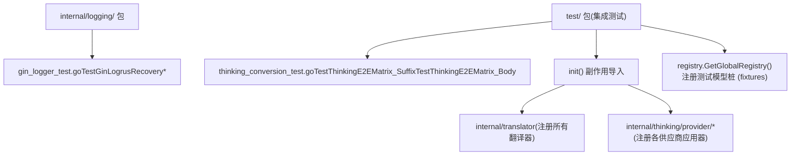
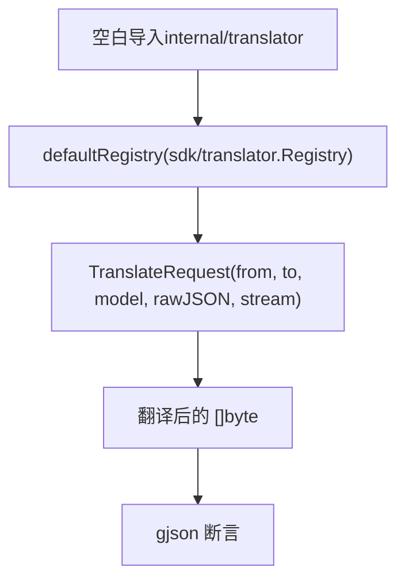
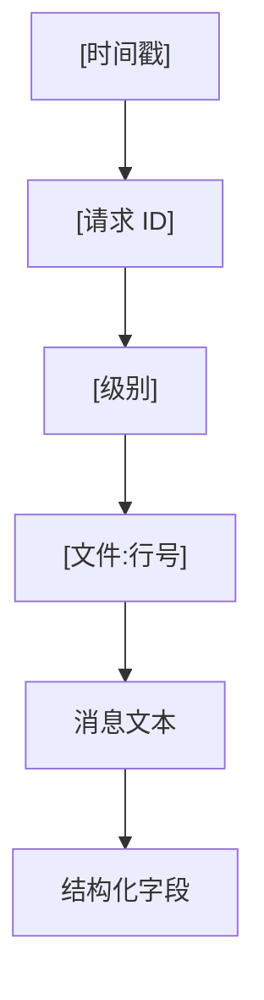
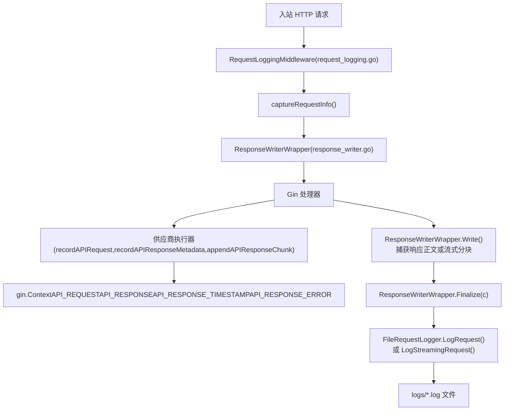
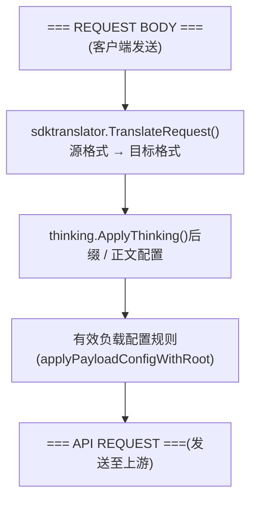

# 测试与调试

相关源文件

-   [internal/api/middleware/request\_logging.go](https://github.com/router-for-me/CLIProxyAPI/blob/c66cb0af/internal/api/middleware/request_logging.go)
-   [internal/api/middleware/response\_writer.go](https://github.com/router-for-me/CLIProxyAPI/blob/c66cb0af/internal/api/middleware/response_writer.go)
-   [internal/logging/gin\_logger.go](https://github.com/router-for-me/CLIProxyAPI/blob/c66cb0af/internal/logging/gin_logger.go)
-   [internal/logging/gin\_logger\_test.go](https://github.com/router-for-me/CLIProxyAPI/blob/c66cb0af/internal/logging/gin_logger_test.go)
-   [internal/logging/global\_logger.go](https://github.com/router-for-me/CLIProxyAPI/blob/c66cb0af/internal/logging/global_logger.go)
-   [internal/logging/request\_logger.go](https://github.com/router-for-me/CLIProxyAPI/blob/c66cb0af/internal/logging/request_logger.go)
-   [internal/runtime/executor/logging\_helpers.go](https://github.com/router-for-me/CLIProxyAPI/blob/c66cb0af/internal/runtime/executor/logging_helpers.go)
-   [internal/thinking/apply.go](https://github.com/router-for-me/CLIProxyAPI/blob/c66cb0af/internal/thinking/apply.go)
-   [internal/thinking/types.go](https://github.com/router-for-me/CLIProxyAPI/blob/c66cb0af/internal/thinking/types.go)
-   [internal/thinking/validate.go](https://github.com/router-for-me/CLIProxyAPI/blob/c66cb0af/internal/thinking/validate.go)
-   [sdk/api/handlers/gemini/gemini-cli\_handlers.go](https://github.com/router-for-me/CLIProxyAPI/blob/c66cb0af/sdk/api/handlers/gemini/gemini-cli_handlers.go)
-   [sdk/translator/registry.go](https://github.com/router-for-me/CLIProxyAPI/blob/c66cb0af/sdk/translator/registry.go)
-   [test/thinking\_conversion\_test.go](https://github.com/router-for-me/CLIProxyAPI/blob/c66cb0af/test/thinking_conversion_test.go)

本页面涵盖了如何运行现有的测试套件、如何为翻译和思考子系统编写测试、如何解读应用程序日志，以及诊断常见问题的分步工作流。

有关被测试的思考配置系统的背景信息，请参阅 [8.3](/router-for-me/CLIProxyAPI/8.3-thinking-and-reasoning-configuration)。有关请求/响应日志如何通过管理 API 暴露，请参阅 [8.4](/router-for-me/CLIProxyAPI/8.4-request-and-response-logging)。有关翻译器架构本身，请参阅 [9.4](/router-for-me/CLIProxyAPI/9.4-translation-system-deep-dive)。

---

## 运行测试套件

测试是标准的 Go 测试。从仓库根目录执行：

```
# 运行所有测试go test ./... # 仅运行思考配置端到端矩阵测试go test ./test/ -run TestThinkingE2EMatrix_Suffix -v # 仅运行 gin 日志记录器测试go test ./internal/logging/ -run TestGinLogrus -v # 启用竞态检测运行 (推荐用于认证/凭证测试)go test -race ./...
```
`test/` 包包含集成风格的测试，它们在不启动 HTTP 服务器的情况下运行完整的“翻译 + 思考”管道。`internal/` 包中的测试是针对单个组件的单元测试。

**来源：** [test/thinking\_conversion\_test.go1-50](https://github.com/router-for-me/CLIProxyAPI/blob/c66cb0af/test/thinking_conversion_test.go#L1-L50) [internal/logging/gin\_logger\_test.go1-61](https://github.com/router-for-me/CLIProxyAPI/blob/c66cb0af/internal/logging/gin_logger_test.go#L1-L61)

---

## 测试套件结构


**来源：** [test/thinking\_conversion\_test.go1-26](https://github.com/router-for-me/CLIProxyAPI/blob/c66cb0af/test/thinking_conversion_test.go#L1-L26) [internal/logging/gin\_logger\_test.go1-10](https://github.com/router-for-me/CLIProxyAPI/blob/c66cb0af/internal/logging/gin_logger_test.go#L1-L10)

`test/` 包使用空白导入 (blank imports) 来触发两个子系统的 `init()` 注册：

| 空白导入 | 效果 |
| --- | --- |
| `_ "github.com/router-for-me/CLIProxyAPI/v6/internal/translator"` | 在默认的 `sdk/translator.Registry` 中注册所有内置的请求/响应翻译器 |
| `_ ".../thinking/provider/gemini"` (以及其他) | 在 `thinking.providerAppliers` 中注册每个供应商的 `ProviderApplier` |

如果没有这些导入，`TranslateRequest` 和 `ApplyThinking` 将静默地透传原始正文。

**来源：** [test/thinking\_conversion\_test.go9-26](https://github.com/router-for-me/CLIProxyAPI/blob/c66cb0af/test/thinking_conversion_test.go#L9-L26)

---

## 为思考系统编写测试

### 测试用例结构

[test/thinking\_conversion\_test.go29-39](https://github.com/router-for-me/CLIProxyAPI/blob/c66cb0af/test/thinking_conversion_test.go#L29-L39) 中的 `thinkingTestCase` 结构体编码了单个“翻译 + 思考”场景：

| 字段 | 含义 |
| --- | --- |
| `name` | 测试标识符 (显示在失败输出中) |
| `from` | 源 API 格式 (`openai`, `gemini`, `claude`, `openai-response`) |
| `to` | 目标供应商格式 (`gemini`, `claude`, `codex`, `openai`, `antigravity`) |
| `model` | 模型名称，可能包含思考后缀，例如 `gemini-2.5-pro(8192)` |
| `inputJSON` | `from` 格式的原始请求体 |
| `expectField` | 用于断言的翻译后输出中的 `gjson` 路径 (为空则不执行该断言) |
| `expectValue` | `expectField` 处预期值的字符串形式 |
| `includeThoughts` | `includeThoughts`/`includeThoughtsInResponse` 字段的预期值 |
| `expectErr` | `ApplyThinking` 是否应当返回非 nil 错误 |

### 测试用例中的数据流

**标题：思考测试数据流**

> **[Mermaid sequence]**
> *(图表结构无法解析)*

**来源：** [test/thinking\_conversion\_test.go44-50](https://github.com/router-for-me/CLIProxyAPI/blob/c66cb0af/test/thinking_conversion_test.go#L44-L50)

### 注册测试模型

测试通过 `registry.GetGlobalRegistry().RegisterClient(uid, "test", getTestModels())` 注册合成的模型桩。在 `TestThinkingE2EMatrix_Suffix` 中使用的桩模型有：

| 桩模型名称 | 能力 | 备注 |
| --- | --- | --- |
| `level-model` | 级别: minimal/low/medium/high | ZeroAllowed=false, DynamicAllowed=false |
| `level-subset-model` | 级别: 仅限 low/high | ZeroAllowed=false |
| `gemini-budget-model` | 预算: Min=128, Max=20000 | DynamicAllowed=true |
| `gemini-mixed-model` | 预算 + 级别: low/high | Min=128, Max=32768, DynamicAllowed=true |
| `claude-budget-model` | 预算: Min=1024, Max=128000 | ZeroAllowed=true |
| `antigravity-budget-model` | 预算: Min=128, Max=20000 | ZeroAllowed=true, DynamicAllowed=true |
| `no-thinking-model` | `Thinking=nil` | 不支持思考 |
| `user-defined-model` | `UserDefined=true`, `Thinking=nil` | 透传验证 (Passthrough validation) |

使用 `defer reg.UnregisterClient(uid)` 来清理测试注册，避免污染各次测试运行之间的全局注册表。

**来源：** [test/thinking\_conversion\_test.go44-49](https://github.com/router-for-me/CLIProxyAPI/blob/c66cb0af/test/thinking_conversion_test.go#L44-L49)

### 示例：添加新的思考测试用例

要为新的供应商或模型能力添加测试，请在相关测试函数的 `cases` 切片中追加一个 `thinkingTestCase`：

```
{    name:        "my-case",    from:        "openai",    to:          "gemini",    model:       "gemini-budget-model(4096)",    inputJSON:   `{"model":"gemini-budget-model(4096)","messages":[{"role":"user","content":"hi"}]}`,    expectField: "generationConfig.thinkingConfig.thinkingBudget",    expectValue: "4096",    includeThoughts: "true",    expectErr:   false,},
```
`expectField` 的值是通往翻译后 JSON 正文的 `gjson` 路径。`expectValue` 作为字符串进行比较（例如整数 `8192` 应该是 `"8192"`）。

**来源：** [test/thinking\_conversion\_test.go51-120](https://github.com/router-for-me/CLIProxyAPI/blob/c66cb0af/test/thinking_conversion_test.go#L51-L120)

---

## 为翻译器编写测试

翻译器注册表 (`sdk/translator.Registry`) 可以在不使用 HTTP 栈的情况下直接在单元测试中进行测试。

**标题：翻译器注册表测试模式**


**来源：** [sdk/translator/registry.go43-53](https://github.com/router-for-me/CLIProxyAPI/blob/c66cb0af/sdk/translator/registry.go#L43-L53) [test/thinking\_conversion\_test.go9-10](https://github.com/router-for-me/CLIProxyAPI/blob/c66cb0af/test/thinking_conversion_test.go#L9-L10)

用于测试的关键注册表函数：

| 函数 | 签名 | 备注 |
| --- | --- | --- |
| `TranslateRequest` | `(from, to Format, model string, rawJSON []byte, stream bool) []byte` | 如果没有注册翻译器，则返回原始正文 |
| `TranslateNonStream` | `(ctx, from, to, model, origReq, req, rawJSON, param) string` | 响应翻译 |
| `HasResponseTransformer` | `(from, to Format) bool` | 在调用 TranslateStream 前进行检查 |

**来源：** [sdk/translator/registry.go43-92](https://github.com/router-for-me/CLIProxyAPI/blob/c66cb0af/sdk/translator/registry.go#L43-L92)

---

## 调试日志

### 日志格式

所有应用程序日志均使用 `logrus`，并采用 [internal/logging/global\_logger.go30-81](https://github.com/router-for-me/CLIProxyAPI/blob/c66cb0af/internal/logging/global_logger.go#L30-L81) 中定义的自定义 `LogFormatter`：

```
[2025-12-23 20:14:04] [a1b2c3d4] [debug] [apply.go:104] thinking: config from model suffix provider=gemini model=gemini-2.5-pro(8192) mode=budget budget=8192 level=
```
**标题：LogFormatter 字段布局**


追加到每行日志的结构化字段取自 `logFieldOrder` [internal/logging/global\_logger.go33](https://github.com/router-for-me/CLIProxyAPI/blob/c66cb0af/internal/logging/global_logger.go#L33-L33)：

| 字段 | 含义 |
| --- | --- |
| `provider` | 目标供应商名称 (gemini, claude, codex 等) |
| `model` | 剥离后缀后的模型 ID |
| `mode` | `ThinkingMode` 字符串 (budget/level/none/auto) |
| `budget` | 数值预算值 |
| `level` | 级别名称 (low/medium/high 等) |
| `original_mode` | 自动转换前的模式 |
| `original_value` | 限制 (clamping) 前的值 |
| `min` / `max` | 模型允许的范围 |
| `clamped_to` | 限制后的值 |
| `error` | 错误消息 (如果适用) |

**来源：** [internal/logging/global\_logger.go33-81](https://github.com/router-for-me/CLIProxyAPI/blob/c66cb0af/internal/logging/global_logger.go#L33-L81)

### 启用调试日志

应用程序使用 `logrus` 日志级别。要在启动服务器前启用 `DEBUG` 输出，请在 `config.yaml` 中设置 `log_level: debug`（确切的字段名称取决于配置架构 —— 见 [5.1](/router-for-me/CLIProxyAPI/5.1-configuration-file-structure)）。

在 debug 级别下，思考管道会在每个决策点发出追踪日志：

| 日志消息 | 来源 | 触发条件 |
| --- | --- | --- |
| `thinking: unknown provider, passthrough` | `apply.go` | 供应商不在 `providerAppliers` 映射中 |
| `thinking: config from model suffix` | `apply.go` | 模型名称包含 `(suffix)` |
| `thinking: original config from request` | `apply.go` | 从正文中提取到思考配置 |
| `thinking: no config found, passthrough` | `apply.go` | 正文中无后缀、无配置 |
| `thinking: validation failed` | `apply.go` | `ValidateConfig` 返回错误 |
| `thinking: processed config to apply` | `apply.go` | 调用 `Apply` 前的最终配置 |
| `thinking: budget clamped` | `validate.go` | 预算超出模型范围 |
| `thinking: level clamped` | `validate.go` | 级别不在模型支持的集合内 |
| `thinking: mode converted, dynamic not allowed` | `validate.go` | `auto` 被转换为中位值 |
| `thinking: user-defined model, passthrough` | `apply.go` | 设置了 `UserDefined=true` 的模型 |

**来源：** [internal/thinking/apply.go88-201](https://github.com/router-for-me/CLIProxyAPI/blob/c66cb0af/internal/thinking/apply.go#L88-L201) [internal/thinking/validate.go168-248](https://github.com/router-for-me/CLIProxyAPI/blob/c66cb0af/internal/thinking/validate.go#L168-L248)

### 请求 ID 关联

Gin 中间件为 AI API 路径分配请求 ID。`GinLogrusLogger` 中间件 [internal/logging/gin\_logger.go40-96](https://github.com/router-for-me/CLIProxyAPI/blob/c66cb0af/internal/logging/gin_logger.go#L40-L96) 为进入以下路径前缀的每个请求设置 `request_id` 字段：

```
/v1/chat/completions
/v1/completions
/v1/messages
/v1/responses
/v1beta/models/
/api/provider/
```
同样的 `request_id` 通过 `logging.WithRequestID` 传播到 `context.Context`，并可在执行器代码中通过 `logging.GetRequestID(ctx)` 检索 [internal/runtime/executor/logging\_helpers.go382-391](https://github.com/router-for-me/CLIProxyAPI/blob/c66cb0af/internal/runtime/executor/logging_helpers.go#L382-L391)。

**来源：** [internal/logging/gin\_logger.go20-55](https://github.com/router-for-me/CLIProxyAPI/blob/c66cb0af/internal/logging/gin_logger.go#L20-L55) [internal/runtime/executor/logging\_helpers.go382-391](https://github.com/router-for-me/CLIProxyAPI/blob/c66cb0af/internal/runtime/executor/logging_helpers.go#L382-L391)

---

## 请求/响应日志记录

当 `config.yaml` 中设置了 `request_log: true` 时，完整的请求/响应详情（包括上游 API 调用）将被捕获到文件中。

### 日志流水线

**标题：请求日志组件流**


**来源：** [internal/api/middleware/request\_logging.go24-68](https://github.com/router-for-me/CLIProxyAPI/blob/c66cb0af/internal/api/middleware/request_logging.go#L24-L68) [internal/api/middleware/response\_writer.go56-316](https://github.com/router-for-me/CLIProxyAPI/blob/c66cb0af/internal/api/middleware/response_writer.go#L56-L316) [internal/runtime/executor/logging\_helpers.go53-97](https://github.com/router-for-me/CLIProxyAPI/blob/c66cb0af/internal/runtime/executor/logging_helpers.go#L53-L97)

### 日志文件格式

由 `FileRequestLogger` [internal/logging/request\_logger.go129-164](https://github.com/router-for-me/CLIProxyAPI/blob/c66cb0af/internal/logging/request_logger.go#L129-L164) 产生的每个日志文件均按顺序包含以下部分：

```
=== REQUEST INFO ===
Version: <构建版本>
URL: /v1/chat/completions
Method: POST
Timestamp: 2025-01-15T10:00:00Z

=== HEADERS ===
Authorization: Bearer sk-***已脱敏***
Content-Type: application/json

=== REQUEST BODY ===
{"model":"gpt-4o","messages":[...]}

=== API REQUEST 1 ===
Timestamp: ...
Upstream URL: https://api.openai.com/v1/chat/completions
HTTP Method: POST
Auth: provider=openai, auth_id=abc123, type=api_key value=sk-***
...

=== API RESPONSE 1 ===
Status: 200
...

=== RESPONSE ===
Status: 200
Content-Type: application/json
...
```
文件名遵循模式 `<脱敏后的路径>-<时间戳>-<请求 ID>.log`，例如 `v1-chat-completions-2025-01-15T100000-a1b2c3d4.log`。

仅限错误的日志（当 `request_log: false` 但请求失败时写入）带有 `error-` 前缀，并受 `error_logs_max_files` 限制。

**来源：** [internal/logging/request\_logger.go358-411](https://github.com/router-for-me/CLIProxyAPI/blob/c66cb0af/internal/logging/request_logger.go#L358-L411) [internal/runtime/executor/logging\_helpers.go53-97](https://github.com/router-for-me/CLIProxyAPI/blob/c66cb0af/internal/runtime/executor/logging_helpers.go#L53-L97)

### 敏感值脱敏 (Masking)

具有敏感名称的标头和查询参数会通过 `util.MaskSensitiveHeaderValue` 和 `util.MaskSensitiveQuery` 进行脱敏。上游认证信息中的 API 密钥值通过 `util.HideAPIKey` 进行脱敏。这些脱敏规则同时应用于日志文件和结构化 `logrus` 输出。

**来源：** [internal/logging/request\_logger.go580-586](https://github.com/router-for-me/CLIProxyAPI/blob/c66cb0af/internal/logging/request_logger.go#L580-L586) [internal/runtime/executor/logging\_helpers.go288-321](https://github.com/router-for-me/CLIProxyAPI/blob/c66cb0af/internal/runtime/executor/logging_helpers.go#L288-L321)

### 跳过的路径

`RequestLoggingMiddleware` 不会记录管理 API 的流量。`shouldLogRequest()` [internal/api/middleware/request\_logging.go153-165](https://github.com/router-for-me/CLIProxyAPI/blob/c66cb0af/internal/api/middleware/request_logging.go#L153-L165) 为以下路径返回 `false`：

-   `/v0/management/**`
-   `/management/**`
-   `/api/**` (除了 `/api/provider/**`)

这防止了管理 API 的有效负载（可能包含原始认证令牌）出现在日志文件中。

**来源：** [internal/api/middleware/request\_logging.go153-165](https://github.com/router-for-me/CLIProxyAPI/blob/c66cb0af/internal/api/middleware/request_logging.go#L153-L165)

---

## 常见调试工作流

### 追踪请求翻译

要追踪请求体为何翻译正确（或不正确）：

1.  **启用调试日志**，以查看完整的翻译和思考管道。
2.  **启用请求日志** (`request_log: true`)，以捕获日志文件中的 `=== API REQUEST ===` 和 `=== REQUEST BODY ===` 部分。
3.  检查 `=== API REQUEST ===` 部分：此处显示的是在翻译和思考应用后发送给上游供应商的正文。
4.  检查 `=== REQUEST BODY ===`：此处显示的是从客户端接收到的原始正文。

**标题：翻译调试 —— 数据路径与检查点**


要在隔离环境下重现翻译过程，请编写一个测试，依次调用 `sdktranslator.TranslateRequest` 和 `thinking.ApplyThinking`（传入相同的 `from`、`to`、`model` 和输入正文），并使用 `gjson` 检查输出。

**来源：** [test/thinking\_conversion\_test.go44-50](https://github.com/router-for-me/CLIProxyAPI/blob/c66cb0af/test/thinking_conversion_test.go#L44-L50) [internal/runtime/executor/logging\_helpers.go53-97](https://github.com/router-for-me/CLIProxyAPI/blob/c66cb0af/internal/runtime/executor/logging_helpers.go#L53-L97)

### 追踪思考配置

当思考配置未按预期应用时：

1.  将日志级别设为 `debug`。
2.  按顺序观察 `thinking:` 日志行。序列如下：
    -   `thinking: config from model suffix` (如果存在后缀) —— 确认后缀已解析
    -   `thinking: original config from request` (如果没有后缀) —— 显示请求体中的内容
    -   `thinking: validation failed` —— 包含模型 ID 和错误消息
    -   `thinking: processed config to apply` —— 显示 `Apply` 前最终的 `mode`、`budget`、`level`
3.  如果预算被意外限制，寻找报告了 `original_value`、`clamped_to`、`min`、`max` 的 `thinking: budget clamped`。
4.  如果级别被限制，寻找报告了 `original_value` 和 `clamped_to` 的 `thinking: level clamped`。

`ApplyThinking` 的 `providerKey` 参数控制使用哪个模型注册表项进行能力查找。如果 `providerKey` 与模型注册的供应商不匹配，该模型将被视为用户定义模型。

**来源：** [internal/thinking/apply.go88-201](https://github.com/router-for-me/CLIProxyAPI/blob/c66cb0af/internal/thinking/apply.go#L88-L201) [internal/thinking/validate.go208-248](https://github.com/router-for-me/CLIProxyAPI/blob/c66cb0af/internal/thinking/validate.go#L208-L248)

### 调试认证问题

`auth.Manager` 会以 `debug`/`info` 级别记录认证选择和重试事件。需关注的常见日志模式：

-   **凭证选择**：`Use API key sk-9...0RHO for model gpt-5.2` —— 显示选择了哪个凭证以及针对哪个模型。
-   **应用冷却**：在发生错误后凭证进入冷却状态时记录。
-   **配额耗尽**：由于配额状态而跳过凭证时记录。

当 `request_log: true` 时，`=== API REQUEST ===` 部分包含显示 `provider`、`auth_id`、`label`、`type` 和脱敏后 `value` 的 `Auth:` 元数据。这允许您将每个上游尝试与所使用的凭证关联起来。

如果发生了重试，同一个日志文件中会出现多对 `=== API REQUEST N ===` / `=== API RESPONSE N ===`，并按顺序编号。每次选择凭证时，`recordAPIRequest` 辅助函数 [internal/runtime/executor/logging\_helpers.go53-97](https://github.com/router-for-me/CLIProxyAPI/blob/c66cb0af/internal/runtime/executor/logging_helpers.go#L53-L97) 都会增加尝试索引。

**来源：** [internal/runtime/executor/logging\_helpers.go53-97](https://github.com/router-for-me/CLIProxyAPI/blob/c66cb0af/internal/runtime/executor/logging_helpers.go#L53-L97) [internal/runtime/executor/logging\_helpers.go262-286](https://github.com/router-for-me/CLIProxyAPI/blob/c66cb0af/internal/runtime/executor/logging_helpers.go#L262-L286)

### 调试 Gin Panic 恢复

`GinLogrusRecovery()` 中间件 [internal/logging/gin\_logger.go114-129](https://github.com/router-for-me/CLIProxyAPI/blob/c66cb0af/internal/logging/gin_logger.go#L114-L129) 捕获除 `http.ErrAbortHandler` 之外的所有 panic（后者会被重新抛出以让 `net/http` 干净地中止连接）。Panic 会产生一条包含以下内容的 `error` 级别日志：

```
recovered from panic  panic=<值>  stack=<goroutine 堆栈追踪>  path=/v1/chat/completions
```
测试用例 `TestGinLogrusRecoveryRepanicsErrAbortHandler` [internal/logging/gin\_logger\_test.go12-42](https://github.com/router-for-me/CLIProxyAPI/blob/c66cb0af/internal/logging/gin_logger_test.go#L12-L42) 验证了这种重新抛出行为。`TestGinLogrusRecoveryHandlesRegularPanic` [internal/logging/gin\_logger\_test.go44-60](https://github.com/router-for-me/CLIProxyAPI/blob/c66cb0af/internal/logging/gin_logger_test.go#L44-L60) 验证了常规 panic 会在不传播的情况下返回 HTTP 500。

**来源：** [internal/logging/gin\_logger.go114-129](https://github.com/router-for-me/CLIProxyAPI/blob/c66cb0af/internal/logging/gin_logger.go#L114-L129) [internal/logging/gin\_logger\_test.go12-60](https://github.com/router-for-me/CLIProxyAPI/blob/c66cb0af/internal/logging/gin_logger_test.go#L12-L60)

---

## 日志配置参考

| 配置字段 | 类型 | 效果 |
| --- | --- | --- |
| `logging_to_file` | 布尔值 | 将所有 `logrus` 输出从 stdout 重定向到带有 lumberjack 轮转的 `logs/main.log` |
| `logs_max_total_size_mb` | 整数 | 后台日志目录清理程序会移除超出此总大小限制的最旧文件 |
| `request_log` | 布尔值 | 启用将完整的请求/响应捕获到逐请求日志文件中 |
| `error_logs_max_files` | 整数 | 当 `request_log: false` 时保留 `error-*.log` 文件的最大数量 |
| `log_level` | 字符串 | `logrus` 级别：`debug`, `info`, `warn`, `error` |

`ConfigureLogOutput` [internal/logging/global\_logger.go148-183](https://github.com/router-for-me/CLIProxyAPI/blob/c66cb0af/internal/logging/global_logger.go#L148-L183) 应用这些设置。它在服务启动期间被调用，并可在热重载时重新应用。

**来源：** [internal/logging/global\_logger.go148-183](https://github.com/router-for-me/CLIProxyAPI/blob/c66cb0af/internal/logging/global_logger.go#L148-L183)
