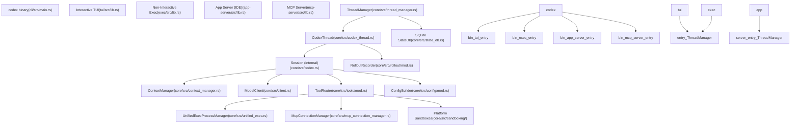
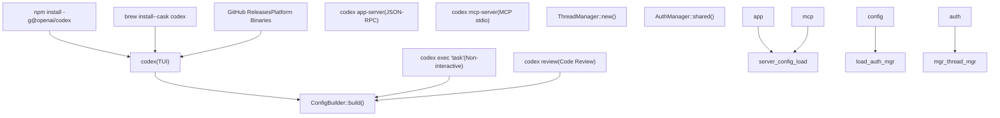
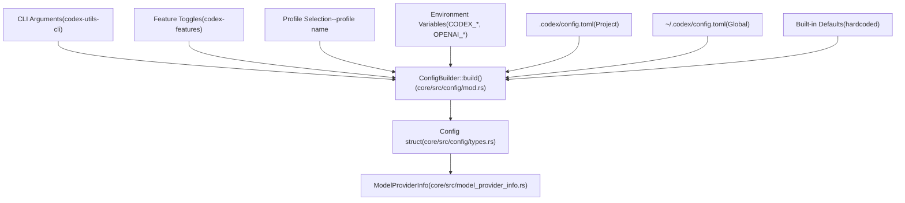

# 概述

相关源文件

-   [AGENTS.md](https://github.com/openai/codex/blob/d807d44a/AGENTS.md?plain=1)
-   [README.md](https://github.com/openai/codex/blob/d807d44a/README.md?plain=1)
-   [codex-rs/Cargo.lock](https://github.com/openai/codex/blob/d807d44a/codex-rs/Cargo.lock)
-   [codex-rs/Cargo.toml](https://github.com/openai/codex/blob/d807d44a/codex-rs/Cargo.toml)
-   [codex-rs/README.md](https://github.com/openai/codex/blob/d807d44a/codex-rs/README.md?plain=1)
-   [codex-rs/cli/Cargo.toml](https://github.com/openai/codex/blob/d807d44a/codex-rs/cli/Cargo.toml)
-   [codex-rs/cli/src/lib.rs](https://github.com/openai/codex/blob/d807d44a/codex-rs/cli/src/lib.rs)
-   [codex-rs/cli/src/main.rs](https://github.com/openai/codex/blob/d807d44a/codex-rs/cli/src/main.rs)
-   [codex-rs/config.md](https://github.com/openai/codex/blob/d807d44a/codex-rs/config.md?plain=1)
-   [codex-rs/core/Cargo.toml](https://github.com/openai/codex/blob/d807d44a/codex-rs/core/Cargo.toml)
-   [codex-rs/core/src/flags.rs](https://github.com/openai/codex/blob/d807d44a/codex-rs/core/src/flags.rs)
-   [codex-rs/core/src/lib.rs](https://github.com/openai/codex/blob/d807d44a/codex-rs/core/src/lib.rs)
-   [codex-rs/core/src/model\_provider\_info.rs](https://github.com/openai/codex/blob/d807d44a/codex-rs/core/src/model_provider_info.rs)
-   [codex-rs/exec/Cargo.toml](https://github.com/openai/codex/blob/d807d44a/codex-rs/exec/Cargo.toml)
-   [codex-rs/exec/src/cli.rs](https://github.com/openai/codex/blob/d807d44a/codex-rs/exec/src/cli.rs)
-   [codex-rs/exec/src/lib.rs](https://github.com/openai/codex/blob/d807d44a/codex-rs/exec/src/lib.rs)
-   [codex-rs/tui/Cargo.toml](https://github.com/openai/codex/blob/d807d44a/codex-rs/tui/Cargo.toml)
-   [codex-rs/tui/src/cli.rs](https://github.com/openai/codex/blob/d807d44a/codex-rs/tui/src/cli.rs)
-   [codex-rs/tui/src/lib.rs](https://github.com/openai/codex/blob/d807d44a/codex-rs/tui/src/lib.rs)
-   [docs/authentication.md](https://github.com/openai/codex/blob/d807d44a/docs/authentication.md?plain=1)
-   [docs/contributing.md](https://github.com/openai/codex/blob/d807d44a/docs/contributing.md?plain=1)
-   [docs/exec.md](https://github.com/openai/codex/blob/d807d44a/docs/exec.md?plain=1)
-   [docs/getting-started.md](https://github.com/openai/codex/blob/d807d44a/docs/getting-started.md?plain=1)
-   [docs/install.md](https://github.com/openai/codex/blob/d807d44a/docs/install.md?plain=1)
-   [docs/license.md](https://github.com/openai/codex/blob/d807d44a/docs/license.md?plain=1)
-   [docs/open-source-fund.md](https://github.com/openai/codex/blob/d807d44a/docs/open-source-fund.md?plain=1)
-   [docs/sandbox.md](https://github.com/openai/codex/blob/d807d44a/docs/sandbox.md?plain=1)
-   [justfile](https://github.com/openai/codex/blob/d807d44a/justfile)

Codex CLI 是 OpenAI 提供的 AI 编码代理，可在本地计算机上运行。它提供交互式终端界面、非交互式自动化模式，以及用于在 AI 协助下执行编码任务的 IDE 集成能力。该系统使用 Rust 作为 Cargo 工作区实现，支持多种执行模式、可配置沙箱、通过 Model Context Protocol（MCP）扩展工具，以及多代理工作流。

有关安装流程的详细信息，请参见 [安装与设置](/openai/codex/1.1-installation-and-setup)。有关配置选项，请参见 [配置系统](/openai/codex/2.2-configuration-system)。有关 IDE 集成细节，请参见 [应用服务器与 IDE 集成](/openai/codex/4.5-app-server-and-ide-integration)。

## 项目目标与架构

Codex 被设计为零依赖的原生可执行程序，用于协调 AI 模型交互、在沙箱环境中执行工具，并管理跨多个会话的对话状态。代码库组织为 Rust 工作区，并在核心业务逻辑、用户界面与集成点之间进行了清晰分层。

### 系统高层架构

**来源：** [codex-rs/cli/src/main.rs56-153](https://github.com/openai/codex/blob/d807d44a/codex-rs/cli/src/main.rs#L56-L153) [codex-rs/core/src/lib.rs1-189](https://github.com/openai/codex/blob/d807d44a/codex-rs/core/src/lib.rs#L1-L189) [README.md1-60](https://github.com/openai/codex/blob/d807d44a/README.md?plain=1#L1-L60)

## 执行模式

Codex 支持四种主要执行模式，分别服务于不同用例。所有模式都汇聚到同一套核心 `ThreadManager` 基础设施，但在事件呈现方式与用户交互处理上有所不同。

### 执行模式对比

| 模式 | 入口点 | 用例 | 会话持久化 | 用户交互 |
| --- | --- | --- | --- | --- |
| **TUI** | `codex`（默认） | 交互式开发 | 是（rollout 文件） | 完整交互式 UI |
| **Exec** | `codex exec` | 自动化/CI | 是（除非 `--ephemeral`） | 无（非交互） |
| **App Server** | `codex app-server` | IDE 集成 | 是 | JSON-RPC 协议 |
| **MCP Server** | `codex mcp-server` | 工具委派 | 是 | MCP 协议（stdio） |

### 命令分发与运行时初始化

**来源：** [codex-rs/cli/src/main.rs88-153](https://github.com/openai/codex/blob/d807d44a/codex-rs/cli/src/main.rs#L88-L153) [codex-rs/exec/src/lib.rs162-220](https://github.com/openai/codex/blob/d807d44a/codex-rs/exec/src/lib.rs#L162-L220) [codex-rs/tui/src/lib.rs7-61](https://github.com/openai/codex/blob/d807d44a/codex-rs/tui/src/lib.rs#L7-L61) [README.md13-46](https://github.com/openai/codex/blob/d807d44a/README.md?plain=1#L13-L46)

## 核心 Crate 组织结构

Codex 工作区由职责清晰的多个 crate 组成。核心业务逻辑位于 `codex-core`，而 UI 实现和集成点分别位于独立 crate 中。

### 主要 Crate

| Crate | 路径 | 用途 |
| --- | --- | --- |
| `codex-core` | `core/` | 核心代理逻辑、会话管理、模型客户端、工具编排 |
| `codex-tui` | `tui/` | 基于 Ratatui 的交互式终端 UI |
| `codex-exec` | `exec/` | 具备 JSONL 输出模式的非交互式无头 CLI |
| `codex-cli` | `cli/` | 多工具分发器、子命令路由、功能开关 |
| `codex-app-server` | `app-server/` | 面向 VS Code、Cursor 等 IDE 客户端的 JSON-RPC 服务器 |
| `codex-app-server-protocol` | `app-server-protocol/` | 应用服务器通信协议定义 |
| `codex-mcp-server` | `mcp-server/` | 将 Codex 作为工具暴露的 MCP 服务器实现 |
| `codex-protocol` | `protocol/` | 事件、配置、工具规格等共享协议类型 |
| `codex-config` | `config/` | 配置解析、校验与分层合并 |

**来源：** [codex-rs/Cargo.toml1-77](https://github.com/openai/codex/blob/d807d44a/codex-rs/Cargo.toml#L1-L77) [codex-rs/core/Cargo.toml1-62](https://github.com/openai/codex/blob/d807d44a/codex-rs/core/Cargo.toml#L1-L62) [codex-rs/tui/Cargo.toml1-58](https://github.com/openai/codex/blob/d807d44a/codex-rs/tui/Cargo.toml#L1-L58)

## 核心架构组件

核心引擎采用分层架构：`ThreadManager` 管理线程生命周期，`CodexThread` 协调会话执行，内部 `Session` 结构体处理逐轮模型交互。

### 线程与会话生命周期

> **[Mermaid sequence]**
> *(图表结构无法解析)*

**来源：** [codex-rs/core/src/lib.rs17-101](https://github.com/openai/codex/blob/d807d44a/codex-rs/core/src/lib.rs#L17-L101) [codex-rs/core/src/codex.rs1-50](https://github.com/openai/codex/blob/d807d44a/codex-rs/core/src/codex.rs#L1-L50) [codex-rs/core/src/client.rs169-176](https://github.com/openai/codex/blob/d807d44a/codex-rs/core/src/client.rs#L169-L176)

### 关键组件职责

| 组件 | 文件 | 主要职责 |
| --- | --- | --- |
| `ThreadManager` | `core/src/thread_manager.rs` | 线程创建/恢复、状态数据库交互、线程切换 |
| `CodexThread` | `core/src/codex_thread.rs` | 提交队列、事件发射、任务管理、rollout 记录 |
| `Session`（内部） | `core/src/codex.rs` | 轮次编排、提示构建、模型流式输出、工具路由 |
| `ContextManager` | `core/src/context_manager.rs` | 消息历史、token 跟踪、压缩触发、缓存前缀 |
| `ModelClient` | `core/src/client.rs` | HTTP/WebSocket 传输、SSE 解析、重试逻辑、鉴权头 |
| `ToolRouter` | `core/src/tools/mod.rs` | 工具注册、审批检查、沙箱选择、执行 |
| `RolloutRecorder` | `core/src/rollout/mod.rs` | 会话持久化、事件过滤、线程索引 |

**来源：** [codex-rs/core/src/lib.rs1-189](https://github.com/openai/codex/blob/d807d44a/codex-rs/core/src/lib.rs#L1-L189) [codex-rs/core/src/model\_provider\_info.rs72-130](https://github.com/openai/codex/blob/d807d44a/codex-rs/core/src/model_provider_info.rs#L72-L130)

## 配置系统

配置由多个层级组装，CLI 参数优先级最高，其后依次为环境变量、项目配置、全局配置和默认值。

**来源：** [codex-rs/core/src/config/mod.rs](https://github.com/openai/codex/blob/d807d44a/codex-rs/core/src/config/mod.rs) [codex-rs/cli/src/main.rs72-83](https://github.com/openai/codex/blob/d807d44a/codex-rs/cli/src/main.rs#L72-L83) [codex-rs/exec/src/cli.rs10-115](https://github.com/openai/codex/blob/d807d44a/codex-rs/exec/src/cli.rs#L10-L115)

## 模型提供方系统

Codex 通过统一的 `ModelProviderInfo` 注册表支持多个模型提供方。提供方可以是 OpenAI（默认）、经 ChatGPT 鉴权，或使用 OpenAI 兼容 API 的自定义 OSS 提供方（LM Studio、Ollama）。

### 提供方配置

| 提供方类型 | 认证方式 | Base URL | 线协议 |
| --- | --- | --- | --- |
| OpenAI | API Key (`OPENAI_API_KEY`) | `https://api.openai.com/v1` | `responses` |
| ChatGPT | OAuth token（存储于 auth.json） | `https://chatgpt.com/backend-api/codex` | `responses` |
| LM Studio | 无（本地） | `http://localhost:1234/v1` | `responses` |
| Ollama | 无（本地） | `http://localhost:11434/v1` | `responses` |

**来源：** [codex-rs/core/src/model\_provider\_info.rs31-130](https://github.com/openai/codex/blob/d807d44a/codex-rs/core/src/model_provider_info.rs#L31-L130) [codex-rs/exec/src/lib.rs46-47](https://github.com/openai/codex/blob/d807d44a/codex-rs/exec/src/lib.rs#L46-L47)

## 会话持久化与回放

会话会持久化为包含事件流的 rollout 文件，可用于恢复或分叉对话。`RolloutRecorder` 会按持久化模式过滤事件，并将其写入带时间戳的文件。

### Rollout 文件结构

Rollout 文件存储在 `~/.codex/sessions/` 下，按日期组织。每个文件都是 `.jsonl.zst` 归档，包含会话元数据与事件条目。

**来源：** [codex-rs/core/src/lib.rs134-156](https://github.com/openai/codex/blob/d807d44a/codex-rs/core/src/lib.rs#L134-L156) [codex-rs/core/src/state\_db.rs129](https://github.com/openai/codex/blob/d807d44a/codex-rs/core/src/state_db.rs#L129-L129)
