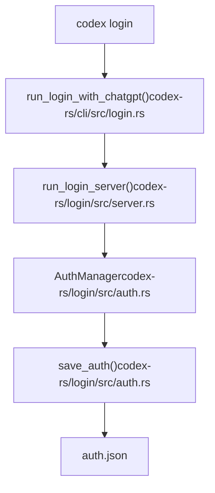
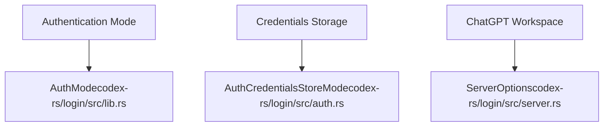

# 安装与设置

相关源文件

-   [AGENTS.md](https://github.com/openai/codex/blob/d807d44a/AGENTS.md?plain=1)
-   [README.md](https://github.com/openai/codex/blob/d807d44a/README.md?plain=1)
-   [codex-rs/cli/src/login.rs](https://github.com/openai/codex/blob/d807d44a/codex-rs/cli/src/login.rs)
-   [codex-rs/core/tests/suite/auth\_refresh.rs](https://github.com/openai/codex/blob/d807d44a/codex-rs/core/tests/suite/auth_refresh.rs)
-   [codex-rs/login/Cargo.toml](https://github.com/openai/codex/blob/d807d44a/codex-rs/login/Cargo.toml)
-   [codex-rs/login/src/lib.rs](https://github.com/openai/codex/blob/d807d44a/codex-rs/login/src/lib.rs)
-   [codex-rs/login/src/server.rs](https://github.com/openai/codex/blob/d807d44a/codex-rs/login/src/server.rs)
-   [codex-rs/login/src/token\_data.rs](https://github.com/openai/codex/blob/d807d44a/codex-rs/login/src/token_data.rs)
-   [codex-rs/login/tests/suite/login\_server\_e2e.rs](https://github.com/openai/codex/blob/d807d44a/codex-rs/login/tests/suite/login_server_e2e.rs)
-   [codex-rs/tui/src/ascii\_animation.rs](https://github.com/openai/codex/blob/d807d44a/codex-rs/tui/src/ascii_animation.rs)
-   [codex-rs/tui/src/chatwidget/snapshots/codex\_tui\_\_chatwidget\_\_tests\_\_rate\_limit\_switch\_prompt\_popup.snap](https://github.com/openai/codex/blob/d807d44a/codex-rs/tui/src/chatwidget/snapshots/codex_tui__chatwidget__tests__rate_limit_switch_prompt_popup.snap)
-   [codex-rs/tui/src/onboarding/auth.rs](https://github.com/openai/codex/blob/d807d44a/codex-rs/tui/src/onboarding/auth.rs)
-   [codex-rs/tui/src/onboarding/mod.rs](https://github.com/openai/codex/blob/d807d44a/codex-rs/tui/src/onboarding/mod.rs)
-   [codex-rs/tui/src/onboarding/onboarding\_screen.rs](https://github.com/openai/codex/blob/d807d44a/codex-rs/tui/src/onboarding/onboarding_screen.rs)
-   [codex-rs/tui/src/onboarding/trust\_directory.rs](https://github.com/openai/codex/blob/d807d44a/codex-rs/tui/src/onboarding/trust_directory.rs)
-   [codex-rs/tui/src/onboarding/welcome.rs](https://github.com/openai/codex/blob/d807d44a/codex-rs/tui/src/onboarding/welcome.rs)
-   [docs/authentication.md](https://github.com/openai/codex/blob/d807d44a/docs/authentication.md?plain=1)
-   [docs/contributing.md](https://github.com/openai/codex/blob/d807d44a/docs/contributing.md?plain=1)
-   [docs/exec.md](https://github.com/openai/codex/blob/d807d44a/docs/exec.md?plain=1)
-   [docs/getting-started.md](https://github.com/openai/codex/blob/d807d44a/docs/getting-started.md?plain=1)
-   [docs/install.md](https://github.com/openai/codex/blob/d807d44a/docs/install.md?plain=1)
-   [docs/license.md](https://github.com/openai/codex/blob/d807d44a/docs/license.md?plain=1)
-   [docs/open-source-fund.md](https://github.com/openai/codex/blob/d807d44a/docs/open-source-fund.md?plain=1)
-   [docs/sandbox.md](https://github.com/openai/codex/blob/d807d44a/docs/sandbox.md?plain=1)
-   [justfile](https://github.com/openai/codex/blob/d807d44a/justfile)

本页介绍 Codex CLI 的安装、认证与初始配置。Codex 以原生二进制形式通过 npm、Homebrew 或直接下载方式分发。安装后，你必须使用 ChatGPT OAuth 或 API key 进行认证。

关于从源码构建或开发环境设置，请参见 [开发环境设置](/openai/codex/9.1-development-setup)。

## 系统要求

**支持的平台：**

| 操作系统 | 架构 | 说明 |
| --- | --- | --- |
| macOS 11+ | ARM64（Apple Silicon）、x86\_64（Intel） | 已进行代码签名与公证 |
| Linux | x86\_64、ARM64 | 静态链接的 musl 二进制 [README.md39-41](https://github.com/openai/codex/blob/d807d44a/README.md?plain=1#L39-L41) |
| Windows 10+ | x86\_64、ARM64 | 通过 Azure Trusted Signing 签名 |

Codex 二进制是自包含的原生可执行文件。Linux 构建使用 `musl` libc，以最大化跨发行版兼容性 [README.md39-41](https://github.com/openai/codex/blob/d807d44a/README.md?plain=1#L39-L41)

来源： [README.md32-44](https://github.com/openai/codex/blob/d807d44a/README.md?plain=1#L32-L44)

## 安装方式

### npm（推荐）

使用 npm 全局安装（需要 Node.js）：

```
npm install -g @openai/codex
```
`@openai/codex` 包会自动为你的平台选择正确的二进制。安装后，`codex` 命令会在你的 PATH 中可用 [README.md1-21](https://github.com/openai/codex/blob/d807d44a/README.md?plain=1#L1-L21)

来源： [README.md19-22](https://github.com/openai/codex/blob/d807d44a/README.md?plain=1#L19-L22)

### Homebrew（macOS）

在 macOS 上，通过 Homebrew cask 安装：

```
brew install --cask codex
```
cask 会下载已签名的 DMG 并安装二进制 [README.md25-27](https://github.com/openai/codex/blob/d807d44a/README.md?plain=1#L25-L27)

来源： [README.md24-27](https://github.com/openai/codex/blob/d807d44a/README.md?plain=1#L24-L27)

### 直接下载

从 [latest GitHub Release](https://github.com/openai/codex/blob/d807d44a/latest GitHub Release) 下载预编译二进制 [README.md31-32](https://github.com/openai/codex/blob/d807d44a/README.md?plain=1#L31-L32)：

| 平台 | 推荐文件 |
| --- | --- |
| macOS ARM64 | `codex-aarch64-apple-darwin.tar.gz` |
| macOS x86\_64 | `codex-x86_64-apple-darwin.tar.gz` |
| Linux x86\_64 | `codex-x86_64-unknown-linux-musl.tar.gz` |
| Linux ARM64 | `codex-aarch64-unknown-linux-musl.tar.gz` |

解压后，将二进制重命名为 `codex`，并确保其位于 PATH 中 [README.md43](https://github.com/openai/codex/blob/d807d44a/README.md?plain=1#L43-L43)

来源： [README.md32-45](https://github.com/openai/codex/blob/d807d44a/README.md?plain=1#L32-L45)

## 验证安装

安装后，验证 Codex 可用：

```
codex --versioncodex --help
```
`codex` 二进制是一个多工具分发器，会分派到不同模式。主入口处理 `exec`、`mcp` 和 `login` 等子命令 [justfile10-15](https://github.com/openai/codex/blob/d807d44a/justfile#L10-L15)

来源： [justfile8-16](https://github.com/openai/codex/blob/d807d44a/justfile#L8-L16) [README.md29](https://github.com/openai/codex/blob/d807d44a/README.md?plain=1#L29-L29)

## 认证

首次运行时，Codex 会提示进行认证。支持两种主要方式：

### 使用 ChatGPT 登录（推荐）

使用你的 ChatGPT 账号（Plus、Pro、Team、Edu 或 Enterprise）进行认证 [README.md49](https://github.com/openai/codex/blob/d807d44a/README.md?plain=1#L49-L49)：

```
codex login
```
这会启动本地回调服务器以处理 OAuth 流程 [codex-rs/login/src/server.rs1-13](https://github.com/openai/codex/blob/d807d44a/codex-rs/login/src/server.rs#L1-L13)

**认证流程（代码实体）：**


来源： [codex-rs/cli/src/login.rs113-129](https://github.com/openai/codex/blob/d807d44a/codex-rs/cli/src/login.rs#L113-L129) [codex-rs/login/src/server.rs127-151](https://github.com/openai/codex/blob/d807d44a/codex-rs/login/src/server.rs#L127-L151) [codex-rs/login/src/auth.rs1-35](https://github.com/openai/codex/blob/d807d44a/codex-rs/login/src/auth.rs#L1-L35)

### 使用 API Key 登录

用于 OpenAI API key 认证 [README.md51](https://github.com/openai/codex/blob/d807d44a/README.md?plain=1#L51-L51)：

```
codex login --with-api-key
```
该方式使用 `login_with_api_key` 函数校验并存储 key [codex-rs/cli/src/login.rs161-188](https://github.com/openai/codex/blob/d807d44a/codex-rs/cli/src/login.rs#L161-L188) 也可从 `OPENAI_API_KEY` 环境变量读取 [codex-rs/login/src/auth.rs25](https://github.com/openai/codex/blob/d807d44a/codex-rs/login/src/auth.rs#L25-L25)

来源： [codex-rs/cli/src/login.rs161-188](https://github.com/openai/codex/blob/d807d44a/codex-rs/cli/src/login.rs#L161-L188) [codex-rs/login/src/auth.rs23-34](https://github.com/openai/codex/blob/d807d44a/codex-rs/login/src/auth.rs#L23-L34)

## 初始配置

Codex 配置通过 `config.toml` 文件管理。系统采用分层方式解析设置。

### 配置解析

设置按以下层级解析：

1.  CLI 覆盖（例如 `codex --model gpt-4`）
2.  环境变量（例如 `OPENAI_API_KEY`） [codex-rs/login/src/auth.rs23-26](https://github.com/openai/codex/blob/d807d44a/codex-rs/login/src/auth.rs#L23-L26)
3.  当前目录或 `~/.codex/` 中的 `config.toml`
4.  系统默认值

### 常见配置项

`AuthManager` 与 `Config` 结构体定义了核心运行参数 [codex-rs/login/src/auth.rs21](https://github.com/openai/codex/blob/d807d44a/codex-rs/login/src/auth.rs#L21-L21)

**配置空间到代码映射：**


来源： [codex-rs/login/src/lib.rs18-37](https://github.com/openai/codex/blob/d807d44a/codex-rs/login/src/lib.rs#L18-L37) [codex-rs/login/src/server.rs54-84](https://github.com/openai/codex/blob/d807d44a/codex-rs/login/src/server.rs#L54-L84) [codex-rs/login/src/auth.rs18-21](https://github.com/openai/codex/blob/d807d44a/codex-rs/login/src/auth.rs#L18-L21)

## TUI 首次引导

对于交互式用户，Codex 提供首次引导界面，指导完成认证与目录信任设置 [codex-rs/tui/src/onboarding/onboarding\_screen.rs56-61](https://github.com/openai/codex/blob/d807d44a/codex-rs/tui/src/onboarding/onboarding_screen.rs#L56-L61)

`OnboardingScreen` 管理多个步骤：

1.  **Welcome**：显示 ASCII 动画 [codex-rs/tui/src/onboarding/welcome.rs26-31](https://github.com/openai/codex/blob/d807d44a/codex-rs/tui/src/onboarding/welcome.rs#L26-L31)
2.  **Auth**：`AuthModeWidget` 支持在 ChatGPT 与 API Key 登录之间选择 [codex-rs/tui/src/onboarding/auth.rs196-208](https://github.com/openai/codex/blob/d807d44a/codex-rs/tui/src/onboarding/auth.rs#L196-L208)
3.  **Trust**：用户必须显式信任目录后才能执行工具 [codex-rs/tui/src/onboarding/onboarding\_screen.rs121-131](https://github.com/openai/codex/blob/d807d44a/codex-rs/tui/src/onboarding/onboarding_screen.rs#L121-L131)

来源： [codex-rs/tui/src/onboarding/onboarding\_screen.rs34-38](https://github.com/openai/codex/blob/d807d44a/codex-rs/tui/src/onboarding/onboarding_screen.rs#L34-L38) [codex-rs/tui/src/onboarding/auth.rs86-94](https://github.com/openai/codex/blob/d807d44a/codex-rs/tui/src/onboarding/auth.rs#L86-L94) [codex-rs/tui/src/onboarding/welcome.rs48-60](https://github.com/openai/codex/blob/d807d44a/codex-rs/tui/src/onboarding/welcome.rs#L48-L60)

---

**安装要点：**

1.  **全局安装**：使用 `npm install -g @openai/codex` 进行最简安装 [README.md21](https://github.com/openai/codex/blob/d807d44a/README.md?plain=1#L21-L21)
2.  **ChatGPT 登录**：使用 `codex login` 复用你现有的订阅 [README.md49](https://github.com/openai/codex/blob/d807d44a/README.md?plain=1#L49-L49)
3.  **远程/无头环境**：若无法使用浏览器，请使用 `codex login --device-auth` [codex-rs/cli/src/login.rs107-111](https://github.com/openai/codex/blob/d807d44a/codex-rs/cli/src/login.rs#L107-L111)
4.  **开发环境**：使用 `just install` 拉取依赖并校验 Rust 工具链 [justfile36-39](https://github.com/openai/codex/blob/d807d44a/justfile#L36-L39)
