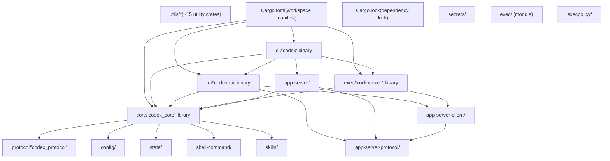
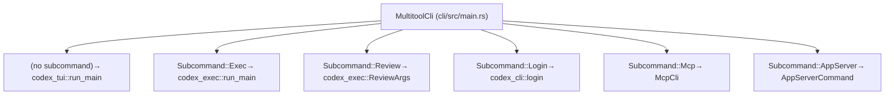
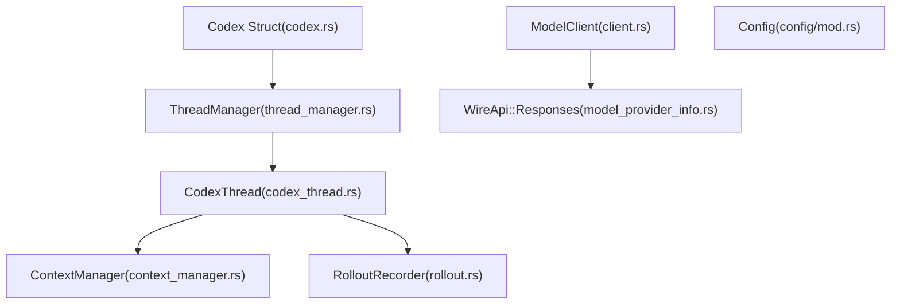

# 仓库结构

相关源文件

-   [.bazelrc](https://github.com/openai/codex/blob/d807d44a/.bazelrc)
-   [.github/workflows/Dockerfile.bazel](https://github.com/openai/codex/blob/d807d44a/.github/workflows/Dockerfile.bazel)
-   [.github/workflows/ci.bazelrc](https://github.com/openai/codex/blob/d807d44a/.github/workflows/ci.bazelrc)
-   [.gitignore](https://github.com/openai/codex/blob/d807d44a/.gitignore)
-   [BUILD.bazel](https://github.com/openai/codex/blob/d807d44a/BUILD.bazel)
-   [MODULE.bazel](https://github.com/openai/codex/blob/d807d44a/MODULE.bazel)
-   [MODULE.bazel.lock](https://github.com/openai/codex/blob/d807d44a/MODULE.bazel.lock)
-   [codex-rs/Cargo.lock](https://github.com/openai/codex/blob/d807d44a/codex-rs/Cargo.lock)
-   [codex-rs/Cargo.toml](https://github.com/openai/codex/blob/d807d44a/codex-rs/Cargo.toml)
-   [codex-rs/README.md](https://github.com/openai/codex/blob/d807d44a/codex-rs/README.md?plain=1)
-   [codex-rs/ansi-escape/BUILD.bazel](https://github.com/openai/codex/blob/d807d44a/codex-rs/ansi-escape/BUILD.bazel)
-   [codex-rs/app-server-protocol/BUILD.bazel](https://github.com/openai/codex/blob/d807d44a/codex-rs/app-server-protocol/BUILD.bazel)
-   [codex-rs/app-server/BUILD.bazel](https://github.com/openai/codex/blob/d807d44a/codex-rs/app-server/BUILD.bazel)
-   [codex-rs/cli/Cargo.toml](https://github.com/openai/codex/blob/d807d44a/codex-rs/cli/Cargo.toml)
-   [codex-rs/cli/src/lib.rs](https://github.com/openai/codex/blob/d807d44a/codex-rs/cli/src/lib.rs)
-   [codex-rs/cli/src/main.rs](https://github.com/openai/codex/blob/d807d44a/codex-rs/cli/src/main.rs)
-   [codex-rs/config.md](https://github.com/openai/codex/blob/d807d44a/codex-rs/config.md?plain=1)
-   [codex-rs/core/BUILD.bazel](https://github.com/openai/codex/blob/d807d44a/codex-rs/core/BUILD.bazel)
-   [codex-rs/core/Cargo.toml](https://github.com/openai/codex/blob/d807d44a/codex-rs/core/Cargo.toml)
-   [codex-rs/core/src/flags.rs](https://github.com/openai/codex/blob/d807d44a/codex-rs/core/src/flags.rs)
-   [codex-rs/core/src/lib.rs](https://github.com/openai/codex/blob/d807d44a/codex-rs/core/src/lib.rs)
-   [codex-rs/core/src/model\_provider\_info.rs](https://github.com/openai/codex/blob/d807d44a/codex-rs/core/src/model_provider_info.rs)
-   [codex-rs/default.nix](https://github.com/openai/codex/blob/d807d44a/codex-rs/default.nix)
-   [codex-rs/deny.toml](https://github.com/openai/codex/blob/d807d44a/codex-rs/deny.toml)
-   [codex-rs/exec/Cargo.toml](https://github.com/openai/codex/blob/d807d44a/codex-rs/exec/Cargo.toml)
-   [codex-rs/exec/src/cli.rs](https://github.com/openai/codex/blob/d807d44a/codex-rs/exec/src/cli.rs)
-   [codex-rs/exec/src/lib.rs](https://github.com/openai/codex/blob/d807d44a/codex-rs/exec/src/lib.rs)
-   [codex-rs/mcp-server/BUILD.bazel](https://github.com/openai/codex/blob/d807d44a/codex-rs/mcp-server/BUILD.bazel)
-   [codex-rs/tui/Cargo.toml](https://github.com/openai/codex/blob/d807d44a/codex-rs/tui/Cargo.toml)
-   [codex-rs/tui/src/cli.rs](https://github.com/openai/codex/blob/d807d44a/codex-rs/tui/src/cli.rs)
-   [codex-rs/tui/src/lib.rs](https://github.com/openai/codex/blob/d807d44a/codex-rs/tui/src/lib.rs)
-   [codex-rs/utils/cargo-bin/BUILD.bazel](https://github.com/openai/codex/blob/d807d44a/codex-rs/utils/cargo-bin/BUILD.bazel)
-   [defs.bzl](https://github.com/openai/codex/blob/d807d44a/defs.bzl)
-   [flake.lock](https://github.com/openai/codex/blob/d807d44a/flake.lock)
-   [flake.nix](https://github.com/openai/codex/blob/d807d44a/flake.nix)
-   [patches/BUILD.bazel](https://github.com/openai/codex/blob/d807d44a/patches/BUILD.bazel)
-   [patches/v8\_bazel\_rules.patch](https://github.com/openai/codex/blob/d807d44a/patches/v8_bazel_rules.patch)
-   [rbe.bzl](https://github.com/openai/codex/blob/d807d44a/rbe.bzl)
-   [third\_party/v8/BUILD.bazel](https://github.com/openai/codex/blob/d807d44a/third_party/v8/BUILD.bazel)
-   [third\_party/v8/README.md](https://github.com/openai/codex/blob/d807d44a/third_party/v8/README.md?plain=1)

本页记录 `codex-rs` 仓库中的 Cargo 工作区组织方式、关键 crate 以及依赖关系。有关架构模式和执行模式，请参见 [1.3 Architecture Overview](https://github.com/openai/codex/blob/d807d44a/1.3 Architecture Overview)

## 范围与组织

`codex-rs` 仓库组织为一个 Cargo 工作区，包含大约 70 个 crate。该工作区采用 monorepo 结构，所有 crate 通过根 `Cargo.toml` 清单共享通用工具、依赖和构建配置。

**来源：** [codex-rs/Cargo.toml1-77](https://github.com/openai/codex/blob/d807d44a/codex-rs/Cargo.toml#L1-L77) [codex-rs/README.md93-102](https://github.com/openai/codex/blob/d807d44a/codex-rs/README.md?plain=1#L93-L102)

---

## 工作区结构

工作区定义在 [codex-rs/Cargo.toml1-77](https://github.com/openai/codex/blob/d807d44a/codex-rs/Cargo.toml#L1-L77) 中，`[workspace]` 段列出了所有成员 crate。工作区通过 `[workspace.package]`、`[workspace.dependencies]` 和 `[workspace.lints]` 段强制共享配置。

### 工作区组件映射

**来源：** [codex-rs/Cargo.toml1-164](https://github.com/openai/codex/blob/d807d44a/codex-rs/Cargo.toml#L1-L164) [codex-rs/README.md93-102](https://github.com/openai/codex/blob/d807d44a/codex-rs/README.md?plain=1#L93-L102)

---

## 入口点 Crate

### CLI 多工具（`cli/`）

`codex` 二进制作为统一入口点，通过子命令路由到不同执行模式。位于 [codex-rs/cli/src/main.rs71-86](https://github.com/openai/codex/blob/d807d44a/codex-rs/cli/src/main.rs#L71-L86) 的 `MultitoolCli` 结构体定义了命令结构。

| 二进制名称 | Crate | 主要功能 |
| --- | --- | --- |
| `codex` | `codex-cli` | 带子命令路由的多工具分发器 |
| `codex-tui` | `codex-tui` | 交互式终端 UI（可由 `codex` 或 `codex-tui` 启动） |
| `codex-exec` | `codex-exec` | 非交互/无头执行 |

**子命令分发：** CLI 分发到 [codex-rs/cli/src/main.rs88-153](https://github.com/openai/codex/blob/d807d44a/codex-rs/cli/src/main.rs#L88-L153) 中定义的子命令：

**来源：** [codex-rs/cli/src/main.rs71-153](https://github.com/openai/codex/blob/d807d44a/codex-rs/cli/src/main.rs#L71-L153) [codex-rs/README.md93-100](https://github.com/openai/codex/blob/d807d44a/codex-rs/README.md?plain=1#L93-L100)

### 交互式 TUI（`tui/`）

`codex-tui` crate 提供基于 [Ratatui](https://ratatui.rs/) 的全屏终端界面。

-   **二进制：** `codex-tui`（[codex-rs/tui/Cargo.toml7-9](https://github.com/openai/codex/blob/d807d44a/codex-rs/tui/Cargo.toml#L7-L9)）
-   **主入口：** `run_main` 是 TUI 应用入口 [codex-rs/tui/src/lib.rs230-530](https://github.com/openai/codex/blob/d807d44a/codex-rs/tui/src/lib.rs#L230-L530)
-   **应用生命周期：** 位于 [codex-rs/tui/src/lib.rs7](https://github.com/openai/codex/blob/d807d44a/codex-rs/tui/src/lib.rs#L7-L7) 的 `App` 结构体管理 UI 状态和事件循环。
-   **客户端集成：** 它使用 `InProcessAppServerClient` [codex-rs/tui/src/lib.rs32](https://github.com/openai/codex/blob/d807d44a/codex-rs/tui/src/lib.rs#L32-L32) 与核心逻辑通信。

**来源：** [codex-rs/tui/src/lib.rs1-64](https://github.com/openai/codex/blob/d807d44a/codex-rs/tui/src/lib.rs#L1-L64) [codex-rs/tui/Cargo.toml1-13](https://github.com/openai/codex/blob/d807d44a/codex-rs/tui/Cargo.toml#L1-L13)

### 无头执行（`exec/`）

`codex-exec` 二进制支持非交互运行，并可输出到 stdout/stderr 或 JSONL。

-   **二进制：** `codex-exec`（[codex-rs/exec/Cargo.toml7-9](https://github.com/openai/codex/blob/d807d44a/codex-rs/exec/Cargo.toml#L7-L9)）
-   **核心入口：** [codex-rs/exec/src/lib.rs162-205](https://github.com/openai/codex/blob/d807d44a/codex-rs/exec/src/lib.rs#L162-L205) 中的 `run_main` 初始化执行环境。
-   **输出模式：**
    -   用于终端显示的 `EventProcessorWithHumanOutput` [codex-rs/exec/src/lib.rs78](https://github.com/openai/codex/blob/d807d44a/codex-rs/exec/src/lib.rs#L78-L78)
    -   用于 JSONL 输出的 `EventProcessorWithJsonOutput` [codex-rs/exec/src/lib.rs79](https://github.com/openai/codex/blob/d807d44a/codex-rs/exec/src/lib.rs#L79-L79)

**来源：** [codex-rs/exec/src/lib.rs1-118](https://github.com/openai/codex/blob/d807d44a/codex-rs/exec/src/lib.rs#L1-L118) [codex-rs/exec/src/cli.rs10-115](https://github.com/openai/codex/blob/d807d44a/codex-rs/exec/src/cli.rs#L10-L115)

---

## 核心引擎（`core/`）

`codex-core` crate 包含会话、模型交互与工具编排的业务逻辑。

### 关键模块与导出

根模块 [codex-rs/core/src/lib.rs1-189](https://github.com/openai/codex/blob/d807d44a/codex-rs/core/src/lib.rs#L1-L189) 重新导出主要类型：

| 导出项 | 来源模块 | 用途 |
| --- | --- | --- |
| `Codex` | [core/src/lib.rs17](https://github.com/openai/codex/blob/d807d44a/core/src/lib.rs#L17-L17) | 主会话控制器 |
| `CodexThread` | [core/src/lib.rs23](https://github.com/openai/codex/blob/d807d44a/core/src/lib.rs#L23-L23) | 管理单个会话线程 |
| `ThreadManager` | [core/src/lib.rs101](https://github.com/openai/codex/blob/d807d44a/core/src/lib.rs#L101-L101) | 编排多个线程/代理 |
| `ModelClient` | [core/src/lib.rs169](https://github.com/openai/codex/blob/d807d44a/core/src/lib.rs#L169-L169) | 处理 LLM API 通信 |
| `RolloutRecorder` | [core/src/lib.rs136](https://github.com/openai/codex/blob/d807d44a/core/src/lib.rs#L136-L136) | 处理会话落盘持久化 |
| `ModelProviderInfo` | [core/src/lib.rs86](https://github.com/openai/codex/blob/d807d44a/core/src/lib.rs#L86-L86) | 模型端点配置 |

**来源：** [codex-rs/core/src/lib.rs1-189](https://github.com/openai/codex/blob/d807d44a/codex-rs/core/src/lib.rs#L1-L189) [codex-rs/core/src/model\_provider\_info.rs72-130](https://github.com/openai/codex/blob/d807d44a/codex-rs/core/src/model_provider_info.rs#L72-L130)

---

## 工具类 Crate

工作区在 `utils/*` 下包含约 15 个工具类 crate，提供专门能力：

| Crate | 用途 | 关键实体 |
| --- | --- | --- |
| `codex-utils-absolute-path` | 安全路径处理 | `AbsolutePathBuf` [codex-rs/Cargo.toml144](https://github.com/openai/codex/blob/d807d44a/codex-rs/Cargo.toml#L144-L144) |
| `codex-utils-pty` | 伪终端管理 | `Pty` [codex-rs/Cargo.toml155](https://github.com/openai/codex/blob/d807d44a/codex-rs/Cargo.toml#L155-L155) |
| `codex-utils-image` | 视觉图像处理 | `Image` [codex-rs/Cargo.toml152](https://github.com/openai/codex/blob/d807d44a/codex-rs/Cargo.toml#L152-L152) |
| `codex-utils-home-dir` | 跨平台 home 目录检测 | `HomeDir` [codex-rs/Cargo.toml156](https://github.com/openai/codex/blob/d807d44a/codex-rs/Cargo.toml#L156-L156) |
| `codex-utils-stream-parser` | SSE 与流处理 | `StreamParser` [codex-rs/Cargo.toml160](https://github.com/openai/codex/blob/d807d44a/codex-rs/Cargo.toml#L160-L160) |

**来源：** [codex-rs/Cargo.toml144-161](https://github.com/openai/codex/blob/d807d44a/codex-rs/Cargo.toml#L144-L161)

---

## 依赖与构建配置

### 共享依赖

常用依赖固定在工作区根 [codex-rs/Cargo.toml89-314](https://github.com/openai/codex/blob/d807d44a/codex-rs/Cargo.toml#L89-L314) 重要依赖包括：

-   `ratatui`：用于 TUI 渲染 [codex-rs/tui/Cargo.toml71](https://github.com/openai/codex/blob/d807d44a/codex-rs/tui/Cargo.toml#L71-L71)
-   `tokio`：异步运行时 [codex-rs/core/Cargo.toml102](https://github.com/openai/codex/blob/d807d44a/codex-rs/core/Cargo.toml#L102-L102)
-   `clap`：CLI 参数解析 [codex-rs/cli/src/main.rs3](https://github.com/openai/codex/blob/d807d44a/codex-rs/cli/src/main.rs#L3-L3)

### 平台特定目标

代码库针对不同 OS 目标使用条件编译：

-   **Linux：** 包含 `landlock` 用于沙箱 [codex-rs/core/Cargo.toml121](https://github.com/openai/codex/blob/d807d44a/codex-rs/core/Cargo.toml#L121-L121)
-   **Windows：** 使用 `windows-sys` 进行控制台与 COM 交互 [codex-rs/core/Cargo.toml136-140](https://github.com/openai/codex/blob/d807d44a/codex-rs/core/Cargo.toml#L136-L140)
-   **macOS：** 使用 `core-foundation` [codex-rs/core/Cargo.toml125](https://github.com/openai/codex/blob/d807d44a/codex-rs/core/Cargo.toml#L125-L125)

**来源：** [codex-rs/Cargo.toml89-164](https://github.com/openai/codex/blob/d807d44a/codex-rs/Cargo.toml#L89-L164) [codex-rs/core/Cargo.toml120-144](https://github.com/openai/codex/blob/d807d44a/codex-rs/core/Cargo.toml#L120-L144)
