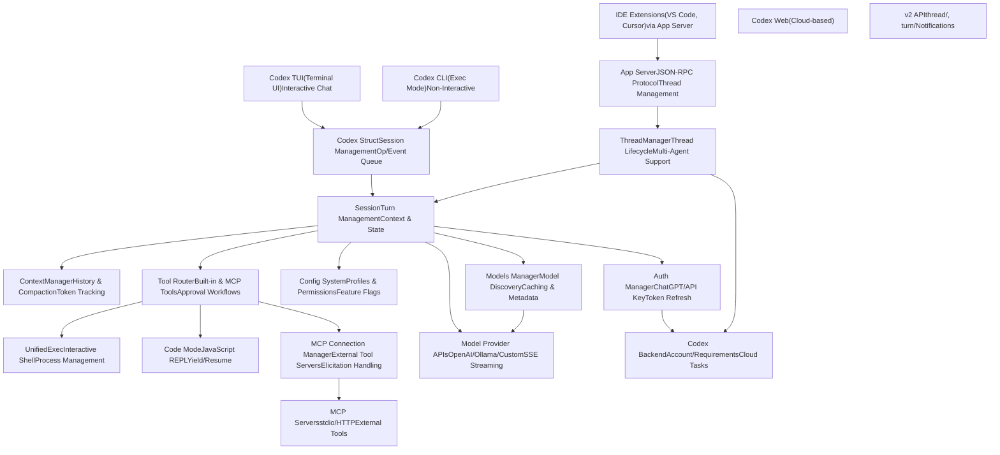
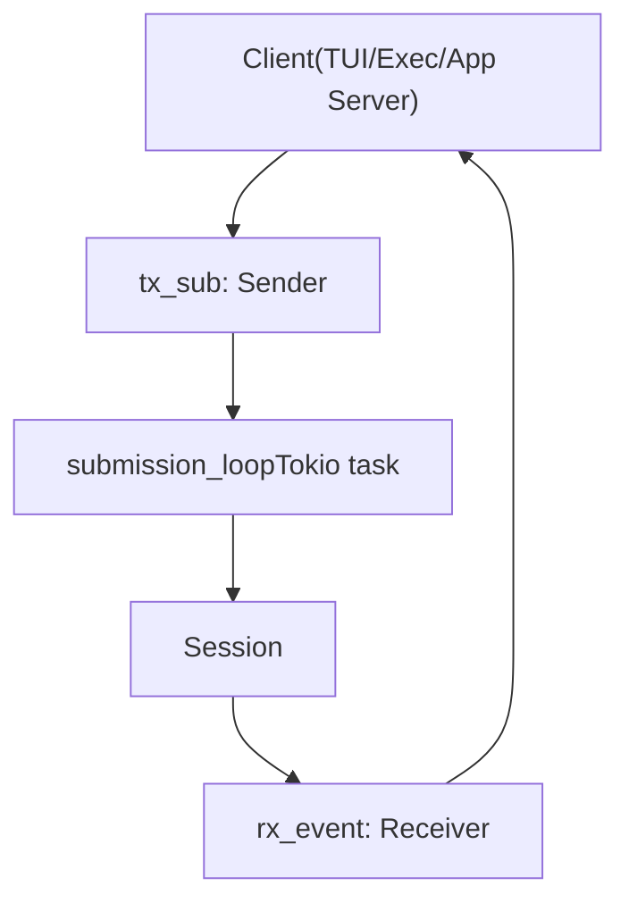
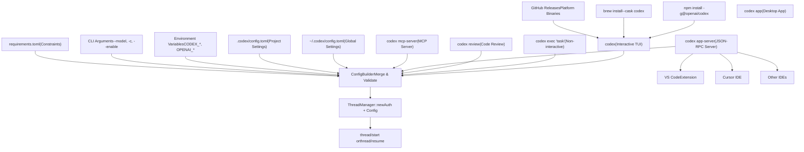
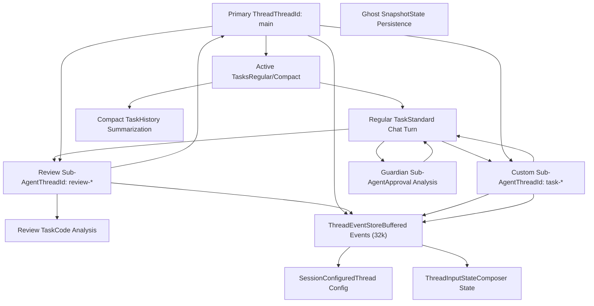
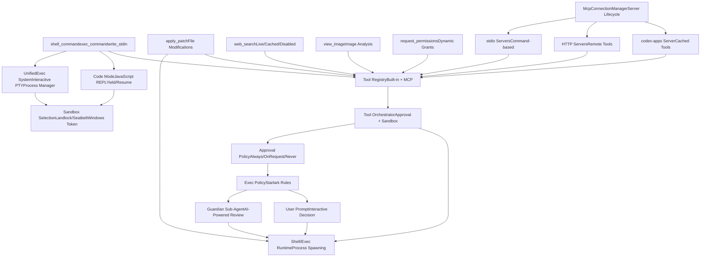
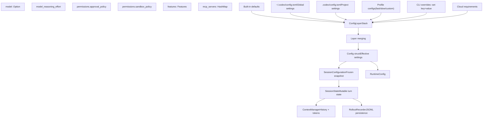
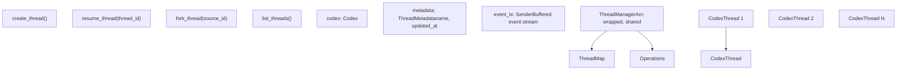

# 架构总览

相关源文件

-   [codex-rs/Cargo.lock](https://github.com/openai/codex/blob/d807d44a/codex-rs/Cargo.lock)
-   [codex-rs/Cargo.toml](https://github.com/openai/codex/blob/d807d44a/codex-rs/Cargo.toml)
-   [codex-rs/README.md](https://github.com/openai/codex/blob/d807d44a/codex-rs/README.md?plain=1)
-   [codex-rs/app-server-protocol/schema/json/ClientRequest.json](https://github.com/openai/codex/blob/d807d44a/codex-rs/app-server-protocol/schema/json/ClientRequest.json)
-   [codex-rs/app-server-protocol/schema/json/ServerNotification.json](https://github.com/openai/codex/blob/d807d44a/codex-rs/app-server-protocol/schema/json/ServerNotification.json)
-   [codex-rs/app-server-protocol/schema/json/codex\_app\_server\_protocol.schemas.json](https://github.com/openai/codex/blob/d807d44a/codex-rs/app-server-protocol/schema/json/codex_app_server_protocol.schemas.json)
-   [codex-rs/app-server-protocol/schema/json/codex\_app\_server\_protocol.v2.schemas.json](https://github.com/openai/codex/blob/d807d44a/codex-rs/app-server-protocol/schema/json/codex_app_server_protocol.v2.schemas.json)
-   [codex-rs/app-server-protocol/schema/typescript/ServerNotification.ts](https://github.com/openai/codex/blob/d807d44a/codex-rs/app-server-protocol/schema/typescript/ServerNotification.ts)
-   [codex-rs/app-server-protocol/schema/typescript/v2/index.ts](https://github.com/openai/codex/blob/d807d44a/codex-rs/app-server-protocol/schema/typescript/v2/index.ts)
-   [codex-rs/app-server-protocol/src/protocol/common.rs](https://github.com/openai/codex/blob/d807d44a/codex-rs/app-server-protocol/src/protocol/common.rs)
-   [codex-rs/app-server-protocol/src/protocol/v2.rs](https://github.com/openai/codex/blob/d807d44a/codex-rs/app-server-protocol/src/protocol/v2.rs)
-   [codex-rs/app-server/README.md](https://github.com/openai/codex/blob/d807d44a/codex-rs/app-server/README.md?plain=1)
-   [codex-rs/app-server/src/bespoke\_event\_handling.rs](https://github.com/openai/codex/blob/d807d44a/codex-rs/app-server/src/bespoke_event_handling.rs)
-   [codex-rs/app-server/src/codex\_message\_processor.rs](https://github.com/openai/codex/blob/d807d44a/codex-rs/app-server/src/codex_message_processor.rs)
-   [codex-rs/app-server/tests/common/mcp\_process.rs](https://github.com/openai/codex/blob/d807d44a/codex-rs/app-server/tests/common/mcp_process.rs)
-   [codex-rs/app-server/tests/suite/v2/mod.rs](https://github.com/openai/codex/blob/d807d44a/codex-rs/app-server/tests/suite/v2/mod.rs)
-   [codex-rs/cli/Cargo.toml](https://github.com/openai/codex/blob/d807d44a/codex-rs/cli/Cargo.toml)
-   [codex-rs/cli/src/lib.rs](https://github.com/openai/codex/blob/d807d44a/codex-rs/cli/src/lib.rs)
-   [codex-rs/cli/src/main.rs](https://github.com/openai/codex/blob/d807d44a/codex-rs/cli/src/main.rs)
-   [codex-rs/config.md](https://github.com/openai/codex/blob/d807d44a/codex-rs/config.md?plain=1)
-   [codex-rs/core/Cargo.toml](https://github.com/openai/codex/blob/d807d44a/codex-rs/core/Cargo.toml)
-   [codex-rs/core/src/codex.rs](https://github.com/openai/codex/blob/d807d44a/codex-rs/core/src/codex.rs)
-   [codex-rs/core/src/flags.rs](https://github.com/openai/codex/blob/d807d44a/codex-rs/core/src/flags.rs)
-   [codex-rs/core/src/lib.rs](https://github.com/openai/codex/blob/d807d44a/codex-rs/core/src/lib.rs)
-   [codex-rs/core/src/model\_provider\_info.rs](https://github.com/openai/codex/blob/d807d44a/codex-rs/core/src/model_provider_info.rs)
-   [codex-rs/core/src/rollout/policy.rs](https://github.com/openai/codex/blob/d807d44a/codex-rs/core/src/rollout/policy.rs)
-   [codex-rs/exec/Cargo.toml](https://github.com/openai/codex/blob/d807d44a/codex-rs/exec/Cargo.toml)
-   [codex-rs/exec/src/cli.rs](https://github.com/openai/codex/blob/d807d44a/codex-rs/exec/src/cli.rs)
-   [codex-rs/exec/src/event\_processor.rs](https://github.com/openai/codex/blob/d807d44a/codex-rs/exec/src/event_processor.rs)
-   [codex-rs/exec/src/event\_processor\_with\_human\_output.rs](https://github.com/openai/codex/blob/d807d44a/codex-rs/exec/src/event_processor_with_human_output.rs)
-   [codex-rs/exec/src/lib.rs](https://github.com/openai/codex/blob/d807d44a/codex-rs/exec/src/lib.rs)
-   [codex-rs/mcp-server/src/codex\_tool\_runner.rs](https://github.com/openai/codex/blob/d807d44a/codex-rs/mcp-server/src/codex_tool_runner.rs)
-   [codex-rs/protocol/src/protocol.rs](https://github.com/openai/codex/blob/d807d44a/codex-rs/protocol/src/protocol.rs)
-   [codex-rs/tui/Cargo.toml](https://github.com/openai/codex/blob/d807d44a/codex-rs/tui/Cargo.toml)
-   [codex-rs/tui/src/app.rs](https://github.com/openai/codex/blob/d807d44a/codex-rs/tui/src/app.rs)
-   [codex-rs/tui/src/app\_event.rs](https://github.com/openai/codex/blob/d807d44a/codex-rs/tui/src/app_event.rs)
-   [codex-rs/tui/src/bottom\_pane/chat\_composer.rs](https://github.com/openai/codex/blob/d807d44a/codex-rs/tui/src/bottom_pane/chat_composer.rs)
-   [codex-rs/tui/src/bottom\_pane/mod.rs](https://github.com/openai/codex/blob/d807d44a/codex-rs/tui/src/bottom_pane/mod.rs)
-   [codex-rs/tui/src/chatwidget.rs](https://github.com/openai/codex/blob/d807d44a/codex-rs/tui/src/chatwidget.rs)
-   [codex-rs/tui/src/chatwidget/tests.rs](https://github.com/openai/codex/blob/d807d44a/codex-rs/tui/src/chatwidget/tests.rs)
-   [codex-rs/tui/src/cli.rs](https://github.com/openai/codex/blob/d807d44a/codex-rs/tui/src/cli.rs)
-   [codex-rs/tui/src/history\_cell.rs](https://github.com/openai/codex/blob/d807d44a/codex-rs/tui/src/history_cell.rs)
-   [codex-rs/tui/src/lib.rs](https://github.com/openai/codex/blob/d807d44a/codex-rs/tui/src/lib.rs)
-   [codex-rs/tui/src/slash\_command.rs](https://github.com/openai/codex/blob/d807d44a/codex-rs/tui/src/slash_command.rs)

Codex 是一个 AI 编码代理，支持多种执行模式（TUI、CLI、IDE 集成、Web 界面），并由共享核心引擎统一驱动。系统使用基于队列的提交/事件协议，以支持异步、可中断的工作流。

## 系统组织

该架构由六个主要子系统组成：

1.  **用户界面** – TUI、CLI exec 模式、IDE app-server 和 Web 界面
2.  **核心引擎** – 会话管理、轮次执行和事件处理（`codex-rs/core`）
3.  **执行与工具** – 内置工具与 MCP 工具，含审批工作流和沙箱
4.  **配置与模型管理** – 分层配置、profile、模型元数据与认证
5.  **外部服务** – 模型提供方 API、MCP 服务器和云后端
6.  **应用服务器** – 用于 IDE 集成的 JSON-RPC 协议

核心设计模式是**异步提交/事件队列**：用户操作作为 `Op` 消息提交，代理处理后将结果以 `EventMsg` 事件流回。该模式可在所有界面中实现取消、中断和流式 UX。

安装流程请参见 1.1 页。crate 级组织请参见 1.2 页。协议语义细节请参见 2.1 页。

---

## 完整系统概览

下图展示了所有主要子系统如何连接。用户界面（TUI、CLI、IDE 扩展、Web）向核心引擎提交操作，核心引擎协调模型 API 调用、工具执行和状态持久化。配置通过多层流转，MCP 服务器提供外部工具集成。

**图：完整系统架构**

**分析：** 系统支持四种执行模式（TUI、CLI、IDE、Web），并全部汇聚到核心引擎。`Codex` 结构体通过提交/事件队列模式管理会话生命周期，并将轮次执行委派给 `Session`。`Session` 协调上下文管理、工具执行、配置与模型交互。工具可以是内置（`UnifiedExec`、`CodeMode`）或外部（MCP 服务器）。应用服务器通过 JSON-RPC 为 IDE 集成提供单独入口，同时封装同一套核心 `ThreadManager` 基础设施。

**来源：** [codex-rs/core/src/codex.rs274-520](https://github.com/openai/codex/blob/d807d44a/codex-rs/core/src/codex.rs#L274-L520) [codex-rs/core/src/thread\_manager.rs50-100](https://github.com/openai/codex/blob/d807d44a/codex-rs/core/src/thread_manager.rs#L50-L100) [codex-rs/app-server/src/codex\_message\_processor.rs1-100](https://github.com/openai/codex/blob/d807d44a/codex-rs/app-server/src/codex_message_processor.rs#L1-L100)

---

## 提交/事件队列模式

核心引擎使用基于异步队列的协议，将操作提交与执行解耦。客户端提交 `Op` 消息并接收 `EventMsg` 结果。该设计支持流式 UX、取消能力以及多客户端支持。

**图：提交与事件流**

**关键协议类型：**

-   **`Submission`**：将 `Op` 与唯一 ID 及可选 trace 上下文封装 [codex-rs/protocol/src/protocol.rs101-111](https://github.com/openai/codex/blob/d807d44a/codex-rs/protocol/src/protocol.rs#L101-L111)
-   **`Op`**：操作变体包括 `UserTurn`、`Interrupt`、`Shutdown`、`ExecApproval`、`SteerInput` [codex-rs/protocol/src/protocol.rs664-850](https://github.com/openai/codex/blob/d807d44a/codex-rs/protocol/src/protocol.rs#L664-L850)
-   **`Event`**：将 `EventMsg` 与 submission ID 封装 [codex-rs/protocol/src/protocol.rs178-350](https://github.com/openai/codex/blob/d807d44a/codex-rs/protocol/src/protocol.rs#L178-L350)
-   **`EventMsg`**：事件变体包括 `SessionConfigured`、`TurnStarted`、`AgentMessageDelta`、`ExecCommandBegin`、`ExecCommandEnd`、`TurnComplete` [codex-rs/protocol/src/protocol.rs178-350](https://github.com/openai/codex/blob/d807d44a/codex-rs/protocol/src/protocol.rs#L178-L350)

`submission_loop` 作为专用 Tokio 任务顺序分发操作。这确保了状态变更线性化，同时允许异步 I/O。客户端通过 `Codex::submit()` 入队工作，通过 `Codex::next_event()` 接收结果。

**来源：** [codex-rs/core/src/codex.rs330-341](https://github.com/openai/codex/blob/d807d44a/codex-rs/core/src/codex.rs#L330-L341) [codex-rs/protocol/src/protocol.rs101-111](https://github.com/openai/codex/blob/d807d44a/codex-rs/protocol/src/protocol.rs#L101-L111) [codex-rs/protocol/src/protocol.rs178-350](https://github.com/openai/codex/blob/d807d44a/codex-rs/protocol/src/protocol.rs#L178-L350)

---

## 请求/响应流程

下图展示了用户轮次如何在系统中流动：从输入提交开始，经过提示构建、模型流式输出、工具执行，直到最终完成。

**图：用户轮次执行流程**

> **[Mermaid sequence]**
> *(图表结构无法解析)*

**分析：** 该时序展示了完整用户轮次。UI 将 `Op::UserInput` 提交到 `Codex` 提交队列，并分发到 `Session`。会话使用 `ContextManager` 构建提示（利用缓存前缀提升性能），随后从模型 API 流式获取响应。事件按层回传：`ResponseEvent` → `EventMsg` → UI。工具调用会中断流以执行（含审批检查），之后恢复。轮次完成时会更新 token 用量，并在接近上下文窗口上限时触发自动压缩。

**来源：** [codex-rs/core/src/codex.rs1500-1800](https://github.com/openai/codex/blob/d807d44a/codex-rs/core/src/codex.rs#L1500-L1800) [codex-rs/core/src/client.rs158-161](https://github.com/openai/codex/blob/d807d44a/codex-rs/core/src/client.rs#L158-L161) [codex-rs/core/src/compact.rs22-26](https://github.com/openai/codex/blob/d807d44a/codex-rs/core/src/compact.rs#L22-L26)

---

## 执行模式与入口点

Codex 支持多种执行模式，每种模式有不同安装路径与配置来源。所有模式最终都汇聚到 `ThreadManager` 进行线程初始化。

**图：执行模式与配置组装**

**分析：** 安装可通过 npm（跨平台）、Homebrew（macOS）或直接二进制（全平台）完成。CLI 支持五种执行模式：交互式 TUI（默认）、非交互 exec、代码审查、应用服务器（用于 IDE 集成）和 MCP 服务器（用于工具委派）。配置来源按层级叠加，CLI 参数优先级最高，其后依次为环境变量、项目配置、全局配置与 requirements（约束）。`ConfigBuilder` 在初始化 `ThreadManager` 前会合并这些来源并校验结果。

**来源：** [codex-rs/cli/src/main.rs1-50](https://github.com/openai/codex/blob/d807d44a/codex-rs/cli/src/main.rs#L1-L50) [codex-rs/core/src/config/mod.rs1-100](https://github.com/openai/codex/blob/d807d44a/codex-rs/core/src/config/mod.rs#L1-L100) [codex-rs/core/src/thread\_manager.rs50-100](https://github.com/openai/codex/blob/d807d44a/codex-rs/core/src/thread_manager.rs#L50-L100)

### 执行模式摘要

| 模式 | 入口点 | 主要用例 | 事件处理 |
| --- | --- | --- | --- |
| **TUI** | `codex` binary, `App` struct | 交互式终端会话 | `ChatWidget` 维护 UI 状态并渲染单元 |
| **Exec** | `codex exec` subcommand | CI/CD 流水线、脚本 | `EventProcessorWithHumanOutput` 或 `EventProcessorWithJsonOutput` |
| **App Server** | `codex app-server` binary | IDE 扩展（VS Code、Cursor） | `CodexMessageProcessor` 转换为 JSON-RPC 通知 |
| **Review** | `codex review` subcommand | 代码审查工作流 | 启动受限配置的 review 子代理 |
| **MCP Server** | `codex mcp-server` binary | 将 Codex 作为 MCP 工具提供方 | 处理 MCP 协议请求 |

**来源：** [codex-rs/tui/src/app.rs7-14](https://github.com/openai/codex/blob/d807d44a/codex-rs/tui/src/app.rs#L7-L14) [codex-rs/exec/src/event\_processor\_with\_human\_output.rs1-20](https://github.com/openai/codex/blob/d807d44a/codex-rs/exec/src/event_processor_with_human_output.rs#L1-L20) [codex-rs/app-server/src/codex\_message\_processor.rs1-100](https://github.com/openai/codex/blob/d807d44a/codex-rs/app-server/src/codex_message_processor.rs#L1-L100)

---

## 多代理与任务系统

Codex 通过线程管理与子代理委派支持多代理工作流。主线程可为专用任务（review、自定义任务、guardian 审批分析）启动子代理，系统会为每个线程维护完整状态。

**图：多代理线程架构**

**分析：** 该图展示了 Codex 的多代理架构。主线程管理用户主会话，并可为专用任务启动子代理。每个线程都有独立 `ThreadEventStore`，可缓冲最多 32,768 个事件（定义为 `THREAD_EVENT_CHANNEL_CAPACITY`），支持在线程切换时完整保留状态。review 子代理使用受限配置以安全分析代码。自定义子代理可用于任意任务。guardian 子代理分析权限请求以自动批准低风险操作。系统通过事件回放支持线程切换——当切回先前活跃线程时，会回放缓冲事件以重建 `ChatWidget` 状态。

**来源：** [codex-rs/tui/src/app.rs138-140](https://github.com/openai/codex/blob/d807d44a/codex-rs/tui/src/app.rs#L138-L140) [codex-rs/core/src/thread\_manager.rs50-100](https://github.com/openai/codex/blob/d807d44a/codex-rs/core/src/thread_manager.rs#L50-L100) [codex-rs/protocol/src/protocol.rs102-105](https://github.com/openai/codex/blob/d807d44a/codex-rs/protocol/src/protocol.rs#L102-L105)

---

## 工具体系与 MCP 集成

Codex 同时提供内置工具与外部 MCP（Model Context Protocol）服务器集成。所有工具都会经过统一的审批与沙箱管线。

**图：工具系统架构**

**分析：** 该图展示了 Codex 的可扩展工具生态。内置工具（shell、patch、web search、image viewing、permission requests）与通过 stdio 或 HTTP 传输的外部 MCP 服务器形成互补。所有工具都经过 `ToolOrchestrator`，并执行分层审批系统：`AskForApproval` 策略决定是否需要审批，`ExecPolicy` 提供决策，Guardian 子代理可自动批准低风险操作，最终由用户交互提示完成决策。沙箱选择按平台执行（Linux 使用 Landlock、macOS 使用 Seatbelt、Windows 使用受限令牌）。

**来源：** [codex-rs/core/src/codex.rs75-80](https://github.com/openai/codex/blob/d807d44a/codex-rs/core/src/codex.rs#L75-L80) [codex-rs/core/src/codex.rs110-114](https://github.com/openai/codex/blob/d807d44a/codex-rs/core/src/codex.rs#L110-L114) [codex-rs/core/src/codex.rs128-133](https://github.com/openai/codex/blob/d807d44a/codex-rs/core/src/codex.rs#L128-L133)

---

## 配置与状态管理

配置通过多层（默认、用户配置、项目配置、CLI 覆盖）流转，并在每个会话中解析一次。会话状态持久化为 JSONL rollout 文件。

**图：配置流**

**配置解析：**

1.  加载默认值
2.  从 `~/.codex/config.toml` 加载用户配置
3.  沿目录树向上查找并加载 `.codex/config.toml` 文件（项目配置）
4.  应用 profile（若通过 `--profile` 指定）
5.  应用 CLI 覆盖（`--set`、`--feature`）
6.  应用云端要求（若启用）
7.  按优先级合并各层（CLI > cloud > profile > project > user > defaults）

**Rollout 持久化：**

-   JSONL 格式：每行一个 `RolloutLine` [codex-rs/lib.rs44](https://github.com/openai/codex/blob/d807d44a/codex-rs/lib.rs#L44-L44)
-   `RolloutItem`：包含事件在内的轮次数据 [codex-rs/protocol/src/protocol.rs103](https://github.com/openai/codex/blob/d807d44a/codex-rs/protocol/src/protocol.rs#L103-L103)
-   恢复：读取 JSONL 并重建历史
-   分叉：复制 JSONL 并分配新线程 ID

**来源：** [codex-rs/core/src/config/mod.rs164-171](https://github.com/openai/codex/blob/d807d44a/codex-rs/core/src/config/mod.rs#L164-L171) [codex-rs/core/src/codex.rs162-171](https://github.com/openai/codex/blob/d807d44a/codex-rs/core/src/codex.rs#L162-L171) [codex-rs/core/src/lib.rs41-44](https://github.com/openai/codex/blob/d807d44a/codex-rs/core/src/lib.rs#L41-L44)

---

## 线程与会话管理

`ThreadManager` 负责协调多个会话。每个线程都是一个 `CodexThread`，持有一个 `Codex` 实例并跟踪元数据。

**图：ThreadManager 架构**

**ThreadManager 关键方法：**

-   **`create_thread()`**：创建新的 `Codex` 实例。
-   **`resume_thread(thread_id)`**：加载 JSONL rollout，创建带已恢复历史的 `Codex`。
-   **`fork_thread(source_id)`**：将 rollout 复制到新文件，创建带分叉历史的 `Codex`。
-   **`list_threads()`**：读取会话索引并返回分页列表。

**ThreadEventStore**（TUI `App` 中）：线程不活跃时，事件会缓冲到有界队列（`THREAD_EVENT_CHANNEL_CAPACITY` = 32768），因此切换线程时可回放近期事件。

**来源：** [codex-rs/core/src/thread\_manager.rs50-100](https://github.com/openai/codex/blob/d807d44a/codex-rs/core/src/thread_manager.rs#L50-L100) [codex-rs/tui/src/app.rs138-140](https://github.com/openai/codex/blob/d807d44a/codex-rs/tui/src/app.rs#L138-L140) [codex-rs/protocol/src/protocol.rs16](https://github.com/openai/codex/blob/d807d44a/codex-rs/protocol/src/protocol.rs#L16-L16)

---

## 摘要：数据流示例

以下时序展示了一个典型用户轮次，包括工具执行与审批流程。

**图：典型轮次数据流**

**来源：** [codex-rs/tui/src/chatwidget.rs114-145](https://github.com/openai/codex/blob/d807d44a/codex-rs/tui/src/chatwidget.rs#L114-L145) [codex-rs/core/src/codex.rs274-520](https://github.com/openai/codex/blob/d807d44a/codex-rs/core/src/codex.rs#L274-L520) [codex-rs/protocol/src/protocol.rs664-850](https://github.com/openai/codex/blob/d807d44a/codex-rs/protocol/src/protocol.rs#L664-L850)

---

## 关键架构优势

1.  **多界面、单核心**：TUI、Exec 与 App Server 共享同一套业务逻辑。
2.  **基于队列的异步机制**：提交/事件协议支持可中断、可取消操作。
3.  **JSONL 持久化**：会话日志可读、可 diff。
4.  **模型提供方无关**：对 OpenAI、OSS、本地模型提供统一抽象。
5.  **工具可扩展**：MCP 服务器与动态工具支持第三方集成。

**来源：** [codex-rs/core/src/codex.rs1-50](https://github.com/openai/codex/blob/d807d44a/codex-rs/core/src/codex.rs#L1-L50) [codex-rs/tui/src/app.rs1-50](https://github.com/openai/codex/blob/d807d44a/codex-rs/tui/src/app.rs#L1-L50) [codex-rs/app-server/src/codex\_message\_processor.rs1-50](https://github.com/openai/codex/blob/d807d44a/codex-rs/app-server/src/codex_message_processor.rs#L1-L50)
