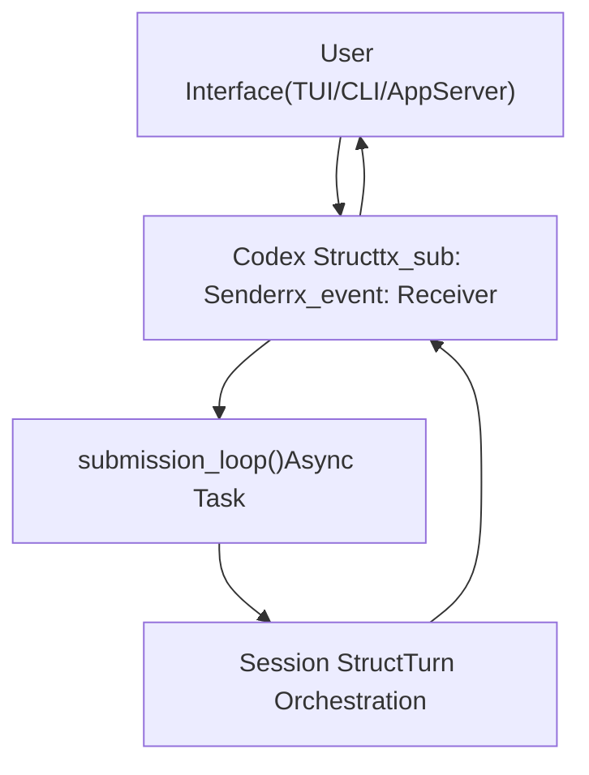
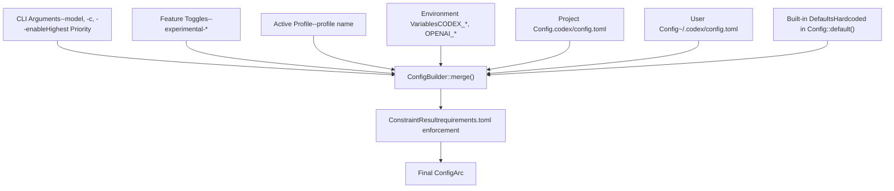

# 核心概念

相关源文件

-   [codex-rs/core/config.schema.json](https://github.com/openai/codex/blob/d807d44a/codex-rs/core/config.schema.json)
-   [codex-rs/core/src/codex.rs](https://github.com/openai/codex/blob/d807d44a/codex-rs/core/src/codex.rs)
-   [codex-rs/core/src/config/agent\_roles.rs](https://github.com/openai/codex/blob/d807d44a/codex-rs/core/src/config/agent_roles.rs)
-   [codex-rs/core/src/config/config\_tests.rs](https://github.com/openai/codex/blob/d807d44a/codex-rs/core/src/config/config_tests.rs)
-   [codex-rs/core/src/config/edit.rs](https://github.com/openai/codex/blob/d807d44a/codex-rs/core/src/config/edit.rs)
-   [codex-rs/core/src/config/mod.rs](https://github.com/openai/codex/blob/d807d44a/codex-rs/core/src/config/mod.rs)
-   [codex-rs/core/src/config/profile.rs](https://github.com/openai/codex/blob/d807d44a/codex-rs/core/src/config/profile.rs)
-   [codex-rs/core/src/config/types.rs](https://github.com/openai/codex/blob/d807d44a/codex-rs/core/src/config/types.rs)
-   [codex-rs/core/src/rollout/policy.rs](https://github.com/openai/codex/blob/d807d44a/codex-rs/core/src/rollout/policy.rs)
-   [codex-rs/core/src/tools/handlers/mod.rs](https://github.com/openai/codex/blob/d807d44a/codex-rs/core/src/tools/handlers/mod.rs)
-   [codex-rs/core/src/tools/spec.rs](https://github.com/openai/codex/blob/d807d44a/codex-rs/core/src/tools/spec.rs)
-   [codex-rs/core/src/tools/spec\_tests.rs](https://github.com/openai/codex/blob/d807d44a/codex-rs/core/src/tools/spec_tests.rs)
-   [codex-rs/exec/src/event\_processor.rs](https://github.com/openai/codex/blob/d807d44a/codex-rs/exec/src/event_processor.rs)
-   [codex-rs/exec/src/event\_processor\_with\_human\_output.rs](https://github.com/openai/codex/blob/d807d44a/codex-rs/exec/src/event_processor_with_human_output.rs)
-   [codex-rs/mcp-server/src/codex\_tool\_runner.rs](https://github.com/openai/codex/blob/d807d44a/codex-rs/mcp-server/src/codex_tool_runner.rs)
-   [codex-rs/protocol/src/protocol.rs](https://github.com/openai/codex/blob/d807d44a/codex-rs/protocol/src/protocol.rs)
-   [codex-rs/tui/src/app.rs](https://github.com/openai/codex/blob/d807d44a/codex-rs/tui/src/app.rs)
-   [codex-rs/tui/src/app\_event.rs](https://github.com/openai/codex/blob/d807d44a/codex-rs/tui/src/app_event.rs)
-   [codex-rs/tui/src/bottom\_pane/chat\_composer.rs](https://github.com/openai/codex/blob/d807d44a/codex-rs/tui/src/bottom_pane/chat_composer.rs)
-   [codex-rs/tui/src/bottom\_pane/mod.rs](https://github.com/openai/codex/blob/d807d44a/codex-rs/tui/src/bottom_pane/mod.rs)
-   [codex-rs/tui/src/chatwidget.rs](https://github.com/openai/codex/blob/d807d44a/codex-rs/tui/src/chatwidget.rs)
-   [codex-rs/tui/src/chatwidget/tests.rs](https://github.com/openai/codex/blob/d807d44a/codex-rs/tui/src/chatwidget/tests.rs)
-   [codex-rs/tui/src/history\_cell.rs](https://github.com/openai/codex/blob/d807d44a/codex-rs/tui/src/history_cell.rs)
-   [codex-rs/tui/src/slash\_command.rs](https://github.com/openai/codex/blob/d807d44a/codex-rs/tui/src/slash_command.rs)
-   [docs/config.md](https://github.com/openai/codex/blob/d807d44a/docs/config.md?plain=1)
-   [docs/example-config.md](https://github.com/openai/codex/blob/d807d44a/docs/example-config.md?plain=1)
-   [docs/skills.md](https://github.com/openai/codex/blob/d807d44a/docs/skills.md?plain=1)
-   [docs/slash\_commands.md](https://github.com/openai/codex/blob/d807d44a/docs/slash_commands.md?plain=1)

本页记录构成 Codex 代码库基础的核心架构模式与系统。这些概念在所有执行模式（TUI、CLI、IDE 集成）中保持不变，并为会话管理、配置和安全性提供核心抽象。

有关建立在这些概念之上的具体子系统详细信息，请参见：

-   [协议层（提交/事件系统）](/openai/codex/2.1-protocol-layer-(submissionevent-system)) — 说明用于协调异步通信的 `Op` 提交队列与 `Event` 事件流模式
-   [配置系统](/openai/codex/2.2-configuration-system) — 解释分层配置系统（CLI 参数 → 环境变量 → config.toml → 默认值）与 ConfigBuilder
-   [功能开关](/openai/codex/2.3-feature-flags) — 记录功能开关系统、生命周期阶段（UnderDevelopment/Experimental/Stable/Deprecated）与运行时切换
-   [沙箱与审批策略](/openai/codex/2.4-sandbox-and-approval-policies) — 解释沙箱模式（ReadOnly/WorkspaceWrite/DangerFullAccess）、审批策略与权限 profile

---

## 提交/事件协议

Codex 使用**队列对模式**来协调用户界面与代理引擎之间的异步通信。该模式将请求提交与响应处理解耦，实现非阻塞操作与取消支持。

### 架构概览

**来源：** [codex-rs/core/src/codex.rs330-343](https://github.com/openai/codex/blob/d807d44a/codex-rs/core/src/codex.rs#L330-L343) [codex-rs/protocol/src/protocol.rs101-111](https://github.com/openai/codex/blob/d807d44a/codex-rs/protocol/src/protocol.rs#L101-L111)

### 提交与事件类型

`Op` 枚举定义了可提交到 Codex 会话的所有操作。每个操作都包裹在带唯一 ID 的 `Submission` 结构体中用于关联。事件从 `Session` 通过 `Event` 流返回 UI，载荷为 `EventMsg`。

| 符号 | 类型 | 用途 |
| --- | --- | --- |
| `Submission` | `struct` | `Op` 的关联封装 [codex-rs/protocol/src/protocol.rs103-111](https://github.com/openai/codex/blob/d807d44a/codex-rs/protocol/src/protocol.rs#L103-L111) |
| `Op` | `enum` | 如 `UserInput`、`Interrupt`、`ExecApproval` 等操作 [codex-rs/protocol/src/protocol.rs181-479](https://github.com/openai/codex/blob/d807d44a/codex-rs/protocol/src/protocol.rs#L181-L479) |
| `Event` | `struct` | `EventMsg` 的关联封装 [codex-rs/protocol/src/protocol.rs1146-1152](https://github.com/openai/codex/blob/d807d44a/codex-rs/protocol/src/protocol.rs#L1146-L1152) |
| `EventMsg` | `enum` | 如 `TurnStarted`、`AgentMessageDelta`、`Error` 等消息 [codex-rs/protocol/src/protocol.rs1154-1500](https://github.com/openai/codex/blob/d807d44a/codex-rs/protocol/src/protocol.rs#L1154-L1500) |

**来源：** [codex-rs/protocol/src/protocol.rs101-1500](https://github.com/openai/codex/blob/d807d44a/codex-rs/protocol/src/protocol.rs#L101-L1500) [codex-rs/core/src/codex.rs636-686](https://github.com/openai/codex/blob/d807d44a/codex-rs/core/src/codex.rs#L636-L686)

---

## 配置系统

Codex 使用**分层配置系统**，来自多个来源（CLI 参数 → 环境变量 → config.toml → 默认值）的设置会按明确优先级规则合并。

### 配置层级结构

**来源：** [codex-rs/core/src/config/mod.rs1-134](https://github.com/openai/codex/blob/d807d44a/codex-rs/core/src/config/mod.rs#L1-L134) [codex-rs/core/src/codex.rs404-493](https://github.com/openai/codex/blob/d807d44a/codex-rs/core/src/codex.rs#L404-L493)

### 约束校验

组织级策略通过 `requirements.toml` 强制执行。`Constrained<T>` 包装器会跟踪值是 `Pinned`（用户不可修改）还是 `Default`（可覆盖）。

**来源：** [codex-rs/core/src/config/mod.rs117-119](https://github.com/openai/codex/blob/d807d44a/codex-rs/core/src/config/mod.rs#L117-L119) [codex-rs/core/src/codex.rs556-581](https://github.com/openai/codex/blob/d807d44a/codex-rs/core/src/codex.rs#L556-L581)

---

## 功能开关系统

Codex 使用**分阶段功能开关系统**管理实验性功能。功能按定义生命周期阶段推进：`UnderDevelopment`、`Experimental`、`Stable` 和 `Deprecated`。

### 功能定义与生命周期

> **[Mermaid stateDiagram]**
> *(图表结构无法解析)*

**来源：** [codex-rs/core/src/codex.rs59-61](https://github.com/openai/codex/blob/d807d44a/codex-rs/core/src/codex.rs#L59-L61) [codex-rs/core/src/config/mod.rs122-124](https://github.com/openai/codex/blob/d807d44a/codex-rs/core/src/config/mod.rs#L122-L124)

功能定义在 `FEATURES` 数组中。`ManagedFeatures` 结构体跟踪会话生命周期内所有开关的激活状态。

| 阶段 | 可见性 | 默认状态 |
| --- | --- | --- |
| `UnderDevelopment` | 隐藏 | Disabled |
| `Experimental` | `/experimental` 菜单 | Disabled |
| `Stable` | 始终可用 | Enabled |
| `Deprecated` | 始终可用 | Enabled（带告警） |

**来源：** [codex-rs/core/src/codex.rs27-31](https://github.com/openai/codex/blob/d807d44a/codex-rs/core/src/codex.rs#L27-L31) [codex-rs/core/src/config/mod.rs110-111](https://github.com/openai/codex/blob/d807d44a/codex-rs/core/src/config/mod.rs#L110-L111)

---

## 沙箱与审批策略

Codex 提供**分层安全控制**，在工具执行期间保护主机环境。

### 审批策略

`AskForApproval` 枚举决定工具调用何时需要用户同意。

-   `UnlessTrusted`：对安全只读命令自动批准。
-   `OnRequest`：由模型决定何时提示用户。
-   `Never`：不提示（用于非交互模式）。

**来源：** [codex-rs/protocol/src/protocol.rs54-56](https://github.com/openai/codex/blob/d807d44a/codex-rs/protocol/src/protocol.rs#L54-L56) [codex-rs/core/src/codex.rs566-567](https://github.com/openai/codex/blob/d807d44a/codex-rs/core/src/codex.rs#L566-L567)

### 沙箱策略

`SandboxPolicy` 控制文件系统与网络限制。平台特定后端（Linux 的 Landlock、macOS 的 Seatbelt、Windows 的受限令牌）会实施这些限制。

| 策略 | 文件系统访问 |
| --- | --- |
| `DangerFullAccess` | 无限制 |
| `ReadOnly` | 对允许根目录只读访问 |
| `WorkspaceWrite` | 对 `cwd` 与指定根目录有写权限 |

**来源：** [codex-rs/protocol/src/protocol.rs659-758](https://github.com/openai/codex/blob/d807d44a/codex-rs/protocol/src/protocol.rs#L659-L758) [codex-rs/core/src/codex.rs568-570](https://github.com/openai/codex/blob/d807d44a/codex-rs/core/src/codex.rs#L568-L570)

### 策略评估流程

> **[Mermaid sequence]**
> *(图表结构无法解析)*

**来源：** [codex-rs/core/src/codex.rs480-489](https://github.com/openai/codex/blob/d807d44a/codex-rs/core/src/codex.rs#L480-L489) [codex-rs/core/src/tools/spec.rs64-96](https://github.com/openai/codex/blob/d807d44a/codex-rs/core/src/tools/spec.rs#L64-L96)

---

## 核心数据结构

| 符号 | 位置 | 角色 |
| --- | --- | --- |
| `Codex` | [codex-rs/core/src/codex.rs330-343](https://github.com/openai/codex/blob/d807d44a/codex-rs/core/src/codex.rs#L330-L343) | 主会话接口与循环协调器 |
| `Config` | [codex-rs/core/src/config/mod.rs1-134](https://github.com/openai/codex/blob/d807d44a/codex-rs/core/src/config/mod.rs#L1-L134) | 共享的不可变会话配置 |
| `HistoryCell` | [codex-rs/tui/src/history\_cell.rs98-168](https://github.com/openai/codex/blob/d807d44a/codex-rs/tui/src/history_cell.rs#L98-L168) | 会话转录中的显示单元 |
| `ChatComposer` | [codex-rs/tui/src/bottom\_pane/chat\_composer.rs1-130](https://github.com/openai/codex/blob/d807d44a/codex-rs/tui/src/bottom_pane/chat_composer.rs#L1-L130) | 用户提示输入状态机 |

**来源：** [codex-rs/core/src/codex.rs](https://github.com/openai/codex/blob/d807d44a/codex-rs/core/src/codex.rs) [codex-rs/tui/src/history\_cell.rs](https://github.com/openai/codex/blob/d807d44a/codex-rs/tui/src/history_cell.rs) [codex-rs/tui/src/bottom\_pane/chat\_composer.rs](https://github.com/openai/codex/blob/d807d44a/codex-rs/tui/src/bottom_pane/chat_composer.rs)
