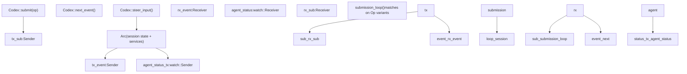

# 协议层（提交/事件系统）

相关源文件

-   [codex-rs/app-server-protocol/src/export.rs](https://github.com/openai/codex/blob/d807d44a/codex-rs/app-server-protocol/src/export.rs)
-   [codex-rs/app-server-protocol/src/lib.rs](https://github.com/openai/codex/blob/d807d44a/codex-rs/app-server-protocol/src/lib.rs)
-   [codex-rs/app-server-protocol/src/protocol/v1.rs](https://github.com/openai/codex/blob/d807d44a/codex-rs/app-server-protocol/src/protocol/v1.rs)
-   [codex-rs/app-server/tests/suite/v2/initialize.rs](https://github.com/openai/codex/blob/d807d44a/codex-rs/app-server/tests/suite/v2/initialize.rs)
-   [codex-rs/core/src/codex.rs](https://github.com/openai/codex/blob/d807d44a/codex-rs/core/src/codex.rs)
-   [codex-rs/core/src/context\_manager/updates.rs](https://github.com/openai/codex/blob/d807d44a/codex-rs/core/src/context_manager/updates.rs)
-   [codex-rs/core/src/rollout/policy.rs](https://github.com/openai/codex/blob/d807d44a/codex-rs/core/src/rollout/policy.rs)
-   [codex-rs/core/src/tools/network\_approval.rs](https://github.com/openai/codex/blob/d807d44a/codex-rs/core/src/tools/network_approval.rs)
-   [codex-rs/core/tests/suite/collaboration\_instructions.rs](https://github.com/openai/codex/blob/d807d44a/codex-rs/core/tests/suite/collaboration_instructions.rs)
-   [codex-rs/core/tests/suite/override\_updates.rs](https://github.com/openai/codex/blob/d807d44a/codex-rs/core/tests/suite/override_updates.rs)
-   [codex-rs/core/tests/suite/permissions\_messages.rs](https://github.com/openai/codex/blob/d807d44a/codex-rs/core/tests/suite/permissions_messages.rs)
-   [codex-rs/exec/src/event\_processor.rs](https://github.com/openai/codex/blob/d807d44a/codex-rs/exec/src/event_processor.rs)
-   [codex-rs/exec/src/event\_processor\_with\_human\_output.rs](https://github.com/openai/codex/blob/d807d44a/codex-rs/exec/src/event_processor_with_human_output.rs)
-   [codex-rs/mcp-server/src/codex\_tool\_runner.rs](https://github.com/openai/codex/blob/d807d44a/codex-rs/mcp-server/src/codex_tool_runner.rs)
-   [codex-rs/protocol/Cargo.toml](https://github.com/openai/codex/blob/d807d44a/codex-rs/protocol/Cargo.toml)
-   [codex-rs/protocol/src/account.rs](https://github.com/openai/codex/blob/d807d44a/codex-rs/protocol/src/account.rs)
-   [codex-rs/protocol/src/models.rs](https://github.com/openai/codex/blob/d807d44a/codex-rs/protocol/src/models.rs)
-   [codex-rs/protocol/src/protocol.rs](https://github.com/openai/codex/blob/d807d44a/codex-rs/protocol/src/protocol.rs)
-   [codex-rs/tui/src/app.rs](https://github.com/openai/codex/blob/d807d44a/codex-rs/tui/src/app.rs)
-   [codex-rs/tui/src/app\_event.rs](https://github.com/openai/codex/blob/d807d44a/codex-rs/tui/src/app_event.rs)
-   [codex-rs/tui/src/bottom\_pane/chat\_composer.rs](https://github.com/openai/codex/blob/d807d44a/codex-rs/tui/src/bottom_pane/chat_composer.rs)
-   [codex-rs/tui/src/bottom\_pane/mod.rs](https://github.com/openai/codex/blob/d807d44a/codex-rs/tui/src/bottom_pane/mod.rs)
-   [codex-rs/tui/src/chatwidget.rs](https://github.com/openai/codex/blob/d807d44a/codex-rs/tui/src/chatwidget.rs)
-   [codex-rs/tui/src/chatwidget/tests.rs](https://github.com/openai/codex/blob/d807d44a/codex-rs/tui/src/chatwidget/tests.rs)
-   [codex-rs/tui/src/history\_cell.rs](https://github.com/openai/codex/blob/d807d44a/codex-rs/tui/src/history_cell.rs)
-   [codex-rs/tui/src/slash\_command.rs](https://github.com/openai/codex/blob/d807d44a/codex-rs/tui/src/slash_command.rs)
-   [codex-rs/utils/image/Cargo.toml](https://github.com/openai/codex/blob/d807d44a/codex-rs/utils/image/Cargo.toml)
-   [codex-rs/utils/image/src/error.rs](https://github.com/openai/codex/blob/d807d44a/codex-rs/utils/image/src/error.rs)
-   [codex-rs/utils/image/src/lib.rs](https://github.com/openai/codex/blob/d807d44a/codex-rs/utils/image/src/lib.rs)

## 目标与范围

本页记录所有面向用户界面与 `codex-core` 代理之间使用的核心通信协议：`Submission`/`Event` 队列对、定义全部操作与通知的 `Op` 和 `EventMsg` 枚举，以及 `Codex` 结构体的 `submit`/`next_event` 接口。

该协议定义在 `codex-protocol` crate（[codex-rs/protocol/src/protocol.rs](https://github.com/openai/codex/blob/d807d44a/codex-rs/protocol/src/protocol.rs)）中，并由 `codex-core` 中的 `Codex` 结构体实现（[codex-rs/core/src/codex.rs](https://github.com/openai/codex/blob/d807d44a/codex-rs/core/src/codex.rs)）。所有客户端——TUI、无头 exec 模式、app server 与 MCP server——都仅通过该接口与代理通信。

-   关于代理如何在内部使用该协议管理轮次与会话状态，请参见 **3.1 Codex Interface and Session Lifecycle**。
-   关于出现在 Op 字段中的沙箱与审批策略类型（`SandboxPolicy`、`AskForApproval`），请参见 **2.4 Sandbox and Approval Policies**。
-   关于 TUI 如何将 `EventMsg` 转换为渲染后的历史单元，请参见 **4.1.2 ChatWidget and Conversation Display**。
-   关于 app server 如何将 `EventMsg` 转换为 JSON-RPC 通知，请参见 **4.5.3 Event Translation and Streaming**。

---

## 核心抽象

### `Submission` 与 `Op`

`Submission` 是放入提交队列的信封结构。它将唯一关联 ID 与操作以及可选分布式追踪上下文配对。

[codex-rs/protocol/src/protocol.rs102-111](https://github.com/openai/codex/blob/d807d44a/codex-rs/protocol/src/protocol.rs#L102-L111)

```
pub struct Submission {    pub id: String,   // Unique ID generated by Codex::submit()    pub op: Op,       // The operation to perform    pub trace: Option<W3cTraceContext>, // Distributed tracing metadata}
```
`trace` 字段支持跨异步提交交接的分布式追踪。存在该字段时，它会携带 `traceparent` 与 `tracestate` 头，用于 OpenTelemetry 集成 [codex-rs/protocol/src/protocol.rs113-121](https://github.com/openai/codex/blob/d807d44a/codex-rs/protocol/src/protocol.rs#L113-L121)

来源： [codex-rs/protocol/src/protocol.rs102-121](https://github.com/openai/codex/blob/d807d44a/codex-rs/protocol/src/protocol.rs#L102-L121) [codex-rs/core/src/codex.rs640-653](https://github.com/openai/codex/blob/d807d44a/codex-rs/core/src/codex.rs#L640-L653)

`Op` 是一个非穷尽枚举，覆盖客户端可请求的全部动作，例如启动轮次、批准工具调用或请求代码评审 [codex-rs/protocol/src/protocol.rs181-479](https://github.com/openai/codex/blob/d807d44a/codex-rs/protocol/src/protocol.rs#L181-L479)

### `Event` 与 `EventMsg`

`Event` 是放入事件队列的信封结构。`id` 字段会回显触发该事件的 `Submission.id`（适用时）[codex-rs/protocol/src/protocol.rs555-560](https://github.com/openai/codex/blob/d807d44a/codex-rs/protocol/src/protocol.rs#L555-L560)

```
pub struct Event {    pub id: String,    pub msg: EventMsg,}
```
`EventMsg` 是代理可发出的全部通知的标签联合体，包括流式消息增量、工具执行状态和审批请求 [codex-rs/protocol/src/protocol.rs563-1081](https://github.com/openai/codex/blob/d807d44a/codex-rs/protocol/src/protocol.rs#L563-L1081)

---

## 异步队列模型

该协议实现为基于 `async-channel` 的**提交队列 / 事件队列**（SQ/EQ）对。这将调用方与代理内部执行模型解耦。

**队列架构：`Codex` 结构体、通道与后台任务**


来源： [codex-rs/core/src/codex.rs332-341](https://github.com/openai/codex/blob/d807d44a/codex-rs/core/src/codex.rs#L332-L341) [codex-rs/core/src/codex.rs422-424](https://github.com/openai/codex/blob/d807d44a/codex-rs/core/src/codex.rs#L422-L424) [codex-rs/core/src/codex.rs614-618](https://github.com/openai/codex/blob/d807d44a/codex-rs/core/src/codex.rs#L614-L618)

| 通道 | 类型 | 容量 | 方向 | 用途 |
| --- | --- | --- | --- | --- |
| 提交队列 | `async_channel::bounded` | `SUBMISSION_CHANNEL_CAPACITY` = 512 | 调用方 → Session | 有界以避免内存压力 [codex-rs/core/src/codex.rs332](https://github.com/openai/codex/blob/d807d44a/codex-rs/core/src/codex.rs#L332-L332) |
| 事件队列 | `async_channel::unbounded` | 无限制 | Session → 调用方 | 无界以避免阻塞代理执行 [codex-rs/core/src/codex.rs333](https://github.com/openai/codex/blob/d807d44a/codex-rs/core/src/codex.rs#L333-L333) |
| 代理状态 | `tokio::sync::watch` | 1（最新值） | Session → 调用方 | 广播当前代理状态 [codex-rs/core/src/codex.rs336](https://github.com/openai/codex/blob/d807d44a/codex-rs/core/src/codex.rs#L336-L336) |

`submission_loop` 任务会持续运行，直到收到 `Op::Shutdown` [codex-rs/core/src/codex.rs585](https://github.com/openai/codex/blob/d807d44a/codex-rs/core/src/codex.rs#L585-L585) 每个提交会按其 `Op` 变体匹配并分发到 `Session`。会话通过向 `tx_event` 发送来发出 `Event`。

来源： [codex-rs/core/src/codex.rs374-375](https://github.com/openai/codex/blob/d807d44a/codex-rs/core/src/codex.rs#L374-L375) [codex-rs/core/src/codex.rs422-424](https://github.com/openai/codex/blob/d807d44a/codex-rs/core/src/codex.rs#L422-L424) [codex-rs/core/src/codex.rs585](https://github.com/openai/codex/blob/d807d44a/codex-rs/core/src/codex.rs#L585-L585)

---

## `Codex` 接口

`Codex` 结构体是活动代理会话的主句柄 [codex-rs/core/src/codex.rs312-318](https://github.com/openai/codex/blob/d807d44a/codex-rs/core/src/codex.rs#L312-L318)

| 方法 | 签名 | 说明 |
| --- | --- | --- |
| `spawn` | `async fn spawn(...)` | 创建会话、启动 `submission_loop`、返回 `CodexSpawnOk` [codex-rs/core/src/codex.rs360](https://github.com/openai/codex/blob/d807d44a/codex-rs/core/src/codex.rs#L360-L360) |
| `submit` | `async fn submit(&self, op: Op)` | 将 `op` 封装为带 UUID v7 ID 的 `Submission` 并发送到队列 [codex-rs/core/src/codex.rs640](https://github.com/openai/codex/blob/d807d44a/codex-rs/core/src/codex.rs#L640-L640) |
| `submit_with_trace` | `async fn submit_with_trace(...)` | 类似 `submit`，但允许传入显式 trace 上下文 [codex-rs/core/src/codex.rs655](https://github.com/openai/codex/blob/d807d44a/codex-rs/core/src/codex.rs#L655-L655) |
| `next_event` | `async fn next_event(&self)` | 等待并返回来自代理的下一条事件 [codex-rs/core/src/codex.rs694](https://github.com/openai/codex/blob/d807d44a/codex-rs/core/src/codex.rs#L694-L694) |
| `steer_input` | `async fn steer_input(...)` | 在不发起新提交的情况下向活动轮次注入额外用户输入 [codex-rs/core/src/codex.rs722](https://github.com/openai/codex/blob/d807d44a/codex-rs/core/src/codex.rs#L722-L722) |

来源： [codex-rs/core/src/codex.rs636-722](https://github.com/openai/codex/blob/d807d44a/codex-rs/core/src/codex.rs#L636-L722)

---

## Op 变体参考

**`Op` 枚举分类**

```mermaid
flowchart TD
    Op["Op enum(codex-rs/protocol/src/protocol.rs)"]
    UserInputOps["User Input"]
    TurnControlOps["Turn Control"]
    ApprovalOps["Approval Responses"]
    ContextOps["Context & Memory"]
    DiscoveryOps["Discovery & Query"]
    RealtimeOps["Realtime"]
    UserInput["UserInput (legacy)"]
    UserTurn["UserTurn (preferred)"]
    OverrideTurnContext["OverrideTurnContext"]
    Interrupt["Interrupt"]
    Shutdown["Shutdown"]
    RunUserShellCommand["RunUserShellCommand"]
    ExecApproval["ExecApproval"]
    PatchApproval["PatchApproval"]
    ResolveElicitation["ResolveElicitation"]
    UserInputAnswer["UserInputAnswer"]
    DynamicToolResponse["DynamicToolResponse"]
    Compact["Compact"]
    Undo["Undo"]
    ThreadRollback["ThreadRollback"]
    Review["Review"]
    SetThreadName["SetThreadName"]
    DropMemories["DropMemories"]
    UpdateMemories["UpdateMemories"]
    ReloadUserConfig["ReloadUserConfig"]
    ListMcpTools["ListMcpTools"]
    ListCustomPrompts["ListCustomPrompts"]
    ListSkills["ListSkills"]
    RefreshMcpServers["RefreshMcpServers"]
    RealtimeConversationStart["RealtimeConversationStart"]
    RealtimeConversationAudio["RealtimeConversationAudio"]
    RealtimeConversationText["RealtimeConversationText"]
    RealtimeConversationClose["RealtimeConversationClose"]

    Op --> UserInputOps
    Op --> TurnControlOps
    Op --> ApprovalOps
    Op --> ContextOps
    Op --> DiscoveryOps
    Op --> RealtimeOps
    UserInputOps --> UserInput
    UserInputOps --> UserTurn
    UserInputOps --> OverrideTurnContext
    TurnControlOps --> Interrupt
    TurnControlOps --> Shutdown
    TurnControlOps --> RunUserShellCommand
    ApprovalOps --> ExecApproval
    ApprovalOps --> PatchApproval
    ApprovalOps --> ResolveElicitation
    ApprovalOps --> UserInputAnswer
    ApprovalOps --> DynamicToolResponse
    ContextOps --> Compact
    ContextOps --> Undo
    ContextOps --> ThreadRollback
    ContextOps --> Review
    ContextOps --> SetThreadName
    ContextOps --> DropMemories
    ContextOps --> UpdateMemories
    ContextOps --> ReloadUserConfig
    DiscoveryOps --> ListMcpTools
    DiscoveryOps --> ListCustomPrompts
    DiscoveryOps --> ListSkills
    DiscoveryOps --> RefreshMcpServers
    RealtimeOps --> RealtimeConversationStart
    RealtimeOps --> RealtimeConversationAudio
    RealtimeOps --> RealtimeConversationText
    RealtimeOps --> RealtimeConversationClose
```


来源： [codex-rs/protocol/src/protocol.rs181-479](https://github.com/openai/codex/blob/d807d44a/codex-rs/protocol/src/protocol.rs#L181-L479)

### 关键 Op 变体

| 变体 | 关键字段 | 说明 |
| --- | --- | --- |
| `UserTurn` | `items`, `cwd`, `sandbox_policy`, `model` | 启动代理轮次的主要入口 [codex-rs/protocol/src/protocol.rs198-216](https://github.com/openai/codex/blob/d807d44a/codex-rs/protocol/src/protocol.rs#L198-L216) |
| `Interrupt` | — | 中止当前轮次 [codex-rs/protocol/src/protocol.rs242](https://github.com/openai/codex/blob/d807d44a/codex-rs/protocol/src/protocol.rs#L242-L242) |
| `ExecApproval` | `id`, `decision` | 响应 shell 命令审批请求 [codex-rs/protocol/src/protocol.rs260-264](https://github.com/openai/codex/blob/d807d44a/codex-rs/protocol/src/protocol.rs#L260-L264) |
| `Compact` | — | 触发历史摘要压缩 [codex-rs/protocol/src/protocol.rs293](https://github.com/openai/codex/blob/d807d44a/codex-rs/protocol/src/protocol.rs#L293-L293) |
| `Review` | `review_request` | 启动子代理审查代码变更 [codex-rs/protocol/src/protocol.rs308-311](https://github.com/openai/codex/blob/d807d44a/codex-rs/protocol/src/protocol.rs#L308-L311) |

---

## EventMsg 变体参考

**`EventMsg` 枚举分类**

```mermaid
flowchart TD
    EventMsg["EventMsg enum(codex-rs/protocol/src/protocol.rs)"]
    SessionOps["Session Lifecycle"]
    AgentOutputOps["Agent Output"]
    ToolOps["Tool Execution"]
    ApprovalReqOps["Approval Requests"]
    StatusOps["Status & Errors"]
    CollabOps["Collaboration"]
    RealtimeEvOps["Realtime"]
    SessionConfigured["SessionConfigured"]
    TurnStarted["TurnStarted"]
    TurnComplete["TurnComplete"]
    TurnAborted["TurnAborted"]
    AgentMessageDelta["AgentMessageDelta"]
    AgentReasoningDelta["AgentReasoningDelta"]
    PlanDelta["PlanDelta"]
    ItemCompleted["ItemCompleted"]
    ExecCommandBegin["ExecCommandBegin"]
    ExecCommandEnd["ExecCommandEnd"]
    PatchApplyBegin["PatchApplyBegin"]
    PatchApplyEnd["PatchApplyEnd"]
    McpToolCallBegin["McpToolCallBegin"]
    ExecApprovalRequest["ExecApprovalRequest"]
    ApplyPatchApprovalRequest["ApplyPatchApprovalRequest"]
    ElicitationRequest["ElicitationRequest"]
    Error["Error"]
    Warning["Warning"]
    TokenCount["TokenCount"]
    BackgroundEvent["BackgroundEvent"]

    EventMsg --> SessionOps
    EventMsg --> AgentOutputOps
    EventMsg --> ToolOps
    EventMsg --> ApprovalReqOps
    EventMsg --> StatusOps
    EventMsg --> CollabOps
    EventMsg --> RealtimeEvOps
    SessionOps --> SessionConfigured
    SessionOps --> TurnStarted
    SessionOps --> TurnComplete
    SessionOps --> TurnAborted
    AgentOutputOps --> AgentMessageDelta
    AgentOutputOps --> AgentReasoningDelta
    AgentOutputOps --> PlanDelta
    AgentOutputOps --> ItemCompleted
    ToolOps --> ExecCommandBegin
    ToolOps --> ExecCommandEnd
    ToolOps --> PatchApplyBegin
    ToolOps --> PatchApplyEnd
    ToolOps --> McpToolCallBegin
    ApprovalReqOps --> ExecApprovalRequest
    ApprovalReqOps --> ApplyPatchApprovalRequest
    ApprovalReqOps --> ElicitationRequest
    StatusOps --> Error
    StatusOps --> Warning
    StatusOps --> TokenCount
    StatusOps --> BackgroundEvent
```


来源： [codex-rs/protocol/src/protocol.rs563-1081](https://github.com/openai/codex/blob/d807d44a/codex-rs/protocol/src/protocol.rs#L563-L1081)

### 关键 EventMsg 变体

| 变体 | 关键字段 | 说明 |
| --- | --- | --- |
| `TurnStarted` | `TurnStartedEvent` | 标记轮次开始 [codex-rs/protocol/src/protocol.rs577](https://github.com/openai/codex/blob/d807d44a/codex-rs/protocol/src/protocol.rs#L577-L577) |
| `AgentMessageDelta` | `AgentMessageDeltaEvent` | 流式助手文本分片 [codex-rs/protocol/src/protocol.rs608](https://github.com/openai/codex/blob/d807d44a/codex-rs/protocol/src/protocol.rs#L608-L608) |
| `ExecCommandBegin` | `ExecCommandBeginEvent` | shell 命令开始执行 [codex-rs/protocol/src/protocol.rs664](https://github.com/openai/codex/blob/d807d44a/codex-rs/protocol/src/protocol.rs#L664-L664) |
| `ExecApprovalRequest` | `ExecApprovalRequestEvent` | 代理正在等待用户批准执行命令 [codex-rs/protocol/src/protocol.rs821](https://github.com/openai/codex/blob/d807d44a/codex-rs/protocol/src/protocol.rs#L821-L821) |
| `TurnComplete` | `TurnCompleteEvent` | 轮次结束；包含最终用量与文本 [codex-rs/protocol/src/protocol.rs589](https://github.com/openai/codex/blob/d807d44a/codex-rs/protocol/src/protocol.rs#L589-L589) |

---

## 典型轮次生命周期

**时序：从 `UserTurn` 提交到 `TurnComplete`**

> **[Mermaid sequence]**
> *(图表结构无法解析)*

来源： [codex-rs/core/src/codex.rs636-653](https://github.com/openai/codex/blob/d807d44a/codex-rs/core/src/codex.rs#L636-L653) [codex-rs/core/src/codex.rs694-710](https://github.com/openai/codex/blob/d807d44a/codex-rs/core/src/codex.rs#L694-L710) [codex-rs/protocol/src/protocol.rs198-216](https://github.com/openai/codex/blob/d807d44a/codex-rs/protocol/src/protocol.rs#L198-L216)

---

## 事件持久化

`EventPersistenceMode` 控制会写入 rollout 文件以供会话恢复的事件集合 [codex-rs/core/src/rollout/policy.rs94-186](https://github.com/openai/codex/blob/d807d44a/codex-rs/core/src/rollout/policy.rs#L94-L186)

-   **Limited（默认）：** 持久化 `TurnStarted`、`TurnComplete`、`AgentMessage` 等主要状态转换 [codex-rs/core/src/rollout/policy.rs113-134](https://github.com/openai/codex/blob/d807d44a/codex-rs/core/src/rollout/policy.rs#L113-L134)
-   **Extended：** 额外包含工具执行结果（`ExecCommandEnd`、`PatchApplyEnd`）和子代理交互 [codex-rs/core/src/rollout/policy.rs136-174](https://github.com/openai/codex/blob/d807d44a/codex-rs/core/src/rollout/policy.rs#L136-L174)
-   **Never Persisted：** 不持久化流式增量（`AgentMessageDelta`）、仅 UI 告警和实时音频帧 [codex-rs/core/src/rollout/policy.rs176-186](https://github.com/openai/codex/blob/d807d44a/codex-rs/core/src/rollout/policy.rs#L176-L186)

来源： [codex-rs/core/src/rollout/policy.rs94-186](https://github.com/openai/codex/blob/d807d44a/codex-rs/core/src/rollout/policy.rs#L94-L186)
