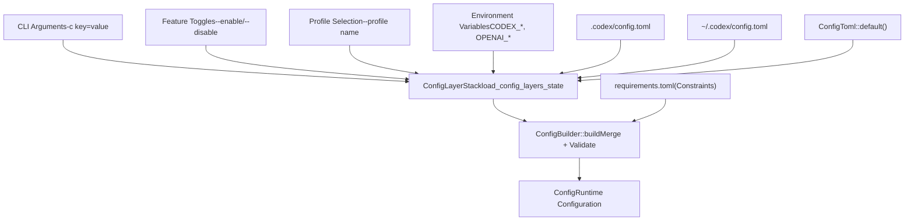
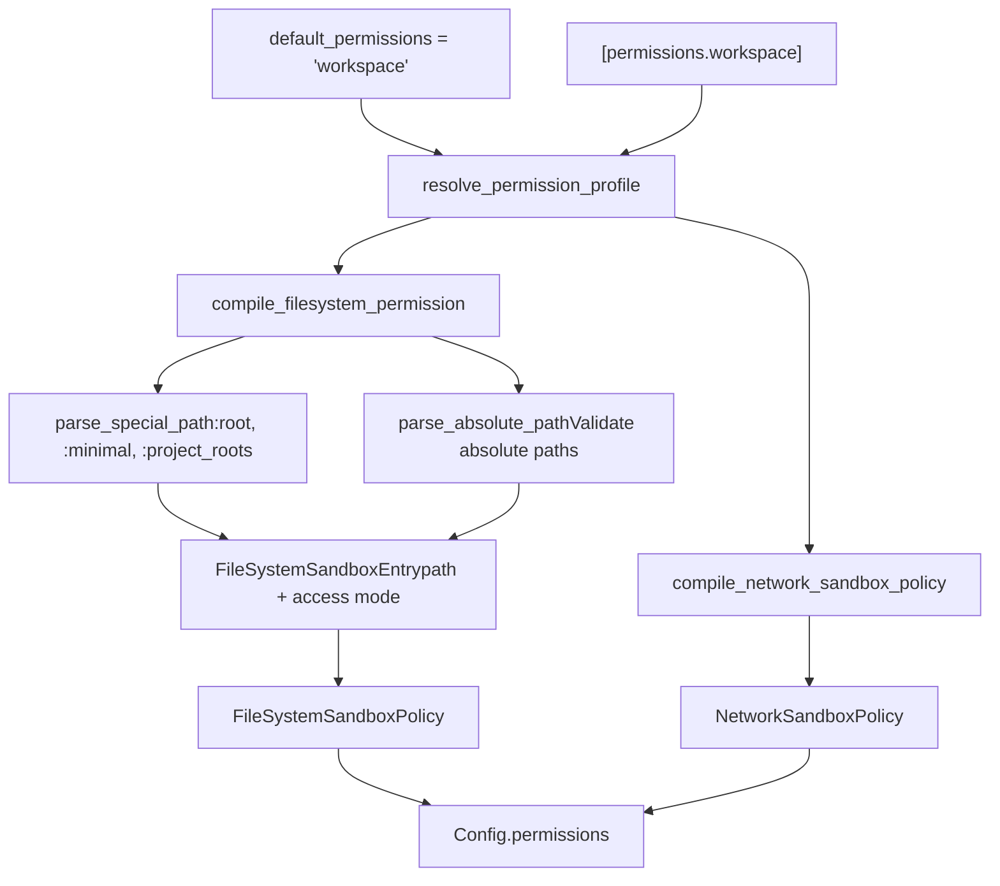
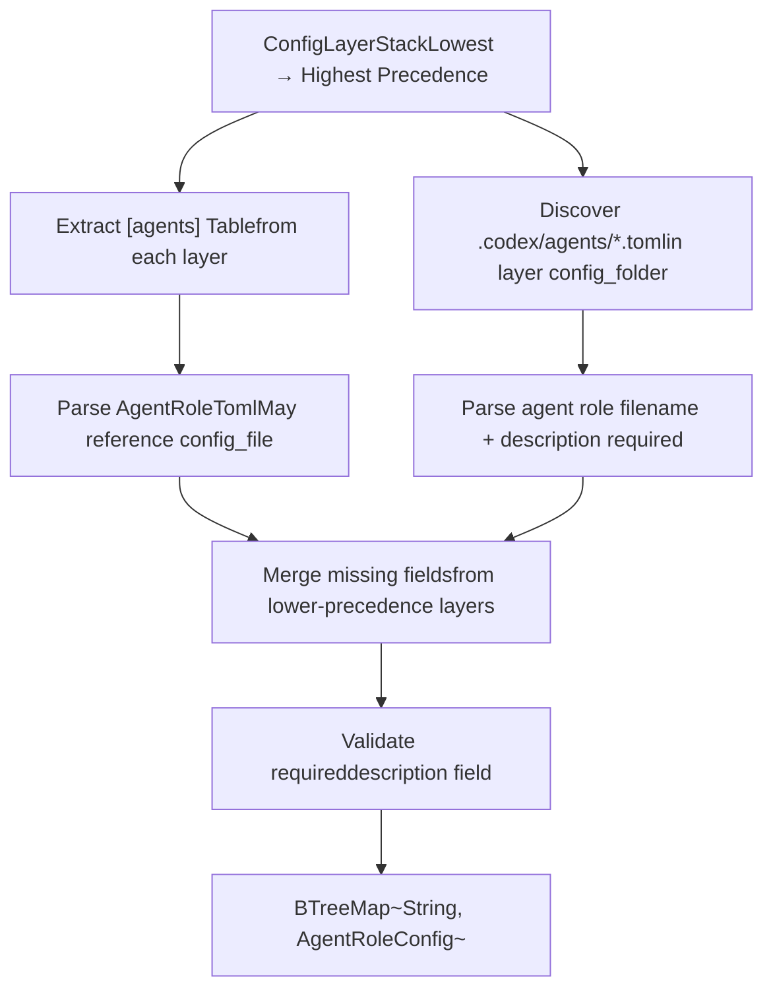

# 配置系统

相关源文件

-   [codex-rs/Cargo.lock](https://github.com/openai/codex/blob/d807d44a/codex-rs/Cargo.lock)
-   [codex-rs/Cargo.toml](https://github.com/openai/codex/blob/d807d44a/codex-rs/Cargo.toml)
-   [codex-rs/README.md](https://github.com/openai/codex/blob/d807d44a/codex-rs/README.md?plain=1)
-   [codex-rs/app-server/src/config\_api.rs](https://github.com/openai/codex/blob/d807d44a/codex-rs/app-server/src/config_api.rs)
-   [codex-rs/app-server/tests/suite/v2/config\_rpc.rs](https://github.com/openai/codex/blob/d807d44a/codex-rs/app-server/tests/suite/v2/config_rpc.rs)
-   [codex-rs/cli/Cargo.toml](https://github.com/openai/codex/blob/d807d44a/codex-rs/cli/Cargo.toml)
-   [codex-rs/cli/src/lib.rs](https://github.com/openai/codex/blob/d807d44a/codex-rs/cli/src/lib.rs)
-   [codex-rs/cli/src/main.rs](https://github.com/openai/codex/blob/d807d44a/codex-rs/cli/src/main.rs)
-   [codex-rs/cloud-requirements/src/lib.rs](https://github.com/openai/codex/blob/d807d44a/codex-rs/cloud-requirements/src/lib.rs)
-   [codex-rs/config.md](https://github.com/openai/codex/blob/d807d44a/codex-rs/config.md?plain=1)
-   [codex-rs/config/src/cloud\_requirements.rs](https://github.com/openai/codex/blob/d807d44a/codex-rs/config/src/cloud_requirements.rs)
-   [codex-rs/config/src/config\_requirements.rs](https://github.com/openai/codex/blob/d807d44a/codex-rs/config/src/config_requirements.rs)
-   [codex-rs/config/src/lib.rs](https://github.com/openai/codex/blob/d807d44a/codex-rs/config/src/lib.rs)
-   [codex-rs/core/Cargo.toml](https://github.com/openai/codex/blob/d807d44a/codex-rs/core/Cargo.toml)
-   [codex-rs/core/config.schema.json](https://github.com/openai/codex/blob/d807d44a/codex-rs/core/config.schema.json)
-   [codex-rs/core/src/config/agent\_roles.rs](https://github.com/openai/codex/blob/d807d44a/codex-rs/core/src/config/agent_roles.rs)
-   [codex-rs/core/src/config/config\_tests.rs](https://github.com/openai/codex/blob/d807d44a/codex-rs/core/src/config/config_tests.rs)
-   [codex-rs/core/src/config/edit.rs](https://github.com/openai/codex/blob/d807d44a/codex-rs/core/src/config/edit.rs)
-   [codex-rs/core/src/config/mod.rs](https://github.com/openai/codex/blob/d807d44a/codex-rs/core/src/config/mod.rs)
-   [codex-rs/core/src/config/profile.rs](https://github.com/openai/codex/blob/d807d44a/codex-rs/core/src/config/profile.rs)
-   [codex-rs/core/src/config/service.rs](https://github.com/openai/codex/blob/d807d44a/codex-rs/core/src/config/service.rs)
-   [codex-rs/core/src/config/types.rs](https://github.com/openai/codex/blob/d807d44a/codex-rs/core/src/config/types.rs)
-   [codex-rs/core/src/config\_loader/README.md](https://github.com/openai/codex/blob/d807d44a/codex-rs/core/src/config_loader/README.md?plain=1)
-   [codex-rs/core/src/config\_loader/layer\_io.rs](https://github.com/openai/codex/blob/d807d44a/codex-rs/core/src/config_loader/layer_io.rs)
-   [codex-rs/core/src/config\_loader/macos.rs](https://github.com/openai/codex/blob/d807d44a/codex-rs/core/src/config_loader/macos.rs)
-   [codex-rs/core/src/config\_loader/mod.rs](https://github.com/openai/codex/blob/d807d44a/codex-rs/core/src/config_loader/mod.rs)
-   [codex-rs/core/src/config\_loader/tests.rs](https://github.com/openai/codex/blob/d807d44a/codex-rs/core/src/config_loader/tests.rs)
-   [codex-rs/core/src/flags.rs](https://github.com/openai/codex/blob/d807d44a/codex-rs/core/src/flags.rs)
-   [codex-rs/core/src/lib.rs](https://github.com/openai/codex/blob/d807d44a/codex-rs/core/src/lib.rs)
-   [codex-rs/core/src/model\_provider\_info.rs](https://github.com/openai/codex/blob/d807d44a/codex-rs/core/src/model_provider_info.rs)
-   [codex-rs/core/src/tools/handlers/mod.rs](https://github.com/openai/codex/blob/d807d44a/codex-rs/core/src/tools/handlers/mod.rs)
-   [codex-rs/core/src/tools/spec.rs](https://github.com/openai/codex/blob/d807d44a/codex-rs/core/src/tools/spec.rs)
-   [codex-rs/core/src/tools/spec\_tests.rs](https://github.com/openai/codex/blob/d807d44a/codex-rs/core/src/tools/spec_tests.rs)
-   [codex-rs/exec/Cargo.toml](https://github.com/openai/codex/blob/d807d44a/codex-rs/exec/Cargo.toml)
-   [codex-rs/exec/src/cli.rs](https://github.com/openai/codex/blob/d807d44a/codex-rs/exec/src/cli.rs)
-   [codex-rs/exec/src/lib.rs](https://github.com/openai/codex/blob/d807d44a/codex-rs/exec/src/lib.rs)
-   [codex-rs/tui/Cargo.toml](https://github.com/openai/codex/blob/d807d44a/codex-rs/tui/Cargo.toml)
-   [codex-rs/tui/src/cli.rs](https://github.com/openai/codex/blob/d807d44a/codex-rs/tui/src/cli.rs)
-   [codex-rs/tui/src/debug\_config.rs](https://github.com/openai/codex/blob/d807d44a/codex-rs/tui/src/debug_config.rs)
-   [codex-rs/tui/src/lib.rs](https://github.com/openai/codex/blob/d807d44a/codex-rs/tui/src/lib.rs)
-   [docs/config.md](https://github.com/openai/codex/blob/d807d44a/docs/config.md?plain=1)
-   [docs/example-config.md](https://github.com/openai/codex/blob/d807d44a/docs/example-config.md?plain=1)
-   [docs/skills.md](https://github.com/openai/codex/blob/d807d44a/docs/skills.md?plain=1)
-   [docs/slash\_commands.md](https://github.com/openai/codex/blob/d807d44a/docs/slash_commands.md?plain=1)

## 目标与范围

配置系统管理 Codex 的全部运行时设置，包括模型选择、沙箱策略、功能开关、MCP 服务器连接和权限 profile。它实现了分层配置模型，将来自多个来源（CLI 参数、环境变量、项目文件、全局文件和内置默认值）的设置按明确定义的优先级规则合并。

关于功能开关管理，请参见 [功能开关](/openai/codex/2.3-feature-flags)。关于沙箱执行策略，请参见 [沙箱与审批策略](/openai/codex/2.4-sandbox-and-approval-policies)。

---

## 配置架构

### 配置来源与优先级

配置由 7 层组成，优先级依次递减：

| 优先级 | 层 | 来源 | 作用域 |
| --- | --- | --- | --- |
| 1 | CLI 参数 | `--enable`, `-c key=value`, `--profile` | 单次调用 |
| 2 | 功能切换 | 运行时实验菜单、功能覆盖 | 会话 |
| 3 | 活跃 Profile | `--profile name` 或 `default_profile` | Profile 作用域 |
| 4 | 环境变量 | `CODEX_*`, `OPENAI_*`, `SQLITE_HOME_ENV` | 进程 |
| 5 | 项目配置 | 项目根下 `.codex/config.toml` | 项目 |
| 6 | 全局配置 | `~/.codex/config.toml` | 用户 |
| 7 | 内置默认值 | `ConfigToml::default()` 中硬编码 | 系统 |

来源： [codex-rs/core/src/config/mod.rs546-642](https://github.com/openai/codex/blob/d807d44a/codex-rs/core/src/config/mod.rs#L546-L642) [codex-rs/core/src/config/mod.rs145-171](https://github.com/openai/codex/blob/d807d44a/codex-rs/core/src/config/mod.rs#L145-L171)

### 配置层合并


**图：配置层合并流程**

`ConfigLayerStack` 使用 `merge_toml_values` 合并来自所有来源的 TOML 值，高优先级层会覆盖低优先级层。随后 `ConfigBuilder` 会基于 `requirements.toml` 约束校验合并结果（例如企业部署中的 MCP 服务器 allowlist）。

来源： [codex-rs/core/src/config/mod.rs587-641](https://github.com/openai/codex/blob/d807d44a/codex-rs/core/src/config/mod.rs#L587-L641) [codex-rs/core/src/config\_loader/mod.rs31-41](https://github.com/openai/codex/blob/d807d44a/codex-rs/core/src/config_loader/mod.rs#L31-L41)

---

## ConfigBuilder 与加载流程

### ConfigBuilder 模式

`ConfigBuilder` 提供链式 API，用于构建通过校验的 `Config` 实例：


**图：ConfigBuilder 与 Config 关系**

### 构建流程

`ConfigBuilder::build()` 方法编排配置加载：

1.  **解析路径**：确定 `codex_home`（通过 `CODEX_HOME` 环境变量或 `~/.codex`）和 `cwd`（来自覆盖项或当前目录）。 [codex-rs/core/src/config/mod.rs546-580](https://github.com/openai/codex/blob/d807d44a/codex-rs/core/src/config/mod.rs#L546-L580)
2.  **加载层**：调用 `load_config_layers_state()` 读取所有配置文件并合并为 `ConfigLayerStack`。 [codex-rs/core/src/config/mod.rs587-600](https://github.com/openai/codex/blob/d807d44a/codex-rs/core/src/config/mod.rs#L587-L600)
3.  **反序列化**：将合并后的 TOML 转换为 `ConfigToml`，使用 `AbsolutePathBufGuard` 按配置文件位置解析相对路径。 [codex-rs/core/src/config/mod.rs602-615](https://github.com/openai/codex/blob/d807d44a/codex-rs/core/src/config/mod.rs#L602-L615)
4.  **应用约束**：使用 `apply_requirement_constrained_value()` 按 `requirements.toml` 校验。 [codex-rs/core/src/config/mod.rs617-641](https://github.com/openai/codex/blob/d807d44a/codex-rs/core/src/config/mod.rs#L617-L641)
5.  **构建 Config**：调用 `Config::load_config_with_layer_stack()` 生成最终运行时配置。 [codex-rs/core/src/config/mod.rs644-694](https://github.com/openai/codex/blob/d807d44a/codex-rs/core/src/config/mod.rs#L644-L694)

来源： [codex-rs/core/src/config/mod.rs587-641](https://github.com/openai/codex/blob/d807d44a/codex-rs/core/src/config/mod.rs#L587-L641) [codex-rs/core/src/config/mod.rs644-694](https://github.com/openai/codex/blob/d807d44a/codex-rs/core/src/config/mod.rs#L644-L694)

---

## Config 结构体

### 主要字段

`Config` 结构体包含全部运行时配置：

| 字段类别 | 关键字段 | 描述 |
| --- | --- | --- |
| **来源信息** | `config_layer_stack`, `startup_warnings` | 配置来源与加载告警。 [codex-rs/core/src/config/mod.rs163-170](https://github.com/openai/codex/blob/d807d44a/codex-rs/core/src/config/mod.rs#L163-L170) |
| **模型** | `model`, `service_tier`, `review_model`, `model_provider`, `model_reasoning_effort` | 模型选择与行为。 [codex-rs/core/src/config/mod.rs215-245](https://github.com/openai/codex/blob/d807d44a/codex-rs/core/src/config/mod.rs#L215-L245) |
| **权限** | `permissions` | 沙箱策略、审批策略、文件系统/网络访问。 [codex-rs/core/src/config/mod.rs175-195](https://github.com/openai/codex/blob/d807d44a/codex-rs/core/src/config/mod.rs#L175-L195) |
| **功能** | `features` | 集中化功能开关状态。 [codex-rs/core/src/config/mod.rs172](https://github.com/openai/codex/blob/d807d44a/codex-rs/core/src/config/mod.rs#L172-L172) |
| **工具** | `mcp_servers`, `web_search_mode`, `web_search_config` | 外部工具配置。 [codex-rs/core/src/config/mod.rs340-365](https://github.com/openai/codex/blob/d807d44a/codex-rs/core/src/config/mod.rs#L340-L365) |
| **路径** | `codex_home`, `sqlite_home`, `log_dir`, `cwd` | 文件系统位置。 [codex-rs/core/src/config/mod.rs490-510](https://github.com/openai/codex/blob/d807d44a/codex-rs/core/src/config/mod.rs#L490-L510) |
| **代理** | `agent_roles`, `agent_max_threads`, `agent_max_depth` | 多代理设置。 [codex-rs/core/src/config/mod.rs310-335](https://github.com/openai/codex/blob/d807d44a/codex-rs/core/src/config/mod.rs#L310-L335) |
| **UI** | `tui_alternate_screen`, `tui_theme`, `tui_status_line` | TUI 偏好。 [codex-rs/core/src/config/mod.rs370-400](https://github.com/openai/codex/blob/d807d44a/codex-rs/core/src/config/mod.rs#L370-L400) |
| **记忆** | `memories` | 记忆子系统配置。 [codex-rs/core/src/config/mod.rs450-465](https://github.com/openai/codex/blob/d807d44a/codex-rs/core/src/config/mod.rs#L450-L465) |

来源： [codex-rs/core/src/config/mod.rs163-544](https://github.com/openai/codex/blob/d807d44a/codex-rs/core/src/config/mod.rs#L163-L544)

### 权限子结构

`Permissions` 字段包含全部安全相关设置：


**图：权限配置结构**

来源： [codex-rs/core/src/config/mod.rs163-195](https://github.com/openai/codex/blob/d807d44a/codex-rs/core/src/config/mod.rs#L163-L195) [codex-rs/core/src/config/permissions.rs125-130](https://github.com/openai/codex/blob/d807d44a/codex-rs/core/src/config/permissions.rs#L125-L130)

---

## 配置 Profile

### Profile 定义

配置 profile 将相关设置分组，可通过 `--profile name` 或 `default_profile` 设置一起激活。 [codex-rs/core/src/config/profile.rs17-78](https://github.com/openai/codex/blob/d807d44a/codex-rs/core/src/config/profile.rs#L17-L78)


**图：配置 Profile 结构**

Profile 设置优先于全局配置，但会被 CLI 参数覆盖。Profile 允许在开发与生产配置之间、或不同模型提供方之间快速切换。

来源： [codex-rs/core/src/config/profile.rs1-78](https://github.com/openai/codex/blob/d807d44a/codex-rs/core/src/config/profile.rs#L1-L78)

### Profile 应用示例

```
# ~/.codex/config.tomldefault_profile = "dev" [profiles.dev]model = "gpt-4o"approval_policy = "on-request"sandbox_mode = "workspace-write" [profiles.prod]model = "gpt-4o-mini"approval_policy = "never"sandbox_mode = "read-only"
```
可通过 `codex --profile prod` 激活，或设置 `default_profile = "prod"`。

来源： [codex-rs/core/src/config/profile.rs17-63](https://github.com/openai/codex/blob/d807d44a/codex-rs/core/src/config/profile.rs#L17-L63)

---

## 功能开关系统

功能开关控制实验性与可选功能。关于生命周期与管理的完整细节，请参见 [功能开关](/openai/codex/2.3-feature-flags)。

### Config 中的功能存储


**图：功能开关配置集成**

### 功能加载顺序

1.  以 `Features::with_defaults()` 开始（来自 `FEATURES` 数组的内置默认状态）。 [codex-rs/core/src/features.rs395](https://github.com/openai/codex/blob/d807d44a/codex-rs/core/src/features.rs#L395-L395)
2.  应用来自 `ConfigToml` 的遗留开关（如 `experimental_use_unified_exec_tool`）。 [codex-rs/core/src/features.rs400](https://github.com/openai/codex/blob/d807d44a/codex-rs/core/src/features.rs#L400-L400)
3.  应用全局配置中的 `[features]` 表。 [codex-rs/core/src/features.rs405](https://github.com/openai/codex/blob/d807d44a/codex-rs/core/src/features.rs#L405-L405)
4.  应用活跃 `ConfigProfile` 中的遗留开关。 [codex-rs/core/src/features.rs410](https://github.com/openai/codex/blob/d807d44a/codex-rs/core/src/features.rs#L410-L410)
5.  应用活跃 profile 中的 `[features]` 表。 [codex-rs/core/src/features.rs415](https://github.com/openai/codex/blob/d807d44a/codex-rs/core/src/features.rs#L415-L415)
6.  应用代码中的 `FeatureOverrides`（例如用于 `codex exec` 模式）。 [codex-rs/core/src/features.rs420](https://github.com/openai/codex/blob/d807d44a/codex-rs/core/src/features.rs#L420-L420)
7.  归一化依赖关系（例如 `spawn_csv` 依赖 `collab`）。 [codex-rs/core/src/features.rs430](https://github.com/openai/codex/blob/d807d44a/codex-rs/core/src/features.rs#L430-L430)

来源： [codex-rs/core/src/features.rs390-439](https://github.com/openai/codex/blob/d807d44a/codex-rs/core/src/features.rs#L390-L439)

---

## 权限系统

### 权限 Profile

权限 profile 定义了可按名称引用的文件系统与网络访问策略。 [codex-rs/core/src/config/permissions.rs125-130](https://github.com/openai/codex/blob/d807d44a/codex-rs/core/src/config/permissions.rs#L125-L130)

```
# ~/.codex/config.tomldefault_permissions = "workspace" [permissions.workspace.filesystem]":minimal" = "read" [permissions.workspace.filesystem.":project_roots"]"." = "write""docs" = "read" [permissions.workspace.network]enabled = trueproxy_url = "http://127.0.0.1:43128"allowed_domains = ["openai.com"]
```
来源： [codex-rs/core/src/config/permissions.rs21-136](https://github.com/openai/codex/blob/d807d44a/codex-rs/core/src/config/permissions.rs#L21-L136)

### 权限 Profile 编译


**图：权限 Profile 编译流程**

`compile_permission_profile()` 函数会将具名 profile 解析为具体策略：

1.  **查找 Profile**：按名称在 `PermissionsToml.entries` 中查找 profile。 [codex-rs/core/src/config/permissions.rs150](https://github.com/openai/codex/blob/d807d44a/codex-rs/core/src/config/permissions.rs#L150-L150)
2.  **编译文件系统条目**：将每个文件系统条目（`:special` 路径或绝对路径）解析为 `FileSystemSandboxEntry`。 [codex-rs/core/src/config/permissions.rs160](https://github.com/openai/codex/blob/d807d44a/codex-rs/core/src/config/permissions.rs#L160-L160)
3.  **编译网络策略**：将 `NetworkToml.enabled` 转换为 `NetworkSandboxPolicy`。 [codex-rs/core/src/config/permissions.rs180](https://github.com/openai/codex/blob/d807d44a/codex-rs/core/src/config/permissions.rs#L180-L180)
4.  **构建代理配置**：若网络启用，则从代理设置构建 `NetworkProxySpec`。 [codex-rs/core/src/config/permissions.rs190](https://github.com/openai/codex/blob/d807d44a/codex-rs/core/src/config/permissions.rs#L190-L190)
5.  **投影遗留策略**：将现代策略回转为遗留 `SandboxPolicy` 以保证兼容性。 [codex-rs/core/src/config/permissions.rs200](https://github.com/openai/codex/blob/d807d44a/codex-rs/core/src/config/permissions.rs#L200-L200)

来源： [codex-rs/core/src/config/permissions.rs147-225](https://github.com/openai/codex/blob/d807d44a/codex-rs/core/src/config/permissions.rs#L147-L225) [codex-rs/core/src/config/mod.rs1450-1585](https://github.com/openai/codex/blob/d807d44a/codex-rs/core/src/config/mod.rs#L1450-L1585)

### 特殊文件系统路径

特殊路径提供了运行时解析的符号引用：

| 特殊路径 | 解析结果 | 描述 |
| --- | --- | --- |
| `:root` | `/`（Unix）或盘符根（Windows） | 完整文件系统访问。 [codex-rs/protocol/src/permissions.rs75](https://github.com/openai/codex/blob/d807d44a/codex-rs/protocol/src/permissions.rs#L75-L75) |
| `:minimal` | 平台特定安全路径 | shell 配置、常见库。 [codex-rs/protocol/src/permissions.rs80](https://github.com/openai/codex/blob/d807d44a/codex-rs/protocol/src/permissions.rs#L80-L80) |
| `:project_roots` | Git 仓库根或 cwd | 项目工作区根。 [codex-rs/protocol/src/permissions.rs85](https://github.com/openai/codex/blob/d807d44a/codex-rs/protocol/src/permissions.rs#L85-L85) |
| `:project_roots."subpath"` | `<project_root>/subpath` | 限定的项目子路径。 [codex-rs/protocol/src/permissions.rs90](https://github.com/openai/codex/blob/d807d44a/codex-rs/protocol/src/permissions.rs#L90-L90) |
| `:tmpdir` | `$TMPDIR` 或 `/tmp` | 临时目录。 [codex-rs/protocol/src/permissions.rs95](https://github.com/openai/codex/blob/d807d44a/codex-rs/protocol/src/permissions.rs#L95-L95) |
| `:slash_tmp` | `/tmp` | Unix 临时目录。 [codex-rs/protocol/src/permissions.rs100](https://github.com/openai/codex/blob/d807d44a/codex-rs/protocol/src/permissions.rs#L100-L100) |

来源： [codex-rs/core/src/config/permissions.rs275-289](https://github.com/openai/codex/blob/d807d44a/codex-rs/core/src/config/permissions.rs#L275-L289) [codex-rs/protocol/src/permissions.rs74-115](https://github.com/openai/codex/blob/d807d44a/codex-rs/protocol/src/permissions.rs#L74-L115)

---

## MCP 服务器配置

### MCP 服务器定义

MCP 服务器定义在 `[mcp_servers.<name>]` 表中，包含传输类型相关字段。 [codex-rs/core/src/config/types.rs63-237](https://github.com/openai/codex/blob/d807d44a/codex-rs/core/src/config/types.rs#L63-L237)

```
# ~/.codex/config.toml[mcp_servers.filesystem]command = "npx"args = ["-y", "@modelcontextprotocol/server-filesystem", "/home/user/data"]enabled = truestartup_timeout_sec = 30.0enabled_tools = ["read_file", "write_file"]
```
来源： [codex-rs/core/src/config/types.rs63-237](https://github.com/openai/codex/blob/d807d44a/codex-rs/core/src/config/types.rs#L63-L237)

### MCP 传输类型


**图：MCP 服务器配置结构**

来源： [codex-rs/core/src/config/types.rs63-120](https://github.com/openai/codex/blob/d807d44a/codex-rs/core/src/config/types.rs#L63-L120)

---

## 配置编辑与持久化

### ConfigEdit 操作

`ConfigEdit` 枚举定义了原子级配置变更。 [codex-rs/core/src/config/edit.rs22-60](https://github.com/openai/codex/blob/d807d44a/codex-rs/core/src/config/edit.rs#L22-L60)


**图：配置编辑架构**

### 编辑应用流程

1.  **加载文档**：将 `config.toml` 读取为 `toml_edit::DocumentMut` 以保留格式。 [codex-rs/core/src/config/edit.rs625](https://github.com/openai/codex/blob/d807d44a/codex-rs/core/src/config/edit.rs#L625-L625)
2.  **应用编辑**：对每个编辑调用 `ConfigDocument::apply()`。 [codex-rs/core/src/config/edit.rs640](https://github.com/openai/codex/blob/d807d44a/codex-rs/core/src/config/edit.rs#L640-L640)
    -   `SetPath` / `ClearPath`：按段导航并插入/删除值。 [codex-rs/core/src/config/edit.rs400](https://github.com/openai/codex/blob/d807d44a/codex-rs/core/src/config/edit.rs#L400-L400)
    -   `SetModel`：若有活跃 profile 写入 profile，否则写入全局作用域。 [codex-rs/core/src/config/edit.rs320](https://github.com/openai/codex/blob/d807d44a/codex-rs/core/src/config/edit.rs#L320-L320)
    -   `ReplaceMcpServers`：序列化 MCP 配置并替换整个 `[mcp_servers]` 表。 [codex-rs/core/src/config/edit.rs350](https://github.com/openai/codex/blob/d807d44a/codex-rs/core/src/config/edit.rs#L350-L350)
3.  **原子写入**：使用 `write_atomically()` 防止文件损坏。 [codex-rs/core/src/config/edit.rs675](https://github.com/openai/codex/blob/d807d44a/codex-rs/core/src/config/edit.rs#L675-L675)

来源： [codex-rs/core/src/config/edit.rs22-60](https://github.com/openai/codex/blob/d807d44a/codex-rs/core/src/config/edit.rs#L22-L60) [codex-rs/core/src/config/edit.rs314-432](https://github.com/openai/codex/blob/d807d44a/codex-rs/core/src/config/edit.rs#L314-L432)

---

## 代理角色配置

### 角色发现与声明

代理角色可在 `[agents.<role_name>]` 表中显式声明，也可从 `.codex/agents/*.toml` 文件自动发现。 [codex-rs/core/src/config/agent\_roles.rs18-106](https://github.com/openai/codex/blob/d807d44a/codex-rs/core/src/config/agent_roles.rs#L18-L106)

```
# ~/.codex/config.toml[agents]max_threads = 6max_depth = 1 [agents.researcher]description = "Research and summarize technical topics"config_file = "~/.codex/agents/researcher.toml"
```
来源： [codex-rs/core/src/config/agent\_roles.rs18-106](https://github.com/openai/codex/blob/d807d44a/codex-rs/core/src/config/agent_roles.rs#L18-L106)

### 角色加载流程


**图：代理角色加载与合并**

来源： [codex-rs/core/src/config/agent\_roles.rs17-106](https://github.com/openai/codex/blob/d807d44a/codex-rs/core/src/config/agent_roles.rs#L17-L106) [codex-rs/core/src/config/agent\_roles.rs212-305](https://github.com/openai/codex/blob/d807d44a/codex-rs/core/src/config/agent_roles.rs#L212-L305)

---

## 配置模式与校验

### JSON Schema 生成

配置 schema 由 Rust 类型通过 `schemars` 生成。 [codex-rs/core/Cargo.toml13-14](https://github.com/openai/codex/blob/d807d44a/codex-rs/core/Cargo.toml#L13-L14)

```
// codex-rs/core/src/config/schema.rspub fn generate_config_schema() -> serde_json::Value {    let gen = SchemaGenerator::default();    gen.into_root_schema_for::<ConfigToml>()}
```
schema 文件 `codex-rs/core/config.schema.json` 用于 IDE 自动补全与运行时校验。

来源： [codex-rs/core/config.schema.json1-10](https://github.com/openai/codex/blob/d807d44a/codex-rs/core/config.schema.json#L1-L10) [codex-rs/core/src/config/schema.rs1-10](https://github.com/openai/codex/blob/d807d44a/codex-rs/core/src/config/schema.rs#L1-L10)

---

## 关键配置工具函数

### 查找 Codex Home

```
pub fn find_codex_home() -> std::io::Result<PathBuf> {    std::env::var_os("CODEX_HOME")        .map(PathBuf::from)        .or_else(|| dirs::home_dir().map(|h| h.join(".codex")))        .ok_or_else(|| std::io::Error::new(            std::io::ErrorKind::NotFound,            "could not determine CODEX_HOME"        ))}
```
来源： [codex-rs/core/src/config/mod.rs138-151](https://github.com/openai/codex/blob/d807d44a/codex-rs/core/src/config/mod.rs#L138-L151)

### SQLite Home 解析

SQLite 状态数据库位置遵循以下优先级：

1.  `CODEX_SQLITE_HOME` 环境变量。 [codex-rs/core/src/config/mod.rs172](https://github.com/openai/codex/blob/d807d44a/codex-rs/core/src/config/mod.rs#L172-L172)
2.  `WorkspaceWrite` 模式：临时目录（每会话隔离）。 [docs/config.md33-37](https://github.com/openai/codex/blob/d807d44a/docs/config.md?plain=1#L33-L37)
3.  其他模式：`CODEX_HOME`（持久状态）。 [docs/config.md33-37](https://github.com/openai/codex/blob/d807d44a/docs/config.md?plain=1#L33-L37)

来源： [codex-rs/core/src/config/mod.rs139-151](https://github.com/openai/codex/blob/d807d44a/codex-rs/core/src/config/mod.rs#L139-L151) [docs/config.md33-37](https://github.com/openai/codex/blob/d807d44a/docs/config.md?plain=1#L33-L37)

---

## 配置文件位置

| 文件 | 用途 | Schema |
| --- | --- | --- |
| `~/.codex/config.toml` | 全局用户配置 | 完整 `ConfigToml` |
| `.codex/config.toml` | 项目级覆盖 | 完整 `ConfigToml` |
| `~/.codex/agents/*.toml` | 代理角色定义 | `RawAgentRoleFileToml` |
| `requirements.toml` | 企业级约束 | 云端提供 |

来源： [codex-rs/core/src/config/mod.rs137](https://github.com/openai/codex/blob/d807d44a/codex-rs/core/src/config/mod.rs#L137-L137) [docs/config.md1-11](https://github.com/openai/codex/blob/d807d44a/docs/config.md?plain=1#L1-L11)
