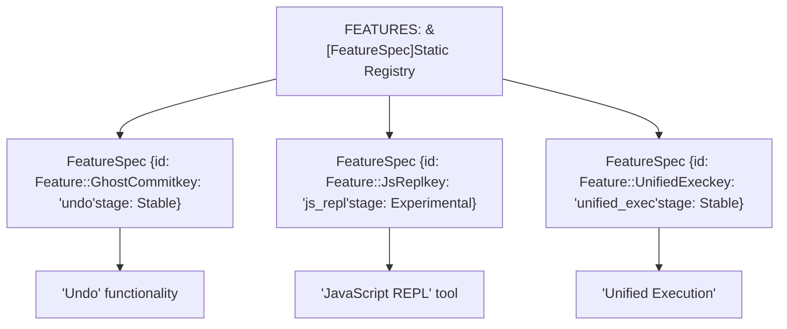
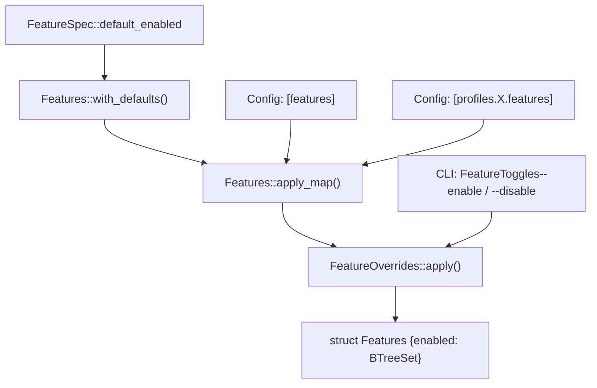
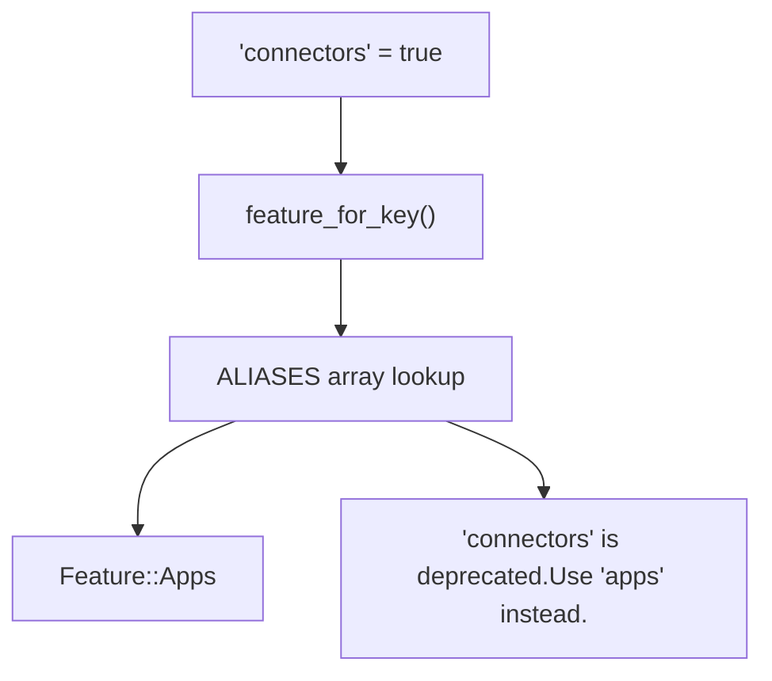

# 功能开关

相关源文件

-   [codex-rs/Cargo.lock](https://github.com/openai/codex/blob/d807d44a/codex-rs/Cargo.lock)
-   [codex-rs/Cargo.toml](https://github.com/openai/codex/blob/d807d44a/codex-rs/Cargo.toml)
-   [codex-rs/README.md](https://github.com/openai/codex/blob/d807d44a/codex-rs/README.md?plain=1)
-   [codex-rs/cli/Cargo.toml](https://github.com/openai/codex/blob/d807d44a/codex-rs/cli/Cargo.toml)
-   [codex-rs/cli/src/lib.rs](https://github.com/openai/codex/blob/d807d44a/codex-rs/cli/src/lib.rs)
-   [codex-rs/cli/src/main.rs](https://github.com/openai/codex/blob/d807d44a/codex-rs/cli/src/main.rs)
-   [codex-rs/config.md](https://github.com/openai/codex/blob/d807d44a/codex-rs/config.md?plain=1)
-   [codex-rs/core/Cargo.toml](https://github.com/openai/codex/blob/d807d44a/codex-rs/core/Cargo.toml)
-   [codex-rs/core/config.schema.json](https://github.com/openai/codex/blob/d807d44a/codex-rs/core/config.schema.json)
-   [codex-rs/core/src/config/agent\_roles.rs](https://github.com/openai/codex/blob/d807d44a/codex-rs/core/src/config/agent_roles.rs)
-   [codex-rs/core/src/config/config\_tests.rs](https://github.com/openai/codex/blob/d807d44a/codex-rs/core/src/config/config_tests.rs)
-   [codex-rs/core/src/config/edit.rs](https://github.com/openai/codex/blob/d807d44a/codex-rs/core/src/config/edit.rs)
-   [codex-rs/core/src/config/mod.rs](https://github.com/openai/codex/blob/d807d44a/codex-rs/core/src/config/mod.rs)
-   [codex-rs/core/src/config/profile.rs](https://github.com/openai/codex/blob/d807d44a/codex-rs/core/src/config/profile.rs)
-   [codex-rs/core/src/config/types.rs](https://github.com/openai/codex/blob/d807d44a/codex-rs/core/src/config/types.rs)
-   [codex-rs/core/src/flags.rs](https://github.com/openai/codex/blob/d807d44a/codex-rs/core/src/flags.rs)
-   [codex-rs/core/src/lib.rs](https://github.com/openai/codex/blob/d807d44a/codex-rs/core/src/lib.rs)
-   [codex-rs/core/src/model\_provider\_info.rs](https://github.com/openai/codex/blob/d807d44a/codex-rs/core/src/model_provider_info.rs)
-   [codex-rs/core/src/tools/handlers/mod.rs](https://github.com/openai/codex/blob/d807d44a/codex-rs/core/src/tools/handlers/mod.rs)
-   [codex-rs/core/src/tools/spec.rs](https://github.com/openai/codex/blob/d807d44a/codex-rs/core/src/tools/spec.rs)
-   [codex-rs/core/src/tools/spec\_tests.rs](https://github.com/openai/codex/blob/d807d44a/codex-rs/core/src/tools/spec_tests.rs)
-   [codex-rs/exec/Cargo.toml](https://github.com/openai/codex/blob/d807d44a/codex-rs/exec/Cargo.toml)
-   [codex-rs/exec/src/cli.rs](https://github.com/openai/codex/blob/d807d44a/codex-rs/exec/src/cli.rs)
-   [codex-rs/exec/src/lib.rs](https://github.com/openai/codex/blob/d807d44a/codex-rs/exec/src/lib.rs)
-   [codex-rs/tui/Cargo.toml](https://github.com/openai/codex/blob/d807d44a/codex-rs/tui/Cargo.toml)
-   [codex-rs/tui/src/cli.rs](https://github.com/openai/codex/blob/d807d44a/codex-rs/tui/src/cli.rs)
-   [codex-rs/tui/src/lib.rs](https://github.com/openai/codex/blob/d807d44a/codex-rs/tui/src/lib.rs)
-   [docs/config.md](https://github.com/openai/codex/blob/d807d44a/docs/config.md?plain=1)
-   [docs/example-config.md](https://github.com/openai/codex/blob/d807d44a/docs/example-config.md?plain=1)
-   [docs/skills.md](https://github.com/openai/codex/blob/d807d44a/docs/skills.md?plain=1)
-   [docs/slash\_commands.md](https://github.com/openai/codex/blob/d807d44a/docs/slash_commands.md?plain=1)

本文档描述 Codex 全局使用的功能开关系统，用于门控实验性、可选和平台特定功能。功能开关通过定义良好的生命周期阶段支持渐进式发布，并为用户提供会话级能力启用的细粒度控制。

关于单个功能的配置方式，请参见配置参考文档。关于功能如何与 profile 和配置层集成，请参见 [Configuration System (2.2)](https://github.com/openai/codex/blob/d807d44a/Configuration System (2.2))

---

## 概览

功能开关系统统一管理代码库中的实验性与可选行为切换。Codex 并未在多个模块中分散布置布尔配置字段，而是在单一注册表（`FEATURES` 数组）中定义所有功能，并提供一致元数据，包括生命周期阶段、默认状态与规范 key。

功能由 `Features` 结构体管理 [codex-rs/core/src/flags.rs223-227](https://github.com/openai/codex/blob/d807d44a/codex-rs/core/src/flags.rs#L223-L227)。该结构体维护启用集合，并跟踪遗留使用模式用于弃用告警。系统支持多个配置来源、明确定义的优先级、自动依赖解析，以及对已弃用功能 key 的平滑处理。

**来源：** [codex-rs/core/src/flags.rs1-920](https://github.com/openai/codex/blob/d807d44a/codex-rs/core/src/flags.rs#L1-L920)

---

## 功能生命周期阶段

每个功能都按定义生命周期推进，由 `Stage` 枚举表示 [codex-rs/core/src/flags.rs29-74](https://github.com/openai/codex/blob/d807d44a/codex-rs/core/src/flags.rs#L29-L74)。阶段决定可见性、稳定性保障和用户呈现方式。

### 功能生命周期状态机

Title: Feature Flag Lifecycle Stages

> **[Mermaid stateDiagram]**
> *(图表结构无法解析)*

### 阶段定义

| 阶段 | 可见性 | 默认状态 | 目的 |
| --- | --- | --- | --- |
| `UnderDevelopment` | 仅内部 | `false` | 正在积极开发，尚不适合外部使用 |
| `Experimental` | `/experimental` 菜单 | `false` | 面向用户但不稳定，需要显式启用 |
| `Stable` | 标准配置 | Varies | 可用于生产，可能默认启用 |
| `Deprecated` | 标准配置 | `false` | 已被替代，提示用户迁移 |
| `Removed` | 配置兼容 | `false` | 保留为空操作，仅用于配置向后兼容 |

**来源：** [codex-rs/core/src/flags.rs29-74](https://github.com/openai/codex/blob/d807d44a/codex-rs/core/src/flags.rs#L29-L74)

---

## 功能注册表

所有功能定义在 `FEATURES` 数组中 [codex-rs/core/src/flags.rs515-864](https://github.com/openai/codex/blob/d807d44a/codex-rs/core/src/flags.rs#L515-L864)，这是一个编译期注册表，通过 `FeatureSpec` 结构体将 `Feature` 枚举变体映射到其元数据。

### 代码实体映射：功能注册表

Title: Mapping Feature Enums to Registry Metadata


### FeatureSpec 结构

每个 `FeatureSpec` [codex-rs/core/src/flags.rs76-191](https://github.com/openai/codex/blob/d807d44a/codex-rs/core/src/flags.rs#L76-L191) 包含：

-   **`id`**：`Feature` 枚举变体。
-   **`key`**：用于 `config.toml` 的规范字符串 key（例如 `js_repl`）。
-   **`stage`**：当前生命周期阶段（例如 `Stage::Stable`）。
-   **`default_enabled`**：该功能是否默认启用（通常与平台条件相关）。

**示例注册表条目：**

-   `Feature::GhostCommit`：key `undo`，阶段 `Stable`，默认 `false` [codex-rs/core/src/flags.rs530-535](https://github.com/openai/codex/blob/d807d44a/codex-rs/core/src/flags.rs#L530-L535)
-   `Feature::UnifiedExec`：key `unified_exec`，阶段 `Stable`，默认 `!cfg!(windows)` [codex-rs/core/src/flags.rs640-645](https://github.com/openai/codex/blob/d807d44a/codex-rs/core/src/flags.rs#L640-L645)

**来源：** [codex-rs/core/src/flags.rs506-864](https://github.com/openai/codex/blob/d807d44a/codex-rs/core/src/flags.rs#L506-L864) [codex-rs/core/src/flags.rs76-191](https://github.com/openai/codex/blob/d807d44a/codex-rs/core/src/flags.rs#L76-L191)

---

## 配置来源与优先级

功能可通过多个配置来源进行切换，并按明确定义的优先级合并。系统遵循 [Configuration System (2.2)](https://github.com/openai/codex/blob/d807d44a/Configuration System (2.2)) 中描述的标准配置分层。

### 数据流：功能开关合并

标题：功能开关配置优先级


### 配置示例

**`config.toml` 中顶层 features 表：**

```
[features]js_repl = trueunified_exec = false
```
**CLI 覆盖：**

```
codex --enable js_repl --disable unified_exec
```
最终生效的功能集合在 `Features::from_config()` 中计算 [codex-rs/core/src/flags.rs390-424](https://github.com/openai/codex/blob/d807d44a/codex-rs/core/src/flags.rs#L390-L424)，按顺序合并这些层。

**来源：** [codex-rs/core/src/flags.rs253-266](https://github.com/openai/codex/blob/d807d44a/codex-rs/core/src/flags.rs#L253-L266) [codex-rs/core/src/flags.rs390-424](https://github.com/openai/codex/blob/d807d44a/codex-rs/core/src/flags.rs#L390-L424) [codex-rs/core/src/config/mod.rs64-68](https://github.com/openai/codex/blob/d807d44a/codex-rs/core/src/config/mod.rs#L64-L68)

---

## 运行时功能检测

代码通过 `Features` 结构体方法检查功能状态。最常见模式是 `features.enabled(Feature::X)`。

### 基本功能检查

```
// In codex-rs/core/src/tools/spec.rsif features.enabled(Feature::JsRepl) {    // Add JS REPL tools to registry}
```
### 条件功能检查

某些功能需要额外的运行时条件，例如认证状态：

-   **Apps 功能**：需要 `Feature::Apps` 开关且已完成 ChatGPT 认证 [codex-rs/core/src/flags.rs272-291](https://github.com/openai/codex/blob/d807d44a/codex-rs/core/src/flags.rs#L272-L291)

**来源：** [codex-rs/core/src/flags.rs268-305](https://github.com/openai/codex/blob/d807d44a/codex-rs/core/src/flags.rs#L268-L305) [codex-rs/core/src/tools/spec.rs33-34](https://github.com/openai/codex/blob/d807d44a/codex-rs/core/src/tools/spec.rs#L33-L34)

---

## 遗留功能支持

功能系统通过 `ALIASES` 数组维护重命名或重构后功能 key 的向后兼容 [codex-rs/core/src/flags.rs441-471](https://github.com/openai/codex/blob/d807d44a/codex-rs/core/src/flags.rs#L441-L471)

### 遗留键映射

标题：将遗留功能键解析为现代枚举


### 常见遗留别名

| 遗留键 | 当前功能 | 背景 |
| --- | --- | --- |
| `connectors` | `Feature::Apps` | 为提高可读性而重命名 [codex-rs/core/src/flags.rs445-448](https://github.com/openai/codex/blob/d807d44a/codex-rs/core/src/flags.rs#L445-L448) |
| `web_search` | `Feature::WebSearchRequest` | 已被结构化配置替代 [codex-rs/core/src/flags.rs465-468](https://github.com/openai/codex/blob/d807d44a/codex-rs/core/src/flags.rs#L465-L468) |

**来源：** [codex-rs/core/src/flags.rs441-471](https://github.com/openai/codex/blob/d807d44a/codex-rs/core/src/flags.rs#L441-L471)

---

## 实验菜单集成

`Stage::Experimental` 的功能会显示在 TUI 的 `/experimental` 命令菜单中。

-   **`experimental_menu_name()`**：返回 UI 展示名称 [codex-rs/core/src/flags.rs49-55](https://github.com/openai/codex/blob/d807d44a/codex-rs/core/src/flags.rs#L49-L55)
-   **`experimental_menu_description()`**：返回 UI 帮助文本 [codex-rs/core/src/flags.rs57-63](https://github.com/openai/codex/blob/d807d44a/codex-rs/core/src/flags.rs#L57-L63)

**示例：** `JsRepl` 功能会提供关于 Node.js 要求的详细菜单说明 [codex-rs/core/src/flags.rs550-556](https://github.com/openai/codex/blob/d807d44a/codex-rs/core/src/flags.rs#L550-L556)

**来源：** [codex-rs/core/src/flags.rs29-74](https://github.com/openai/codex/blob/d807d44a/codex-rs/core/src/flags.rs#L29-L74) [codex-rs/core/src/flags.rs550-556](https://github.com/openai/codex/blob/d807d44a/codex-rs/core/src/flags.rs#L550-L556)

---

## 不稳定功能告警

当任意 `Stage::UnderDevelopment` 功能被启用时，系统会发出告警事件 [codex-rs/core/src/flags.rs866-915](https://github.com/openai/codex/blob/d807d44a/codex-rs/core/src/flags.rs#L866-L915)。这会提示用户该功能尚未完成，行为可能不可预测。该告警可通过 `suppress_unstable_features_warning` 配置项抑制 [codex-rs/core/src/flags.rs871-873](https://github.com/openai/codex/blob/d807d44a/codex-rs/core/src/flags.rs#L871-L873)

**来源：** [codex-rs/core/src/flags.rs866-915](https://github.com/openai/codex/blob/d807d44a/codex-rs/core/src/flags.rs#L866-L915)

---

## 遥测集成

当某个功能状态与默认值不一致时，系统会发出指标以跟踪功能使用情况 [codex-rs/core/src/flags.rs336-352](https://github.com/openai/codex/blob/d807d44a/codex-rs/core/src/flags.rs#L336-L352)

```
// codex-rs/core/src/flags.rs:341-350if self.enabled(feature.id) != feature.default_enabled {    otel.counter(        "codex.feature.state",        1,        &[            ("feature", feature.key),            ("value", &self.enabled(feature.id).to_string()),        ],    );}
```
**来源：** [codex-rs/core/src/flags.rs336-352](https://github.com/openai/codex/blob/d807d44a/codex-rs/core/src/flags.rs#L336-L352)
