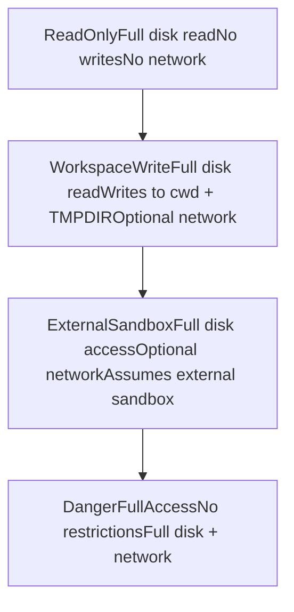
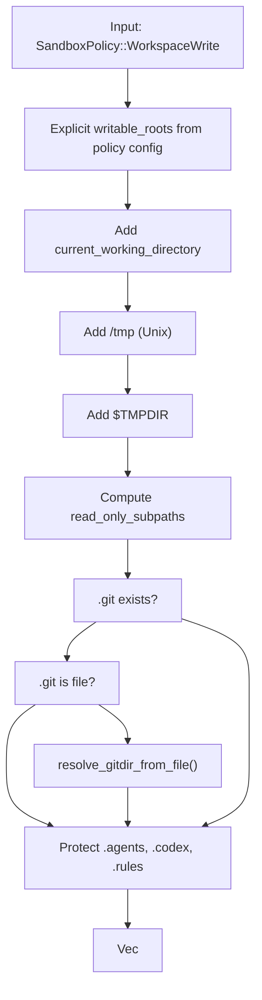
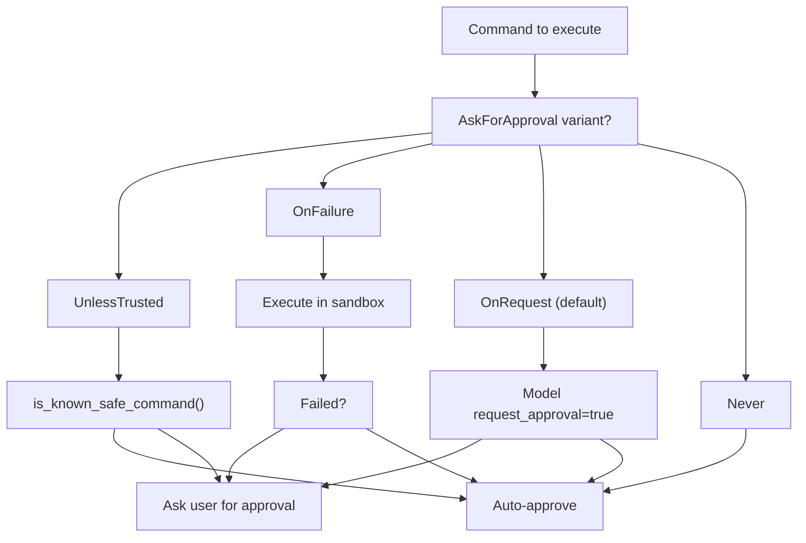

# 沙箱与审批策略

相关源文件

-   [codex-rs/core/config.schema.json](https://github.com/openai/codex/blob/d807d44a/codex-rs/core/config.schema.json)
-   [codex-rs/core/src/config/agent\_roles.rs](https://github.com/openai/codex/blob/d807d44a/codex-rs/core/src/config/agent_roles.rs)
-   [codex-rs/core/src/config/config\_tests.rs](https://github.com/openai/codex/blob/d807d44a/codex-rs/core/src/config/config_tests.rs)
-   [codex-rs/core/src/config/edit.rs](https://github.com/openai/codex/blob/d807d44a/codex-rs/core/src/config/edit.rs)
-   [codex-rs/core/src/config/mod.rs](https://github.com/openai/codex/blob/d807d44a/codex-rs/core/src/config/mod.rs)
-   [codex-rs/core/src/config/permissions.rs](https://github.com/openai/codex/blob/d807d44a/codex-rs/core/src/config/permissions.rs)
-   [codex-rs/core/src/config/permissions\_tests.rs](https://github.com/openai/codex/blob/d807d44a/codex-rs/core/src/config/permissions_tests.rs)
-   [codex-rs/core/src/config/profile.rs](https://github.com/openai/codex/blob/d807d44a/codex-rs/core/src/config/profile.rs)
-   [codex-rs/core/src/config/types.rs](https://github.com/openai/codex/blob/d807d44a/codex-rs/core/src/config/types.rs)
-   [codex-rs/core/src/exec\_policy.rs](https://github.com/openai/codex/blob/d807d44a/codex-rs/core/src/exec_policy.rs)
-   [codex-rs/core/src/exec\_policy\_tests.rs](https://github.com/openai/codex/blob/d807d44a/codex-rs/core/src/exec_policy_tests.rs)
-   [codex-rs/core/src/seatbelt\_tests.rs](https://github.com/openai/codex/blob/d807d44a/codex-rs/core/src/seatbelt_tests.rs)
-   [codex-rs/core/src/tasks/review.rs](https://github.com/openai/codex/blob/d807d44a/codex-rs/core/src/tasks/review.rs)
-   [codex-rs/core/src/tools/handlers/mod.rs](https://github.com/openai/codex/blob/d807d44a/codex-rs/core/src/tools/handlers/mod.rs)
-   [codex-rs/core/src/tools/spec.rs](https://github.com/openai/codex/blob/d807d44a/codex-rs/core/src/tools/spec.rs)
-   [codex-rs/core/src/tools/spec\_tests.rs](https://github.com/openai/codex/blob/d807d44a/codex-rs/core/src/tools/spec_tests.rs)
-   [codex-rs/core/tests/suite/approvals.rs](https://github.com/openai/codex/blob/d807d44a/codex-rs/core/tests/suite/approvals.rs)
-   [codex-rs/core/tests/suite/codex\_delegate.rs](https://github.com/openai/codex/blob/d807d44a/codex-rs/core/tests/suite/codex_delegate.rs)
-   [codex-rs/core/tests/suite/otel.rs](https://github.com/openai/codex/blob/d807d44a/codex-rs/core/tests/suite/otel.rs)
-   [codex-rs/core/tests/suite/review.rs](https://github.com/openai/codex/blob/d807d44a/codex-rs/core/tests/suite/review.rs)
-   [codex-rs/protocol/src/permissions.rs](https://github.com/openai/codex/blob/d807d44a/codex-rs/protocol/src/permissions.rs)
-   [docs/config.md](https://github.com/openai/codex/blob/d807d44a/docs/config.md?plain=1)
-   [docs/example-config.md](https://github.com/openai/codex/blob/d807d44a/docs/example-config.md?plain=1)
-   [docs/skills.md](https://github.com/openai/codex/blob/d807d44a/docs/skills.md?plain=1)
-   [docs/slash\_commands.md](https://github.com/openai/codex/blob/d807d44a/docs/slash_commands.md?plain=1)

本文档解释 Codex 中控制工具执行的双重安全机制：**沙箱策略**决定 shell 命令及其他工具的文件系统与网络访问限制，**审批策略**决定执行前何时必须由用户显式授权。这两类策略协同提供渐进式信任等级，从完全沙箱化的只读访问到无限制执行。

## 安全策略概览

Codex 使用两套正交策略系统，按轮次设置并分别控制工具执行的不同维度：

| 策略类型 | 目的 | 配置方式 |
| --- | --- | --- |
| `SandboxPolicy` | 控制文件系统写权限、网络访问和执行环境 | `Op::UserTurn.sandbox_policy` |
| `AskForApproval` | 控制执行命令前何时需要用户审批 | `Op::UserTurn.approval_policy` |

两类策略都在 `Op::UserTurn` 提交中传递，并可通过 `Op::OverrideTurnContext` 覆盖同一会话后续轮次。

**来源：** [codex-rs/protocol/src/protocol.rs108-143](https://github.com/openai/codex/blob/d807d44a/codex-rs/protocol/src/protocol.rs#L108-L143)

## 沙箱策略系统

### 策略变体

`SandboxPolicy` 枚举定义了访问级别递增的执行模式：

**策略特征：**

| 策略 | 磁盘读 | 磁盘写 | 网络 | 受保护路径 |
| --- | --- | --- | --- | --- |
| `ReadOnly` | Full | None | Disabled | N/A |
| `WorkspaceWrite` | Full | cwd + TMPDIR + configured roots | Optional | .git, .codex, .agents |
| `ExternalSandbox` | Full | Full | Optional | None（由外部沙箱强制） |
| `DangerFullAccess` | Full | Full | Enabled | None |

**来源：** [codex-rs/protocol/src/protocol.rs379-426](https://github.com/openai/codex/blob/d807d44a/codex-rs/protocol/src/protocol.rs#L379-L426) [codex-rs/protocol/src/protocol.rs467-507](https://github.com/openai/codex/blob/d807d44a/codex-rs/protocol/src/protocol.rs#L467-L507)

### 可写根目录计算

对于 `WorkspaceWrite` 策略，系统会计算一组 `WritableRoot` 对象。函数 `get_writable_roots_with_cwd` 定义哪些目录可写，以及这些可写根中哪些子目录必须保持只读，以防止权限提升。

**受保护子目录：**

系统会在可写根内自动保护以下子目录：

1.  **`.git` 目录** - 防止修改 git hooks 或 config。若 `.git` 是文件（worktree 常见），会解析实际 gitdir [codex-rs/protocol/src/protocol.rs641-654](https://github.com/openai/codex/blob/d807d44a/codex-rs/protocol/src/protocol.rs#L641-L654)
2.  **`.codex` 目录** - 防止修改 Codex 配置 [codex-rs/protocol/src/protocol.rs624-630](https://github.com/openai/codex/blob/d807d44a/codex-rs/protocol/src/protocol.rs#L624-L630)
3.  **`.agents` 目录** - 防止修改 agent/skill 配置 [codex-rs/protocol/src/protocol.rs632-638](https://github.com/openai/codex/blob/d807d44a/codex-rs/protocol/src/protocol.rs#L632-L638)

**来源：** [codex-rs/protocol/src/protocol.rs511-622](https://github.com/openai/codex/blob/d807d44a/codex-rs/protocol/src/protocol.rs#L511-L622) [codex-rs/protocol/src/protocol.rs433-457](https://github.com/openai/codex/blob/d807d44a/codex-rs/protocol/src/protocol.rs#L433-L457) [codex-rs/protocol/src/protocol.rs624-687](https://github.com/openai/codex/blob/d807d44a/codex-rs/protocol/src/protocol.rs#L624-L687)

## 审批策略系统

### 策略变体

`AskForApproval` 枚举决定何时需要用户介入。该行为可通过 `AskForApproval::Granular` 进行细粒度配置，以独立切换规则与沙箱审批 [codex-rs/core/src/exec\_policy.rs139-152](https://github.com/openai/codex/blob/d807d44a/codex-rs/core/src/exec_policy.rs#L139-L152)

**来源：** [codex-rs/protocol/src/protocol.rs320-359](https://github.com/openai/codex/blob/d807d44a/codex-rs/protocol/src/protocol.rs#L320-L359) [codex-rs/core/src/exec\_policy.rs130-153](https://github.com/openai/codex/blob/d807d44a/codex-rs/core/src/exec_policy.rs#L130-L153) [codex-rs/core/config.schema.json92-123](https://github.com/openai/codex/blob/d807d44a/codex-rs/core/config.schema.json#L92-L123)

### 审批请求事件

当需要审批时，系统会发出事件，由 UI（如 TUI 或 App Server）拦截后提示用户：

-   `ExecApprovalRequest`：用于 shell 命令或进程执行 [codex-rs/protocol/src/protocol.rs52-56](https://github.com/openai/codex/blob/d807d44a/codex-rs/protocol/src/protocol.rs#L52-L56)
-   `ApplyPatchApprovalRequest`：当 `apply_patch` 工具目标文件超出允许根目录时触发 [codex-rs/protocol/src/protocol.rs194-227](https://github.com/openai/codex/blob/d807d44a/codex-rs/protocol/src/protocol.rs#L194-L227)
-   `ElicitationRequest`：供 MCP 服务器请求凭据或确认 [codex-rs/protocol/src/protocol.rs789-797](https://github.com/openai/codex/blob/d807d44a/codex-rs/protocol/src/protocol.rs#L789-L797)

**来源：** [codex-rs/protocol/src/protocol.rs52-56](https://github.com/openai/codex/blob/d807d44a/codex-rs/protocol/src/protocol.rs#L52-L56) [codex-rs/protocol/src/protocol.rs789-797](https://github.com/openai/codex/blob/d807d44a/codex-rs/protocol/src/protocol.rs#L789-L797) [codex-rs/protocol/src/protocol.rs194-227](https://github.com/openai/codex/blob/d807d44a/codex-rs/protocol/src/protocol.rs#L194-L227)

## 执行策略管理器

`ExecPolicyManager` [codex-rs/core/src/exec\_policy.rs191-194](https://github.com/openai/codex/blob/d807d44a/codex-rs/core/src/exec_policy.rs#L191-L194) 负责将 shell 命令与一组 `.rules` 文件进行评估。

### 决策评估

提交命令时，管理器会执行 `Policy::evaluate` 调用。

-   **前缀规则**：若命令匹配 `default.rules` 中允许的前缀，可自动批准。
-   **危险命令**：`command_might_be_dangerous` [codex-rs/core/src/exec\_policy.rs10](https://github.com/openai/codex/blob/d807d44a/codex-rs/core/src/exec_policy.rs#L10-L10) 会检查破坏性模式（如 `rm -rf /`）。
-   **策略修订**：用户可在批准命令时同时添加 `ExecPolicyAmendment` [codex-rs/protocol/src/protocol.rs52-56](https://github.com/openai/codex/blob/d807d44a/codex-rs/protocol/src/protocol.rs#L52-L56) 到规则集，并由 `blocking_append_allow_prefix_rule` [codex-rs/core/src/exec\_policy.rs21](https://github.com/openai/codex/blob/d807d44a/codex-rs/core/src/exec_policy.rs#L21-L21) 持久化到磁盘。

**来源：** [codex-rs/core/src/exec\_policy.rs191-214](https://github.com/openai/codex/blob/d807d44a/codex-rs/core/src/exec_policy.rs#L191-L214) [codex-rs/core/src/exec\_policy.rs10-22](https://github.com/openai/codex/blob/d807d44a/codex-rs/core/src/exec_policy.rs#L10-L22)

## 配置与 Profile

策略定义在 `config.toml` 中，并通过分层堆栈解析。

### 沙箱模式映射

配置枚举 `SandboxMode` 映射到 `SandboxPolicy` 变体：

| 配置 `sandbox_mode` | `SandboxPolicy` 结果 |
| --- | --- |
| `read-only` | `ReadOnly` |
| `workspace-write` | `WorkspaceWrite` |
| `full-access` | `DangerFullAccess` |
| `external-sandbox` | `ExternalSandbox` |

**来源：** [codex-rs/core/config.schema.json319-331](https://github.com/openai/codex/blob/d807d44a/codex-rs/core/config.schema.json#L319-L331) [codex-rs/protocol/src/protocol.rs379-426](https://github.com/openai/codex/blob/d807d44a/codex-rs/protocol/src/protocol.rs#L379-L426)

### Profile 解析

`ConfigService` 通过合并全局默认、profile 覆盖和运行时 CLI 参数来解析生效策略。`resolve_permission_profile` [codex-rs/core/src/config/mod.rs130](https://github.com/openai/codex/blob/d807d44a/codex-rs/core/src/config/mod.rs#L130-L130) 函数会将这些内容编译为代理使用的最终 `PermissionProfile`。

**来源：** [codex-rs/core/src/config/mod.rs100-130](https://github.com/openai/codex/blob/d807d44a/codex-rs/core/src/config/mod.rs#L100-L130) [codex-rs/core/src/config/profile.rs18-49](https://github.com/openai/codex/blob/d807d44a/codex-rs/core/src/config/profile.rs#L18-L49)

## 平台特定实现

### Linux（Bubblewrap/Firejail）

在 Linux 上，Codex 会在 `/usr/bin/bwrap` 查找系统 `bwrap` [codex-rs/core/src/config/mod.rs148](https://github.com/openai/codex/blob/d807d44a/codex-rs/core/src/config/mod.rs#L148-L148)。若缺失，会发出告警并回退到内置版本 [codex-rs/core/src/config/mod.rs156-164](https://github.com/openai/codex/blob/d807d44a/codex-rs/core/src/config/mod.rs#L156-L164)

### Windows（受限令牌）

Windows 使用 `WindowsSandboxModeToml`（Elevated/Unelevated）[codex-rs/core/src/config/types.rs34-39](https://github.com/openai/codex/blob/d807d44a/codex-rs/core/src/config/types.rs#L34-L39)。还可通过私有桌面（`sandbox_private_desktop`）启动进程以隔离 UI 交互 [codex-rs/core/src/config/types.rs47](https://github.com/openai/codex/blob/d807d44a/codex-rs/core/src/config/types.rs#L47-L47)

### macOS（Seatbelt）

使用 `MacOsSeatbeltProfileExtensions` [codex-rs/core/src/config/mod.rs81](https://github.com/openai/codex/blob/d807d44a/codex-rs/core/src/config/mod.rs#L81-L81) 定义沙箱 profile，并通过系统 `sandbox-exec` 机制限制文件系统与网络访问。

**来源：** [codex-rs/core/src/config/mod.rs148-164](https://github.com/openai/codex/blob/d807d44a/codex-rs/core/src/config/mod.rs#L148-L164) [codex-rs/core/src/config/types.rs34-48](https://github.com/openai/codex/blob/d807d44a/codex-rs/core/src/config/types.rs#L34-L48) [codex-rs/core/src/config/mod.rs81](https://github.com/openai/codex/blob/d807d44a/codex-rs/core/src/config/mod.rs#L81-L81)

## 权限摘要

系统保持严格层级：`SandboxPolicy` 定义进程在物理层面可执行能力的最大“边界”，而 `AskForApproval` 与 `ExecPolicyManager` 在该边界内定义人机协同授权要求。

**来源：** [codex-rs/protocol/src/protocol.rs320-622](https://github.com/openai/codex/blob/d807d44a/codex-rs/protocol/src/protocol.rs#L320-L622) [codex-rs/core/src/exec\_policy.rs1-214](https://github.com/openai/codex/blob/d807d44a/codex-rs/core/src/exec_policy.rs#L1-L214)
