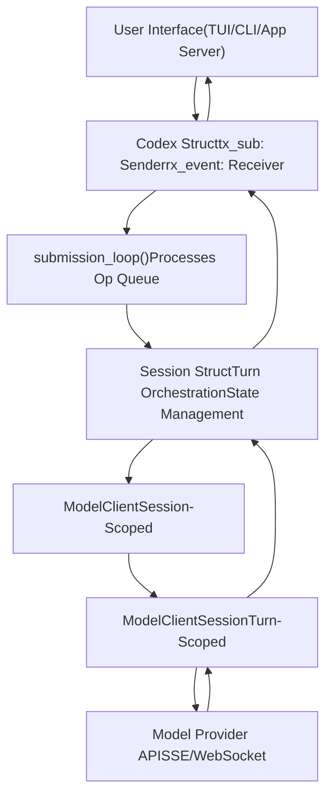
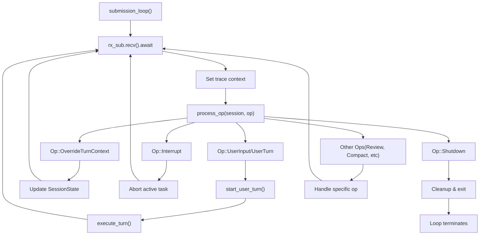
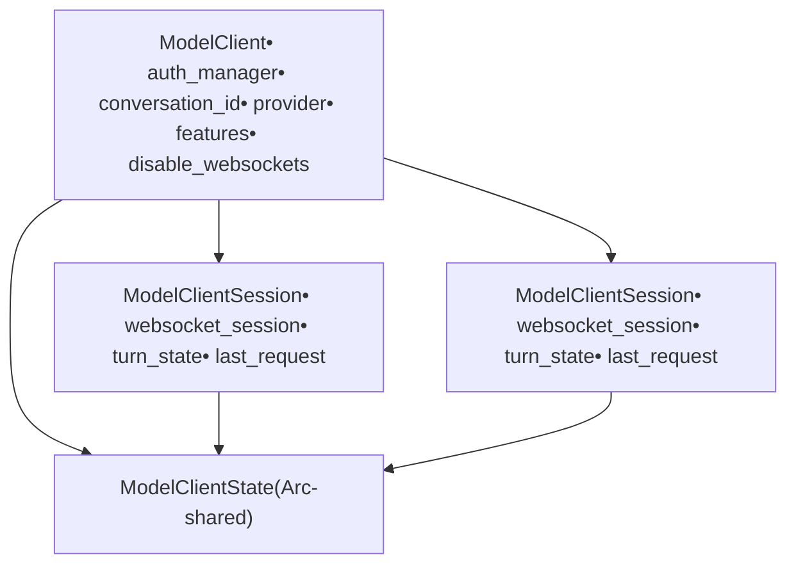
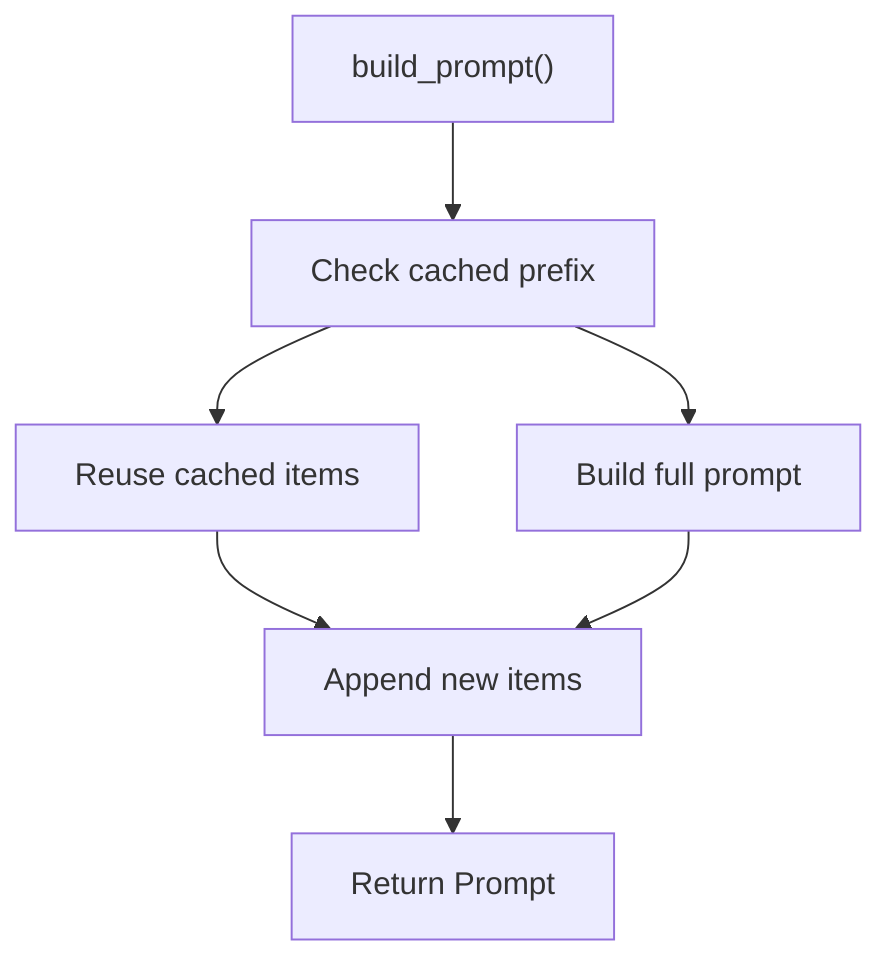
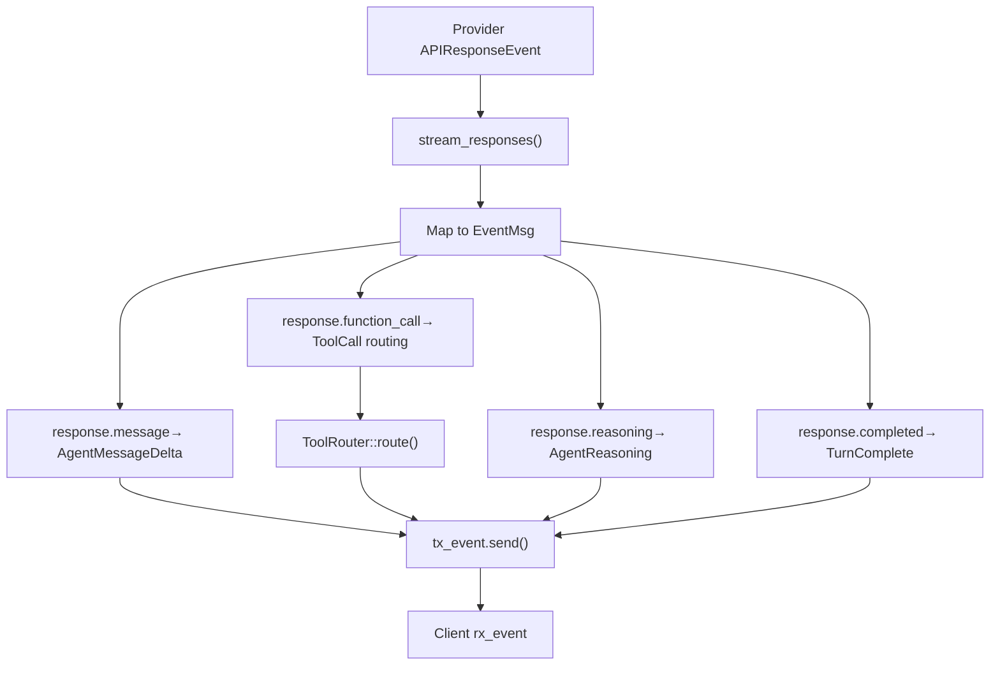
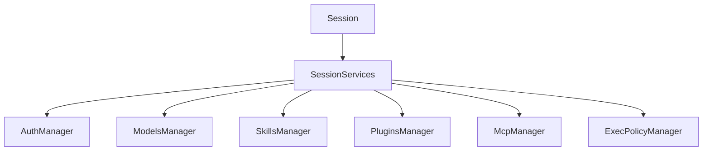
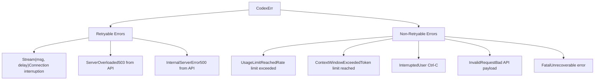

# 核心代理系统（codex-core）

相关源文件

-   [codex-rs/codex-api/src/common.rs](https://github.com/openai/codex/blob/d807d44a/codex-rs/codex-api/src/common.rs)
-   [codex-rs/codex-api/src/endpoint/responses\_websocket.rs](https://github.com/openai/codex/blob/d807d44a/codex-rs/codex-api/src/endpoint/responses_websocket.rs)
-   [codex-rs/codex-api/src/sse/responses.rs](https://github.com/openai/codex/blob/d807d44a/codex-rs/codex-api/src/sse/responses.rs)
-   [codex-rs/core/src/client.rs](https://github.com/openai/codex/blob/d807d44a/codex-rs/core/src/client.rs)
-   [codex-rs/core/src/client\_common.rs](https://github.com/openai/codex/blob/d807d44a/codex-rs/core/src/client_common.rs)
-   [codex-rs/core/src/codex.rs](https://github.com/openai/codex/blob/d807d44a/codex-rs/core/src/codex.rs)
-   [codex-rs/core/src/rollout/policy.rs](https://github.com/openai/codex/blob/d807d44a/codex-rs/core/src/rollout/policy.rs)
-   [codex-rs/core/tests/common/responses.rs](https://github.com/openai/codex/blob/d807d44a/codex-rs/core/tests/common/responses.rs)
-   [codex-rs/core/tests/responses\_headers.rs](https://github.com/openai/codex/blob/d807d44a/codex-rs/core/tests/responses_headers.rs)
-   [codex-rs/core/tests/suite/agent\_websocket.rs](https://github.com/openai/codex/blob/d807d44a/codex-rs/core/tests/suite/agent_websocket.rs)
-   [codex-rs/core/tests/suite/client.rs](https://github.com/openai/codex/blob/d807d44a/codex-rs/core/tests/suite/client.rs)
-   [codex-rs/core/tests/suite/client\_websockets.rs](https://github.com/openai/codex/blob/d807d44a/codex-rs/core/tests/suite/client_websockets.rs)
-   [codex-rs/core/tests/suite/prompt\_caching.rs](https://github.com/openai/codex/blob/d807d44a/codex-rs/core/tests/suite/prompt_caching.rs)
-   [codex-rs/core/tests/suite/turn\_state.rs](https://github.com/openai/codex/blob/d807d44a/codex-rs/core/tests/suite/turn_state.rs)
-   [codex-rs/core/tests/suite/websocket\_fallback.rs](https://github.com/openai/codex/blob/d807d44a/codex-rs/core/tests/suite/websocket_fallback.rs)
-   [codex-rs/exec/src/event\_processor.rs](https://github.com/openai/codex/blob/d807d44a/codex-rs/exec/src/event_processor.rs)
-   [codex-rs/exec/src/event\_processor\_with\_human\_output.rs](https://github.com/openai/codex/blob/d807d44a/codex-rs/exec/src/event_processor_with_human_output.rs)
-   [codex-rs/mcp-server/src/codex\_tool\_runner.rs](https://github.com/openai/codex/blob/d807d44a/codex-rs/mcp-server/src/codex_tool_runner.rs)
-   [codex-rs/protocol/src/protocol.rs](https://github.com/openai/codex/blob/d807d44a/codex-rs/protocol/src/protocol.rs)
-   [codex-rs/tui/src/app.rs](https://github.com/openai/codex/blob/d807d44a/codex-rs/tui/src/app.rs)
-   [codex-rs/tui/src/app\_event.rs](https://github.com/openai/codex/blob/d807d44a/codex-rs/tui/src/app_event.rs)
-   [codex-rs/tui/src/bottom\_pane/chat\_composer.rs](https://github.com/openai/codex/blob/d807d44a/codex-rs/tui/src/bottom_pane/chat_composer.rs)
-   [codex-rs/tui/src/bottom\_pane/mod.rs](https://github.com/openai/codex/blob/d807d44a/codex-rs/tui/src/bottom_pane/mod.rs)
-   [codex-rs/tui/src/chatwidget.rs](https://github.com/openai/codex/blob/d807d44a/codex-rs/tui/src/chatwidget.rs)
-   [codex-rs/tui/src/chatwidget/tests.rs](https://github.com/openai/codex/blob/d807d44a/codex-rs/tui/src/chatwidget/tests.rs)
-   [codex-rs/tui/src/history\_cell.rs](https://github.com/openai/codex/blob/d807d44a/codex-rs/tui/src/history_cell.rs)
-   [codex-rs/tui/src/slash\_command.rs](https://github.com/openai/codex/blob/d807d44a/codex-rs/tui/src/slash_command.rs)

核心代理系统是 Codex 的中枢编排层，负责管理对话轮次、协调模型 API 交互并维护会话状态。本文档介绍支撑 Codex 代理的基础架构、执行流程和关键抽象。

关于与该系统交互的具体用户界面，请参阅[用户界面](/openai/codex/4-user-interfaces)。关于工具执行与审批工作流，请参阅[工具系统](/openai/codex/5-tool-system)。关于配置与权限，请参阅[沙箱与审批策略](/openai/codex/2.4-sandbox-and-approval-policies)。

## 架构概览

核心代理系统实现了 **Submission Queue / Event Queue**（SQ/EQ）模式，用于用户界面与代理之间的异步通信。用户通过有界通道提交操作（`Op`），代理在执行过程中通过无界通道发出事件（`EventMsg`）。

### 提交/事件模式


**Sources:** [codex-rs/core/src/codex.rs330-343](https://github.com/openai/codex/blob/d807d44a/codex-rs/core/src/codex.rs#L330-L343) [codex-rs/core/src/codex.rs744-759](https://github.com/openai/codex/blob/d807d44a/codex-rs/core/src/codex.rs#L744-L759) [codex-rs/protocol/src/protocol.rs1-100](https://github.com/openai/codex/blob/d807d44a/codex-rs/protocol/src/protocol.rs#L1-L100)

### 关键组件

| 组件 | 用途 | 位置 |
| --- | --- | --- |
| **Codex** | 公共 API 接口，管理提交/事件队列和会话生命周期 | [codex-rs/core/src/codex.rs330-724](https://github.com/openai/codex/blob/d807d44a/codex-rs/core/src/codex.rs#L330-L724) |
| **Session** | 每个会话的对话状态，编排轮次执行与工具调用 | [codex-rs/core/src/codex.rs744-759](https://github.com/openai/codex/blob/d807d44a/codex-rs/core/src/codex.rs#L744-L759) |
| **ModelClient** | 会话级模型 API 通信客户端 | [codex-rs/core/src/client.rs168-272](https://github.com/openai/codex/blob/d807d44a/codex-rs/core/src/client.rs#L168-L272) |
| **ModelClientSession** | 轮次级流式会话，带 WebSocket 连接缓存 | [codex-rs/core/src/client.rs176-253](https://github.com/openai/codex/blob/d807d44a/codex-rs/core/src/client.rs#L176-L253) |
| **TurnContext** | 每轮配置快照（模型、cwd、沙箱、权限） | [codex-rs/core/src/codex.rs776-920](https://github.com/openai/codex/blob/d807d44a/codex-rs/core/src/codex.rs#L776-L920) |
| **Prompt** | API 请求负载，包含输入项、工具与指令 | [codex-rs/core/src/client\_common.rs26-65](https://github.com/openai/codex/blob/d807d44a/codex-rs/core/src/client_common.rs#L26-L65) |

**Sources:** [codex-rs/core/src/codex.rs330-759](https://github.com/openai/codex/blob/d807d44a/codex-rs/core/src/codex.rs#L330-L759) [codex-rs/core/src/client.rs158-253](https://github.com/openai/codex/blob/d807d44a/codex-rs/core/src/client.rs#L158-L253)

## 会话生命周期

`Codex` 结构体表示一条对话线程。会话可以新建、从磁盘恢复，或从现有会话分叉。

**Sources:** [codex-rs/core/src/codex.rs380-633](https://github.com/openai/codex/blob/d807d44a/codex-rs/core/src/codex.rs#L380-L633) [codex-rs/core/src/codex.rs1281-1528](https://github.com/openai/codex/blob/d807d44a/codex-rs/core/src/codex.rs#L1281-L1528)

### Codex::spawn() 流程

spawn 过程会初始化所有必需的管理器，并构建会话：

> **[Mermaid sequence]**
> *(图表结构无法解析)*

**Sources:** [codex-rs/core/src/codex.rs380-633](https://github.com/openai/codex/blob/d807d44a/codex-rs/core/src/codex.rs#L380-L633) [codex-rs/core/src/codex.rs869-1127](https://github.com/openai/codex/blob/d807d44a/codex-rs/core/src/codex.rs#L869-L1127)

### 提交流程处理

`submission_loop` 是贯穿整个会话生命周期的核心事件处理循环：


**Sources:** [codex-rs/core/src/codex.rs1281-1528](https://github.com/openai/codex/blob/d807d44a/codex-rs/core/src/codex.rs#L1281-L1528)

## 轮次执行流程

一次用户轮次代表与模型交互的完整请求/响应周期。系统会从对话历史构建 prompt，流式接收响应，处理工具调用并更新状态。

### 完整轮次流程

> **[Mermaid sequence]**
> *(图表结构无法解析)*

**Sources:** [codex-rs/core/src/codex.rs2418-2926](https://github.com/openai/codex/blob/d807d44a/codex-rs/core/src/codex.rs#L2418-L2926) [codex-rs/core/src/client.rs791-944](https://github.com/openai/codex/blob/d807d44a/codex-rs/core/src/client.rs#L791-L944)

### TurnContext 构建

每个轮次都会创建一个 `TurnContext` 快照，包含该轮次所需的全部配置：

```
// TurnContext fields (simplified)pub(crate) struct TurnContext {    pub(crate) sub_id: String,    pub(crate) model_info: ModelInfo,    pub(crate) cwd: PathBuf,    pub(crate) approval_policy: Constrained<AskForApproval>,    pub(crate) sandbox_policy: Constrained<SandboxPolicy>,    pub(crate) tools_config: ToolsConfig,    pub(crate) features: ManagedFeatures,    // ... ~30 more fields}
```
**Sources:** [codex-rs/core/src/codex.rs776-920](https://github.com/openai/codex/blob/d807d44a/codex-rs/core/src/codex.rs#L776-L920)

## 模型客户端架构

模型客户端层将会话级配置与轮次级流式状态分离。

### 会话级与轮次级客户端


**Sources:** [codex-rs/core/src/client.rs117-272](https://github.com/openai/codex/blob/d807d44a/codex-rs/core/src/client.rs#L117-L272)

### WebSocket 连接生命周期

`ModelClientSession` 维护一个可缓存的 WebSocket 连接，可在同一轮次内的多个请求间复用：

> **[Mermaid stateDiagram]**
> *(图表结构无法解析)*

**Sources:** [codex-rs/core/src/client.rs734-774](https://github.com/openai/codex/blob/d807d44a/codex-rs/core/src/client.rs#L734-L774) [codex-rs/core/src/client.rs514-520](https://github.com/openai/codex/blob/d807d44a/codex-rs/core/src/client.rs#L514-L520)

### 传输选择与回退

客户端同时支持 WebSocket 与 HTTP SSE 传输，并带有自动回退机制：

| Transport | Used When | Features |
| --- | --- | --- |
| **WebSocket** | `responses_websocket_enabled()` returns true | Connection reuse, incremental requests, sticky routing via `x-codex-turn-state` header |
| **HTTP SSE** | Fallback or explicitly disabled | Stateless, simpler retry logic |

**Sources:** [codex-rs/core/src/client.rs423-433](https://github.com/openai/codex/blob/d807d44a/codex-rs/core/src/client.rs#L423-L433) [codex-rs/core/src/client.rs791-944](https://github.com/openai/codex/blob/d807d44a/codex-rs/core/src/client.rs#L791-L944)

## Prompt 构建

`Prompt` 结构体封装了模型 API 请求所需的全部内容：

```
pub struct Prompt {    pub input: Vec<ResponseItem>,           // Conversation history    pub(crate) tools: Vec<ToolSpec>,        // Available tools    pub(crate) parallel_tool_calls: bool,   // Allow parallel execution    pub base_instructions: BaseInstructions, // System prompt    pub personality: Option<Personality>,    // Tone/style    pub output_schema: Option<Value>,        // Structured output}
```
`input` 字段包含完整的对话上下文，以 `ResponseItem` 对象表示用户消息、助手消息、工具调用和工具输出。

**Sources:** [codex-rs/core/src/client\_common.rs26-65](https://github.com/openai/codex/blob/d807d44a/codex-rs/core/src/client_common.rs#L26-L65)

### 带缓存的 Prompt 构建

`ContextManager` 使用缓存前缀构建 prompt，以降低 token 消耗并改善延迟：


**Sources:** [codex-rs/core/src/codex.rs2598-2609](https://github.com/openai/codex/blob/d807d44a/codex-rs/core/src/codex.rs#L2598-L2609)

## 事件处理

系统会将提供方 API 事件（`ResponseEvent`）转换为协议事件（`EventMsg`），并发送给客户端。

### 事件转换流水线


**Sources:** [codex-rs/core/src/codex.rs2700-3154](https://github.com/openai/codex/blob/d807d44a/codex-rs/core/src/codex.rs#L2700-L3154)

### 事件持久化

系统会根据事件类型和配置的持久化模式，选择性地将事件写入 rollout 文件：

| Persistence Mode | Persisted Events |
| --- | --- |
| **Limited** | User messages, agent messages, reasoning, turn lifecycle (TurnStarted, TurnComplete), token counts |
| **Extended** | All Limited events + tool call results, errors, warnings, diffs |
| **None** | Streaming deltas, approval requests, background events |

**Sources:** [codex-rs/core/src/rollout/policy.rs1-187](https://github.com/openai/codex/blob/d807d44a/codex-rs/core/src/rollout/policy.rs#L1-L187)

## 状态管理

`Session` 结构体通过 `SessionState` 维护可变状态。所有状态变更都在加锁的临界区中进行，以确保并发操作下的一致性（例如活动轮次期间发生中断时）。

**Sources:** [codex-rs/core/src/codex.rs744-759](https://github.com/openai/codex/blob/d807d44a/codex-rs/core/src/codex.rs#L744-L759)

### 会话服务

共享服务在每个会话中只初始化一次，并通过 `SessionServices` 访问：


**Sources:** [codex-rs/core/src/codex.rs756-757](https://github.com/openai/codex/blob/d807d44a/codex-rs/core/src/codex.rs#L756-L757)

## 错误处理

核心系统定义了完整的错误分类体系，并区分可重试与不可重试语义。


**Sources:** [codex-rs/core/src/client.rs101-102](https://github.com/openai/codex/blob/d807d44a/codex-rs/core/src/client.rs#L101-L102) [codex-rs/protocol/src/protocol.rs109-111](https://github.com/openai/codex/blob/d807d44a/codex-rs/protocol/src/protocol.rs#L109-L111)

### 重试逻辑

会话循环会对瞬时错误执行自动重试：

1.  检查 `err.is_retryable()`
2.  若为 true，则应用指数退避
3.  用当前上下文重建 prompt
4.  重试直至达到配置上限
5.  若超过上限，则发送错误事件

**Sources:** [codex-rs/core/src/codex.rs3481-3554](https://github.com/openai/codex/blob/d807d44a/codex-rs/core/src/codex.rs#L3481-L3554)

## API 请求头

客户端会附加多个请求头用于跟踪请求：

| Header | Purpose |
| --- | --- |
| `x-client-request-id` | Conversation/thread identifier |
| `x-codex-turn-state` | Sticky routing token for turn continuity |
| `x-codex-turn-metadata` | Structured turn metadata (JSON) |
| `x-responsesapi-include-timing-metrics` | Request timing info from API |
| `OpenAI-Beta` | Feature flags (e.g., `responses_websockets=2026-02-06`) |

**Sources:** [codex-rs/core/src/client.rs115-120](https://github.com/openai/codex/blob/d807d44a/codex-rs/core/src/client.rs#L115-L120) [codex-rs/core/src/client.rs484-511](https://github.com/openai/codex/blob/d807d44a/codex-rs/core/src/client.rs#L484-L511)

## 总结

核心代理系统提供了：

-   **基于队列的架构**：支持异步 `Op` 提交与 `Event` 发射
-   **会话生命周期管理**：支持 spawn、resume、fork 操作
-   **轮次编排能力**：协调 prompt 构建、模型流式输出与工具执行
-   **分层客户端设计**：将会话状态与轮次状态分离
-   **传输灵活性**：支持 WebSocket 连接缓存与 HTTP SSE 回退
-   **完整错误处理**：对瞬时故障提供自动重试
-   **事件转换机制**：将提供方专有格式转换为协议事件

该架构在保持代理核心、用户界面与工具执行系统清晰解耦的同时，使系统能够与外部模型提供方进行可靠、有状态的对话。

**Sources:** [codex-rs/core/src/codex.rs](https://github.com/openai/codex/blob/d807d44a/codex-rs/core/src/codex.rs) [codex-rs/core/src/client.rs](https://github.com/openai/codex/blob/d807d44a/codex-rs/core/src/client.rs) [codex-rs/protocol/src/protocol.rs](https://github.com/openai/codex/blob/d807d44a/codex-rs/protocol/src/protocol.rs) [codex-rs/core/src/client\_common.rs](https://github.com/openai/codex/blob/d807d44a/codex-rs/core/src/client_common.rs)
