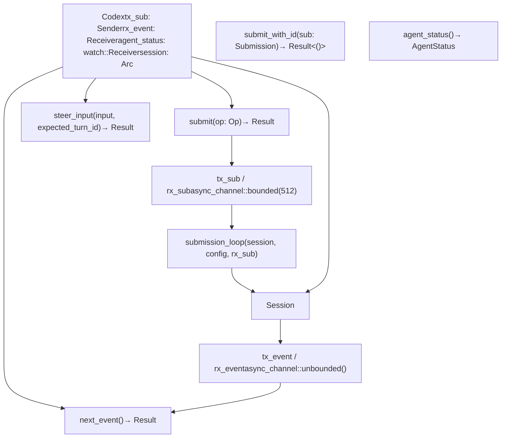
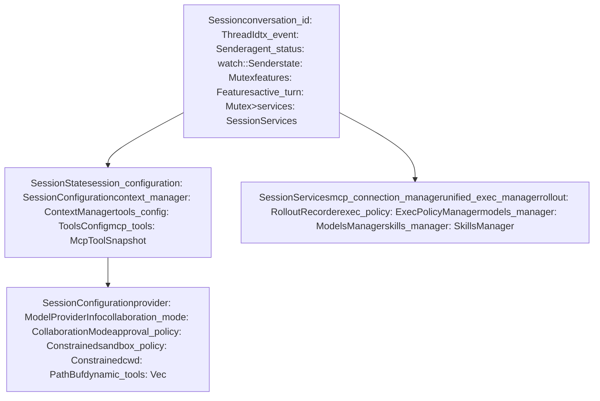
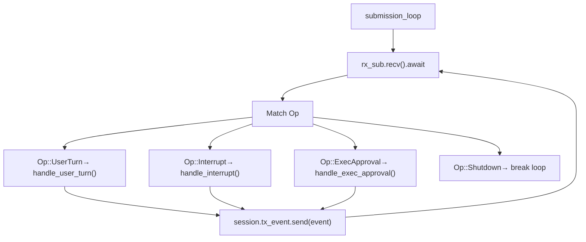

# Codex 接口与会话生命周期

相关源文件

-   [codex-rs/app-server/tests/suite/v2/mcp\_server\_elicitation.rs](https://github.com/openai/codex/blob/d807d44a/codex-rs/app-server/tests/suite/v2/mcp_server_elicitation.rs)
-   [codex-rs/cli/src/mcp\_cmd.rs](https://github.com/openai/codex/blob/d807d44a/codex-rs/cli/src/mcp_cmd.rs)
-   [codex-rs/cli/tests/mcp\_add\_remove.rs](https://github.com/openai/codex/blob/d807d44a/codex-rs/cli/tests/mcp_add_remove.rs)
-   [codex-rs/cli/tests/mcp\_list.rs](https://github.com/openai/codex/blob/d807d44a/codex-rs/cli/tests/mcp_list.rs)
-   [codex-rs/core/src/codex.rs](https://github.com/openai/codex/blob/d807d44a/codex-rs/core/src/codex.rs)
-   [codex-rs/core/src/mcp\_connection\_manager.rs](https://github.com/openai/codex/blob/d807d44a/codex-rs/core/src/mcp_connection_manager.rs)
-   [codex-rs/core/src/mcp\_connection\_manager\_tests.rs](https://github.com/openai/codex/blob/d807d44a/codex-rs/core/src/mcp_connection_manager_tests.rs)
-   [codex-rs/core/src/rollout/policy.rs](https://github.com/openai/codex/blob/d807d44a/codex-rs/core/src/rollout/policy.rs)
-   [codex-rs/core/src/state/session.rs](https://github.com/openai/codex/blob/d807d44a/codex-rs/core/src/state/session.rs)
-   [codex-rs/core/src/state/turn.rs](https://github.com/openai/codex/blob/d807d44a/codex-rs/core/src/state/turn.rs)
-   [codex-rs/core/src/tasks/mod.rs](https://github.com/openai/codex/blob/d807d44a/codex-rs/core/src/tasks/mod.rs)
-   [codex-rs/core/src/tools/handlers/tool\_search\_tests.rs](https://github.com/openai/codex/blob/d807d44a/codex-rs/core/src/tools/handlers/tool_search_tests.rs)
-   [codex-rs/core/tests/suite/rmcp\_client.rs](https://github.com/openai/codex/blob/d807d44a/codex-rs/core/tests/suite/rmcp_client.rs)
-   [codex-rs/core/tests/suite/truncation.rs](https://github.com/openai/codex/blob/d807d44a/codex-rs/core/tests/suite/truncation.rs)
-   [codex-rs/core/tests/suite/user\_shell\_cmd.rs](https://github.com/openai/codex/blob/d807d44a/codex-rs/core/tests/suite/user_shell_cmd.rs)
-   [codex-rs/exec/src/event\_processor.rs](https://github.com/openai/codex/blob/d807d44a/codex-rs/exec/src/event_processor.rs)
-   [codex-rs/exec/src/event\_processor\_with\_human\_output.rs](https://github.com/openai/codex/blob/d807d44a/codex-rs/exec/src/event_processor_with_human_output.rs)
-   [codex-rs/mcp-server/src/codex\_tool\_runner.rs](https://github.com/openai/codex/blob/d807d44a/codex-rs/mcp-server/src/codex_tool_runner.rs)
-   [codex-rs/protocol/src/protocol.rs](https://github.com/openai/codex/blob/d807d44a/codex-rs/protocol/src/protocol.rs)
-   [codex-rs/rmcp-client/src/rmcp\_client.rs](https://github.com/openai/codex/blob/d807d44a/codex-rs/rmcp-client/src/rmcp_client.rs)
-   [codex-rs/rmcp-client/tests/streamable\_http\_recovery.rs](https://github.com/openai/codex/blob/d807d44a/codex-rs/rmcp-client/tests/streamable_http_recovery.rs)
-   [codex-rs/tui/src/app.rs](https://github.com/openai/codex/blob/d807d44a/codex-rs/tui/src/app.rs)
-   [codex-rs/tui/src/app\_event.rs](https://github.com/openai/codex/blob/d807d44a/codex-rs/tui/src/app_event.rs)
-   [codex-rs/tui/src/bottom\_pane/chat\_composer.rs](https://github.com/openai/codex/blob/d807d44a/codex-rs/tui/src/bottom_pane/chat_composer.rs)
-   [codex-rs/tui/src/bottom\_pane/mod.rs](https://github.com/openai/codex/blob/d807d44a/codex-rs/tui/src/bottom_pane/mod.rs)
-   [codex-rs/tui/src/chatwidget.rs](https://github.com/openai/codex/blob/d807d44a/codex-rs/tui/src/chatwidget.rs)
-   [codex-rs/tui/src/chatwidget/tests.rs](https://github.com/openai/codex/blob/d807d44a/codex-rs/tui/src/chatwidget/tests.rs)
-   [codex-rs/tui/src/history\_cell.rs](https://github.com/openai/codex/blob/d807d44a/codex-rs/tui/src/history_cell.rs)
-   [codex-rs/tui/src/slash\_command.rs](https://github.com/openai/codex/blob/d807d44a/codex-rs/tui/src/slash_command.rs)

本文档描述了与 Codex 代理系统交互的核心接口，以及会话从初始化到执行再到关闭的完整生命周期。`Codex` 结构体为所有用户界面提供公共 API，而 `Session` 负责管理代理的执行上下文、状态和服务。

## 核心组件

### Codex 公共 API

`Codex` 结构体是 Codex 系统的高层接口，实现了队列对（queue-pair）模式：客户端提交操作，系统异步返回事件。它封装了通信通道和共享会话状态。

### Codex 公共 API 结构

**关键职责：**

-   **操作提交**：`submit()` 生成 UUIDv7 ID，并将 `Submission` 入队到 `tx_sub` 通道 [codex-rs/core/src/codex.rs470-520](https://github.com/openai/codex/blob/d807d44a/codex-rs/core/src/codex.rs#L470-L520)
-   **事件消费**：`next_event()` 从 `rx_event` 接收器获取处理后的 `EventMsg` 项；若暂不可用则阻塞等待 [codex-rs/core/src/codex.rs418-460](https://github.com/openai/codex/blob/d807d44a/codex-rs/core/src/codex.rs#L418-L460)
-   **状态跟踪**：`agent_status` 字段是 `watch::Receiver<AgentStatus>`，可实时反映代理处于空闲、工作中或停滞状态 [codex-rs/core/src/codex.rs274-280](https://github.com/openai/codex/blob/d807d44a/codex-rs/core/src/codex.rs#L274-L280)
-   **Steer Input**：`steer_input()` 允许用户在轮次进行中提供反馈或纠正；该特性在 TUI 中被大量使用 [codex-rs/core/src/codex.rs480-510](https://github.com/openai/codex/blob/d807d44a/codex-rs/core/src/codex.rs#L480-L510)

Sources: [codex-rs/core/src/codex.rs270-520](https://github.com/openai/codex/blob/d807d44a/codex-rs/core/src/codex.rs#L270-L520) [codex-rs/protocol/src/protocol.rs102-111](https://github.com/openai/codex/blob/d807d44a/codex-rs/protocol/src/protocol.rs#L102-L111)

### Session 架构

`Session` 结构体代表代理的核心上下文，管理单条对话线程所需的全部状态、服务与执行资源。

### Session 结构

`Session` 会协调所有代理活动：

-   **可变状态**：`Mutex<SessionState>` 保护由 `ContextManager` 管理的对话历史与工具配置 [codex-rs/core/src/codex.rs708-800](https://github.com/openai/codex/blob/d807d44a/codex-rs/core/src/codex.rs#L708-L800)
-   **会话配置**：在初始化时捕获的配置快照，包含模型提供方、沙箱策略和工作目录等设置 [codex-rs/core/src/codex.rs814-933](https://github.com/openai/codex/blob/d807d44a/codex-rs/core/src/codex.rs#L814-L933)
-   **会话服务**：共享基础设施组件，例如用于工具发现的 `McpConnectionManager`，以及用于管理 shell 进程的 `UnifiedExecProcessManager` [codex-rs/core/src/codex.rs933-1035](https://github.com/openai/codex/blob/d807d44a/codex-rs/core/src/codex.rs#L933-L1035)

Sources: [codex-rs/core/src/codex.rs525-539](https://github.com/openai/codex/blob/d807d44a/codex-rs/core/src/codex.rs#L525-L539) [codex-rs/core/src/codex.rs708-800](https://github.com/openai/codex/blob/d807d44a/codex-rs/core/src/codex.rs#L708-L800)

## 会话初始化流程

### Spawn 过程

`Codex::spawn()` 方法负责编排完整初始化序列：创建通道、加载配置、初始化服务，并启动后台提交循环。

> **[Mermaid sequence]**
> *(图表结构无法解析)*

**初始化阶段：**

1.  **技能加载**：`SkillsManager` 为当前工作目录加载已启用技能 [codex-rs/core/src/codex.rs320-340](https://github.com/openai/codex/blob/d807d44a/codex-rs/core/src/codex.rs#L320-L340)
2.  **模型解析**：通过 `ModelsManager` 获取模型元数据（上下文窗口、能力） [codex-rs/core/src/codex.rs350-370](https://github.com/openai/codex/blob/d807d44a/codex-rs/core/src/codex.rs#L350-L370)
3.  **Rollout 初始化**：设置 `RolloutRecorder`，将对话持久化到 `.jsonl` 文件 [codex-rs/core/src/codex.rs950-970](https://github.com/openai/codex/blob/d807d44a/codex-rs/core/src/codex.rs#L950-L970)
4.  **提交循环**：启动异步任务，从提交队列中处理 `Op` 项 [codex-rs/core/src/codex.rs1137-1150](https://github.com/openai/codex/blob/d807d44a/codex-rs/core/src/codex.rs#L1137-L1150)

Sources: [codex-rs/core/src/codex.rs300-467](https://github.com/openai/codex/blob/d807d44a/codex-rs/core/src/codex.rs#L300-L467) [codex-rs/core/src/codex.rs814-933](https://github.com/openai/codex/blob/d807d44a/codex-rs/core/src/codex.rs#L814-L933)

## Op/Event 通信模式

Codex 使用提交队列（SQ）/ 事件队列（EQ）模式，在用户界面与代理之间进行异步通信 [codex-rs/protocol/src/protocol.rs1-5](https://github.com/openai/codex/blob/d807d44a/codex-rs/protocol/src/protocol.rs#L1-L5)

### 提交操作（`Op`）

操作是用户发送给代理的请求 [codex-rs/protocol/src/protocol.rs101-103](https://github.com/openai/codex/blob/d807d44a/codex-rs/protocol/src/protocol.rs#L101-L103)：

-   `UserTurn`：提交新消息或新指令 [codex-rs/protocol/src/protocol.rs200-210](https://github.com/openai/codex/blob/d807d44a/codex-rs/protocol/src/protocol.rs#L200-L210)
-   `Interrupt`：中止当前正在执行的轮次 [codex-rs/protocol/src/protocol.rs220-225](https://github.com/openai/codex/blob/d807d44a/codex-rs/protocol/src/protocol.rs#L220-L225)
-   `ExecApproval` / `PatchApproval`：响应权限请求 [codex-rs/protocol/src/protocol.rs230-245](https://github.com/openai/codex/blob/d807d44a/codex-rs/protocol/src/protocol.rs#L230-L245)
-   `Shutdown`：终止会话循环 [codex-rs/protocol/src/protocol.rs250-255](https://github.com/openai/codex/blob/d807d44a/codex-rs/protocol/src/protocol.rs#L250-L255)

### 事件消息（`EventMsg`）

事件由代理发出，用于通知客户端状态变化或模型输出 [codex-rs/protocol/src/protocol.rs300-305](https://github.com/openai/codex/blob/d807d44a/codex-rs/protocol/src/protocol.rs#L300-L305)：

-   `AgentMessageDelta`：助手文本的流式片段 [codex-rs/protocol/src/protocol.rs350-360](https://github.com/openai/codex/blob/d807d44a/codex-rs/protocol/src/protocol.rs#L350-L360)
-   `ExecCommandBegin`：shell 命令已开始执行的通知 [codex-rs/protocol/src/protocol.rs370-380](https://github.com/openai/codex/blob/d807d44a/codex-rs/protocol/src/protocol.rs#L370-L380)
-   `TurnComplete`：轮次结束事件，包含 token 用量 [codex-rs/protocol/src/protocol.rs390-400](https://github.com/openai/codex/blob/d807d44a/codex-rs/protocol/src/protocol.rs#L390-L400)

Sources: [codex-rs/protocol/src/protocol.rs1-400](https://github.com/openai/codex/blob/d807d44a/codex-rs/protocol/src/protocol.rs#L1-L400) [codex-rs/core/src/codex.rs1137-1404](https://github.com/openai/codex/blob/d807d44a/codex-rs/core/src/codex.rs#L1137-L1404)

## 会话生命周期管理

### 提交循环

`submission_loop` 是会话的核心，通过顺序处理操作来保证状态一致性。

### 活动轮次与中断

当处理 `UserTurn` 时，会在会话中存储一个 `ActiveTurn` [codex-rs/core/src/codex.rs535](https://github.com/openai/codex/blob/d807d44a/codex-rs/core/src/codex.rs#L535-L535)。这使得 `submission_loop` 能在收到 `Op::Interrupt` 时触发与活动轮次关联的 `CancellationToken`，从而立即停止模型流式输出并取消待执行的工具任务 [codex-rs/core/src/codex.rs1200-1247](https://github.com/openai/codex/blob/d807d44a/codex-rs/core/src/codex.rs#L1200-L1247)

### 会话恢复与分叉

会话可通过回放 rollout 文件中的事件进行恢复或分叉。`ThreadManager` 通过将历史加载到新的 `ContextManager`，并基于恢复后的状态初始化一个全新的 `Session` 来实现该过程 [codex-rs/core/src/codex.rs300-350](https://github.com/openai/codex/blob/d807d44a/codex-rs/core/src/codex.rs#L300-L350)

Sources: [codex-rs/core/src/codex.rs1137-1404](https://github.com/openai/codex/blob/d807d44a/codex-rs/core/src/codex.rs#L1137-L1404) [codex-rs/core/src/codex.rs535](https://github.com/openai/codex/blob/d807d44a/codex-rs/core/src/codex.rs#L535-L535) [codex-rs/core/src/codex.rs1200-1247](https://github.com/openai/codex/blob/d807d44a/codex-rs/core/src/codex.rs#L1200-L1247)
