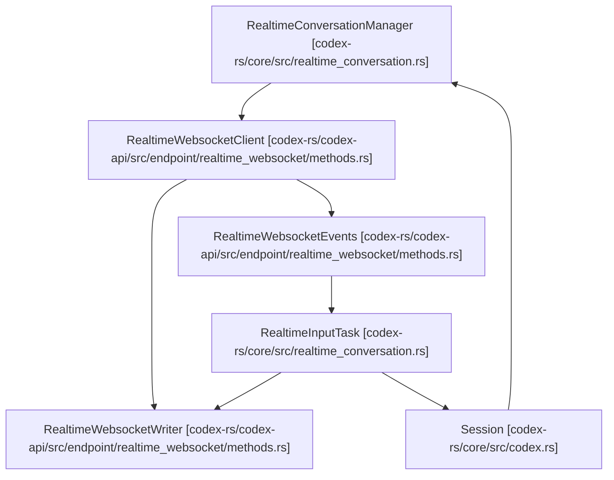

# 实时对话

相关源文件

-   [codex-rs/app-server/tests/suite/v2/realtime_conversation.rs](https://github.com/openai/codex/blob/d807d44a/codex-rs/app-server/tests/suite/v2/realtime_conversation.rs)
-   [codex-rs/codex-api/src/endpoint/realtime_websocket/methods.rs](https://github.com/openai/codex/blob/d807d44a/codex-rs/codex-api/src/endpoint/realtime_websocket/methods.rs)
-   [codex-rs/codex-api/src/endpoint/realtime_websocket/methods_common.rs](https://github.com/openai/codex/blob/d807d44a/codex-rs/codex-api/src/endpoint/realtime_websocket/methods_common.rs)
-   [codex-rs/codex-api/src/endpoint/realtime_websocket/methods_v1.rs](https://github.com/openai/codex/blob/d807d44a/codex-rs/codex-api/src/endpoint/realtime_websocket/methods_v1.rs)
-   [codex-rs/codex-api/src/endpoint/realtime_websocket/methods_v2.rs](https://github.com/openai/codex/blob/d807d44a/codex-rs/codex-api/src/endpoint/realtime_websocket/methods_v2.rs)
-   [codex-rs/codex-api/src/endpoint/realtime_websocket/mod.rs](https://github.com/openai/codex/blob/d807d44a/codex-rs/codex-api/src/endpoint/realtime_websocket/mod.rs)
-   [codex-rs/codex-api/src/endpoint/realtime_websocket/protocol.rs](https://github.com/openai/codex/blob/d807d44a/codex-rs/codex-api/src/endpoint/realtime_websocket/protocol.rs)
-   [codex-rs/codex-api/src/endpoint/realtime_websocket/protocol_common.rs](https://github.com/openai/codex/blob/d807d44a/codex-rs/codex-api/src/endpoint/realtime_websocket/protocol_common.rs)
-   [codex-rs/codex-api/src/endpoint/realtime_websocket/protocol_v1.rs](https://github.com/openai/codex/blob/d807d44a/codex-rs/codex-api/src/endpoint/realtime_websocket/protocol_v1.rs)
-   [codex-rs/codex-api/src/endpoint/realtime_websocket/protocol_v2.rs](https://github.com/openai/codex/blob/d807d44a/codex-rs/codex-api/src/endpoint/realtime_websocket/protocol_v2.rs)
-   [codex-rs/codex-api/src/lib.rs](https://github.com/openai/codex/blob/d807d44a/codex-rs/codex-api/src/lib.rs)
-   [codex-rs/codex-api/tests/realtime_websocket_e2e.rs](https://github.com/openai/codex/blob/d807d44a/codex-rs/codex-api/tests/realtime_websocket_e2e.rs)
-   [codex-rs/core/src/realtime_conversation.rs](https://github.com/openai/codex/blob/d807d44a/codex-rs/core/src/realtime_conversation.rs)
-   [codex-rs/core/tests/suite/realtime_conversation.rs](https://github.com/openai/codex/blob/d807d44a/codex-rs/core/tests/suite/realtime_conversation.rs)

实时对话系统提供了一个低延迟、双向的 WebSocket 接口，用于音频和文本交互。它允许 Codex 代理参与基于语音的会话，处理流式音频输入/输出、服务端语音活动检测 (VAD)，以及在实时语音模型与核心代理推理系统之间的自动接力。

## 系统架构

实时系统建立在生产者-消费者模型之上，使用异步通道将高速 WebSocket 传输与内部会话逻辑连接起来。

### 数据流与任务管理

`RealtimeConversationManager` 协调实时会话的生命周期。它管理两个主要的异步任务：

1.  **输入任务 (Input Task)**：处理 WebSocket 连接，从服务器读取事件并编写出站消息（音频帧、文本、会话更新）。
2.  **分发任务 (Fanout Task)**：将来自 WebSocket 的入站事件路由到内部订阅者，并将其转换为协议级事件。

### 实时组件交互

此图说明了 `RealtimeWebsocketClient` 如何将 `codex-core` 逻辑连接到外部 API 提供商。

**来源：** [codex-rs/core/src/realtime_conversation.rs71-138](https://github.com/openai/codex/blob/d807d44a/codex-rs/core/src/realtime_conversation.rs#L71-L138) [codex-rs/codex-api/src/endpoint/realtime_websocket/methods.rs12-15](https://github.com/openai/codex/blob/d807d44a/codex-rs/codex-api/src/endpoint/realtime_websocket/methods.rs#L12-L15)

## 协议版本

Codex 支持实时协议的多个版本，通过 `RealtimeEventParser` 枚举进行抽象 [codex-rs/codex-api/src/endpoint/realtime_websocket/protocol.rs12-15](https://github.com/openai/codex/blob/d807d44a/codex-rs/codex-api/src/endpoint/realtime_websocket/protocol.rs#L12-L15)

| 特性 | V1 (Quicksilver) | V2 (Realtime) |
| --- | --- | --- |
| **会话类型** | `Quicksilver` | `Realtime` |
| **语音** | `Fathom` | `Marin` |
| **轮次检测** | 无（客户端检测） | `ServerVad` |
| **工具** | 不支持 | 用于接力的 `codex` 工具 |
| **输出模态** | 音频 | 音频 |

**来源：** [codex-rs/codex-api/src/endpoint/realtime_websocket/methods_v1.rs41-63](https://github.com/openai/codex/blob/d807d44a/codex-rs/codex-api/src/endpoint/realtime_websocket/methods_v1.rs#L41-L63) [codex-rs/codex-api/src/endpoint/realtime_websocket/methods_v2.rs59-108](https://github.com/openai/codex/blob/d807d44a/codex-rs/codex-api/src/endpoint/realtime_websocket/methods_v2.rs#L59-L108)

## 会话生命周期

### 1. 初始化

当提交 `ConversationStartParams` 操作时，会话开始 [codex-rs/core/src/realtime_conversation.rs155-160](https://github.com/openai/codex/blob/d807d44a/codex-rs/core/src/realtime_conversation.rs#L155-L160)。系统使用 `build_realtime_startup_context` 构建“启动上下文”，将当前工作区状态和记忆注入模型的指令中 [codex-rs/core/src/realtime_conversation.rs10](https://github.com/openai/codex/blob/d807d44a/codex-rs/core/src/realtime_conversation.rs#L10-L10)

### 2. 连接处理

`RealtimeWebsocketClient` 建立 TLS 连接并执行握手。它利用 `WsStream` 泵任务来处理 WebSocket `Message` 类型的并发发送和接收 [codex-rs/codex-api/src/endpoint/realtime_websocket/methods.rs65-151](https://github.com/openai/codex/blob/d807d44a/codex-rs/codex-api/src/endpoint/realtime_websocket/methods.rs#L65-L151)

### 3. 音频流

音频作为 Base64 编码的 PCM 数据以 24kHz 传输 [codex-rs/codex-api/src/endpoint/realtime_websocket/methods_common.rs14](https://github.com/openai/codex/blob/d807d44a/codex-rs/codex-api/src/endpoint/realtime_websocket/methods_common.rs#L14-L14)

-   **入站**：通过 `input_audio_buffer.append` 发送 `RealtimeAudioFrame` 项 [codex-rs/codex-api/src/endpoint/realtime_websocket/protocol.rs35-36](https://github.com/openai/codex/blob/d807d44a/codex-rs/codex-api/src/endpoint/realtime_websocket/protocol.rs#L35-L36)
-   **出站**：服务器发出 `response.output_audio.delta`，解析为 `RealtimeEvent::AudioOut` [codex-rs/codex-api/src/endpoint/realtime_websocket/protocol_v2.rs24-26](https://github.com/openai/codex/blob/d807d44a/codex-rs/codex-api/src/endpoint/realtime_websocket/protocol_v2.rs#L24-L26)

### 4. 接力机制 (Handoff)

当实时模型决定将复杂任务委托给主 Codex 代理时，会发生接力。

-   在 V2 中，这是通过名为 `codex` 的工具调用实现的 [codex-rs/codex-api/src/endpoint/realtime_websocket/protocol_v2.rs14](https://github.com/openai/codex/blob/d807d44a/codex-rs/codex-api/src/endpoint/realtime_websocket/protocol_v2.rs#L14-L14)
-   当服务器发送带有 `codex` 的 `function_call` 的 `conversation.item.done` 时，系统生成 `RealtimeHandoffRequested` 事件 [codex-rs/codex-api/src/endpoint/realtime_websocket/protocol_v2.rs143-167](https://github.com/openai/codex/blob/d807d44a/codex-rs/codex-api/src/endpoint/realtime_websocket/protocol_v2.rs#L143-L167)

## 事件转换映射

下图将低级 WebSocket 消息映射到应用服务器和 TUI 使用的内部 `EventMsg`。

> **[Mermaid sequence]**
> *(图表结构无法解析)*

**来源：** [codex-rs/core/src/realtime_conversation.rs31-35](https://github.com/openai/codex/blob/d807d44a/codex-rs/core/src/realtime_conversation.rs#L31-L35) [codex-rs/codex-api/src/endpoint/realtime_websocket/protocol_v2.rs19-74](https://github.com/openai/codex/blob/d807d44a/codex-rs/codex-api/src/endpoint/realtime_websocket/protocol_v2.rs#L19-L74)

## 实现细节

### RealtimeInputTask

此任务是会话循环的核心。它使用 `tokio::select!` 来多路复用：

-   **用户文本**：`user_text_rx` 接收来自 UI 的文本并注入到对话中 [codex-rs/core/src/realtime_conversation.rs199](https://github.com/openai/codex/blob/d807d44a/codex-rs/core/src/realtime_conversation.rs#L199-L199)
-   **音频数据**：`audio_rx` 接收用于缓冲区的原始音频帧 [codex-rs/core/src/realtime_conversation.rs201](https://github.com/openai/codex/blob/d807d44a/codex-rs/core/src/realtime_conversation.rs#L201-L201)
-   **服务器事件**：`events` 流提供从 WebSocket 解析的 `RealtimeEvent` 对象 [codex-rs/core/src/realtime_conversation.rs198](https://github.com/openai/codex/blob/d807d44a/codex-rs/core/src/realtime_conversation.rs#L198-L198)

### 错误处理

如果连接遇到冲突（例如，在响应已经处于活动状态时尝试发送音频），管理器会检测到 `ACTIVE_RESPONSE_CONFLICT_ERROR_PREFIX` 并可能触发取消或用户通知 [codex-rs/core/src/realtime_conversation.rs56-57](https://github.com/openai/codex/blob/d807d44a/codex-rs/core/src/realtime_conversation.rs#L56-L57)

**来源：** [codex-rs/core/src/realtime_conversation.rs196-216](https://github.com/openai/codex/blob/d807d44a/codex-rs/core/src/realtime_conversation.rs#L196-L216) [codex-rs/codex-api/src/endpoint/realtime_websocket/methods.rs68-149](https://github.com/openai/codex/blob/d807d44a/codex-rs/codex-api/src/endpoint/realtime_websocket/methods.rs#L68-L149)
