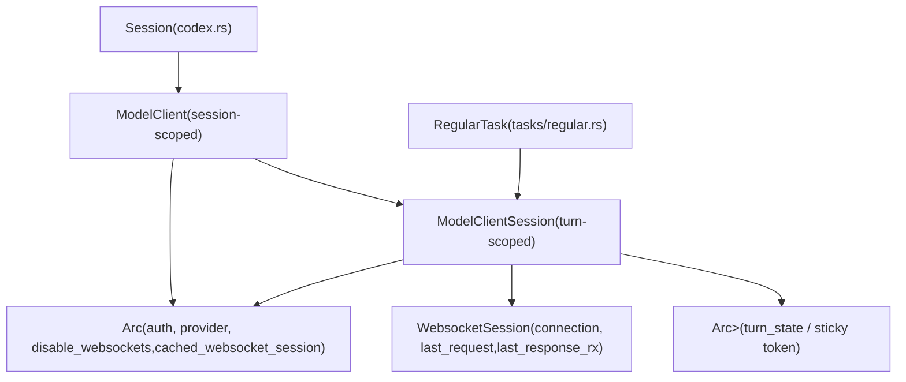
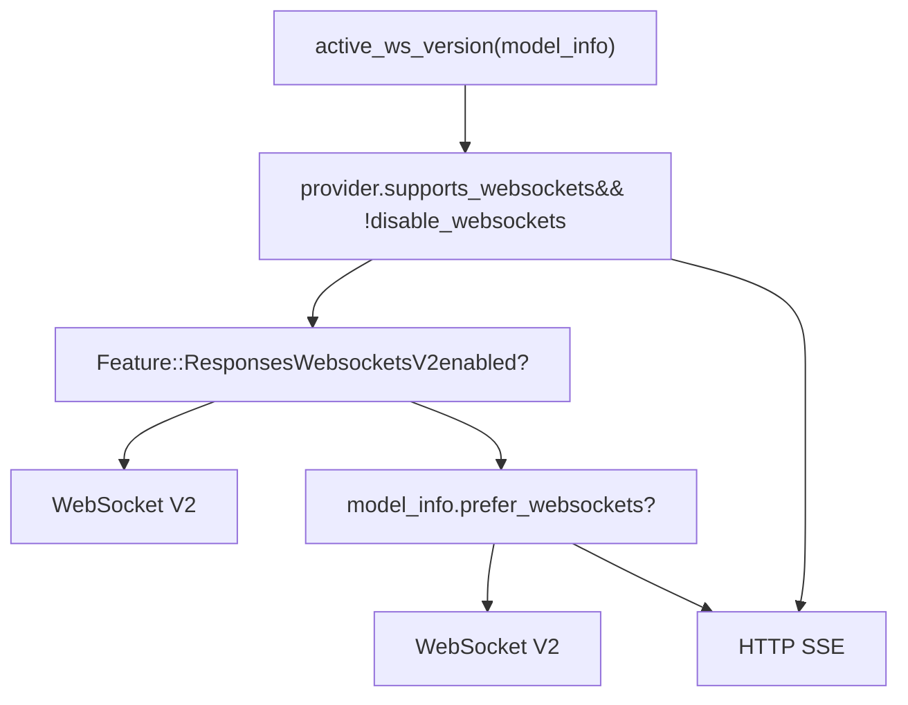

# 模型客户端与 API 通信

相关源文件

-   [codex-rs/codex-api/README.md](https://github.com/openai/codex/blob/d807d44a/codex-rs/codex-api/README.md?plain=1)
-   [codex-rs/codex-api/src/auth.rs](https://github.com/openai/codex/blob/d807d44a/codex-rs/codex-api/src/auth.rs)
-   [codex-rs/codex-api/src/common.rs](https://github.com/openai/codex/blob/d807d44a/codex-rs/codex-api/src/common.rs)
-   [codex-rs/codex-api/src/endpoint/compact.rs](https://github.com/openai/codex/blob/d807d44a/codex-rs/codex-api/src/endpoint/compact.rs)
-   [codex-rs/codex-api/src/endpoint/memories.rs](https://github.com/openai/codex/blob/d807d44a/codex-rs/codex-api/src/endpoint/memories.rs)
-   [codex-rs/codex-api/src/endpoint/mod.rs](https://github.com/openai/codex/blob/d807d44a/codex-rs/codex-api/src/endpoint/mod.rs)
-   [codex-rs/codex-api/src/endpoint/responses.rs](https://github.com/openai/codex/blob/d807d44a/codex-rs/codex-api/src/endpoint/responses.rs)
-   [codex-rs/codex-api/src/endpoint/responses\_websocket.rs](https://github.com/openai/codex/blob/d807d44a/codex-rs/codex-api/src/endpoint/responses_websocket.rs)
-   [codex-rs/codex-api/src/endpoint/session.rs](https://github.com/openai/codex/blob/d807d44a/codex-rs/codex-api/src/endpoint/session.rs)
-   [codex-rs/codex-api/src/error.rs](https://github.com/openai/codex/blob/d807d44a/codex-rs/codex-api/src/error.rs)
-   [codex-rs/codex-api/src/provider.rs](https://github.com/openai/codex/blob/d807d44a/codex-rs/codex-api/src/provider.rs)
-   [codex-rs/codex-api/src/rate\_limits.rs](https://github.com/openai/codex/blob/d807d44a/codex-rs/codex-api/src/rate_limits.rs)
-   [codex-rs/codex-api/src/requests/headers.rs](https://github.com/openai/codex/blob/d807d44a/codex-rs/codex-api/src/requests/headers.rs)
-   [codex-rs/codex-api/src/requests/mod.rs](https://github.com/openai/codex/blob/d807d44a/codex-rs/codex-api/src/requests/mod.rs)
-   [codex-rs/codex-api/src/requests/responses.rs](https://github.com/openai/codex/blob/d807d44a/codex-rs/codex-api/src/requests/responses.rs)
-   [codex-rs/codex-api/src/sse/responses.rs](https://github.com/openai/codex/blob/d807d44a/codex-rs/codex-api/src/sse/responses.rs)
-   [codex-rs/codex-api/src/telemetry.rs](https://github.com/openai/codex/blob/d807d44a/codex-rs/codex-api/src/telemetry.rs)
-   [codex-rs/codex-api/tests/clients.rs](https://github.com/openai/codex/blob/d807d44a/codex-rs/codex-api/tests/clients.rs)
-   [codex-rs/codex-api/tests/sse\_end\_to\_end.rs](https://github.com/openai/codex/blob/d807d44a/codex-rs/codex-api/tests/sse_end_to_end.rs)
-   [codex-rs/codex-client/Cargo.toml](https://github.com/openai/codex/blob/d807d44a/codex-rs/codex-client/Cargo.toml)
-   [codex-rs/codex-client/src/default\_client.rs](https://github.com/openai/codex/blob/d807d44a/codex-rs/codex-client/src/default_client.rs)
-   [codex-rs/codex-client/src/error.rs](https://github.com/openai/codex/blob/d807d44a/codex-rs/codex-client/src/error.rs)
-   [codex-rs/codex-client/src/lib.rs](https://github.com/openai/codex/blob/d807d44a/codex-rs/codex-client/src/lib.rs)
-   [codex-rs/codex-client/src/transport.rs](https://github.com/openai/codex/blob/d807d44a/codex-rs/codex-client/src/transport.rs)
-   [codex-rs/core/src/api\_bridge.rs](https://github.com/openai/codex/blob/d807d44a/codex-rs/core/src/api_bridge.rs)
-   [codex-rs/core/src/api\_bridge\_tests.rs](https://github.com/openai/codex/blob/d807d44a/codex-rs/core/src/api_bridge_tests.rs)
-   [codex-rs/core/src/client.rs](https://github.com/openai/codex/blob/d807d44a/codex-rs/core/src/client.rs)
-   [codex-rs/core/src/client\_common.rs](https://github.com/openai/codex/blob/d807d44a/codex-rs/core/src/client_common.rs)
-   [codex-rs/core/src/client\_tests.rs](https://github.com/openai/codex/blob/d807d44a/codex-rs/core/src/client_tests.rs)
-   [codex-rs/core/src/error.rs](https://github.com/openai/codex/blob/d807d44a/codex-rs/core/src/error.rs)
-   [codex-rs/core/src/error\_tests.rs](https://github.com/openai/codex/blob/d807d44a/codex-rs/core/src/error_tests.rs)
-   [codex-rs/core/src/memory\_trace.rs](https://github.com/openai/codex/blob/d807d44a/codex-rs/core/src/memory_trace.rs)
-   [codex-rs/core/tests/common/responses.rs](https://github.com/openai/codex/blob/d807d44a/codex-rs/core/tests/common/responses.rs)
-   [codex-rs/core/tests/responses\_headers.rs](https://github.com/openai/codex/blob/d807d44a/codex-rs/core/tests/responses_headers.rs)
-   [codex-rs/core/tests/suite/agent\_websocket.rs](https://github.com/openai/codex/blob/d807d44a/codex-rs/core/tests/suite/agent_websocket.rs)
-   [codex-rs/core/tests/suite/client.rs](https://github.com/openai/codex/blob/d807d44a/codex-rs/core/tests/suite/client.rs)
-   [codex-rs/core/tests/suite/client\_websockets.rs](https://github.com/openai/codex/blob/d807d44a/codex-rs/core/tests/suite/client_websockets.rs)
-   [codex-rs/core/tests/suite/prompt\_caching.rs](https://github.com/openai/codex/blob/d807d44a/codex-rs/core/tests/suite/prompt_caching.rs)
-   [codex-rs/core/tests/suite/turn\_state.rs](https://github.com/openai/codex/blob/d807d44a/codex-rs/core/tests/suite/turn_state.rs)
-   [codex-rs/core/tests/suite/websocket\_fallback.rs](https://github.com/openai/codex/blob/d807d44a/codex-rs/core/tests/suite/websocket_fallback.rs)

本页说明 `codex-core` 如何构建并发送请求到模型提供方 API。内容涵盖 `ModelClient`（会话级）与 `ModelClientSession`（轮次级）、WebSocket 与 SSE 的传输选择、跨轮次连接复用、粘性路由 token、prewarm 机制，以及 WebSocket 失败后的 HTTP 回退。

关于发送给 API 的 prompt 如何由对话历史组装，请参阅 [Turn Execution and Prompt Construction (3.3)](https://github.com/openai/codex/blob/d807d44a/Turn Execution and Prompt Construction (3.3)) 关于流式响应事件如何转换为 `EventMsg` 变体，请参阅 [Event Processing and State Management (3.4)](https://github.com/openai/codex/blob/d807d44a/Event Processing and State Management (3.4))

---

## 关键类型

| Type | Scope | File | Role |
| --- | --- | --- | --- |
| `ModelClient` | Session | `core/src/client.rs` | 共享配置、认证、WS 回退状态 |
| `ModelClientState` | Session (inner) | `core/src/client.rs` | `ModelClient` 背后由 `Arc` 共享的数据 |
| `ModelClientSession` | Turn | `core/src/client.rs` | WS 连接、sticky token、增量追加 |
| `WebsocketSession` | Turn (inner) | `core/src/client.rs` | 活跃 WS 连接 + 最近一次请求/响应 |
| `Prompt` | Turn | `core/src/client_common.rs` | 每轮组装的 API 请求载荷 |
| `ResponsesApiRequest` | Wire | `codex-api/src/common.rs` | 发送给 Responses API 的 JSON 请求体 |
| `ResponseEvent` | Stream item | `codex-api/src/common.rs` | 从 SSE/WS 流中解析出的事件 |
| `ResponseStream` | Stream | `core/src/client_common.rs` | `ResponseEvent` 的 `mpsc` 通道封装 |

Sources: [codex-rs/core/src/client.rs132-220](https://github.com/openai/codex/blob/d807d44a/codex-rs/core/src/client.rs#L132-L220) [codex-rs/core/src/client\_common.rs26-65](https://github.com/openai/codex/blob/d807d44a/codex-rs/core/src/client_common.rs#L26-L65) [codex-rs/codex-api/src/common.rs66-95](https://github.com/openai/codex/blob/d807d44a/codex-rs/codex-api/src/common.rs#L66-L95)

---

## 所有权与生命周期图

**图示：类型生命周期与所有权关系**


Sources: [codex-rs/core/src/client.rs132-270](https://github.com/openai/codex/blob/d807d44a/codex-rs/core/src/client.rs#L132-L270) [codex-rs/core/src/client.rs499-505](https://github.com/openai/codex/blob/d807d44a/codex-rs/core/src/client.rs#L499-L505)

---

## `ModelClient`：会话级状态

`ModelClient` 在每个 Codex 会话中只创建一次，并且克隆成本很低（其内部封装了 `Arc<ModelClientState>`）。它持有必须在所有轮次间保持稳定的配置：

-   **`auth_manager`**：`Option<Arc<AuthManager>>` — 每次请求通过 `current_client_setup()` 解析 [codex-rs/core/src/client.rs134](https://github.com/openai/codex/blob/d807d44a/codex-rs/core/src/client.rs#L134-L134)
-   **`conversation_id`**：`ThreadId` — 写入 `session_id` 与 `x-conversation-id` 请求头 [codex-rs/core/src/client.rs135](https://github.com/openai/codex/blob/d807d44a/codex-rs/core/src/client.rs#L135-L135)
-   **`provider`**：`ModelProviderInfo` — 基础 URL、线协议 API 类型、重试上限 [codex-rs/core/src/client.rs136](https://github.com/openai/codex/blob/d807d44a/codex-rs/core/src/client.rs#L136-L136)
-   **`session_source`**：`SessionSource` — 用于为子代理设置 `x-openai-subagent` 请求头 [codex-rs/core/src/client.rs138](https://github.com/openai/codex/blob/d807d44a/codex-rs/core/src/client.rs#L138-L138)
-   **`disable_websockets`**：`AtomicBool` — 一旦置位，后续所有轮次改走 HTTP SSE [codex-rs/core/src/client.rs143](https://github.com/openai/codex/blob/d807d44a/codex-rs/core/src/client.rs#L143-L143)
-   **`cached_websocket_session`**：`StdMutex<WebsocketSession>` — 大小为 1 的连接池 [codex-rs/core/src/client.rs144](https://github.com/openai/codex/blob/d807d44a/codex-rs/core/src/client.rs#L144-L144)

`ModelClient::new()` 显式接收上述全部参数 [codex-rs/core/src/client.rs222-258](https://github.com/openai/codex/blob/d807d44a/codex-rs/core/src/client.rs#L222-L258) `ModelClient::new_session()` 则为每个轮次创建 `ModelClientSession`，并在可用时转移缓存的 WS 会话 [codex-rs/core/src/client.rs260-288](https://github.com/openai/codex/blob/d807d44a/codex-rs/core/src/client.rs#L260-L288)

Sources: [codex-rs/core/src/client.rs132-288](https://github.com/openai/codex/blob/d807d44a/codex-rs/core/src/client.rs#L132-L288)

---

## `ModelClientSession`：轮次级状态

`ModelClientSession` 在每轮开始时创建，在轮次结束时销毁。其 `Drop` 实现会将 `WebsocketSession` 归还给 `ModelClientState::cached_websocket_session`，使活跃连接可被下一轮复用 [codex-rs/core/src/client.rs499-505](https://github.com/openai/codex/blob/d807d44a/codex-rs/core/src/client.rs#L499-L505)

**它持有的每轮状态：**

| Field | Type | Purpose |
| --- | --- | --- |
| `client` | `ModelClient` | 会话级状态的反向引用 |
| `websocket_session` | `WebsocketSession` | 活跃 WS 连接和增量追加状态 |
| `turn_state` | `Arc<OnceLock<String>>` | 粘性路由 token（从服务端响应头设置一次） |

内部的 `WebsocketSession` 结构体包含：

-   `connection: Option<ApiWebSocketConnection>` — 活跃 WS 连接 [codex-rs/core/src/client.rs192](https://github.com/openai/codex/blob/d807d44a/codex-rs/core/src/client.rs#L192-L192)
-   `last_request: Option<ResponsesApiRequest>` — 最近一次发送的完整请求（用于 append 差分） [codex-rs/core/src/client.rs193](https://github.com/openai/codex/blob/d807d44a/codex-rs/core/src/client.rs#L193-L193)
-   `last_response_rx: Option<oneshot::Receiver<LastResponse>>` — 在流结束后接收 `response_id` + items 的通道 [codex-rs/core/src/client.rs194](https://github.com/openai/codex/blob/d807d44a/codex-rs/core/src/client.rs#L194-L194)

Sources: [codex-rs/core/src/client.rs191-220](https://github.com/openai/codex/blob/d807d44a/codex-rs/core/src/client.rs#L191-L220) [codex-rs/core/src/client.rs499-505](https://github.com/openai/codex/blob/d807d44a/codex-rs/core/src/client.rs#L499-L505)

---

## 传输选择

某轮使用哪种传输，由 `ModelClient::active_ws_version()` 决定 [codex-rs/core/src/client.rs401-413](https://github.com/openai/codex/blob/d807d44a/codex-rs/core/src/client.rs#L401-L413)：

```
if provider.supports_websockets == false:
    → HTTP SSE

if disable_websockets == true (session-level fallback):
    → HTTP SSE

if Feature::ResponsesWebsocketsV2 is enabled:
    → WebSocket V2

elif model_info.prefer_websockets == true:
    → WebSocket V2 (implicit)

else:
    → HTTP SSE
```
**图示：传输选择逻辑**


Sources: [codex-rs/core/src/client.rs401-413](https://github.com/openai/codex/blob/d807d44a/codex-rs/core/src/client.rs#L401-L413) [codex-rs/core/src/client.rs117-130](https://github.com/openai/codex/blob/d807d44a/codex-rs/core/src/client.rs#L117-L130)

---

## WebSocket 连接生命周期

**图示：跨轮次的 WebSocket 连接生命周期**

> **[Mermaid sequence]**
> *(图表结构无法解析)*

Sources: [codex-rs/core/src/client.rs260-290](https://github.com/openai/codex/blob/d807d44a/codex-rs/core/src/client.rs#L260-L290) [codex-rs/core/src/client.rs499-505](https://github.com/openai/codex/blob/d807d44a/codex-rs/core/src/client.rs#L499-L505) [codex-rs/core/src/client.rs735-777](https://github.com/openai/codex/blob/d807d44a/codex-rs/core/src/client.rs#L735-L777)

---

## 粘性路由：`x-codex-turn-state`

`ModelClientSession` 上的 `turn_state` 字段类型是 `Arc<OnceLock<String>>` [codex-rs/core/src/client.rs205](https://github.com/openai/codex/blob/d807d44a/codex-rs/core/src/client.rs#L205-L205)。服务端会在某轮首次响应的 `x-codex-turn-state` 响应头里返回粘性路由 token。客户端行为如下：

1.  首次收到时将值写入 `OnceLock`（后续写入会被忽略） [codex-rs/codex-api/src/sse/responses.rs78-85](https://github.com/openai/codex/blob/d807d44a/codex-rs/codex-api/src/sse/responses.rs#L78-L85)
2.  在同一轮后续请求中读取该值，并回传到 `x-codex-turn-state`（包括重试、工具输出 append） [codex-rs/core/src/client.rs462-497](https://github.com/openai/codex/blob/d807d44a/codex-rs/core/src/client.rs#L462-L497)
3.  不会跨轮携带该 token —— 每个 `ModelClientSession` 都以全新的 `OnceLock` 开始。

相关请求头常量：

| Constant | Value | File |
| --- | --- | --- |
| `X_CODEX_TURN_STATE_HEADER` | `"x-codex-turn-state"` | `core/src/client.rs:116` |
| `X_CODEX_TURN_METADATA_HEADER` | `"x-codex-turn-metadata"` | `core/src/client.rs:117` |
| `OPENAI_BETA_HEADER` | `"OpenAI-Beta"` | `core/src/client.rs:115` |
| `RESPONSES_WEBSOCKETS_V2_BETA_HEADER_VALUE` | `"responses_websockets=2026-02-06"` | `core/src/client.rs:120` |

Sources: [codex-rs/core/src/client.rs103-120](https://github.com/openai/codex/blob/d807d44a/codex-rs/core/src/client.rs#L103-L120) [codex-rs/codex-api/src/sse/responses.rs73-85](https://github.com/openai/codex/blob/d807d44a/codex-rs/codex-api/src/sse/responses.rs#L73-L85)

---

## 请求构建

`ModelClientSession::build_responses_request()` 基于 `Prompt` 和每轮参数构建 `ResponsesApiRequest` [codex-rs/core/src/client.rs517-582](https://github.com/openai/codex/blob/d807d44a/codex-rs/core/src/client.rs#L517-L582)。关键字段如下：

| `ResponsesApiRequest` field | Source |
| --- | --- |
| `model` | `model_info.slug` |
| `instructions` | `prompt.base_instructions.text` |
| `input` | `prompt.get_formatted_input()`（可能会重序列化 shell 输出） |
| `tools` | `create_tools_json_for_responses_api(&prompt.tools)` |
| `reasoning` | 若模型支持，则为 `Reasoning { effort, summary }` |
| `service_tier` | `ServiceTier::Fast` 时为 `"priority"`，否则省略 |
| `prompt_cache_key` | `conversation_id.to_string()` |
| `text` | verbosity + 可选 JSON 输出 schema |

`Prompt` 结构体的 `get_formatted_input()` 会把 Freeform `apply_patch` 工具的 `FunctionCallOutput` 内容重写为结构化纯文本格式 [codex-rs/core/src/client\_common.rs48-64](https://github.com/openai/codex/blob/d807d44a/codex-rs/core/src/client_common.rs#L48-L64)

Sources: [codex-rs/core/src/client.rs517-582](https://github.com/openai/codex/blob/d807d44a/codex-rs/core/src/client.rs#L517-L582) [codex-rs/core/src/client\_common.rs48-64](https://github.com/openai/codex/blob/d807d44a/codex-rs/core/src/client_common.rs#L48-L64) [codex-rs/codex-api/src/common.rs154-171](https://github.com/openai/codex/blob/d807d44a/codex-rs/codex-api/src/common.rs#L154-L171)

---

## Prewarm 机制

Codex 支持对 WebSocket 连接进行 prewarm 以降低延迟：

### 连接预热

`ModelClientSession::preconnect_websocket()` 只建立 WebSocket 握手，不发送请求体 [codex-rs/core/src/client.rs735-777](https://github.com/openai/codex/blob/d807d44a/codex-rs/core/src/client.rs#L735-L777)。随后该活跃连接可直接用于后续 `stream()` 调用。

### 请求预热（仅 V2）

`ModelClientSession::prewarm_websocket()` 会发送带 `generate: false` 的 `response.create` [codex-rs/core/src/client.rs700-734](https://github.com/openai/codex/blob/d807d44a/codex-rs/core/src/client.rs#L700-L734)。服务端将预热其缓存并返回 `response_id`。当实际轮次请求到来时，请求会通过 `previous_response_id` 指向预热响应，并仅发送增量 `input` 项。

Sources: [codex-rs/core/src/client.rs700-777](https://github.com/openai/codex/blob/d807d44a/codex-rs/core/src/client.rs#L700-L777)

---

## 增量追加（`previous_response_id`）

在单个轮次内，工具调用结果会作为额外输入项回传给模型。`ModelClientSession::prepare_websocket_request()` 会决定发送完整 `response.create` 还是增量更新 [codex-rs/core/src/client.rs658-698](https://github.com/openai/codex/blob/d807d44a/codex-rs/core/src/client.rs#L658-L698)

-   **V2（带 `previous_response_id` 的 `response.create`）**：将 `previous_response_id` 设为上一条 `response_id`，并仅发送 `input` 中的增量项 [codex-rs/core/src/client.rs693-697](https://github.com/openai/codex/blob/d807d44a/codex-rs/core/src/client.rs#L693-L697)

`get_incremental_items()` 通过以下方式计算差分：检查两次请求的非输入字段是否一致，且新请求的 `input` 是否是旧 `input` 的严格扩展 [codex-rs/core/src/client.rs610-646](https://github.com/openai/codex/blob/d807d44a/codex-rs/core/src/client.rs#L610-L646)

Sources: [codex-rs/core/src/client.rs610-698](https://github.com/openai/codex/blob/d807d44a/codex-rs/core/src/client.rs#L610-L698)

---

## HTTP SSE 回退

WebSocket 回退是会话级且永久生效的。`ModelClientSession::activate_http_fallback()` 会在共享 `ModelClientState` 上调用 `disable_websockets.swap(true, Ordering::Relaxed)` [codex-rs/core/src/client.rs508-515](https://github.com/openai/codex/blob/d807d44a/codex-rs/core/src/client.rs#L508-L515)。之后所有 `new_session()` 调用在该会话剩余生命周期内都会切换到 HTTP SSE。

触发回退的场景：

-   WebSocket 握手失败或返回错误。
-   流式重试耗尽。

Sources: [codex-rs/core/src/client.rs508-515](https://github.com/openai/codex/blob/d807d44a/codex-rs/core/src/client.rs#L508-L515) [codex-rs/core/tests/suite/websocket\_fallback.rs27-121](https://github.com/openai/codex/blob/d807d44a/codex-rs/core/tests/suite/websocket_fallback.rs#L27-L121)

---

## Unary API 调用

`ModelClient` 还暴露了供后台任务使用的 unary（非流式）调用：

### `compact_conversation_history()`

由压缩子系统调用。通过 HTTP（`ReqwestTransport`）使用 `ApiCompactClient`，向 `/v1/compact` 端点发送 `CompactionInput` [codex-rs/core/src/client.rs289-366](https://github.com/openai/codex/blob/d807d44a/codex-rs/core/src/client.rs#L289-L366)

### `summarize_memories()`

由 memory 流水线调用。使用 `ApiMemoriesClient`，向 `/v1/memories/trace_summarize` 发送 `MemorySummarizeInput` [codex-rs/core/src/client.rs368-393](https://github.com/openai/codex/blob/d807d44a/codex-rs/core/src/client.rs#L368-L393)

Sources: [codex-rs/core/src/client.rs289-393](https://github.com/openai/codex/blob/d807d44a/codex-rs/core/src/client.rs#L289-L393)

---

## 请求头汇总

**图示：按请求类型发送的请求头**

```mermaid
flowchart TD
    H9["x-codex-turn-state(sticky token)"]
    H10["x-codex-turn-metadata"]
    H11["x-codex-sandbox(if applicable)"]
    H5["OpenAI-Beta(responses_websockets=2026-02-06)"]
    H6["x-codex-turn-state(sticky token)"]
    H7["x-codex-turn-metadata"]
    H8["x-responsesapi-include-timing-metrics"]
    H1["session_id(conversation_id)"]
    H2["authorization(Bearer token)"]
    H3["x-conversation-id"]
    H4["x-openai-subagent(from session_source)"]
```


Sources: [codex-rs/core/src/client.rs462-497](https://github.com/openai/codex/blob/d807d44a/codex-rs/core/src/client.rs#L462-L497) [codex-rs/core/src/client.rs584-609](https://github.com/openai/codex/blob/d807d44a/codex-rs/core/src/client.rs#L584-L609) [codex-rs/core/tests/responses\_headers.rs27-136](https://github.com/openai/codex/blob/d807d44a/codex-rs/core/tests/responses_headers.rs#L27-L136)
