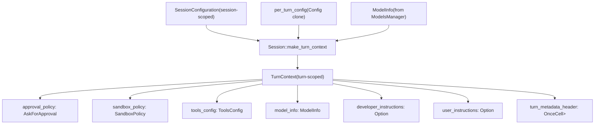
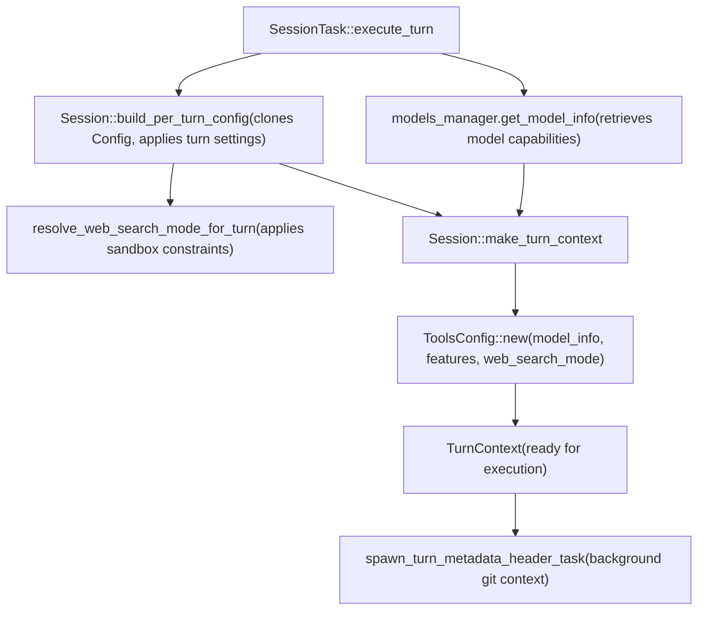
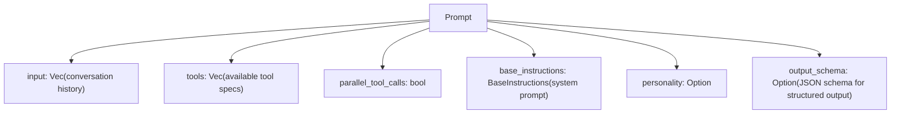
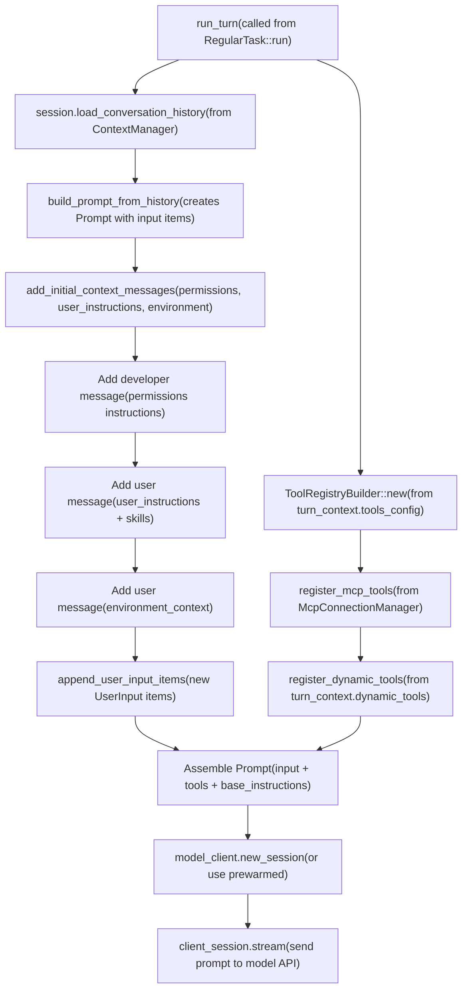
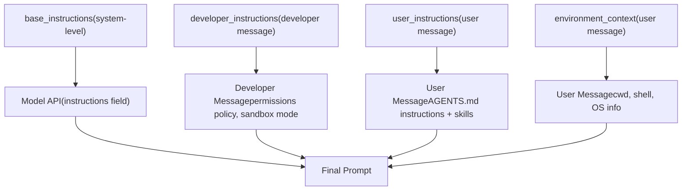
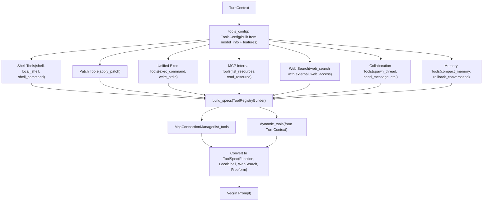
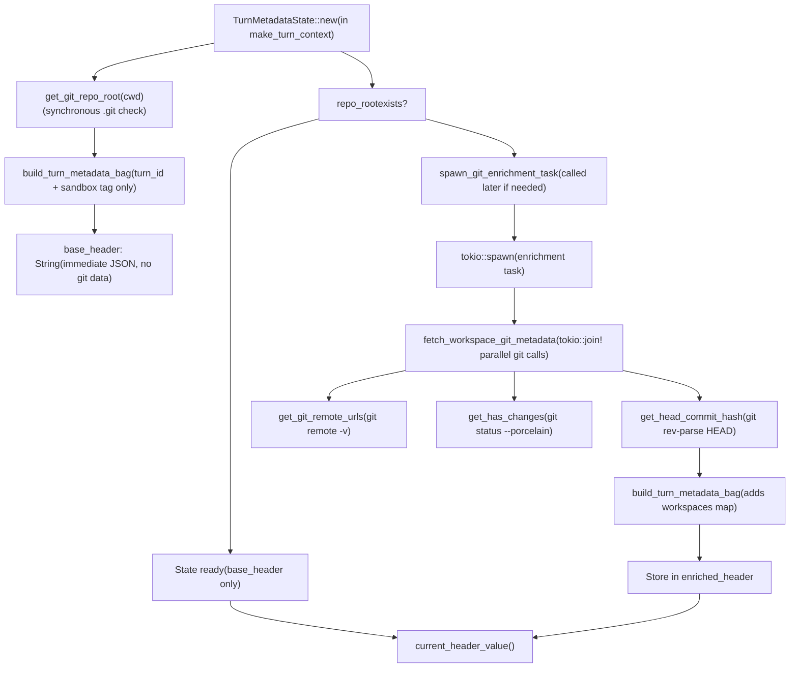

# 轮次执行与 Prompt 构建

相关源文件

-   [.npmrc](https://github.com/openai/codex/blob/d807d44a/.npmrc)
-   [.prettierignore](https://github.com/openai/codex/blob/d807d44a/.prettierignore)
-   [codex-rs/apply-patch/apply\_patch\_tool\_instructions.md](https://github.com/openai/codex/blob/d807d44a/codex-rs/apply-patch/apply_patch_tool_instructions.md?plain=1)
-   [codex-rs/codex-api/src/common.rs](https://github.com/openai/codex/blob/d807d44a/codex-rs/codex-api/src/common.rs)
-   [codex-rs/codex-api/src/endpoint/responses\_websocket.rs](https://github.com/openai/codex/blob/d807d44a/codex-rs/codex-api/src/endpoint/responses_websocket.rs)
-   [codex-rs/codex-api/src/sse/responses.rs](https://github.com/openai/codex/blob/d807d44a/codex-rs/codex-api/src/sse/responses.rs)
-   [codex-rs/core/prompt.md](https://github.com/openai/codex/blob/d807d44a/codex-rs/core/prompt.md?plain=1)
-   [codex-rs/core/src/client.rs](https://github.com/openai/codex/blob/d807d44a/codex-rs/core/src/client.rs)
-   [codex-rs/core/src/client\_common.rs](https://github.com/openai/codex/blob/d807d44a/codex-rs/core/src/client_common.rs)
-   [codex-rs/core/tests/common/responses.rs](https://github.com/openai/codex/blob/d807d44a/codex-rs/core/tests/common/responses.rs)
-   [codex-rs/core/tests/responses\_headers.rs](https://github.com/openai/codex/blob/d807d44a/codex-rs/core/tests/responses_headers.rs)
-   [codex-rs/core/tests/suite/agent\_websocket.rs](https://github.com/openai/codex/blob/d807d44a/codex-rs/core/tests/suite/agent_websocket.rs)
-   [codex-rs/core/tests/suite/client.rs](https://github.com/openai/codex/blob/d807d44a/codex-rs/core/tests/suite/client.rs)
-   [codex-rs/core/tests/suite/client\_websockets.rs](https://github.com/openai/codex/blob/d807d44a/codex-rs/core/tests/suite/client_websockets.rs)
-   [codex-rs/core/tests/suite/prompt\_caching.rs](https://github.com/openai/codex/blob/d807d44a/codex-rs/core/tests/suite/prompt_caching.rs)
-   [codex-rs/core/tests/suite/turn\_state.rs](https://github.com/openai/codex/blob/d807d44a/codex-rs/core/tests/suite/turn_state.rs)
-   [codex-rs/core/tests/suite/websocket\_fallback.rs](https://github.com/openai/codex/blob/d807d44a/codex-rs/core/tests/suite/websocket_fallback.rs)

本文档说明 Codex 如何构建并执行单个轮次。内容涵盖 `TurnContext` 结构、prompt 组装（历史 + 工具 + 指令）以及发往模型 API 的请求构建。关于整体会话生命周期与线程管理，请参阅 [3.1 Codex Interface and Session Lifecycle](https://github.com/openai/codex/blob/d807d44a/3.1 Codex Interface and Session Lifecycle) 关于模型客户端如何发送请求和处理响应，请参阅 [3.2 Model Client and API Communication](https://github.com/openai/codex/blob/d807d44a/3.2 Model Client and API Communication) 关于响应事件如何处理并更新状态，请参阅 [3.4 Event Processing and State Management](https://github.com/openai/codex/blob/d807d44a/3.4 Event Processing and State Management)

---

## TurnContext：每轮配置

每个轮次都会创建一个 `TurnContext`，其中保存该轮所需的全部配置、策略和元数据。这支持按轮覆盖设置，并确保轮次范围的配置不会跨轮泄露。

**结构与字段**

`TurnContext` 结构体包含：

| Field Category | Key Fields | Purpose |
| --- | --- | --- |
| **Identity** | `sub_id`, `session_source` | 唯一提交 ID、会话来源（CLI/TUI/VS Code） |
| **Model Selection** | `model_info`, `provider`, `reasoning_effort`, `reasoning_summary` | 模型能力、提供方配置、推理控制 |
| **Policies** | `approval_policy`, `sandbox_policy`, `windows_sandbox_level` | 执行审批要求、沙箱策略 |
| **Instructions** | `base_instructions`, `developer_instructions`, `user_instructions`, `compact_prompt`, `personality` | 系统指令与人格配置 |
| **Environment** | `cwd`, `shell_environment_policy` | 工作目录、shell 环境处理方式 |
| **Tools** | `tools_config`, `dynamic_tools` | 可用工具注册表、自定义工具规范 |
| **Metadata** | `turn_metadata_header`, `otel_manager` | Git 上下文、遥测追踪 |
| **State** | `tool_call_gate`, `truncation_policy`, `final_output_json_schema` | 工具执行就绪状态、截断规则、输出 schema |

**TurnContext 数据流**

**Sources:** [codex-rs/core/src/codex.rs506-592](https://github.com/openai/codex/blob/d807d44a/codex-rs/core/src/codex.rs#L506-L592) [codex-rs/core/src/codex.rs785-844](https://github.com/openai/codex/blob/d807d44a/codex-rs/core/src/codex.rs#L785-L844)

---

## TurnContext 构建

`Session::make_turn_context` 函数通过组合会话配置与每轮设置来创建 `TurnContext`。

**构建流程**

**关键步骤：**

1.  **每轮配置克隆：**`Session::build_per_turn_config` 创建 `Config` 副本，并应用该轮的推理强度、推理摘要、人格与 web search 模式（同时受沙箱约束）。
2.  **工具配置：**`ToolsConfig::new` 基于模型能力、启用特性和 web search 模式决定可用工具，并将该注册表传给模型。
3.  **元数据预热：**`spawn_turn_metadata_header_task` 在后台计算 Git 上下文（提交哈希、远端 URL），用于 `x-codex-turn-metadata` 请求头。该流程为 best-effort，超时为 250ms。

**Sources:** [codex-rs/core/src/codex.rs729-755](https://github.com/openai/codex/blob/d807d44a/codex-rs/core/src/codex.rs#L729-L755) [codex-rs/core/src/codex.rs785-844](https://github.com/openai/codex/blob/d807d44a/codex-rs/core/src/codex.rs#L785-L844) [codex-rs/core/src/codex.rs584-591](https://github.com/openai/codex/blob/d807d44a/codex-rs/core/src/codex.rs#L584-L591)

---

## Prompt 结构

`Prompt` 结构体表示单次模型轮次的完整 API 请求载荷。

**Prompt 字段**

`input` 向量按时间顺序包含完整对话历史。各项会被规范化；例如当存在 `apply_patch` 工具时，shell 输出会从 JSON 重新序列化为结构化文本，以提升模型表现 [codex-rs/core/src/client\_common.rs48-64](https://github.com/openai/codex/blob/d807d44a/codex-rs/core/src/client_common.rs#L48-L64)

| Item Type | Purpose | Example |
| --- | --- | --- |
| **Developer message** | 权限与策略指令 | 沙箱模式说明、审批策略 |
| **User message** | 来自 `AGENTS.md` 或配置的用户指令 | 自定义指令、技能定义 |
| **User message** | 环境上下文 | CWD、shell 类型、OS 版本 |
| **User message** | 初始用户输入 | 用户请求文本 |
| **Assistant message** | 历史助手响应 | 文本输出、推理、函数调用 |
| **Function call output** | 工具执行结果 | shell 命令输出、patch 结果 |

**Sources:** [codex-rs/core/src/client\_common.rs26-45](https://github.com/openai/codex/blob/d807d44a/codex-rs/core/src/client_common.rs#L26-L45) [codex-rs/core/src/client\_common.rs67-108](https://github.com/openai/codex/blob/d807d44a/codex-rs/core/src/client_common.rs#L67-L108)

---

## Prompt 构建流程

Prompt 构建发生在 `run_turn` 函数内部，该函数由 `RegularTask::run` 等任务实现调用。流程会把历史、工具和指令组装成一个 `Prompt`。

**高层流程**

**Sources:** [codex-rs/core/src/codex.rs1000-1500](https://github.com/openai/codex/blob/d807d44a/codex-rs/core/src/codex.rs#L1000-L1500) [codex-rs/core/src/tasks/regular.rs86-109](https://github.com/openai/codex/blob/d807d44a/codex-rs/core/src/tasks/regular.rs#L86-L109) [codex-rs/core/tests/suite/client.rs146-208](https://github.com/openai/codex/blob/d807d44a/codex-rs/core/tests/suite/client.rs#L146-L208)

---

## 指令组装

指令通过 prompt 输入中的多种消息类型下发，每种类型承担不同角色。

**指令层次结构**

**基础指令（Base Instructions）：**在会话初始化时设置到 `SessionConfiguration.base_instructions`。优先级如下：

1.  `config.base_instructions` 覆盖值
2.  恢复会话中的 `session_meta.base_instructions`
3.  模型默认指令（来自 `ModelInfo.get_model_instructions(personality)`）

**开发者指令（Developer Instructions）：**作为输入中第一条 developer 角色消息注入，包含权限策略说明和审批要求。

**用户指令（User Instructions）：**作为第二条 user 角色消息注入，包含 `config.user_instructions`（来自 `~/.codex/config.toml` 或 `AGENTS.md`）以及技能注入内容。

**环境上下文（Environment Context）：**作为第三条 user 角色消息注入，包含 CWD、shell 类型和 OS 信息。若模型工具集不原生支持 `apply_patch`，则会将 `APPLY_PATCH_TOOL_INSTRUCTIONS` 附加到指令中 [codex-rs/core/tests/suite/prompt\_caching.rs211-213](https://github.com/openai/codex/blob/d807d44a/codex-rs/core/tests/suite/prompt_caching.rs#L211-L213)

**Sources:** [codex-rs/core/src/codex.rs336-348](https://github.com/openai/codex/blob/d807d44a/codex-rs/core/src/codex.rs#L336-L348) [codex-rs/core/tests/suite/client.rs605-668](https://github.com/openai/codex/blob/d807d44a/codex-rs/core/tests/suite/client.rs#L605-L668) [codex-rs/core/tests/suite/client.rs422-465](https://github.com/openai/codex/blob/d807d44a/codex-rs/core/tests/suite/client.rs#L422-L465) [codex-rs/core/tests/suite/prompt\_caching.rs188-192](https://github.com/openai/codex/blob/d807d44a/codex-rs/core/tests/suite/prompt_caching.rs#L188-L192)

---

## 工具选择与格式化

工具会先根据模型能力和功能开关进行选择，再转换为对应 API 格式。

**工具选择流程**

**工具规范类型：**

| ToolSpec Variant | API Type | Example Tools |
| --- | --- | --- |
| `ToolSpec::Function` | `type: "function"` | `shell`、`apply_patch`、MCP 工具 |
| `ToolSpec::LocalShell` | `type: "local_shell"` | 原生本地 shell 执行 [codex-rs/core/src/client\_common.rs182-183](https://github.com/openai/codex/blob/d807d44a/codex-rs/core/src/client_common.rs#L182-L183) |
| `ToolSpec::WebSearch` | `type: "web_search"` | 启用 `external_web_access` 的网页搜索 [codex-rs/core/src/client\_common.rs191-193](https://github.com/openai/codex/blob/d807d44a/codex-rs/core/src/client_common.rs#L191-L193) |
| `ToolSpec::Freeform` | `type: "custom"` | 使用自由输入格式的自定义工具 |

**Sources:** [codex-rs/core/src/client\_common.rs161-223](https://github.com/openai/codex/blob/d807d44a/codex-rs/core/src/client_common.rs#L161-L223) [codex-rs/core/tests/suite/prompt\_caching.rs169-185](https://github.com/openai/codex/blob/d807d44a/codex-rs/core/tests/suite/prompt_caching.rs#L169-L185)

---

## 请求选项与认证

`ModelClientSession` 会为 Responses API 组装请求级 headers 和 options。

**粘性路由与上下文缓存** `x-codex-turn-state` 头用于粘性路由。该 token 由服务端返回，并在同一轮后续请求中回放 [codex-rs/core/src/client.rs11-13](https://github.com/openai/codex/blob/d807d44a/codex-rs/core/src/client.rs#L11-L13) 对于 prompt 缓存，`conversation_id` 通常映射为 `prompt_cache_key` [codex-rs/codex-api/src/common.rs168](https://github.com/openai/codex/blob/d807d44a/codex-rs/codex-api/src/common.rs#L168-L168)

**认证与元数据请求头**

-   `OpenAI-Beta`：用于启用 `responses_websockets=2026-02-06` 等特性 [codex-rs/core/src/client.rs120](https://github.com/openai/codex/blob/d807d44a/codex-rs/core/src/client.rs#L120-L120)
-   `x-codex-turn-metadata`：包含 Git 上下文（提交哈希、远端信息） [codex-rs/core/src/client.rs117](https://github.com/openai/codex/blob/d807d44a/codex-rs/core/src/client.rs#L117-L117)
-   `x-openai-subagent`：标识轮次来源（例如 `"review"`） [codex-rs/core/tests/responses\_headers.rs38](https://github.com/openai/codex/blob/d807d44a/codex-rs/core/tests/responses_headers.rs#L38-L38)

**请求选项流程**

```mermaid
flowchart TD
    BuildOptions["build_responses_options"]
    reasoning["reasoning: Option<Reasoning>(effort + summary)"]
    include["include: Vec<String>(['reasoning.encrypted_content'])"]
    prompt_cache_key["prompt_cache_key: Some(conversation_id)"]
    text["text: Option<TextControls>(verbosity + output schema)"]
    conversation_id["conversation_id: Some(thread_id)"]
    session_source["session_source: SessionSource"]
    extra_headers["extra_headers: HeaderMap(beta features, turn state, turn metadata)"]
    compression["compression: Compression"]
    turn_state["turn_state: Arc<OnceLock<String>>(sticky routing token)"]

    BuildOptions --> reasoning
    BuildOptions --> include
    BuildOptions --> prompt_cache_key
    BuildOptions --> text
    BuildOptions --> conversation_id
    BuildOptions --> session_source
    BuildOptions --> extra_headers
    BuildOptions --> compression
    BuildOptions --> turn_state
```

**Sources:** [codex-rs/core/src/client.rs586-656](https://github.com/openai/codex/blob/d807d44a/codex-rs/core/src/client.rs#L586-L656) [codex-rs/codex-api/src/sse/responses.rs78-85](https://github.com/openai/codex/blob/d807d44a/codex-rs/codex-api/src/sse/responses.rs#L78-L85) [codex-rs/core/tests/responses\_headers.rs27-41](https://github.com/openai/codex/blob/d807d44a/codex-rs/core/tests/responses_headers.rs#L27-L41)

---

## 轮次元数据构建

`x-codex-turn-metadata` 请求头向模型 API 提供 Git 上下文。其构建采用两阶段方案：先立即生成基础元数据，再可选异步补充 Git 信息。

**元数据构建流程**

**Sources:** [codex-rs/core/src/turn\_metadata.rs130-236](https://github.com/openai/codex/blob/d807d44a/codex-rs/core/src/turn_metadata.rs#L130-L236) [codex-rs/core/src/git\_info.rs47-261](https://github.com/openai/codex/blob/d807d44a/codex-rs/core/src/git_info.rs#L47-L261)
