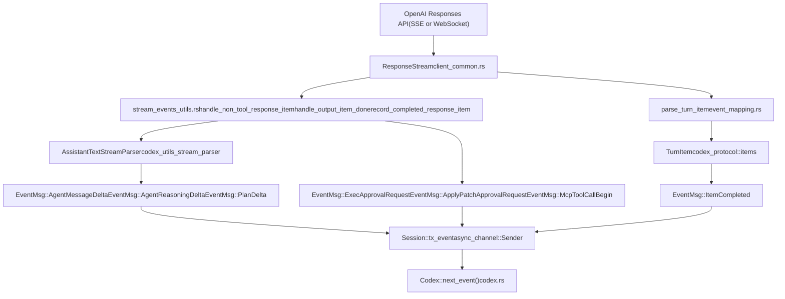
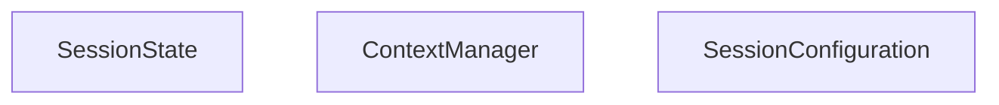

# 事件处理与状态管理

相关源文件

-   [codex-rs/core/src/codex.rs](https://github.com/openai/codex/blob/d807d44a/codex-rs/core/src/codex.rs)
-   [codex-rs/core/src/context\_manager/history.rs](https://github.com/openai/codex/blob/d807d44a/codex-rs/core/src/context_manager/history.rs)
-   [codex-rs/core/src/context\_manager/history\_tests.rs](https://github.com/openai/codex/blob/d807d44a/codex-rs/core/src/context_manager/history_tests.rs)
-   [codex-rs/core/src/context\_manager/mod.rs](https://github.com/openai/codex/blob/d807d44a/codex-rs/core/src/context_manager/mod.rs)
-   [codex-rs/core/src/context\_manager/normalize.rs](https://github.com/openai/codex/blob/d807d44a/codex-rs/core/src/context_manager/normalize.rs)
-   [codex-rs/core/src/event\_mapping.rs](https://github.com/openai/codex/blob/d807d44a/codex-rs/core/src/event_mapping.rs)
-   [codex-rs/core/src/rollout/policy.rs](https://github.com/openai/codex/blob/d807d44a/codex-rs/core/src/rollout/policy.rs)
-   [codex-rs/core/src/stream\_events\_utils.rs](https://github.com/openai/codex/blob/d807d44a/codex-rs/core/src/stream_events_utils.rs)
-   [codex-rs/core/src/stream\_events\_utils\_tests.rs](https://github.com/openai/codex/blob/d807d44a/codex-rs/core/src/stream_events_utils_tests.rs)
-   [codex-rs/core/src/tools/mod.rs](https://github.com/openai/codex/blob/d807d44a/codex-rs/core/src/tools/mod.rs)
-   [codex-rs/core/src/truncate.rs](https://github.com/openai/codex/blob/d807d44a/codex-rs/core/src/truncate.rs)
-   [codex-rs/core/tests/suite/items.rs](https://github.com/openai/codex/blob/d807d44a/codex-rs/core/tests/suite/items.rs)
-   [codex-rs/core/tests/suite/shell\_serialization.rs](https://github.com/openai/codex/blob/d807d44a/codex-rs/core/tests/suite/shell_serialization.rs)
-   [codex-rs/core/tests/suite/tool\_harness.rs](https://github.com/openai/codex/blob/d807d44a/codex-rs/core/tests/suite/tool_harness.rs)
-   [codex-rs/core/tests/suite/tools.rs](https://github.com/openai/codex/blob/d807d44a/codex-rs/core/tests/suite/tools.rs)
-   [codex-rs/exec/src/event\_processor.rs](https://github.com/openai/codex/blob/d807d44a/codex-rs/exec/src/event_processor.rs)
-   [codex-rs/exec/src/event\_processor\_with\_human\_output.rs](https://github.com/openai/codex/blob/d807d44a/codex-rs/exec/src/event_processor_with_human_output.rs)
-   [codex-rs/mcp-server/src/codex\_tool\_runner.rs](https://github.com/openai/codex/blob/d807d44a/codex-rs/mcp-server/src/codex_tool_runner.rs)
-   [codex-rs/protocol/src/items.rs](https://github.com/openai/codex/blob/d807d44a/codex-rs/protocol/src/items.rs)
-   [codex-rs/protocol/src/protocol.rs](https://github.com/openai/codex/blob/d807d44a/codex-rs/protocol/src/protocol.rs)
-   [codex-rs/tui/src/app.rs](https://github.com/openai/codex/blob/d807d44a/codex-rs/tui/src/app.rs)
-   [codex-rs/tui/src/app\_event.rs](https://github.com/openai/codex/blob/d807d44a/codex-rs/tui/src/app_event.rs)
-   [codex-rs/tui/src/bottom\_pane/chat\_composer.rs](https://github.com/openai/codex/blob/d807d44a/codex-rs/tui/src/bottom_pane/chat_composer.rs)
-   [codex-rs/tui/src/bottom\_pane/mod.rs](https://github.com/openai/codex/blob/d807d44a/codex-rs/tui/src/bottom_pane/mod.rs)
-   [codex-rs/tui/src/chatwidget.rs](https://github.com/openai/codex/blob/d807d44a/codex-rs/tui/src/chatwidget.rs)
-   [codex-rs/tui/src/chatwidget/tests.rs](https://github.com/openai/codex/blob/d807d44a/codex-rs/tui/src/chatwidget/tests.rs)
-   [codex-rs/tui/src/history\_cell.rs](https://github.com/openai/codex/blob/d807d44a/codex-rs/tui/src/history_cell.rs)
-   [codex-rs/tui/src/slash\_command.rs](https://github.com/openai/codex/blob/d807d44a/codex-rs/tui/src/slash_command.rs)

本页介绍核心代理系统如何将原始 API 流式事件映射为协议层 `EventMsg` 变体，`SessionState` 如何累计并更新每轮数据（token 使用量、速率限制、MCP 工具选择、对话历史），以及这些更新如何在每轮结束后回流到会话中供后续轮次使用。

关于协议中 `Op` 提交侧（消息如何进入会话），请参阅 [Protocol Layer (Submission/Event System)](/openai/codex/2.1-protocol-layer-(submissionevent-system))。关于对话历史表示与截断，请参阅 [Conversation History Management](/openai/codex/3.5-conversation-history-management)。关于 `RegularTask` 在开始流式传输前如何组装 prompt，请参阅 [Turn Execution and Prompt Construction](/openai/codex/3.3-turn-execution-and-prompt-construction)。

---

## 事件处理流水线

当一个轮次运行时，`ModelClientSession::stream()` 会返回 `ResponseStream`，其会产出来自 OpenAI Responses API（SSE 或 WebSocket）的原始 `ResponseEvent` 项 [codex-rs/core/src/client\_common.rs161](https://github.com/openai/codex/blob/d807d44a/codex-rs/core/src/client_common.rs#L161-L161)。轮次执行器（主要是 `RegularTask`）会消费这些事件，并将其映射到两条并行输出：

1.  **`EventMsg` 变体**：通过 `Session::tx_event` 通道发出，调用方可通过 `Codex::next_event()` 接收 [codex-rs/core/src/codex.rs115](https://github.com/openai/codex/blob/d807d44a/codex-rs/core/src/codex.rs#L115-L115)
2.  **`ResponseItem` 记录**：存入 `ContextManager`（历史），供下一轮 prompt 使用 [codex-rs/core/src/context\_manager/mod.rs1-10](https://github.com/openai/codex/blob/d807d44a/codex-rs/core/src/context_manager/mod.rs#L1-L10)

关键中间函数位于 `codex-rs/core/src/stream_events_utils.rs` 与 `codex-rs/core/src/event_mapping.rs`。

**API Response 到 EventMsg 流水线**


Sources: [codex-rs/core/src/codex.rs43-48](https://github.com/openai/codex/blob/d807d44a/codex-rs/core/src/codex.rs#L43-L48) [codex-rs/core/src/client\_common.rs161](https://github.com/openai/codex/blob/d807d44a/codex-rs/core/src/client_common.rs#L161-L161) [codex-rs/core/src/codex.rs115](https://github.com/openai/codex/blob/d807d44a/codex-rs/core/src/codex.rs#L115-L115) [codex-rs/protocol/src/protocol.rs204-210](https://github.com/openai/codex/blob/d807d44a/codex-rs/protocol/src/protocol.rs#L204-L210)

### parse\_turn\_item

`parse_turn_item` 会把 API 的低层 `ResponseEvent` 转换为高层 `TurnItem` [codex-rs/core/src/codex.rs35](https://github.com/openai/codex/blob/d807d44a/codex-rs/core/src/codex.rs#L35-L35)。`TurnItem` 枚举覆盖代理可产生的关键内容类型：

| `TurnItem` variant | Source data |
| --- | --- |
| `AgentMessageItem` | 助手文本输出 [codex-rs/tui/src/chatwidget.rs97](https://github.com/openai/codex/blob/d807d44a/codex-rs/tui/src/chatwidget.rs#L97-L97) |
| `ReasoningItem` | 加密或摘要化推理块 [codex-rs/protocol/src/protocol.rs40](https://github.com/openai/codex/blob/d807d44a/codex-rs/protocol/src/protocol.rs#L40-L40) |
| `UserMessageItem` | 系统注入的 user 角色消息 [codex-rs/protocol/src/protocol.rs88](https://github.com/openai/codex/blob/d807d44a/codex-rs/protocol/src/protocol.rs#L88-L88) |
| `WebSearchItem` | 网页搜索调用及其结果 [codex-rs/protocol/src/protocol.rs42](https://github.com/openai/codex/blob/d807d44a/codex-rs/protocol/src/protocol.rs#L42-L42) |
| `Plan(PlanItem)` | 模型提出的结构化计划 [codex-rs/protocol/src/protocol.rs86](https://github.com/openai/codex/blob/d807d44a/codex-rs/protocol/src/protocol.rs#L86-L86) |

`parse_turn_item` 产出 `TurnItem` 后，会在项目完成时封装为 `EventMsg::ItemCompleted(ItemCompletedEvent { item, .. })` 并发送 [codex-rs/core/src/codex.rs99](https://github.com/openai/codex/blob/d807d44a/codex-rs/core/src/codex.rs#L99-L99)

Sources: [codex-rs/core/src/codex.rs35](https://github.com/openai/codex/blob/d807d44a/codex-rs/core/src/codex.rs#L35-L35) [codex-rs/protocol/src/protocol.rs30-42](https://github.com/openai/codex/blob/d807d44a/codex-rs/protocol/src/protocol.rs#L30-L42) [codex-rs/tui/src/chatwidget.rs96-104](https://github.com/openai/codex/blob/d807d44a/codex-rs/tui/src/chatwidget.rs#L96-L104)

### AssistantTextStreamParser

对于流式文本输出，`AssistantTextStreamParser`（来自 `codex_utils_stream_parser` crate）会累计 `AssistantTextChunk` 增量 [codex-rs/core/src/codex.rs120-121](https://github.com/openai/codex/blob/d807d44a/codex-rs/core/src/codex.rs#L120-L121)。它还会识别嵌入在流式文本中的 `ProposedPlanSegment` 块 [codex-rs/core/src/codex.rs122-123](https://github.com/openai/codex/blob/d807d44a/codex-rs/core/src/codex.rs#L122-L123)。这会驱动两种不同的增量事件：

-   `EventMsg::AgentMessageDelta` — 原始文本增量，供 UI 追加显示 [codex-rs/tui/src/chatwidget.rs101](https://github.com/openai/codex/blob/d807d44a/codex-rs/tui/src/chatwidget.rs#L101-L101)
-   `EventMsg::PlanDelta` — 当结构化计划块正在流式输出时发出 [codex-rs/tui/src/chatwidget.rs146](https://github.com/openai/codex/blob/d807d44a/codex-rs/tui/src/chatwidget.rs#L146-L146)

Sources: [codex-rs/core/src/codex.rs120-123](https://github.com/openai/codex/blob/d807d44a/codex-rs/core/src/codex.rs#L120-L123) [codex-rs/tui/src/chatwidget.rs101-146](https://github.com/openai/codex/blob/d807d44a/codex-rs/tui/src/chatwidget.rs#L101-L146)

---

## EventMsg 变体分类

`EventMsg` 是表示所有可观察状态变化与通知的主联合类型，定义在 `codex-rs/protocol/src/protocol.rs` 中，并被所有客户端消费（TUI、exec 模式、app server、MCP server） [codex-rs/protocol/src/protocol.rs204-210](https://github.com/openai/codex/blob/d807d44a/codex-rs/protocol/src/protocol.rs#L204-L210)

**EventMsg 变体分组**


Sources: [codex-rs/protocol/src/protocol.rs204-210](https://github.com/openai/codex/blob/d807d44a/codex-rs/protocol/src/protocol.rs#L204-L210) [codex-rs/tui/src/chatwidget.rs101-149](https://github.com/openai/codex/blob/d807d44a/codex-rs/tui/src/chatwidget.rs#L101-L149) [codex-rs/exec/src/event\_processor\_with\_human\_output.rs5-41](https://github.com/openai/codex/blob/d807d44a/codex-rs/exec/src/event_processor_with_human_output.rs#L5-L41)

关键事件载荷：

| Event | Key payload fields |
| --- | --- |
| `SessionConfiguredEvent` | `session_id`, `model`, `initial_messages` [codex-rs/tui/src/history\_cell.rs59](https://github.com/openai/codex/blob/d807d44a/codex-rs/tui/src/history_cell.rs#L59-L59) |
| `TurnCompleteEvent` | `last_agent_message: Option<String>` [codex-rs/protocol/src/protocol.rs38](https://github.com/openai/codex/blob/d807d44a/codex-rs/protocol/src/protocol.rs#L38-L38) |
| `TurnAbortReason` | `reason: TurnAbortReason` [codex-rs/protocol/src/protocol.rs106](https://github.com/openai/codex/blob/d807d44a/codex-rs/protocol/src/protocol.rs#L106-L106) |
| `TokenCountEvent` | `info: Option<TokenUsageInfo>` [codex-rs/tui/src/chatwidget.rs143](https://github.com/openai/codex/blob/d807d44a/codex-rs/tui/src/chatwidget.rs#L143-L143) |
| `ExecApprovalRequestEvent` | `command`, `cwd`, `call_id`, `approval_id`, `reason` [codex-rs/protocol/src/protocol.rs63](https://github.com/openai/codex/blob/d807d44a/codex-rs/protocol/src/protocol.rs#L63-L63) |
| `StreamErrorEvent` | `message`, `additional_details` [codex-rs/protocol/src/protocol.rs140](https://github.com/openai/codex/blob/d807d44a/codex-rs/protocol/src/protocol.rs#L140-L140) |
| `TurnDiffEvent` | `changes: Vec<FileChange>` [codex-rs/protocol/src/protocol.rs146](https://github.com/openai/codex/blob/d807d44a/codex-rs/protocol/src/protocol.rs#L146-L146) |

Sources: [codex-rs/protocol/src/protocol.rs38-146](https://github.com/openai/codex/blob/d807d44a/codex-rs/protocol/src/protocol.rs#L38-L146) [codex-rs/tui/src/chatwidget.rs143](https://github.com/openai/codex/blob/d807d44a/codex-rs/tui/src/chatwidget.rs#L143-L143) [codex-rs/tui/src/history\_cell.rs59](https://github.com/openai/codex/blob/d807d44a/codex-rs/tui/src/history_cell.rs#L59-L59)

---

## SessionState 结构

`SessionState` 是每个会话的可变数据存储，位于 `Session::state: Mutex<SessionState>` 内部，这意味着所有变更都在锁内执行。

**SessionState 字段与关系**


Sources: [codex-rs/core/src/codex.rs1-155](https://github.com/openai/codex/blob/d807d44a/codex-rs/core/src/codex.rs#L1-L155) [codex-rs/protocol/src/protocol.rs101-111](https://github.com/openai/codex/blob/d807d44a/codex-rs/protocol/src/protocol.rs#L101-L111)

实际的会话 `ResponseItem` 历史记录存储在 `ContextManager` 中，`SessionState` 会将所有历史相关操作委托给它。

---

## Token 使用量跟踪

token 使用数据来自 API 响应（SSE 的 `response.completed` 事件或 WebSocket 最终帧），并沿以下路径流转：

1.  轮次执行器接收包含 `TokenUsage` 结构体的完成数据 [codex-rs/protocol/src/protocol.rs142](https://github.com/openai/codex/blob/d807d44a/codex-rs/protocol/src/protocol.rs#L142-L142)
2.  调用 `SessionState::update_token_info_from_usage(usage, model_context_window)`。
3.  该调用委托给 `ContextManager::update_token_info()`，后者保存 `TokenUsageInfo` 快照 [codex-rs/protocol/src/protocol.rs143](https://github.com/openai/codex/blob/d807d44a/codex-rs/protocol/src/protocol.rs#L143-L143)
4.  当轮次执行器发送 `EventMsg::TokenCount(TokenCountEvent { info })` 时，会回读保存的 `TokenUsageInfo` 来填充事件 [codex-rs/tui/src/chatwidget.rs143](https://github.com/openai/codex/blob/d807d44a/codex-rs/tui/src/chatwidget.rs#L143-L143)

```
TokenUsage (API response payload)
  → SessionState::update_token_info_from_usage()
    → ContextManager::update_token_info()
      stored as Option<TokenUsageInfo>
  → SessionState::token_info()
    → EventMsg::TokenCount { info }
```
Sources: [codex-rs/protocol/src/protocol.rs142-143](https://github.com/openai/codex/blob/d807d44a/codex-rs/protocol/src/protocol.rs#L142-L143) [codex-rs/tui/src/chatwidget.rs143](https://github.com/openai/codex/blob/d807d44a/codex-rs/tui/src/chatwidget.rs#L143-L143)

---

## 速率限制跟踪

来自 API 响应的速率限制头（例如 `x-ratelimit-remaining-requests`、`x-ratelimit-remaining-tokens`）会被提取并转换为 `RateLimitSnapshot` [codex-rs/protocol/src/protocol.rs136](https://github.com/openai/codex/blob/d807d44a/codex-rs/protocol/src/protocol.rs#L136-L136)。该快照会合并到 `SessionState::latest_rate_limits` 中。

`RateLimitSnapshot` 包含跨不同时间窗口的请求与 token 字段 [codex-rs/tui/src/chatwidget.rs136](https://github.com/openai/codex/blob/d807d44a/codex-rs/tui/src/chatwidget.rs#L136-L136)。这可以处理请求和 token 的速率限制头在不同响应中到达的情况。

Sources: [codex-rs/protocol/src/protocol.rs136](https://github.com/openai/codex/blob/d807d44a/codex-rs/protocol/src/protocol.rs#L136-L136) [codex-rs/tui/src/chatwidget.rs136](https://github.com/openai/codex/blob/d807d44a/codex-rs/tui/src/chatwidget.rs#L136-L136)

---

## MCP 工具选择状态

`active_mcp_tool_selection` 用于跟踪当前会话中被选中的 MCP 工具名集合。随着模型提及工具或用户手动选择，该集合会持续增长。

每轮会回读 `active_mcp_tool_selection`，以过滤应在 prompt 工具列表中提供给模型的 MCP 工具，而不是把所有已配置 MCP 服务器的全部工具都加入。

`active_connector_selection: HashSet<String>` 对 app connectors 也承担类似作用。

Sources: [codex-rs/core/src/codex.rs1-100](https://github.com/openai/codex/blob/d807d44a/codex-rs/core/src/codex.rs#L1-L100) [codex-rs/tui/src/chatwidget.rs128-133](https://github.com/openai/codex/blob/d807d44a/codex-rs/tui/src/chatwidget.rs#L128-L133)

---

## 每轮状态更新顺序

下图展示单个完整轮次中状态变更的顺序：

**Per-Turn SessionState Update Flow**

Sources: [codex-rs/core/src/codex.rs43-55](https://github.com/openai/codex/blob/d807d44a/codex-rs/core/src/codex.rs#L43-L55) [codex-rs/core/src/stream\_events\_utils.rs43-48](https://github.com/openai/codex/blob/d807d44a/codex-rs/core/src/stream_events_utils.rs#L43-L48)

---

## 事件持久化过滤

并非所有事件都会写入会话的 rollout JSONL 文件。`RolloutItem` 封装了被持久化的内容 [codex-rs/protocol/src/protocol.rs103](https://github.com/openai/codex/blob/d807d44a/codex-rs/protocol/src/protocol.rs#L103-L103)：

| Rollout Item Variant | Description |
| --- | --- |
| `ResponseItem(ResponseItem)` | 对话数据 [codex-rs/protocol/src/protocol.rs41](https://github.com/openai/codex/blob/d807d44a/codex-rs/protocol/src/protocol.rs#L41-L41) |
| `EventMsg(EventMsg)` | 被选中的协议事件 [codex-rs/protocol/src/protocol.rs204-210](https://github.com/openai/codex/blob/d807d44a/codex-rs/protocol/src/protocol.rs#L204-L210) |
| `TurnContext(TurnContextItem)` | 每轮配置快照 [codex-rs/protocol/src/protocol.rs107](https://github.com/openai/codex/blob/d807d44a/codex-rs/protocol/src/protocol.rs#L107-L107) |

Sources: [codex-rs/protocol/src/protocol.rs41-210](https://github.com/openai/codex/blob/d807d44a/codex-rs/protocol/src/protocol.rs#L41-L210)

---

## AgentStatus Watch 通道

`Session` 维护一个 `watch::Sender<AgentStatus>` [codex-rs/core/src/codex.rs140](https://github.com/openai/codex/blob/d807d44a/codex-rs/core/src/codex.rs#L140-L140)。这是 Tokio 的 watch 通道，意味着任意观察者总能看到最新值，而不需要缓存所有更新。

`AgentStatus` 由 `agent_status_from_event` 函数根据 `EventMsg` 值推导得到 [codex-rs/core/src/codex.rs14](https://github.com/openai/codex/blob/d807d44a/codex-rs/core/src/codex.rs#L14-L14)。当重要事件到达（轮次开始、轮次完成、中止等）时，watch 值会被更新。

Sources: [codex-rs/core/src/codex.rs14-140](https://github.com/openai/codex/blob/d807d44a/codex-rs/core/src/codex.rs#L14-L140)

---

## TurnContext 快照

`TurnContext` 在每轮开始时由 `SessionState` 组装，并传递给正在运行的任务。它在轮次执行过程中**不会被修改**——代表该轮期间会话设置的冻结视图：

| `TurnContext` field | Source |
| --- | --- |
| `cwd: PathBuf` | 来自会话或每轮 `Op::UserInput` [codex-rs/protocol/src/protocol.rs110](https://github.com/openai/codex/blob/d807d44a/codex-rs/protocol/src/protocol.rs#L110-L110) |
| `approval_policy` | 来自 `SessionConfiguration` [codex-rs/protocol/src/protocol.rs85](https://github.com/openai/codex/blob/d807d44a/codex-rs/protocol/src/protocol.rs#L85-L85) |
| `sandbox_policy` | 来自 `SessionConfiguration` [codex-rs/protocol/src/protocol.rs91](https://github.com/openai/codex/blob/d807d44a/codex-rs/protocol/src/protocol.rs#L91-L91) |
| `features: Features` | 在会话生命周期内保持不变 [codex-rs/core/src/codex.rs59](https://github.com/openai/codex/blob/d807d44a/codex-rs/core/src/codex.rs#L59-L59) |

`TurnContextItem` 会作为 `RolloutItem::TurnContext` 写入 rollout 文件，使每轮设置在会话回放时可复现 [codex-rs/protocol/src/protocol.rs107](https://github.com/openai/codex/blob/d807d44a/codex-rs/protocol/src/protocol.rs#L107-L107)

Sources: [codex-rs/core/src/codex.rs59](https://github.com/openai/codex/blob/d807d44a/codex-rs/core/src/codex.rs#L59-L59) [codex-rs/protocol/src/protocol.rs85-110](https://github.com/openai/codex/blob/d807d44a/codex-rs/protocol/src/protocol.rs#L85-L110)
