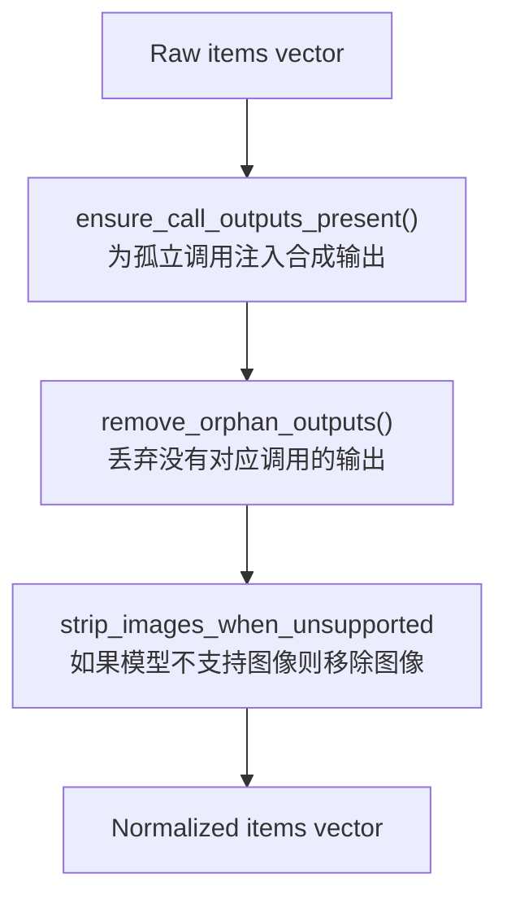
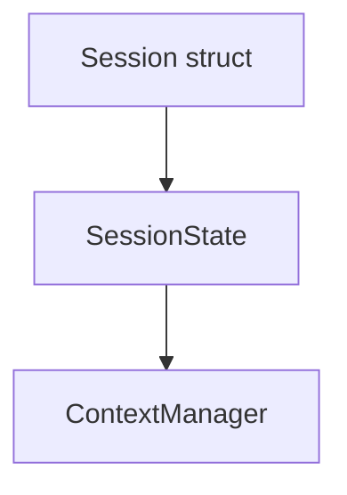

# 对话历史管理

相关源文件

-   [codex-rs/app-server/tests/suite/v2/mcp_server_elicitation.rs](https://github.com/openai/codex/blob/d807d44a/codex-rs/app-server/tests/suite/v2/mcp_server_elicitation.rs)
-   [codex-rs/cli/src/mcp_cmd.rs](https://github.com/openai/codex/blob/d807d44a/codex-rs/cli/src/mcp_cmd.rs)
-   [codex-rs/cli/tests/mcp_add_remove.rs](https://github.com/openai/codex/blob/d807d44a/codex-rs/cli/tests/mcp_add_remove.rs)
-   [codex-rs/cli/tests/mcp_list.rs](https://github.com/openai/codex/blob/d807d44a/codex-rs/cli/tests/mcp_list.rs)
-   [codex-rs/core/src/context_manager/history.rs](https://github.com/openai/codex/blob/d807d44a/codex-rs/core/src/context_manager/history.rs)
-   [codex-rs/core/src/context_manager/history_tests.rs](https://github.com/openai/codex/blob/d807d44a/codex-rs/core/src/context_manager/history_tests.rs)
-   [codex-rs/core/src/context_manager/mod.rs](https://github.com/openai/codex/blob/d807d44a/codex-rs/core/src/context_manager/mod.rs)
-   [codex-rs/core/src/context_manager/normalize.rs](https://github.com/openai/codex/blob/d807d44a/codex-rs/core/src/context_manager/normalize.rs)
-   [codex-rs/core/src/event_mapping.rs](https://github.com/openai/codex/blob/d807d44a/codex-rs/core/src/event_mapping.rs)
-   [codex-rs/core/src/mcp_connection_manager.rs](https://github.com/openai/codex/blob/d807d44a/codex-rs/core/src/mcp_connection_manager.rs)
-   [codex-rs/core/src/mcp_connection_manager_tests.rs](https://github.com/openai/codex/blob/d807d44a/codex-rs/core/src/mcp_connection_manager_tests.rs)
-   [codex-rs/core/src/state/session.rs](https://github.com/openai/codex/blob/d807d44a/codex-rs/core/src/state/session.rs)
-   [codex-rs/core/src/state/turn.rs](https://github.com/openai/codex/blob/d807d44a/codex-rs/core/src/state/turn.rs)
-   [codex-rs/core/src/stream_events_utils.rs](https://github.com/openai/codex/blob/d807d44a/codex-rs/core/src/stream_events_utils.rs)
-   [codex-rs/core/src/stream_events_utils_tests.rs](https://github.com/openai/codex/blob/d807d44a/codex-rs/core/src/stream_events_utils_tests.rs)
-   [codex-rs/core/src/tasks/mod.rs](https://github.com/openai/codex/blob/d807d44a/codex-rs/core/src/tasks/mod.rs)
-   [codex-rs/core/src/tools/handlers/tool_search_tests.rs](https://github.com/openai/codex/blob/d807d44a/codex-rs/core/src/tools/handlers/tool_search_tests.rs)
-   [codex-rs/core/src/tools/mod.rs](https://github.com/openai/codex/blob/d807d44a/codex-rs/core/src/tools/mod.rs)
-   [codex-rs/core/src/truncate.rs](https://github.com/openai/codex/blob/d807d44a/codex-rs/core/src/truncate.rs)
-   [codex-rs/core/tests/suite/items.rs](https://github.com/openai/codex/blob/d807d44a/codex-rs/core/tests/suite/items.rs)
-   [codex-rs/core/tests/suite/rmcp_client.rs](https://github.com/openai/codex/blob/d807d44a/codex-rs/core/tests/suite/rmcp_client.rs)
-   [codex-rs/core/tests/suite/shell_serialization.rs](https://github.com/openai/codex/blob/d807d44a/codex-rs/core/tests/suite/shell_serialization.rs)
-   [codex-rs/core/tests/suite/tool_harness.rs](https://github.com/openai/codex/blob/d807d44a/codex-rs/core/tests/suite/tool_harness.rs)
-   [codex-rs/core/tests/suite/tools.rs](https://github.com/openai/codex/blob/d807d44a/codex-rs/core/tests/suite/tools.rs)
-   [codex-rs/core/tests/suite/truncation.rs](https://github.com/openai/codex/blob/d807d44a/codex-rs/core/tests/suite/truncation.rs)
-   [codex-rs/core/tests/suite/user_shell_cmd.rs](https://github.com/openai/codex/blob/d807d44a/codex-rs/core/tests/suite/user_shell_cmd.rs)
-   [codex-rs/protocol/src/items.rs](https://github.com/openai/codex/blob/d807d44a/codex-rs/protocol/src/items.rs)
-   [codex-rs/rmcp-client/src/rmcp_client.rs](https://github.com/openai/codex/blob/d807d44a/codex-rs/rmcp-client/src/rmcp_client.rs)
-   [codex-rs/rmcp-client/tests/streamable_http_recovery.rs](https://github.com/openai/codex/blob/d807d44a/codex-rs/rmcp-client/tests/streamable_http_recovery.rs)

本文档描述了 Codex 如何维护和操作构成模型上下文窗口的对话历史。它涵盖了 `ContextManager` 数据结构、项的记录与归一化、Token 估算以及历史生命周期管理。

有关在接近上下文限制时**总结和压缩**对话历史的详细信息，请参见 [历史压缩系统](/openai/codex/3.5.1-history-compaction-system)。有关将**历史持久化到磁盘**并在会话恢复期间重放的信息，请参见 [Rollout 持久化与重放](/openai/codex/3.5.2-rollout-persistence-and-replay)。

---

## 概述

对话历史管理器负责：

-   存储 `ResponseItem` 条目（用户消息、助手消息、工具调用、工具输出、推理项） [codex-rs/core/src/context_manager/history.rs30-33](https://github.com/openai/codex/blob/d807d44a/codex-rs/core/src/context_manager/history.rs#L30-L33)
-   对历史进行归一化以维持不变性，例如确保每个工具调用都有对应的输出 [codex-rs/core/src/context_manager/normalize.rs14-16](https://github.com/openai/codex/blob/d807d44a/codex-rs/core/src/context_manager/normalize.rs#L14-L16)
-   跟踪来自 API 响应的 Token 使用情况，并对本地添加的项进行 Token 估算 [codex-rs/core/src/context_manager/history.rs126-133](https://github.com/openai/codex/blob/d807d44a/codex-rs/core/src/context_manager/history.rs#L126-L133)
-   通过过滤和转换项，为 Prompt 构建准备历史记录 [codex-rs/core/src/context_manager/history.rs112-117](https://github.com/openai/codex/blob/d807d44a/codex-rs/core/src/context_manager/history.rs#L112-L117)
-   支持历史修改操作，如移除、替换和压缩 [codex-rs/core/src/context_manager/history.rs151-174](https://github.com/openai/codex/blob/d807d44a/codex-rs/core/src/context_manager/history.rs#L151-L174)

主要入口点是 `ContextManager` 结构体，它由 `SessionState` 拥有并由 `Session` 方法操作 [codex-rs/core/src/state/session.rs20-22](https://github.com/openai/codex/blob/d807d44a/codex-rs/core/src/state/session.rs#L20-L22)

**来源：** [codex-rs/core/src/context_manager/history.rs29-44](https://github.com/openai/codex/blob/d807d44a/codex-rs/core/src/context_manager/history.rs#L29-L44) [codex-rs/core/src/state/session.rs20-36](https://github.com/openai/codex/blob/d807d44a/codex-rs/core/src/state/session.rs#L20-L36)

---

## ContextManager 结构

**ContextManager 字段**

| 字段 | 类型 | 用途 |
| --- | --- | --- |
| `items` | `Vec<ResponseItem>` | 按从旧到新排序的历史记录 [codex-rs/core/src/context_manager/history.rs33](https://github.com/openai/codex/blob/d807d44a/codex-rs/core/src/context_manager/history.rs#L33-L33) |
| `token_info` | `Option<TokenUsageInfo>` | 最近一次 API 报告的 Token 使用情况 [codex-rs/core/src/context_manager/history.rs34](https://github.com/openai/codex/blob/d807d44a/codex-rs/core/src/context_manager/history.rs#L34-L34) |
| `reference_context_item` | `Option<TurnContextItem>` | 用于检测设置更改的基准 [codex-rs/core/src/context_manager/history.rs43](https://github.com/openai/codex/blob/d807d44a/codex-rs/core/src/context_manager/history.rs#L43-L43) |

`items` 向量维持时间顺序。索引 0 处的项最旧；末尾的项最新 [codex-rs/core/src/context_manager/history.rs153-155](https://github.com/openai/codex/blob/d807d44a/codex-rs/core/src/context_manager/history.rs#L153-L155)

**来源：** [codex-rs/core/src/context_manager/history.rs30-44](https://github.com/openai/codex/blob/d807d44a/codex-rs/core/src/context_manager/history.rs#L30-L44) [codex-rs/core/src/context_manager/history.rs54-63](https://github.com/openai/codex/blob/d807d44a/codex-rs/core/src/context_manager/history.rs#L54-L63)

---

## 将项记录到历史中

项通过 `record_items` 方法流入历史管理器，该方法接受 `ResponseItem` 引用的任何迭代器和 `TruncationPolicy` [codex-rs/core/src/context_manager/history.rs91-95](https://github.com/openai/codex/blob/d807d44a/codex-rs/core/src/context_manager/history.rs#L91-L95)：

> **[Mermaid sequence]**
> *(图表结构无法解析)*

### 项过滤

只有对模型上下文有贡献的项才会被记录。角色为 `"user"`、`"assistant"` 和 `"developer"` 的消息将被保留，其他消息将被跳过 [codex-rs/core/src/context_manager/history.rs98-101](https://github.com/openai/codex/blob/d807d44a/codex-rs/core/src/context_manager/history.rs#L98-L101)。`GhostSnapshot` 项也会被记录以支持会话状态跟踪，但在 Prompt 生成过程中会被过滤掉 [codex-rs/core/src/context_manager/history.rs114-116](https://github.com/openai/codex/blob/d807d44a/codex-rs/core/src/context_manager/history.rs#L114-L116)

**来源：** [codex-rs/core/src/context_manager/history.rs91-106](https://github.com/openai/codex/blob/d807d44a/codex-rs/core/src/context_manager/history.rs#L91-L106) [codex-rs/core/src/context_manager/history.rs114-116](https://github.com/openai/codex/blob/d807d44a/codex-rs/core/src/context_manager/history.rs#L114-L116)

### 截断策略

`TruncationPolicy` 枚举控制如何截断大型内容 [codex-rs/core/src/truncate.rs12-16](https://github.com/openai/codex/blob/d807d44a/codex-rs/core/src/truncate.rs#L12-L16)：

| 策略 | 描述 |
| --- | --- |
| `TruncationPolicy::Bytes(n)` | 将内容限制为 `n` 字节 [codex-rs/core/src/truncate.rs14](https://github.com/openai/codex/blob/d807d44a/codex-rs/core/src/truncate.rs#L14-L14) |
| `TruncationPolicy::Tokens(n)` | 将内容限制为约 `n` Token [codex-rs/core/src/truncate.rs15](https://github.com/openai/codex/blob/d807d44a/codex-rs/core/src/truncate.rs#L15-L15) |

工具输出在记录过程中通过 `truncate_function_output_items_with_policy` 进行截断，以防止过度消耗上下文 [codex-rs/core/src/truncate.rs145-148](https://github.com/openai/codex/blob/d807d44a/codex-rs/core/src/truncate.rs#L145-L148)

**来源：** [codex-rs/core/src/truncate.rs12-34](https://github.com/openai/codex/blob/d807d44a/codex-rs/core/src/truncate.rs#L12-L34) [codex-rs/core/src/truncate.rs145-195](https://github.com/openai/codex/blob/d807d44a/codex-rs/core/src/truncate.rs#L145-L195)

---

## 历史归一化

在将历史记录发送到模型 API 之前，`normalize_history` 会强制执行几个不变性 [codex-rs/core/src/context_manager/history.rs113](https://github.com/openai/codex/blob/d807d44a/codex-rs/core/src/context_manager/history.rs#L113-L113)：



### 不变性：调用/输出配对

每个 `FunctionCall` 必须有一个对应的 `FunctionCallOutput`。如果某个调用缺少输出，则会插入一个合成输出，以维持协议的轮次结构 [codex-rs/core/src/context_manager/normalize.rs14-20](https://github.com/openai/codex/blob/d807d44a/codex-rs/core/src/context_manager/normalize.rs#L14-L20)。相反，没有调用的孤立输出将被移除 [codex-rs/core/src/context_manager/normalize.rs116-120](https://github.com/openai/codex/blob/d807d44a/codex-rs/core/src/context_manager/normalize.rs#L116-L120)

**来源：** [codex-rs/core/src/context_manager/normalize.rs14-127](https://github.com/openai/codex/blob/d807d44a/codex-rs/core/src/context_manager/normalize.rs#L14-L127)

### 图像剥离

当模型的 `input_modalities` 不包含 `InputModality::Image` 时，所有图像内容都会被替换为占位文本，说明内容已被省略 [codex-rs/core/src/context_manager/normalize.rs246-255](https://github.com/openai/codex/blob/d807d44a/codex-rs/core/src/context_manager/normalize.rs#L246-L255)

**来源：** [codex-rs/core/src/context_manager/normalize.rs246-296](https://github.com/openai/codex/blob/d807d44a/codex-rs/core/src/context_manager/normalize.rs#L246-L296)

---

## 为 Prompt 准备历史记录

`for_prompt` 方法将内部历史表示转换为发送到模型 API 的最终向量 [codex-rs/core/src/context_manager/history.rs112-117](https://github.com/openai/codex/blob/d807d44a/codex-rs/core/src/context_manager/history.rs#L112-L117)：

1.  **归一化**：运行 `normalize_history` 以强制执行不变性 [codex-rs/core/src/context_manager/history.rs113](https://github.com/openai/codex/blob/d807d44a/codex-rs/core/src/context_manager/history.rs#L113-L113)
2.  **过滤**：`GhostSnapshot` 项将被移除，因为它们仅用于内部会话状态，对模型不可见 [codex-rs/core/src/context_manager/history.rs114-116](https://github.com/openai/codex/blob/d807d44a/codex-rs/core/src/context_manager/history.rs#L114-L116)

这确保了模型收到一个干净、有效的转录文本。

**来源：** [codex-rs/core/src/context_manager/history.rs112-117](https://github.com/openai/codex/blob/d807d44a/codex-rs/core/src/context_manager/history.rs#L112-L117)

---

## Token 使用情况跟踪

Token 使用情况通过 API 报告的使用情况和本地估算来跟踪 [codex-rs/core/src/context_manager/history.rs126-133](https://github.com/openai/codex/blob/d807d44a/codex-rs/core/src/context_manager/history.rs#L126-L133)

### Token 计算策略

`get_total_token_usage` 方法将上一次 API 响应的总 Token 数与自该响应以来添加的项的估算 Token 数相结合 [codex-rs/core/src/context_manager/history.rs275-285](https://github.com/openai/codex/blob/d807d44a/codex-rs/core/src/context_manager/history.rs#L275-L285)：

```
total_tokens = last_api_response_total
             + estimated_tokens_for_items_added_since_last_response
```

**来源：** [codex-rs/core/src/context_manager/history.rs275-306](https://github.com/openai/codex/blob/d807d44a/codex-rs/core/src/context_manager/history.rs#L275-L306)

### 本地 Token 估算

Token 估算使用基于字节的启发式方法，其中约 4 字节等于 1 个 Token [codex-rs/core/src/truncate.rs10](https://github.com/openai/codex/blob/d807d44a/codex-rs/core/src/truncate.rs#L10-L10)。这用于在进行 API 调用之前提供关于上下文使用情况的即时反馈 [codex-rs/core/src/context_manager/history.rs126-133](https://github.com/openai/codex/blob/d807d44a/codex-rs/core/src/context_manager/history.rs#L126-L133)

**来源：** [codex-rs/core/src/truncate.rs10](https://github.com/openai/codex/blob/d807d44a/codex-rs/core/src/truncate.rs#L10-L10) [codex-rs/core/src/context_manager/history.rs419-425](https://github.com/openai/codex/blob/d807d44a/codex-rs/core/src/context_manager/history.rs#L419-L425)

---

## 历史修改操作

### 移除项

| 方法 | 描述 |
| --- | --- |
| `remove_first_item()` | 移除最旧的项及其配对副本 [codex-rs/core/src/context_manager/history.rs151-161](https://github.com/openai/codex/blob/d807d44a/codex-rs/core/src/context_manager/history.rs#L151-L161) |
| `remove_last_item()` | 移除最新的项及其配对副本 [codex-rs/core/src/context_manager/history.rs163-170](https://github.com/openai/codex/blob/d807d44a/codex-rs/core/src/context_manager/history.rs#L163-L170) |

这些方法使用 `normalize::remove_corresponding_for` 来确保移除工具调用时也会移除其输出（反之亦然） [codex-rs/core/src/context_manager/history.rs159](https://github.com/openai/codex/blob/d807d44a/codex-rs/core/src/context_manager/history.rs#L159-L159)

**来源：** [codex-rs/core/src/context_manager/history.rs151-170](https://github.com/openai/codex/blob/d807d44a/codex-rs/core/src/context_manager/history.rs#L151-L170)

### 引用上下文项

`reference_context_item` 存储了来自基准轮次的设置快照 [codex-rs/core/src/context_manager/history.rs43](https://github.com/openai/codex/blob/d807d44a/codex-rs/core/src/context_manager/history.rs#L43-L43)。这用于与当前设置进行比较，以确定是否需要为模型重新注入设置 [codex-rs/core/src/context_manager/history.rs35-42](https://github.com/openai/codex/blob/d807d44a/codex-rs/core/src/context_manager/history.rs#L35-L42)

**来源：** [codex-rs/core/src/context_manager/history.rs35-43](https://github.com/openai/codex/blob/d807d44a/codex-rs/core/src/context_manager/history.rs#L35-L43) [codex-rs/core/src/context_manager/history.rs73-79](https://github.com/openai/codex/blob/d807d44a/codex-rs/core/src/context_manager/history.rs#L73-L79)

---

## 与会话集成

`SessionState` 结构体封装了 `ContextManager` [codex-rs/core/src/state/session.rs22](https://github.com/openai/codex/blob/d807d44a/codex-rs/core/src/state/session.rs#L22-L22)



`SessionState` 提供了记录项和更新 Token 使用情况的代理方法，确保对底层历史转录文本的线程安全访问 [codex-rs/core/src/state/session.rs58-64](https://github.com/openai/codex/blob/d807d44a/codex-rs/core/src/state/session.rs#L58-L64)

**来源：** [codex-rs/core/src/state/session.rs20-36](https://github.com/openai/codex/blob/d807d44a/codex-rs/core/src/state/session.rs#L20-L36) [codex-rs/core/src/state/session.rs58-109](https://github.com/openai/codex/blob/d807d44a/codex-rs/core/src/state/session.rs#L58-L109)
