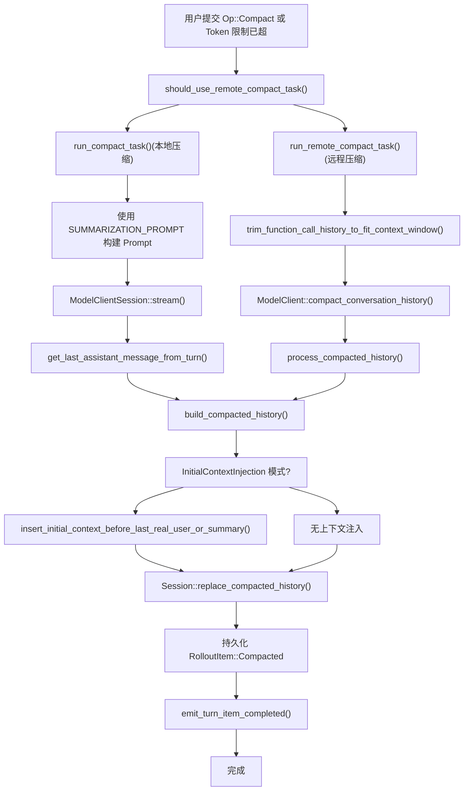

# 历史压缩系统

相关源文件

-   [codex-rs/core/src/compact.rs](https://github.com/openai/codex/blob/d807d44a/codex-rs/core/src/compact.rs)
-   [codex-rs/core/src/compact_remote.rs](https://github.com/openai/codex/blob/d807d44a/codex-rs/core/src/compact_remote.rs)
-   [codex-rs/core/src/tasks/compact.rs](https://github.com/openai/codex/blob/d807d44a/codex-rs/core/src/tasks/compact.rs)
-   [codex-rs/core/src/tasks/regular.rs](https://github.com/openai/codex/blob/d807d44a/codex-rs/core/src/tasks/regular.rs)
-   [codex-rs/core/tests/suite/compact.rs](https://github.com/openai/codex/blob/d807d44a/codex-rs/core/tests/suite/compact.rs)
-   [codex-rs/core/tests/suite/compact_remote.rs](https://github.com/openai/codex/blob/d807d44a/codex-rs/core/tests/suite/compact_remote.rs)
-   [codex-rs/core/tests/suite/compact_resume_fork.rs](https://github.com/openai/codex/blob/d807d44a/codex-rs/core/tests/suite/compact_resume_fork.rs)

## 目的与范围

历史压缩系统通过在接近上下文限制时用总结替换旧消息来管理对话历史大小。该系统既支持手动用户触发的压缩（`Op::Compact`），也支持在 Token 使用量超过配置阈值时自动压缩。系统提供两种实现：使用总结提示词的本地压缩，以及使用专门模型端点的远程压缩。

关于一般历史管理，见第 3.5 页。关于压缩后的历史如何持久化和重新加载，见第 3.5.2 页。

---

## 压缩类型

系统支持两种不同的压缩实现，根据模型提供商的能力进行选择。

### 本地 vs 远程压缩

| 方面 | 本地压缩 | 远程压缩 |
| --- | --- | --- |
| **提供商** | 非 OpenAI 提供商 | OpenAI 提供商 |
| **实现** | `compact.rs::run_compact_task()` | `compact_remote.rs::run_remote_compact_task()` |
| **机制** | 将 `SUMMARIZATION_PROMPT` 作为用户消息注入 | 向 `/v1/responses/compact` 端点发送 POST 请求 |
| **输出** | 助手回复用作总结 | 服务器返回压缩后的 `ResponseItem` 列表 |
| **选择** | `!should_use_remote_compact_task()` | `should_use_remote_compact_task()` 返回 true |

**来源：** [codex-rs/core/src/compact.rs50-52](https://github.com/openai/codex/blob/d807d44a/codex-rs/core/src/compact.rs#L50-L52) [codex-rs/core/src/compact_remote.rs28-48](https://github.com/openai/codex/blob/d807d44a/codex-rs/core/src/compact_remote.rs#L28-L48) [codex-rs/core/src/tasks/compact.rs32-46](https://github.com/openai/codex/blob/d807d44a/codex-rs/core/src/tasks/compact.rs#L32-L46)

---

## 压缩决策流


**来源：** [codex-rs/core/src/tasks/compact.rs15-49](https://github.com/openai/codex/blob/d807d44a/codex-rs/core/src/tasks/compact.rs#L15-L49) [codex-rs/core/src/compact.rs90-168](https://github.com/openai/codex/blob/d807d44a/codex-rs/core/src/compact.rs#L90-L168) [codex-rs/core/src/compact_remote.rs51-166](https://github.com/openai/codex/blob/d807d44a/codex-rs/core/src/compact_remote.rs#L51-L166)

---

## 触发条件

### 手动压缩

手动压缩由 `Op::Compact` 提交触发，通常来自用户命令如 `/compact`。

**流程：**

1.  `ThreadManager` 收到 `Op::Compact`。
2.  启动带有空输入的 `CompactTask`。
3.  通过 `run_compact_task` 发送带有特定 `turn_id` 的 `TurnStarted` 事件。
4.  运行压缩内部逻辑。
5.  发出警告：“注意：长对话和多次压缩可能会导致模型准确度降低……”。

**来源：** [codex-rs/core/src/compact.rs70-88](https://github.com/openai/codex/blob/d807d44a/codex-rs/core/src/compact.rs#L70-L88) [codex-rs/core/tests/suite/compact.rs71-72](https://github.com/openai/codex/blob/d807d44a/codex-rs/core/tests/suite/compact.rs#L71-L72)

### 自动压缩（轮次中）

自动压缩发生在模型响应报告 Token 使用量超过配置限制时。

**触发位置：** 轮次执行期间的 `regular_task.rs` 或 `codex.rs` 逻辑。

**与手动的区别：**

-   使用 `InitialContextInjection::BeforeLastUserMessage` 模式。[codex-rs/core/src/compact.rs41-43](https://github.com/openai/codex/blob/d807d44a/codex-rs/core/src/compact.rs#L41-L43)
-   不发送 `TurnStarted` 事件（压缩在现有轮次内运行）。[codex-rs/core/src/compact.rs54-68](https://github.com/openai/codex/blob/d807d44a/codex-rs/core/src/compact.rs#L54-L68)
-   压缩总结必须在历史中保持最后位置以便模型训练。[codex-rs/core/src/compact.rs41-43](https://github.com/openai/codex/blob/d807d44a/codex-rs/core/src/compact.rs#L41-L43)

**来源：** [codex-rs/core/src/compact.rs35-48](https://github.com/openai/codex/blob/d807d44a/codex-rs/core/src/compact.rs#L35-L48) [codex-rs/core/src/compact.rs54-68](https://github.com/openai/codex/blob/d807d44a/codex-rs/core/src/compact.rs#L54-L68)

---

## 本地压缩过程

### 总结提示词

本地压缩系统使用预定义的提示词模板来请求总结：

```
pub const SUMMARIZATION_PROMPT: &str = include_str!("../templates/compact/prompt.md");
pub const SUMMARY_PREFIX: &str = include_str!("../templates/compact/summary_prefix.md");
```
**来源：** [codex-rs/core/src/compact.rs31-32](https://github.com/openai/codex/blob/d807d44a/codex-rs/core/src/compact.rs#L31-L32)

### 执行流

> **[Mermaid sequence]**
> *(图表结构无法解析)*

**来源：** [codex-rs/core/src/compact.rs90-168](https://github.com/openai/codex/blob/d807d44a/codex-rs/core/src/compact.rs#L90-L168) [codex-rs/core/src/compact.rs232-279](https://github.com/openai/codex/blob/d807d44a/codex-rs/core/src/compact.rs#L232-L279)

---

## 远程压缩过程

远程压缩将总结工作委托给专门的端点（例如 OpenAI 的 `/v1/responses/compact`），该端点直接返回压缩后的历史记录。

### 历史修剪

在发送压缩请求之前，远程压缩会修剪历史以适应模型上下文窗口：

**函数：** `trim_function_call_history_to_fit_context_window()` [codex-rs/core/src/compact_remote.rs268-295](https://github.com/openai/codex/blob/d807d44a/codex-rs/core/src/compact_remote.rs#L268-L295)

**逻辑：**

1.  估算历史记录 + 基础指令的 Token 数。
2.  如果超过上下文窗口，移除最旧的 Codex 生成项。[codex-rs/core/src/compact_remote.rs286-291](https://github.com/openai/codex/blob/d807d44a/codex-rs/core/src/compact_remote.rs#L286-L291)
3.  重复直到低于限制或没有更多符合条件的项。

**来源：** [codex-rs/core/src/compact_remote.rs78-89](https://github.com/openai/codex/blob/d807d44a/codex-rs/core/src/compact_remote.rs#L78-L89) [codex-rs/core/src/compact_remote.rs268-295](https://github.com/openai/codex/blob/d807d44a/codex-rs/core/src/compact_remote.rs#L268-L295)

### 处理远程输出

处理服务器返回的历史记录以清除过时的上下文：

**函数：** `process_compacted_history()` [codex-rs/core/src/compact_remote.rs168-188](https://github.com/openai/codex/blob/d807d44a/codex-rs/core/src/compact_remote.rs#L168-L188)

**过滤规则：**

-   **丢弃：** 所有 `developer` 角色消息（过时的权限/个性）。[codex-rs/core/src/compact_remote.rs196-197](https://github.com/openai/codex/blob/d807d44a/codex-rs/core/src/compact_remote.rs#L196-L197)
-   **丢弃：** 非真实用户内容的 `user` 消息（例如会话前缀包装器）。[codex-rs/core/src/compact_remote.rs198-199](https://github.com/openai/codex/blob/d807d44a/codex-rs/core/src/compact_remote.rs#L198-L199)
-   **保留：** `assistant` 消息、`Compaction` 项、真实 `UserMessage` 项。[codex-rs/core/src/compact_remote.rs200-201](https://github.com/openai/codex/blob/d807d44a/codex-rs/core/src/compact_remote.rs#L200-L201)

**来源：** [codex-rs/core/src/compact_remote.rs168-202](https://github.com/openai/codex/blob/d807d44a/codex-rs/core/src/compact_remote.rs#L168-L202)

---

## 历史替换策略

### 构建压缩后的历史

`build_compacted_history()` 函数根据以下内容构建替换历史：

1.  初始上下文（如果在 `BeforeLastUserMessage` 模式下则重新注入）。
2.  选定的用户消息（最多 20,000 Token）。
3.  带有 `SUMMARY_PREFIX` 的总结消息。

**用户消息选择：**

-   反向遍历用户消息（从新到旧）。[codex-rs/core/src/compact.rs400-405](https://github.com/openai/codex/blob/d807d44a/codex-rs/core/src/compact.rs#L400-L405)
-   包含在 Token 预算范围内的消息。[codex-rs/core/src/compact.rs408-412](https://github.com/openai/codex/blob/d807d44a/codex-rs/core/src/compact.rs#L408-L412)
-   如果最后一条消息超过剩余预算，则对其进行截断。[codex-rs/core/src/compact.rs418-422](https://github.com/openai/codex/blob/d807d44a/codex-rs/core/src/compact.rs#L418-L422)

**Token 预算：** `COMPACT_USER_MESSAGE_MAX_TOKENS = 20_000`。[codex-rs/core/src/compact.rs33](https://github.com/openai/codex/blob/d807d44a/codex-rs/core/src/compact.rs#L33-L33)

**来源：** [codex-rs/core/src/compact.rs371-437](https://github.com/openai/codex/blob/d807d44a/codex-rs/core/src/compact.rs#L371-L437)

---

## 上下文重新注入模式

`InitialContextInjection` 枚举控制在压缩后将新鲜上下文重新注入的位置。

### InitialContextInjection 枚举

```
pub(crate) enum InitialContextInjection {
    BeforeLastUserMessage,  // 轮次中自动压缩
    DoNotInject,            // 轮次前手动压缩
}
```
| 模式 | 使用场景 | 行为 | 原理 |
| --- | --- | --- | --- |
| `DoNotInject` | 手动 `/compact` | 清除 `reference_context_item`，下一轮重新注入完整上下文。[codex-rs/core/src/compact.rs37-40](https://github.com/openai/codex/blob/d807d44a/codex-rs/core/src/compact.rs#L37-L40) | 允许在下次请求时刷新上下文。 |
| `BeforeLastUserMessage` | 轮次中自动压缩 | 在最后一条真实用户消息或总结之前注入上下文。[codex-rs/core/src/compact.rs41-43](https://github.com/openai/codex/blob/d807d44a/codex-rs/core/src/compact.rs#L41-L43) | 模型期望压缩项保持在最后位置以便训练。 |

**来源：** [codex-rs/core/src/compact.rs35-48](https://github.com/openai/codex/blob/d807d44a/codex-rs/core/src/compact.rs#L35-L48)

### 上下文插入逻辑

**函数：** `insert_initial_context_before_last_real_user_or_summary()` [codex-rs/core/src/compact.rs320-369](https://github.com/openai/codex/blob/d807d44a/codex-rs/core/src/compact.rs#L320-L369)

**放置规则：**

1.  **优先：** 紧接在最后一条真实用户消息（非总结）之前。[codex-rs/core/src/compact.rs336-338](https://github.com/openai/codex/blob/d807d44a/codex-rs/core/src/compact.rs#L336-L338)
2.  **备选：** 如果没有真实用户消息，则在最后一条总结消息之前。[codex-rs/core/src/compact.rs341-343](https://github.com/openai/codex/blob/d807d44a/codex-rs/core/src/compact.rs#L341-L343)
3.  **备选：** 如果没有用户消息，则在最后一条压缩项之前。[codex-rs/core/src/compact.rs346-348](https://github.com/openai/codex/blob/d807d44a/codex-rs/core/src/compact.rs#L346-L348)
4.  **备选：** 如果没有符合条件的项，则追加到末尾。[codex-rs/core/src/compact.rs368](https://github.com/openai/codex/blob/d807d44a/codex-rs/core/src/compact.rs#L368-L368)

**来源：** [codex-rs/core/src/compact.rs320-369](https://github.com/openai/codex/blob/d807d44a/codex-rs/core/src/compact.rs#L320-L369)

---

## 模型切换处理

当轮次之间发生模型切换时，系统会注入一条 `<model_switch>` 开发者消息。压缩必须小心处理此情况。

### 模型切换剥离

**函数：** `extract_trailing_model_switch_update_for_compaction_request()` [codex-rs/core/src/compact.rs66-89](https://github.com/openai/codex/blob/d807d44a/codex-rs/core/src/compact.rs#L66-L89)

**逻辑：**

1.  查找最后一次用户轮次边界。[codex-rs/core/src/compact.rs72-73](https://github.com/openai/codex/blob/d807d44a/codex-rs/core/src/compact.rs#L72-L73)
2.  检查该边界之后是否有任何以 `<model_switch>\n` 开头的开发者消息。[codex-rs/core/src/compact.rs76-78](https://github.com/openai/codex/blob/d807d44a/codex-rs/core/src/compact.rs#L76-L78)
3.  如果找到，则在压缩前从历史记录中移除。[codex-rs/core/src/compact.rs81-82](https://github.com/openai/codex/blob/d807d44a/codex-rs/core/src/compact.rs#L81-L82)
4.  存储被移除的项以备后用。[codex-rs/core/src/compact.rs85](https://github.com/openai/codex/blob/d807d44a/codex-rs/core/src/compact.rs#L85-L85)

**来源：** [codex-rs/core/src/compact.rs66-89](https://github.com/openai/codex/blob/d807d44a/codex-rs/core/src/compact.rs#L66-L89)

---

## 事件发送

### 压缩事件

在压缩期间，系统会发送几种事件类型：

| 事件 | 时机 | 用途 |
| --- | --- | --- |
| `TurnStarted` | 仅手动压缩 | 指示带有 `turn_id` 的新压缩轮次。[codex-rs/core/src/compact.rs75-79](https://github.com/openai/codex/blob/d807d44a/codex-rs/core/src/compact.rs#L75-L79) |
| `ItemStarted(ContextCompaction)` | 压缩开始 | UI 可显示“正在压缩……”指示器。[codex-rs/core/src/compact.rs97-98](https://github.com/openai/codex/blob/d807d44a/codex-rs/core/src/compact.rs#L97-L98) |
| `ItemCompleted(ContextCompaction)` | 压缩结束 | UI 可隐藏指示器。[codex-rs/core/src/compact.rs276-277](https://github.com/openai/codex/blob/d807d44a/codex-rs/core/src/compact.rs#L276-L277) |
| `Warning` | 压缩后 | 关于准确度下降的用户警告。[codex-rs/core/src/compact.rs272-274](https://github.com/openai/codex/blob/d807d44a/codex-rs/core/src/compact.rs#L272-L274) |

**来源：** [codex-rs/core/src/compact.rs75-80](https://github.com/openai/codex/blob/d807d44a/codex-rs/core/src/compact.rs#L75-L80) [codex-rs/core/src/compact.rs96-98](https://github.com/openai/codex/blob/d807d44a/codex-rs/core/src/compact.rs#L96-L98) [codex-rs/core/src/compact.rs272-277](https://github.com/openai/codex/blob/d807d44a/codex-rs/core/src/compact.rs#L272-L277)

---

## 错误处理与重试

### 本地压缩错误

**重试逻辑：** 指数退避，最多 `stream_max_retries()` 次尝试。[codex-rs/core/src/compact.rs109-110](https://github.com/openai/codex/blob/d807d44a/codex-rs/core/src/compact.rs#L109-L110)

**超出上下文窗口处理：**

1.  如果提示词对模型而言过大，通过 `history.remove_first_item()` 移除最旧的历史项。[codex-rs/core/src/compact.rs160](https://github.com/openai/codex/blob/d807d44a/codex-rs/core/src/compact.rs#L160-L160)
2.  增加 `truncated_count`。[codex-rs/core/src/compact.rs161](https://github.com/openai/codex/blob/d807d44a/codex-rs/core/src/compact.rs#L161-L161)
3.  重置重试计数器并重试。[codex-rs/core/src/compact.rs162-163](https://github.com/openai/codex/blob/d807d44a/codex-rs/core/src/compact.rs#L162-L163)

**来源：** [codex-rs/core/src/compact.rs154-169](https://github.com/openai/codex/blob/d807d44a/codex-rs/core/src/compact.rs#L154-L169)

### 远程压缩错误

**失败日志：** 远程压缩失败时，通过 `log_remote_compact_failure` 记录详细明细。[codex-rs/core/src/compact_remote.rs131-136](https://github.com/openai/codex/blob/d807d44a/codex-rs/core/src/compact_remote.rs#L131-L136)

**错误发送：** 包装错误并附带“运行远程压缩任务出错”上下文。[codex-rs/core/src/compact_remote.rs59-61](https://github.com/openai/codex/blob/d807d44a/codex-rs/core/src/compact_remote.rs#L59-L61)

**来源：** [codex-rs/core/src/compact_remote.rs56-64](https://github.com/openai/codex/blob/d807d44a/codex-rs/core/src/compact_remote.rs#L56-L64) [codex-rs/core/src/compact_remote.rs127-138](https://github.com/openai/codex/blob/d807d44a/codex-rs/core/src/compact_remote.rs#L127-L138)
