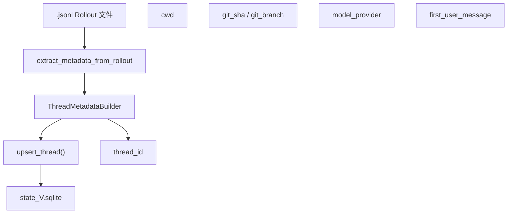
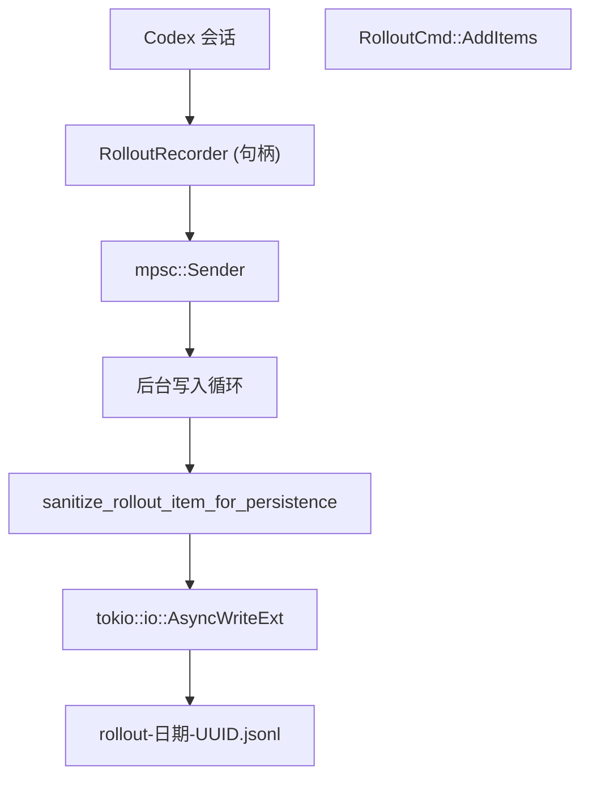

# Rollout 持久化与重放

相关源文件

-   [codex-rs/app-server/tests/common/rollout.rs](https://github.com/openai/codex/blob/d807d44a/codex-rs/app-server/tests/common/rollout.rs)
-   [codex-rs/app-server/tests/suite/v2/review.rs](https://github.com/openai/codex/blob/d807d44a/codex-rs/app-server/tests/suite/v2/review.rs)
-   [codex-rs/app-server/tests/suite/v2/thread_archive.rs](https://github.com/openai/codex/blob/d807d44a/codex-rs/app-server/tests/suite/v2/thread_archive.rs)
-   [codex-rs/app-server/tests/suite/v2/thread_fork.rs](https://github.com/openai/codex/blob/d807d44a/codex-rs/app-server/tests/suite/v2/thread_fork.rs)
-   [codex-rs/app-server/tests/suite/v2/thread_list.rs](https://github.com/openai/codex/blob/d807d44a/codex-rs/app-server/tests/suite/v2/thread_list.rs)
-   [codex-rs/app-server/tests/suite/v2/thread_resume.rs](https://github.com/openai/codex/blob/d807d44a/codex-rs/app-server/tests/suite/v2/thread_resume.rs)
-   [codex-rs/app-server/tests/suite/v2/thread_start.rs](https://github.com/openai/codex/blob/d807d44a/codex-rs/app-server/tests/suite/v2/thread_start.rs)
-   [codex-rs/app-server/tests/suite/v2/thread_unarchive.rs](https://github.com/openai/codex/blob/d807d44a/codex-rs/app-server/tests/suite/v2/thread_unarchive.rs)
-   [codex-rs/app-server/tests/suite/v2/turn_start.rs](https://github.com/openai/codex/blob/d807d44a/codex-rs/app-server/tests/suite/v2/turn_start.rs)
-   [codex-rs/core/src/rollout/list.rs](https://github.com/openai/codex/blob/d807d44a/codex-rs/core/src/rollout/list.rs)
-   [codex-rs/core/src/rollout/metadata.rs](https://github.com/openai/codex/blob/d807d44a/codex-rs/core/src/rollout/metadata.rs)
-   [codex-rs/core/src/rollout/recorder.rs](https://github.com/openai/codex/blob/d807d44a/codex-rs/core/src/rollout/recorder.rs)
-   [codex-rs/core/src/rollout/tests.rs](https://github.com/openai/codex/blob/d807d44a/codex-rs/core/src/rollout/tests.rs)
-   [codex-rs/core/src/state_db.rs](https://github.com/openai/codex/blob/d807d44a/codex-rs/core/src/state_db.rs)
-   [codex-rs/core/src/tools/handlers/agent_jobs.rs](https://github.com/openai/codex/blob/d807d44a/codex-rs/core/src/tools/handlers/agent_jobs.rs)
-   [codex-rs/core/tests/suite/cli_stream.rs](https://github.com/openai/codex/blob/d807d44a/codex-rs/core/tests/suite/cli_stream.rs)
-   [codex-rs/core/tests/suite/rollout_list_find.rs](https://github.com/openai/codex/blob/d807d44a/codex-rs/core/tests/suite/rollout_list_find.rs)
-   [codex-rs/core/tests/suite/sqlite_state.rs](https://github.com/openai/codex/blob/d807d44a/codex-rs/core/tests/suite/sqlite_state.rs)
-   [codex-rs/debug-client/src/client.rs](https://github.com/openai/codex/blob/d807d44a/codex-rs/debug-client/src/client.rs)
-   [codex-rs/state/Cargo.toml](https://github.com/openai/codex/blob/d807d44a/codex-rs/state/Cargo.toml)
-   [codex-rs/state/logs_migrations/0002_logs_feedback_log_body.sql](https://github.com/openai/codex/blob/d807d44a/codex-rs/state/logs_migrations/0002_logs_feedback_log_body.sql)
-   [codex-rs/state/migrations/0002_logs.sql](https://github.com/openai/codex/blob/d807d44a/codex-rs/state/migrations/0002_logs.sql)
-   [codex-rs/state/migrations/0010_logs_process_id.sql](https://github.com/openai/codex/blob/d807d44a/codex-rs/state/migrations/0010_logs_process_id.sql)
-   [codex-rs/state/src/bin/logs_client.rs](https://github.com/openai/codex/blob/d807d44a/codex-rs/state/src/bin/logs_client.rs)
-   [codex-rs/state/src/lib.rs](https://github.com/openai/codex/blob/d807d44a/codex-rs/state/src/lib.rs)
-   [codex-rs/state/src/log_db.rs](https://github.com/openai/codex/blob/d807d44a/codex-rs/state/src/log_db.rs)
-   [codex-rs/state/src/model/log.rs](https://github.com/openai/codex/blob/d807d44a/codex-rs/state/src/model/log.rs)
-   [codex-rs/state/src/model/mod.rs](https://github.com/openai/codex/blob/d807d44a/codex-rs/state/src/model/mod.rs)
-   [codex-rs/state/src/runtime.rs](https://github.com/openai/codex/blob/d807d44a/codex-rs/state/src/runtime.rs)
-   [codex-rs/state/src/runtime/agent_jobs.rs](https://github.com/openai/codex/blob/d807d44a/codex-rs/state/src/runtime/agent_jobs.rs)
-   [codex-rs/state/src/runtime/backfill.rs](https://github.com/openai/codex/blob/d807d44a/codex-rs/state/src/runtime/backfill.rs)
-   [codex-rs/state/src/runtime/logs.rs](https://github.com/openai/codex/blob/d807d44a/codex-rs/state/src/runtime/logs.rs)
-   [codex-rs/tui/src/resume_picker.rs](https://github.com/openai/codex/blob/d807d44a/codex-rs/tui/src/resume_picker.rs)

## 目的与范围

本文档描述了 Codex 的 rollout 持久化系统，该系统将对话历史和会话元数据以 JSONL 格式记录到磁盘。Rollout 文件支持线程恢复，允许检查对话状态以进行调试，并为代理交互提供持久的审计追踪。该系统还包含一个基于 SQLite 的状态数据库，用于对这些 rollout 文件进行索引，以便快速搜索和元数据检索。

有关历史如何在内存中管理并准备给模型消耗的信息，见 [对话历史管理](/openai/codex/3.5-conversation-history-management)。关于压缩如何生成特殊的 rollout 条目，见 [历史压缩系统](/openai/codex/3.5.1-history-compaction-system)。

---

## Rollout 文件格式

Codex 将对话状态持久化到 **rollout 文件**：换行符分隔的 JSON 文件，每一行包含一个包裹了 `RolloutItem` 的 `RolloutLine`。这些文件存储在会话目录下的分层日期结构中，例如 `~/.codex/sessions/2025/05/07/rollout-2025-05-07T17-24-21-<uuid>.jsonl` [codex-rs/core/src/rollout/recorder.rs61-68](https://github.com/openai/codex/blob/d807d44a/codex-rs/core/src/rollout/recorder.rs#L61-L68)

### RolloutLine 结构

rollout 文件中的每一行遵循以下结构：

```
pub struct RolloutLine {    pub timestamp: OffsetDateTime,    pub item: RolloutItem,}
```
`RolloutLine` 类型包裹了 `RolloutItem` 并为每个持久化的事件添加了一个 UTC 时间戳 [codex-rs/core/src/rollout/recorder.rs54-56](https://github.com/openai/codex/blob/d807d44a/codex-rs/core/src/rollout/recorder.rs#L54-L56)

---

## RolloutItem 类型

`RolloutItem` 枚举定义了持久化到 rollout 文件的顶级数据类别：

| 条目类型 | 描述 | 示例用例 |
| --- | --- | --- |
| `ResponseItem` | 原始模型响应和工具调用 | 用户消息、助手回复、工具输出 |
| `EventMsg` | 协议级事件 | `TurnStarted`, `TurnComplete`, `ExecCommandEnd` |
| `TurnContext` | 轮次配置快照 | 轮次开始时捕获的模型、CWD 和策略 |
| `Compacted` | 压缩元数据 | 压缩后的总结消息和被替换的历史记录 |
| `SessionMeta` | 会话级元数据 | 线程 ID、来源和 git 信息 [codex-rs/core/src/rollout/metadata.rs38-63](https://github.com/openai/codex/blob/d807d44a/codex-rs/core/src/rollout/metadata.rs#L38-L63) |

**来源：** [codex-rs/core/src/rollout/recorder.rs53](https://github.com/openai/codex/blob/d807d44a/codex-rs/core/src/rollout/recorder.rs#L53-L53) [codex-rs/core/src/rollout/metadata.rs12-15](https://github.com/openai/codex/blob/d807d44a/codex-rs/core/src/rollout/metadata.rs#L12-L15)

---

## 持久化策略与过滤

Codex 支持由 `EventPersistenceMode` 控制的两种持久化粒度 [codex-rs/core/src/rollout/recorder.rs75](https://github.com/openai/codex/blob/d807d44a/codex-rs/core/src/rollout/recorder.rs#L75-L75)

### 清洗与截断

在条目写入磁盘之前，它们会经过清洗。例如，在 `Extended` 模式下，`ExecCommandEnd` 事件的 `stdout` 和 `stderr` 会被清除，仅保留受限的 `aggregated_output`（最大 10,000 字节），以防止 rollout 文件因海量日志而膨胀 [codex-rs/core/src/rollout/recorder.rs135-160](https://github.com/openai/codex/blob/d807d44a/codex-rs/core/src/rollout/recorder.rs#L135-L160)

### 事件过滤

`is_persisted_response_item` 和 `should_persist_event_msg` 函数（定义在 `policy.rs` 中）决定哪些事件被写入 `.jsonl` 文件。

-   **Limited 模式**：仅保留核心的轮次生命周期和消息事件。
-   **Extended 模式**：增加了工具完成事件和详细的执行总结。

---

## 状态数据库 (SQLite) 索引

为了支持对数千个 rollout 文件的快速列举和搜索，Codex 维护了一个 SQLite 数据库 (`state_V.sqlite`)，该数据库镜像了从 JSONL 文件中提取的元数据 [codex-rs/state/src/lib.rs1-5](https://github.com/openai/codex/blob/d807d44a/codex-rs/state/src/lib.rs#L1-L5)

### 元数据提取

`StateRuntime` 使用 `extract_metadata_from_rollout` 来解析 JSONL 文件并填充 `ThreadMetadata` 结构体 [codex-rs/core/src/rollout/metadata.rs96-132](https://github.com/openai/codex/blob/d807d44a/codex-rs/core/src/rollout/metadata.rs#L96-L132)


### 回填编排

当 Codex 启动时，它会检查 `BackfillStatus`。如果不完整，它会派生一个后台任务 `backfill_sessions` 来扫描文件系统并将 SQLite 数据库与现有的 rollout 文件同步 [codex-rs/core/src/state_db.rs54-60](https://github.com/openai/codex/blob/d807d44a/codex-rs/core/src/state_db.rs#L54-L60)。它使用租约机制 (`try_claim_backfill`) 确保一次只有一个实例执行回填 [codex-rs/core/src/rollout/metadata.rs152-168](https://github.com/openai/codex/blob/d807d44a/codex-rs/core/src/rollout/metadata.rs#L152-L168)

**来源：** [codex-rs/state/src/runtime.rs70-83](https://github.com/openai/codex/blob/d807d44a/codex-rs/state/src/runtime.rs#L70-L83) [codex-rs/core/src/state_db.rs28-43](https://github.com/openai/codex/blob/d807d44a/codex-rs/core/src/state_db.rs#L28-L43) [codex-rs/core/src/rollout/metadata.rs134-168](https://github.com/openai/codex/blob/d807d44a/codex-rs/core/src/rollout/metadata.rs#L134-L168)

---

## RolloutRecorder 架构

`RolloutRecorder` 管理将条目异步写入文件系统的过程。


### 命令处理

记录器通过内部循环处理命令：

-   `AddItems(Vec<RolloutItem>)`：缓冲并写入新事件 [codex-rs/core/src/rollout/recorder.rs95](https://github.com/openai/codex/blob/d807d44a/codex-rs/core/src/rollout/recorder.rs#L95-L95)
-   `Flush`：确保所有挂起的写入都已提交到磁盘 [codex-rs/core/src/rollout/recorder.rs100](https://github.com/openai/codex/blob/d807d44a/codex-rs/core/src/rollout/recorder.rs#L100-L100)
-   `Shutdown`：干净地关闭文件句柄 [codex-rs/core/src/rollout/recorder.rs103](https://github.com/openai/codex/blob/d807d44a/codex-rs/core/src/rollout/recorder.rs#L103-L103)

**来源：** [codex-rs/core/src/rollout/recorder.rs71-106](https://github.com/openai/codex/blob/d807d44a/codex-rs/core/src/rollout/recorder.rs#L71-L106) [codex-rs/core/src/rollout/recorder.rs137-160](https://github.com/openai/codex/blob/d807d44a/codex-rs/core/src/rollout/recorder.rs#L137-L160)

---

## 通过事件重放恢复会话

恢复会话涉及定位正确的 rollout 文件并重放其内容，以重建 `ContextManager` 状态。

### 线程发现

`ThreadManager` 使用 `list_threads`（如果 SQLite 索引可用，则回退到 `list_threads_db`）来查找会话文件 [codex-rs/core/src/rollout/recorder.rs165-187](https://github.com/openai/codex/blob/d807d44a/codex-rs/core/src/rollout/recorder.rs#L165-L187)。用户可以按 `SessionSource` 或 `model_provider` 进行过滤 [codex-rs/core/src/rollout/list.rs119-124](https://github.com/openai/codex/blob/d807d44a/codex-rs/core/src/rollout/list.rs#L119-L124)

### 重放逻辑

当一个线程被恢复（例如通过 `thread/resume` 端点）时，会发生以下情况：

1.  **加载**：`load_rollout_items` 读取 JSONL 并将其解析为 `Vec<RolloutItem>` [codex-rs/core/src/rollout/metadata.rs100-101](https://github.com/openai/codex/blob/d807d44a/codex-rs/core/src/rollout/metadata.rs#L100-L101)
2.  **初始化**：使用 `InitialHistory::Resumed` 启动一个新会话 [codex-rs/app-server/tests/suite/v2/thread_resume.rs154-184](https://github.com/openai/codex/blob/d807d44a/codex-rs/app-server/tests/suite/v2/thread_resume.rs#L154-L184)
3.  **重建**：系统迭代这些条目：
    -   `ResponseItem` 被添加回对话历史记录。
    -   `TurnContext` 条目恢复策略（沙箱、审批）。
    -   `Compacted` 条目恢复总结和修剪后的历史状态 [codex-rs/core/src/rollout/list.rs22-25](https://github.com/openai/codex/blob/d807d44a/codex-rs/core/src/rollout/list.rs#L22-L25)

### 恢复验证

如果 rollout 文件丢失，或者线程尚未“实体化”（例如线程已启动但从未发送过用户消息来触发第一次磁盘写入），系统将拒绝恢复 [codex-rs/app-server/tests/suite/v2/thread_resume.rs107-151](https://github.com/openai/codex/blob/d807d44a/codex-rs/app-server/tests/suite/v2/thread_resume.rs#L107-L151)

**来源：** [codex-rs/core/src/rollout/recorder.rs165-187](https://github.com/openai/codex/blob/d807d44a/codex-rs/core/src/rollout/recorder.rs#L165-L187) [codex-rs/core/src/rollout/list.rs28-74](https://github.com/openai/codex/blob/d807d44a/codex-rs/core/src/rollout/list.rs#L28-L74) [codex-rs/app-server/tests/suite/v2/thread_resume.rs107-184](https://github.com/openai/codex/blob/d807d44a/codex-rs/app-server/tests/suite/v2/thread_resume.rs#L107-L184)

---

## TUI 会话选择器

终端用户界面提供了一个 `resume_picker`，用于交互式选择要恢复或派生的会话。

-   **分页**：使用 `Cursor`（时间戳 + UUID）从 `RolloutRecorder` 获取线程分页 [codex-rs/tui/src/resume_picker.rs122-136](https://github.com/openai/codex/blob/d807d44a/codex-rs/tui/src/resume_picker.rs#L122-L136)
-   **排序**：支持在 `CreatedAt` 和 `UpdatedAt` 之间切换 [codex-rs/tui/src/resume_picker.rs109-111](https://github.com/openai/codex/blob/d807d44a/codex-rs/tui/src/resume_picker.rs#L109-L111)
-   **过滤**：允许按工作目录 (CWD) 或 git 分支搜索 [codex-rs/tui/src/resume_picker.rs149-153](https://github.com/openai/codex/blob/d807d44a/codex-rs/tui/src/resume_picker.rs#L149-L153)

**来源：** [codex-rs/tui/src/resume_picker.rs40-111](https://github.com/openai/codex/blob/d807d44a/codex-rs/tui/src/resume_picker.rs#L40-L111) [codex-rs/tui/src/resume_picker.rs157-179](https://github.com/openai/codex/blob/d807d44a/codex-rs/tui/src/resume_picker.rs#L157-L179)
