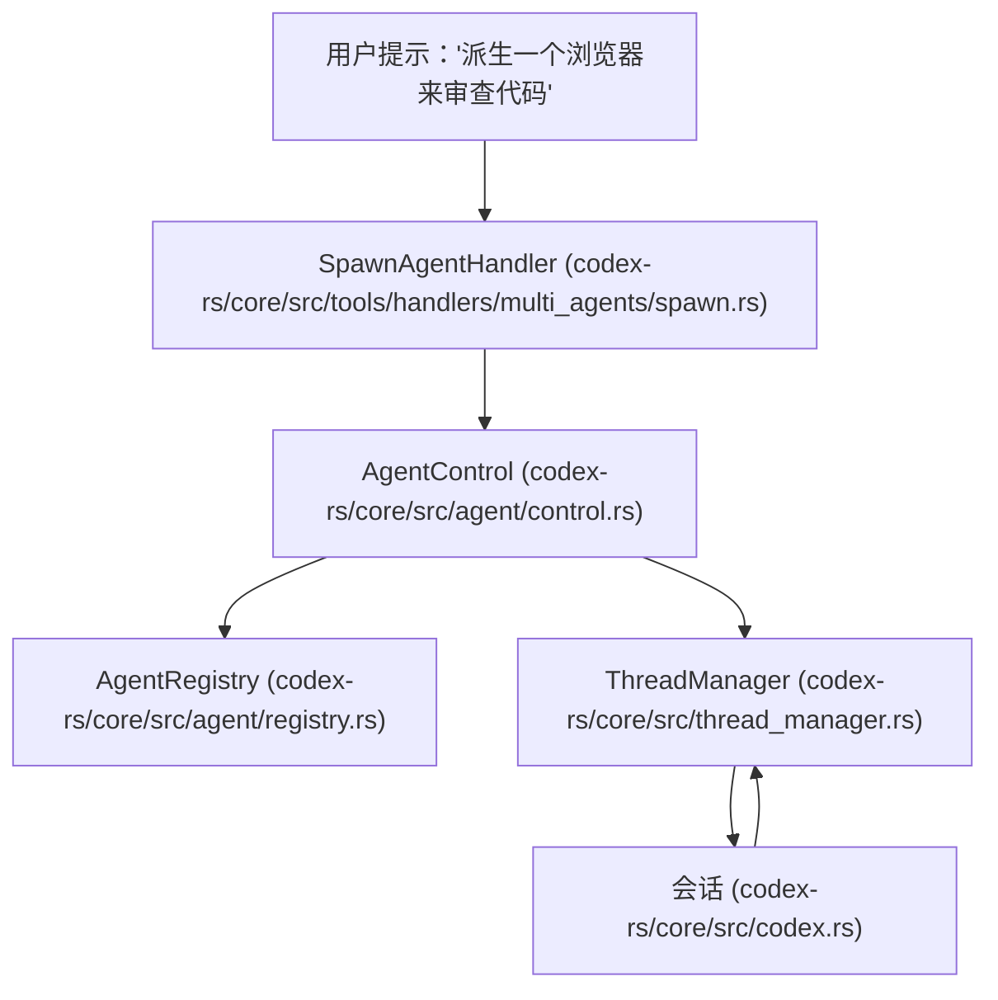

# 线程管理与多代理

相关源文件

-   [codex-rs/app-server/tests/suite/v2/mcp_server_elicitation.rs](https://github.com/openai/codex/blob/d807d44a/codex-rs/app-server/tests/suite/v2/mcp_server_elicitation.rs)
-   [codex-rs/cli/src/mcp_cmd.rs](https://github.com/openai/codex/blob/d807d44a/codex-rs/cli/src/mcp_cmd.rs)
-   [codex-rs/cli/tests/mcp_add_remove.rs](https://github.com/openai/codex/blob/d807d44a/codex-rs/cli/tests/mcp_add_remove.rs)
-   [codex-rs/cli/tests/mcp_list.rs](https://github.com/openai/codex/blob/d807d44a/codex-rs/cli/tests/mcp_list.rs)
-   [codex-rs/core/src/agent/builtins/explorer.toml](https://github.com/openai/codex/blob/d807d44a/codex-rs/core/src/agent/builtins/explorer.toml)
-   [codex-rs/core/src/agent/control.rs](https://github.com/openai/codex/blob/d807d44a/codex-rs/core/src/agent/control.rs)
-   [codex-rs/core/src/agent/control_tests.rs](https://github.com/openai/codex/blob/d807d44a/codex-rs/core/src/agent/control_tests.rs)
-   [codex-rs/core/src/agent/mod.rs](https://github.com/openai/codex/blob/d807d44a/codex-rs/core/src/agent/mod.rs)
-   [codex-rs/core/src/agent/registry.rs](https://github.com/openai/codex/blob/d807d44a/codex-rs/core/src/agent/registry.rs)
-   [codex-rs/core/src/agent/registry_tests.rs](https://github.com/openai/codex/blob/d807d44a/codex-rs/core/src/agent/registry_tests.rs)
-   [codex-rs/core/src/agent/role.rs](https://github.com/openai/codex/blob/d807d44a/codex-rs/core/src/agent/role.rs)
-   [codex-rs/core/src/agent/role_tests.rs](https://github.com/openai/codex/blob/d807d44a/codex-rs/core/src/agent/role_tests.rs)
-   [codex-rs/core/src/codex_delegate.rs](https://github.com/openai/codex/blob/d807d44a/codex-rs/core/src/codex_delegate.rs)
-   [codex-rs/core/src/mcp_connection_manager.rs](https://github.com/openai/codex/blob/d807d44a/codex-rs/core/src/mcp_connection_manager.rs)
-   [codex-rs/core/src/mcp_connection_manager_tests.rs](https://github.com/openai/codex/blob/d807d44a/codex-rs/core/src/mcp_connection_manager_tests.rs)
-   [codex-rs/core/src/state/session.rs](https://github.com/openai/codex/blob/d807d44a/codex-rs/core/src/state/session.rs)
-   [codex-rs/core/src/state/turn.rs](https://github.com/openai/codex/blob/d807d44a/codex-rs/core/src/state/turn.rs)
-   [codex-rs/core/src/tasks/mod.rs](https://github.com/openai/codex/blob/d807d44a/codex-rs/core/src/tasks/mod.rs)
-   [codex-rs/core/src/thread_manager.rs](https://github.com/openai/codex/blob/d807d44a/codex-rs/core/src/thread_manager.rs)
-   [codex-rs/core/src/tools/handlers/multi_agents.rs](https://github.com/openai/codex/blob/d807d44a/codex-rs/core/src/tools/handlers/multi_agents.rs)
-   [codex-rs/core/src/tools/handlers/multi_agents/close_agent.rs](https://github.com/openai/codex/blob/d807d44a/codex-rs/core/src/tools/handlers/multi_agents/close_agent.rs)
-   [codex-rs/core/src/tools/handlers/multi_agents/resume_agent.rs](https://github.com/openai/codex/blob/d807d44a/codex-rs/core/src/tools/handlers/multi_agents/resume_agent.rs)
-   [codex-rs/core/src/tools/handlers/multi_agents/send_input.rs](https://github.com/openai/codex/blob/d807d44a/codex-rs/core/src/tools/handlers/multi_agents/send_input.rs)
-   [codex-rs/core/src/tools/handlers/multi_agents/spawn.rs](https://github.com/openai/codex/blob/d807d44a/codex-rs/core/src/tools/handlers/multi_agents/spawn.rs)
-   [codex-rs/core/src/tools/handlers/multi_agents/wait.rs](https://github.com/openai/codex/blob/d807d44a/codex-rs/core/src/tools/handlers/multi_agents/wait.rs)
-   [codex-rs/core/src/tools/handlers/multi_agents_tests.rs](https://github.com/openai/codex/blob/d807d44a/codex-rs/core/src/tools/handlers/multi_agents_tests.rs)
-   [codex-rs/core/src/tools/handlers/tool_search_tests.rs](https://github.com/openai/codex/blob/d807d44a/codex-rs/core/src/tools/handlers/tool_search_tests.rs)
-   [codex-rs/core/templates/agents/orchestrator.md](https://github.com/openai/codex/blob/d807d44a/codex-rs/core/templates/agents/orchestrator.md?plain=1)
-   [codex-rs/core/templates/collab/experimental_prompt.md](https://github.com/openai/codex/blob/d807d44a/codex-rs/core/templates/collab/experimental_prompt.md?plain=1)
-   [codex-rs/core/tests/suite/rmcp_client.rs](https://github.com/openai/codex/blob/d807d44a/codex-rs/core/tests/suite/rmcp_client.rs)
-   [codex-rs/core/tests/suite/subagent_notifications.rs](https://github.com/openai/codex/blob/d807d44a/codex-rs/core/tests/suite/subagent_notifications.rs)
-   [codex-rs/core/tests/suite/truncation.rs](https://github.com/openai/codex/blob/d807d44a/codex-rs/core/tests/suite/truncation.rs)
-   [codex-rs/core/tests/suite/user_shell_cmd.rs](https://github.com/openai/codex/blob/d807d44a/codex-rs/core/tests/suite/user_shell_cmd.rs)
-   [codex-rs/rmcp-client/src/rmcp_client.rs](https://github.com/openai/codex/blob/d807d44a/codex-rs/rmcp-client/src/rmcp_client.rs)
-   [codex-rs/rmcp-client/tests/streamable_http_recovery.rs](https://github.com/openai/codex/blob/d807d44a/codex-rs/rmcp-client/tests/streamable_http_recovery.rs)

## 目的与范围

本文档描述了 Codex 如何管理对话线程并编排多代理工作流。线程管理包括由 `ThreadManager` 和 `ThreadManagerState` 协调的生命周期操作（创建、恢复、派生），而多代理支持则允许为代码审查、历史压缩和协作问题解决等任务派生专门的子代理。每个线程维持独立的状态，代理间的通信通过 `AgentControl` 和专门的工具处理程序处理。

## 线程生命周期与 ThreadManager

`ThreadManager` 是所有活跃 `CodexThread` 实例的顶级所有者。它管理它们的创建、持久化，并提供对共享服务（如 `AuthManager`、`ModelsManager` 和 `McpManager`）的访问。

### ThreadManager 架构

`ThreadManager` 使用包裹在 `Arc` 中的内部 `ThreadManagerState`，以允许在线程间安全共享以及与 `AgentControl` 共享。

来源： [codex-rs/core/src/thread_manager.rs142-162](https://github.com/openai/codex/blob/d807d44a/codex-rs/core/src/thread_manager.rs#L142-L162) [codex-rs/core/src/thread_manager.rs164-190](https://github.com/openai/codex/blob/d807d44a/codex-rs/core/src/thread_manager.rs#L164-L190)

### 核心操作

| 操作 | 实现 | 描述 |
| --- | --- | --- |
| **创建 (Spawn)** | `Codex::spawn` | 创建一个全新的会话。如果使用 `InitialHistory::New`，则从零开始。[codex-rs/core/src/codex.rs380-410](https://github.com/openai/codex/blob/d807d44a/codex-rs/core/src/codex.rs#L380-L410) |
| **恢复 (Resume)** | `InitialHistory::Resume` | 从 `.jsonl` rollout 文件中重放事件，以重建 `ContextManager` 状态。[codex-rs/core/src/codex.rs411-420](https://github.com/openai/codex/blob/d807d44a/codex-rs/core/src/codex.rs#L411-L420) |
| **派生 (Fork)** | `InitialHistory::Fork` | 与恢复类似，但在继承父级历史的同时分配一个新的 `ThreadId`。[codex-rs/core/src/codex.rs421-430](https://github.com/openai/codex/blob/d807d44a/codex-rs/core/src/codex.rs#L421-L430) |

## 多代理架构

Codex 实现了一个层级化多代理系统，其中“父”会话可以通过 `AgentControl` 派生“子代理”。这主要由 `multi_agents` 工具处理程序驱动。

### AgentControl 与注册表

`AgentControl` 是多代理操作的控制平面句柄。它由每个 `Session` 持有，并提供派生新代理及促进代理间通信的能力。

来源： [codex-rs/core/src/agent/control.rs85-101](https://github.com/openai/codex/blob/d807d44a/codex-rs/core/src/agent/control.rs#L85-L101) [codex-rs/core/src/agent/control.rs126-160](https://github.com/openai/codex/blob/d807d44a/codex-rs/core/src/agent/control.rs#L126-L160)

### 子代理角色与配置

当一个代理被派生时，可以为其分配特定的“角色”（例如 `explorer`、`reviewer`）。`apply_role_to_config` 函数加载特定角色的配置（来自内置或用户 `config.toml`），并将其覆盖在会话配置上。

-   **角色解析**：使用 `resolve_role_config` 查找 `AgentRoleConfig`。[codex-rs/core/src/agent/role.rs112-120](https://github.com/openai/codex/blob/d807d44a/codex-rs/core/src/agent/role.rs#L112-L120)
-   **保留策略**：确保父级的 `model_provider` 和 `profile` 被保留，除非角色明确覆盖它们。[codex-rs/core/src/agent/role.rs122-141](https://github.com/openai/codex/blob/d807d44a/codex-rs/core/src/agent/role.rs#L122-L141)
-   **分层**：角色作为高优先级层插入到 `ConfigLayerStack` 中。[codex-rs/core/src/agent/role.rs174-188](https://github.com/openai/codex/blob/d807d44a/codex-rs/core/src/agent/role.rs#L174-L188)

## 代理间通信 (协作工具)

代理间的通信通过 `codex-rs/core/src/tools/handlers/multi_agents.rs` 中定义的一组专门工具处理。

| 工具 | 处理程序 | 描述 |
| --- | --- | --- |
| `spawn_agent` | `SpawnAgentHandler` | 携带消息或条目派生一个新的子代理。[codex-rs/core/src/tools/handlers/multi_agents/spawn.rs](https://github.com/openai/codex/blob/d807d44a/codex-rs/core/src/tools/handlers/multi_agents/spawn.rs) |
| `send_input` | `SendInputHandler` | 向现有子代理发送消息。[codex-rs/core/src/tools/handlers/multi_agents/send_input.rs](https://github.com/openai/codex/blob/d807d44a/codex-rs/core/src/tools/handlers/multi_agents/send_input.rs) |
| `wait_agent` | `WaitAgentHandler` | 暂停父级轮次，直到子代理达到最终状态。[codex-rs/core/src/tools/handlers/multi_agents/wait.rs](https://github.com/openai/codex/blob/d807d44a/codex-rs/core/src/tools/handlers/multi_agents/wait.rs) |
| `resume_agent` | `ResumeAgentHandler` | 恢复正在等待输入的子代理。[codex-rs/core/src/tools/handlers/multi_agents/resume_agent.rs](https://github.com/openai/codex/blob/d807d44a/codex-rs/core/src/tools/handlers/multi_agents/resume_agent.rs) |

### 子代理事件转发

当子代理交互式运行（例如在 `ReviewTask` 期间）时，`codex_delegate` 模块管理操作和事件的双向流。

> **[Mermaid sequence]**
> *(图表结构无法解析)*

来源： [codex-rs/core/src/codex_delegate.rs63-136](https://github.com/openai/codex/blob/d807d44a/codex-rs/core/src/codex_delegate.rs#L63-L136) [codex-rs/core/src/codex_delegate.rs112-121](https://github.com/openai/codex/blob/d807d44a/codex-rs/core/src/codex_delegate.rs#L112-L121)

## 会话任务与多代理协调

多代理工作流通常被封装在 `SessionTask` 实现中。

-   **ReviewTask**：专门派生一个子代理来执行代码审查。它使用 `run_codex_thread_one_shot` 在子代理上触发单个轮次并解析结果。[codex-rs/core/src/tasks/review.rs54-85](https://github.com/openai/codex/blob/d807d44a/codex-rs/core/src/tasks/review.rs#L54-L85)
-   **CompactTask**：在达到 Token 限制时，可以派生一个子代理来总结对话历史。[codex-rs/core/src/tasks/compact.rs](https://github.com/openai/codex/blob/d807d44a/codex-rs/core/src/tasks/compact.rs)
-   **Guardian**：虽然在 `ThreadManager` 意义上不是完整的子代理，但 `Guardian` 系统使用类似的委托逻辑，在请求人工批准之前分析工具调用是否安全。[codex-rs/core/src/codex_delegate.rs42-50](https://github.com/openai/codex/blob/d807d44a/codex-rs/core/src/codex_delegate.rs#L42-L50)

## ThreadEventStore 与状态管理

为了支持 TUI 和其他允许在线程间切换的界面，Codex 使用事件缓冲。

-   **SessionState**：存储 `ContextManager`（历史记录）、`session_configuration` 和 `granted_permissions`。[codex-rs/core/src/state/session.rs20-36](https://github.com/openai/codex/blob/d807d44a/codex-rs/core/src/state/session.rs#L20-L36)
-   **事件重放**：当线程被恢复或派生时，`InitialHistory` 逻辑通过重新处理事件来确保 `ContextManager` 被重建。[codex-rs/core/src/codex.rs411-430](https://github.com/openai/codex/blob/d807d44a/codex-rs/core/src/codex.rs#L411-L430)
-   **Token 跟踪**：`SessionState` 跟踪整个会话的总 Token 使用情况，如果子代理的贡献被合并回，也包括它们的使用情况。[codex-rs/core/src/state/session.rs132-135](https://github.com/openai/codex/blob/d807d44a/codex-rs/core/src/state/session.rs#L132-L135)

来源： [codex-rs/core/src/state/session.rs20-55](https://github.com/openai/codex/blob/d807d44a/codex-rs/core/src/state/session.rs#L20-L55) [codex-rs/core/src/codex.rs411-430](https://github.com/openai/codex/blob/d807d44a/codex-rs/core/src/codex.rs#L411-L430)
