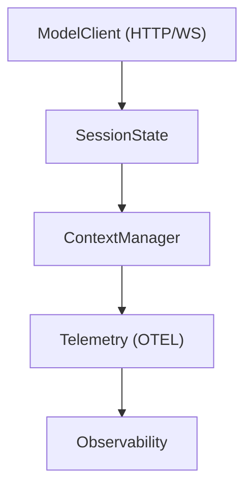

# 会话任务与轮次状态

相关源文件

-   [codex-rs/app-server/tests/suite/v2/mcp_server_elicitation.rs](https://github.com/openai/codex/blob/d807d44a/codex-rs/app-server/tests/suite/v2/mcp_server_elicitation.rs)
-   [codex-rs/cli/src/mcp_cmd.rs](https://github.com/openai/codex/blob/d807d44a/codex-rs/cli/src/mcp_cmd.rs)
-   [codex-rs/cli/tests/mcp_add_remove.rs](https://github.com/openai/codex/blob/d807d44a/codex-rs/cli/tests/mcp_add_remove.rs)
-   [codex-rs/cli/tests/mcp_list.rs](https://github.com/openai/codex/blob/d807d44a/codex-rs/cli/tests/mcp_list.rs)
-   [codex-rs/core/src/codex_tests.rs](https://github.com/openai/codex/blob/d807d44a/codex-rs/core/src/codex_tests.rs)
-   [codex-rs/core/src/codex_tests_guardian.rs](https://github.com/openai/codex/blob/d807d44a/codex-rs/core/src/codex_tests_guardian.rs)
-   [codex-rs/core/src/mcp_connection_manager.rs](https://github.com/openai/codex/blob/d807d44a/codex-rs/core/src/mcp_connection_manager.rs)
-   [codex-rs/core/src/mcp_connection_manager_tests.rs](https://github.com/openai/codex/blob/d807d44a/codex-rs/core/src/mcp_connection_manager_tests.rs)
-   [codex-rs/core/src/state/service.rs](https://github.com/openai/codex/blob/d807d44a/codex-rs/core/src/state/service.rs)
-   [codex-rs/core/src/state/session.rs](https://github.com/openai/codex/blob/d807d44a/codex-rs/core/src/state/session.rs)
-   [codex-rs/core/src/state/turn.rs](https://github.com/openai/codex/blob/d807d44a/codex-rs/core/src/state/turn.rs)
-   [codex-rs/core/src/tasks/mod.rs](https://github.com/openai/codex/blob/d807d44a/codex-rs/core/src/tasks/mod.rs)
-   [codex-rs/core/src/tools/handlers/tool_search_tests.rs](https://github.com/openai/codex/blob/d807d44a/codex-rs/core/src/tools/handlers/tool_search_tests.rs)
-   [codex-rs/core/src/tools/runtimes/shell/unix_escalation.rs](https://github.com/openai/codex/blob/d807d44a/codex-rs/core/src/tools/runtimes/shell/unix_escalation.rs)
-   [codex-rs/core/src/tools/runtimes/shell/unix_escalation_tests.rs](https://github.com/openai/codex/blob/d807d44a/codex-rs/core/src/tools/runtimes/shell/unix_escalation_tests.rs)
-   [codex-rs/core/tests/suite/rmcp_client.rs](https://github.com/openai/codex/blob/d807d44a/codex-rs/core/tests/suite/rmcp_client.rs)
-   [codex-rs/core/tests/suite/skill_approval.rs](https://github.com/openai/codex/blob/d807d44a/codex-rs/core/tests/suite/skill_approval.rs)
-   [codex-rs/core/tests/suite/truncation.rs](https://github.com/openai/codex/blob/d807d44a/codex-rs/core/tests/suite/truncation.rs)
-   [codex-rs/core/tests/suite/user_shell_cmd.rs](https://github.com/openai/codex/blob/d807d44a/codex-rs/core/tests/suite/user_shell_cmd.rs)
-   [codex-rs/rmcp-client/src/rmcp_client.rs](https://github.com/openai/codex/blob/d807d44a/codex-rs/rmcp-client/src/rmcp_client.rs)
-   [codex-rs/rmcp-client/tests/streamable_http_recovery.rs](https://github.com/openai/codex/blob/d807d44a/codex-rs/rmcp-client/tests/streamable_http_recovery.rs)

本页面解释了 `SessionTask` trait、后台任务的生命周期（启动/中止）、用于跟踪挂起操作的 `TurnState`，以及如何跨轮次监控 Token 使用情况。

---

## 概述

在 Codex 中，与模型的每次交互或特定工作流（如审查或 shell 命令）都被封装为一个**会话任务 (Session Task)**。这些任务作为由 `Session` 管理的后台 Tokio 任务异步运行。这种架构允许系统处理长时间运行的操作（如工具执行或多步推理），同时保持对中断或新用户输入的响应。

---

## SessionTask Trait 与生命周期

`SessionTask` trait 为驱动 `Session` 轮次的任何工作单元定义了接口。实现包括 `RegularTask`（标准聊天）、`ReviewTask`（子代理代码审查）和 `UserShellCommandTask`（直接终端交互）。

### Trait 定义

```
#[async_trait]pub(crate) trait SessionTask: Send + Sync + 'static {    fn kind(&self) -> TaskKind;    fn span_name(&self) -> &'static str;    async fn run(        self: Arc<Self>,        session: Arc<SessionTaskContext>,        ctx: Arc<TurnContext>,        input: Vec<UserInput>,        cancellation_token: CancellationToken,    ) -> Option<String>;    async fn abort(&self, session: Arc<SessionTaskContext>, ctx: Arc<TurnContext>);}
```
来源： [codex-rs/core/src/tasks/mod.rs113-145](https://github.com/openai/codex/blob/d807d44a/codex-rs/core/src/tasks/mod.rs#L113-L145)

### 任务生命周期 (启动与中止)

任务通过 `Session::spawn_task` 启动。在启动新任务之前，会话会自动中止任何现有任务，以确保每个线程只有一个活跃的“轮次”。

**任务执行流**

> **[Mermaid sequence]**
> *(图表结构无法解析)*

来源： [codex-rs/core/src/tasks/mod.rs148-232](https://github.com/openai/codex/blob/d807d44a/codex-rs/core/src/tasks/mod.rs#L148-L232) [codex-rs/core/src/tasks/mod.rs252-270](https://github.com/openai/codex/blob/d807d44a/codex-rs/core/src/tasks/mod.rs#L252-L270)

---

## 轮次状态与挂起操作

在任务运行期间，系统维护一个 `TurnContext` 并跟踪活跃轮次的状态。这包括计时、模型信息以及任何挂起的操作（如工具调用或批准请求）。

### TurnContext 与 SessionTaskContext

-   **`TurnContext`**：包含特定轮次的不可变参数，如 `sub_id`（提交 ID）、选定的 `ModelInfo` 和 `SandboxPolicy` [codex-rs/core/src/codex.rs188-212](https://github.com/openai/codex/blob/d807d44a/codex-rs/core/src/codex.rs#L188-L212)
-   **`SessionTaskContext`**：`Session` 的轻量级包装器，为任务提供对核心服务（如 `AuthManager` 和 `ModelsManager`）的访问权限，而无需暴露整个会话的内部状态 [codex-rs/core/src/tasks/mod.rs82-102](https://github.com/openai/codex/blob/d807d44a/codex-rs/core/src/tasks/mod.rs#L82-L102)

### 活跃轮次管理

`Session` 在 `ActiveTurn` 结构中跟踪当前运行的任务，该结构持有 `JoinHandle` 和 `CancellationToken` [codex-rs/core/src/state/session.rs19-36](https://github.com/openai/codex/blob/d807d44a/codex-rs/core/src/state/session.rs#L19-L36)

| 组件 | 职责 |
| --- | --- |
| `CancellationToken` | 将取消操作从 `Session` 传播到 `SessionTask::run` 循环 [codex-rs/core/src/tasks/mod.rs134-135](https://github.com/openai/codex/blob/d807d44a/codex-rs/core/src/tasks/mod.rs#L134-L135) |
| `TurnTimingState` | 跟踪轮次开始和完成的挂钟时间 [codex-rs/core/src/tasks/mod.rs160-164](https://github.com/openai/codex/blob/d807d44a/codex-rs/core/src/tasks/mod.rs#L160-L164) |
| `TurnAbortReason` | 枚举（例如 `Interrupted`, `Replaced`, `Errored`），描述任务停止的原因 [codex-rs/core/src/tasks/mod.rs33-35](https://github.com/openai/codex/blob/d807d44a/codex-rs/core/src/tasks/mod.rs#L33-L35) |

来源： [codex-rs/core/src/tasks/mod.rs31-48](https://github.com/openai/codex/blob/d807d44a/codex-rs/core/src/tasks/mod.rs#L31-L48) [codex-rs/core/src/state/session.rs19-36](https://github.com/openai/codex/blob/d807d44a/codex-rs/core/src/state/session.rs#L19-L36)

---

## Token 使用情况跟踪

Codex 在会话和轮次两个级别跟踪 Token 消耗。这些数据用于 UI 状态指示器、频率限制和遥测。

### Token 指标数据流

每当 `ModelClient` 收到来自 LLM 提供商的响应时，Token 使用情况都会更新。`SessionState` 将这些数据汇总到 `TokenUsageInfo` 快照中。


来源： [codex-rs/core/src/state/session.rs103-113](https://github.com/openai/codex/blob/d807d44a/codex-rs/core/src/state/session.rs#L103-L113) [codex-rs/core/src/tasks/mod.rs42-43](https://github.com/openai/codex/blob/d807d44a/codex-rs/core/src/tasks/mod.rs#L42-L43) [codex-rs/core/src/state/session.rs128-135](https://github.com/openai/codex/blob/d807d44a/codex-rs/core/src/state/session.rs#L128-L135)

### 关键函数与指标

-   **`total_token_usage()`**：通过对存储在 `ContextManager` 中的整个对话历史记录的输入和输出 Token 求和来计算 [codex-rs/core/src/state/session.rs132-135](https://github.com/openai/codex/blob/d807d44a/codex-rs/core/src/state/session.rs#L132-L135)
-   **`TURN_TOKEN_USAGE_METRIC`**：一个 OpenTelemetry 计数器，记录特定任务执行期间消耗的 Token [codex-rs/core/src/tasks/mod.rs42-43](https://github.com/openai/codex/blob/d807d44a/codex-rs/core/src/tasks/mod.rs#L42-L43)
-   **`TokenCountEvent`**：向客户端（例如 TUI 或 IDE）发出的协议事件，用于实时更新使用情况计数器 [codex-rs/core/src/codex_tests.rs40-42](https://github.com/openai/codex/blob/d807d44a/codex-rs/core/src/codex_tests.rs#L40-L42)

来源： [codex-rs/core/src/state/session.rs103-135](https://github.com/openai/codex/blob/d807d44a/codex-rs/core/src/state/session.rs#L103-L135) [codex-rs/core/src/tasks/mod.rs40-43](https://github.com/openai/codex/blob/d807d44a/codex-rs/core/src/tasks/mod.rs#L40-L43)

---

## 专门的任务实现

| 任务 | 文件 | 目的 |
| --- | --- | --- |
| `RegularTask` | [codex-rs/core/src/tasks/regular.rs](https://github.com/openai/codex/blob/d807d44a/codex-rs/core/src/tasks/regular.rs) | 支持工具调用的标准 LLM 轮次。 |
| `ReviewTask` | [codex-rs/core/src/tasks/review.rs](https://github.com/openai/codex/blob/d807d44a/codex-rs/core/src/tasks/review.rs) | 编排一个“Guardian”子代理来审查代码更改。 |
| `UserShellCommandTask` | [codex-rs/core/src/tasks/user_shell.rs](https://github.com/openai/codex/blob/d807d44a/codex-rs/core/src/tasks/user_shell.rs) | 处理由用户发起的交互式 shell 命令。 |
| `CompactTask` | [codex-rs/core/src/tasks/compact.rs](https://github.com/openai/codex/blob/d807d44a/codex-rs/core/src/tasks/compact.rs) | 管理对话历史总结和上下文窗口修剪。 |

来源： [codex-rs/core/src/tasks/mod.rs51-58](https://github.com/openai/codex/blob/d807d44a/codex-rs/core/src/tasks/mod.rs#L51-L58)
