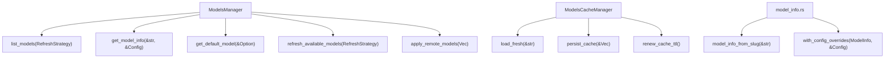
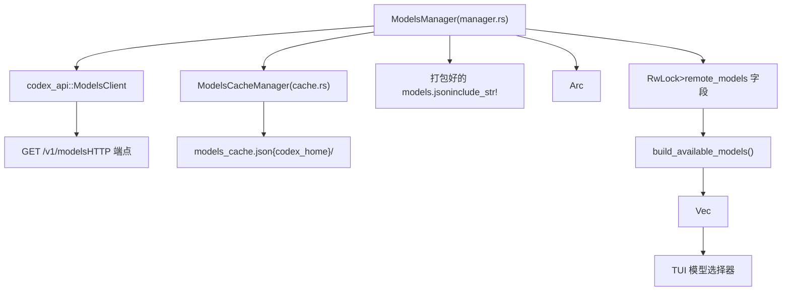
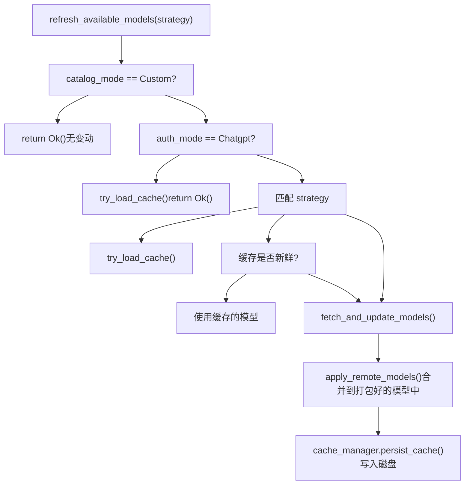
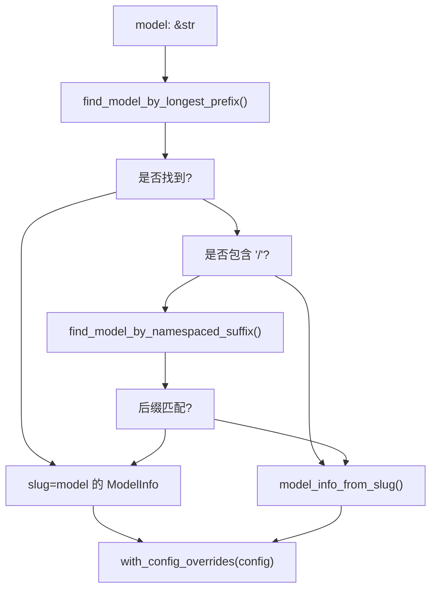

# 模型管理器

相关源文件

-   [codex-rs/app-server-protocol/schema/json/v2/ModelListResponse.json](https://github.com/openai/codex/blob/d807d44a/codex-rs/app-server-protocol/schema/json/v2/ModelListResponse.json)
-   [codex-rs/app-server-protocol/schema/typescript/v2/Model.ts](https://github.com/openai/codex/blob/d807d44a/codex-rs/app-server-protocol/schema/typescript/v2/Model.ts)
-   [codex-rs/app-server-protocol/schema/typescript/v2/ModelUpgradeInfo.ts](https://github.com/openai/codex/blob/d807d44a/codex-rs/app-server-protocol/schema/typescript/v2/ModelUpgradeInfo.ts)
-   [codex-rs/app-server/src/models.rs](https://github.com/openai/codex/blob/d807d44a/codex-rs/app-server/src/models.rs)
-   [codex-rs/app-server/tests/common/models_cache.rs](https://github.com/openai/codex/blob/d807d44a/codex-rs/app-server/tests/common/models_cache.rs)
-   [codex-rs/app-server/tests/suite/v2/model_list.rs](https://github.com/openai/codex/blob/d807d44a/codex-rs/app-server/tests/suite/v2/model_list.rs)
-   [codex-rs/codex-api/src/endpoint/models.rs](https://github.com/openai/codex/blob/d807d44a/codex-rs/codex-api/src/endpoint/models.rs)
-   [codex-rs/codex-api/tests/models_integration.rs](https://github.com/openai/codex/blob/d807d44a/codex-rs/codex-api/tests/models_integration.rs)
-   [codex-rs/core/models.json](https://github.com/openai/codex/blob/d807d44a/codex-rs/core/models.json)
-   [codex-rs/core/src/models_manager/cache.rs](https://github.com/openai/codex/blob/d807d44a/codex-rs/core/src/models_manager/cache.rs)
-   [codex-rs/core/src/models_manager/manager.rs](https://github.com/openai/codex/blob/d807d44a/codex-rs/core/src/models_manager/manager.rs)
-   [codex-rs/core/src/models_manager/mod.rs](https://github.com/openai/codex/blob/d807d44a/codex-rs/core/src/models_manager/mod.rs)
-   [codex-rs/core/src/models_manager/model_info.rs](https://github.com/openai/codex/blob/d807d44a/codex-rs/core/src/models_manager/model_info.rs)
-   [codex-rs/core/tests/suite/model_switching.rs](https://github.com/openai/codex/blob/d807d44a/codex-rs/core/tests/suite/model_switching.rs)
-   [codex-rs/core/tests/suite/models_cache_ttl.rs](https://github.com/openai/codex/blob/d807d44a/codex-rs/core/tests/suite/models_cache_ttl.rs)
-   [codex-rs/core/tests/suite/personality.rs](https://github.com/openai/codex/blob/d807d44a/codex-rs/core/tests/suite/personality.rs)
-   [codex-rs/core/tests/suite/remote_models.rs](https://github.com/openai/codex/blob/d807d44a/codex-rs/core/tests/suite/remote_models.rs)
-   [codex-rs/protocol/src/openai_models.rs](https://github.com/openai/codex/blob/d807d44a/codex-rs/protocol/src/openai_models.rs)
-   [codex-rs/tui/src/chatwidget/snapshots/codex_tui__chatwidget__tests__model_selection_popup.snap](https://github.com/openai/codex/blob/d807d44a/codex-rs/tui/src/chatwidget/snapshots/codex_tui__chatwidget__tests__model_selection_popup.snap)

模型管理器是 `codex-core` 中的子系统，负责发现、缓存和解析模型元数据。它将远程的 `/models` 端点与代理系统的其余部分连接起来，使模型能力可用于 Prompt 构建、工具配置和 UI 选择器。

本页面涵盖了 `ModelsManager` 结构体、`ModelInfo`、`ModelPreset`、`ModelProviderInfo`、`ModelsCacheManager`、刷新策略、Slug 解析逻辑以及个性支持。

---

## 核心类型

**模型元数据类型** — 定义在 [codex-rs/protocol/src/openai_models.rs1-500](https://github.com/openai/codex/blob/d807d44a/codex-rs/protocol/src/openai_models.rs#L1-L500)

| 类型 | 目的 |
| --- | --- |
| `ModelInfo` | `/models` 端点返回的完整元数据 |
| `ModelPreset` | 从 `ModelInfo` 衍生的易于选择的摘要 |
| `ModelsResponse` | 包装了 `Vec<ModelInfo>` 的传输格式 |
| `ReasoningEffort` | 枚举：`None`, `Minimal`, `Low`, `Medium`, `High`, `XHigh` |
| `ReasoningEffortPreset` | UI 中显示的努力级别 + 描述对 |
| `ConfigShellToolType` | Shell 执行模式：`Default`, `Local`, `UnifiedExec`, `Disabled`, `ShellCommand` |
| `ModelVisibility` | `List` (在选择器中显示), `Hide`, `None` |
| `TruncationPolicyConfig` | 截断模式（`Bytes` 或 `Tokens`）和数值限制 |
| `ModelMessages` | 可选的指令模板，带有个性变量插槽 |
| `ModelInstructionsVariables` | 每个个性对应的文本：`default`, `friendly`, `pragmatic` |
| `ModelUpgrade` | 推荐的升级模型和努力级别映射 |

**关键 `ModelInfo` 字段：**

| 字段 | 类型 | 备注 |
| --- | --- | --- |
| `slug` | `String` | 发送到 API 的稳定模型标识符 |
| `shell_type` | `ConfigShellToolType` | 决定激活哪个 Shell 工具处理程序 |
| `truncation_policy` | `TruncationPolicyConfig` | 工具输出截断限制 |
| `base_instructions` | `String` | 该模型的系统 Prompt 内容 |
| `model_messages` | `Option<ModelMessages>` | 基于模板的指令，支持个性设置 |
| `context_window` | `Option<i64>` | 接受的最大 Token 上下文 |
| `supports_reasoning_summaries` | `bool` | 是否支持总结推理 |
| `used_fallback_model_metadata` | `bool` | 内部标记；当 Slug 在目录中无匹配时设置 |

来源： [codex-rs/protocol/src/openai_models.rs118-287](https://github.com/openai/codex/blob/d807d44a/codex-rs/protocol/src/openai_models.rs#L118-L287)

---

## 关键代码实体

**核心类与方法：**

来源： [codex-rs/core/src/models_manager/manager.rs168-368](https://github.com/openai/codex/blob/d807d44a/codex-rs/core/src/models_manager/manager.rs#L168-L368) [codex-rs/core/src/models_manager/cache.rs31-116](https://github.com/openai/codex/blob/d807d44a/codex-rs/core/src/models_manager/cache.rs#L31-L116) [codex-rs/core/src/models_manager/model_info.rs24-95](https://github.com/openai/codex/blob/d807d44a/codex-rs/core/src/models_manager/model_info.rs#L24-L95)

---

**`ModelProviderInfo`** — 定义在 [codex-rs/core/src/model_provider_info.rs57-262](https://github.com/openai/codex/blob/d807d44a/codex-rs/core/src/model_provider_info.rs#L57-L262)

表示一个配置好的 API 端点（基础 URL、认证机制、重试限制等）。

| 字段 | 类型 | 备注 |
| --- | --- | --- |
| `name` | `String` | 友好显示名称（例如 `"OpenAI"`） |
| `base_url` | `Option<String>` | 覆盖默认的 OpenAI/ChatGPT 端点 |
| `env_key` | `Option<String>` | 持有 API 密钥的环境变量 |
| `request_max_retries` | `Option<u64>` | 最大 HTTP 重试尝试次数（默认：4） |
| `stream_max_retries` | `Option<u64>` | 最大流重连次数（默认：5） |

内置提供商由 `built_in_model_providers()` 返回，包括 `"openai"`、`"ollama"` 和 `"lmstudio"`。

来源： [codex-rs/core/src/model_provider_info.rs218-292](https://github.com/openai/codex/blob/d807d44a/codex-rs/core/src/model_provider_info.rs#L218-L292)

---

## ModelsManager 架构

**整体数据流：**

来源： [codex-rs/core/src/models_manager/manager.rs54-100](https://github.com/openai/codex/blob/d807d44a/codex-rs/core/src/models_manager/manager.rs#L54-L100) [codex-rs/core/src/models_manager/cache.rs14-28](https://github.com/openai/codex/blob/d807d44a/codex-rs/core/src/models_manager/cache.rs#L14-L28)

**`ModelsManager` 结构体字段：**

| 字段 | 类型 | 角色 |
| --- | --- | --- |
| `remote_models` | `RwLock<Vec<ModelInfo>>` | 活跃的内存中模型目录 |
| `catalog_mode` | `CatalogMode` | `Default`（可刷新）或 `Custom`（锁定） |
| `auth_manager` | `Arc<AuthManager>` | 提供认证 Token 和模式检测 |
| `etag` | `RwLock<Option<String>>` | 上次 `/models` 响应的 HTTP ETag |
| `cache_manager` | `ModelsCacheManager` | 读/写 `models_cache.json` |

来源： [codex-rs/core/src/models_manager/manager.rs55-64](https://github.com/openai/codex/blob/d807d44a/codex-rs/core/src/models_manager/manager.rs#L55-L64)

---

## 刷新策略

`RefreshStrategy` 控制何时咨询网络：

| 变体 | 行为 |
| --- | --- |
| `Online` | 始终从网络获取，忽略缓存 |
| `Offline` | 仅读取磁盘缓存；从不调用网络 |
| `OnlineIfUncached` | 如果有新鲜缓存则使用；否则回退到网络 |

**刷新决策流：**

来源： [codex-rs/core/src/models_manager/manager.rs242-305](https://github.com/openai/codex/blob/d807d44a/codex-rs/core/src/models_manager/manager.rs#L242-L305)

---

## 模型 Slug 解析

`get_model_info(model: &str, config: &Config)` 使用两种策略解析给定 Slug 的活跃 `ModelInfo`：

1.  **最长前缀匹配**：扫描目录条目，寻找作为请求模型字符串前缀的最长 `slug` [codex-rs/core/src/models_manager/manager.rs191-203](https://github.com/openai/codex/blob/d807d44a/codex-rs/core/src/models_manager/manager.rs#L191-L203)
2.  **命名空间后缀匹配**：如果存在 `/`，则剥离命名空间并在后缀上重试前缀匹配 [codex-rs/core/src/models_manager/manager.rs205-223](https://github.com/openai/codex/blob/d807d44a/codex-rs/core/src/models_manager/manager.rs#L205-L223)

**回退**：如果未找到匹配项，`model_info_from_slug()` 会生成一个合成回退项 [codex-rs/core/src/models_manager/model_info.rs61-94](https://github.com/openai/codex/blob/d807d44a/codex-rs/core/src/models_manager/model_info.rs#L61-L94)

**Slug 解析决策树：**

来源： [codex-rs/core/src/models_manager/manager.rs168-223](https://github.com/openai/codex/blob/d807d44a/codex-rs/core/src/models_manager/manager.rs#L168-L223) [codex-rs/core/src/models_manager/model_info.rs60-95](https://github.com/openai/codex/blob/d807d44a/codex-rs/core/src/models_manager/model_info.rs#L60-L95)

---

## 磁盘缓存

`ModelsCacheManager` 管理磁盘文件 `{codex_home}/models_cache.json` [codex-rs/core/src/models_manager/manager.rs42](https://github.com/openai/codex/blob/d807d44a/codex-rs/core/src/models_manager/manager.rs#L42-L42)

**缓存有效性规则：**

-   `client_version` 必须与运行中的二进制版本匹配 [codex-rs/core/src/models_manager/cache.rs72-78](https://github.com/openai/codex/blob/d807d44a/codex-rs/core/src/models_manager/cache.rs#L72-L78)
-   如果 `(now - fetched_at) ≤ TTL`，则认为缓存新鲜。默认 TTL 为 **300 秒** [codex-rs/core/src/models_manager/manager.rs43](https://github.com/openai/codex/blob/d807d44a/codex-rs/core/src/models_manager/manager.rs#L43-L43)
-   **基于 ETag 的 TTL 续期**：如果 API 返回匹配的 `X-Models-Etag`，则续期缓存时间戳，而无需进行完整的 `/models` 获取 [codex-rs/core/tests/suite/models_cache_ttl.rs78-115](https://github.com/openai/codex/blob/d807d44a/codex-rs/core/tests/suite/models_cache_ttl.rs#L78-L115)

来源： [codex-rs/core/src/models_manager/cache.rs1-183](https://github.com/openai/codex/blob/d807d44a/codex-rs/core/src/models_manager/cache.rs#L1-L183) [codex-rs/core/src/models_manager/manager.rs42-45](https://github.com/openai/codex/blob/d807d44a/codex-rs/core/src/models_manager/manager.rs#L42-L45)

---

## 个性支持

当 `ModelInfo.model_messages` 存在时，支持模型级的个性功能 [codex-rs/core/src/models_manager/model_info.rs53-55](https://github.com/openai/codex/blob/d807d44a/codex-rs/core/src/models_manager/model_info.rs#L53-L55)

**`ModelMessages` 结构：**

-   `instructions_template`：带有 `{{ personality }}` 占位符的指令字符串 [codex-rs/core/src/models_manager/model_info.rs100](https://github.com/openai/codex/blob/d807d44a/codex-rs/core/src/models_manager/model_info.rs#L100-L100)
-   `instructions_variables`：`friendly`、`pragmatic` 等对应的每个个性的文本 [codex-rs/core/src/models_manager/model_info.rs102-106](https://github.com/openai/codex/blob/d807d44a/codex-rs/core/src/models_manager/model_info.rs#L102-L106)

如果设置了 `config.base_instructions`，则禁用个性模板 [codex-rs/core/src/models_manager/model_info.rs50-52](https://github.com/openai/codex/blob/d807d44a/codex-rs/core/src/models_manager/model_info.rs#L50-L52)

来源： [codex-rs/protocol/src/openai_models.rs287-313](https://github.com/openai/codex/blob/d807d44a/codex-rs/protocol/src/openai_models.rs#L287-L313) [codex-rs/core/src/models_manager/model_info.rs93-107](https://github.com/openai/codex/blob/d807d44a/codex-rs/core/src/models_manager/model_info.rs#L93-L107)
